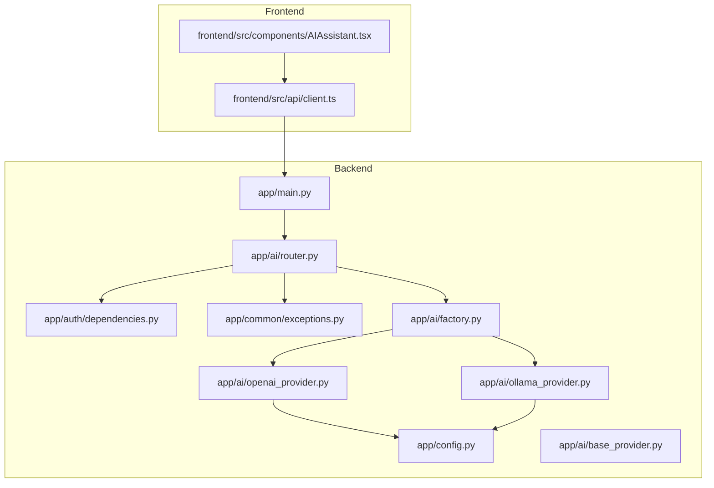
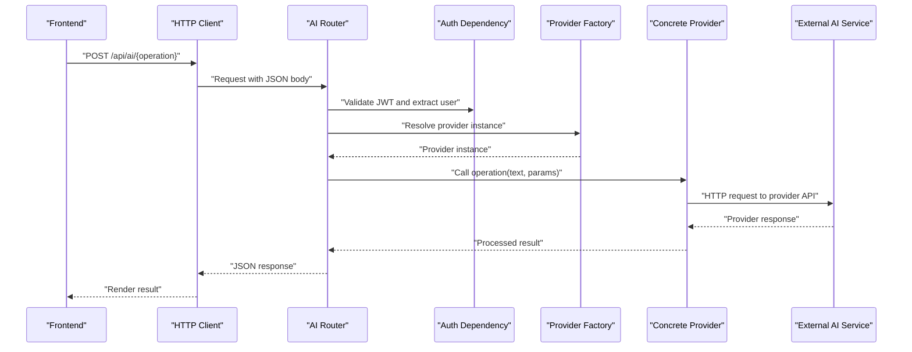
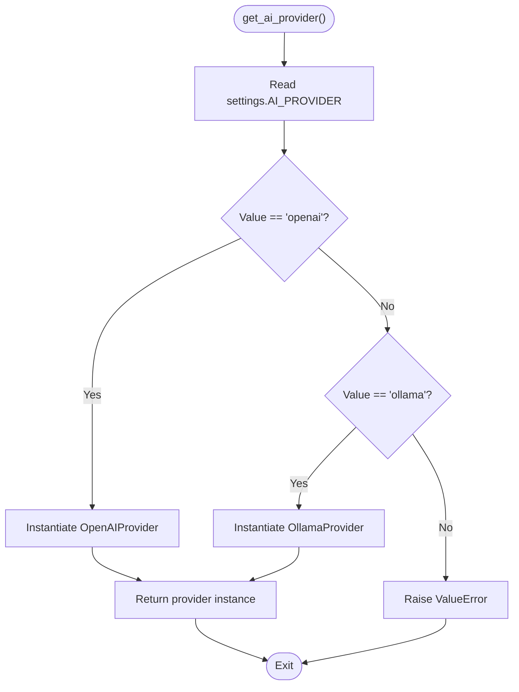
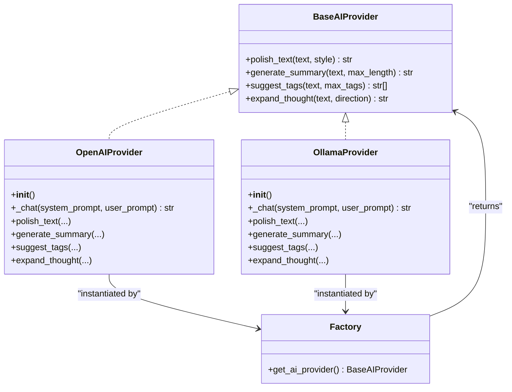

# AI Integration API

<cite>
**Referenced Files in This Document**
- [backend/app/ai/router.py](file://backend/app/ai/router.py)
- [backend/app/ai/factory.py](file://backend/app/ai/factory.py)
- [backend/app/ai/base_provider.py](file://backend/app/ai/base_provider.py)
- [backend/app/ai/openai_provider.py](file://backend/app/ai/openai_provider.py)
- [backend/app/ai/ollama_provider.py](file://backend/app/ai/ollama_provider.py)
- [backend/app/config.py](file://backend/app/config.py)
- [backend/app/auth/dependencies.py](file://backend/app/auth/dependencies.py)
- [backend/app/common/exceptions.py](file://backend/app/common/exceptions.py)
- [backend/app/main.py](file://backend/app/main.py)
- [frontend/src/components/AIAssistant.tsx](file://frontend/src/components/AIAssistant.tsx)
- [frontend/src/api/client.ts](file://frontend/src/api/client.ts)
</cite>

## Table of Contents
1. [Introduction](#introduction)
2. [Project Structure](#project-structure)
3. [Core Components](#core-components)
4. [Architecture Overview](#architecture-overview)
5. [Detailed Component Analysis](#detailed-component-analysis)
6. [Dependency Analysis](#dependency-analysis)
7. [Performance Considerations](#performance-considerations)
8. [Troubleshooting Guide](#troubleshooting-guide)
9. [Conclusion](#conclusion)
10. [Appendices](#appendices)

## Introduction
This document describes the AI integration API that powers content enhancement workflows such as text polishing, summarization, tag suggestion, and creative expansion. It covers provider selection and switching, OpenAI integration (including model selection and timeouts), Ollama local LLM support, request/response schemas, provider-specific parameters, error handling, and operational guidance for cost optimization, usage tracking, and provider health monitoring.

## Project Structure
The AI integration spans backend routes, a provider abstraction, two concrete providers (OpenAI-compatible and Ollama), configuration, authentication, and a simple frontend panel that invokes the AI endpoints.

**Diagram sources**
- [backend/app/main.py:40-89](file://backend/app/main.py#L40-L89)
- [backend/app/config.py:16-62](file://backend/app/config.py#L16-L62)
- [backend/app/auth/dependencies.py:28-67](file://backend/app/auth/dependencies.py#L28-L67)
- [backend/app/common/exceptions.py:66-87](file://backend/app/common/exceptions.py#L66-L87)
- [backend/app/ai/router.py:14-109](file://backend/app/ai/router.py#L14-L109)
- [backend/app/ai/factory.py:19-45](file://backend/app/ai/factory.py#L19-L45)
- [backend/app/ai/base_provider.py:18-82](file://backend/app/ai/base_provider.py#L18-L82)
- [backend/app/ai/openai_provider.py:25-106](file://backend/app/ai/openai_provider.py#L25-L106)
- [backend/app/ai/ollama_provider.py:23-99](file://backend/app/ai/ollama_provider.py#L23-L99)
- [frontend/src/components/AIAssistant.tsx:23-146](file://frontend/src/components/AIAssistant.tsx#L23-L146)
- [frontend/src/api/client.ts:12-63](file://frontend/src/api/client.ts#L12-L63)

**Section sources**
- [backend/app/main.py:40-89](file://backend/app/main.py#L40-L89)
- [backend/app/ai/router.py:14-109](file://backend/app/ai/router.py#L14-L109)
- [backend/app/ai/factory.py:19-45](file://backend/app/ai/factory.py#L19-L45)
- [backend/app/ai/base_provider.py:18-82](file://backend/app/ai/base_provider.py#L18-L82)
- [backend/app/ai/openai_provider.py:25-106](file://backend/app/ai/openai_provider.py#L25-L106)
- [backend/app/ai/ollama_provider.py:23-99](file://backend/app/ai/ollama_provider.py#L23-L99)
- [backend/app/config.py:16-62](file://backend/app/config.py#L16-L62)
- [frontend/src/components/AIAssistant.tsx:23-146](file://frontend/src/components/AIAssistant.tsx#L23-L146)
- [frontend/src/api/client.ts:12-63](file://frontend/src/api/client.ts#L12-L63)

## Core Components
- AI Router: Exposes four endpoints for content enhancement and returns standardized response models.
- Provider Factory: Selects and returns a concrete AI provider instance based on configuration.
- Base Provider: Defines the strategy interface for AI operations.
- OpenAI Provider: Implements AI operations against any OpenAI-compatible chat-completions API.
- Ollama Provider: Implements AI operations against a local Ollama REST API.
- Configuration: Centralizes provider selection and provider-specific settings.
- Authentication: Ensures requests are made by authenticated users.
- Frontend Panel: Demonstrates invoking AI endpoints and applying results.

Key capabilities:
- Provider switching via configuration without code changes.
- Standardized request/response schemas for all operations.
- Robust error handling with HTTP-level fallbacks.

**Section sources**
- [backend/app/ai/router.py:26-109](file://backend/app/ai/router.py#L26-L109)
- [backend/app/ai/factory.py:19-45](file://backend/app/ai/factory.py#L19-L45)
- [backend/app/ai/base_provider.py:18-82](file://backend/app/ai/base_provider.py#L18-L82)
- [backend/app/ai/openai_provider.py:25-106](file://backend/app/ai/openai_provider.py#L25-L106)
- [backend/app/ai/ollama_provider.py:23-99](file://backend/app/ai/ollama_provider.py#L23-L99)
- [backend/app/config.py:44-51](file://backend/app/config.py#L44-L51)
- [backend/app/auth/dependencies.py:28-52](file://backend/app/auth/dependencies.py#L28-L52)

## Architecture Overview
The AI integration uses a strategy pattern to decouple the API surface from provider implementations. The router depends on a provider instance resolved by the factory. Providers rely on configuration for endpoints and models.

**Diagram sources**
- [backend/app/ai/router.py:51-109](file://backend/app/ai/router.py#L51-L109)
- [backend/app/ai/factory.py:19-45](file://backend/app/ai/factory.py#L19-L45)
- [backend/app/ai/openai_provider.py:39-67](file://backend/app/ai/openai_provider.py#L39-L67)
- [backend/app/ai/ollama_provider.py:36-59](file://backend/app/ai/ollama_provider.py#L36-L59)
- [backend/app/auth/dependencies.py:28-52](file://backend/app/auth/dependencies.py#L28-L52)
- [frontend/src/api/client.ts:12-63](file://frontend/src/api/client.ts#L12-L63)

## Detailed Component Analysis

### AI Router Endpoints
The router defines four endpoints with strict request schemas and unified response models. Each endpoint delegates to the selected provider and wraps exceptions into HTTP 502 when provider operations fail.

- Endpoint: POST /api/ai/polish
  - Request: PolishRequest { text, style }
  - Response: TextResponse { result }
- Endpoint: POST /api/ai/summarize
  - Request: SummarizeRequest { text, max_length }
  - Response: TextResponse { result }
- Endpoint: POST /api/ai/suggest-tags
  - Request: SuggestTagsRequest { text, max_tags }
  - Response: TagsResponse { tags }
- Endpoint: POST /api/ai/expand
  - Request: ExpandRequest { text, direction }
  - Response: TextResponse { result }

Behavior:
- Authentication: Requires a valid access token; inactive users are rejected.
- Error handling: On provider failure, logs the error and returns HTTP 502 with a generic detail message.

**Section sources**
- [backend/app/ai/router.py:26-109](file://backend/app/ai/router.py#L26-L109)
- [backend/app/auth/dependencies.py:28-52](file://backend/app/auth/dependencies.py#L28-L52)
- [backend/app/common/exceptions.py:73-86](file://backend/app/common/exceptions.py#L73-L86)

### Provider Factory and Selection
The factory resolves a singleton provider instance based on the configured provider name. Supported values:
- "openai": OpenAIProvider
- "ollama": OllamaProvider

Unsupported values raise a configuration error.

**Diagram sources**
- [backend/app/ai/factory.py:19-45](file://backend/app/ai/factory.py#L19-L45)
- [backend/app/config.py:44-51](file://backend/app/config.py#L44-L51)

**Section sources**
- [backend/app/ai/factory.py:19-45](file://backend/app/ai/factory.py#L19-L45)
- [backend/app/config.py:44-51](file://backend/app/config.py#L44-L51)

### Base Provider Interface
Defines the contract that all providers must implement. Methods:
- polish_text(text, style)
- generate_summary(text, max_length)
- suggest_tags(text, max_tags)
- expand_thought(text, direction)

This interface enables swapping providers without changing route logic.

**Section sources**
- [backend/app/ai/base_provider.py:18-82](file://backend/app/ai/base_provider.py#L18-L82)

### OpenAI Provider
Implements the BaseAIProvider interface using an OpenAI-compatible chat-completions API. Key characteristics:
- Configuration keys: OPENAI_API_KEY, OPENAI_BASE_URL, OPENAI_MODEL
- Timeout: 60 seconds per request
- System prompts: Tailored per operation
- Tag parsing: Attempts to parse JSON-formatted tags; falls back to empty list on parse failure

Operational notes:
- Uses HTTP 200 to detect success; non-200 responses trigger a runtime error logged and surfaced as HTTP 502.
- Temperature is set to a moderate value in the internal chat helper.

**Section sources**
- [backend/app/ai/openai_provider.py:25-106](file://backend/app/ai/openai_provider.py#L25-L106)
- [backend/app/config.py:46-48](file://backend/app/config.py#L46-L48)

### Ollama Provider
Implements the BaseAIProvider interface using the local Ollama REST API. Key characteristics:
- Configuration keys: OLLAMA_BASE_URL, OLLAMA_MODEL
- Timeout: 120 seconds per request
- Stream disabled; expects a single response message
- Tag parsing: Same JSON parsing and fallback behavior as OpenAI provider

Operational notes:
- Uses HTTP 200 to detect success; non-200 responses trigger a runtime error logged and surfaced as HTTP 502.

**Section sources**
- [backend/app/ai/ollama_provider.py:23-99](file://backend/app/ai/ollama_provider.py#L23-L99)
- [backend/app/config.py:49-50](file://backend/app/config.py#L49-L50)

### Authentication and Authorization
- The router depends on a current user extracted from the Authorization header.
- Validates token type and user activity; rejects inactive users.
- Superuser checks are available via a separate dependency.

**Section sources**
- [backend/app/auth/dependencies.py:28-52](file://backend/app/auth/dependencies.py#L28-L52)
- [backend/app/ai/router.py:54-55](file://backend/app/ai/router.py#L54-L55)

### Frontend Integration
The AI assistant panel demonstrates:
- Enabling actions only when content exists
- Calling endpoints for polish, summarize, suggest-tags, and expand
- Handling loading states, errors, and rendering results
- Applying results back to editor content or summary fields
- Copying results to clipboard

**Section sources**
- [frontend/src/components/AIAssistant.tsx:23-146](file://frontend/src/components/AIAssistant.tsx#L23-L146)
- [frontend/src/api/client.ts:12-63](file://frontend/src/api/client.ts#L12-L63)

## Dependency Analysis
Provider selection and routing dependencies:

**Diagram sources**
- [backend/app/ai/base_provider.py:18-82](file://backend/app/ai/base_provider.py#L18-L82)
- [backend/app/ai/openai_provider.py:25-106](file://backend/app/ai/openai_provider.py#L25-L106)
- [backend/app/ai/ollama_provider.py:23-99](file://backend/app/ai/ollama_provider.py#L23-L99)
- [backend/app/ai/factory.py:19-45](file://backend/app/ai/factory.py#L19-L45)

Provider-to-configuration mapping:
- OpenAIProvider reads OPENAI_API_KEY, OPENAI_BASE_URL, OPENAI_MODEL
- OllamaProvider reads OLLAMA_BASE_URL, OLLAMA_MODEL

**Section sources**
- [backend/app/ai/openai_provider.py:33-36](file://backend/app/ai/openai_provider.py#L33-L36)
- [backend/app/ai/ollama_provider.py:31-33](file://backend/app/ai/ollama_provider.py#L31-L33)
- [backend/app/config.py:46-50](file://backend/app/config.py#L46-L50)

## Performance Considerations
- Timeouts:
  - OpenAIProvider: 60 seconds
  - OllamaProvider: 120 seconds
- Throughput: Requests are synchronous per call; batching is not implemented in the current API.
- Cost optimization:
  - Prefer smaller max_length for summaries to reduce token usage.
  - Limit max_tags to reduce JSON parsing overhead and downstream processing.
  - Choose lighter models for local Ollama deployments to reduce latency and resource usage.
- Resource allocation:
  - Configure OLLAMA_MODEL to match available GPU/CPU resources.
  - For OpenAI-compatible APIs, select appropriate models and base URLs to balance quality and cost.

[No sources needed since this section provides general guidance]

## Troubleshooting Guide
Common issues and resolutions:
- Authentication failures:
  - Ensure a valid access token is present in the Authorization header.
  - Verify token type is "access" and the user is active.
- Provider unavailability:
  - OpenAI/Ollama endpoints may return non-200 responses; the API surfaces HTTP 502 with a generic detail message.
  - Check provider base URLs and credentials.
- Tag parsing failures:
  - Some providers may not return JSON as expected; the API falls back to returning no tags.
- Frontend errors:
  - The AI assistant panel displays user-friendly messages and disables actions when content is empty.

Operational checks:
- Health check endpoint: GET /health returns application status.
- Logging: Provider modules log detailed errors on API failures.

**Section sources**
- [backend/app/auth/dependencies.py:28-52](file://backend/app/auth/dependencies.py#L28-L52)
- [backend/app/ai/openai_provider.py:62-66](file://backend/app/ai/openai_provider.py#L62-L66)
- [backend/app/ai/ollama_provider.py:53-59](file://backend/app/ai/ollama_provider.py#L53-L59)
- [backend/app/ai/router.py:61-63](file://backend/app/ai/router.py#L61-L63)
- [backend/app/main.py:76-89](file://backend/app/main.py#L76-L89)

## Conclusion
The AI integration provides a clean, extensible API for content enhancement with pluggable providers. By centralizing configuration and using a strategy pattern, the system supports seamless switching between OpenAI-compatible services and local Ollama models. The standardized schemas, robust error handling, and frontend integration enable practical AI-assisted writing workflows while offering room for future enhancements such as batching, usage tracking, and advanced provider health monitoring.

[No sources needed since this section summarizes without analyzing specific files]

## Appendices

### API Reference

- Base URL
  - /api/ai

- Authentication
  - Header: Authorization: Bearer <access_token>
  - Access token must be of type "access" and user must be active.

- Endpoints

  - POST /polish
    - Request schema: PolishRequest
      - text: string (required)
      - style: string (optional, default "professional")
    - Response schema: TextResponse
      - result: string
    - Errors: HTTP 502 on provider failure

  - POST /summarize
    - Request schema: SummarizeRequest
      - text: string (required)
      - max_length: integer (50 to 1000, optional, default 200)
    - Response schema: TextResponse
      - result: string
    - Errors: HTTP 502 on provider failure

  - POST /suggest-tags
    - Request schema: SuggestTagsRequest
      - text: string (required)
      - max_tags: integer (1 to 10, optional, default 5)
    - Response schema: TagsResponse
      - tags: array of string
    - Errors: HTTP 502 on provider failure

  - POST /expand
    - Request schema: ExpandRequest
      - text: string (required)
      - direction: string (optional, default "elaborate")
    - Response schema: TextResponse
      - result: string
    - Errors: HTTP 502 on provider failure

- Provider-Specific Parameters

  - OpenAIProvider
    - OPENAI_API_KEY: string
    - OPENAI_BASE_URL: string (e.g., https://api.openai.com/v1)
    - OPENAI_MODEL: string (e.g., gpt-4o)

  - OllamaProvider
    - OLLAMA_BASE_URL: string (e.g., http://localhost:11434)
    - OLLAMA_MODEL: string (e.g., llama3)

- Example Workflows

  - AI-assisted writing
    - User writes content in the editor.
    - Click "Polish" to improve clarity and style; apply result back to content.
    - Click "Summarize" to generate a concise summary; apply result to summary field.
    - Click "Suggest Tags" to propose keywords; copy or apply as needed.
    - Click "Expand" to develop ideas into a structured piece; apply result back to content.

  - Batch processing
    - Not currently supported by the API. Consider implementing a new endpoint that accepts arrays of texts and returns arrays of results.

  - Provider health monitoring
    - Use GET /health to confirm service availability.
    - Monitor provider logs for HTTP error codes and timeouts.

- Cost Optimization and Usage Tracking
  - Cost optimization
    - Reduce max_length for summaries.
    - Limit max_tags to decrease parsing overhead.
    - Choose smaller or quantized models for Ollama to lower resource usage.
  - Usage tracking
    - Not implemented in the current API. Consider adding counters per operation and provider in the provider implementations or a dedicated metrics endpoint.

**Section sources**
- [backend/app/ai/router.py:26-109](file://backend/app/ai/router.py#L26-L109)
- [backend/app/config.py:44-50](file://backend/app/config.py#L44-L50)
- [backend/app/main.py:76-89](file://backend/app/main.py#L76-L89)
- [frontend/src/components/AIAssistant.tsx:29-49](file://frontend/src/components/AIAssistant.tsx#L29-L49)