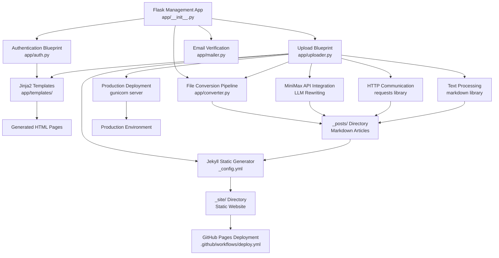
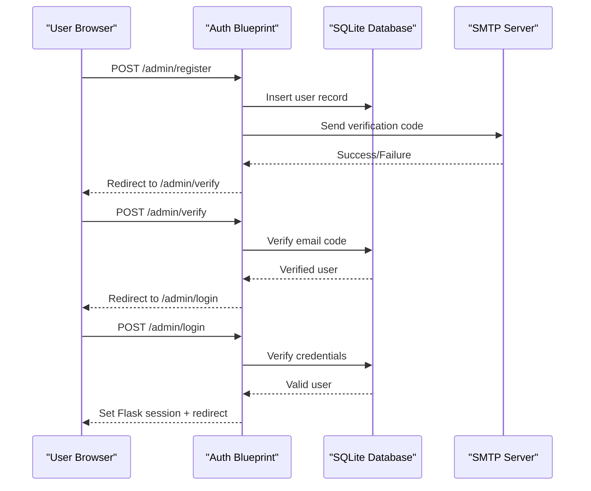
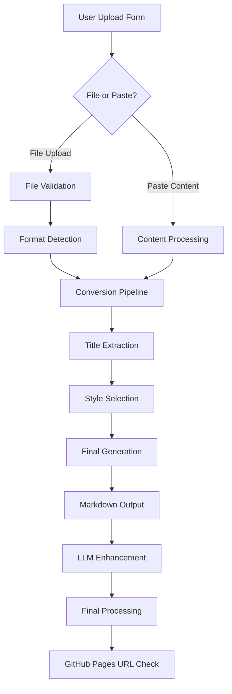
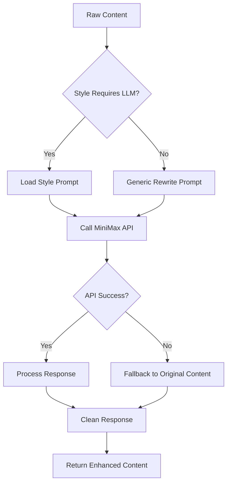
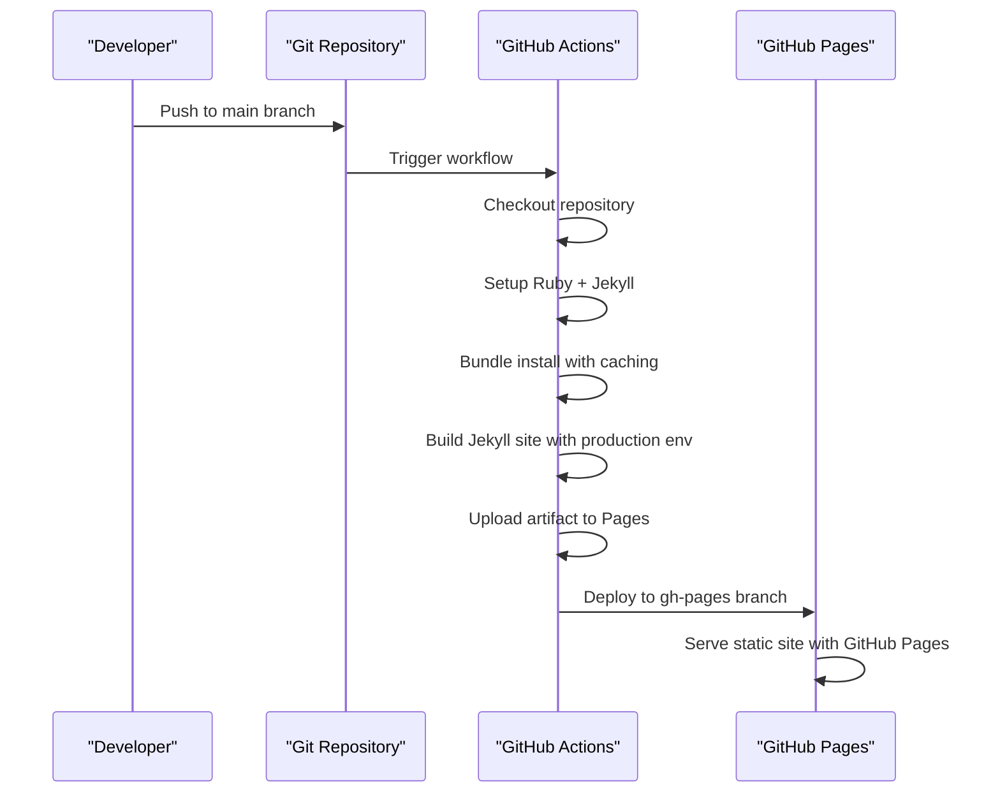

# API Reference

<cite>
**Referenced Files in This Document**
- [app/__init__.py](file://app/__init__.py)
- [app/auth.py](file://app/auth.py)
- [app/converter.py](file://app/converter.py)
- [app/uploader.py](file://app/uploader.py)
- [app/mailer.py](file://app/mailer.py)
- [app/templates/upload.html](file://app/templates/upload.html)
- [app/templates/login.html](file://app/templates/login.html)
- [app/templates/register.html](file://app/templates/register.html)
- [app/templates/articles.html](file://app/templates/articles.html)
- [app/templates/base.html](file://app/templates/base.html)
- [_config.yml](file://_config.yml)
- [.github/workflows/deploy.yml](file://.github/workflows/deploy.yml)
- [PRD.md](file://PRD.md)
- [requirements.txt](file://requirements.txt)
- [wiki.py](file://wiki.py)
</cite>

## Update Summary
**Changes Made**
- Updated to reflect enhanced file upload and processing capabilities with improved API key handling
- Added documentation for new MiniMax API integration for LLM rewriting
- Documented expanded dependency support including markdown, requests, and gunicorn libraries
- Enhanced file conversion pipeline with better text processing capabilities
- Updated deployment workflow with improved GitHub Actions configuration

## Table of Contents
1. [Introduction](#introduction)
2. [System Architecture](#system-architecture)
3. [Authentication System](#authentication-system)
4. [File Upload and Conversion Interface](#file-upload-and-conversion-interface)
5. [Blog Style Management](#blog-style-management)
6. [Article Management](#article-management)
7. [AI Integration and LLM Rewriting](#ai-integration-and-llm-rewriting)
8. [Deployment and Publishing](#deployment-and-publishing)
9. [Configuration](#configuration)
10. [Migration from REST API](#migration-from-rest-api)
11. [Troubleshooting Guide](#troubleshooting-guide)

## Introduction
This document provides comprehensive documentation for PolaZhenJing's new Flask-based management interface that replaced the previous FastAPI RESTful API. The system now operates as a lightweight Flask application with server-rendered HTML templates, integrated with Jekyll for static site generation and GitHub Actions for automated deployment. The latest enhancements include improved file upload processing capabilities, enhanced API key handling for AI integrations, and expanded dependency support for better text processing and deployment options.

**Key Changes from Previous REST API:**
- Complete removal of all REST endpoints and FastAPI backend
- Migration from JWT authentication to Flask session-based authentication
- Implementation of file conversion pipeline for multiple document formats
- Replacement of dynamic API calls with static site generation
- Integration with GitHub Actions for automated deployment to GitHub Pages
- Enhanced AI integration with MiniMax API for content rewriting
- Improved file processing with markdown, requests, and gunicorn libraries

## System Architecture
The new architecture consists of a Flask management server that handles authentication and file processing, with Jekyll generating static HTML content for publication. The system now includes enhanced AI integration capabilities and improved deployment options.

**Diagram sources**
- [app/__init__.py:43-61](file://app/__init__.py#L43-L61)
- [app/auth.py:13](file://app/auth.py#L13)
- [app/uploader.py:14](file://app/uploader.py#L14)
- [app/converter.py:1](file://app/converter.py#L1)
- [app/mailer.py](file://app/mailer.py)
- [_config.yml:1-49](file://_config.yml#L1-L49)
- [.github/workflows/deploy.yml:1-62](file://.github/workflows/deploy.yml#L1-L62)

**Section sources**
- [app/__init__.py:43-61](file://app/__init__.py#L43-L61)
- [PRD.md:143-180](file://PRD.md#L143-L180)

## Authentication System
The system uses Flask session-based authentication with SQLite for user management and QQ email SMTP verification.

### Authentication Endpoints
- **POST /admin/login** - User login with username and password
- **POST /admin/register** - User registration with QQ email verification
- **POST /admin/verify** - Email verification with 6-digit code
- **POST /admin/password** - Password change for authenticated users
- **GET /admin/logout** - Logout and clear session

### Authentication Flow

**Diagram sources**
- [app/auth.py:26-48](file://app/auth.py#L26-L48)
- [app/auth.py:51-96](file://app/auth.py#L51-L96)
- [app/auth.py:99-133](file://app/auth.py#L99-L133)
- [app/auth.py:136-167](file://app/auth.py#L136-L167)

**Section sources**
- [app/auth.py:26-167](file://app/auth.py#L26-L167)
- [PRD.md:258-280](file://PRD.md#L258-L280)

## File Upload and Conversion Interface
The upload interface supports multiple document formats with automatic conversion to Markdown and style selection. The system now includes enhanced processing capabilities with improved text handling and better error management.

### Upload Endpoints
- **GET /admin/upload** - Upload form with file upload and paste content options
- **POST /admin/upload** - Process uploaded files or pasted content
- **GET /admin/upload/style** - Style selection interface
- **POST /admin/generate** - Generate final blog post with selected style

### Supported File Formats
| Format | Extension | Processing Method |
|--------|-----------|-------------------|
| Markdown | `.md` | Direct passthrough with markdown library processing |
| PDF | `.pdf` | PyMuPDF text extraction + image extraction |
| Word | `.docx`, `.doc` | Mammoth HTML conversion + html2text |
| HTML | `.html`, `.htm` | Direct HTML to Markdown conversion using requests library |

### Upload Process Flow

**Diagram sources**
- [app/uploader.py:76-118](file://app/uploader.py#L76-L118)
- [app/converter.py:58-87](file://app/converter.py#L58-L87)

**Section sources**
- [app/uploader.py:76-210](file://app/uploader.py#L76-L210)
- [app/converter.py:1-88](file://app/converter.py#L1-L88)
- [PRD.md:40-62](file://PRD.md#L40-L62)

## Blog Style Management
The system supports 5 distinct blog styles with custom layouts and CSS. The style selection interface now includes enhanced preview capabilities and better integration with the markdown processing pipeline.

### Available Styles
1. **Deep Technical** - Code-heavy, dark-mode optimized
2. **Academic Insight** - Research paper structure, citation format
3. **Industry Vision** - Bold headlines, modern layout
4. **Friendly Explainer** - Warm storytelling, beginner-friendly
5. **Creative Visual** - Image-first, gallery presentation
6. **Literary Narrative** - Enhanced with MiniMax AI rewriting capabilities

### Style Selection Interface
The style selection page displays 5 cards with:
- Style name (Chinese + English)
- Mini preview thumbnail
- Brief description
- "Best for" recommendations
- Live content preview
- LLM enhancement capability indicator

**Section sources**
- [app/uploader.py:16-27](file://app/uploader.py#L16-L27)
- [PRD.md:64-99](file://PRD.md#L64-L99)

## Article Management
The management interface provides CRUD operations for blog posts with enhanced preview capabilities and GitHub Pages integration.

### Article Management Endpoints
- **GET /admin/articles** - List all articles with metadata and preview capabilities
- **POST /admin/articles/<filename>/delete** - Delete specific article
- **POST /admin/sync** - Sync to GitHub for deployment
- **GET /admin/api/check-pages-url** - Check GitHub Pages URL availability

### Article Metadata
Each article includes:
- Title (from front matter or extracted)
- Date (automatically generated)
- Tags (comma-separated)
- Description (optional)
- Style (selected during generation)
- Author (current user)
- GitHub Pages URL (auto-generated)
- Preview capability (local and live)

### Article List Features
- Chronological ordering (newest first)
- Style badges with color coding
- Tag-based filtering
- Action buttons (preview, edit, delete)
- Status indicators (published/local only)
- Live URL validation
- Reading time estimation

**Section sources**
- [app/uploader.py:171-187](file://app/uploader.py#L171-L187)
- [app/uploader.py:190-210](file://app/uploader.py#L190-L210)
- [PRD.md:428-470](file://PRD.md#L428-L470)

## AI Integration and LLM Rewriting
The system now includes advanced AI integration capabilities with MiniMax API for content enhancement and style-specific rewriting.

### AI Integration Features
- **MiniMax API Integration** - Enhanced content rewriting with style-specific prompts
- **Style-based LLM Rewriting** - Dedicated prompts for literary and friendly styles
- **API Key Management** - Secure environment-based API key handling
- **HTTP Communication** - Robust requests library integration for API calls
- **Error Handling** - Comprehensive fallback mechanisms for AI failures

### Supported AI Providers
- **MiniMax** - Primary provider for content rewriting and enhancement
- **Style-specific Prompts** - Custom prompts for different writing styles
- **Fallback Processing** - Graceful degradation when AI services are unavailable

### LLM Rewriting Process

**Diagram sources**
- [app/uploader.py:185-235](file://app/uploader.py#L185-L235)

**Section sources**
- [app/uploader.py:185-235](file://app/uploader.py#L185-L235)
- [PRD.md:40-62](file://PRD.md#L40-L62)

## Deployment and Publishing
The system integrates with GitHub Actions for automated deployment to GitHub Pages with enhanced build processes and improved error handling.

### Deployment Workflow

**Diagram sources**
- [.github/workflows/deploy.yml:27-62](file://.github/workflows/deploy.yml#L27-L62)

### Deployment Endpoints
- **POST /admin/sync** - Manual synchronization to GitHub
- Automatic deployment on pushes to main branch
- GitHub Pages URL validation endpoint

### GitHub Actions Features
- Auto-build on push to main branch
- Strict build validation with error reporting
- Artifact upload and deployment
- Environment configuration for GitHub Pages
- Enhanced caching for faster builds
- Production environment optimization

**Section sources**
- [.github/workflows/deploy.yml:1-62](file://.github/workflows/deploy.yml#L1-L62)
- [PRD.md:628-681](file://PRD.md#L628-L681)

## Configuration
The system uses environment variables and configuration files for customization with enhanced dependency management.

### Environment Variables
- `SECRET_KEY` - Flask application secret key
- `SMTP_HOST` - QQ email SMTP server host
- `SMTP_PORT` - SMTP server port (SSL: 465)
- `SMTP_USERNAME` - QQ email address
- `SMTP_PASSWORD` - QQ email authorization code
- `MINIMAX_TOKEN_PLAN_API_KEY` - MiniMax API key for LLM integration

### Configuration Files
- `_config.yml` - Jekyll configuration with plugins and defaults
- `Gemfile` - Ruby dependencies for Jekyll
- `requirements.txt` - Python dependencies for Flask app with enhanced libraries

### Enhanced Dependencies
The system now includes several key libraries for improved functionality:
- **markdown==3.7** - Enhanced text processing and Markdown rendering
- **requests==2.32.3** - Robust HTTP communication for API integrations
- **gunicorn==23.0.0** - Production-ready WSGI HTTP server
- **flask==3.1.0** - Latest Flask framework with improved security
- **flask-login==0.6.3** - Enhanced session management
- **PyMuPDF==1.25.3** - Advanced PDF processing capabilities
- **mammoth==1.8.0** - Improved Word document conversion
- **html2text==2024.2.26** - Enhanced HTML to Markdown conversion

### Jekyll Configuration
Key settings include:
- Site title and description
- GitHub Pages URL configuration
- Build plugins (feed, SEO, paginate)
- Default layout for posts
- Build exclusions

**Section sources**
- [app/__init__.py:46](file://app/__init__.py#L46)
- [_config.yml:1-49](file://_config.yml#L1-L49)
- [PRD.md:281-307](file://PRD.md#L281-L307)

## Migration from REST API
The system has been completely migrated from the previous FastAPI RESTful architecture to a Flask-based management interface with enhanced capabilities.

### Removed Components
- FastAPI backend with 7 modules (auth, thoughts, tags, research, ai, publish, sharing)
- PostgreSQL database with 5 tables
- JWT authentication system
- AI provider integration (OpenAI/Ollama)
- Complex routing structure
- Docker Compose deployment

### New Architecture Benefits
- **Simplified**: ~30 organized files vs. ~65+ scattered files
- **Zero-config**: SQLite instead of PostgreSQL
- **Fast**: Static site generation instead of dynamic API calls
- **Reliable**: GitHub Actions for automated deployment
- **Lightweight**: Single Flask application with Jekyll
- **Enhanced**: AI integration with MiniMax API
- **Robust**: Improved error handling and fallback mechanisms
- **Production-ready**: Gunicorn deployment support

### Migration Impact
- **Authentication**: Changed from JWT to Flask sessions
- **Content Management**: From REST endpoints to file-based Markdown
- **Publishing**: From manual export to automated GitHub Pages
- **Development**: Simplified local setup without Docker/PostgreSQL
- **AI Integration**: Enhanced with MiniMax API capabilities
- **Deployment**: Improved with production-ready server options

**Section sources**
- [PRD.md:160-180](file://PRD.md#L160-L180)
- [PRD.md:770-800](file://PRD.md#L770-L800)

## Troubleshooting Guide

### Common Issues and Solutions

#### Authentication Issues
- **Problem**: "Username not found" or "Incorrect password"
  - **Solution**: Verify credentials in SQLite database
  - **Check**: User registration completed successfully

- **Problem**: "Please verify your email first"
  - **Solution**: Complete email verification process
  - **Check**: Verification code expiration (5 minutes)

#### Upload Issues
- **Problem**: "Unsupported file type"
  - **Solution**: Use supported formats (.md, .pdf, .docx, .html)
  - **Check**: File extension validation

- **Problem**: "Conversion error"
  - **Solution**: Install required dependencies (PyMuPDF, mammoth, html2text)
  - **Check**: Library availability in environment

- **Problem**: "LLM rewrite failed"
  - **Solution**: Check MiniMax API key configuration and network connectivity
  - **Check**: Environment variable MINIMAX_TOKEN_PLAN_API_KEY

#### Style Selection Issues
- **Problem**: No style preview available
  - **Solution**: Ensure Jekyll layouts are properly configured
  - **Check**: CSS files in assets/css/ directory

#### AI Integration Issues
- **Problem**: "MINIMAX_TOKEN_PLAN_API_KEY not found"
  - **Solution**: Configure environment variable with valid API key
  - **Check**: .env file or system environment variables

- **Problem**: "API request timeout"
  - **Solution**: Check network connectivity and API service status
  - **Check**: Timeout settings and retry logic

#### Deployment Issues
- **Problem**: "Push failed: Permission denied"
  - **Solution**: Configure Git remote and authentication
  - **Check**: SSH key or GitHub token setup

- **Problem**: "GitHub Pages deployment failed"
  - **Solution**: Check GitHub Actions logs for build errors
  - **Check**: Jekyll configuration and dependencies

- **Problem**: "Gunicorn server startup failed"
  - **Solution**: Verify Python dependencies and port availability
  - **Check**: requirements.txt installation and port configuration

**Section sources**
- [app/auth.py:34-48](file://app/auth.py#L34-L48)
- [app/uploader.py:84-100](file://app/uploader.py#L84-L100)
- [app/uploader.py:195-209](file://app/uploader.py#L195-L209)
- [app/uploader.py:189-191](file://app/uploader.py#L189-L191)
- [app/uploader.py:220-234](file://app/uploader.py#L220-L234)