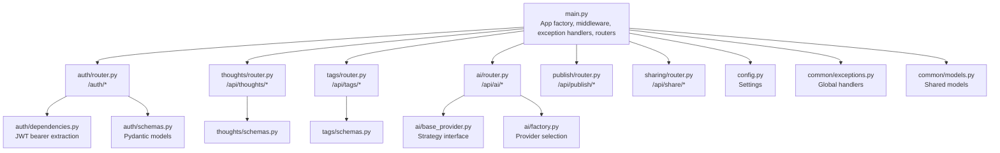
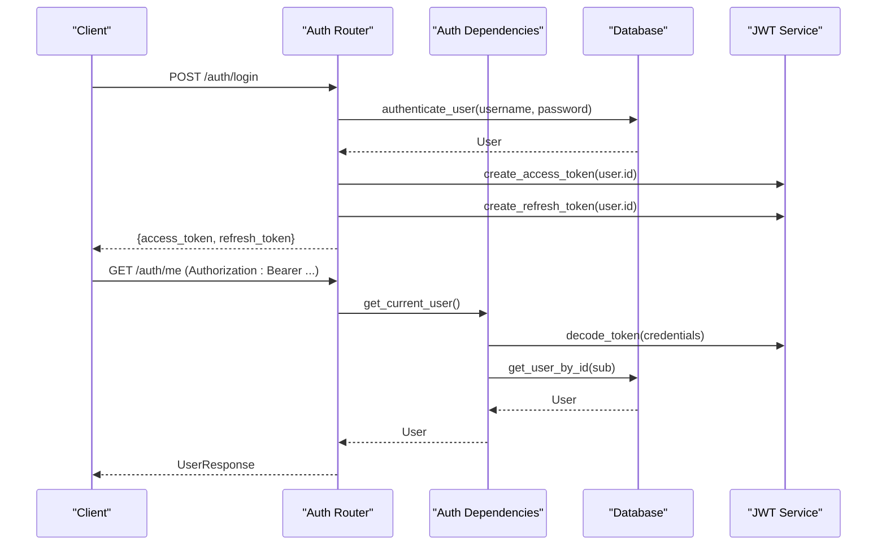
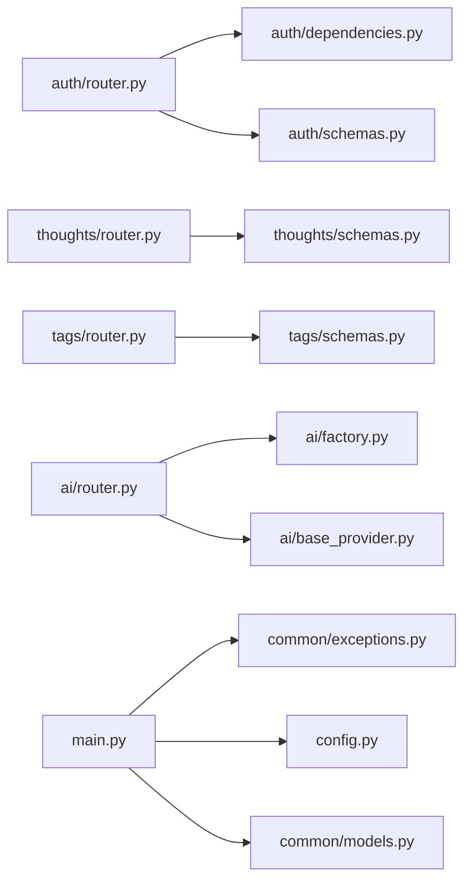

# API Reference

<cite>
**Referenced Files in This Document**
- [backend/app/main.py](file://backend/app/main.py)
- [backend/app/auth/router.py](file://backend/app/auth/router.py)
- [backend/app/auth/schemas.py](file://backend/app/auth/schemas.py)
- [backend/app/auth/dependencies.py](file://backend/app/auth/dependencies.py)
- [backend/app/thoughts/router.py](file://backend/app/thoughts/router.py)
- [backend/app/thoughts/schemas.py](file://backend/app/thoughts/schemas.py)
- [backend/app/tags/router.py](file://backend/app/tags/router.py)
- [backend/app/tags/schemas.py](file://backend/app/tags/schemas.py)
- [backend/app/ai/router.py](file://backend/app/ai/router.py)
- [backend/app/ai/base_provider.py](file://backend/app/ai/base_provider.py)
- [backend/app/ai/factory.py](file://backend/app/ai/factory.py)
- [backend/app/publish/router.py](file://backend/app/publish/router.py)
- [backend/app/sharing/router.py](file://backend/app/sharing/router.py)
- [backend/app/common/exceptions.py](file://backend/app/common/exceptions.py)
- [backend/app/common/models.py](file://backend/app/common/models.py)
- [backend/app/config.py](file://backend/app/config.py)
</cite>

## Table of Contents
1. [Introduction](#introduction)
2. [Project Structure](#project-structure)
3. [Core Components](#core-components)
4. [Architecture Overview](#architecture-overview)
5. [Detailed Component Analysis](#detailed-component-analysis)
6. [Dependency Analysis](#dependency-analysis)
7. [Performance Considerations](#performance-considerations)
8. [Troubleshooting Guide](#troubleshooting-guide)
9. [Conclusion](#conclusion)
10. [Appendices](#appendices)

## Introduction
This document provides a comprehensive API reference for PolaZhenJing’s backend REST endpoints. It covers:
- Authentication API (register, login, refresh, profile)
- Thought management API (CRUD, filtering, pagination)
- Tag system API (CRUD, counts)
- AI integration API (content polishing, summarization, tag suggestions, expansion)
- Publishing API (export to Markdown and build MkDocs site)
- Sharing API (platform-specific share links and metadata)

Each endpoint specifies HTTP method, URL pattern, request/response schemas, authentication requirements, and error handling behavior. Practical examples and integration guidelines are included to help developers integrate with the backend effectively.

## Project Structure
The backend is a FastAPI application that wires together modular routers for each functional domain. Global middleware and exception handlers are registered at startup. Configuration is centralized via environment-driven settings.

**Diagram sources**
- [backend/app/main.py:39-71](file://backend/app/main.py#L39-L71)
- [backend/app/auth/router.py:34-90](file://backend/app/auth/router.py#L34-L90)
- [backend/app/thoughts/router.py:33-114](file://backend/app/thoughts/router.py#L33-L114)
- [backend/app/tags/router.py:28-71](file://backend/app/tags/router.py#L28-L71)
- [backend/app/ai/router.py:23-108](file://backend/app/ai/router.py#L23-L108)
- [backend/app/publish/router.py:23-63](file://backend/app/publish/router.py#L23-L63)
- [backend/app/sharing/router.py:22-45](file://backend/app/sharing/router.py#L22-L45)
- [backend/app/auth/dependencies.py:27-51](file://backend/app/auth/dependencies.py#L27-L51)
- [backend/app/auth/schemas.py:19-56](file://backend/app/auth/schemas.py#L19-L56)
- [backend/app/thoughts/schemas.py:20-64](file://backend/app/thoughts/schemas.py#L20-L64)
- [backend/app/tags/schemas.py:18-45](file://backend/app/tags/schemas.py#L18-L45)
- [backend/app/ai/base_provider.py:16-79](file://backend/app/ai/base_provider.py#L16-L79)
- [backend/app/ai/factory.py:18-43](file://backend/app/ai/factory.py#L18-L43)
- [backend/app/config.py:15-60](file://backend/app/config.py#L15-L60)
- [backend/app/common/exceptions.py:66-86](file://backend/app/common/exceptions.py#L66-L86)
- [backend/app/common/models.py:41-75](file://backend/app/common/models.py#L41-L75)

**Section sources**
- [backend/app/main.py:39-87](file://backend/app/main.py#L39-L87)

## Core Components
- Authentication: JWT-based access/refresh tokens, protected routes via bearer scheme.
- Thought Management: Full CRUD with filtering, pagination, and status transitions.
- Tag System: Create/update/delete tags; list with usage counts.
- AI Integration: Pluggable provider strategy supporting OpenAI and Ollama-compatible APIs.
- Publishing: Export individual thoughts to Markdown and trigger MkDocs builds.
- Sharing: Generate platform-specific share links and Open Graph metadata.

**Section sources**
- [backend/app/auth/router.py:37-90](file://backend/app/auth/router.py#L37-L90)
- [backend/app/thoughts/router.py:36-114](file://backend/app/thoughts/router.py#L36-L114)
- [backend/app/tags/router.py:31-71](file://backend/app/tags/router.py#L31-L71)
- [backend/app/ai/router.py:51-108](file://backend/app/ai/router.py#L51-L108)
- [backend/app/publish/router.py:36-63](file://backend/app/publish/router.py#L36-L63)
- [backend/app/sharing/router.py:25-45](file://backend/app/sharing/router.py#L25-L45)

## Architecture Overview
The API follows a layered architecture:
- Routers define endpoints and bind to Pydantic schemas.
- Dependencies enforce authentication and authorization.
- Services encapsulate business logic.
- Providers implement pluggable AI strategies.
- Global exception handlers standardize error responses.

**Diagram sources**
- [backend/app/auth/router.py:56-90](file://backend/app/auth/router.py#L56-L90)
- [backend/app/auth/dependencies.py:27-51](file://backend/app/auth/dependencies.py#L27-L51)
- [backend/app/auth/schemas.py:34-56](file://backend/app/auth/schemas.py#L34-L56)

## Detailed Component Analysis

### Authentication API
- Base path: /auth
- Authentication requirement: Not required for register and login; required for /me and protected endpoints in other routers.

Endpoints
- POST /auth/register
  - Description: Register a new user.
  - Request: RegisterRequest
  - Response: UserResponse
  - Status: 201 Created
  - Example request body:
    - username: string (min length 3, max 64)
    - email: string (valid email)
    - password: string (min length 8, max 128)
    - display_name: string | null (max 128)
  - Example response body:
    - id: uuid
    - username: string
    - email: string
    - display_name: string | null
    - is_active: boolean
    - is_superuser: boolean
    - created_at: datetime (ISO 8601)

- POST /auth/login
  - Description: Authenticate and receive access/refresh tokens.
  - Request: LoginRequest
  - Response: TokenResponse
  - Status: 200 OK
  - Example request body:
    - username: string (username or email)
    - password: string
  - Example response body:
    - access_token: string
    - refresh_token: string
    - token_type: string ("bearer")

- POST /auth/refresh
  - Description: Exchange a valid refresh token for a new token pair.
  - Request: RefreshRequest
  - Response: TokenResponse
  - Status: 200 OK
  - Validation: Requires a valid refresh token (type: "refresh").
  - Error: 401 Unauthorized if token type is invalid.

- GET /auth/me
  - Description: Get the current authenticated user profile.
  - Authentication: Required (Bearer access token).
  - Response: UserResponse
  - Status: 200 OK

Authentication and Authorization
- Access tokens are validated by extracting the Authorization header, decoding the JWT, and verifying the token type is "access". Deactivated users are rejected.
- Refresh tokens must have type "refresh" to be accepted.

Common use cases
- First-time setup: POST /auth/register, then POST /auth/login.
- Session management: Use POST /auth/refresh periodically to renew tokens.
- Profile retrieval: GET /auth/me after login.

Integration guidelines
- Set Authorization header to "Bearer <access_token>" for protected endpoints.
- Store tokens securely; rotate refresh tokens periodically.

**Section sources**
- [backend/app/auth/router.py:37-90](file://backend/app/auth/router.py#L37-L90)
- [backend/app/auth/schemas.py:19-56](file://backend/app/auth/schemas.py#L19-L56)
- [backend/app/auth/dependencies.py:27-51](file://backend/app/auth/dependencies.py#L27-L51)
- [backend/app/common/exceptions.py:44-55](file://backend/app/common/exceptions.py#L44-L55)

### Thought Management API
- Base path: /api/thoughts
- Authentication requirement: Required for all endpoints.

Endpoints
- GET /api/thoughts
  - Description: List thoughts with optional filters and pagination.
  - Query parameters:
    - category: string | null
    - tag: string | null (filter by tag slug)
    - search: string | null (full-text search)
    - status: string | null
    - page: int (default 1, min 1)
    - page_size: int (default 20, min 1, max 100)
  - Response: ThoughtListResponse
  - Status: 200 OK

- POST /api/thoughts
  - Description: Create a new thought.
  - Request: ThoughtCreate
  - Response: ThoughtResponse
  - Status: 201 Created
  - Fields:
    - title: string (required, 1–256 chars)
    - content: string (optional)
    - summary: string | null (optional)
    - category: string | null (max 64)
    - status: string (default "draft"; allowed: draft, published, archived)
    - tag_ids: list[uuid] (optional)

- GET /api/thoughts/{thought_id}
  - Description: Retrieve a single thought by ID.
  - Path parameter: thought_id (uuid)
  - Response: ThoughtResponse
  - Status: 200 OK

- PATCH /api/thoughts/{thought_id}
  - Description: Partially update a thought.
  - Path parameter: thought_id (uuid)
  - Request: ThoughtUpdate (all fields optional)
  - Response: ThoughtResponse
  - Status: 200 OK

- DELETE /api/thoughts/{thought_id}
  - Description: Delete a thought.
  - Path parameter: thought_id (uuid)
  - Status: 204 No Content

Response schema highlights
- ThoughtResponse includes tags, author_id, timestamps, and computed slug.
- ThoughtListResponse includes pagination metadata.

Common use cases
- Bulk browsing: GET /api/thoughts with filters and page/page_size.
- Draft-to-publish workflow: create with status=draft, update content, then PATCH to status=published.
- Tag association: pass tag_ids during create/update.

Integration guidelines
- Always include Authorization: Bearer <access_token>.
- Use tag slugs for filtering; fetch tags from /api/tags to discover available slugs.

**Section sources**
- [backend/app/thoughts/router.py:36-114](file://backend/app/thoughts/router.py#L36-L114)
- [backend/app/thoughts/schemas.py:20-64](file://backend/app/thoughts/schemas.py#L20-L64)

### Tag System API
- Base path: /api/tags
- Authentication requirement: Required for create/update/delete; listing is public.

Endpoints
- GET /api/tags
  - Description: List all tags with usage counts.
  - Response: list[TagWithCountResponse]
  - Status: 200 OK

- POST /api/tags
  - Description: Create a new tag.
  - Request: TagCreate
  - Response: TagResponse
  - Status: 201 Created
  - Fields:
    - name: string (1–64 chars)
    - color: string | null (pattern: #RRGGBB)

- GET /api/tags/{tag_id}
  - Description: Retrieve a single tag by ID.
  - Path parameter: tag_id (uuid)
  - Response: TagResponse
  - Status: 200 OK

- PATCH /api/tags/{tag_id}
  - Description: Update tag name or color.
  - Path parameter: tag_id (uuid)
  - Request: TagUpdate
  - Response: TagResponse
  - Status: 200 OK

- DELETE /api/tags/{tag_id}
  - Description: Delete a tag.
  - Path parameter: tag_id (uuid)
  - Status: 204 No Content

Response schema highlights
- TagWithCountResponse extends TagResponse with thought_count.

Common use cases
- Pre-populate tag selector: GET /api/tags to load available tags.
- Assign tags to thoughts: include tag_ids in ThoughtCreate/ThoughtUpdate.
- Organize content: create descriptive tags with optional colors.

Integration guidelines
- Use TagWithCountResponse to inform tag popularity and avoid unused tags.

**Section sources**
- [backend/app/tags/router.py:31-71](file://backend/app/tags/router.py#L31-L71)
- [backend/app/tags/schemas.py:18-45](file://backend/app/tags/schemas.py#L18-L45)

### AI Integration API
- Base path: /api/ai
- Authentication requirement: Required.
- Provider selection: Configured via settings.AI_PROVIDER; supported values include "openai" and "ollama".

Endpoints
- POST /api/ai/polish
  - Description: Polish/rephrase text for clarity and style.
  - Request: PolishRequest
    - text: string (required, min length 1)
    - style: string (default "professional")
  - Response: TextResponse
    - result: string
  - Status: 200 OK
  - Error: 502 Bad Gateway if provider fails.

- POST /api/ai/summarize
  - Description: Generate a concise summary.
  - Request: SummarizeRequest
    - text: string (required, min length 1)
    - max_length: int (default 200, range 50–1000)
  - Response: TextResponse
  - Status: 200 OK
  - Error: 502 Bad Gateway if provider fails.

- POST /api/ai/suggest-tags
  - Description: Suggest relevant tags for the given text.
  - Request: SuggestTagsRequest
    - text: string (required, min length 1)
    - max_tags: int (default 5, range 1–10)
  - Response: TagsResponse
    - tags: list[string]
  - Status: 200 OK
  - Error: 502 Bad Gateway if provider fails.

- POST /api/ai/expand
  - Description: Expand a brief thought into a fuller piece.
  - Request: ExpandRequest
    - text: string (required, min length 1)
    - direction: string (default "elaborate")
  - Response: TextResponse
  - Status: 200 OK
  - Error: 502 Bad Gateway if provider fails.

Provider interface
- BaseAIProvider defines four abstract methods: polish_text, generate_summary, suggest_tags, expand_thought.
- Factory resolves provider based on settings.AI_PROVIDER.

Common use cases
- Improve writing quality: POST /api/ai/polish before publishing.
- Auto-generate summaries: POST /api/ai/summarize for quick previews.
- Discover tags: POST /api/ai/suggest-tags to enrich thoughts.
- Brainstorm expansion: POST /api/ai/expand to develop ideas.

Integration guidelines
- Configure AI provider and credentials via environment variables (see Configuration).
- Handle 502 responses gracefully; retry or notify users when AI service is unavailable.

**Section sources**
- [backend/app/ai/router.py:51-108](file://backend/app/ai/router.py#L51-L108)
- [backend/app/ai/base_provider.py:16-79](file://backend/app/ai/base_provider.py#L16-L79)
- [backend/app/ai/factory.py:18-43](file://backend/app/ai/factory.py#L18-L43)
- [backend/app/config.py:43-49](file://backend/app/config.py#L43-L49)

### Publishing API
- Base path: /api/publish
- Authentication requirement: Required.

Endpoints
- POST /api/publish/{thought_id}
  - Description: Publish a thought as a Markdown file in the MkDocs docs/ directory. Thought must be in PUBLISHED status.
  - Path parameter: thought_id (uuid)
  - Response: PublishResponse
    - message: string
    - file_path: string | null
  - Status: 200 OK

- POST /api/publish/build
  - Description: Trigger a full MkDocs site build.
  - Response: BuildResponse
    - success: boolean
    - message: string
  - Status: 200 OK

Common use cases
- One-click publishing: After setting status=published, POST /api/publish/{id} to export Markdown.
- Site regeneration: POST /api/publish/build to rebuild the static site.

Integration guidelines
- Ensure MkDocs project path and base URL are configured correctly.
- Verify that the thought’s status is PUBLISHED before publishing.

**Section sources**
- [backend/app/publish/router.py:36-63](file://backend/app/publish/router.py#L36-L63)

### Sharing API
- Base path: /api/share
- Authentication requirement: Required.

Endpoint
- GET /api/share/{thought_id}
  - Description: Generate share URLs and Open Graph metadata for the given thought.
  - Path parameter: thought_id (uuid)
  - Response: Platform-specific share links and metadata (returned as a JSON object)
  - Status: 200 OK
  - Behavior: Returns platform-specific share links (e.g., X, Weibo, Xiaohongshu), Open Graph tags, and a pre-formatted share text for clipboard.

Common use cases
- Cross-platform distribution: Use the returned metadata to post to social networks.
- Copy-and-paste sharing: Use the pre-formatted text for quick sharing.

Integration guidelines
- Combine returned metadata with your frontend share dialog component.

**Section sources**
- [backend/app/sharing/router.py:25-45](file://backend/app/sharing/router.py#L25-L45)

## Dependency Analysis
Key dependencies and relationships:
- Routers depend on Pydantic schemas for request/response validation.
- Authentication depends on bearer token extraction and JWT decoding.
- AI endpoints depend on a pluggable provider resolved by the factory.
- Global exception handlers unify error responses across the app.
- Configuration drives JWT secrets, AI provider selection, and site settings.

**Diagram sources**
- [backend/app/auth/router.py:34-90](file://backend/app/auth/router.py#L34-L90)
- [backend/app/auth/dependencies.py:27-51](file://backend/app/auth/dependencies.py#L27-L51)
- [backend/app/thoughts/router.py:33-114](file://backend/app/thoughts/router.py#L33-L114)
- [backend/app/tags/router.py:28-71](file://backend/app/tags/router.py#L28-L71)
- [backend/app/ai/router.py:23-108](file://backend/app/ai/router.py#L23-L108)
- [backend/app/ai/factory.py:18-43](file://backend/app/ai/factory.py#L18-L43)
- [backend/app/ai/base_provider.py:16-79](file://backend/app/ai/base_provider.py#L16-L79)
- [backend/app/main.py:54-56](file://backend/app/main.py#L54-L56)
- [backend/app/common/exceptions.py:66-86](file://backend/app/common/exceptions.py#L66-L86)
- [backend/app/config.py:15-60](file://backend/app/config.py#L15-L60)
- [backend/app/common/models.py:41-75](file://backend/app/common/models.py#L41-L75)

**Section sources**
- [backend/app/main.py:54-56](file://backend/app/main.py#L54-L56)
- [backend/app/common/exceptions.py:66-86](file://backend/app/common/exceptions.py#L66-L86)

## Performance Considerations
- Pagination: Use page and page_size parameters to limit response sizes (max page_size is 100).
- Filtering: Apply category, tag slug, status, and search filters to reduce database load.
- AI calls: Expect latency and potential 502 responses; implement retries and fallbacks.
- Token reuse: Prefer refresh tokens to minimize re-authentication overhead.
- Database connections: Leverage the shared async session dependency to avoid connection thrashing.

## Troubleshooting Guide
Common errors and resolutions
- 400 Bad Request
  - Cause: Invalid request payload (e.g., field length violations).
  - Resolution: Validate inputs against schema constraints (min/max lengths, patterns).

- 401 Unauthorized
  - Cause: Missing or invalid Authorization header; token type mismatch; deactivated user.
  - Resolution: Ensure Bearer access token is present and valid; refresh if expired.

- 403 Forbidden
  - Cause: Insufficient privileges (e.g., attempting privileged operations without superuser role).
  - Resolution: Verify user permissions.

- 404 Not Found
  - Cause: Resource does not exist (e.g., thought_id or tag_id).
  - Resolution: Confirm resource identifiers.

- 409 Conflict
  - Cause: Resource conflict (e.g., unique constraint violation).
  - Resolution: Adjust inputs to avoid duplicates.

- 502 Bad Gateway (AI endpoints)
  - Cause: AI provider service unavailable or unreachable.
  - Resolution: Retry later or switch provider; check provider configuration.

Operational checks
- Health endpoint: GET /health for basic system status.
- Logging: Enable debug mode via configuration for detailed logs.

**Section sources**
- [backend/app/common/exceptions.py:30-63](file://backend/app/common/exceptions.py#L30-L63)
- [backend/app/auth/dependencies.py:38-51](file://backend/app/auth/dependencies.py#L38-L51)
- [backend/app/ai/router.py:61-63](file://backend/app/ai/router.py#L61-L63)

## Conclusion
PolaZhenJing’s API provides a cohesive set of endpoints for authentication, thought and tag management, AI-assisted content enhancement, publishing, and cross-platform sharing. By following the documented schemas, authentication requirements, and error handling patterns, integrators can build robust clients and automate workflows around personal knowledge management and publishing.

## Appendices

### Authentication and Token Management
- Access token lifetime and refresh token lifetime are configurable.
- Token type validation ensures access vs. refresh usage.
- Refresh endpoints require a valid refresh token with type "refresh".

**Section sources**
- [backend/app/auth/router.py:70-84](file://backend/app/auth/router.py#L70-L84)
- [backend/app/auth/dependencies.py:41-43](file://backend/app/auth/dependencies.py#L41-L43)
- [backend/app/config.py:37-41](file://backend/app/config.py#L37-L41)

### Configuration Options
Key environment-driven settings:
- JWT: secret, algorithm, access/refresh lifetimes
- AI: provider, OpenAI/Ollama base URLs and models
- Site: base URL and MkDocs project path
- CORS: allowed origins

**Section sources**
- [backend/app/config.py:37-56](file://backend/app/config.py#L37-L56)