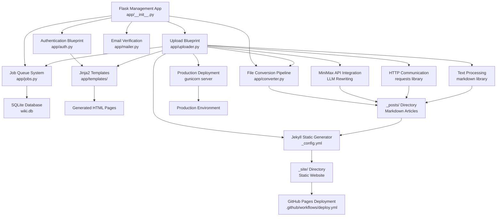
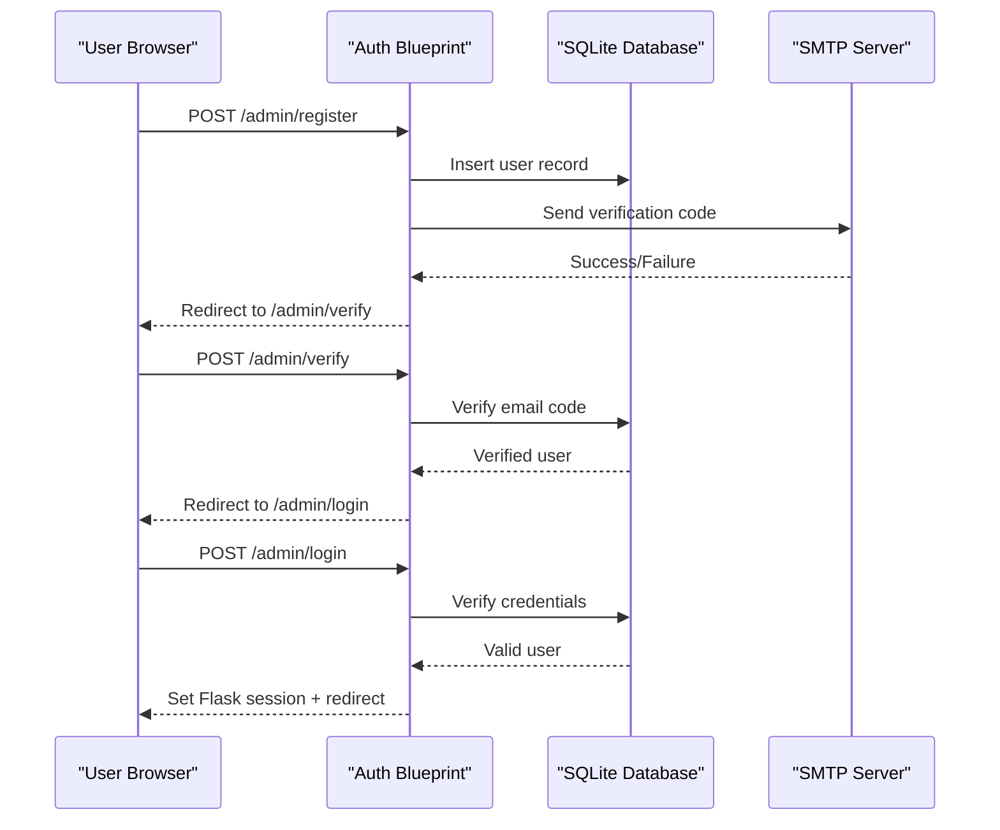
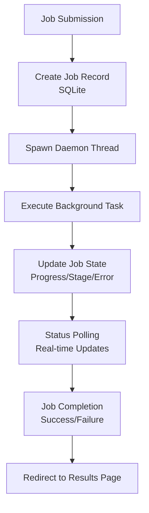
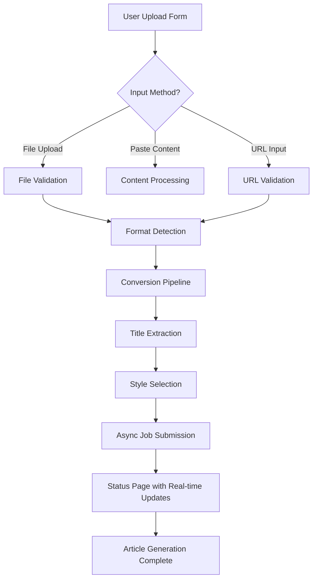
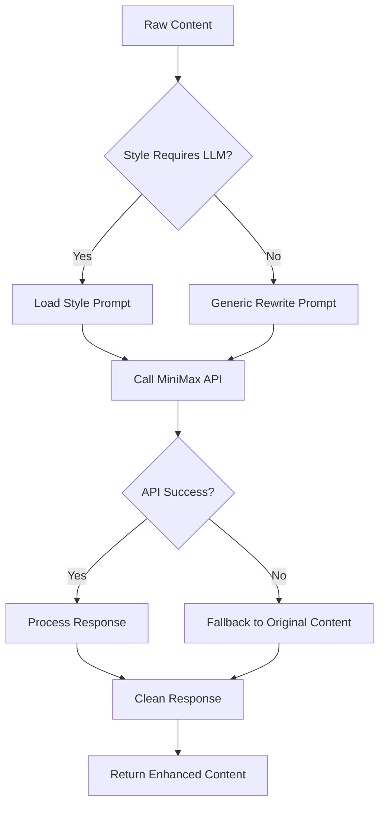
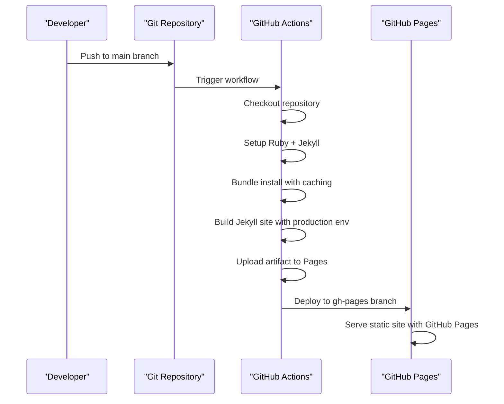

# API Reference

<cite>
**Referenced Files in This Document**
- [app/__init__.py](file://app/__init__.py)
- [app/auth.py](file://app/auth.py)
- [app/converter.py](file://app/converter.py)
- [app/uploader.py](file://app/uploader.py)
- [app/jobs.py](file://app/jobs.py)
- [app/mailer.py](file://app/mailer.py)
- [app/templates/upload.html](file://app/templates/upload.html)
- [app/templates/status.html](file://app/templates/status.html)
- [app/templates/articles.html](file://app/templates/articles.html)
- [app/templates/login.html](file://app/templates/login.html)
- [app/templates/register.html](file://app/templates/register.html)
- [app/templates/base.html](file://app/templates/base.html)
- [_config.yml](file://_config.yml)
- [.github/workflows/deploy.yml](file://.github/workflows/deploy.yml)
- [PRD.md](file://PRD.md)
- [requirements.txt](file://requirements.txt)
- [wiki.py](file://wiki.py)
</cite>

## Update Summary
**Changes Made**
- Added comprehensive documentation for new asynchronous job processing system with SQLite-backed job queue
- Enhanced upload interface documentation with URL input capability and anti-bot protection
- Documented new status monitoring APIs for real-time job progress tracking
- Updated authentication system documentation to reflect Flask session-based approach
- Expanded AI integration documentation with MiniMax API capabilities
- Enhanced deployment workflow documentation with GitHub Actions improvements

## Table of Contents
1. [Introduction](#introduction)
2. [System Architecture](#system-architecture)
3. [Authentication System](#authentication-system)
4. [Asynchronous Job Processing System](#asynchronous-job-processing-system)
5. [Enhanced Upload Interface](#enhanced-upload-interface)
6. [Status Monitoring APIs](#status-monitoring-apis)
7. [Article Management](#article-management)
8. [AI Integration and LLM Rewriting](#ai-integration-and-llm-rewriting)
9. [Deployment and Publishing](#deployment-and-publishing)
10. [Configuration](#configuration)
11. [Migration from REST API](#migration-from-rest-api)
12. [Troubleshooting Guide](#troubleshooting-guide)

## Introduction
This document provides comprehensive documentation for PolaZhenJing's new Flask-based management interface that replaced the previous FastAPI RESTful API. The system now operates as a lightweight Flask application with server-rendered HTML templates, integrated with Jekyll for static site generation and GitHub Actions for automated deployment. The latest enhancements include a robust asynchronous job processing system, enhanced file upload processing capabilities with URL input support, improved API key handling for AI integrations, and expanded dependency support for better text processing and deployment options.

**Key Changes from Previous REST API:**
- Complete removal of all REST endpoints and FastAPI backend
- Migration from JWT authentication to Flask session-based authentication
- Implementation of asynchronous job processing with SQLite-backed queue
- Enhanced upload interface with URL input capability and anti-bot protection
- Real-time status monitoring APIs for job progress tracking
- Implementation of file conversion pipeline for multiple document formats
- Replacement of dynamic API calls with static site generation
- Integration with GitHub Actions for automated deployment to GitHub Pages
- Enhanced AI integration with MiniMax API for content rewriting
- Improved file processing with markdown, requests, and gunicorn libraries

## System Architecture
The new architecture consists of a Flask management server that handles authentication and file processing, with Jekyll generating static HTML content for publication. The system now includes enhanced AI integration capabilities, asynchronous job processing, and improved deployment options.


```mermaid
graph TB
FlaskApp["Flask Management App<br/>app/__init__.py"] --> AuthBP["Authentication Blueprint<br/>app/auth.py"]
FlaskApp --> UploadBP["Upload Blueprint<br/>app/uploader.py"]
FlaskApp --> Jobs["Job Queue System<br/>app/jobs.py"]
FlaskApp --> Converter["File Conversion Pipeline<br/>app/converter.py"]
FlaskApp --> Mailer["Email Verification<br/>app/mailer.py"]
AuthBP --> Templates["Jinja2 Templates<br/>app/templates/"]
UploadBP --> Templates
UploadBP --> Jobs
UploadBP --> Converter
UploadBP --> MiniMax["MiniMax API Integration<br/>LLM Rewriting"]
UploadBP --> RequestsLib["HTTP Communication<br/>requests library"]
UploadBP --> MarkdownLib["Text Processing<br/>markdown library"]
UploadBP --> Gunicorn["Production Deployment<br/>gunicorn server"]
UploadBP --> Jekyll["Jekyll Static Generator<br/>_config.yml"]
Jobs --> SQLite["SQLite Database<br/>wiki.db"]
Templates --> HTML["Generated HTML Pages"]
Converter --> Posts["_posts/ Directory<br/>Markdown Articles"]
MiniMax --> Posts
RequestsLib --> Posts
MarkdownLib --> Posts
Gunicorn --> Production["Production Environment"]
Posts --> Jekyll
Jekyll --> Site["_site/ Directory<br/>Static Website"]
Site --> GitHubPages["GitHub Pages Deployment<br/>.github/workflows/deploy.yml"]
```

**Diagram sources**
- [app/__init__.py:43-61](file://app/__init__.py#L43-L61)
- [app/auth.py:13](file://app/auth.py#L13)
- [app/uploader.py:14](file://app/uploader.py#L14)
- [app/jobs.py:12](file://app/jobs.py#L12)
- [app/converter.py:1](file://app/converter.py#L1)
- [app/mailer.py](file://app/mailer.py)
- [_config.yml:1-49](file://_config.yml#L1-L49)
- [.github/workflows/deploy.yml:1-62](file://.github/workflows/deploy.yml#L1-L62)

**Section sources**
- [app/__init__.py:43-61](file://app/__init__.py#L43-L61)
- [PRD.md:143-180](file://PRD.md#L143-L180)

## Authentication System
The system uses Flask session-based authentication with SQLite for user management and QQ email SMTP verification.

### Authentication Endpoints
- **POST /admin/login** - User login with username and password
- **POST /admin/register** - User registration with QQ email verification
- **POST /admin/verify** - Email verification with 6-digit code
- **POST /admin/password** - Password change for authenticated users
- **GET /admin/logout** - Logout and clear session

### Authentication Flow

```mermaid
sequenceDiagram
participant User as "User Browser"
participant Auth as "Auth Blueprint"
participant DB as "SQLite Database"
participant Mail as "SMTP Server"
User->>Auth : POST /admin/register
Auth->>DB : Insert user record
Auth->>Mail : Send verification code
Mail-->>Auth : Success/Failure
Auth-->>User : Redirect to /admin/verify
User->>Auth : POST /admin/verify
Auth->>DB : Verify email code
DB-->>Auth : Verified user
Auth-->>User : Redirect to /admin/login
User->>Auth : POST /admin/login
Auth->>DB : Verify credentials
DB-->>Auth : Valid user
Auth-->>User : Set Flask session + redirect
```

**Diagram sources**
- [app/auth.py:26-48](file://app/auth.py#L26-L48)
- [app/auth.py:51-96](file://app/auth.py#L51-L96)
- [app/auth.py:99-133](file://app/auth.py#L99-L133)
- [app/auth.py:136-167](file://app/auth.py#L136-L167)

**Section sources**
- [app/auth.py:26-167](file://app/auth.py#L26-L167)
- [PRD.md:258-280](file://PRD.md#L258-L280)

## Asynchronous Job Processing System
The system implements a robust asynchronous job processing system using SQLite for persistent job state and daemon threads for background execution. This enables long-running operations like LLM rewriting and article generation without blocking the main application thread.

### Job Queue Architecture

```mermaid
flowchart TD
A[Job Submission] --> B[Create Job Record<br/>SQLite]
B --> C[Spawn Daemon Thread]
C --> D[Execute Background Task]
D --> E[Update Job State<br/>Progress/Stage/Error]
E --> F[Status Polling<br/>Real-time Updates]
F --> G[Job Completion<br/>Success/Failure]
G --> H[Redirect to Results Page]
```

**Diagram sources**
- [app/jobs.py:79-187](file://app/jobs.py#L79-L187)
- [app/uploader.py:1161-1164](file://app/uploader.py#L1161-L1164)

### Job States and Transitions
- **PENDING** → Initial state when job is created
- **RUNNING** → Job is actively being processed
- **DONE** → Job completed successfully
- **FAILED** → Job encountered an error during processing

### Job Management Endpoints
- **POST /admin/generate** - Submit async generation job and redirect to status page
- **GET /admin/generate/status/<job_id>** - Render HTML status page with real-time progress
- **GET /admin/generate/progress/<job_id>** - JSON endpoint for status polling

### Job Data Model
| Field | Type | Description |
|-------|------|-------------|
| id | String | Unique job identifier (UUID hex) |
| user_id | Integer | User who submitted the job |
| kind | String | Job type (e.g., 'generate') |
| status | String | Current job state |
| stage | String | Current processing stage |
| progress | Integer | Progress percentage (0-100) |
| title | String | Job title/description |
| result_filename | String | Generated file name |
| error | String | Error message if failed |
| messages | JSON Array | Progress messages/logs |
| created_at | Timestamp | Job creation time |
| updated_at | Timestamp | Last update time |

**Section sources**
- [app/jobs.py:12-187](file://app/jobs.py#L12-L187)
- [app/uploader.py:1126-1164](file://app/uploader.py#L1126-L1164)
- [app/uploader.py:1299-1326](file://app/uploader.py#L1299-L1326)

## Enhanced Upload Interface
The upload interface supports multiple document formats with automatic conversion to Markdown and style selection. The system now includes enhanced processing capabilities with improved text handling, URL input support, and anti-bot protection.

### Upload Endpoints
- **GET /admin/upload** - Upload form with file upload, paste content, and URL input tabs
- **POST /admin/upload** - Process uploaded files, pasted content, or URL input
- **GET /admin/upload/style** - Style selection interface
- **POST /admin/generate** - Submit async generation job with selected style

### Supported Input Methods
1. **File Upload** - Drag and drop or browse for PDF, Word, HTML, Markdown files
2. **Paste Content** - Direct Markdown content input with formatting preservation
3. **URL Input** - Fetch content from public web pages with anti-bot protection

### URL Input Capabilities
The URL input feature includes comprehensive anti-bot protection and intelligent content extraction:

**Supported Domains**: Personal blogs, GitHub Pages, arXiv, official documentation sites
**Blocked Domains**: Juejin, Zhihu, WeChat Official Accounts, Xiaohongshu, X/Twitter, Weibo, Bilibili, CSDN, Medium (due to anti-bot measures)

**Content Extraction Features**:
- Intelligent HTML parsing with site-specific selectors
- Title extraction from OpenGraph, Twitter Cards, and JSON-LD
- Relative URL absolutization for proper link resolution
- Noise removal and content isolation
- Anti-bot detection and graceful fallback handling

### Upload Process Flow

```mermaid
flowchart TD
A[User Upload Form] --> B{Input Method?}
B --> |File Upload| C[File Validation]
B --> |Paste Content| D[Content Processing]
B --> |URL Input| E[URL Validation]
C --> F[Format Detection]
E --> F
F --> G[Conversion Pipeline]
G --> H[Title Extraction]
H --> I[Style Selection]
I --> J[Async Job Submission]
J --> K[Status Page with Real-time Updates]
K --> L[Article Generation Complete]
```

**Diagram sources**
- [app/uploader.py:1041-1109](file://app/uploader.py#L1041-L1109)
- [app/converter.py:379-445](file://app/converter.py#L379-L445)

**Section sources**
- [app/uploader.py:1041-1109](file://app/uploader.py#L1041-L1109)
- [app/converter.py:284-445](file://app/converter.py#L284-L445)
- [app/templates/upload.html:1-132](file://app/templates/upload.html#L1-L132)

## Status Monitoring APIs
The system provides comprehensive real-time status monitoring for asynchronous jobs with both HTML and JSON endpoints for different use cases.

### Status Monitoring Endpoints
- **GET /admin/generate/status/<job_id>** - HTML status page with live progress updates
- **GET /admin/generate/progress/<job_id>** - JSON endpoint for AJAX polling

### Status Page Features
The HTML status page provides rich user experience with:
- Real-time progress bar with percentage completion
- Stage-by-stage processing indicators
- Elapsed time counter
- Inline progress messages
- Auto-refresh every 2 seconds
- Automatic redirection on completion
- Retry and navigation controls

### JSON Status Endpoint Response
The JSON endpoint returns structured data for programmatic access:

```json
{
  "status": "running|done|failed",
  "stage": "Current processing stage",
  "progress": 75,
  "error": "Error message if failed",
  "messages": [
    {"level": "info|warning", "text": "Progress message"}
  ],
  "articles_url": "/admin/articles"
}
```

### Active Job Monitoring
The articles page displays active generation jobs with:
- Automatic refresh every 10 seconds when pending jobs exist
- Real-time progress updates
- Direct links to individual job status pages
- Color-coded status indicators
- Creation time tracking

**Section sources**
- [app/uploader.py:1299-1326](file://app/uploader.py#L1299-L1326)
- [app/jobs.py:140-160](file://app/jobs.py#L140-L160)
- [app/templates/status.html:1-126](file://app/templates/status.html#L1-L126)
- [app/templates/articles.html:1-104](file://app/templates/articles.html#L1-L104)

## Article Management
The management interface provides CRUD operations for blog posts with enhanced preview capabilities, GitHub Pages integration, and real-time job status monitoring.

### Article Management Endpoints
- **GET /admin/articles** - List all articles with metadata and real-time job status
- **POST /admin/articles/<filename>/delete** - Delete specific article
- **POST /admin/sync** - Sync to GitHub for deployment
- **GET /admin/api/check-pages-url** - Check GitHub Pages URL availability

### Article Metadata
Each article includes:
- Title (from front matter or extracted)
- Date (automatically generated)
- Tags (comma-separated)
- Description (optional)
- Style (selected during generation)
- Author (current user)
- GitHub Pages URL (auto-generated)
- Preview capability (local and live)

### Article List Features
- Chronological ordering (newest first)
- Style badges with color coding
- Tag-based filtering
- Action buttons (preview, edit, delete)
- Status indicators (published/local only)
- Live URL validation
- Reading time estimation
- Real-time job status display

### GitHub Pages Integration
The system automatically generates GitHub Pages URLs from Jekyll filename patterns:
- **Filename Pattern**: `YYYY-MM-DD-slug.md`
- **URL Pattern**: `https://polarisw007.github.io/PolaZhenJing/YYYY/MM/DD/slug/`
- **Live URL Checking**: Real-time validation of published articles

**Section sources**
- [app/uploader.py:1329-1343](file://app/uploader.py#L1329-L1343)
- [app/uploader.py:1466-1479](file://app/uploader.py#L1466-L1479)
- [app/templates/articles.html:1-104](file://app/templates/articles.html#L1-L104)

## AI Integration and LLM Rewriting
The system now includes advanced AI integration capabilities with MiniMax API for content enhancement and style-specific rewriting.

### AI Integration Features
- **MiniMax API Integration** - Enhanced content rewriting with style-specific prompts
- **Style-based LLM Rewriting** - Dedicated prompts for literary and friendly styles
- **API Key Management** - Secure environment-based API key handling
- **HTTP Communication** - Robust requests library integration for API calls
- **Error Handling** - Comprehensive fallback mechanisms for AI failures

### Supported AI Providers
- **MiniMax** - Primary provider for content rewriting and enhancement
- **Style-specific Prompts** - Custom prompts for different writing styles
- **Fallback Processing** - Graceful degradation when AI services are unavailable

### LLM Rewriting Process

```mermaid
flowchart TD
A[Raw Content] --> B{Style Requires LLM?}
B --> |Yes| C[Load Style Prompt]
B --> |No| D[Generic Rewrite Prompt]
C --> E[Call MiniMax API]
D --> E
E --> F{API Success?}
F --> |Yes| G[Process Response]
F --> |No| H[Fallback to Original Content]
G --> I[Clean Response]
H --> I
I --> J[Return Enhanced Content]
```

**Diagram sources**
- [app/uploader.py:1184-1194](file://app/uploader.py#L1184-L1194)

### AI Integration Endpoints
- **GET /admin/api/check-pages-url** - Validate GitHub Pages URL accessibility
- **Internal AI Calls** - MiniMax API integration for content rewriting and image generation

**Section sources**
- [app/uploader.py:185-235](file://app/uploader.py#L185-L235)
- [app/uploader.py:1466-1479](file://app/uploader.py#L1466-L1479)
- [PRD.md:40-62](file://PRD.md#L40-L62)

## Deployment and Publishing
The system integrates with GitHub Actions for automated deployment to GitHub Pages with enhanced build processes and improved error handling.

### Deployment Workflow

```mermaid
sequenceDiagram
participant Dev as "Developer"
participant Git as "Git Repository"
participant GH as "GitHub Actions"
participant JP as "GitHub Pages"
Dev->>Git : Push to main branch
Git->>GH : Trigger workflow
GH->>GH : Checkout repository
GH->>GH : Setup Ruby + Jekyll
GH->>GH : Bundle install with caching
GH->>GH : Build Jekyll site with production env
GH->>GH : Upload artifact to Pages
GH->>JP : Deploy to gh-pages branch
JP->>JP : Serve static site with GitHub Pages
```

**Diagram sources**
- [.github/workflows/deploy.yml:27-62](file://.github/workflows/deploy.yml#L27-L62)

### Deployment Endpoints
- **POST /admin/sync** - Manual synchronization to GitHub
- Automatic deployment on pushes to main branch
- GitHub Pages URL validation endpoint

### GitHub Actions Features
- Auto-build on push to main branch
- Strict build validation with error reporting
- Artifact upload and deployment
- Environment configuration for GitHub Pages
- Enhanced caching for faster builds
- Production environment optimization

**Section sources**
- [.github/workflows/deploy.yml:1-62](file://.github/workflows/deploy.yml#L1-L62)
- [PRD.md:628-681](file://PRD.md#L628-L681)

## Configuration
The system uses environment variables and configuration files for customization with enhanced dependency management.

### Environment Variables
- `SECRET_KEY` - Flask application secret key
- `SMTP_HOST` - QQ email SMTP server host
- `SMTP_PORT` - SMTP server port (SSL: 465)
- `SMTP_USERNAME` - QQ email address
- `SMTP_PASSWORD` - QQ email authorization code
- `MINIMAX_TOKEN_PLAN_API_KEY` - MiniMax API key for LLM integration

### Configuration Files
- `_config.yml` - Jekyll configuration with plugins and defaults
- `Gemfile` - Ruby dependencies for Jekyll
- `requirements.txt` - Python dependencies for Flask app with enhanced libraries

### Enhanced Dependencies
The system now includes several key libraries for improved functionality:
- **markdown==3.7** - Enhanced text processing and Markdown rendering
- **requests==2.32.3** - Robust HTTP communication for API integrations
- **gunicorn==23.0.0** - Production-ready WSGI HTTP server
- **flask==3.1.0** - Latest Flask framework with improved security
- **flask-login==0.6.3** - Enhanced session management
- **PyMuPDF==1.25.3** - Advanced PDF processing capabilities
- **mammoth==1.8.0** - Improved Word document conversion
- **html2text==2024.2.26** - Enhanced HTML to Markdown conversion

### Jekyll Configuration
Key settings include:
- Site title and description
- GitHub Pages URL configuration
- Build plugins (feed, SEO, paginate)
- Default layout for posts
- Build exclusions

**Section sources**
- [app/__init__.py:46](file://app/__init__.py#L46)
- [_config.yml:1-49](file://_config.yml#L1-L49)
- [PRD.md:281-307](file://PRD.md#L281-L307)

## Migration from REST API
The system has been completely migrated from the previous FastAPI RESTful architecture to a Flask-based management interface with enhanced capabilities.

### Removed Components
- FastAPI backend with 7 modules (auth, thoughts, tags, research, ai, publish, sharing)
- PostgreSQL database with 5 tables
- JWT authentication system
- AI provider integration (OpenAI/Ollama)
- Complex routing structure
- Docker Compose deployment

### New Architecture Benefits
- **Simplified**: ~30 organized files vs. ~65+ scattered files
- **Zero-config**: SQLite instead of PostgreSQL
- **Fast**: Static site generation instead of dynamic API calls
- **Reliable**: GitHub Actions for automated deployment
- **Lightweight**: Single Flask application with Jekyll
- **Enhanced**: AI integration with MiniMax API
- **Robust**: Improved error handling and fallback mechanisms
- **Production-ready**: Gunicorn deployment support
- **Asynchronous**: Job queue system for long-running operations
- **Real-time**: Status monitoring with live updates

### Migration Impact
- **Authentication**: Changed from JWT to Flask sessions
- **Content Management**: From REST endpoints to file-based Markdown
- **Publishing**: From manual export to automated GitHub Pages
- **Development**: Simplified local setup without Docker/PostgreSQL
- **AI Integration**: Enhanced with MiniMax API capabilities
- **Deployment**: Improved with production-ready server options
- **User Experience**: Real-time job status monitoring and progress updates

**Section sources**
- [PRD.md:160-180](file://PRD.md#L160-L180)
- [PRD.md:770-800](file://PRD.md#L770-L800)

## Troubleshooting Guide

### Common Issues and Solutions

#### Authentication Issues
- **Problem**: "Username not found" or "Incorrect password"
  - **Solution**: Verify credentials in SQLite database
  - **Check**: User registration completed successfully

- **Problem**: "Please verify your email first"
  - **Solution**: Complete email verification process
  - **Check**: Verification code expiration (5 minutes)

#### Upload Issues
- **Problem**: "Unsupported file type"
  - **Solution**: Use supported formats (.md, .pdf, .docx, .html)
  - **Check**: File extension validation

- **Problem**: "Conversion error"
  - **Solution**: Install required dependencies (PyMuPDF, mammoth, html2text)
  - **Check**: Library availability in environment

- **Problem**: "URL fetch failed"
  - **Solution**: Check URL accessibility and anti-bot protection
  - **Check**: Blocked domain or login wall detection

- **Problem**: "LLM rewrite failed"
  - **Solution**: Check MiniMax API key configuration and network connectivity
  - **Check**: Environment variable MINIMAX_TOKEN_PLAN_API_KEY

#### Job Processing Issues
- **Problem**: "Task not found or expired"
  - **Solution**: Refresh status page or resubmit job
  - **Check**: Job ID validity and expiration (24-hour window)

- **Problem**: "Background job failed"
  - **Solution**: Check server logs for detailed error information
  - **Check**: SQLite database connectivity and permissions

#### Style Selection Issues
- **Problem**: No style preview available
  - **Solution**: Ensure Jekyll layouts are properly configured
  - **Check**: CSS files in assets/css/ directory

#### AI Integration Issues
- **Problem**: "MINIMAX_TOKEN_PLAN_API_KEY not found"
  - **Solution**: Configure environment variable with valid API key
  - **Check**: .env file or system environment variables

- **Problem**: "API request timeout"
  - **Solution**: Check network connectivity and API service status
  - **Check**: Timeout settings and retry logic

#### Deployment Issues
- **Problem**: "Push failed: Permission denied"
  - **Solution**: Configure Git remote and authentication
  - **Check**: SSH key or GitHub token setup

- **Problem**: "GitHub Pages deployment failed"
  - **Solution**: Check GitHub Actions logs for build errors
  - **Check**: Jekyll configuration and dependencies

- **Problem**: "Gunicorn server startup failed"
  - **Solution**: Verify Python dependencies and port availability
  - **Check**: requirements.txt installation and port configuration

**Section sources**
- [app/auth.py:34-48](file://app/auth.py#L34-L48)
- [app/uploader.py:84-100](file://app/uploader.py#L84-L100)
- [app/uploader.py:1072-1098](file://app/uploader.py#L1072-L1098)
- [app/jobs.py:171-187](file://app/jobs.py#L171-L187)
- [app/uploader.py:1466-1479](file://app/uploader.py#L1466-L1479)