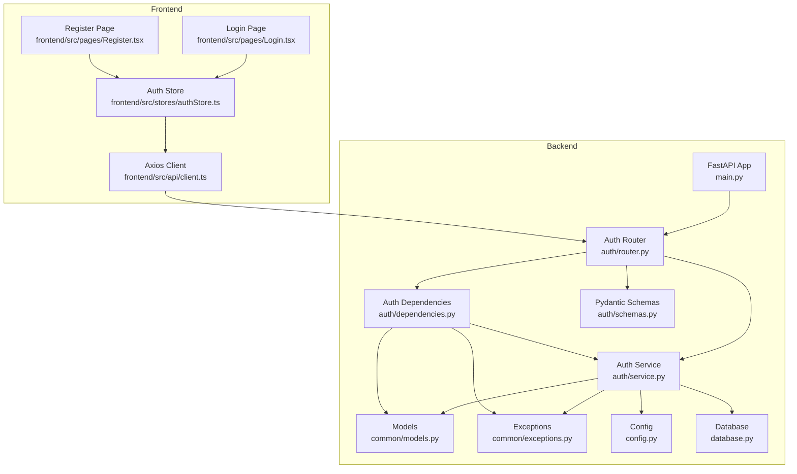
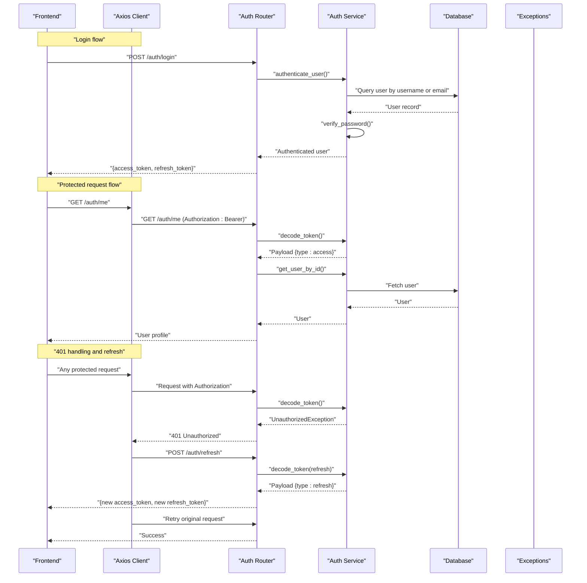
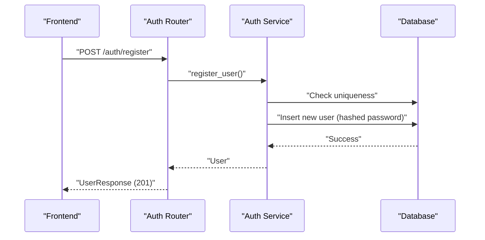
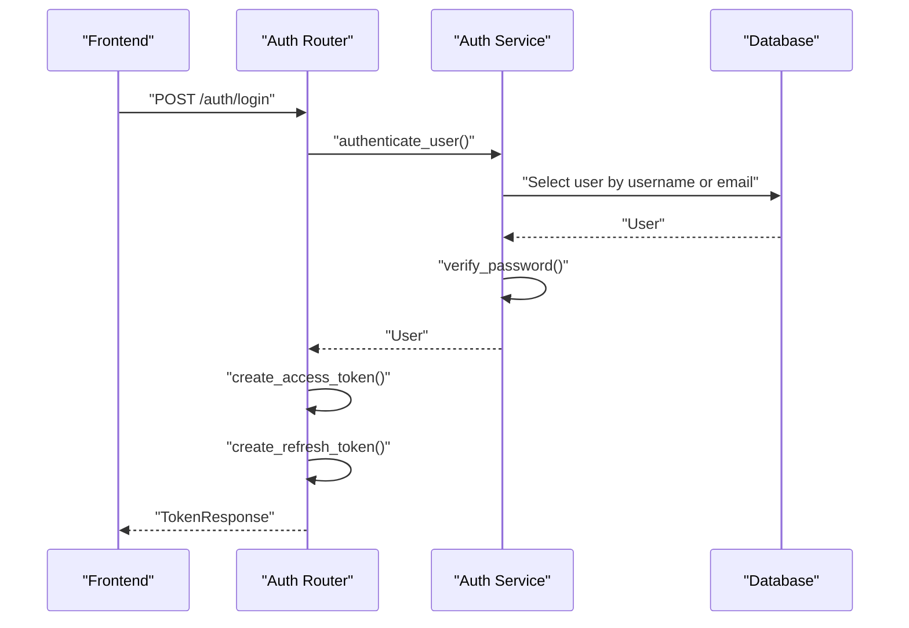
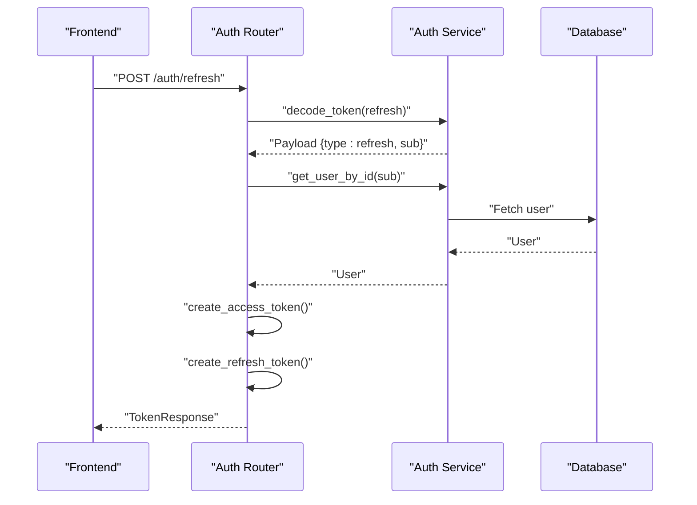
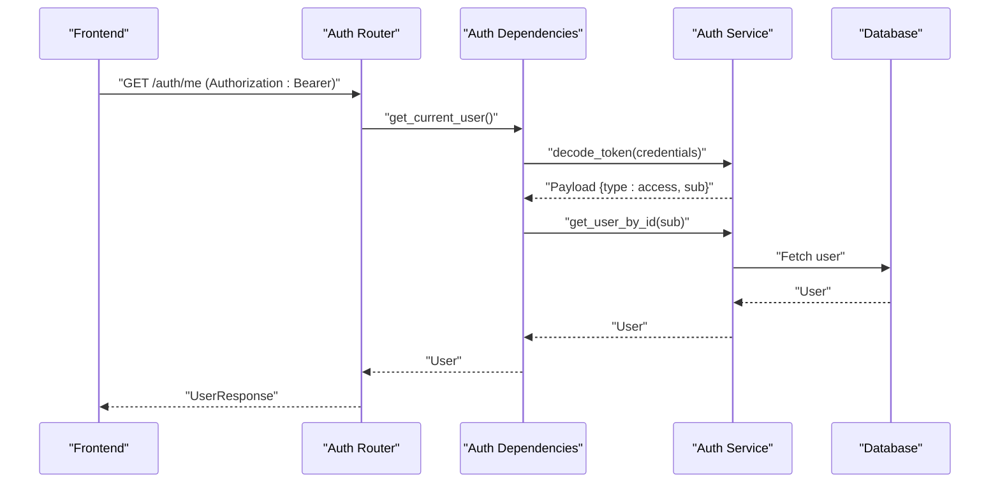
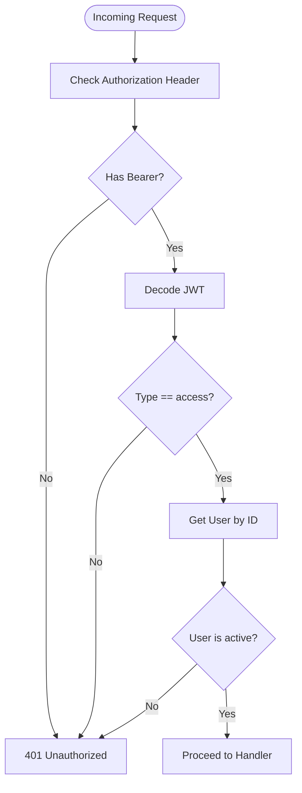
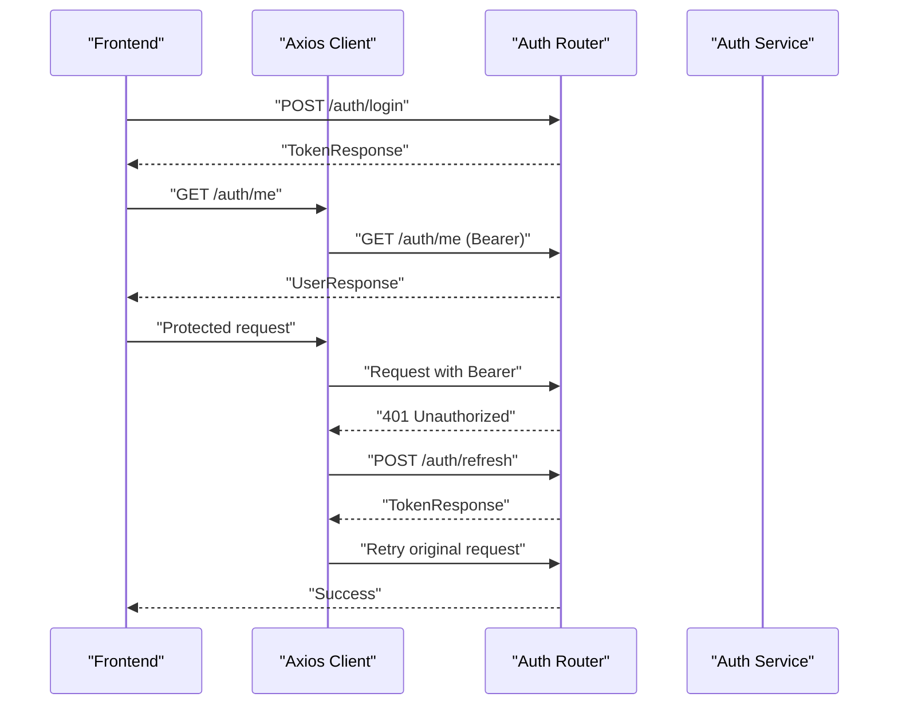
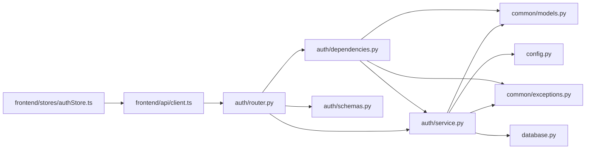

# Authentication API

<cite>
**Referenced Files in This Document**
- [backend/app/auth/router.py](file://backend/app/auth/router.py)
- [backend/app/auth/schemas.py](file://backend/app/auth/schemas.py)
- [backend/app/auth/service.py](file://backend/app/auth/service.py)
- [backend/app/auth/dependencies.py](file://backend/app/auth/dependencies.py)
- [backend/app/common/exceptions.py](file://backend/app/common/exceptions.py)
- [backend/app/common/models.py](file://backend/app/common/models.py)
- [backend/app/config.py](file://backend/app/config.py)
- [backend/app/database.py](file://backend/app/database.py)
- [backend/app/main.py](file://backend/app/main.py)
- [frontend/src/api/client.ts](file://frontend/src/api/client.ts)
- [frontend/src/stores/authStore.ts](file://frontend/src/stores/authStore.ts)
- [frontend/src/pages/Login.tsx](file://frontend/src/pages/Login.tsx)
- [frontend/src/pages/Register.tsx](file://frontend/src/pages/Register.tsx)
</cite>

## Table of Contents
1. [Introduction](#introduction)
2. [Project Structure](#project-structure)
3. [Core Components](#core-components)
4. [Architecture Overview](#architecture-overview)
5. [Detailed Component Analysis](#detailed-component-analysis)
6. [Dependency Analysis](#dependency-analysis)
7. [Performance Considerations](#performance-considerations)
8. [Troubleshooting Guide](#troubleshooting-guide)
9. [Conclusion](#conclusion)
10. [Appendices](#appendices)

## Introduction
This document provides comprehensive API documentation for the authentication system endpoints. It covers user registration, login, token refresh, and protected routes. It also documents request/response schemas, error handling, security considerations, and practical integration patterns for both backend and frontend.

## Project Structure
The authentication system is implemented in the backend FastAPI application and integrated with a React frontend. The backend exposes REST endpoints under the /auth namespace, while the frontend manages token storage and automatic refresh via interceptors.

**Diagram sources**
- [backend/app/main.py:59-71](file://backend/app/main.py#L59-L71)
- [backend/app/auth/router.py:34](file://backend/app/auth/router.py#L34)
- [backend/app/auth/service.py:1-165](file://backend/app/auth/service.py#L1-L165)
- [backend/app/auth/dependencies.py:27-51](file://backend/app/auth/dependencies.py#L27-L51)
- [backend/app/auth/schemas.py:18-57](file://backend/app/auth/schemas.py#L18-L57)
- [backend/app/common/models.py:41-76](file://backend/app/common/models.py#L41-L76)
- [backend/app/common/exceptions.py:16-87](file://backend/app/common/exceptions.py#L16-L87)
- [backend/app/config.py:37-41](file://backend/app/config.py#L37-L41)
- [backend/app/database.py:24-62](file://backend/app/database.py#L24-L62)
- [frontend/src/api/client.ts:14-63](file://frontend/src/api/client.ts#L14-L63)
- [frontend/src/stores/authStore.ts:37-98](file://frontend/src/stores/authStore.ts#L37-L98)
- [frontend/src/pages/Login.tsx:17-102](file://frontend/src/pages/Login.tsx#L17-L102)
- [frontend/src/pages/Register.tsx:17-119](file://frontend/src/pages/Register.tsx#L17-L119)

**Section sources**
- [backend/app/main.py:59-71](file://backend/app/main.py#L59-L71)
- [backend/app/auth/router.py:34](file://backend/app/auth/router.py#L34)

## Core Components
- Authentication Router: Exposes endpoints for registration, login, refresh, and profile retrieval.
- Authentication Service: Implements password hashing, JWT creation/verification, and user operations.
- Authentication Dependencies: Extracts and validates JWTs from Authorization headers and resolves current users.
- Pydantic Schemas: Defines request/response models for registration, login, tokens, and user profiles.
- Models and Exceptions: ORM User model and unified exception classes for consistent error responses.
- Configuration: Centralized settings for JWT secrets, algorithms, and expiration durations.
- Frontend Client: Axios client with interceptors for automatic token attachment and refresh.

**Section sources**
- [backend/app/auth/router.py:37-91](file://backend/app/auth/router.py#L37-L91)
- [backend/app/auth/service.py:28-165](file://backend/app/auth/service.py#L28-L165)
- [backend/app/auth/dependencies.py:27-66](file://backend/app/auth/dependencies.py#L27-L66)
- [backend/app/auth/schemas.py:18-57](file://backend/app/auth/schemas.py#L18-L57)
- [backend/app/common/models.py:41-76](file://backend/app/common/models.py#L41-L76)
- [backend/app/common/exceptions.py:16-87](file://backend/app/common/exceptions.py#L16-L87)
- [backend/app/config.py:37-41](file://backend/app/config.py#L37-L41)
- [frontend/src/api/client.ts:14-63](file://frontend/src/api/client.ts#L14-L63)

## Architecture Overview
The authentication flow spans backend endpoints and frontend token management. The frontend automatically attaches the access token to requests and attempts to refresh it on 401 responses.

**Diagram sources**
- [backend/app/auth/router.py:56-91](file://backend/app/auth/router.py#L56-L91)
- [backend/app/auth/service.py:125-149](file://backend/app/auth/service.py#L125-L149)
- [backend/app/auth/dependencies.py:27-51](file://backend/app/auth/dependencies.py#L27-L51)
- [frontend/src/api/client.ts:29-60](file://frontend/src/api/client.ts#L29-L60)

## Detailed Component Analysis

### Authentication Endpoints

#### POST /auth/register
- Purpose: Create a new user account.
- Authentication: Not required.
- Request body schema: RegisterRequest
  - username: string (3-64 characters)
  - email: string (valid email)
  - password: string (8-128 characters)
  - display_name: string | null (optional, up to 128 characters)
- Response: UserResponse (201 Created)
- Validation:
  - Unique username and email enforced by database constraints.
  - Password hashed before storage.
- Errors:
  - 409 Conflict: Username or email already exists.
  - 400 Bad Request: Invalid input (schema validation failures).
  - 500 Internal Server Error: Unexpected server error.

**Diagram sources**
- [backend/app/auth/router.py:37-53](file://backend/app/auth/router.py#L37-L53)
- [backend/app/auth/service.py:91-122](file://backend/app/auth/service.py#L91-L122)

**Section sources**
- [backend/app/auth/router.py:37-53](file://backend/app/auth/router.py#L37-L53)
- [backend/app/auth/schemas.py:19-24](file://backend/app/auth/schemas.py#L19-L24)
- [backend/app/auth/service.py:91-122](file://backend/app/auth/service.py#L91-L122)

#### POST /auth/login
- Purpose: Authenticate user and issue token pair.
- Authentication: Not required.
- Request body schema: LoginRequest
  - username: string (accepts username or email)
  - password: string
- Response: TokenResponse
  - access_token: string
  - refresh_token: string
  - token_type: "bearer"
- Behavior:
  - Validates credentials against stored hash.
  - Requires active user account.
  - Issues short-lived access token and long-lived refresh token.
- Errors:
  - 400 Bad Request: Invalid username or password, or inactive account.
  - 500 Internal Server Error: Unexpected server error.

**Diagram sources**
- [backend/app/auth/router.py:56-67](file://backend/app/auth/router.py#L56-L67)
- [backend/app/auth/service.py:125-149](file://backend/app/auth/service.py#L125-L149)

**Section sources**
- [backend/app/auth/router.py:56-67](file://backend/app/auth/router.py#L56-L67)
- [backend/app/auth/schemas.py:27-31](file://backend/app/auth/schemas.py#L27-L31)
- [backend/app/auth/service.py:43-68](file://backend/app/auth/service.py#L43-L68)

#### POST /auth/refresh
- Purpose: Exchange a valid refresh token for a new access + refresh token pair.
- Authentication: Not required.
- Request body schema: RefreshRequest
  - refresh_token: string
- Response: TokenResponse
- Validation:
  - Token must be a refresh token (type: refresh).
  - Token must be valid and unexpired.
- Errors:
  - 401 Unauthorized: Invalid or expired token, or wrong token type.
  - 404 Not Found: User not found.
  - 500 Internal Server Error: Unexpected server error.

**Diagram sources**
- [backend/app/auth/router.py:70-84](file://backend/app/auth/router.py#L70-L84)
- [backend/app/auth/service.py:71-88](file://backend/app/auth/service.py#L71-L88)

**Section sources**
- [backend/app/auth/router.py:70-84](file://backend/app/auth/router.py#L70-L84)
- [backend/app/auth/schemas.py:41-43](file://backend/app/auth/schemas.py#L41-L43)
- [backend/app/auth/service.py:71-88](file://backend/app/auth/service.py#L71-L88)

#### GET /auth/me
- Purpose: Retrieve the authenticated user’s profile.
- Authentication: Required (Bearer access token).
- Response: UserResponse
- Behavior:
  - Extracts token from Authorization header.
  - Validates token type (must be access).
  - Resolves user by token subject (UUID).
  - Ensures user is active.
- Errors:
  - 401 Unauthorized: Missing or invalid token, wrong token type, or inactive user.
  - 404 Not Found: User not found.
  - 500 Internal Server Error: Unexpected server error.

**Diagram sources**
- [backend/app/auth/router.py:87-91](file://backend/app/auth/router.py#L87-L91)
- [backend/app/auth/dependencies.py:27-51](file://backend/app/auth/dependencies.py#L27-L51)

**Section sources**
- [backend/app/auth/router.py:87-91](file://backend/app/auth/router.py#L87-L91)
- [backend/app/auth/dependencies.py:27-51](file://backend/app/auth/dependencies.py#L27-L51)
- [backend/app/auth/schemas.py:46-56](file://backend/app/auth/schemas.py#L46-L56)

### Authentication Middleware and Protected Routes
- Bearer Token Extraction:
  - Uses HTTPBearer scheme with auto-error disabled to allow custom handling.
  - Validates token type and decodes payload.
  - Resolves user by ID and ensures active status.
- Protected Route Patterns:
  - Any endpoint depending on get_current_user requires a valid access token.
  - Superuser-only endpoints depend on get_current_superuser.
- Frontend Integration:
  - Axios request interceptor attaches Authorization: Bearer header.
  - Response interceptor handles 401 by attempting refresh and retrying the request.
  - On refresh failure, clears tokens and redirects to login.

**Diagram sources**
- [backend/app/auth/dependencies.py:27-51](file://backend/app/auth/dependencies.py#L27-L51)
- [frontend/src/api/client.ts:19-26](file://frontend/src/api/client.ts#L19-L26)

**Section sources**
- [backend/app/auth/dependencies.py:27-51](file://backend/app/auth/dependencies.py#L27-L51)
- [frontend/src/api/client.ts:19-26](file://frontend/src/api/client.ts#L19-L26)

### Request/Response Schemas
- RegisterRequest
  - username: string (3-64)
  - email: string (valid email)
  - password: string (8-128)
  - display_name: string | null (optional)
- LoginRequest
  - username: string (accepts username or email)
  - password: string
- TokenResponse
  - access_token: string
  - refresh_token: string
  - token_type: "bearer"
- RefreshRequest
  - refresh_token: string
- UserResponse
  - id: uuid
  - username: string
  - email: string
  - display_name: string | null
  - is_active: boolean
  - is_superuser: boolean
  - created_at: datetime

**Section sources**
- [backend/app/auth/schemas.py:19-56](file://backend/app/auth/schemas.py#L19-L56)

### Security Considerations
- Password Storage:
  - Passwords are hashed using bcrypt before storage.
- Token Management:
  - Access tokens are short-lived; refresh tokens are long-lived.
  - Token type distinguishes access vs refresh tokens.
  - Token decoding validates signature and algorithm.
- Account Status:
  - Authentication rejects inactive users.
- CORS and Logging:
  - CORS configured via settings.
  - Request logging middleware enabled for observability.

**Section sources**
- [backend/app/auth/service.py:32-39](file://backend/app/auth/service.py#L32-L39)
- [backend/app/auth/service.py:43-68](file://backend/app/auth/service.py#L43-L68)
- [backend/app/auth/service.py:125-149](file://backend/app/auth/service.py#L125-L149)
- [backend/app/common/middleware.py:23-58](file://backend/app/common/middleware.py#L23-L58)

### Practical Examples and Integration Patterns
- Frontend Login Flow:
  - Submit username and password to /auth/login.
  - Store access_token and refresh_token in localStorage.
  - Fetch /auth/me to populate user profile.
- Automatic Token Refresh:
  - Axios attaches Authorization header automatically.
  - On 401, attempt /auth/refresh with stored refresh_token.
  - Retry original request with new access_token.
- Logout:
  - Remove tokens from localStorage and reset user state.

**Diagram sources**
- [frontend/src/stores/authStore.ts:42-58](file://frontend/src/stores/authStore.ts#L42-L58)
- [frontend/src/api/client.ts:29-60](file://frontend/src/api/client.ts#L29-L60)
- [backend/app/auth/router.py:56-67](file://backend/app/auth/router.py#L56-L67)
- [backend/app/auth/router.py:70-84](file://backend/app/auth/router.py#L70-L84)

**Section sources**
- [frontend/src/stores/authStore.ts:42-58](file://frontend/src/stores/authStore.ts#L42-L58)
- [frontend/src/api/client.ts:29-60](file://frontend/src/api/client.ts#L29-L60)
- [frontend/src/pages/Login.tsx:23-31](file://frontend/src/pages/Login.tsx#L23-L31)
- [frontend/src/pages/Register.tsx:25-33](file://frontend/src/pages/Register.tsx#L25-L33)

## Dependency Analysis
The authentication system depends on configuration for JWT settings, database sessions, and centralized exception handling. The router orchestrates endpoints, the service encapsulates business logic, and dependencies resolve current users from tokens.

**Diagram sources**
- [backend/app/auth/router.py:14-32](file://backend/app/auth/router.py#L14-L32)
- [backend/app/auth/service.py:15-26](file://backend/app/auth/service.py#L15-L26)
- [backend/app/auth/dependencies.py:18-21](file://backend/app/auth/dependencies.py#L18-L21)
- [backend/app/auth/schemas.py:15](file://backend/app/auth/schemas.py#L15)
- [backend/app/common/models.py:18-20](file://backend/app/common/models.py#L18-L20)
- [backend/app/common/exceptions.py:12-13](file://backend/app/common/exceptions.py#L12-L13)
- [backend/app/config.py:15-60](file://backend/app/config.py#L15-L60)
- [backend/app/database.py:14-46](file://backend/app/database.py#L14-L46)
- [frontend/src/api/client.ts:12-17](file://frontend/src/api/client.ts#L12-L17)
- [frontend/src/stores/authStore.ts:12-13](file://frontend/src/stores/authStore.ts#L12-L13)

**Section sources**
- [backend/app/auth/router.py:14-32](file://backend/app/auth/router.py#L14-L32)
- [backend/app/auth/service.py:15-26](file://backend/app/auth/service.py#L15-L26)
- [backend/app/auth/dependencies.py:18-21](file://backend/app/auth/dependencies.py#L18-L21)
- [backend/app/config.py:15-60](file://backend/app/config.py#L15-L60)
- [backend/app/database.py:14-46](file://backend/app/database.py#L14-L46)

## Performance Considerations
- Token Expiration:
  - Access tokens are short-lived to minimize exposure windows.
  - Refresh tokens are long-lived but should be securely stored.
- Database Queries:
  - User lookup by username/email and by ID are performed with indexed columns.
- Session Management:
  - Async SQLAlchemy sessions are used for efficient I/O.
- Frontend Efficiency:
  - Axios interceptors reduce boilerplate and enable transparent refresh.

[No sources needed since this section provides general guidance]

## Troubleshooting Guide
- 400 Bad Request
  - Registration: Invalid input (length constraints, invalid email).
  - Login: Invalid username or password, or inactive user.
- 401 Unauthorized
  - Missing Authorization header, invalid/expired token, wrong token type, or inactive user.
  - Frontend: 401 triggers automatic refresh; if refresh fails, tokens are cleared and user redirected.
- 403 Forbidden
  - Superuser-only endpoints require elevated privileges.
- 409 Conflict
  - Duplicate username or email during registration.
- 404 Not Found
  - User not found when resolving token subject or during refresh.
- 500 Internal Server Error
  - Unexpected server-side failures; check logs.

**Section sources**
- [backend/app/common/exceptions.py:37-62](file://backend/app/common/exceptions.py#L37-L62)
- [backend/app/auth/service.py:125-149](file://backend/app/auth/service.py#L125-L149)
- [backend/app/auth/dependencies.py:38-49](file://backend/app/auth/dependencies.py#L38-L49)
- [frontend/src/api/client.ts:29-60](file://frontend/src/api/client.ts#L29-L60)

## Conclusion
The authentication system provides secure, standards-compliant JWT-based authentication with clear separation of concerns. The backend enforces validation and security policies, while the frontend offers seamless token management and refresh. Together, they support robust user registration, login, and protected resource access patterns.

[No sources needed since this section summarizes without analyzing specific files]

## Appendices

### Configuration Reference
- JWT Secret Key: HS256 secret used to sign tokens.
- Algorithm: HS256.
- Access Token Expiration: Minutes.
- Refresh Token Expiration: Days.
- Database URL: PostgreSQL connection string.
- CORS Origins: List of allowed origins.

**Section sources**
- [backend/app/config.py:37-56](file://backend/app/config.py#L37-L56)

### Frontend Integration Notes
- Axios client sets Authorization header automatically.
- Stores tokens in localStorage.
- Attempts refresh on 401 and retries failed request.
- Clears tokens and redirects to login on refresh failure.

**Section sources**
- [frontend/src/api/client.ts:19-60](file://frontend/src/api/client.ts#L19-L60)
- [frontend/src/stores/authStore.ts:79-83](file://frontend/src/stores/authStore.ts#L79-L83)