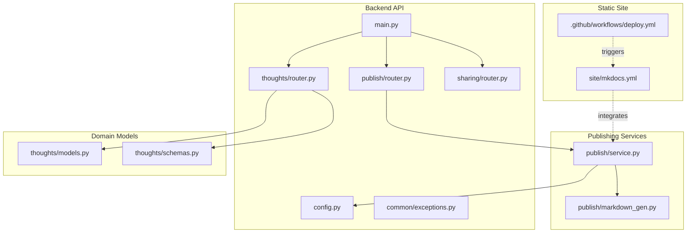
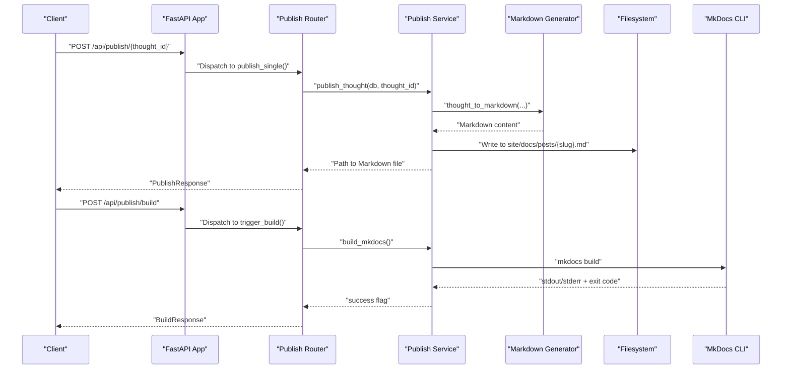
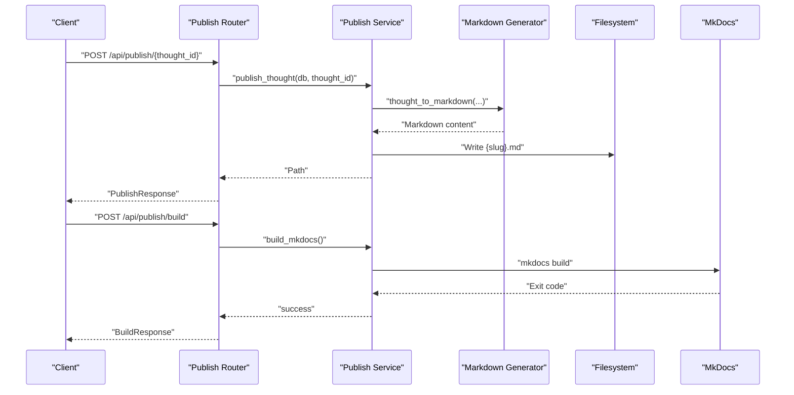
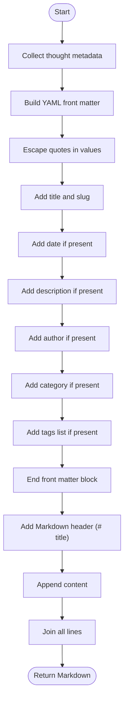
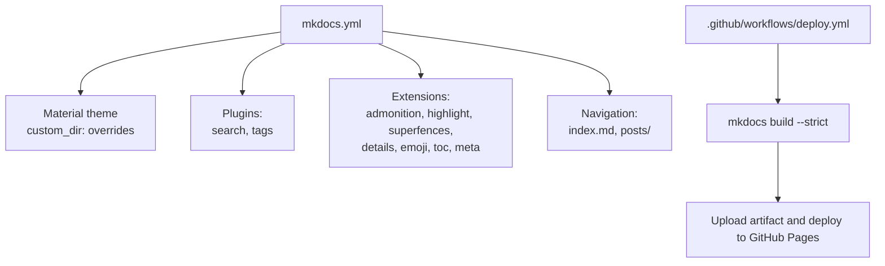
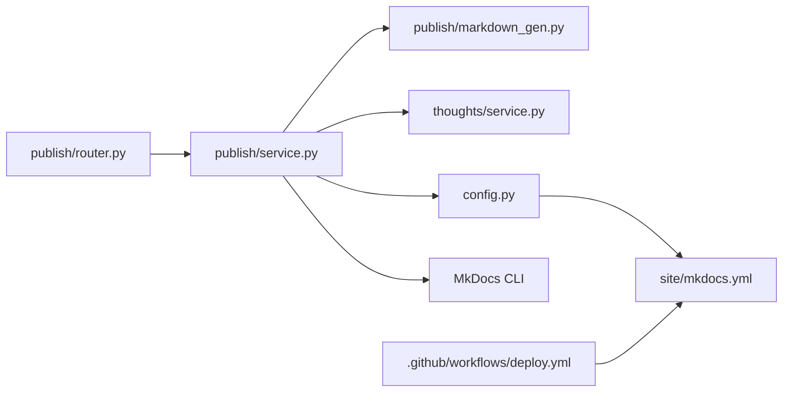

# Publishing API

<cite>
**Referenced Files in This Document**
- [backend/app/main.py](file://backend/app/main.py)
- [backend/app/publish/router.py](file://backend/app/publish/router.py)
- [backend/app/publish/service.py](file://backend/app/publish/service.py)
- [backend/app/publish/markdown_gen.py](file://backend/app/publish/markdown_gen.py)
- [backend/app/thoughts/router.py](file://backend/app/thoughts/router.py)
- [backend/app/thoughts/service.py](file://backend/app/thoughts/service.py)
- [backend/app/thoughts/schemas.py](file://backend/app/thoughts/schemas.py)
- [backend/app/thoughts/models.py](file://backend/app/thoughts/models.py)
- [backend/app/config.py](file://backend/app/config.py)
- [backend/app/common/exceptions.py](file://backend/app/common/exceptions.py)
- [backend/app/sharing/router.py](file://backend/app/sharing/router.py)
- [backend/app/sharing/service.py](file://backend/app/sharing/service.py)
- [site/mkdocs.yml](file://site/mkdocs.yml)
- [.github/workflows/deploy.yml](file://.github/workflows/deploy.yml)
- [backend/tests/test_markdown_gen.py](file://backend/tests/test_markdown_gen.py)
</cite>

## Table of Contents
1. [Introduction](#introduction)
2. [Project Structure](#project-structure)
3. [Core Components](#core-components)
4. [Architecture Overview](#architecture-overview)
5. [Detailed Component Analysis](#detailed-component-analysis)
6. [Dependency Analysis](#dependency-analysis)
7. [Performance Considerations](#performance-considerations)
8. [Troubleshooting Guide](#troubleshooting-guide)
9. [Conclusion](#conclusion)
10. [Appendices](#appendices)

## Introduction
This document provides comprehensive API documentation for the publishing system that exports thoughts to a MkDocs static site and triggers builds. It covers:
- Export endpoints for individual thoughts and bulk operations
- Static site generation triggers and build status monitoring
- Markdown generation process, template customization, and metadata handling
- MkDocs integration endpoints and configuration options
- Request/response schemas for publishing operations, build parameters, and deployment triggers
- Examples of automated publishing workflows, custom theme integration, and content transformation pipelines
- Build optimization, error handling, and rollback mechanisms for failed deployments

## Project Structure
The publishing system spans backend APIs, Markdown generation, MkDocs site configuration, and CI/CD automation:
- Backend FastAPI application wires routers and exception handlers
- Publishing endpoints expose thought export and build triggers
- Markdown generation converts ORM thought data into MkDocs-compatible Markdown with YAML front matter
- MkDocs configuration defines theme, plugins, navigation, and extensions
- GitHub Actions automates builds and deploys to GitHub Pages

**Diagram sources**
- [backend/app/main.py:40-73](file://backend/app/main.py#L40-L73)
- [backend/app/publish/router.py:24-64](file://backend/app/publish/router.py#L24-L64)
- [backend/app/publish/service.py:38-111](file://backend/app/publish/service.py#L38-L111)
- [backend/app/publish/markdown_gen.py:16-89](file://backend/app/publish/markdown_gen.py#L16-L89)
- [backend/app/thoughts/router.py:34-116](file://backend/app/thoughts/router.py#L34-L116)
- [backend/app/thoughts/models.py:31-71](file://backend/app/thoughts/models.py#L31-L71)
- [backend/app/thoughts/schemas.py:20-65](file://backend/app/thoughts/schemas.py#L20-L65)
- [backend/app/config.py:52-55](file://backend/app/config.py#L52-L55)
- [site/mkdocs.yml:9-79](file://site/mkdocs.yml#L9-L79)
- [.github/workflows/deploy.yml:9-63](file://.github/workflows/deploy.yml#L9-L63)

**Section sources**
- [backend/app/main.py:40-73](file://backend/app/main.py#L40-L73)
- [backend/app/publish/router.py:24-64](file://backend/app/publish/router.py#L24-L64)
- [backend/app/publish/service.py:38-111](file://backend/app/publish/service.py#L38-L111)
- [backend/app/publish/markdown_gen.py:16-89](file://backend/app/publish/markdown_gen.py#L16-L89)
- [backend/app/thoughts/router.py:34-116](file://backend/app/thoughts/router.py#L34-L116)
- [backend/app/thoughts/models.py:31-71](file://backend/app/thoughts/models.py#L31-L71)
- [backend/app/thoughts/schemas.py:20-65](file://backend/app/thoughts/schemas.py#L20-L65)
- [backend/app/config.py:52-55](file://backend/app/config.py#L52-L55)
- [site/mkdocs.yml:9-79](file://site/mkdocs.yml#L9-L79)
- [.github/workflows/deploy.yml:9-63](file://.github/workflows/deploy.yml#L9-L63)

## Core Components
- Publishing API Router: Exposes endpoints to publish a single thought and trigger a full site build.
- Publishing Service: Orchestrates Markdown generation, file writing, and MkDocs build invocation.
- Markdown Generator: Produces MkDocs-compatible Markdown with YAML front matter and escaped content.
- MkDocs Configuration: Defines theme, plugins, navigation, and extensions for the static site.
- GitHub Actions Workflow: Builds and deploys the site to GitHub Pages on pushes to main.

Key responsibilities:
- Export a thought to site/docs/posts/{slug}.md when status is PUBLISHED
- Trigger MkDocs build and return success/failure status
- Generate shareable metadata and links for thoughts

**Section sources**
- [backend/app/publish/router.py:27-64](file://backend/app/publish/router.py#L27-L64)
- [backend/app/publish/service.py:38-111](file://backend/app/publish/service.py#L38-L111)
- [backend/app/publish/markdown_gen.py:16-89](file://backend/app/publish/markdown_gen.py#L16-L89)
- [site/mkdocs.yml:9-79](file://site/mkdocs.yml#L9-L79)
- [.github/workflows/deploy.yml:27-63](file://.github/workflows/deploy.yml#L27-L63)

## Architecture Overview
The publishing pipeline connects thought management, Markdown generation, and static site building:

**Diagram sources**
- [backend/app/publish/router.py:37-64](file://backend/app/publish/router.py#L37-L64)
- [backend/app/publish/service.py:38-111](file://backend/app/publish/service.py#L38-L111)
- [backend/app/publish/markdown_gen.py:16-89](file://backend/app/publish/markdown_gen.py#L16-L89)

## Detailed Component Analysis

### Publishing Endpoints
- POST /api/publish/{thought_id}
  - Purpose: Export a single thought as Markdown to the MkDocs posts directory when status is PUBLISHED.
  - Authentication: Requires a valid user session.
  - Path parameter: thought_id (UUID)
  - Response: PublishResponse with message and file_path
  - Validation: Thought must exist and be in PUBLISHED status; otherwise raises a bad request error.

- POST /api/publish/build
  - Purpose: Trigger a full MkDocs site build.
  - Authentication: Requires a valid user session.
  - Response: BuildResponse with success boolean and message
  - Behavior: Spawns mkdocs build in the configured site directory; returns success based on exit code.

**Diagram sources**
- [backend/app/publish/router.py:37-64](file://backend/app/publish/router.py#L37-L64)
- [backend/app/publish/service.py:38-111](file://backend/app/publish/service.py#L38-L111)
- [backend/app/publish/markdown_gen.py:16-89](file://backend/app/publish/markdown_gen.py#L16-L89)

**Section sources**
- [backend/app/publish/router.py:37-64](file://backend/app/publish/router.py#L37-L64)
- [backend/app/publish/service.py:38-111](file://backend/app/publish/service.py#L38-L111)
- [backend/app/common/exceptions.py:30-62](file://backend/app/common/exceptions.py#L30-L62)

### Markdown Generation and Metadata
- Input fields: title, content, summary, category, tags, author, created_at, slug
- Front matter fields: title, date, description, author, category, tags, slug
- Escaping: Double quotes are escaped in YAML string values
- Output: YAML front matter block followed by Markdown title and content

**Diagram sources**
- [backend/app/publish/markdown_gen.py:16-89](file://backend/app/publish/markdown_gen.py#L16-L89)

**Section sources**
- [backend/app/publish/markdown_gen.py:16-89](file://backend/app/publish/markdown_gen.py#L16-L89)
- [backend/tests/test_markdown_gen.py:16-52](file://backend/tests/test_markdown_gen.py#L16-L52)

### MkDocs Integration and Configuration
- Theme: Material with custom_dir overrides
- Plugins: search (multi-language), tags
- Markdown extensions: admonitions, code highlighting, superfences, details, emoji, TOC, meta
- Navigation: Home index.md and Articles posts/
- Build command: mkdocs build invoked via subprocess
- Deployment: GitHub Actions workflow builds and deploys to GitHub Pages on pushes to main

**Diagram sources**
- [site/mkdocs.yml:9-79](file://site/mkdocs.yml#L9-L79)
- [.github/workflows/deploy.yml:27-63](file://.github/workflows/deploy.yml#L27-L63)

**Section sources**
- [site/mkdocs.yml:9-79](file://site/mkdocs.yml#L9-L79)
- [.github/workflows/deploy.yml:27-63](file://.github/workflows/deploy.yml#L27-L63)

### Thought Management (Context)
While not part of publishing, thought CRUD is foundational to publishing:
- GET /api/thoughts: List thoughts with filters (category, tag, search, status), pagination
- POST /api/thoughts: Create thought with auto-generated slug and tag attachments
- GET /api/thoughts/{thought_id}: Retrieve a single thought
- PATCH /api/thoughts/{thought_id}: Update fields (including status)
- DELETE /api/thoughts/{thought_id}: Remove a thought

Status transitions and slug uniqueness are enforced by the service layer.

**Section sources**
- [backend/app/thoughts/router.py:37-116](file://backend/app/thoughts/router.py#L37-L116)
- [backend/app/thoughts/service.py:25-173](file://backend/app/thoughts/service.py#L25-L173)
- [backend/app/thoughts/schemas.py:20-65](file://backend/app/thoughts/schemas.py#L20-L65)
- [backend/app/thoughts/models.py:24-71](file://backend/app/thoughts/models.py#L24-L71)

### Sharing and Social Metadata (Context)
- GET /api/share/{thought_id}: Generates share URLs and Open Graph metadata for platforms (X, Weibo, Xiaohongshu) and clipboard-friendly text.

**Section sources**
- [backend/app/sharing/router.py:26-47](file://backend/app/sharing/router.py#L26-L47)
- [backend/app/sharing/service.py:25-103](file://backend/app/sharing/service.py#L25-L103)

## Dependency Analysis
- Publish Router depends on Publish Service for orchestration
- Publish Service depends on Markdown Generator, Thought Service, and configuration
- Markdown Generator is a pure function with no external dependencies
- MkDocs CLI is invoked as a subprocess; errors propagate back to the caller
- GitHub Actions workflow depends on MkDocs configuration and site directory

**Diagram sources**
- [backend/app/publish/router.py:24-64](file://backend/app/publish/router.py#L24-L64)
- [backend/app/publish/service.py:38-111](file://backend/app/publish/service.py#L38-L111)
- [backend/app/publish/markdown_gen.py:16-89](file://backend/app/publish/markdown_gen.py#L16-L89)
- [backend/app/thoughts/service.py:68-79](file://backend/app/thoughts/service.py#L68-L79)
- [backend/app/config.py:52-55](file://backend/app/config.py#L52-L55)
- [site/mkdocs.yml:9-79](file://site/mkdocs.yml#L9-L79)
- [.github/workflows/deploy.yml:27-63](file://.github/workflows/deploy.yml#L27-L63)

**Section sources**
- [backend/app/publish/router.py:24-64](file://backend/app/publish/router.py#L24-L64)
- [backend/app/publish/service.py:38-111](file://backend/app/publish/service.py#L38-L111)
- [backend/app/publish/markdown_gen.py:16-89](file://backend/app/publish/markdown_gen.py#L16-L89)
- [backend/app/thoughts/service.py:68-79](file://backend/app/thoughts/service.py#L68-L79)
- [backend/app/config.py:52-55](file://backend/app/config.py#L52-L55)
- [site/mkdocs.yml:9-79](file://site/mkdocs.yml#L9-L79)
- [.github/workflows/deploy.yml:27-63](file://.github/workflows/deploy.yml#L27-L63)

## Performance Considerations
- MkDocs build is executed as a subprocess; typical completion time is under 5 seconds for small sites
- File I/O is synchronous; ensure the site directory is on a performant filesystem
- Avoid frequent builds by batching publishing operations
- Consider caching rendered Markdown if content remains unchanged

[No sources needed since this section provides general guidance]

## Troubleshooting Guide
Common issues and resolutions:
- MkDocs not found: The build method logs an error when mkdocs command is missing; install MkDocs in the environment
- Thought not published: Publishing requires PUBLISHED status; ensure status is set before export
- Build failure: Inspect server logs for stderr output; the build endpoint returns a descriptive message on failure
- CORS and authentication: Ensure requests are authenticated and sent from allowed origins as configured

**Section sources**
- [backend/app/publish/service.py:83-111](file://backend/app/publish/service.py#L83-L111)
- [backend/app/publish/service.py:56-61](file://backend/app/publish/service.py#L56-L61)
- [backend/app/common/exceptions.py:30-62](file://backend/app/common/exceptions.py#L30-L62)
- [backend/app/config.py:52-55](file://backend/app/config.py#L52-L55)

## Conclusion
The publishing system provides a streamlined pipeline to export thoughts to a MkDocs site and trigger builds. It leverages clean separation of concerns: thought management, Markdown generation with rich metadata, and MkDocs integration with CI/CD automation. By following the documented endpoints and configurations, teams can automate publishing workflows, customize themes, and maintain reliable deployments.

[No sources needed since this section summarizes without analyzing specific files]

## Appendices

### API Reference

- POST /api/publish/{thought_id}
  - Path parameters
    - thought_id: UUID of the thought to publish
  - Response
    - message: String describing the outcome
    - file_path: String path to the generated Markdown file (optional)
  - Errors
    - 400 Bad Request: Thought is not in PUBLISHED status
    - 404 Not Found: Thought not found

- POST /api/publish/build
  - Response
    - success: Boolean indicating build success
    - message: String describing the outcome
  - Errors
    - 500 Internal Server Error: Unexpected error during build

**Section sources**
- [backend/app/publish/router.py:37-64](file://backend/app/publish/router.py#L37-L64)
- [backend/app/publish/service.py:38-111](file://backend/app/publish/service.py#L38-L111)
- [backend/app/common/exceptions.py:30-62](file://backend/app/common/exceptions.py#L30-L62)

### Request/Response Schemas

- PublishResponse
  - message: String
  - file_path: String | null

- BuildResponse
  - success: Boolean
  - message: String

- ThoughtCreate
  - title: String (1–256)
  - content: String (default empty)
  - summary: String | null
  - category: String | null (max length 64)
  - status: "draft" | "published" | "archived" (default "draft")
  - tag_ids: Array of UUID

- ThoughtUpdate
  - title: String | null (1–256)
  - content: String | null
  - summary: String | null
  - category: String | null
  - status: "draft" | "published" | "archived" | null
  - tag_ids: Array of UUID | null

- ThoughtResponse
  - id: UUID
  - title: String
  - slug: String
  - content: String
  - summary: String | null
  - category: String | null
  - status: String
  - author_id: UUID
  - tags: Array of TagResponse
  - created_at: DateTime
  - updated_at: DateTime

- ThoughtListResponse
  - items: Array of ThoughtResponse
  - total: Integer
  - page: Integer
  - page_size: Integer

**Section sources**
- [backend/app/publish/router.py:27-35](file://backend/app/publish/router.py#L27-L35)
- [backend/app/thoughts/schemas.py:21-65](file://backend/app/thoughts/schemas.py#L21-L65)

### Configuration Options
- SITE_DIR: Path to the MkDocs project root (used by publishing service)
- SITE_BASE_URL: Base URL for public post links (used by sharing service)

**Section sources**
- [backend/app/config.py:52-55](file://backend/app/config.py#L52-L55)

### Automated Publishing Workflows
- Local workflow
  - Create or update a thought and set status to PUBLISHED
  - Call POST /api/publish/{thought_id} to export Markdown
  - Optionally call POST /api/publish/build to rebuild the site
- CI/CD workflow
  - Push changes to site/docs/posts/ or MkDocs configuration
  - GitHub Actions job builds and deploys the site to GitHub Pages

**Section sources**
- [.github/workflows/deploy.yml:27-63](file://.github/workflows/deploy.yml#L27-L63)

### Custom Theme Integration
- Modify site/mkdocs.yml theme settings and custom_dir to integrate custom templates
- Place overrides in site/overrides/ for HTML customization
- Adjust plugins and markdown_extensions to match desired features

**Section sources**
- [site/mkdocs.yml:14-79](file://site/mkdocs.yml#L14-L79)

### Content Transformation Pipelines
- Thought ORM → Markdown with YAML front matter
- Optional transformations can be added to the Markdown generator or MkDocs preprocessing steps

**Section sources**
- [backend/app/publish/markdown_gen.py:16-89](file://backend/app/publish/markdown_gen.py#L16-L89)

### Build Optimization, Error Handling, and Rollback
- Optimization
  - Batch publishing operations to reduce build frequency
  - Use incremental builds if MkDocs supports them in future versions
- Error handling
  - Build failures return a descriptive message; inspect server logs for stderr
  - Thought export fails early if status is not PUBLISHED
- Rollback
  - GitHub Actions deploys built artifacts; roll back by redeploying a previous commit
  - Alternatively, revert Markdown files in site/docs/posts/ and rebuild

**Section sources**
- [backend/app/publish/service.py:83-111](file://backend/app/publish/service.py#L83-L111)
- [backend/app/publish/service.py:56-61](file://backend/app/publish/service.py#L56-L61)
- [.github/workflows/deploy.yml:27-63](file://.github/workflows/deploy.yml#L27-L63)