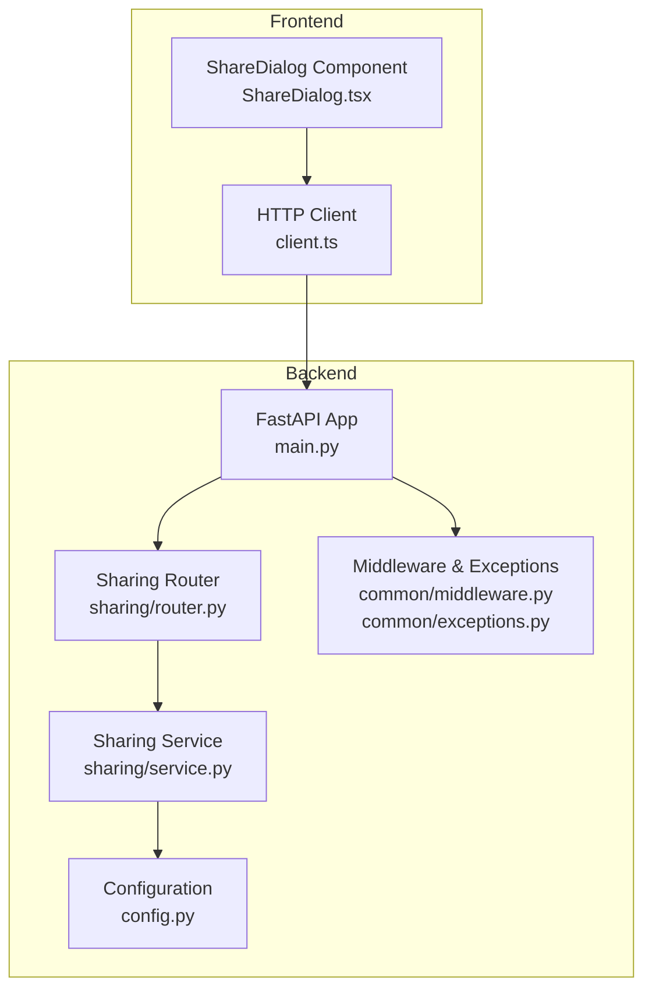
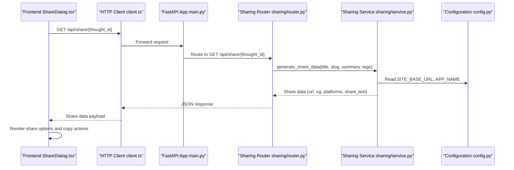

# Sharing API

<cite>
**Referenced Files in This Document**
- [router.py](file://backend/app/sharing/router.py)
- [service.py](file://backend/app/sharing/service.py)
- [test_sharing.py](file://backend/tests/test_sharing.py)
- [main.py](file://backend/app/main.py)
- [config.py](file://backend/app/config.py)
- [middleware.py](file://backend/app/common/middleware.py)
- [exceptions.py](file://backend/app/common/exceptions.py)
- [ShareDialog.tsx](file://frontend/src/components/ShareDialog.tsx)
- [client.ts](file://frontend/src/api/client.ts)
</cite>

## Table of Contents
1. [Introduction](#introduction)
2. [Project Structure](#project-structure)
3. [Core Components](#core-components)
4. [Architecture Overview](#architecture-overview)
5. [Detailed Component Analysis](#detailed-component-analysis)
6. [Dependency Analysis](#dependency-analysis)
7. [Performance Considerations](#performance-considerations)
8. [Troubleshooting Guide](#troubleshooting-guide)
9. [Conclusion](#conclusion)
10. [Appendices](#appendices)

## Introduction
This document provides comprehensive API documentation for the social sharing system. It covers cross-platform sharing endpoints for X/Twitter, Weibo, and Xiaohongshu, including URL generation, platform-specific formatting, metadata generation (Open Graph tags), share text templates, and preview image handling. It also documents sharing status tracking, error reporting, request/response schemas, platform-specific parameters, content formatting rules, automated sharing workflows, manual sharing triggers, customization options, rate limiting considerations, platform API limitations, and sharing quality optimization.

## Project Structure
The sharing system spans the backend FastAPI application and the frontend React component. The backend exposes a single GET endpoint under `/api/share/{thought_id}` that returns platform-specific share URLs, Open Graph metadata, and a pre-formatted share text. The frontend integrates with this endpoint to present sharing options and enable copy-to-clipboard functionality.

**Diagram sources**
- [main.py:40-73](file://backend/app/main.py#L40-L73)
- [router.py:23-46](file://backend/app/sharing/router.py#L23-L46)
- [service.py:25-73](file://backend/app/sharing/service.py#L25-L73)
- [config.py:52-58](file://backend/app/config.py#L52-L58)
- [middleware.py:23-59](file://backend/app/common/middleware.py#L23-L59)
- [exceptions.py:67-87](file://backend/app/common/exceptions.py#L67-L87)
- [ShareDialog.tsx:32-43](file://frontend/src/components/ShareDialog.tsx#L32-L43)
- [client.ts:14-62](file://frontend/src/api/client.ts#L14-L62)

**Section sources**
- [main.py:40-73](file://backend/app/main.py#L40-L73)
- [router.py:23-46](file://backend/app/sharing/router.py#L23-L46)
- [service.py:25-73](file://backend/app/sharing/service.py#L25-L73)
- [config.py:52-58](file://backend/app/config.py#L52-L58)
- [middleware.py:23-59](file://backend/app/common/middleware.py#L23-L59)
- [exceptions.py:67-87](file://backend/app/common/exceptions.py#L67-L87)
- [ShareDialog.tsx:32-43](file://frontend/src/components/ShareDialog.tsx#L32-L43)
- [client.ts:14-62](file://frontend/src/api/client.ts#L14-L62)

## Core Components
- Sharing Router: Exposes the GET endpoint `/api/share/{thought_id}` that authenticates the user, loads the thought, and delegates to the sharing service.
- Sharing Service: Generates public post URLs, Open Graph metadata, platform-specific share URLs, and a pre-formatted share text.
- Frontend Share Dialog: Fetches share data from the backend and presents platform-specific sharing options and copy-to-clipboard actions.
- Configuration: Provides SITE_BASE_URL and APP_NAME used to construct public URLs and OG metadata.
- Middleware and Exceptions: Handles CORS, request logging, and unified error responses.

Key responsibilities:
- URL generation: Builds public post URLs using SITE_BASE_URL and thought slug.
- Metadata generation: Produces Open Graph tags and Twitter card metadata.
- Platform-specific formatting: Constructs X/Twitter intent URLs, Weibo share URLs, and Xiaohongshu pre-formatted text.
- Share text template: Creates a human-readable share text combining title, description, hashtags, and URL.
- Status tracking and error reporting: Uses centralized exception handling and request logging.

**Section sources**
- [router.py:26-46](file://backend/app/sharing/router.py#L26-L46)
- [service.py:25-73](file://backend/app/sharing/service.py#L25-L73)
- [config.py:52-58](file://backend/app/config.py#L52-L58)
- [middleware.py:40-59](file://backend/app/common/middleware.py#L40-L59)
- [exceptions.py:67-87](file://backend/app/common/exceptions.py#L67-L87)

## Architecture Overview
The sharing workflow is a client-server interaction:
- The frontend component calls the backend endpoint with a thought ID.
- The backend validates the user and retrieves the thought.
- The backend generates share data and returns it to the frontend.
- The frontend displays share options and enables copying content to the clipboard.

**Diagram sources**
- [ShareDialog.tsx:37-43](file://frontend/src/components/ShareDialog.tsx#L37-L43)
- [client.ts:14-62](file://frontend/src/api/client.ts#L14-L62)
- [main.py:40-73](file://backend/app/main.py#L40-L73)
- [router.py:26-46](file://backend/app/sharing/router.py#L26-L46)
- [service.py:25-73](file://backend/app/sharing/service.py#L25-L73)
- [config.py:52-58](file://backend/app/config.py#L52-L58)

## Detailed Component Analysis

### Endpoint Definition
- Path: `/api/share/{thought_id}`
- Method: GET
- Authentication: Requires a valid user session (via dependency).
- Path Parameter:
  - thought_id: UUID of the thought to share.
- Response Schema:
  - url: string (public post URL)
  - og: object (Open Graph metadata)
  - platforms: object (platform-specific share URLs)
  - share_text: string (pre-formatted text for clipboard)

Response fields:
- url: Public URL constructed from SITE_BASE_URL and thought slug.
- og: Open Graph metadata including og:title, og:description, og:url, og:type, og:site_name, twitter:card, twitter:title, twitter:description.
- platforms:
  - x: X/Twitter intent URL with text and url parameters; optional hashtags parameter.
  - weibo: Weibo share URL with url and title parameters.
  - xiaohongshu: Pre-formatted text for pasting into Xiaohongshu.
- share_text: Human-readable text combining title, description, hashtags, and URL.

Platform-specific parameters and formatting:
- X/Twitter:
  - text: Encoded thought title.
  - url: Encoded public post URL.
  - hashtags: Optional comma-separated tag list (encoded).
- Weibo:
  - url: Encoded public post URL.
  - title: Encoded thought title.
- Xiaohongshu:
  - Returns pre-formatted text containing title, description, hashtags, and URL for manual paste.

Preview image handling:
- The current implementation does not include a dedicated preview image field in the response schema. Open Graph meta tags are generated, but no og:image is included. If a preview image is desired, add an image URL to the og metadata and ensure the image is accessible at that URL.

**Section sources**
- [router.py:26-46](file://backend/app/sharing/router.py#L26-L46)
- [service.py:25-73](file://backend/app/sharing/service.py#L25-L73)
- [service.py:78-102](file://backend/app/sharing/service.py#L78-L102)

### URL Generation
Public post URL construction:
- Base URL is derived from SITE_BASE_URL setting.
- Path segment is constructed as `/posts/{slug}/`.
- The resulting URL is used across OG metadata and platform share URLs.

Formatting requirements:
- SITE_BASE_URL is stripped of trailing slash before concatenation.
- All parameters passed to platform URLs are URL-encoded to ensure correctness.

**Section sources**
- [service.py:19-23](file://backend/app/sharing/service.py#L19-L23)
- [config.py:52-58](file://backend/app/config.py#L52-L58)

### Metadata Generation (Open Graph Tags)
Generated OG metadata:
- og:title: Thought title.
- og:description: Thought summary or fallback to title.
- og:url: Public post URL.
- og:type: article.
- og:site_name: APP_NAME setting.
- twitter:card: summary.
- twitter:title: Thought title.
- twitter:description: Thought summary or fallback to title.

Preview image:
- Not included in the current response schema. To add a preview image, include og:image in the og metadata and ensure the image is publicly accessible.

**Section sources**
- [service.py:57-66](file://backend/app/sharing/service.py#L57-L66)
- [config.py:31-33](file://backend/app/config.py#L31-L33)

### Share Text Templates
Template composition:
- Title on the first line.
- Blank line separator.
- Description on the next line (fallback to title if missing).
- Blank line separator.
- Hashtags joined with spaces (empty if no tags).
- Single blank line separator.
- Public URL on the last line.

Customization:
- The template is fixed and designed for readability. To customize, modify the share text generation logic in the service.

**Section sources**
- [service.py:48-49](file://backend/app/sharing/service.py#L48-L49)

### Platform-Specific Formatting
X/Twitter:
- Intent URL base: https://twitter.com/intent/tweet
- Parameters:
  - text: Encoded thought title.
  - url: Encoded public post URL.
  - hashtags: Optional encoded comma-separated tag list.

Weibo:
- Share URL base: https://service.weibo.com/share/share.php
- Parameters:
  - url: Encoded public post URL.
  - title: Encoded thought title.

Xiaohongshu:
- No web share intent URL; returns pre-formatted text for manual paste.
- Template includes title, description, hashtags, and URL.

**Section sources**
- [service.py:78-102](file://backend/app/sharing/service.py#L78-L102)

### Request/Response Schemas
Request:
- Path parameter: thought_id (UUID)

Response:
- url: string
- og: object with keys:
  - og:title: string
  - og:description: string
  - og:url: string
  - og:type: string
  - og:site_name: string
  - twitter:card: string
  - twitter:title: string
  - twitter:description: string
- platforms: object with keys:
  - x: string (X/Twitter intent URL)
  - weibo: string (Weibo share URL)
  - xiaohongshu: string (pre-formatted text)
- share_text: string

Validation:
- The endpoint requires a valid user session and a valid thought ID.
- The response structure is validated by tests to ensure presence of required fields.

**Section sources**
- [router.py:26-46](file://backend/app/sharing/router.py#L26-L46)
- [service.py:25-73](file://backend/app/sharing/service.py#L25-L73)
- [test_sharing.py:14-37](file://backend/tests/test_sharing.py#L14-L37)

### Automated Sharing Workflows
- Backend-triggered sharing:
  - The current implementation does not include an automated posting mechanism to external platforms. The endpoint only generates share URLs and text.
  - To implement automated posting, integrate with platform APIs (X/Twitter API, Weibo API) and implement scheduled tasks or background jobs. Ensure proper authentication, rate limits, and error handling.
- Frontend-triggered sharing:
  - The ShareDialog component fetches share data and opens platform URLs in new tabs for manual sharing.
  - For Xiaohongshu, the component provides a textarea with pre-formatted text for manual paste.

Manual sharing triggers:
- Clicking platform buttons opens the respective share URL in a new tab.
- Copy-to-clipboard actions copy the public URL, share text, or Xiaohongshu text.

**Section sources**
- [ShareDialog.tsx:93-129](file://frontend/src/components/ShareDialog.tsx#L93-L129)
- [client.ts:38-49](file://frontend/src/api/client.ts#L38-L49)

### Platform-Specific Customization
- X/Twitter:
  - Customize hashtags parameter by adjusting tag list generation.
  - Modify text parameter encoding if needed.
- Weibo:
  - Adjust title and URL parameters for branding or localization.
- Xiaohongshu:
  - Modify the pre-formatted text template to match platform-specific formatting preferences.

**Section sources**
- [service.py:78-102](file://backend/app/sharing/service.py#L78-L102)

### Rate Limiting and Platform API Limitations
- Current implementation:
  - The endpoint generates share URLs and text without invoking external platform APIs. Therefore, it is not subject to platform API rate limits.
- External posting:
  - If automated posting is implemented later, integrate with platform APIs and implement:
    - Rate limit handling (e.g., exponential backoff).
    - Retry policies for transient failures.
    - Error reporting and logging.
    - Authentication management (API keys/secrets).
- Recommendations:
  - Monitor platform quotas and adjust posting frequency accordingly.
  - Implement circuit breakers to prevent cascading failures.

[No sources needed since this section provides general guidance]

### Sharing Quality Optimization
- Content formatting:
  - Ensure titles and summaries are concise and engaging.
  - Include relevant hashtags to improve discoverability.
- Preview images:
  - Add og:image to OG metadata for richer previews.
  - Ensure images are optimized for web delivery and meet platform requirements.
- URL shortening:
  - Consider using URL shorteners for cleaner share text if needed.
- Localization:
  - Adapt share text and platform parameters for different locales.

[No sources needed since this section provides general guidance]

## Dependency Analysis
The sharing system has minimal dependencies and clear separation of concerns:
- Router depends on the sharing service and thought service.
- Service depends on configuration settings and URL encoding utilities.
- Frontend component depends on the HTTP client and consumes the endpoint response.

**Diagram sources**
- [router.py:20-21](file://backend/app/sharing/router.py#L20-L21)
- [service.py:16](file://backend/app/sharing/service.py#L16)
- [ShareDialog.tsx:14-15](file://frontend/src/components/ShareDialog.tsx#L14-L15)
- [client.ts:14-17](file://frontend/src/api/client.ts#L14-L17)
- [main.py:65](file://backend/app/main.py#L65)

**Section sources**
- [router.py:20-21](file://backend/app/sharing/router.py#L20-L21)
- [service.py:16](file://backend/app/sharing/service.py#L16)
- [ShareDialog.tsx:14-15](file://frontend/src/components/ShareDialog.tsx#L14-L15)
- [client.ts:14-17](file://frontend/src/api/client.ts#L14-L17)
- [main.py:65](file://backend/app/main.py#L65)

## Performance Considerations
- Endpoint simplicity: The endpoint performs minimal computation and database access, returning pre-generated share data.
- Caching: Consider caching share data for frequently accessed thoughts to reduce database load.
- Encoding overhead: URL encoding is performed once per parameter; keep parameter sizes reasonable.
- Frontend rendering: The ShareDialog component fetches data on mount; consider debouncing or memoization if used in rapid succession.

[No sources needed since this section provides general guidance]

## Troubleshooting Guide
Common issues and resolutions:
- Invalid thought ID:
  - Ensure the thought exists and is accessible to the authenticated user.
  - The endpoint relies on the thought service to retrieve the thought by ID.
- Missing SITE_BASE_URL:
  - Verify SITE_BASE_URL is configured correctly; otherwise, public URLs will be malformed.
- Missing tags:
  - The service handles empty tag lists gracefully; share text will not include hashtags.
- Platform URL encoding:
  - Ensure parameters are URL-encoded to avoid malformed URLs.
- Frontend copy actions:
  - The ShareDialog component uses the Clipboard API; ensure browser permissions allow clipboard access.
- Authentication failures:
  - The endpoint requires a valid user session; ensure the frontend sends a valid Authorization header.

Error handling:
- Centralized exception handling ensures consistent JSON error responses for unexpected errors.
- Request logging helps diagnose performance and error patterns.

**Section sources**
- [router.py:26-46](file://backend/app/sharing/router.py#L26-L46)
- [config.py:52-58](file://backend/app/config.py#L52-L58)
- [middleware.py:40-59](file://backend/app/common/middleware.py#L40-L59)
- [exceptions.py:67-87](file://backend/app/common/exceptions.py#L67-L87)
- [ShareDialog.tsx:45-49](file://frontend/src/components/ShareDialog.tsx#L45-L49)

## Conclusion
The sharing system provides a clean, efficient way to generate cross-platform share URLs and metadata for published thoughts. It supports X/Twitter, Weibo, and Xiaohongshu with platform-specific formatting and a standardized share text template. While the current implementation focuses on URL generation and metadata, it lays the groundwork for future enhancements such as automated posting, preview images, and advanced customization.

[No sources needed since this section summarizes without analyzing specific files]

## Appendices

### API Reference

- Endpoint: `GET /api/share/{thought_id}`
- Authentication: Required
- Path Parameters:
  - thought_id: UUID
- Response Fields:
  - url: string
  - og: object
  - platforms: object
  - share_text: string

Example request:
- GET /api/share/123e4567-e89b-12d3-a456-426614174000

Example response:
- url: "https://yourusername.github.io/PolaZhenJing/posts/my-thought/"
- og: {
  - "og:title": "My Thought",
  - "og:description": "A summary",
  - "og:url": "https://yourusername.github.io/PolaZhenJing/posts/my-thought/",
  - "og:type": "article",
  - "og:site_name": "PolaZhenjing",
  - "twitter:card": "summary",
  - "twitter:title": "My Thought",
  - "twitter:description": "A summary"
}
- platforms: {
  - "x": "https://twitter.com/intent/tweet?text=...&url=...&hashtags=...",
  - "weibo": "https://service.weibo.com/share/share.php?url=...&title=...",
  - "xiaohongshu": "My Thought\n\nA summary\n\n#ai #python\n\nhttps://yourusername.github.io/PolaZhenJing/posts/my-thought/"
}
- share_text: "My Thought\n\nA summary\n\n#ai #python\nhttps://yourusername.github.io/PolaZhenJing/posts/my-thought/"

**Section sources**
- [router.py:26-46](file://backend/app/sharing/router.py#L26-L46)
- [service.py:25-73](file://backend/app/sharing/service.py#L25-L73)

### Frontend Integration Notes
- The ShareDialog component fetches share data and renders platform-specific buttons and a copy-to-clipboard action for the share text.
- For Xiaohongshu, a textarea with pre-formatted text is provided for manual paste.

**Section sources**
- [ShareDialog.tsx:32-139](file://frontend/src/components/ShareDialog.tsx#L32-L139)
- [client.ts:14-62](file://frontend/src/api/client.ts#L14-L62)