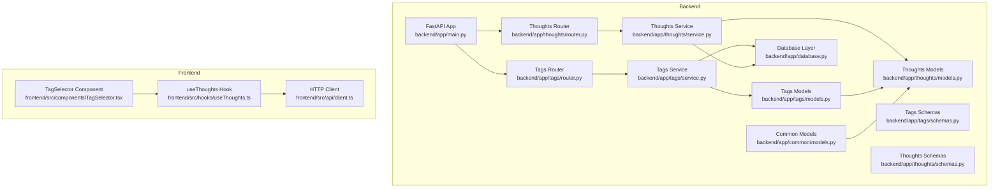
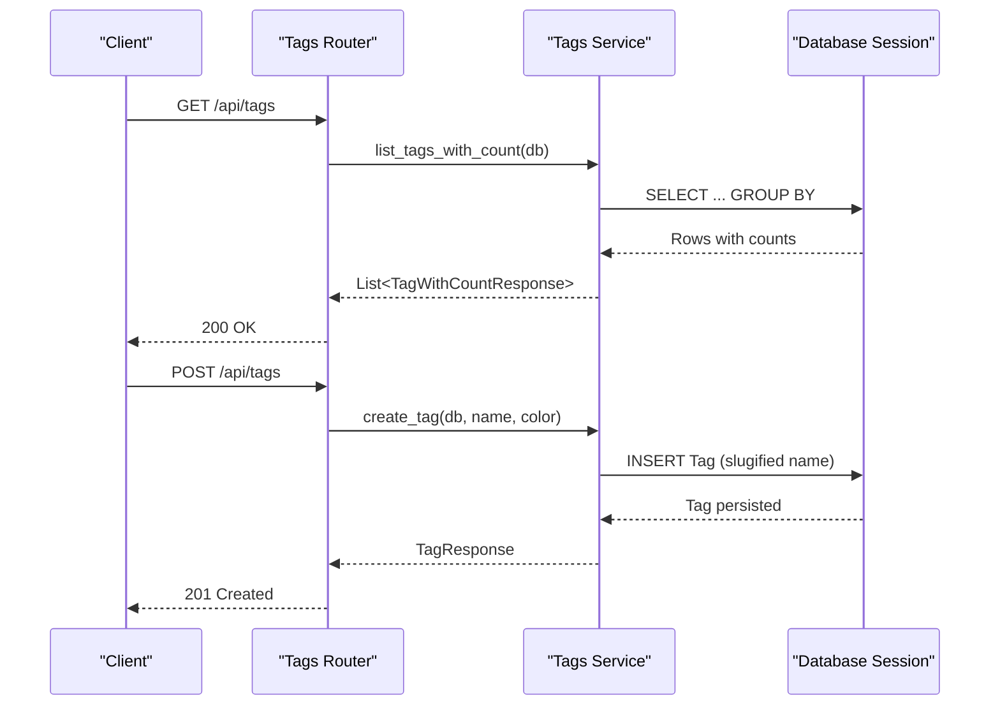
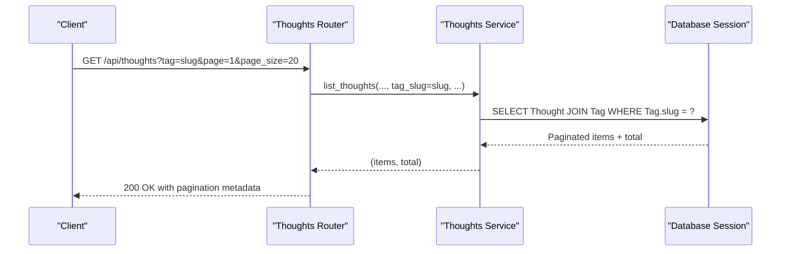
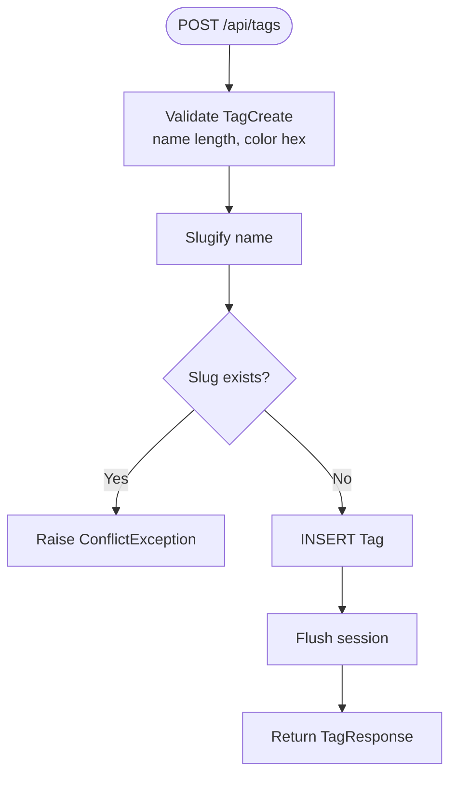
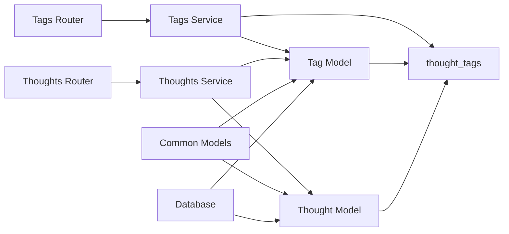

# Tags API

<cite>
**Referenced Files in This Document**
- [backend/app/tags/router.py](file://backend/app/tags/router.py)
- [backend/app/tags/schemas.py](file://backend/app/tags/schemas.py)
- [backend/app/tags/service.py](file://backend/app/tags/service.py)
- [backend/app/tags/models.py](file://backend/app/tags/models.py)
- [backend/app/thoughts/router.py](file://backend/app/thoughts/router.py)
- [backend/app/thoughts/schemas.py](file://backend/app/thoughts/schemas.py)
- [backend/app/thoughts/service.py](file://backend/app/thoughts/service.py)
- [backend/app/thoughts/models.py](file://backend/app/thoughts/models.py)
- [backend/app/common/models.py](file://backend/app/common/models.py)
- [backend/app/database.py](file://backend/app/database.py)
- [backend/app/main.py](file://backend/app/main.py)
- [frontend/src/components/TagSelector.tsx](file://frontend/src/components/TagSelector.tsx)
- [frontend/src/hooks/useThoughts.ts](file://frontend/src/hooks/useThoughts.ts)
- [frontend/src/api/client.ts](file://frontend/src/api/client.ts)
</cite>

## Table of Contents
1. [Introduction](#introduction)
2. [Project Structure](#project-structure)
3. [Core Components](#core-components)
4. [Architecture Overview](#architecture-overview)
5. [Detailed Component Analysis](#detailed-component-analysis)
6. [Dependency Analysis](#dependency-analysis)
7. [Performance Considerations](#performance-considerations)
8. [Troubleshooting Guide](#troubleshooting-guide)
9. [Conclusion](#conclusion)
10. [Appendices](#appendices)

## Introduction
This document provides comprehensive API documentation for the tag management system. It covers tag creation, retrieval, updating, and deletion endpoints, along with tag assignment to thoughts and bulk tag operations. It also documents hierarchical tag organization, parent-child relationships, tag search and filtering, autocomplete functionality, request/response schemas, validation rules, tag naming conventions, and practical workflows such as tag assignment, tag cloud generation, and tag-based content discovery. Finally, it addresses tag normalization, conflict resolution, and performance optimization for large tag sets.

## Project Structure
The tag management system is implemented as a dedicated module within the backend. It integrates with the thoughts module for tag assignment and filtering, and with the shared database layer for persistence. The frontend components consume the tags API to render tag selectors and integrate with thought listing.



**Diagram sources**
- [backend/app/main.py:40-72](file://backend/app/main.py#L40-L72)
- [backend/app/tags/router.py:28](file://backend/app/tags/router.py#L28)
- [backend/app/tags/service.py:17](file://backend/app/tags/service.py#L17)
- [backend/app/tags/models.py:42](file://backend/app/tags/models.py#L42)
- [backend/app/thoughts/router.py:34](file://backend/app/thoughts/router.py#L34)
- [backend/app/thoughts/service.py:20](file://backend/app/thoughts/service.py#L20)
- [backend/app/thoughts/models.py:31](file://backend/app/thoughts/models.py#L31)
- [backend/app/common/models.py:41](file://backend/app/common/models.py#L41)
- [backend/app/database.py:47](file://backend/app/database.py#L47)
- [frontend/src/components/TagSelector.tsx:20](file://frontend/src/components/TagSelector.tsx#L20)
- [frontend/src/hooks/useThoughts.ts:80](file://frontend/src/hooks/useThoughts.ts#L80)
- [frontend/src/api/client.ts:14](file://frontend/src/api/client.ts#L14)

**Section sources**
- [backend/app/main.py:40-72](file://backend/app/main.py#L40-L72)
- [backend/app/database.py:47](file://backend/app/database.py#L47)

## Core Components
- Tags Router: Exposes REST endpoints for listing, creating, retrieving, updating, and deleting tags.
- Tags Service: Implements business logic for tag CRUD and usage counting.
- Tags Schemas: Defines Pydantic models for request/response validation.
- Tags Models: Declares the Tag ORM entity and the many-to-many association table with thoughts.
- Thoughts Integration: Thought creation/update supports assigning tags via tag IDs; listing supports filtering by tag slug.

Key capabilities:
- Tag CRUD endpoints with authentication gating.
- Tag listing with usage counts.
- Tag assignment to thoughts during creation/update.
- Filtering thoughts by tag slug.
- Tag naming conventions and normalization via slug generation.

**Section sources**
- [backend/app/tags/router.py:31-72](file://backend/app/tags/router.py#L31-L72)
- [backend/app/tags/service.py:21-102](file://backend/app/tags/service.py#L21-L102)
- [backend/app/tags/schemas.py:18-45](file://backend/app/tags/schemas.py#L18-L45)
- [backend/app/tags/models.py:42-67](file://backend/app/tags/models.py#L42-L67)
- [backend/app/thoughts/service.py:25-66](file://backend/app/thoughts/service.py#L25-L66)
- [backend/app/thoughts/router.py:37-63](file://backend/app/thoughts/router.py#L37-L63)

## Architecture Overview
The tags API is mounted under /api/tags and depends on the database session factory and authentication. Thought endpoints support tag filtering and tag assignment. The tag model participates in a many-to-many relationship with thoughts via an association table.



**Diagram sources**
- [backend/app/tags/router.py:31-44](file://backend/app/tags/router.py#L31-L44)
- [backend/app/tags/service.py:57-80](file://backend/app/tags/service.py#L57-L80)
- [backend/app/tags/service.py:21-39](file://backend/app/tags/service.py#L21-L39)

## Detailed Component Analysis

### Tag CRUD Endpoints
- List tags with counts
  - Method: GET
  - Path: /api/tags
  - Auth: Not required
  - Response: Array of TagWithCountResponse
  - Behavior: Returns all tags ordered by name with a thought_count for each tag.

- Create tag
  - Method: POST
  - Path: /api/tags
  - Auth: Required
  - Request: TagCreate (name, color)
  - Response: TagResponse
  - Validation: name length 1–64; color hex pattern optional
  - Behavior: Slug is generated from name; uniqueness enforced by slug.

- Get tag by ID
  - Method: GET
  - Path: /api/tags/{tag_id}
  - Auth: Not required
  - Response: TagResponse
  - Behavior: Returns tag by UUID or raises not found.

- Update tag
  - Method: PATCH
  - Path: /api/tags/{tag_id}
  - Auth: Required
  - Request: TagUpdate (name, color)
  - Response: TagResponse
  - Behavior: Updates name and/or color; name change updates slug.

- Delete tag
  - Method: DELETE
  - Path: /api/tags/{tag_id}
  - Auth: Required
  - Response: 204 No Content
  - Behavior: Deletes tag by ID.

Validation rules and naming conventions:
- Name: required, min length 1, max length 64
- Color: optional hex pattern (#RRGGBB)
- Slug: auto-generated from name; unique and indexed
- Unique constraint: name and slug are unique

Conflict resolution:
- Creating a tag with an existing slug raises a conflict error
- Updating a tag preserves uniqueness by regenerating slug on name change

Tag assignment to thoughts:
- During thought creation/update, pass tag_ids to attach tags
- Thought listing supports filtering by tag slug

Tag search and filtering:
- Thought listing supports filtering by tag slug via query parameter tag
- Full-text search across title and content supported via search parameter

Autocomplete functionality:
- Frontend fetches all tags via GET /api/tags and renders selectable chips
- No dedicated autocomplete endpoint is exposed

Tag cloud generation and tag-based discovery:
- Use GET /api/tags to obtain tags with thought_count for visualization
- Filter thoughts by tag slug to discover related content

Bulk tag operations:
- Not exposed as explicit endpoints; bulk operations can be achieved by repeating tag creation/update/delete requests

Examples of workflows:
- Tag assignment during thought creation: pass tag_ids in ThoughtCreate
- Tag assignment during thought update: pass tag_ids in ThoughtUpdate
- Tag cloud: GET /api/tags and render based on thought_count
- Tag-based content discovery: GET /api/thoughts?tag=slug

**Section sources**
- [backend/app/tags/router.py:31-72](file://backend/app/tags/router.py#L31-L72)
- [backend/app/tags/schemas.py:18-45](file://backend/app/tags/schemas.py#L18-L45)
- [backend/app/tags/service.py:21-102](file://backend/app/tags/service.py#L21-L102)
- [backend/app/tags/models.py:42-67](file://backend/app/tags/models.py#L42-L67)
- [backend/app/thoughts/schemas.py:21-39](file://backend/app/thoughts/schemas.py#L21-L39)
- [backend/app/thoughts/service.py:25-66](file://backend/app/thoughts/service.py#L25-L66)
- [backend/app/thoughts/router.py:37-63](file://backend/app/thoughts/router.py#L37-L63)
- [frontend/src/hooks/useThoughts.ts:80-94](file://frontend/src/hooks/useThoughts.ts#L80-L94)
- [frontend/src/components/TagSelector.tsx:20-57](file://frontend/src/components/TagSelector.tsx#L20-L57)

### Tag Entity and Relationships
```mermaid
classDiagram
class Tag {
+UUID id
+string name
+string slug
+string color
+datetime created_at
+datetime updated_at
+Thought[] thoughts
}
class Thought {
+UUID id
+string title
+string slug
+string content
+string summary
+string category
+enum status
+UUID author_id
+Tag[] tags
}
class thought_tags {
+UUID thought_id
+UUID tag_id
}
Thought ||..|| thought_tags : "association"
Tag ||..|| thought_tags : "association"
```

**Diagram sources**
- [backend/app/tags/models.py:42-67](file://backend/app/tags/models.py#L42-L67)
- [backend/app/thoughts/models.py:31-71](file://backend/app/thoughts/models.py#L31-L71)

### Thought Listing with Tag Filtering


**Diagram sources**
- [backend/app/thoughts/router.py:37-63](file://backend/app/thoughts/router.py#L37-L63)
- [backend/app/thoughts/service.py:82-134](file://backend/app/thoughts/service.py#L82-L134)

### Tag Creation Flow


**Diagram sources**
- [backend/app/tags/schemas.py:18-28](file://backend/app/tags/schemas.py#L18-L28)
- [backend/app/tags/service.py:21-39](file://backend/app/tags/service.py#L21-L39)

## Dependency Analysis
- Tags Router depends on Tags Service and authentication dependency.
- Tags Service depends on Tag model, association table, and database session.
- Thoughts Router and Service depend on Tag model and association table for filtering and assignment.
- Common models provide shared mixins and relationships.
- Database layer provides async engine and session factory.



**Diagram sources**
- [backend/app/tags/router.py:19-26](file://backend/app/tags/router.py#L19-L26)
- [backend/app/tags/service.py:17-18](file://backend/app/tags/service.py#L17-L18)
- [backend/app/thoughts/router.py:25-32](file://backend/app/thoughts/router.py#L25-L32)
- [backend/app/thoughts/service.py:20-22](file://backend/app/thoughts/service.py#L20-L22)
- [backend/app/common/models.py:24](file://backend/app/common/models.py#L24)

**Section sources**
- [backend/app/tags/router.py:19-26](file://backend/app/tags/router.py#L19-L26)
- [backend/app/thoughts/router.py:25-32](file://backend/app/thoughts/router.py#L25-L32)
- [backend/app/common/models.py:24](file://backend/app/common/models.py#L24)

## Performance Considerations
- Tag listing with counts uses a LEFT JOIN with GROUP BY; complexity proportional to tags × thought associations. Consider indexing on tag_id and thought_id in the association table.
- Thought listing with tag filter joins Thought with Tag on slug; ensure Tag.slug is indexed.
- Pagination is supported in thought listing; use page and page_size to limit result sets.
- Slug generation occurs on create/update; keep names concise to minimize slug collisions and re-generation attempts.
- For large tag sets, prefer client-side filtering and rendering (as seen in the frontend tag selector) to reduce server load.

[No sources needed since this section provides general guidance]

## Troubleshooting Guide
Common errors and resolutions:
- Conflict on tag creation: Occurs when a tag with the same slug already exists. Normalize the tag name to avoid duplicates.
- Not found on tag retrieval: Ensure the UUID is valid and the tag exists.
- Unauthorized on protected endpoints: Verify authentication token is present and valid.
- Tag assignment failures: Ensure tag_ids correspond to existing tags; invalid IDs are ignored by the service.

**Section sources**
- [backend/app/tags/service.py:31-34](file://backend/app/tags/service.py#L31-L34)
- [backend/app/tags/service.py:44-47](file://backend/app/tags/service.py#L44-L47)
- [backend/app/thoughts/service.py:60-62](file://backend/app/thoughts/service.py#L60-L62)

## Conclusion
The tag management system provides a robust foundation for organizing thoughts through tags. It supports CRUD operations, usage counting, tag assignment during thought creation/update, and filtering by tag slug. The design leverages slug normalization, unique constraints, and efficient queries to maintain data integrity and performance. The frontend integrates seamlessly with the tags API to enable tag selection and discovery workflows.

[No sources needed since this section summarizes without analyzing specific files]

## Appendices

### API Definitions

- List tags with counts
  - Method: GET
  - Path: /api/tags
  - Auth: Not required
  - Response: Array of TagWithCountResponse
  - Example response keys: id, name, slug, color, created_at, thought_count

- Create tag
  - Method: POST
  - Path: /api/tags
  - Auth: Required
  - Request: TagCreate
    - name: string (1–64)
    - color: string? (hex #RRGGBB)
  - Response: TagResponse
  - Example response keys: id, name, slug, color, created_at

- Get tag by ID
  - Method: GET
  - Path: /api/tags/{tag_id}
  - Auth: Not required
  - Response: TagResponse

- Update tag
  - Method: PATCH
  - Path: /api/tags/{tag_id}
  - Auth: Required
  - Request: TagUpdate
    - name: string? (1–64)
    - color: string? (hex #RRGGBB)
  - Response: TagResponse

- Delete tag
  - Method: DELETE
  - Path: /api/tags/{tag_id}
  - Auth: Required
  - Response: 204 No Content

- Thought listing with tag filter
  - Method: GET
  - Path: /api/thoughts
  - Query params:
    - tag: string? (filter by tag slug)
    - search: string?
    - category: string?
    - status: string?
    - page: integer? (default 1)
    - page_size: integer? (default 20, min 1, max 100)
  - Auth: Required
  - Response: ThoughtListResponse with items and pagination metadata

**Section sources**
- [backend/app/tags/router.py:31-72](file://backend/app/tags/router.py#L31-L72)
- [backend/app/tags/schemas.py:18-45](file://backend/app/tags/schemas.py#L18-L45)
- [backend/app/thoughts/router.py:37-63](file://backend/app/thoughts/router.py#L37-L63)
- [backend/app/thoughts/schemas.py:59-65](file://backend/app/thoughts/schemas.py#L59-L65)

### Frontend Integration Notes
- TagSelector component fetches tags and displays them as selectable chips.
- useTags hook fetches tags with counts for rendering tag clouds.
- useThoughts hook supports filtering thoughts by tag slug via query parameters.

**Section sources**
- [frontend/src/components/TagSelector.tsx:20-57](file://frontend/src/components/TagSelector.tsx#L20-L57)
- [frontend/src/hooks/useThoughts.ts:80-94](file://frontend/src/hooks/useThoughts.ts#L80-L94)