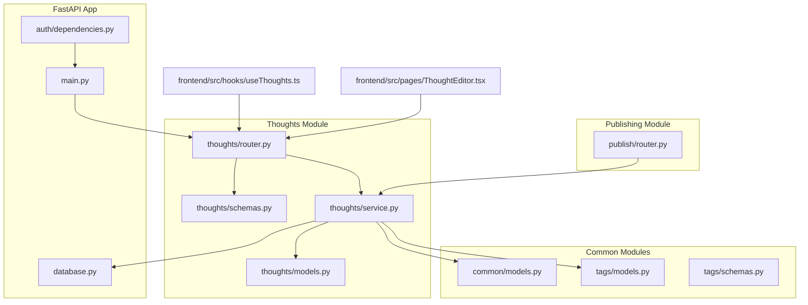
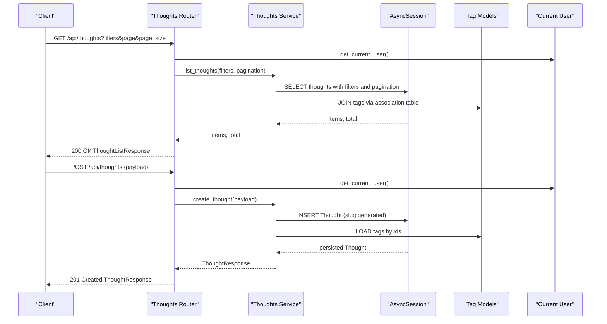
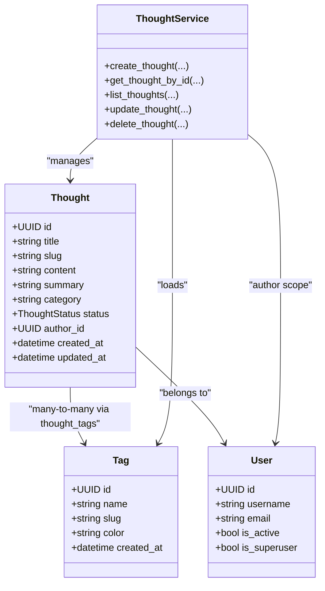

# Thoughts API

<cite>
**Referenced Files in This Document**
- [router.py](file://backend/app/thoughts/router.py)
- [schemas.py](file://backend/app/thoughts/schemas.py)
- [models.py](file://backend/app/thoughts/models.py)
- [service.py](file://backend/app/thoughts/service.py)
- [main.py](file://backend/app/main.py)
- [dependencies.py](file://backend/app/auth/dependencies.py)
- [database.py](file://backend/app/database.py)
- [models.py](file://backend/app/common/models.py)
- [models.py](file://backend/app/tags/models.py)
- [schemas.py](file://backend/app/tags/schemas.py)
- [router.py](file://backend/app/publish/router.py)
- [useThoughts.ts](file://frontend/src/hooks/useThoughts.ts)
- [ThoughtEditor.tsx](file://frontend/src/pages/ThoughtEditor.tsx)
</cite>

## Table of Contents
1. [Introduction](#introduction)
2. [Project Structure](#project-structure)
3. [Core Components](#core-components)
4. [Architecture Overview](#architecture-overview)
5. [Detailed Component Analysis](#detailed-component-analysis)
6. [Dependency Analysis](#dependency-analysis)
7. [Performance Considerations](#performance-considerations)
8. [Troubleshooting Guide](#troubleshooting-guide)
9. [Conclusion](#conclusion)
10. [Appendices](#appendices)

## Introduction
This document provides comprehensive API documentation for the thoughts management system. It covers CRUD operations for thought creation, reading, updating, and deletion, along with the draft/published/archived status lifecycle, filtering and search capabilities, pagination and sorting, request/response schemas, validation rules, and business constraints. It also documents content formatting, rich text handling, and media attachment support, and includes examples of thought creation workflows, bulk operations, and status transitions.

## Project Structure
The thoughts API is implemented as part of a FastAPI application with an asynchronous PostgreSQL backend using SQLAlchemy. The system integrates with authentication, tagging, publishing, and sharing modules.

**Diagram sources**
- [main.py:60-72](file://backend/app/main.py#L60-L72)
- [router.py:33-33](file://backend/app/thoughts/router.py#L33-L33)
- [service.py:24-64](file://backend/app/thoughts/service.py#L24-L64)
- [models.py:30-66](file://backend/app/thoughts/models.py#L30-L66)
- [models.py:41-72](file://backend/app/common/models.py#L41-L72)
- [models.py:41-62](file://backend/app/tags/models.py#L41-L62)
- [router.py:23-51](file://backend/app/publish/router.py#L23-L51)
- [useThoughts.ts:51-71](file://frontend/src/hooks/useThoughts.ts#L51-L71)
- [ThoughtEditor.tsx:55-79](file://frontend/src/pages/ThoughtEditor.tsx#L55-L79)

**Section sources**
- [main.py:60-72](file://backend/app/main.py#L60-L72)
- [router.py:33-33](file://backend/app/thoughts/router.py#L33-L33)
- [service.py:24-64](file://backend/app/thoughts/service.py#L24-L64)

## Core Components
- Thoughts Router: Defines REST endpoints for CRUD operations and listing with filters.
- Thoughts Service: Implements business logic for creation, retrieval, updates, deletions, pagination, and filtering.
- Thoughts Models: Declares the Thought entity, status enum, and relationships.
- Tags Integration: Thought-tag many-to-many relationship and tag schemas.
- Authentication: Current user dependency for authorization.
- Database: Async SQLAlchemy engine and session factory.
- Publishing: Separate endpoints for publishing thoughts to a static site.

**Section sources**
- [router.py:36-115](file://backend/app/thoughts/router.py#L36-L115)
- [service.py:24-172](file://backend/app/thoughts/service.py#L24-L172)
- [models.py:23-69](file://backend/app/thoughts/models.py#L23-L69)
- [models.py:22-62](file://backend/app/tags/models.py#L22-L62)
- [dependencies.py:27-51](file://backend/app/auth/dependencies.py#L27-L51)
- [database.py:25-63](file://backend/app/database.py#L25-L63)
- [router.py:36-63](file://backend/app/publish/router.py#L36-L63)

## Architecture Overview
The thoughts API follows a layered architecture:
- HTTP Layer: FastAPI routes define endpoints and parameter extraction.
- Service Layer: Encapsulates business logic and data access.
- Persistence Layer: SQLAlchemy ORM models and async sessions.
- Authentication: JWT bearer token validation and user extraction.
- Publishing: Optional integration with MkDocs static site generation.

**Diagram sources**
- [router.py:36-81](file://backend/app/thoughts/router.py#L36-L81)
- [service.py:81-133](file://backend/app/thoughts/service.py#L81-L133)
- [models.py:22-62](file://backend/app/tags/models.py#L22-L62)
- [dependencies.py:27-51](file://backend/app/auth/dependencies.py#L27-L51)

## Detailed Component Analysis

### Endpoint Definitions

#### List Thoughts
- Method: GET
- Path: /api/thoughts
- Purpose: Retrieve paginated list of thoughts for the authenticated user with optional filters.
- Query Parameters:
  - category: string, optional
  - tag: string, optional (filter by tag slug)
  - search: string, optional (full-text search on title and content)
  - status: string, optional (draft | published | archived)
  - page: integer, default 1, min 1
  - page_size: integer, default 20, min 1, max 100
- Response: ThoughtListResponse with items, total, page, page_size
- Authentication: Required (current user)
- Authorization: Filters by author_id of the current user

**Section sources**
- [router.py:36-62](file://backend/app/thoughts/router.py#L36-L62)
- [service.py:81-133](file://backend/app/thoughts/service.py#L81-L133)

#### Create Thought
- Method: POST
- Path: /api/thoughts
- Purpose: Create a new thought owned by the authenticated user.
- Request Body: ThoughtCreate
- Response: ThoughtResponse
- Status Codes: 201 Created, 422 Unprocessable Entity (validation), 401 Unauthorized
- Authentication: Required

**Section sources**
- [router.py:65-81](file://backend/app/thoughts/router.py#L65-L81)
- [schemas.py:20-28](file://backend/app/thoughts/schemas.py#L20-L28)

#### Get Thought by ID
- Method: GET
- Path: /api/thoughts/{thought_id}
- Purpose: Fetch a single thought by UUID.
- Path Parameter: thought_id (UUID)
- Response: ThoughtResponse
- Status Codes: 200 OK, 404 Not Found
- Authentication: Required

**Section sources**
- [router.py:84-91](file://backend/app/thoughts/router.py#L84-L91)
- [service.py:67-78](file://backend/app/thoughts/service.py#L67-L78)

#### Update Thought
- Method: PATCH
- Path: /api/thoughts/{thought_id}
- Purpose: Partially update a thought’s fields.
- Path Parameter: thought_id (UUID)
- Request Body: ThoughtUpdate (all fields optional)
- Response: ThoughtResponse
- Status Codes: 200 OK, 404 Not Found
- Authentication: Required

**Section sources**
- [router.py:94-104](file://backend/app/thoughts/router.py#L94-L104)
- [schemas.py:30-38](file://backend/app/thoughts/schemas.py#L30-L38)
- [service.py:136-164](file://backend/app/thoughts/service.py#L136-L164)

#### Delete Thought
- Method: DELETE
- Path: /api/thoughts/{thought_id}
- Purpose: Remove a thought.
- Path Parameter: thought_id (UUID)
- Response: No Content (204)
- Status Codes: 204 No Content, 404 Not Found
- Authentication: Required

**Section sources**
- [router.py:107-115](file://backend/app/thoughts/router.py#L107-L115)
- [service.py:167-171](file://backend/app/thoughts/service.py#L167-L171)

### Request/Response Schemas

#### ThoughtCreate
- Fields:
  - title: string, required, min length 1, max 256
  - content: string, optional, default empty
  - summary: string or null, optional
  - category: string or null, max 64
  - status: string, default "draft", must be one of draft | published | archived
  - tag_ids: array of UUIDs, optional, default empty
- Validation:
  - Pattern enforcement for status
  - Length constraints for title and category
  - Optional fields allow partial updates

**Section sources**
- [schemas.py:20-28](file://backend/app/thoughts/schemas.py#L20-L28)

#### ThoughtUpdate
- Fields:
  - title: string or null, min length 1, max 256
  - content: string or null
  - summary: string or null
  - category: string or null
  - status: string or null, must match draft | published | archived
  - tag_ids: array of UUIDs or null
- Behavior:
  - Only provided fields are updated
  - Non-provided fields remain unchanged

**Section sources**
- [schemas.py:30-38](file://backend/app/thoughts/schemas.py#L30-L38)

#### ThoughtResponse
- Fields:
  - id: UUID
  - title: string
  - slug: string (URL-friendly)
  - content: string
  - summary: string or null
  - category: string or null
  - status: string (draft | published | archived)
  - author_id: UUID
  - tags: array of TagResponse
  - created_at: datetime
  - updated_at: datetime

**Section sources**
- [schemas.py:41-55](file://backend/app/thoughts/schemas.py#L41-L55)
- [schemas.py:31-39](file://backend/app/tags/schemas.py#L31-L39)

#### ThoughtListResponse
- Fields:
  - items: array of ThoughtResponse
  - total: integer
  - page: integer
  - page_size: integer

**Section sources**
- [schemas.py:58-64](file://backend/app/thoughts/schemas.py#L58-L64)

### Business Constraints and Lifecycle

#### Status Management
- Allowed statuses: draft, published, archived
- Default status: draft
- Transitions:
  - draft → published: via publishing workflow
  - draft → archived: via update
  - published → archived: via update
  - archived → draft: via update
- Publishing endpoint enforces that the thought must be in published status before generating a Markdown file.

**Section sources**
- [models.py:23-28](file://backend/app/thoughts/models.py#L23-L28)
- [schemas.py:26-26](file://backend/app/thoughts/schemas.py#L26-L26)
- [schemas.py:36-36](file://backend/app/thoughts/schemas.py#L36-L36)
- [router.py:36-51](file://backend/app/publish/router.py#L36-L51)

#### Slug Generation
- Auto-generated from title during creation
- Ensures uniqueness; appends a random suffix if collision occurs

**Section sources**
- [service.py:41-46](file://backend/app/thoughts/service.py#L41-L46)

#### Tagging
- Many-to-many relationship via association table thought_tags
- Tag IDs can be provided during creation/update to attach/detach tags
- TagResponse includes id, name, slug, color, created_at

**Section sources**
- [models.py:64-66](file://backend/app/thoughts/models.py#L64-L66)
- [models.py:22-37](file://backend/app/tags/models.py#L22-L37)
- [schemas.py:31-39](file://backend/app/tags/schemas.py#L31-L39)

### Filtering and Search

#### Available Filters
- category: exact match on category field
- status: exact match on status enum
- tag: filter by tag slug (requires join with tags)
- search: full-text search across title and content (ILIKE)

#### Pagination and Sorting
- Pagination: page (1-based), page_size (min 1, max 100)
- Sorting: created_at descending (most recent first)

**Section sources**
- [router.py:38-44](file://backend/app/thoughts/router.py#L38-L44)
- [service.py:81-133](file://backend/app/thoughts/service.py#L81-L133)

### Content Formatting and Media

#### Content Type
- content is stored as text; the frontend uses a Markdown editor
- summary is optional text used for previews

#### Rich Text Handling
- The system does not enforce rich text; content is treated as plain text/markdown
- Frontend editor expects Markdown input

#### Media Attachment Support
- No explicit media attachment endpoints are present in the thoughts API
- Media handling would require extending the schema and service layer

**Section sources**
- [models.py:48-49](file://backend/app/thoughts/models.py#L48-L49)
- [ThoughtEditor.tsx:150-157](file://frontend/src/pages/ThoughtEditor.tsx#L150-L157)

### Authentication and Authorization
- Authentication: JWT Bearer tokens validated by get_current_user
- Authorization: All list/create operations are scoped to the current user’s author_id
- Superuser dependency available for privileged operations

**Section sources**
- [dependencies.py:27-51](file://backend/app/auth/dependencies.py#L27-L51)
- [router.py:52-54](file://backend/app/thoughts/router.py#L52-L54)

### Publishing Workflow
- Endpoint: POST /api/publish/{thought_id}
- Requires thought.status = published
- Generates a Markdown file under the MkDocs docs/ directory
- Returns file_path of the generated post

**Section sources**
- [router.py:36-51](file://backend/app/publish/router.py#L36-L51)
- [service.py:136-164](file://backend/app/thoughts/service.py#L136-L164)

### Frontend Integration Examples

#### Listing Thoughts
- The frontend constructs query parameters for category, tag, status, search, page, and page_size
- Uses ThoughtListResponse structure to render lists

**Section sources**
- [useThoughts.ts:51-71](file://frontend/src/hooks/useThoughts.ts#L51-L71)
- [schemas.py:58-64](file://backend/app/thoughts/schemas.py#L58-L64)

#### Creating a Thought
- The editor posts ThoughtCreate payload to /api/thoughts
- On success, navigates to the newly created thought’s detail route

**Section sources**
- [ThoughtEditor.tsx:55-79](file://frontend/src/pages/ThoughtEditor.tsx#L55-L79)
- [schemas.py:20-28](file://backend/app/thoughts/schemas.py#L20-L28)

#### Updating a Thought
- The editor patches ThoughtUpdate payload to /api/thoughts/{id}

**Section sources**
- [ThoughtEditor.tsx:71-73](file://frontend/src/pages/ThoughtEditor.tsx#L71-L73)
- [schemas.py:30-38](file://backend/app/thoughts/schemas.py#L30-L38)

#### Publishing a Thought
- The editor triggers POST /api/publish/{id} when the thought is published
- Opens a share dialog upon successful publish

**Section sources**
- [ThoughtEditor.tsx:81-89](file://frontend/src/pages/ThoughtEditor.tsx#L81-L89)
- [router.py:36-51](file://backend/app/publish/router.py#L36-L51)

## Dependency Analysis

**Diagram sources**
- [models.py:30-69](file://backend/app/thoughts/models.py#L30-L69)
- [models.py:41-62](file://backend/app/tags/models.py#L41-L62)
- [models.py:41-72](file://backend/app/common/models.py#L41-L72)
- [service.py:24-172](file://backend/app/thoughts/service.py#L24-L172)

**Section sources**
- [models.py:30-69](file://backend/app/thoughts/models.py#L30-L69)
- [models.py:22-62](file://backend/app/tags/models.py#L22-L62)
- [models.py:41-72](file://backend/app/common/models.py#L41-L72)
- [service.py:24-172](file://backend/app/thoughts/service.py#L24-L172)

## Performance Considerations
- Pagination limits: page_size constrained to 1–100 to prevent heavy queries.
- Indexes: slug and category are indexed for faster filtering.
- Eager loading: Tags are loaded with selectinload to reduce N+1 queries.
- Ordering: Default sort by created_at desc ensures recent thoughts appear first.
- Asynchronous sessions: Async SQLAlchemy minimizes blocking on I/O.

[No sources needed since this section provides general guidance]

## Troubleshooting Guide
- 401 Unauthorized: Missing or invalid Authorization header; ensure a valid JWT is provided.
- 403 Forbidden: Superuser privilege required for certain operations (not used in thoughts endpoints).
- 404 Not Found: Thought ID does not exist or belongs to another user.
- 422 Unprocessable Entity: Validation errors on request body (e.g., invalid status, title length).
- Slug collision: Creation may append a suffix if slug is not unique.

**Section sources**
- [dependencies.py:38-49](file://backend/app/auth/dependencies.py#L38-L49)
- [service.py:76-78](file://backend/app/thoughts/service.py#L76-L78)
- [schemas.py:22-26](file://backend/app/thoughts/schemas.py#L22-L26)
- [service.py:43-45](file://backend/app/thoughts/service.py#L43-L45)

## Conclusion
The thoughts API provides a robust foundation for managing personal reflections with strong typing, validation, and flexible filtering. It supports a clear status lifecycle, efficient pagination, and seamless integration with tagging and publishing workflows. Future enhancements could include rich text formatting, media attachments, and bulk operations.

[No sources needed since this section summarizes without analyzing specific files]

## Appendices

### API Endpoints Summary

- GET /api/thoughts
  - Query: category, tag, search, status, page, page_size
  - Response: ThoughtListResponse
- POST /api/thoughts
  - Body: ThoughtCreate
  - Response: ThoughtResponse (201)
- GET /api/thoughts/{thought_id}
  - Response: ThoughtResponse
- PATCH /api/thoughts/{thought_id}
  - Body: ThoughtUpdate
  - Response: ThoughtResponse
- DELETE /api/thoughts/{thought_id}
  - Response: 204 No Content

**Section sources**
- [router.py:36-115](file://backend/app/thoughts/router.py#L36-L115)

### Request/Response Schema Reference

- ThoughtCreate
  - title: string (1–256)
  - content: string (optional)
  - summary: string or null (optional)
  - category: string or null (max 64)
  - status: "draft" | "published" | "archived" (default "draft")
  - tag_ids: array of UUIDs (optional)
- ThoughtUpdate
  - title: string or null (1–256)
  - content: string or null
  - summary: string or null
  - category: string or null
  - status: "draft" | "published" | "archived" or null
  - tag_ids: array of UUIDs or null
- ThoughtResponse
  - id, title, slug, content, summary, category, status, author_id, tags[], created_at, updated_at
- ThoughtListResponse
  - items[], total, page, page_size

**Section sources**
- [schemas.py:20-64](file://backend/app/thoughts/schemas.py#L20-L64)

### Status Transition Examples
- Create thought with status=draft
- Update status=published to publish
- Update status=archived to archive
- Update status=draft to unpublish

**Section sources**
- [service.py:136-164](file://backend/app/thoughts/service.py#L136-L164)
- [router.py:36-51](file://backend/app/publish/router.py#L36-L51)