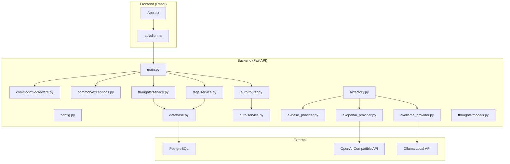
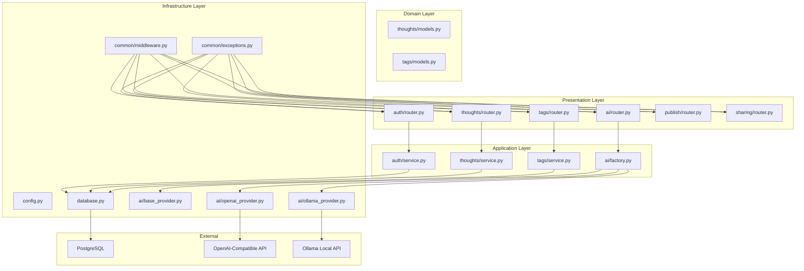
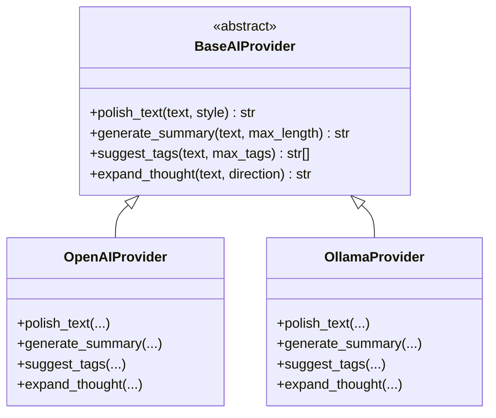
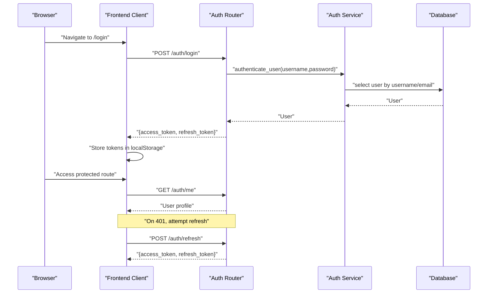
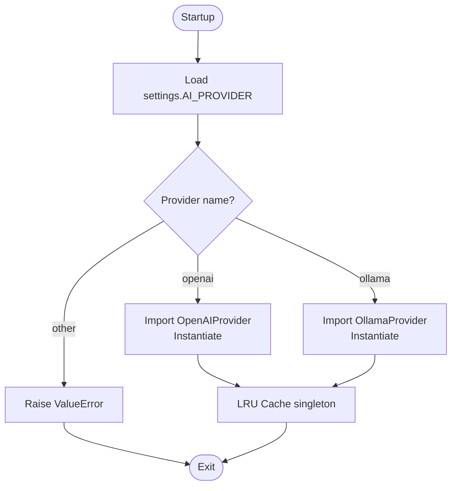
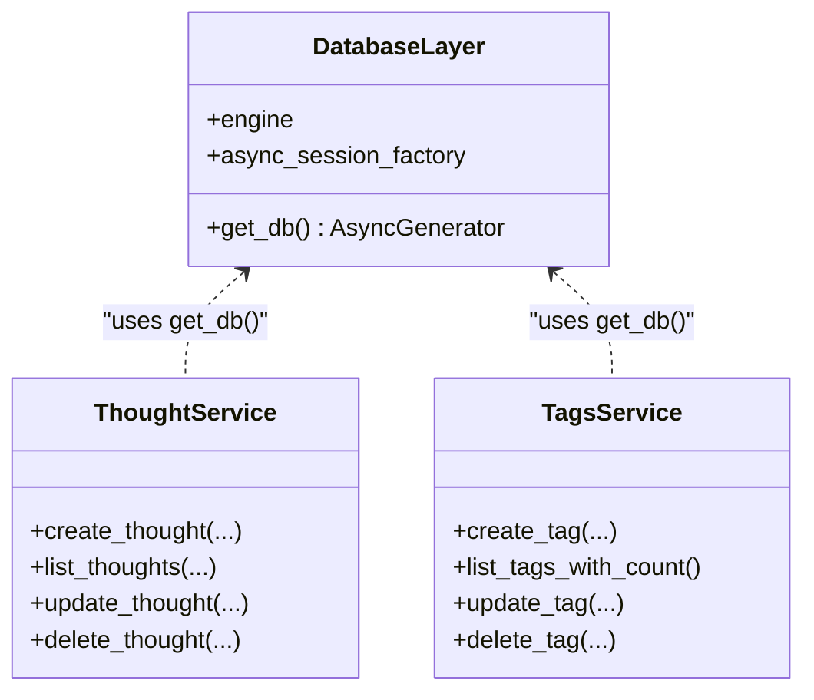
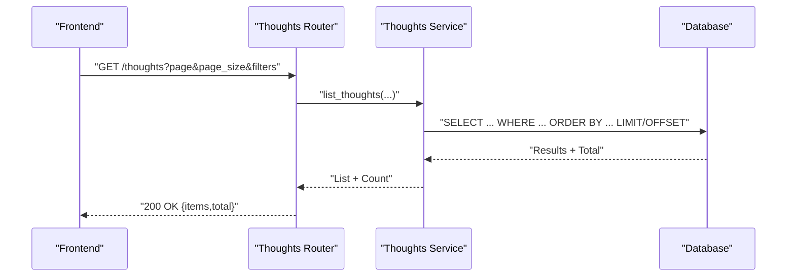
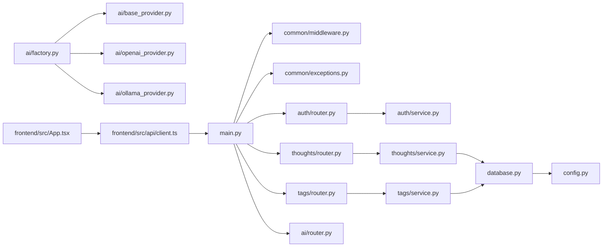

# Architecture Overview

<cite>
**Referenced Files in This Document**
- [backend/app/main.py](file://backend/app/main.py)
- [backend/app/config.py](file://backend/app/config.py)
- [backend/app/database.py](file://backend/app/database.py)
- [backend/app/common/middleware.py](file://backend/app/common/middleware.py)
- [backend/app/common/exceptions.py](file://backend/app/common/exceptions.py)
- [backend/app/auth/router.py](file://backend/app/auth/router.py)
- [backend/app/auth/service.py](file://backend/app/auth/service.py)
- [backend/app/ai/base_provider.py](file://backend/app/ai/base_provider.py)
- [backend/app/ai/factory.py](file://backend/app/ai/factory.py)
- [backend/app/ai/openai_provider.py](file://backend/app/ai/openai_provider.py)
- [backend/app/ai/ollama_provider.py](file://backend/app/ai/ollama_provider.py)
- [backend/app/thoughts/models.py](file://backend/app/thoughts/models.py)
- [backend/app/thoughts/service.py](file://backend/app/thoughts/service.py)
- [backend/app/tags/service.py](file://backend/app/tags/service.py)
- [frontend/src/App.tsx](file://frontend/src/App.tsx)
- [frontend/src/api/client.ts](file://frontend/src/api/client.ts)
- [docker-compose.yml](file://docker-compose.yml)
</cite>

## Table of Contents
1. [Introduction](#introduction)
2. [Project Structure](#project-structure)
3. [Core Components](#core-components)
4. [Architecture Overview](#architecture-overview)
5. [Detailed Component Analysis](#detailed-component-analysis)
6. [Dependency Analysis](#dependency-analysis)
7. [Performance Considerations](#performance-considerations)
8. [Troubleshooting Guide](#troubleshooting-guide)
9. [Conclusion](#conclusion)

## Introduction
This document presents the architecture of PolaZhenJing, an AI-powered personal knowledge wiki and sharing platform. It describes the high-level system design, clean architecture layers, component interactions, and data flow patterns. The system comprises:
- A React frontend that communicates with the backend via HTTP
- A FastAPI backend implementing layered architecture with clear separation of concerns
- An asynchronous PostgreSQL database powered by SQLAlchemy
- Pluggable AI providers (OpenAI-compatible and Ollama) integrated via a Factory and Strategy pattern
- Cross-cutting concerns including authentication, middleware, and centralized exception handling

## Project Structure
The repository is organized into three major parts:
- backend: FastAPI application with routers, services, models, configuration, middleware, and exception handling
- frontend: React application with routing, protected routes, and an HTTP client with JWT interceptors
- docker-compose.yml: Orchestration for database, backend, and frontend services

**Diagram sources**
- [backend/app/main.py:1-88](file://backend/app/main.py#L1-L88)
- [backend/app/config.py:1-61](file://backend/app/config.py#L1-L61)
- [backend/app/database.py:1-62](file://backend/app/database.py#L1-L62)
- [backend/app/common/middleware.py:1-59](file://backend/app/common/middleware.py#L1-L59)
- [backend/app/common/exceptions.py:1-87](file://backend/app/common/exceptions.py#L1-L87)
- [backend/app/auth/router.py:1-91](file://backend/app/auth/router.py#L1-L91)
- [backend/app/auth/service.py:1-165](file://backend/app/auth/service.py#L1-L165)
- [backend/app/ai/factory.py:1-44](file://backend/app/ai/factory.py#L1-L44)
- [backend/app/ai/base_provider.py:1-80](file://backend/app/ai/base_provider.py#L1-L80)
- [backend/app/ai/openai_provider.py:1-105](file://backend/app/ai/openai_provider.py#L1-L105)
- [backend/app/ai/ollama_provider.py:1-99](file://backend/app/ai/ollama_provider.py#L1-L99)
- [backend/app/thoughts/service.py:1-172](file://backend/app/thoughts/service.py#L1-L172)
- [backend/app/thoughts/models.py:1-70](file://backend/app/thoughts/models.py#L1-L70)
- [backend/app/tags/service.py:1-102](file://backend/app/tags/service.py#L1-L102)
- [frontend/src/App.tsx:1-95](file://frontend/src/App.tsx#L1-L95)
- [frontend/src/api/client.ts:1-63](file://frontend/src/api/client.ts#L1-L63)
- [docker-compose.yml:1-67](file://docker-compose.yml#L1-L67)

**Section sources**
- [backend/app/main.py:1-88](file://backend/app/main.py#L1-L88)
- [docker-compose.yml:1-67](file://docker-compose.yml#L1-L67)

## Core Components
- FastAPI application entry point wires routers, middleware, exception handlers, and lifecycle events.
- Configuration centralizes environment-driven settings for database, JWT, AI providers, site publishing, and CORS.
- Asynchronous SQLAlchemy engine and session factory provide robust database access with automatic commit/rollback.
- Middleware adds CORS and request logging; exception handlers unify error responses.
- Authentication router and service implement registration, login, refresh, and JWT token management.
- AI provider abstractions define a Strategy interface; a Factory selects the provider at runtime.
- Thought and Tag services encapsulate domain logic with ORM models and pagination/search/filtering.
- Frontend App sets up protected routes; the HTTP client attaches JWT and refreshes tokens automatically.

**Section sources**
- [backend/app/main.py:1-88](file://backend/app/main.py#L1-L88)
- [backend/app/config.py:1-61](file://backend/app/config.py#L1-L61)
- [backend/app/database.py:1-62](file://backend/app/database.py#L1-L62)
- [backend/app/common/middleware.py:1-59](file://backend/app/common/middleware.py#L1-L59)
- [backend/app/common/exceptions.py:1-87](file://backend/app/common/exceptions.py#L1-L87)
- [backend/app/auth/router.py:1-91](file://backend/app/auth/router.py#L1-L91)
- [backend/app/auth/service.py:1-165](file://backend/app/auth/service.py#L1-L165)
- [backend/app/ai/base_provider.py:1-80](file://backend/app/ai/base_provider.py#L1-L80)
- [backend/app/ai/factory.py:1-44](file://backend/app/ai/factory.py#L1-L44)
- [backend/app/thoughts/service.py:1-172](file://backend/app/thoughts/service.py#L1-L172)
- [backend/app/thoughts/models.py:1-70](file://backend/app/thoughts/models.py#L1-L70)
- [backend/app/tags/service.py:1-102](file://backend/app/tags/service.py#L1-L102)
- [frontend/src/App.tsx:1-95](file://frontend/src/App.tsx#L1-L95)
- [frontend/src/api/client.ts:1-63](file://frontend/src/api/client.ts#L1-L63)

## Architecture Overview
The system follows clean architecture principles:
- Layered separation: Presentation (Routers), Application (Services), Domain (Models), Infrastructure (Database, AI Providers)
- Dependency inversion: Concrete implementations depend on abstractions (e.g., services depend on BaseAIProvider)
- Single responsibility: Each module focuses on a bounded context (auth, thoughts, tags, AI)
- Pluggability: AI provider selection is externalized via configuration and Factory pattern

**Diagram sources**
- [backend/app/auth/router.py:1-91](file://backend/app/auth/router.py#L1-L91)
- [backend/app/thoughts/service.py:1-172](file://backend/app/thoughts/service.py#L1-L172)
- [backend/app/tags/service.py:1-102](file://backend/app/tags/service.py#L1-L102)
- [backend/app/ai/factory.py:1-44](file://backend/app/ai/factory.py#L1-L44)
- [backend/app/ai/base_provider.py:1-80](file://backend/app/ai/base_provider.py#L1-L80)
- [backend/app/ai/openai_provider.py:1-105](file://backend/app/ai/openai_provider.py#L1-L105)
- [backend/app/ai/ollama_provider.py:1-99](file://backend/app/ai/ollama_provider.py#L1-L99)
- [backend/app/database.py:1-62](file://backend/app/database.py#L1-L62)
- [backend/app/common/middleware.py:1-59](file://backend/app/common/middleware.py#L1-L59)
- [backend/app/common/exceptions.py:1-87](file://backend/app/common/exceptions.py#L1-L87)
- [backend/app/config.py:1-61](file://backend/app/config.py#L1-L61)
- [backend/app/thoughts/models.py:1-70](file://backend/app/thoughts/models.py#L1-L70)
- [backend/app/tags/models.py:1-200](file://backend/app/tags/models.py#L1-L200)

## Detailed Component Analysis

### Clean Architecture Layers and Boundaries
- Presentation: Routers expose HTTP endpoints; they depend on services and schemas.
- Application: Services encapsulate business logic, enforce rules, and orchestrate domain operations.
- Domain: Models represent entities and relationships; they are persistence-agnostic.
- Infrastructure: Database engine/session, configuration, middleware, exception handlers, and AI provider implementations.

**Diagram sources**
- [backend/app/ai/base_provider.py:1-80](file://backend/app/ai/base_provider.py#L1-L80)
- [backend/app/ai/openai_provider.py:1-105](file://backend/app/ai/openai_provider.py#L1-L105)
- [backend/app/ai/ollama_provider.py:1-99](file://backend/app/ai/ollama_provider.py#L1-L99)

**Section sources**
- [backend/app/ai/base_provider.py:1-80](file://backend/app/ai/base_provider.py#L1-L80)
- [backend/app/ai/openai_provider.py:1-105](file://backend/app/ai/openai_provider.py#L1-L105)
- [backend/app/ai/ollama_provider.py:1-99](file://backend/app/ai/ollama_provider.py#L1-L99)

### Authentication Flow (Login, Refresh, Protected Routes)
The frontend authenticates users, stores JWT tokens, and refreshes them automatically. The backend validates tokens and exposes protected endpoints.

**Diagram sources**
- [frontend/src/App.tsx:1-95](file://frontend/src/App.tsx#L1-L95)
- [frontend/src/api/client.ts:1-63](file://frontend/src/api/client.ts#L1-L63)
- [backend/app/auth/router.py:1-91](file://backend/app/auth/router.py#L1-L91)
- [backend/app/auth/service.py:1-165](file://backend/app/auth/service.py#L1-L165)
- [backend/app/database.py:1-62](file://backend/app/database.py#L1-L62)

**Section sources**
- [frontend/src/App.tsx:1-95](file://frontend/src/App.tsx#L1-L95)
- [frontend/src/api/client.ts:1-63](file://frontend/src/api/client.ts#L1-L63)
- [backend/app/auth/router.py:1-91](file://backend/app/auth/router.py#L1-L91)
- [backend/app/auth/service.py:1-165](file://backend/app/auth/service.py#L1-L165)

### AI Provider Selection and Strategy Pattern
The Factory pattern selects the AI provider at runtime based on configuration, enabling pluggable components without changing application code.

**Diagram sources**
- [backend/app/ai/factory.py:1-44](file://backend/app/ai/factory.py#L1-L44)
- [backend/app/config.py:1-61](file://backend/app/config.py#L1-L61)

**Section sources**
- [backend/app/ai/factory.py:1-44](file://backend/app/ai/factory.py#L1-L44)
- [backend/app/ai/base_provider.py:1-80](file://backend/app/ai/base_provider.py#L1-L80)
- [backend/app/ai/openai_provider.py:1-105](file://backend/app/ai/openai_provider.py#L1-L105)
- [backend/app/ai/ollama_provider.py:1-99](file://backend/app/ai/ollama_provider.py#L1-L99)
- [backend/app/config.py:1-61](file://backend/app/config.py#L1-L61)

### Database Access and Repository Pattern
The database layer provides an async engine and session factory. While explicit repositories are not implemented, the service layer acts as a repository facade by orchestrating SQLAlchemy operations.

**Diagram sources**
- [backend/app/database.py:1-62](file://backend/app/database.py#L1-L62)
- [backend/app/thoughts/service.py:1-172](file://backend/app/thoughts/service.py#L1-L172)
- [backend/app/tags/service.py:1-102](file://backend/app/tags/service.py#L1-L102)

**Section sources**
- [backend/app/database.py:1-62](file://backend/app/database.py#L1-L62)
- [backend/app/thoughts/service.py:1-172](file://backend/app/thoughts/service.py#L1-L172)
- [backend/app/tags/service.py:1-102](file://backend/app/tags/service.py#L1-L102)

### Request/Response Flow: Thought CRUD
End-to-end flow for listing thoughts with filters and pagination.

**Diagram sources**
- [backend/app/thoughts/service.py:81-134](file://backend/app/thoughts/service.py#L81-L134)
- [backend/app/database.py:46-62](file://backend/app/database.py#L46-L62)

**Section sources**
- [backend/app/thoughts/service.py:81-134](file://backend/app/thoughts/service.py#L81-L134)
- [backend/app/database.py:46-62](file://backend/app/database.py#L46-L62)

### Cross-Cutting Concerns
- Authentication: JWT-based access/refresh tokens, protected routes, and token refresh logic in the frontend client.
- Middleware: CORS configuration and request logging for observability.
- Exception Handling: Centralized handlers returning structured JSON errors.
- Configuration: Environment-driven settings for database, AI providers, JWT, and site publishing.

**Section sources**
- [frontend/src/api/client.ts:1-63](file://frontend/src/api/client.ts#L1-L63)
- [backend/app/common/middleware.py:1-59](file://backend/app/common/middleware.py#L1-L59)
- [backend/app/common/exceptions.py:1-87](file://backend/app/common/exceptions.py#L1-L87)
- [backend/app/config.py:1-61](file://backend/app/config.py#L1-L61)

## Dependency Analysis
The backend composes multiple modules with clear import/export relationships. The frontend integrates with the backend via HTTP and manages authentication state locally.

**Diagram sources**
- [backend/app/main.py:1-88](file://backend/app/main.py#L1-L88)
- [backend/app/common/middleware.py:1-59](file://backend/app/common/middleware.py#L1-L59)
- [backend/app/common/exceptions.py:1-87](file://backend/app/common/exceptions.py#L1-L87)
- [backend/app/auth/router.py:1-91](file://backend/app/auth/router.py#L1-L91)
- [backend/app/thoughts/service.py:1-172](file://backend/app/thoughts/service.py#L1-L172)
- [backend/app/tags/service.py:1-102](file://backend/app/tags/service.py#L1-L102)
- [backend/app/database.py:1-62](file://backend/app/database.py#L1-L62)
- [backend/app/config.py:1-61](file://backend/app/config.py#L1-L61)
- [backend/app/ai/factory.py:1-44](file://backend/app/ai/factory.py#L1-L44)
- [backend/app/ai/base_provider.py:1-80](file://backend/app/ai/base_provider.py#L1-L80)
- [backend/app/ai/openai_provider.py:1-105](file://backend/app/ai/openai_provider.py#L1-L105)
- [backend/app/ai/ollama_provider.py:1-99](file://backend/app/ai/ollama_provider.py#L1-L99)
- [frontend/src/App.tsx:1-95](file://frontend/src/App.tsx#L1-L95)
- [frontend/src/api/client.ts:1-63](file://frontend/src/api/client.ts#L1-L63)

**Section sources**
- [backend/app/main.py:1-88](file://backend/app/main.py#L1-L88)
- [frontend/src/App.tsx:1-95](file://frontend/src/App.tsx#L1-L95)
- [frontend/src/api/client.ts:1-63](file://frontend/src/api/client.ts#L1-L63)

## Performance Considerations
- Asynchronous I/O: SQLAlchemy async engine and httpx clients minimize blocking and improve throughput under load.
- Caching: AI provider factory uses LRU caching to avoid repeated instantiation.
- Pagination and filtering: Thought listing applies filters, ordering, and pagination to reduce payload sizes.
- Connection pooling: Engine settings enable pre-ping and overflow to manage connection lifecycles.
- Observability: Request logging middleware provides timing metrics for performance insights.

[No sources needed since this section provides general guidance]

## Troubleshooting Guide
- Health check endpoint: Use the lightweight /health endpoint to verify application status.
- CORS issues: Verify allowed origins in configuration match the frontend origin.
- Authentication failures: Confirm JWT secret, expiration settings, and token refresh flow.
- AI provider errors: Check provider-specific base URLs and API keys; review logs for HTTP/API errors.
- Database connectivity: Validate DATABASE_URL and ensure the database is healthy and reachable.

**Section sources**
- [backend/app/main.py:74-88](file://backend/app/main.py#L74-L88)
- [backend/app/common/middleware.py:22-36](file://backend/app/common/middleware.py#L22-L36)
- [backend/app/config.py:34-56](file://backend/app/config.py#L34-L56)
- [backend/app/ai/openai_provider.py:59-65](file://backend/app/ai/openai_provider.py#L59-L65)
- [backend/app/ai/ollama_provider.py:53-59](file://backend/app/ai/ollama_provider.py#L53-L59)
- [docker-compose.yml:22-26](file://docker-compose.yml#L22-L26)

## Conclusion
PolaZhenJing’s architecture emphasizes clean separation of concerns, pluggability, and maintainability. The FastAPI backend enforces layered design, while the React frontend delivers a responsive user experience with robust authentication and token management. The Strategy and Factory patterns enable flexible AI provider integration, and centralized configuration and exception handling simplify deployment and operations.