# Super Xiao Wang Memory and Personality System

<cite>
**Referenced Files in This Document**
- [PRD.md](file://PRD.md)
- [app/__init__.py](file://app/__init__.py)
- [app/auth.py](file://app/auth.py)
- [app/converter.py](file://app/converter.py)
- [app/uploader.py](file://app/uploader.py)
- [app/agent.py](file://app/agent.py)
- [app/memory_service.py](file://app/memory_service.py)
- [app/memory_store.py](file://app/memory_store.py)
- [app/memory_guard.py](file://app/memory_guard.py)
- [app/owner_identity.py](file://app/owner_identity.py)
- [app/templates/memory_workbench.html](file://app/templates/memory_workbench.html)
- [migrations/agent_memory/001_postgres_memory_ledger.sql](file://migrations/agent_memory/001_postgres_memory_ledger.sql)
- [init_admin.py](file://init_admin.py)
- [wiki.py](file://wiki.py)
- [requirements.txt](file://requirements.txt)
- [Gemfile](file://Gemfile)
- [app/templates/upload.html](file://app/templates/upload.html)
- [app/templates/articles.html](file://app/templates/articles.html)
- [app/templates/login.html](file://app/templates/login.html)
- [app/templates/register.html](file://app/templates/register.html)
- [app/templates/password.html](file://app/templates/password.html)
- [app/templates/account.html](file://app/templates/account.html)
- [app/templates/verify.html](file://app/templates/verify.html)
- [_config.yml](file://_config.yml)
- [index.html](file://index.html)
- [.github/workflows/deploy.yml](file://.github/workflows/deploy.yml)
</cite>

## Update Summary
**Changes Made**
- Added comprehensive PostgreSQL backend integration with memory service infrastructure
- Integrated security guard system with memory governance and risk classification
- Implemented administrative interfaces for memory management and workbench
- Enhanced memory management with dual backend support (PostgreSQL and JSON fallback)
- Added visitor suggestion system and owner confirmation workflows

## Table of Contents
1. [Introduction](#introduction)
2. [Project Structure](#project-structure)
3. [Core Components](#core-components)
4. [Architecture Overview](#architecture-overview)
5. [Detailed Component Analysis](#detailed-component-analysis)
6. [Memory Management System](#memory-management-system)
7. [Security and Governance](#security-and-governance)
8. [Administrative Interfaces](#administrative-interfaces)
9. [Dependency Analysis](#dependency-analysis)
10. [Performance Considerations](#performance-considerations)
11. [Troubleshooting Guide](#troubleshooting-guide)
12. [Conclusion](#conclusion)
13. [Appendices](#appendices)

## Introduction
This document describes the Super Xiao Wang Memory and Personality System, a comprehensive personal blog wiki platform built on Jekyll and Flask with advanced memory management capabilities. The system now features a major enhancement with PostgreSQL backend integration, providing enterprise-grade memory storage alongside the existing JSON fallback system. It enables users to upload or paste content in multiple formats (Markdown, PDF, Word, HTML), convert it to blog-ready Markdown, select from five distinct blog styles, generate HTML via Jekyll, and publish to GitHub Pages with a single command. 

The system emphasizes simplicity, dual backend memory storage (PostgreSQL and JSON), comprehensive security governance, and powerful content generation capabilities with optional AI-powered enhancements.

## Project Structure
The repository is organized into:
- Flask management application under app/ (authentication, upload, conversion, templates, memory services)
- Jekyll site structure (_posts, _layouts, _includes, assets, _config.yml, index.html)
- PostgreSQL memory ledger with migration support
- CLI tool (wiki.py) for local preview, building, and deployment
- GitHub Actions workflow for automated deployment
- Supporting configuration files (requirements.txt, Gemfile, .github/workflows/deploy.yml)

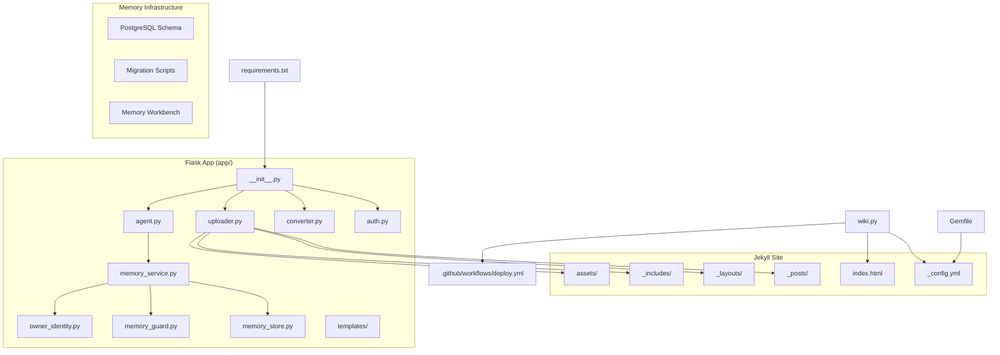

**Diagram sources**
- [app/__init__.py:112-156](file://app/__init__.py#L112-L156)
- [app/agent.py:30-31](file://app/agent.py#L30-L31)
- [app/memory_service.py:13-15](file://app/memory_service.py#L13-L15)
- [app/memory_store.py:62-86](file://app/memory_store.py#L62-L86)
- [migrations/agent_memory/001_postgres_memory_ledger.sql:1-119](file://migrations/agent_memory/001_postgres_memory_ledger.sql#L1-L119)
- [_config.yml:281-307](file://_config.yml#L281-L307)
- [index.html](file://index.html)
- [wiki.py](file://wiki.py)
- [requirements.txt](file://requirements.txt)
- [Gemfile](file://Gemfile)
- [.github/workflows/deploy.yml](file://.github/workflows/deploy.yml)

**Section sources**
- [PRD.md:181-239](file://PRD.md#L181-L239)
- [app/__init__.py:112-156](file://app/__init__.py#L112-L156)
- [_config.yml:281-307](file://_config.yml#L281-L307)

## Core Components
- Flask application factory and middleware for reverse proxy support
- Authentication module with session-based login, registration with QQ email verification, and password management
- File conversion pipeline supporting PDF, DOCX, HTML, and Markdown inputs
- Upload and article management blueprint with style selection, illustration generation, and Jekyll integration
- **NEW** PostgreSQL-backed memory service with dual backend support (PostgreSQL and JSON fallback)
- **NEW** Security guard system with memory governance and risk classification
- **NEW** Administrative interfaces for memory management and workbench operations
- CLI tool for local preview, build, and deployment
- GitHub Actions workflow for automated deployment to GitHub Pages

Key responsibilities:
- app/__init__.py: Application factory, database initialization, blueprint registration, asset serving, and reverse proxy handling
- app/auth.py: User management, session handling, permission catalog, and administrative features
- app/converter.py: Conversion utilities for PDF, DOCX, HTML, and URL fetching with anti-bot safeguards
- app/uploader.py: Upload handling, style selection, LLM-based rewriting, illustration generation, and Jekyll integration
- app/agent.py: **NEW** Memory management APIs, chat integration, and administrative endpoints
- app/memory_service.py: **NEW** Memory service facade with PostgreSQL integration and JSON fallback
- app/memory_store.py: **NEW** PostgreSQL memory ledger with schema management and data operations
- app/memory_guard.py: **NEW** Security governance with risk classification and memory protection
- app/owner_identity.py: **NEW** Identity resolution and trust tier management
- wiki.py: CLI commands for new article creation, listing, local preview, build, and deployment
- Jekyll configuration and templates for blog generation

**Section sources**
- [app/__init__.py:112-156](file://app/__init__.py#L112-L156)
- [app/auth.py:276-432](file://app/auth.py#L276-L432)
- [app/converter.py:448-498](file://app/converter.py#L448-L498)
- [app/uploader.py:27-800](file://app/uploader.py#L27-L800)
- [app/agent.py:14-29](file://app/agent.py#L14-L29)
- [app/memory_service.py:13-15](file://app/memory_service.py#L13-L15)
- [app/memory_store.py:62-86](file://app/memory_store.py#L62-L86)
- [app/memory_guard.py:9-25](file://app/memory_guard.py#L9-L25)
- [app/owner_identity.py:20-67](file://app/owner_identity.py#L20-L67)
- [wiki.py](file://wiki.py)
- [_config.yml:281-307](file://_config.yml#L281-L307)

## Architecture Overview
The system follows a clear separation of concerns with enhanced memory management capabilities:
- Flask manages authentication, uploads, conversion, and **NEW** memory operations
- Converted content is written to _posts/ with YAML front matter
- **NEW** PostgreSQL serves as the primary memory store with JSON fallback
- **NEW** Security guard system protects against memory poisoning and unauthorized modifications
- **NEW** Administrative interfaces provide comprehensive memory management capabilities
- Jekyll builds static HTML from _posts/ using selected layouts and assets
- GitHub Actions automates deployment to GitHub Pages

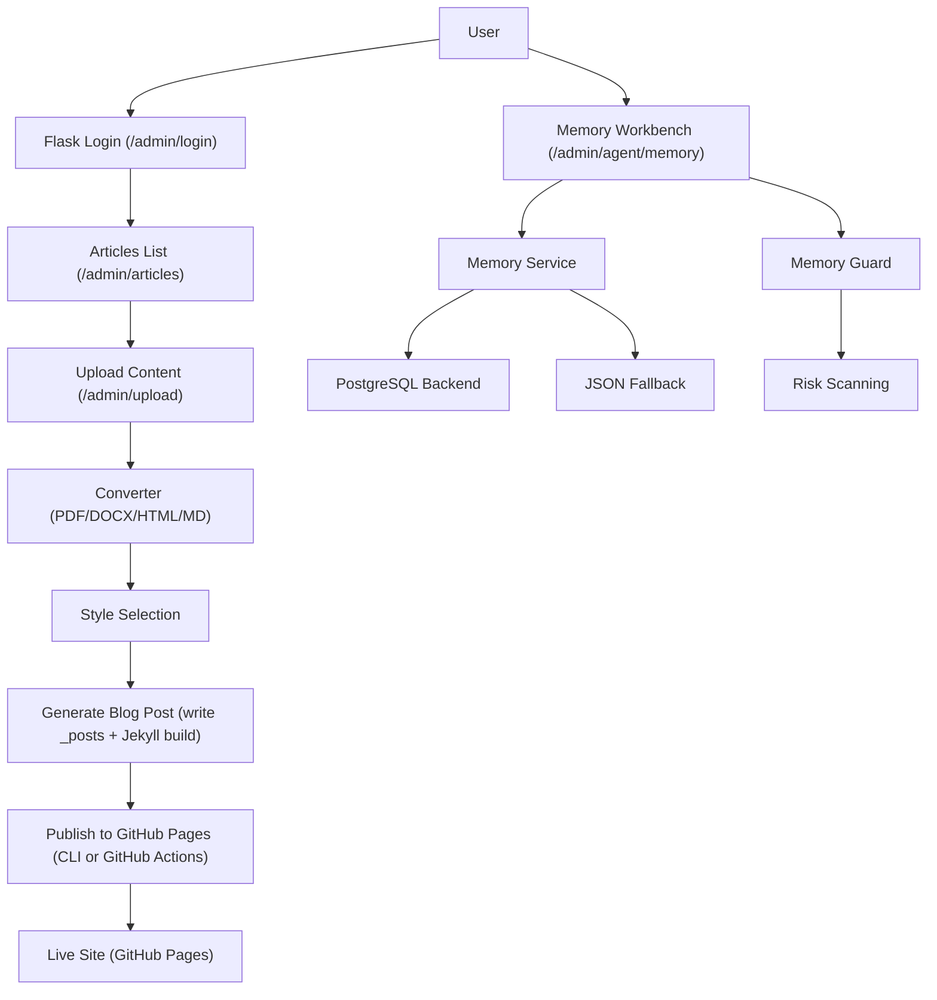

**Diagram sources**
- [app/auth.py:286-403](file://app/auth.py#L286-L403)
- [app/uploader.py:27-800](file://app/uploader.py#L27-L800)
- [app/agent.py:248-254](file://app/agent.py#L248-L254)
- [app/memory_service.py:91-128](file://app/memory_service.py#L91-L128)
- [app/memory_guard.py:51-77](file://app/memory_guard.py#L51-L77)
- [PRD.md:369-381](file://PRD.md#L369-L381)
- [.github/workflows/deploy.yml](file://.github/workflows/deploy.yml)

**Section sources**
- [PRD.md:369-381](file://PRD.md#L369-L381)
- [PRD.md:569-625](file://PRD.md#L569-L625)

## Detailed Component Analysis

### Authentication System
The authentication module provides:
- Login and registration with session-based persistence
- QQ email verification via SMTP with 6-digit codes
- Password hashing using Werkzeug utilities
- Permission catalog and administrative controls
- Profile management including nickname, avatar, and preferences

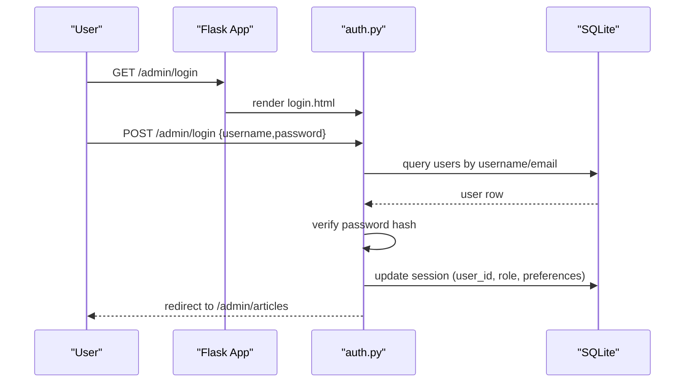

**Diagram sources**
- [app/auth.py:286-403](file://app/auth.py#L286-L403)
- [app/__init__.py:26-41](file://app/__init__.py#L26-L41)

**Section sources**
- [app/auth.py:276-432](file://app/auth.py#L276-L432)
- [app/__init__.py:43-110](file://app/__init__.py#L43-L110)

### File Conversion Pipeline
The converter supports:
- PDF extraction using PyMuPDF with heading detection
- DOCX conversion via Mammoth and html2text
- HTML conversion with content extraction and URL absolutization
- Markdown passthrough with title extraction
- URL fetching with anti-bot detection and safe content extraction

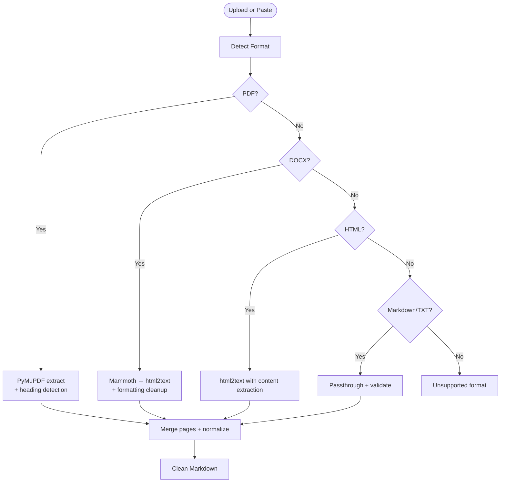

**Diagram sources**
- [app/converter.py:7-498](file://app/converter.py#L7-L498)

**Section sources**
- [app/converter.py:448-498](file://app/converter.py#L448-L498)
- [PRD.md:244-257](file://PRD.md#L244-L257)

### Upload, Style Selection, and Generation
The uploader blueprint orchestrates:
- File upload handling and paste content processing
- Style selection with live preview
- Optional LLM-based rewriting for specific styles
- Illustration generation using MiniMax T2I with Ghibli-style prompts
- Writing YAML front matter and saving to _posts/
- Triggering Jekyll build and verifying output

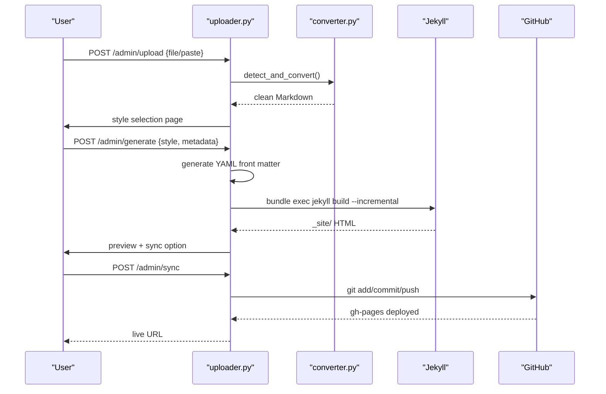

**Diagram sources**
- [app/uploader.py:27-800](file://app/uploader.py#L27-L800)
- [PRD.md:569-625](file://PRD.md#L569-L625)

**Section sources**
- [app/uploader.py:27-800](file://app/uploader.py#L27-L800)
- [PRD.md:569-625](file://PRD.md#L569-L625)

### CLI Tool (wiki.py)
The CLI provides:
- Create new articles with style selection
- List existing articles
- Local preview with Jekyll
- Build static site
- Deploy to GitHub Pages
- Start management server

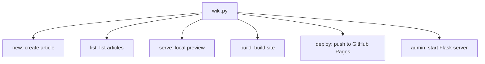

**Diagram sources**
- [PRD.md:334-354](file://PRD.md#L334-L354)
- [wiki.py](file://wiki.py)

**Section sources**
- [PRD.md:334-354](file://PRD.md#L334-L354)
- [wiki.py](file://wiki.py)

### Templates and UI
The Flask templates provide:
- Login, registration, verification, password change, and account management pages
- Article listing with actions (preview, edit, delete)
- Upload interface with file selection and paste content
- Style selection cards with live preview
- **NEW** Memory workbench for administrative memory management

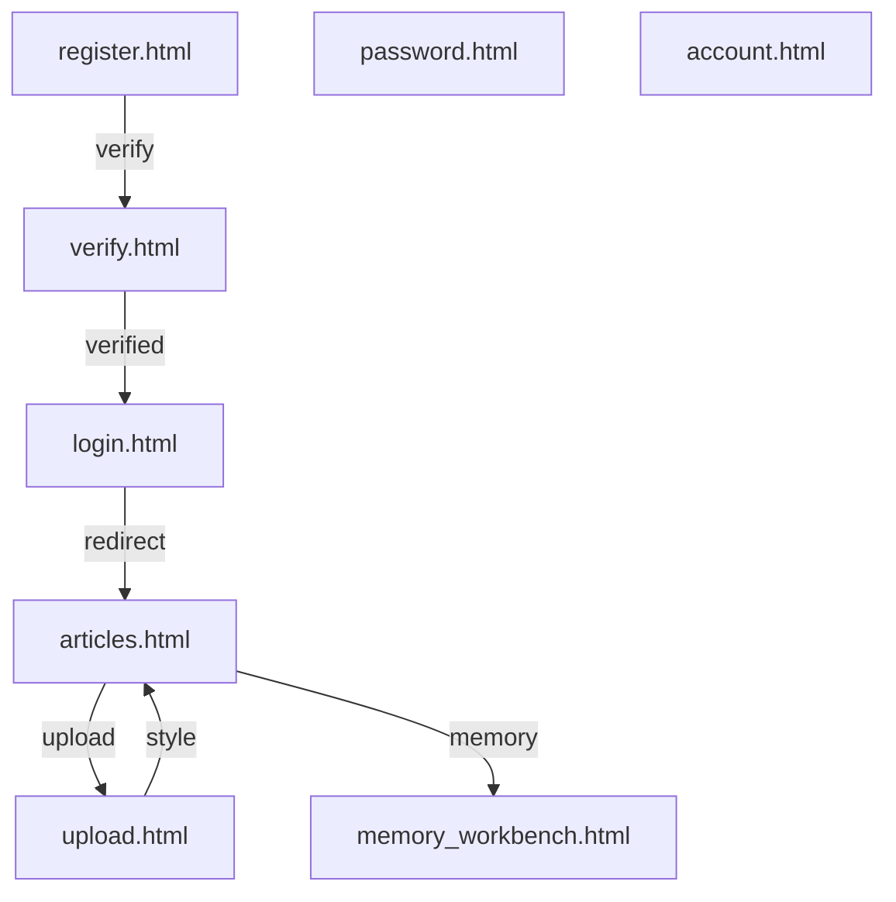

**Diagram sources**
- [app/templates/login.html](file://app/templates/login.html)
- [app/templates/register.html](file://app/templates/register.html)
- [app/templates/verify.html](file://app/templates/verify.html)
- [app/templates/password.html](file://app/templates/password.html)
- [app/templates/account.html](file://app/templates/account.html)
- [app/templates/articles.html](file://app/templates/articles.html)
- [app/templates/upload.html](file://app/templates/upload.html)
- [app/templates/memory_workbench.html](file://app/templates/memory_workbench.html)

**Section sources**
- [app/templates/login.html](file://app/templates/login.html)
- [app/templates/register.html](file://app/templates/register.html)
- [app/templates/verify.html](file://app/templates/verify.html)
- [app/templates/password.html](file://app/templates/password.html)
- [app/templates/account.html](file://app/templates/account.html)
- [app/templates/articles.html](file://app/templates/articles.html)
- [app/templates/upload.html](file://app/templates/upload.html)
- [app/templates/memory_workbench.html](file://app/templates/memory_workbench.html)

## Memory Management System

### PostgreSQL Backend Integration
The system now features comprehensive PostgreSQL integration for memory storage:

- **Memory Store**: Centralized PostgreSQL backend with automatic schema management
- **Dual Backend Support**: Seamless fallback to JSON memory when PostgreSQL is unavailable
- **Schema Management**: Automatic table creation with proper indexes and constraints
- **Data Operations**: Full CRUD operations with JSONB support for complex data structures

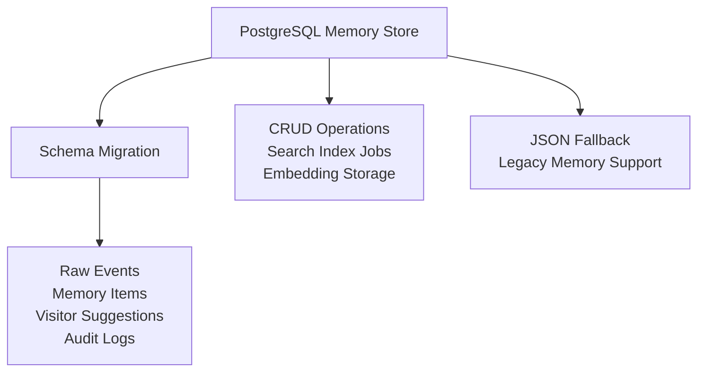

**Diagram sources**
- [app/memory_store.py:77-86](file://app/memory_store.py#L77-L86)
- [migrations/agent_memory/001_postgres_memory_ledger.sql:487-605](file://migrations/agent_memory/001_postgres_memory_ledger.sql#L487-L605)
- [app/memory_service.py:22-30](file://app/memory_service.py#L22-L30)

**Section sources**
- [app/memory_store.py:62-86](file://app/memory_store.py#L62-L86)
- [migrations/agent_memory/001_postgres_memory_ledger.sql:1-119](file://migrations/agent_memory/001_postgres_memory_ledger.sql#L1-L119)
- [app/memory_service.py:82-128](file://app/memory_service.py#L82-L128)

### Memory Service Facade
The memory service provides a unified interface for memory operations:

- **Search Integration**: Combines PostgreSQL and JSON search results
- **Write Operations**: Controlled memory writing with safety checks
- **Status Monitoring**: Comprehensive memory system health monitoring
- **Context Building**: Converts memory results to chat context format

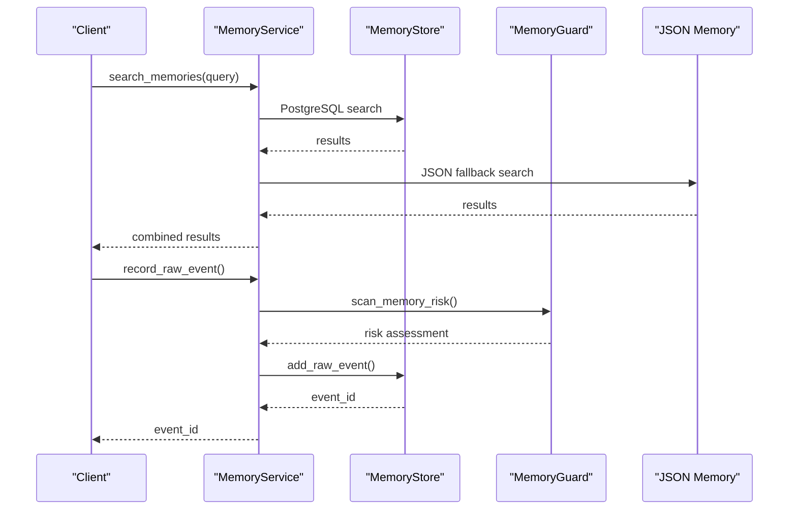

**Diagram sources**
- [app/memory_service.py:131-143](file://app/memory_service.py#L131-L143)
- [app/memory_service.py:162-187](file://app/memory_service.py#L162-L187)
- [app/memory_guard.py:51-77](file://app/memory_guard.py#L51-L77)

**Section sources**
- [app/memory_service.py:131-187](file://app/memory_service.py#L131-L187)
- [app/memory_guard.py:51-77](file://app/memory_guard.py#L51-L77)

### Visitor Suggestion System
The system includes a sophisticated visitor suggestion mechanism:

- **Suggestion Capture**: Non-owner users can propose memory additions
- **Risk Assessment**: Automatic risk scanning for visitor submissions
- **Owner Review**: Owner approval workflow for suggested memories
- **Status Management**: Pending, adopted, discarded, and edited states

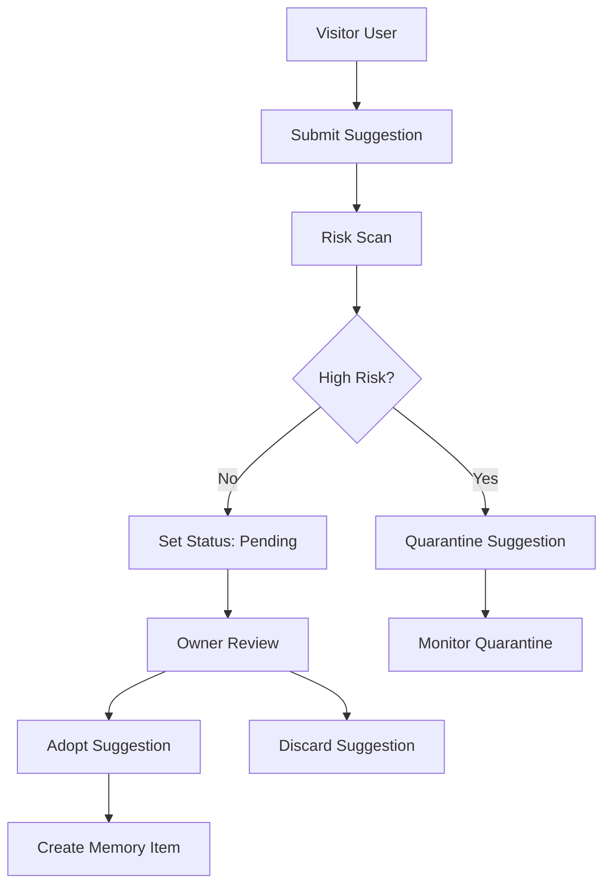

**Diagram sources**
- [app/memory_service.py:208-227](file://app/memory_service.py#L208-L227)
- [app/memory_service.py:321-360](file://app/memory_service.py#L321-L360)
- [app/memory_guard.py:51-77](file://app/memory_guard.py#L51-L77)

**Section sources**
- [app/memory_service.py:208-227](file://app/memory_service.py#L208-L227)
- [app/memory_service.py:321-360](file://app/memory_service.py#L321-L360)
- [app/memory_guard.py:51-77](file://app/memory_guard.py#L51-L77)

## Security and Governance

### Memory Governance System
The security guard system provides comprehensive memory protection:

- **Risk Classification**: Identifies potential memory poisoning attempts
- **Trust-Based Access**: Differentiates between owner, admin, and public users
- **Pattern Detection**: Scans for prompt injection, secret exfiltration, and boundary override patterns
- **Automated Quarantine**: High-risk content is automatically quarantined

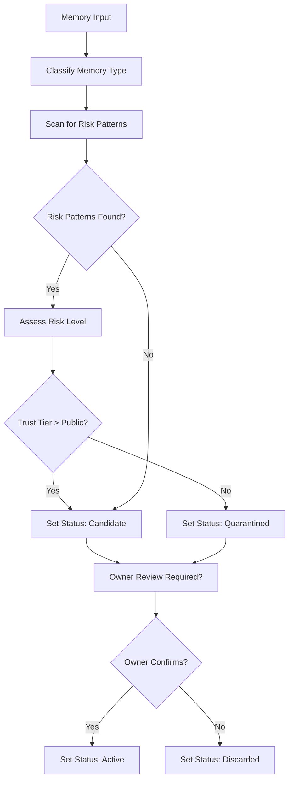

**Diagram sources**
- [app/memory_guard.py:36-48](file://app/memory_guard.py#L36-L48)
- [app/memory_guard.py:51-77](file://app/memory_guard.py#L51-L77)
- [app/memory_guard.py:80-87](file://app/memory_guard.py#L80-L87)

**Section sources**
- [app/memory_guard.py:9-87](file://app/memory_guard.py#L9-L87)
- [app/owner_identity.py:20-67](file://app/owner_identity.py#L20-L67)

### Identity Resolution and Trust Management
The system implements a hierarchical trust model:

- **Owner Identity**: Full administrative privileges and trust
- **Admin Identity**: Limited administrative capabilities
- **Authenticated Users**: Trusted user privileges
- **Public Users**: Basic visitor privileges

**Section sources**
- [app/owner_identity.py:20-157](file://app/owner_identity.py#L20-L157)

## Administrative Interfaces

### Memory Workbench
The administrative interface provides comprehensive memory management:

- **Search Interface**: Real-time memory search with status filtering
- **Visitor Suggestion Management**: Approve, discard, or edit visitor suggestions
- **System Status Monitoring**: PostgreSQL connectivity and memory statistics
- **Real-time Updates**: Live search results and suggestion status changes

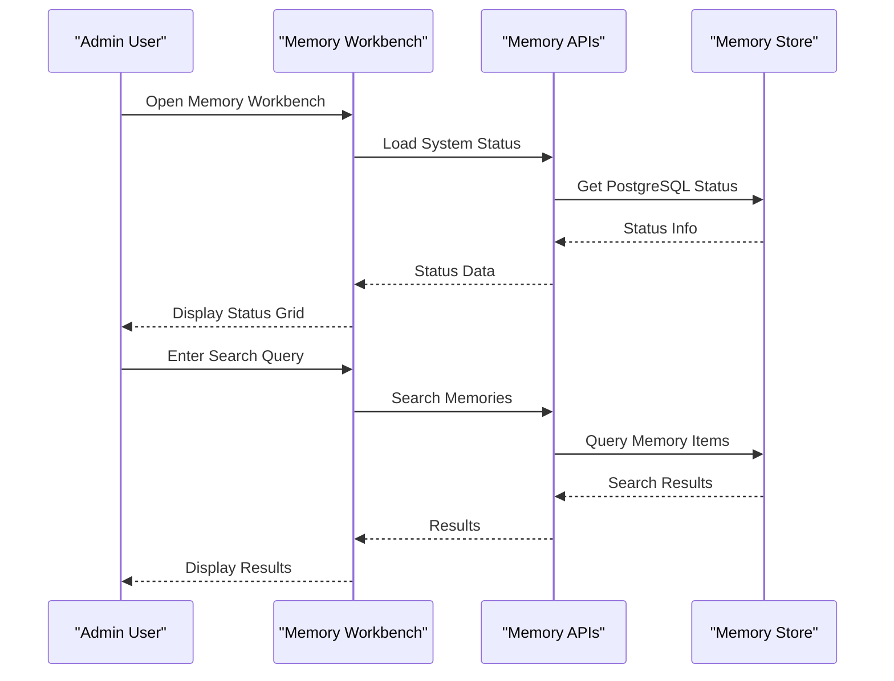

**Diagram sources**
- [app/templates/memory_workbench.html:148-183](file://app/templates/memory_workbench.html#L148-L183)
- [app/agent.py:248-254](file://app/agent.py#L248-L254)

**Section sources**
- [app/templates/memory_workbench.html:1-186](file://app/templates/memory_workbench.html#L1-L186)
- [app/agent.py:248-254](file://app/agent.py#L248-L254)

### API Endpoints
The system exposes comprehensive APIs for memory management:

- **Memory Status**: `/admin/api/agent/memory/status`
- **Memory Search**: `/admin/api/agent/memory/search`
- **Memory Initialization**: `/admin/api/agent/memory/init`
- **Owner Confirmation**: `/admin/api/agent/memory/confirm-write`
- **Memory Management**: `/admin/api/agent/memory/items`
- **Visitor Suggestions**: `/admin/api/agent/memory/visitor-suggestions`

**Section sources**
- [app/agent.py:99-245](file://app/agent.py#L99-L245)

## Dependency Analysis
External dependencies:
- Python: Flask, PyMuPDF, mammoth, html2text, python-dotenv, **NEW** psycopg2 for PostgreSQL
- Ruby: Jekyll, jekyll-feed, jekyll-seo-tag, jekyll-paginate
- **NEW** PostgreSQL extensions: pg_trgm, vector/pgvector for advanced search

Internal dependencies:
- app/__init__.py initializes SQLite tables and registers blueprints
- app/auth.py depends on app/__init__.py for database access
- app/uploader.py depends on app/converter.py and app/auth.py
- **NEW** app/agent.py depends on app/memory_service.py for memory operations
- **NEW** app/memory_service.py depends on app/memory_store.py and app/memory_guard.py
- **NEW** app/memory_store.py manages PostgreSQL schema and data operations
- wiki.py integrates with Jekyll and GitHub Actions

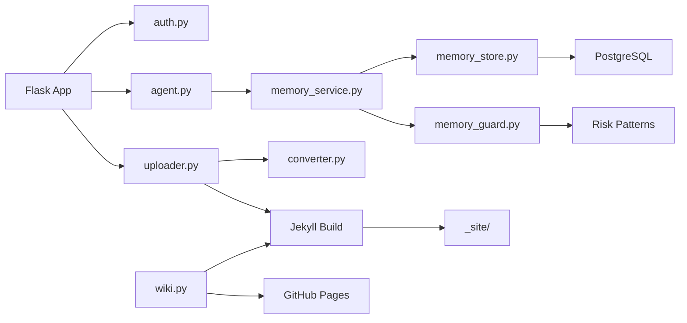

**Diagram sources**
- [app/__init__.py:112-156](file://app/__init__.py#L112-L156)
- [app/auth.py:18-19](file://app/auth.py#L18-L19)
- [app/converter.py:1-498](file://app/converter.py#L1-L498)
- [app/uploader.py:20-24](file://app/uploader.py#L20-L24)
- [app/agent.py:14-27](file://app/agent.py#L14-L27)
- [app/memory_service.py:13-15](file://app/memory_service.py#L13-L15)
- [app/memory_store.py:15-22](file://app/memory_store.py#L15-L22)
- [wiki.py](file://wiki.py)

**Section sources**
- [PRD.md:813-838](file://PRD.md#L813-L838)
- [requirements.txt](file://requirements.txt)
- [Gemfile](file://Gemfile)

## Performance Considerations
- Jekyll incremental builds minimize rebuild time for updates
- SQLite provides zero-config local storage with WAL mode for improved concurrency
- **NEW** PostgreSQL offers scalable memory storage with proper indexing and search capabilities
- **NEW** JSON fallback ensures system continuity when PostgreSQL is unavailable
- **NEW** Memory search combines PostgreSQL and JSON results for comprehensive coverage
- Image processing and illustration generation are optional and rely on external APIs
- Anti-bot detection prevents wasted processing on protected or login-walled pages
- **NEW** Memory audit logs provide performance insights and troubleshooting data

## Troubleshooting Guide
Common issues and resolutions:
- Authentication failures: verify credentials and email verification status
- Upload errors: check file formats, sizes, and conversion library availability
- Jekyll build failures: inspect generated front matter and content structure
- GitHub deployment issues: ensure Git configuration, remote setup, and authentication
- **NEW** PostgreSQL connection failures: verify DATABASE_URL environment variable and network connectivity
- **NEW** Memory service unavailability: check POLA_MEMORY_DB_ENABLED and POLA_MEMORY_WRITE_ENABLED flags
- **NEW** Memory search performance: ensure proper indexing and consider PostgreSQL optimization
- **NEW** Visitor suggestion processing: verify owner confirmation workflow and risk assessment results

**Section sources**
- [app/auth.py:286-403](file://app/auth.py#L286-L403)
- [app/converter.py:448-498](file://app/converter.py#L448-L498)
- [PRD.md:611-674](file://PRD.md#L611-L674)
- [app/memory_store.py:70-75](file://app/memory_store.py#L70-L75)
- [app/memory_service.py:95-103](file://app/memory_service.py#L95-L103)

## Conclusion
The Super Xiao Wang Memory and Personality System delivers a streamlined, powerful solution for personal blogging with enterprise-grade memory management capabilities. The major enhancement with PostgreSQL backend integration provides scalable, secure memory storage while maintaining backward compatibility with the existing JSON fallback system. The comprehensive security governance system protects against memory poisoning and unauthorized modifications, while the administrative interfaces enable efficient memory management and oversight.

By combining Flask for management, Jekyll for static site generation, and PostgreSQL for memory storage, the system achieves fast builds, easy deployment, flexible theming, and robust memory management. The system's focus on simplicity, dual backend memory storage, comprehensive security, and optional AI-powered enhancements makes it suitable for writers and developers who want to publish high-quality content with minimal friction while maintaining strict control over their knowledge base.

## Appendices

### Jekyll Configuration Highlights
- Title, description, URL, and baseurl
- Markdown processor and highlighter
- Permalink structure and pagination
- Default layout for posts

**Section sources**
- [_config.yml:281-307](file://_config.yml#L281-L307)

### GitHub Actions Deployment
- Ruby and Jekyll installation
- Jekyll build execution
- Deployment to gh-pages branch

**Section sources**
- [.github/workflows/deploy.yml](file://.github/workflows/deploy.yml)

### PostgreSQL Memory Schema
The system uses a comprehensive schema design for memory management:

- **Raw Events**: Captures all memory input events with risk assessment
- **Memory Items**: Stores processed memories with status and metadata
- **Visitor Suggestions**: Manages non-owner memory proposals
- **Audit Logs**: Tracks all memory modifications and access
- **Search Index Jobs**: Handles asynchronous search index updates

**Section sources**
- [migrations/agent_memory/001_postgres_memory_ledger.sql:487-605](file://migrations/agent_memory/001_postgres_memory_ledger.sql#L487-L605)

### Environment Variables
Key configuration variables for memory management:

- `DATABASE_URL`: PostgreSQL connection string
- `POLA_MEMORY_DB_ENABLED`: Enable PostgreSQL read operations
- `POLA_MEMORY_WRITE_ENABLED`: Enable memory write operations
- `POLA_AGENT_OWNER_EMAILS`: Owner email addresses
- `POLA_AGENT_OWNER_USERNAMES`: Owner usernames
- `POLA_AGENT_OWNER_PHONES`: Owner phone numbers

**Section sources**
- [app/memory_service.py:82-88](file://app/memory_service.py#L82-L88)
- [app/owner_identity.py:75-80](file://app/owner_identity.py#L75-L80)

### Admin User Initialization
The system includes a utility script for initializing admin users:

- Creates admin user with predefined credentials
- Inserts into SQLite database with hashed password
- Provides console feedback on success or failure

**Section sources**
- [init_admin.py:1-21](file://init_admin.py#L1-L21)