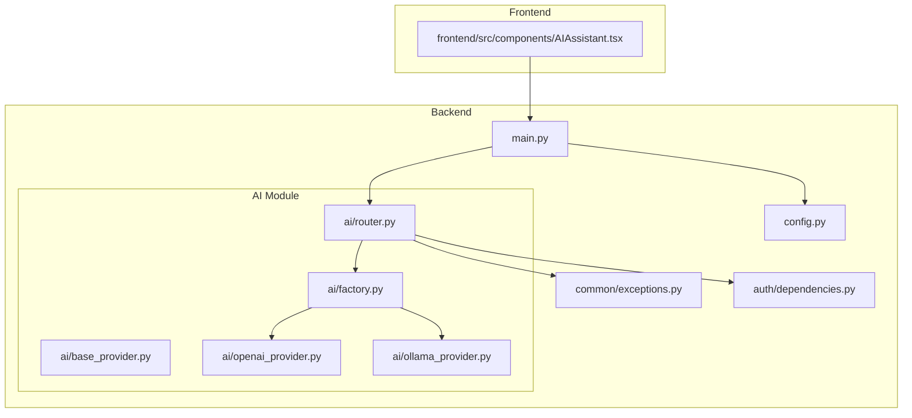
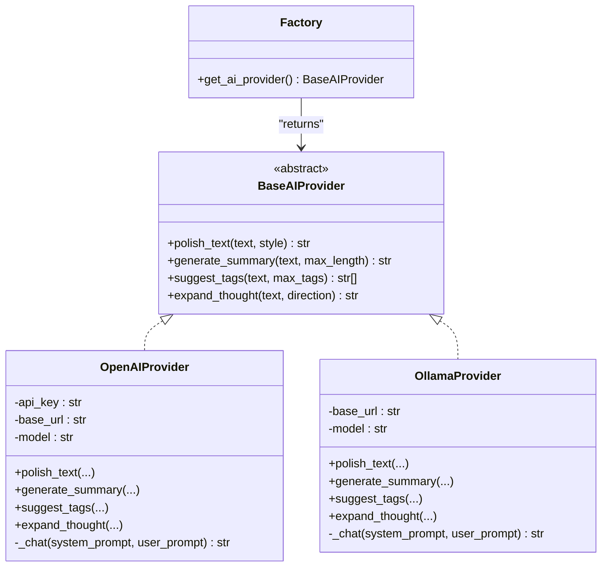
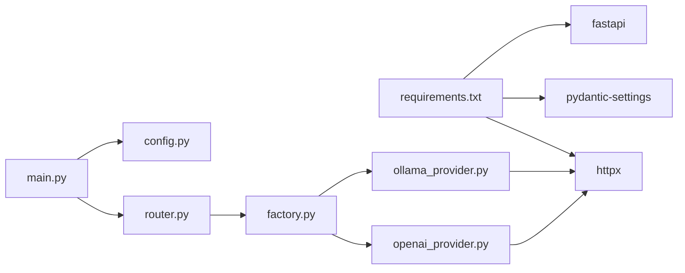
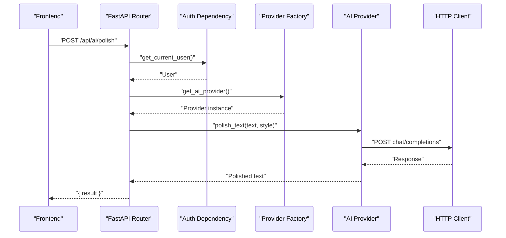

# AI Integration

<cite>
**Referenced Files in This Document**
- [base_provider.py](file://backend/app/ai/base_provider.py)
- [factory.py](file://backend/app/ai/factory.py)
- [openai_provider.py](file://backend/app/ai/openai_provider.py)
- [ollama_provider.py](file://backend/app/ai/ollama_provider.py)
- [router.py](file://backend/app/ai/router.py)
- [config.py](file://backend/app/config.py)
- [main.py](file://backend/app/main.py)
- [requirements.txt](file://backend/requirements.txt)
- [exceptions.py](file://backend/app/common/exceptions.py)
- [dependencies.py](file://backend/app/auth/dependencies.py)
- [AIAssistant.tsx](file://frontend/src/components/AIAssistant.tsx)
</cite>

## Table of Contents
1. [Introduction](#introduction)
2. [Project Structure](#project-structure)
3. [Core Components](#core-components)
4. [Architecture Overview](#architecture-overview)
5. [Detailed Component Analysis](#detailed-component-analysis)
6. [Dependency Analysis](#dependency-analysis)
7. [Performance Considerations](#performance-considerations)
8. [Troubleshooting Guide](#troubleshooting-guide)
9. [Conclusion](#conclusion)
10. [Appendices](#appendices)

## Introduction
This document explains the AI integration architecture for PolaZhenJing, focusing on the pluggable AI provider system built with the Strategy and Factory patterns. It covers the base AI provider interface, concrete implementations for OpenAI-compatible APIs and local Ollama LLMs, the provider factory for dynamic selection, and the AI router endpoints that power content enhancement, summarization, tagging, and creative expansion. It also documents configuration, error handling, timeouts, and operational guidance.

## Project Structure
The AI subsystem resides under backend/app/ai and integrates with the FastAPI application via a dedicated router. The frontend exposes an AI assistant panel that calls the backend endpoints.

**Diagram sources**
- [main.py:60-72](file://backend/app/main.py#L60-L72)
- [router.py:18-21](file://backend/app/ai/router.py#L18-L21)
- [factory.py:19-44](file://backend/app/ai/factory.py#L19-L44)
- [openai_provider.py:25-36](file://backend/app/ai/openai_provider.py#L25-L36)
- [ollama_provider.py:24-34](file://backend/app/ai/ollama_provider.py#L24-L34)
- [config.py:44-50](file://backend/app/config.py#L44-L50)
- [exceptions.py:66-86](file://backend/app/common/exceptions.py#L66-L86)
- [dependencies.py:28-52](file://backend/app/auth/dependencies.py#L28-L52)
- [AIAssistant.tsx:29-49](file://frontend/src/components/AIAssistant.tsx#L29-L49)

**Section sources**
- [main.py:60-72](file://backend/app/main.py#L60-L72)
- [router.py:24-24](file://backend/app/ai/router.py#L24-L24)
- [config.py:44-50](file://backend/app/config.py#L44-L50)

## Core Components
- Base AI Provider Interface: Defines the contract for all AI providers, including methods for text polishing, summarization, tag suggestion, and thought expansion.
- Concrete Providers:
  - OpenAI Provider: Calls any OpenAI-compatible chat-completions API, configurable via base URL and model.
  - Ollama Provider: Calls a local Ollama REST API for self-hosted LLM inference.
- Provider Factory: Selects and returns the configured provider instance at runtime.
- AI Router: Exposes FastAPI endpoints for the four AI operations, protected by authentication and returning structured responses.
- Configuration: Centralized settings for provider selection and credentials.
- Frontend Integration: An AI assistant panel that invokes the backend endpoints.

**Section sources**
- [base_provider.py:18-82](file://backend/app/ai/base_provider.py#L18-L82)
- [openai_provider.py:25-106](file://backend/app/ai/openai_provider.py#L25-L106)
- [ollama_provider.py:24-100](file://backend/app/ai/ollama_provider.py#L24-L100)
- [factory.py:19-44](file://backend/app/ai/factory.py#L19-L44)
- [router.py:27-110](file://backend/app/ai/router.py#L27-L110)
- [config.py:44-50](file://backend/app/config.py#L44-L50)
- [AIAssistant.tsx:29-49](file://frontend/src/components/AIAssistant.tsx#L29-L49)

## Architecture Overview
The AI integration follows a Strategy pattern at the interface level and a Factory pattern for runtime provider selection. The router depends on the factory to resolve the provider, enabling seamless switching between OpenAI and Ollama without changing endpoint logic.

**Diagram sources**
- [base_provider.py:18-82](file://backend/app/ai/base_provider.py#L18-L82)
- [openai_provider.py:25-106](file://backend/app/ai/openai_provider.py#L25-L106)
- [ollama_provider.py:24-100](file://backend/app/ai/ollama_provider.py#L24-L100)
- [factory.py:19-44](file://backend/app/ai/factory.py#L19-L44)

## Detailed Component Analysis

### Base AI Provider Interface
- Purpose: Define a uniform contract for all AI providers.
- Methods:
  - polish_text: Rewrite text for clarity and style.
  - generate_summary: Produce a concise summary with a length constraint.
  - suggest_tags: Return keyword tags as a JSON-parseable list.
  - expand_thought: Transform a brief thought into a longer piece.
- Design: Abstract base class using Python’s ABC to enforce implementation.

Implementation reference:
- [base_provider.py:18-82](file://backend/app/ai/base_provider.py#L18-L82)

**Section sources**
- [base_provider.py:18-82](file://backend/app/ai/base_provider.py#L18-L82)

### OpenAI Provider
- Configuration:
  - OPENAI_API_KEY: Authentication token.
  - OPENAI_BASE_URL: API base URL (supports OpenAI, Azure OpenAI, and compatible services).
  - OPENAI_MODEL: Model identifier.
- Behavior:
  - Uses an internal chat helper to send system and user prompts to the chat completions endpoint.
  - Applies a fixed temperature for balanced creativity.
  - Parses the assistant’s response content and strips whitespace.
  - Handles non-200 responses by raising a runtime error with logged details.
  - Tag suggestions are parsed from JSON arrays; malformed responses are handled gracefully.
- Timeouts:
  - Async HTTP client configured with a 60-second timeout for OpenAI requests.

Implementation reference:
- [openai_provider.py:25-106](file://backend/app/ai/openai_provider.py#L25-L106)
- [config.py:46-48](file://backend/app/config.py#L46-L48)

**Section sources**
- [openai_provider.py:25-106](file://backend/app/ai/openai_provider.py#L25-L106)
- [config.py:46-48](file://backend/app/config.py#L46-L48)

### Ollama Provider
- Configuration:
  - OLLAMA_BASE_URL: Local or remote Ollama API endpoint.
  - OLLAMA_MODEL: Model name to use.
- Behavior:
  - Calls Ollama’s /api/chat endpoint with streaming disabled.
  - Parses the assistant reply from the message field.
  - Robust error handling for non-200 responses and JSON parsing failures.
- Timeouts:
  - Async HTTP client configured with a 120-second timeout suitable for larger local models.

Implementation reference:
- [ollama_provider.py:24-100](file://backend/app/ai/ollama_provider.py#L24-L100)
- [config.py:49-50](file://backend/app/config.py#L49-L50)

**Section sources**
- [ollama_provider.py:24-100](file://backend/app/ai/ollama_provider.py#L24-L100)
- [config.py:49-50](file://backend/app/config.py#L49-L50)

### AI Provider Factory
- Purpose: Dynamically select and instantiate the AI provider based on configuration.
- Supported providers:
  - openai: Returns an OpenAIProvider instance.
  - ollama: Returns an OllamaProvider instance.
- Caching:
  - Uses LRU cache with maxsize=1 to ensure a singleton provider instance per process.
- Error handling:
  - Raises a ValueError for unsupported provider names.

Implementation reference:
- [factory.py:19-44](file://backend/app/ai/factory.py#L19-L44)
- [config.py:45](file://backend/app/config.py#L45)

**Section sources**
- [factory.py:19-44](file://backend/app/ai/factory.py#L19-L44)
- [config.py:45](file://backend/app/config.py#L45)

### AI Router Endpoints
- Prefix: /api/ai
- Authentication: Requires a valid JWT access token via the get_current_user dependency.
- Endpoints:
  - POST /polish: Accepts text and style; returns polished text.
  - POST /summarize: Accepts text and max_length; returns summary.
  - POST /suggest-tags: Accepts text and max_tags; returns tags array.
  - POST /expand: Accepts text and direction; returns expanded text.
- Request/Response Models:
  - Request bodies validated with Pydantic models.
  - Responses wrapped in typed models for consistent JSON.
- Error Handling:
  - Catches provider exceptions and logs them.
  - Returns HTTP 502 with a generic “AI service unavailable” detail.

Implementation reference:
- [router.py:27-110](file://backend/app/ai/router.py#L27-L110)
- [dependencies.py:28-52](file://backend/app/auth/dependencies.py#L28-L52)
- [exceptions.py:66-86](file://backend/app/common/exceptions.py#L66-L86)

**Section sources**
- [router.py:27-110](file://backend/app/ai/router.py#L27-L110)
- [dependencies.py:28-52](file://backend/app/auth/dependencies.py#L28-L52)
- [exceptions.py:66-86](file://backend/app/common/exceptions.py#L66-L86)

### Frontend Integration
- The AI assistant panel calls the backend endpoints for each operation.
- It handles loading states, errors, and displays results with actions to apply or copy content.
- Endpoint mapping:
  - polish -> /api/ai/polish
  - summarize -> /api/ai/summarize
  - suggest-tags -> /api/ai/suggest-tags
  - expand -> /api/ai/expand

Implementation reference:
- [AIAssistant.tsx:29-49](file://frontend/src/components/AIAssistant.tsx#L29-L49)

**Section sources**
- [AIAssistant.tsx:29-49](file://frontend/src/components/AIAssistant.tsx#L29-L49)

## Dependency Analysis
- Runtime dependencies:
  - httpx for asynchronous HTTP calls in both providers.
  - pydantic-settings for centralized configuration loading.
  - FastAPI for routing and dependency injection.
- Integration points:
  - Router depends on the provider factory and authentication dependency.
  - Main application wires the AI router into the FastAPI app.
  - Configuration is injected into providers via settings.

**Diagram sources**
- [requirements.txt:1-34](file://backend/requirements.txt#L1-L34)
- [openai_provider.py:17](file://backend/app/ai/openai_provider.py#L17)
- [ollama_provider.py:16](file://backend/app/ai/ollama_provider.py#L16)
- [factory.py:15-16](file://backend/app/ai/factory.py#L15-L16)
- [router.py:15-21](file://backend/app/ai/router.py#L15-L21)
- [main.py:63](file://backend/app/main.py#L63)
- [config.py:13](file://backend/app/config.py#L13)

**Section sources**
- [requirements.txt:1-34](file://backend/requirements.txt#L1-L34)
- [openai_provider.py:17](file://backend/app/ai/openai_provider.py#L17)
- [ollama_provider.py:16](file://backend/app/ai/ollama_provider.py#L16)
- [factory.py:15-16](file://backend/app/ai/factory.py#L15-L16)
- [router.py:15-21](file://backend/app/ai/router.py#L15-L21)
- [main.py:63](file://backend/app/main.py#L63)
- [config.py:13](file://backend/app/config.py#L13)

## Performance Considerations
- Provider Selection:
  - The factory caches the provider instance to avoid repeated imports and initialization overhead.
- Timeouts:
  - OpenAIProvider uses a 60-second timeout; OllamaProvider uses a 120-second timeout to accommodate larger local models.
- Concurrency:
  - Both providers use async HTTP clients; ensure the application runs with an async-capable ASGI server for optimal throughput.
- Throughput:
  - For high concurrency, consider adding retry logic with exponential backoff and circuit breaker patterns around provider calls.
- Rate Limiting:
  - Not currently implemented in the providers; integrate upstream rate limiting at the API gateway or by adding provider-side throttling if needed.
- Monitoring:
  - Add metrics collection for latency, error rates, and token usage per endpoint.

[No sources needed since this section provides general guidance]

## Troubleshooting Guide
- Unknown AI provider:
  - Symptom: ValueError indicating an unsupported provider name.
  - Cause: AI_PROVIDER setting not set to "openai" or "ollama".
  - Resolution: Set AI_PROVIDER to a supported value and restart the service.
  - Reference: [factory.py:41-44](file://backend/app/ai/factory.py#L41-L44)
- Authentication failure:
  - Symptom: 401 Unauthorized on AI endpoints.
  - Cause: Missing or invalid Authorization header.
  - Resolution: Ensure a valid JWT access token is included in the Authorization header.
  - Reference: [dependencies.py:39-50](file://backend/app/auth/dependencies.py#L39-L50)
- AI service unavailable:
  - Symptom: 502 Bad Gateway on AI endpoints.
  - Cause: Provider raised an exception (e.g., network error, non-200 response).
  - Resolution: Check provider configuration, network connectivity, and upstream service availability.
  - Reference: [router.py:62-64](file://backend/app/ai/router.py#L62-L64)
- OpenAI API errors:
  - Symptom: Non-200 responses from OpenAI-compatible endpoints.
  - Cause: Invalid API key, incorrect base URL, or upstream service issues.
  - Resolution: Verify OPENAI_API_KEY, OPENAI_BASE_URL, and OPENAI_MODEL; check provider logs.
  - Reference: [openai_provider.py:60-66](file://backend/app/ai/openai_provider.py#L60-L66)
- Ollama API errors:
  - Symptom: Non-200 responses from Ollama endpoint.
  - Cause: Ollama service not reachable or model not pulled.
  - Resolution: Confirm OLLAMA_BASE_URL and OLLAMA_MODEL; ensure Ollama is running and the model is available.
  - Reference: [ollama_provider.py:54-60](file://backend/app/ai/ollama_provider.py#L54-L60)
- Tag parsing failures:
  - Symptom: Empty tag list despite successful provider call.
  - Cause: Provider returned non-JSON or non-array response.
  - Resolution: Adjust prompt to strictly return JSON array; handle warnings in logs.
  - Reference: [openai_provider.py:91-97](file://backend/app/ai/openai_provider.py#L91-L97), [ollama_provider.py:85-91](file://backend/app/ai/ollama_provider.py#L85-L91)

**Section sources**
- [factory.py:41-44](file://backend/app/ai/factory.py#L41-L44)
- [dependencies.py:39-50](file://backend/app/auth/dependencies.py#L39-L50)
- [router.py:62-64](file://backend/app/ai/router.py#L62-L64)
- [openai_provider.py:60-66](file://backend/app/ai/openai_provider.py#L60-L66)
- [ollama_provider.py:54-60](file://backend/app/ai/ollama_provider.py#L54-L60)
- [openai_provider.py:91-97](file://backend/app/ai/openai_provider.py#L91-L97)
- [ollama_provider.py:85-91](file://backend/app/ai/ollama_provider.py#L85-L91)

## Conclusion
PolaZhenJing’s AI integration cleanly separates concerns through a Strategy pattern at the interface level and a Factory for runtime provider selection. The OpenAI and Ollama providers share a common contract and differ primarily in configuration and endpoint schemas. The AI router provides a cohesive API surface protected by authentication and robust error handling. With minimal configuration, teams can switch between hosted and self-hosted LLMs while maintaining consistent functionality across the application.

[No sources needed since this section summarizes without analyzing specific files]

## Appendices

### Configuration Reference
- AI Provider Selection:
  - AI_PROVIDER: "openai" or "ollama"
- OpenAI Provider:
  - OPENAI_API_KEY: API key for the provider.
  - OPENAI_BASE_URL: Base URL for chat completions endpoint.
  - OPENAI_MODEL: Model identifier.
- Ollama Provider:
  - OLLAMA_BASE_URL: Base URL for Ollama chat endpoint.
  - OLLAMA_MODEL: Model identifier.

**Section sources**
- [config.py:44-50](file://backend/app/config.py#L44-L50)

### Endpoint Definitions
- POST /api/ai/polish
  - Body: { text: string, style: string }
  - Response: { result: string }
- POST /api/ai/summarize
  - Body: { text: string, max_length: number }
  - Response: { result: string }
- POST /api/ai/suggest-tags
  - Body: { text: string, max_tags: number }
  - Response: { tags: string[] }
- POST /api/ai/expand
  - Body: { text: string, direction: string }
  - Response: { result: string }

**Section sources**
- [router.py:27-110](file://backend/app/ai/router.py#L27-L110)

### Implementation Flow: AI Endpoint Execution

**Diagram sources**
- [router.py:52-64](file://backend/app/ai/router.py#L52-L64)
- [dependencies.py:28-52](file://backend/app/auth/dependencies.py#L28-L52)
- [factory.py:19-44](file://backend/app/ai/factory.py#L19-L44)
- [openai_provider.py:39-66](file://backend/app/ai/openai_provider.py#L39-L66)
- [ollama_provider.py:37-60](file://backend/app/ai/ollama_provider.py#L37-L60)