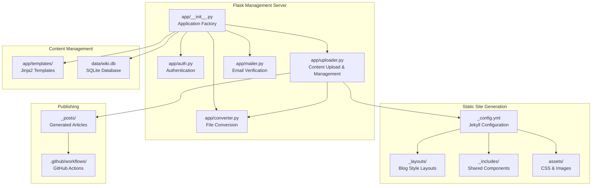
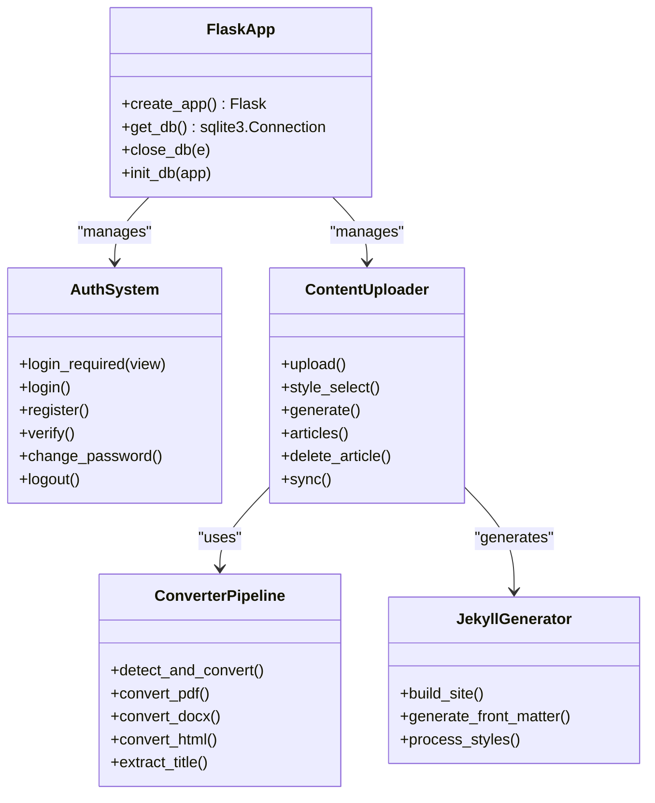
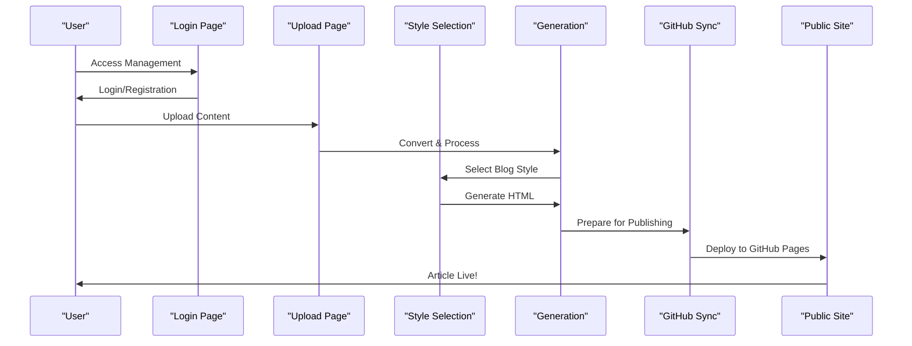

# AI Integration

<cite>
**Referenced Files in This Document**
- [PRD.md](file://PRD.md)
- [app/__init__.py](file://app/__init__.py)
- [app/auth.py](file://app/auth.py)
- [app/converter.py](file://app/converter.py)
- [app/mailer.py](file://app/mailer.py)
- [app/uploader.py](file://app/uploader.py)
- [app/templates/base.html](file://app/templates/base.html)
- [app/templates/upload.html](file://app/templates/upload.html)
- [app/templates/style_select.html](file://app/templates/style_select.html)
- [_config.yml](file://_config.yml)
- [index.html](file://index.html)
</cite>

## Update Summary
**Changes Made**
- Removed all AI provider integration components (OpenAI/Ollama) as they have been architecturally simplified out
- Updated architecture overview to reflect the new Flask-based content creation workflow
- Removed AI router, provider factory, and frontend AI assistant components
- Focused documentation on the new content creation and publishing workflow
- Updated project structure to show the simplified Flask application

## Table of Contents
1. [Introduction](#introduction)
2. [Project Structure](#project-structure)
3. [Core Components](#core-components)
4. [Architecture Overview](#architecture-overview)
5. [Detailed Component Analysis](#detailed-component-analysis)
6. [Content Creation Workflow](#content-creation-workflow)
7. [Authentication System](#authentication-system)
8. [File Conversion Pipeline](#file-conversion-pipeline)
9. [Blog Generation and Publishing](#blog-generation-and-publishing)
10. [Configuration and Deployment](#configuration-and-deployment)
11. [Migration from Previous Architecture](#migration-from-previous-architecture)
12. [Conclusion](#conclusion)

## Introduction
This document explains the content creation and publishing system for PolaZhenJing, focusing on the streamlined Flask-based architecture that replaced the previous AI-integrated system. The new architecture emphasizes simplicity, zero-configuration SQLite storage, and direct GitHub Pages publishing without external AI services. Users can upload or paste content in multiple formats, select from five distinct blog styles, and publish directly to GitHub Pages with automatic Jekyll site generation.

**Updated** Removed AI provider integrations (OpenAI/Ollama) as part of architectural simplification. Focus shifted to content creation and publishing rather than AI assistance.

## Project Structure
The simplified PolaZhenJing architecture centers around a lightweight Flask application that manages content creation, conversion, and publishing workflows. The system maintains a clear separation between management interfaces and the final Jekyll-generated static site.

**Diagram sources**
- [app/__init__.py:43-62](file://app/__init__.py#L43-L62)
- [app/auth.py:13](file://app/auth.py#L13)
- [app/uploader.py:14](file://app/uploader.py#L14)
- [app/converter.py:1](file://app/converter.py#L1)
- [app/mailer.py:1](file://app/mailer.py#L1)
- [_config.yml](file://_config.yml)
- [_posts/](file://_posts/)
- [.github/workflows/](file://.github/workflows/)

**Section sources**
- [PRD.md:181-234](file://PRD.md#L181-L234)
- [app/__init__.py:43-62](file://app/__init__.py#L43-L62)

## Core Components
- **Flask Application Factory**: Creates and configures the Flask application with proper database initialization and blueprint registration.
- **Authentication System**: Lightweight Flask-based authentication with SQLite storage and QQ email verification.
- **Content Upload Manager**: Handles file uploads, paste content, and style selection with drag-and-drop interface.
- **File Conversion Pipeline**: Converts PDF, Word, HTML, and other formats to clean Markdown with image extraction.
- **Blog Generation Engine**: Creates Jekyll-compatible articles with YAML front matter and publishes to GitHub Pages.
- **Template System**: Jinja2-based templates for management UI with responsive design.
- **Static Site Generator**: Jekyll configuration for multi-style blog generation with automated deployment.

**Section sources**
- [app/__init__.py:43-62](file://app/__init__.py#L43-L62)
- [app/auth.py:13](file://app/auth.py#L13)
- [app/uploader.py:14](file://app/uploader.py#L14)
- [app/converter.py:1](file://app/converter.py#L1)
- [PRD.md:280-307](file://PRD.md#L280-L307)

## Architecture Overview
The new PolaZhenJing architecture follows a simplified three-tier approach: Management Interface (Flask), Content Processing (Conversion Pipeline), and Publishing (Jekyll + GitHub Pages). This eliminates the complexity of external AI services while maintaining powerful content creation capabilities.

**Diagram sources**
- [app/__init__.py:43-62](file://app/__init__.py#L43-L62)
- [app/auth.py:16-167](file://app/auth.py#L16-L167)
- [app/uploader.py:76-210](file://app/uploader.py#L76-L210)
- [app/converter.py:58-87](file://app/converter.py#L58-L87)

## Detailed Component Analysis

### Flask Application Factory
The application factory pattern creates a configured Flask instance with proper database initialization, secret key configuration, and blueprint registration. It ensures proper cleanup of database connections and initializes the SQLite schema.

**Section sources**
- [app/__init__.py:43-62](file://app/__init__.py#L43-L62)

### Authentication System
Lightweight Flask-based authentication with SQLite storage, featuring user registration with QQ email verification, password hashing, and session management. Supports single-user oriented workflow with email-based verification.

**Section sources**
- [app/auth.py:16-167](file://app/auth.py#L16-L167)

### Content Upload Manager
Handles multiple content input methods including file uploads with drag-and-drop, paste content editing, and style selection. Provides real-time preview and metadata management for article creation.

**Section sources**
- [app/uploader.py:76-210](file://app/uploader.py#L76-L210)

### File Conversion Pipeline
Multi-format conversion system supporting PDF, Word, HTML, and Markdown files. Extracts text and images, preserves formatting, and generates clean Markdown output with automatic image saving.

**Section sources**
- [app/converter.py:58-87](file://app/converter.py#L58-L87)

### Template System
Jinja2-based templates providing responsive design with dark theme, interactive elements, and style cards for blog selection. Includes comprehensive styling for all management interfaces.

**Section sources**
- [app/templates/base.html:10-226](file://app/templates/base.html#L10-L226)
- [app/templates/upload.html:1-82](file://app/templates/upload.html#L1-L82)
- [app/templates/style_select.html:1-41](file://app/templates/style_select.html#L1-L41)

## Content Creation Workflow
The content creation process follows a streamlined seven-step workflow from login to published article, eliminating AI assistance in favor of direct content processing and publication.

**Diagram sources**
- [PRD.md:369-381](file://PRD.md#L369-L381)
- [app/uploader.py:76-210](file://app/uploader.py#L76-L210)

## Authentication System
The authentication system provides a lightweight, single-user oriented approach with QQ email verification and SQLite storage. Features include password hashing, session management, and email-based user verification.

**Section sources**
- [app/auth.py:26-167](file://app/auth.py#L26-L167)
- [PRD.md:258-280](file://PRD.md#L258-L280)

## File Conversion Pipeline
Supports multiple input formats with specialized conversion libraries for each format type. Extracts text, preserves structure, and handles image embedding for comprehensive content processing.

**Section sources**
- [app/converter.py:7-87](file://app/converter.py#L7-L87)
- [PRD.md:244-257](file://PRD.md#L244-L257)

## Blog Generation and Publishing
Direct Jekyll integration with automatic site generation, multi-style support, and GitHub Pages deployment. Eliminates external AI services in favor of pure content processing and static site generation.

**Section sources**
- [PRD.md:100-114](file://PRD.md#L100-L114)
- [PRD.md:628-680](file://PRD.md#L628-L680)

## Configuration and Deployment
Minimal configuration requirements with environment variable management and automated deployment through GitHub Actions. Zero-dependency SQLite storage and streamlined dependency management.

**Section sources**
- [PRD.md:813-838](file://PRD.md#L813-L838)
- [PRD.md:356-366](file://PRD.md#L356-L366)

## Migration from Previous Architecture
The migration eliminated complex AI integrations, external databases, and multi-container deployments in favor of a simplified Flask-based system with direct GitHub Pages publishing and zero-configuration SQLite storage.

**Section sources**
- [PRD.md:160-170](file://PRD.md#L160-L170)
- [PRD.md:841-856](file://PRD.md#L841-L856)

## Conclusion
PolaZhenJing's simplified architecture successfully replaces AI-assisted content creation with a streamlined content management system. The new Flask-based approach eliminates external dependencies, reduces complexity, and provides direct publishing capabilities through GitHub Pages. Users benefit from a simpler setup process, faster content creation workflow, and reliable static site generation without the overhead of AI service integrations.