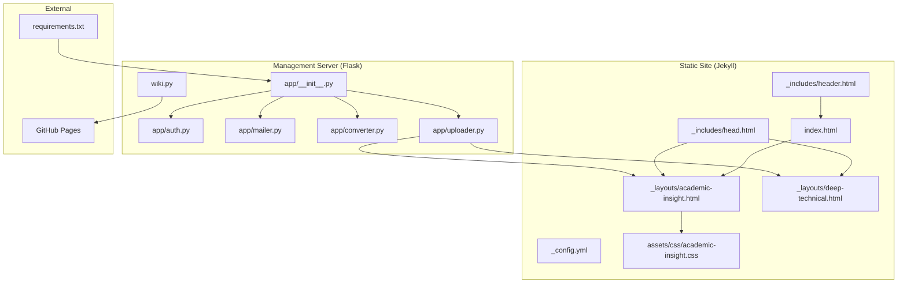
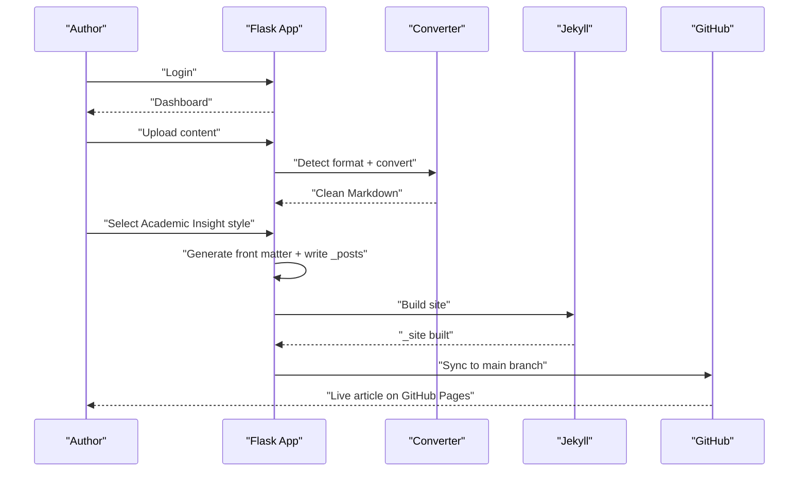
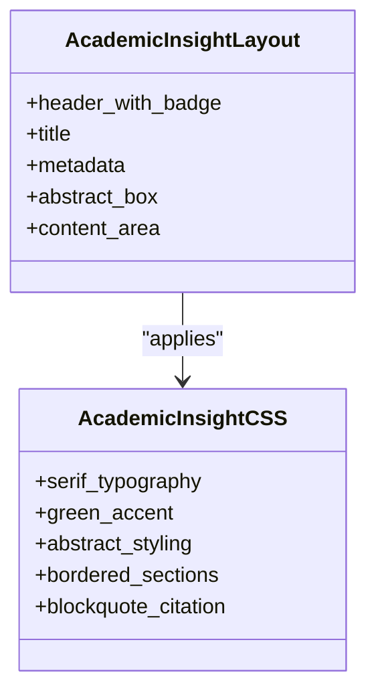
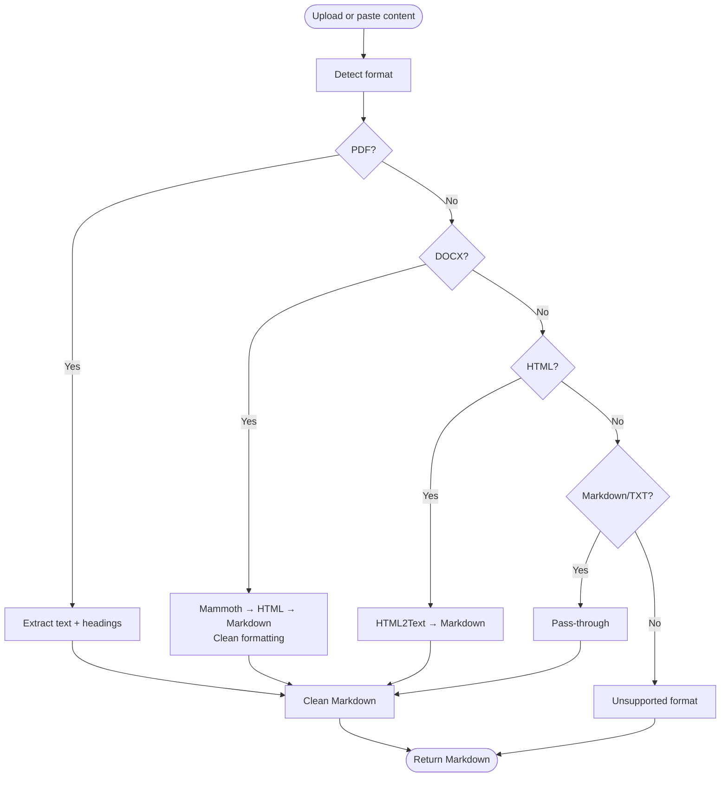
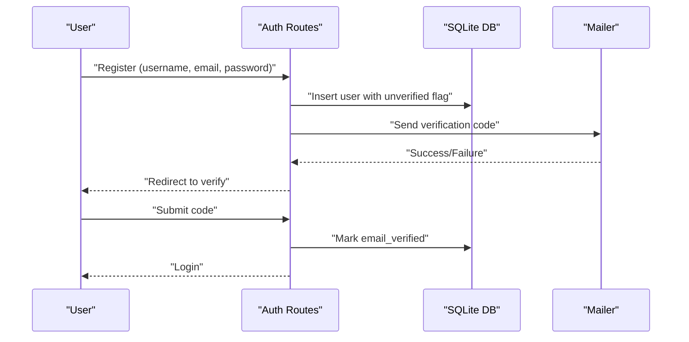
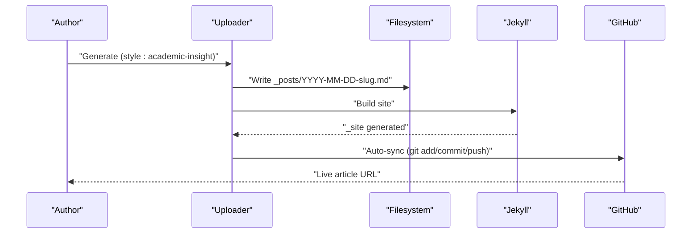
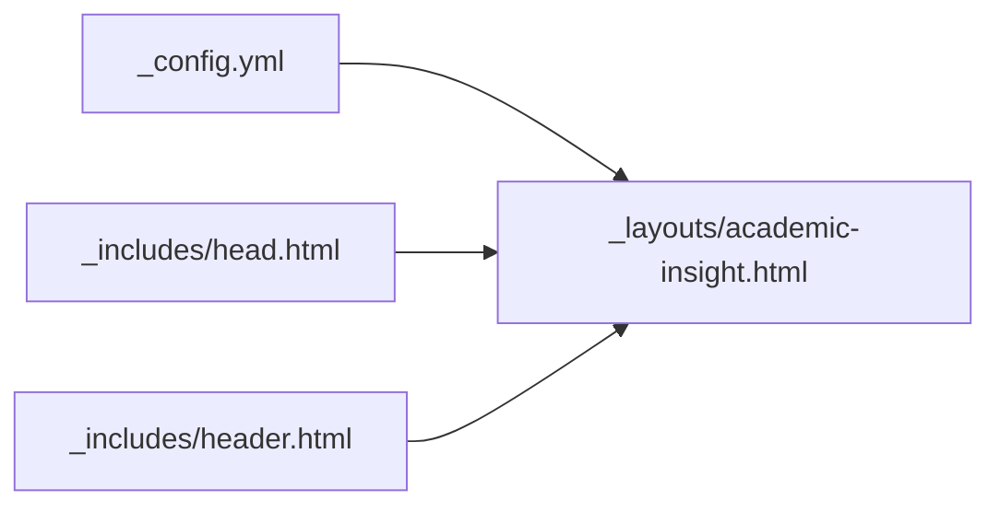
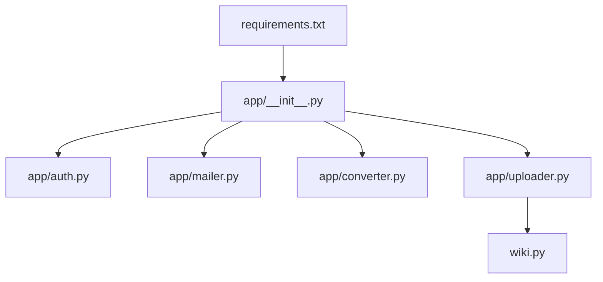

# Academic Insight Article

<cite>
**Referenced Files in This Document**
- [_config.yml](file://_config.yml)
- [index.html](file://index.html)
- [PRD.md](file://PRD.md)
- [requirements.txt](file://requirements.txt)
- [wiki.py](file://wiki.py)
- [app/__init__.py](file://app/__init__.py)
- [app/auth.py](file://app/auth.py)
- [app/converter.py](file://app/converter.py)
- [app/mailer.py](file://app/mailer.py)
- [app/uploader.py](file://app/uploader.py)
- [_layouts/academic-insight.html](file://_layouts/academic-insight.html)
- [_layouts/deep-technical.html](file://_layouts/deep-technical.html)
- [_includes/head.html](file://_includes/head.html)
- [_includes/header.html](file://_includes/header.html)
- [assets/css/academic-insight.css](file://assets/css/academic-insight.css)
</cite>

## Table of Contents
1. [Introduction](#introduction)
2. [Project Structure](#project-structure)
3. [Core Components](#core-components)
4. [Architecture Overview](#architecture-overview)
5. [Detailed Component Analysis](#detailed-component-analysis)
6. [Dependency Analysis](#dependency-analysis)
7. [Performance Considerations](#performance-considerations)
8. [Troubleshooting Guide](#troubleshooting-guide)
9. [Conclusion](#conclusion)
10. [Appendices](#appendices)

## Introduction
This document explains how the Academic Insight article style is implemented within the PolaZhenJing blog platform. It covers the end-to-end workflow from content ingestion to publication, focusing on the academic style’s Jekyll layout, CSS customization, and the Flask-based management server that powers upload, conversion, and publishing. The goal is to help contributors and maintainers understand how to author, style, and publish academic-style posts consistently.

## Project Structure
The project combines a static site generator (Jekyll) for the public blog with a lightweight Flask application for authoring and publishing. Key areas:
- Jekyll configuration and layouts define the visual and semantic structure of posts.
- Flask app handles authentication, file conversion, article generation, and GitHub synchronization.
- Assets and includes provide shared UI and styling across layouts.

**Diagram sources**
- [_config.yml:1-50](file://_config.yml#L1-L50)
- [_layouts/academic-insight.html:1-28](file://_layouts/academic-insight.html#L1-L28)
- [_layouts/deep-technical.html:1-22](file://_layouts/deep-technical.html#L1-L22)
- [_includes/head.html:1-28](file://_includes/head.html#L1-L28)
- [_includes/header.html:1-9](file://_includes/header.html#L1-L9)
- [assets/css/academic-insight.css:1-89](file://assets/css/academic-insight.css#L1-L89)
- [index.html:1-70](file://index.html#L1-L70)
- [app/__init__.py:1-76](file://app/__init__.py#L1-L76)
- [app/auth.py:1-168](file://app/auth.py#L1-L168)
- [app/mailer.py:1-53](file://app/mailer.py#L1-L53)
- [app/converter.py:1-146](file://app/converter.py#L1-L146)
- [app/uploader.py:1-624](file://app/uploader.py#L1-L624)
- [wiki.py:1-165](file://wiki.py#L1-L165)
- [requirements.txt:1-8](file://requirements.txt#L1-L8)

**Section sources**
- [_config.yml:1-50](file://_config.yml#L1-L50)
- [index.html:1-70](file://index.html#L1-L70)
- [PRD.md:143-180](file://PRD.md#L143-L180)

## Core Components
- Jekyll configuration and defaults: Controls site metadata, pagination, plugins, and default layout for posts.
- Academic Insight layout: Provides a scholarly structure with optional abstract and specialized typography.
- CSS for Academic Insight: Implements academic color accents, serif typography, bordered sections, and citation-style blockquotes.
- Flask management server: Handles authentication, upload, conversion, article generation, and GitHub sync.
- Converter pipeline: Translates PDF, DOCX, HTML, and Markdown into clean Markdown suitable for Jekyll.
- CLI tool: Supports local preview, building, and deploying via GitHub Pages.

**Section sources**
- [_config.yml:281-307](file://_config.yml#L281-L307)
- [_layouts/academic-insight.html:1-28](file://_layouts/academic-insight.html#L1-L28)
- [assets/css/academic-insight.css:1-89](file://assets/css/academic-insight.css#L1-L89)
- [app/__init__.py:43-76](file://app/__init__.py#L43-L76)
- [app/converter.py:96-146](file://app/converter.py#L96-L146)
- [wiki.py:1-165](file://wiki.py#L1-L165)

## Architecture Overview
The system separates concerns between static generation and dynamic management:
- Authoring flow: Flask routes manage login, upload, style selection, and article generation.
- Conversion pipeline: Converts diverse inputs to Markdown and attaches YAML front matter.
- Rendering: Jekyll builds static HTML using the chosen layout and CSS.
- Publishing: Commits and pushes to GitHub; GitHub Actions builds and deploys to GitHub Pages.

**Diagram sources**
- [app/auth.py:26-48](file://app/auth.py#L26-L48)
- [app/converter.py:96-146](file://app/converter.py#L96-L146)
- [app/uploader.py:413-492](file://app/uploader.py#L413-L492)
- [wiki.py:117-130](file://wiki.py#L117-L130)

## Detailed Component Analysis

### Academic Insight Layout and Styling
The Academic Insight style emphasizes scholarly structure and readability:
- Layout: Includes a style badge, title, metadata, optional abstract section, and content area.
- Typography: Uses serif fonts for headings and body text to convey academic tone.
- Visuals: Green-accented abstract box, bordered section dividers, and citation-style blockquotes.
- CSS: Defines color accents, spacing, and typographic scales aligned with the academic aesthetic.

**Diagram sources**
- [_layouts/academic-insight.html:1-28](file://_layouts/academic-insight.html#L1-L28)
- [assets/css/academic-insight.css:1-89](file://assets/css/academic-insight.css#L1-L89)

**Section sources**
- [_layouts/academic-insight.html:1-28](file://_layouts/academic-insight.html#L1-L28)
- [assets/css/academic-insight.css:1-89](file://assets/css/academic-insight.css#L1-L89)

### Converter Pipeline for Academic Content
The converter transforms various formats into clean Markdown:
- PDF: Extracts text with basic structure detection and preserves headings.
- DOCX: Converts via HTML then Markdown, cleaning formatting artifacts.
- HTML: Converts directly to Markdown with preserved links and images.
- Markdown: Pass-through with validation.

**Diagram sources**
- [app/converter.py:7-146](file://app/converter.py#L7-L146)

**Section sources**
- [app/converter.py:96-146](file://app/converter.py#L96-L146)

### Authentication and Email Verification
The Flask app enforces simple authentication with QQ email verification:
- Registration validates inputs, stores hashed passwords, and emails a 6-digit code.
- Login verifies credentials and requires email verification.
- Password reset updates the hash securely.

**Diagram sources**
- [app/auth.py:51-96](file://app/auth.py#L51-L96)
- [app/auth.py:99-133](file://app/auth.py#L99-L133)
- [app/mailer.py:8-53](file://app/mailer.py#L8-L53)

**Section sources**
- [app/auth.py:26-48](file://app/auth.py#L26-L48)
- [app/auth.py:51-96](file://app/auth.py#L51-L96)
- [app/auth.py:99-133](file://app/auth.py#L99-L133)
- [app/mailer.py:8-53](file://app/mailer.py#L8-L53)

### Article Generation and Publishing
After conversion and style selection, the system writes a Jekyll post with YAML front matter and publishes to GitHub Pages:
- Front matter includes layout, theme, title, date, tags, and optional description/summary.
- Jekyll build generates static HTML.
- Optional auto-sync commits and pushes to the main branch; GitHub Actions deploys to gh-pages.

**Diagram sources**
- [app/uploader.py:413-492](file://app/uploader.py#L413-L492)
- [wiki.py:117-130](file://wiki.py#L117-L130)

**Section sources**
- [app/uploader.py:413-492](file://app/uploader.py#L413-L492)
- [wiki.py:117-130](file://wiki.py#L117-L130)

### Jekyll Configuration and Shared Includes
- Configuration sets site metadata, permalinks, pagination, and plugins.
- Head includes load fonts, base CSS, and style-specific CSS.
- Header provides site navigation and a “New Article” link.

**Diagram sources**
- [_config.yml:281-307](file://_config.yml#L281-L307)
- [_includes/head.html:1-28](file://_includes/head.html#L1-L28)
- [_includes/header.html:1-9](file://_includes/header.html#L1-L9)
- [_layouts/academic-insight.html:1-28](file://_layouts/academic-insight.html#L1-L28)

**Section sources**
- [_config.yml:281-307](file://_config.yml#L281-L307)
- [_includes/head.html:1-28](file://_includes/head.html#L1-L28)
- [_includes/header.html:1-9](file://_includes/header.html#L1-L9)

## Dependency Analysis
- Flask app depends on environment variables for secrets and external services (SMTP, LLM).
- Converter relies on optional third-party libraries; missing libraries fall back gracefully.
- Jekyll depends on plugins and theme/CSS assets.
- CLI tool wraps Git and Bundler commands for local and remote operations.

**Diagram sources**
- [requirements.txt:1-8](file://requirements.txt#L1-L8)
- [app/__init__.py:1-76](file://app/__init__.py#L1-L76)
- [app/auth.py:1-168](file://app/auth.py#L1-L168)
- [app/mailer.py:1-53](file://app/mailer.py#L1-L53)
- [app/converter.py:1-146](file://app/converter.py#L1-L146)
- [app/uploader.py:1-624](file://app/uploader.py#L1-L624)
- [wiki.py:1-165](file://wiki.py#L1-L165)

**Section sources**
- [requirements.txt:1-8](file://requirements.txt#L1-L8)
- [app/__init__.py:1-76](file://app/__init__.py#L1-L76)
- [app/uploader.py:1-624](file://app/uploader.py#L1-L624)

## Performance Considerations
- Converter performance: PDF parsing and DOCX transformations can be CPU-intensive; keep file sizes reasonable and avoid scanning-heavy PDFs.
- Jekyll incremental builds: Prefer incremental builds during development to reduce rebuild times.
- Asset optimization: Minimize image sizes and leverage CDN-backed GitHub Pages delivery.
- Network latency: LLM rewriting and GitHub sync introduce external latency; batch operations when possible.

## Troubleshooting Guide
Common issues and resolutions:
- Unsupported file format: Ensure the file extension is one of md, pdf, docx, html, txt.
- Conversion failures: Install required libraries or retry with a clearer PDF/DOCX.
- Authentication errors: Confirm SECRET_KEY and QQ email credentials; verify SMTP_SSL connectivity.
- Jekyll build failures: Check front matter syntax and layout names; review build logs.
- GitHub sync errors: Configure Git user info, ensure remote is set, and verify credentials.

**Section sources**
- [app/converter.py:108-146](file://app/converter.py#L108-L146)
- [app/auth.py:36-48](file://app/auth.py#L36-L48)
- [app/mailer.py:16-18](file://app/mailer.py#L16-L18)
- [app/uploader.py:413-492](file://app/uploader.py#L413-L492)
- [wiki.py:117-130](file://wiki.py#L117-L130)

## Conclusion
The Academic Insight article style integrates seamlessly with the PolaZhenJing platform. By combining a robust conversion pipeline, a flexible Flask management server, and Jekyll’s static generation, authors can produce scholarly, well-styled content that renders beautifully across devices and is easily published to GitHub Pages.

## Appendices

### Academic Insight Style Checklist
- Use clear section headings and optional abstract for research-like structure.
- Employ citation-style blockquotes and bordered sections for emphasis.
- Keep serif typography for headings and body text to reinforce academic tone.
- Include tags and a concise description in the YAML front matter.

**Section sources**
- [_layouts/academic-insight.html:1-28](file://_layouts/academic-insight.html#L1-L28)
- [assets/css/academic-insight.css:1-89](file://assets/css/academic-insight.css#L1-L89)