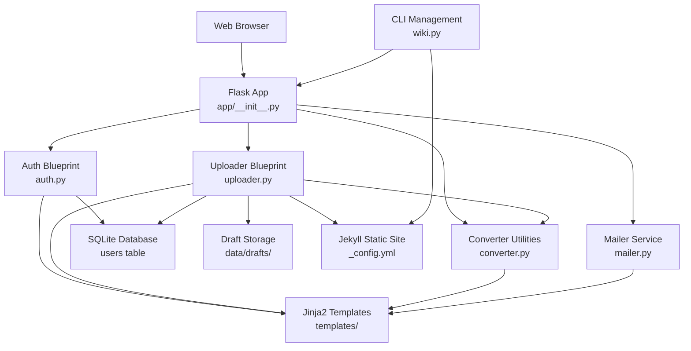
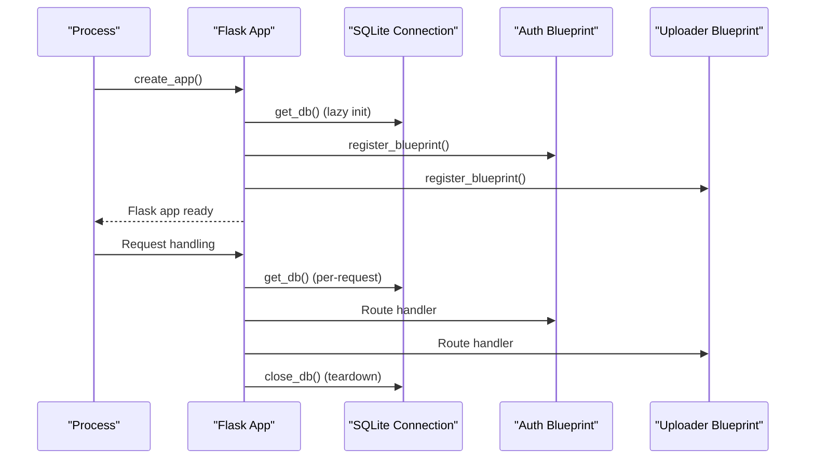
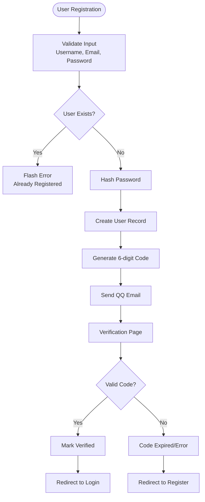
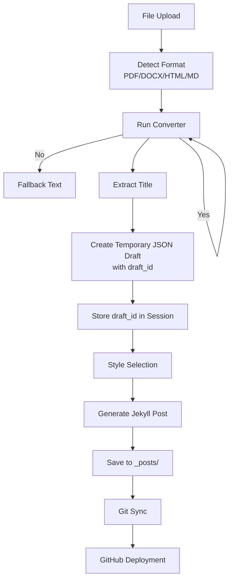
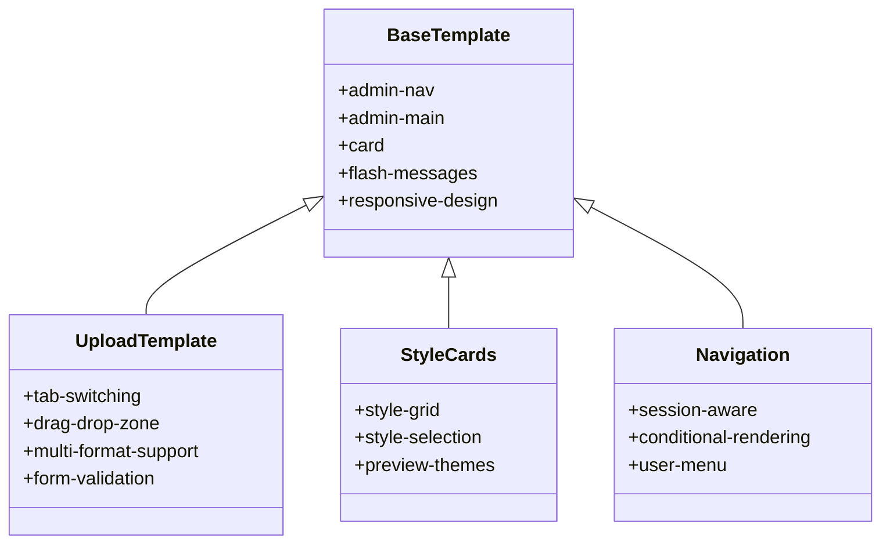
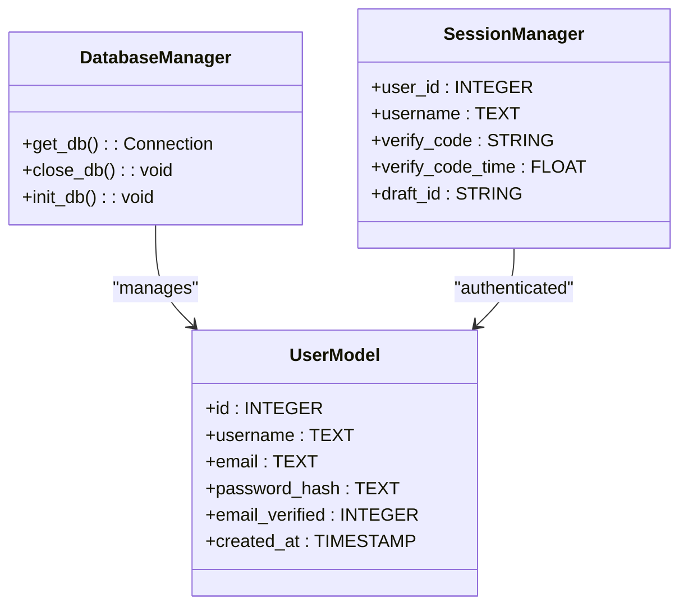
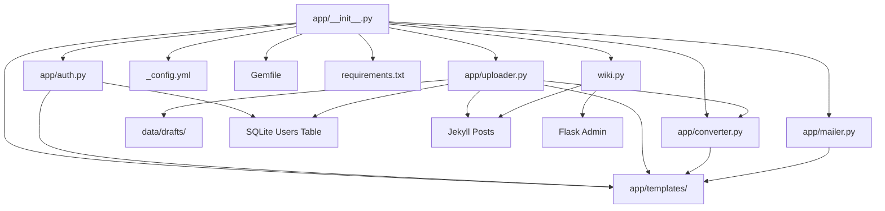

# Application Architecture

<cite>
**Referenced Files in This Document**
- [app/__init__.py](file://app/__init__.py)
- [app/auth.py](file://app/auth.py)
- [app/uploader.py](file://app/uploader.py)
- [app/converter.py](file://app/converter.py)
- [app/mailer.py](file://app/mailer.py)
- [app/templates/base.html](file://app/templates/base.html)
- [app/templates/upload.html](file://app/templates/upload.html)
- [app/templates/articles.html](file://app/templates/articles.html)
- [app/templates/login.html](file://app/templates/login.html)
- [app/templates/register.html](file://app/templates/register.html)
- [app/templates/password.html](file://app/templates/password.html)
- [app/templates/style_select.html](file://app/templates/style_select.html)
- [_config.yml](file://_config.yml)
- [Gemfile](file://Gemfile)
- [requirements.txt](file://requirements.txt)
- [wiki.py](file://wiki.py)
</cite>

## Update Summary
**Changes Made**
- Enhanced upload system with new draft storage mechanism using temporary JSON files
- Implemented session-based draft management to avoid cookie size limitations
- Added structured draft data storage with content, title, tags, and description fields
- Improved file upload workflow with temporary file handling and cleanup
- Enhanced error handling and validation for draft operations

## Table of Contents
1. [Introduction](#introduction)
2. [Project Structure](#project-structure)
3. [Core Components](#core-components)
4. [Architecture Overview](#architecture-overview)
5. [Detailed Component Analysis](#detailed-component-analysis)
6. [Dependency Analysis](#dependency-analysis)
7. [Performance Considerations](#performance-considerations)
8. [Troubleshooting Guide](#troubleshooting-guide)
9. [Conclusion](#conclusion)
10. [Appendices](#appendices)

## Introduction
This document describes the application architecture of the PolaZhenJing backend following its complete migration from FastAPI to Flask/Jekyll architecture. The system now operates as a Flask application with three integrated blueprints (auth, uploader, converter) that manage user authentication, content upload and processing, and Jekyll static site generation. The architecture leverages SQLite for data persistence, QQ Email SMTP for verification, and a comprehensive template system with dark gold theming. A CLI management tool (wiki.py) provides additional operational capabilities for Jekyll site management.

**Updated** Enhanced with improved upload system infrastructure featuring temporary JSON file storage for draft management, addressing session cookie size limitations and providing robust content staging capabilities.

## Project Structure
The backend is organized around a Flask application factory with three integrated blueprints. The structure follows Flask conventions with separate modules for authentication, content management, and conversion utilities. Configuration is managed through environment variables and Jekyll settings. Templates utilize Jinja2 with custom styling and responsive design. The CLI tool (wiki.py) provides command-line interface for Jekyll operations and Flask administration.

```mermaid
graph TB
subgraph "Flask App Factory"
APP["app/__init__.py<br/>create_app(), get_db(), init_db()"]
ENDPT["Endpoints"]
ENDPT --> AUTH["auth.py<br/>Authentication routes"]
ENDPT --> UP["uploader.py<br/>Upload & Jekyll integration"]
ENDPT --> CONV["converter.py<br/>File conversion utilities"]
ENDPT --> MAIL["mailer.py<br/>QQ Email SMTP"]
ENDPT --> TPL["templates/<br/>Jinja2 templates"]
ENDPT --> CFG["_config.yml<br/>Jekyll configuration"]
ENDPT --> GEM["Gemfile<br/>Ruby dependencies"]
ENDPT --> REQ["requirements.txt<br/>Python dependencies"]
ENDPT --> WIKI["wiki.py<br/>CLI management tool"]
APP --> AUTH
APP --> UP
APP --> CONV
APP --> MAIL
APP --> TPL
APP --> CFG
APP --> GEM
APP --> REQ
APP --> WIKI
```

**Diagram sources**
- [app/__init__.py:43-61](file://app/__init__.py#L43-L61)
- [app/auth.py:13](file://app/auth.py#L13)
- [app/uploader.py:14](file://app/uploader.py#L14)
- [app/converter.py:1](file://app/converter.py#L1)
- [app/mailer.py:8](file://app/mailer.py#L8)
- [_config.yml:1](file://_config.yml#L1)
- [Gemfile:1](file://Gemfile#L1)
- [requirements.txt:1](file://requirements.txt#L1)
- [wiki.py:1](file://wiki.py#L1)

**Section sources**
- [app/__init__.py:1-69](file://app/__init__.py#L1-L69)
- [_config.yml:1-49](file://_config.yml#L1-L49)
- [wiki.py:1-165](file://wiki.py#L1-L165)

## Core Components
- **Application Factory**: Flask application creation with template and static folder configuration, secret key management, and database initialization.
- **Database Integration**: SQLite connection management with Flask's application context, WAL mode for improved concurrency, and automatic cleanup.
- **Authentication System**: User registration, login, password management, and email verification with QQ Email SMTP integration.
- **Enhanced Content Management**: File upload handling with temporary JSON draft storage, content conversion pipeline, and Jekyll post generation with Git synchronization.
- **Template System**: Comprehensive Jinja2 templates with dark gold theming, responsive design, and interactive UI components.
- **Blueprint Architecture**: Three integrated blueprints (auth, uploader, converter) with URL prefixes and modular routing.
- **CLI Management Tool**: Command-line interface for Jekyll operations, Flask administration, and post management.
- **Static Site Generation**: Jekyll configuration with custom layouts and theme support for GitHub Pages deployment.

**Updated** Added temporary JSON file draft storage system to handle large content efficiently and avoid session cookie size limitations.

**Section sources**
- [app/__init__.py:43-61](file://app/__init__.py#L43-L69)
- [app/auth.py:16-23](file://app/auth.py#L16-L23)
- [app/uploader.py:50-70](file://app/uploader.py#L50-L70)
- [app/uploader.py:140-145](file://app/uploader.py#L140-L145)
- [app/templates/base.html:1-226](file://app/templates/base.html#L1-L226)
- [wiki.py:54-60](file://wiki.py#L54-L60)

## Architecture Overview
The backend follows a Flask-based architecture with integrated Jekyll static site generation and enhanced draft management:
- **Presentation Layer**: Flask blueprints with Jinja2 templates and responsive design.
- **Business Logic**: Modular services within blueprints for authentication, content management, and conversion.
- **Data Layer**: SQLite database with Flask application context and session management.
- **Draft Storage**: Temporary JSON file system for content staging and session management.
- **Integration Layer**: QQ Email SMTP for verification, Git operations for deployment, and file system operations.
- **Static Site Generation**: Jekyll configuration with custom layouts and theme support.
- **Management Interface**: Flask admin interface with comprehensive content management capabilities.
- **Command Line Interface**: CLI tool for Jekyll operations and administrative tasks.



**Diagram sources**
- [app/__init__.py:43-61](file://app/__init__.py#L43-L69)
- [app/auth.py:13](file://app/auth.py#L13)
- [app/uploader.py:14](file://app/uploader.py#L14)
- [app/converter.py:1](file://app/converter.py#L1)
- [app/mailer.py:8](file://app/mailer.py#L8)
- [_config.yml:1](file://_config.yml#L1)
- [wiki.py:54-60](file://wiki.py#L54-L60)

## Detailed Component Analysis

### Flask Application Factory and Lifecycle
- **Application Creation**: Flask instance with template folder configuration and security settings.
- **Database Management**: Context-aware SQLite connection with automatic cleanup and WAL mode.
- **Blueprint Registration**: Three integrated blueprints (auth, uploader) with URL prefixes.
- **Environment Configuration**: Secret key loading from environment variables with development fallback.



**Diagram sources**
- [app/__init__.py:43-61](file://app/__init__.py#L43-L69)
- [app/__init__.py:9-23](file://app/__init__.py#L9-L23)

**Section sources**
- [app/__init__.py:43-61](file://app/__init__.py#L43-L69)
- [app/__init__.py:9-23](file://app/__init__.py#L9-L23)

### Authentication System
- **User Management**: Registration with QQ email validation, password hashing, and email verification workflow.
- **Session Security**: Login-required decorators, session-based authentication, and secure password handling.
- **Verification Workflow**: 6-digit code generation with 5-minute expiry, email delivery via QQ SMTP.
- **Password Operations**: Secure password hashing, verification, and change functionality.



**Diagram sources**
- [app/auth.py:51-96](file://app/auth.py#L51-L96)
- [app/auth.py:99-133](file://app/auth.py#L99-L133)
- [app/mailer.py:8-52](file://app/mailer.py#L8-L52)

**Section sources**
- [app/auth.py:26-48](file://app/auth.py#L26-L48)
- [app/auth.py:51-96](file://app/auth.py#L51-L96)
- [app/auth.py:99-133](file://app/auth.py#L99-L133)
- [app/auth.py:136-167](file://app/auth.py#L136-L167)

### Enhanced Content Management and Draft System
- **Upload Pipeline**: Multi-format support (PDF, DOCX, HTML, Markdown) with drag-and-drop interface and temporary file handling.
- **Draft Storage**: Temporary JSON file system storing content, title, tags, and description with unique draft IDs.
- **Session Management**: Draft ID stored in session for seamless user experience across upload steps.
- **Conversion System**: Integrated conversion utilities with fallback mechanisms for missing dependencies.
- **Post Generation**: Automatic Jekyll front matter creation with style selection and metadata.
- **Git Integration**: Automated Git operations for deployment to GitHub Pages.
- **Article Management**: CRUD operations for managing generated articles.



**Updated** Added draft storage mechanism using temporary JSON files to handle large content efficiently and avoid session cookie size limitations.

**Diagram sources**
- [app/uploader.py:104-147](file://app/uploader.py#L104-L147)
- [app/uploader.py:50-70](file://app/uploader.py#L50-L70)
- [app/uploader.py:140-145](file://app/uploader.py#L140-L145)
- [app/converter.py:78-91](file://app/converter.py#L78-L91)
- [app/uploader.py:164-208](file://app/uploader.py#L164-L208)

**Section sources**
- [app/uploader.py:50-70](file://app/uploader.py#L50-L70)
- [app/uploader.py:104-147](file://app/uploader.py#L104-L147)
- [app/uploader.py:140-145](file://app/uploader.py#L140-L145)
- [app/uploader.py:150-161](file://app/uploader.py#L150-L161)
- [app/uploader.py:164-208](file://app/uploader.py#L164-L208)
- [app/uploader.py:190-210](file://app/uploader.py#L190-L210)

### Template System and Styling
- **Base Template**: Comprehensive dark gold theming with glass-morphism effects and responsive design.
- **Interactive Components**: Tab switching, drag-and-drop file upload, and form validation.
- **Flash Messages**: Category-based notification system with visual feedback.
- **Navigation**: Session-aware navigation with conditional rendering based on authentication state.
- **Admin Interface**: Comprehensive management interface for content operations.



**Diagram sources**
- [app/templates/base.html:1-226](file://app/templates/base.html#L1-L226)
- [app/templates/upload.html:1-82](file://app/templates/upload.html#L1-L82)

**Section sources**
- [app/templates/base.html:1-226](file://app/templates/base.html#L1-L226)
- [app/templates/upload.html:1-82](file://app/templates/upload.html#L1-L82)
- [app/templates/articles.html:1-64](file://app/templates/articles.html#L1-L64)
- [app/templates/style_select.html:1-41](file://app/templates/style_select.html#L1-L41)

### Database Integration and Session Management
- **SQLite Connection**: Context-aware database connections with automatic cleanup.
- **WAL Mode**: Write-Ahead Logging for improved concurrent access.
- **User Schema**: Comprehensive user table with verification status and timestamps.
- **Session Management**: Flask session-based authentication with secure storage.



**Updated** Added draft_id field to session manager to track temporary draft storage.

**Diagram sources**
- [app/__init__.py:9-40](file://app/__init__.py#L9-L40)
- [app/__init__.py:30-39](file://app/__init__.py#L30-L39)

**Section sources**
- [app/__init__.py:9-40](file://app/__init__.py#L9-L40)
- [app/__init__.py:30-39](file://app/__init__.py#L30-L39)

### QQ Email SMTP Integration
- **SMTP Configuration**: QQ Email SMTP with SSL connection and authentication.
- **HTML Templates**: Professional verification email with styled layout.
- **Error Handling**: Graceful degradation when SMTP credentials are unavailable.
- **Timeout Management**: Controlled timeout for email delivery operations.

**Section sources**
- [app/mailer.py:8-52](file://app/mailer.py#L8-L52)

### Jekyll Configuration and Static Site Generation
- **Site Configuration**: Jekyll settings with pagination, SEO plugins, and permalink structure.
- **Build Exclusions**: System excludes for Python files, development directories, and configuration files.
- **Layout Defaults**: Default layout assignment for blog posts.
- **Deployment Ready**: Optimized for GitHub Pages deployment workflow.

**Section sources**
- [_config.yml:1-49](file://_config.yml#L1-L49)

### CLI Management Tool
- **Command Interface**: Comprehensive CLI for Jekyll operations and Flask administration.
- **Local Development**: Jekyll serve with live reload functionality.
- **Post Management**: Create, list, and manage blog posts from command line.
- **Deployment Automation**: Git operations for site deployment.

**Section sources**
- [wiki.py:1-165](file://wiki.py#L1-L165)

## Dependency Analysis
The application exhibits clean separation of concerns with three main blueprints and supporting infrastructure:
- **Auth Blueprint**: Handles user authentication, session management, and email verification.
- **Uploader Blueprint**: Manages file uploads, temporary draft storage, content conversion, and Jekyll integration.
- **Converter Utilities**: Provides file format conversion capabilities with fallback mechanisms.
- **Mailer Service**: Encapsulates QQ Email SMTP functionality with error handling.
- **Template System**: Shared Jinja2 templates with consistent theming across all views.
- **CLI Infrastructure**: Command-line interface for operational tasks and development workflows.
- **Static Site Dependencies**: Ruby-based Jekyll ecosystem for site generation.

**Updated** Added draft storage system as a supporting infrastructure component for content management.



**Diagram sources**
- [app/__init__.py:43-61](file://app/__init__.py#L43-L69)
- [app/auth.py:13](file://app/auth.py#L13)
- [app/uploader.py:14](file://app/uploader.py#L14)
- [app/converter.py:1](file://app/converter.py#L1)
- [app/mailer.py:8](file://app/mailer.py#L8)
- [_config.yml:1](file://_config.yml#L1)
- [Gemfile:1](file://Gemfile#L1)
- [requirements.txt:1](file://requirements.txt#L1)
- [wiki.py:54-60](file://wiki.py#L54-L60)

**Section sources**
- [app/__init__.py:43-61](file://app/__init__.py#L43-L69)
- [requirements.txt:1-8](file://requirements.txt#L1-L8)

## Performance Considerations
- **SQLite Optimization**: WAL mode improves concurrent read/write performance for the small-scale application.
- **Memory Management**: Flask's application context ensures proper database connection cleanup.
- **File Processing**: Conversion utilities gracefully handle missing dependencies with fallback mechanisms.
- **Template Rendering**: Jinja2 templates are cached and compiled for efficient rendering.
- **Git Operations**: Timeout limits prevent hanging operations during deployment.
- **Static Site Generation**: Jekyll build process optimized for GitHub Pages deployment.
- **CLI Efficiency**: Command-line operations minimize overhead for administrative tasks.
- **Draft Storage**: Temporary JSON files provide efficient content staging without session size constraints.
- **Session Management**: Draft ID storage avoids large payload transmission between requests.

**Updated** Added performance considerations for draft storage system and session management improvements.

## Troubleshooting Guide
- **Database Issues**: Verify SQLite file permissions and disk space; check WAL mode compatibility.
- **Email Delivery**: Confirm QQ Email credentials and SMTP_SSL configuration; verify firewall settings.
- **File Conversion**: Install required dependencies (PyMuPDF, mammoth, html2text) for full conversion support.
- **Template Rendering**: Clear browser cache for CSS/JS updates; verify Jinja2 syntax in templates.
- **Git Deployment**: Check SSH keys and repository permissions; verify GitHub Pages configuration.
- **Authentication Errors**: Validate session storage and cookie settings; check user table integrity.
- **Jekyll Build**: Verify Ruby environment and gem installations; check bundle configuration.
- **CLI Operations**: Ensure proper command syntax and dependency availability for wiki.py commands.
- **Draft Storage Issues**: Check data/drafts directory permissions; verify JSON file integrity; monitor disk space.
- **Session Management**: Clear browser cookies if draft ID becomes corrupted; verify session storage configuration.

**Updated** Added troubleshooting guidance for draft storage and session management issues.

**Section sources**
- [app/__init__.py:9-23](file://app/__init__.py#L9-L23)
- [app/mailer.py:13-18](file://app/mailer.py#L13-L18)
- [app/converter.py:85-87](file://app/converter.py#L85-L87)
- [app/uploader.py:190-210](file://app/uploader.py#L190-L210)
- [app/uploader.py:50-70](file://app/uploader.py#L50-L70)
- [wiki.py:132-165](file://wiki.py#L132-L165)

## Conclusion
The PolaZhenJing backend successfully migrated to a Flask/Jekyll architecture with three integrated blueprints and comprehensive CLI management capabilities. The system provides a robust solution for content management with user authentication, file conversion, and static site generation. The SQLite database integration, QQ Email SMTP service, and responsive template system create a cohesive platform for managing AI knowledge content. The addition of the CLI tool (wiki.py) enhances operational flexibility with Jekyll integration and administrative functions. 

**Updated** The enhanced architecture now includes a sophisticated draft storage system using temporary JSON files, addressing session cookie size limitations and providing efficient content staging capabilities. This improvement enables handling of larger content inputs while maintaining a seamless user experience across the upload workflow.

The architecture balances simplicity with functionality, making it suitable for personal knowledge blogging and content curation with modern static site generation capabilities and robust content management infrastructure.

## Appendices
- **Environment Variables**: SECRET_KEY, QQ_EMAIL, QQ_EMAIL_AUTH_CODE for application configuration.
- **Supported Formats**: PDF, DOCX, HTML, Markdown with automatic conversion pipeline.
- **Deployment**: GitHub Pages compatible with automated Git operations and Jekyll build process.
- **Styling**: Dark gold theme with glass-morphism effects and responsive design.
- **CLI Commands**: serve, build, admin, new, list, deploy for comprehensive site management.
- **Template Categories**: Deep Technical, Academic Insight, Industry Vision, Friendly Explainer, Creative Visual styles.
- **Draft Storage**: Temporary JSON files in data/drafts/ directory with automatic cleanup and unique ID generation.
- **Session Management**: Draft ID tracking with automatic cleanup upon successful content generation.

**Updated** Added information about draft storage system and session management enhancements.

**Section sources**
- [app/__init__.py:46](file://app/__init__.py#L46)
- [app/converter.py:30-38](file://app/converter.py#L30-L38)
- [_config.yml:18-22](file://_config.yml#L18-L22)
- [app/templates/base.html:10-31](file://app/templates/base.html#L10-L31)
- [wiki.py:1-11](file://wiki.py#L1-L11)
- [app/uploader.py:50-70](file://app/uploader.py#L50-L70)
- [app/uploader.py:140-145](file://app/uploader.py#L140-L145)