# Application Architecture

<cite>
**Referenced Files in This Document**
- [backend/app/main.py](file://backend/app/main.py)
- [backend/app/config.py](file://backend/app/config.py)
- [backend/app/database.py](file://backend/app/database.py)
- [backend/app/common/middleware.py](file://backend/app/common/middleware.py)
- [backend/app/common/exceptions.py](file://backend/app/common/exceptions.py)
- [backend/app/auth/router.py](file://backend/app/auth/router.py)
- [backend/app/auth/service.py](file://backend/app/auth/service.py)
- [backend/app/auth/dependencies.py](file://backend/app/auth/dependencies.py)
- [backend/app/auth/schemas.py](file://backend/app/auth/schemas.py)
- [backend/app/ai/factory.py](file://backend/app/ai/factory.py)
- [backend/app/ai/base_provider.py](file://backend/app/ai/base_provider.py)
- [backend/app/ai/openai_provider.py](file://backend/app/ai/openai_provider.py)
- [backend/app/ai/ollama_provider.py](file://backend/app/ai/ollama_provider.py)
- [backend/app/thoughts/router.py](file://backend/app/thoughts/router.py)
- [backend/app/tags/router.py](file://backend/app/tags/router.py)
- [backend/app/publish/router.py](file://backend/app/publish/router.py)
- [backend/app/sharing/router.py](file://backend/app/sharing/router.py)
</cite>

## Table of Contents
1. [Introduction](#introduction)
2. [Project Structure](#project-structure)
3. [Core Components](#core-components)
4. [Architecture Overview](#architecture-overview)
5. [Detailed Component Analysis](#detailed-component-analysis)
6. [Dependency Analysis](#dependency-analysis)
7. [Performance Considerations](#performance-considerations)
8. [Troubleshooting Guide](#troubleshooting-guide)
9. [Conclusion](#conclusion)
10. [Appendices](#appendices)

## Introduction
This document describes the application architecture of the PolaZhenJing backend. It explains how the FastAPI application is initialized, how routing and middleware are configured, and how configuration, database, and AI integrations are structured. It also documents the exception handling system, application lifecycle, logging, health checks, and monitoring integration.

## Project Structure
The backend is organized around a FastAPI application factory with modular routers grouped by domain features (authentication, thoughts, tags, AI, publishing, sharing). Configuration is centralized via a settings class loaded from environment variables. Database integration uses SQLAlchemy asyncio with a session factory and dependency injection. Middleware provides CORS and request logging. Exception handling ensures consistent error responses.

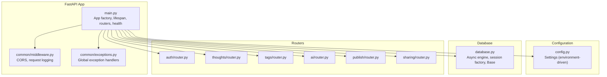

**Diagram sources**
- [backend/app/main.py:1-88](file://backend/app/main.py#L1-L88)
- [backend/app/common/middleware.py:1-59](file://backend/app/common/middleware.py#L1-L59)
- [backend/app/common/exceptions.py:1-87](file://backend/app/common/exceptions.py#L1-L87)
- [backend/app/config.py:1-62](file://backend/app/config.py#L1-L62)
- [backend/app/database.py:1-62](file://backend/app/database.py#L1-L62)
- [backend/app/auth/router.py:1-91](file://backend/app/auth/router.py#L1-L91)
- [backend/app/thoughts/router.py:1-115](file://backend/app/thoughts/router.py#L1-L115)
- [backend/app/tags/router.py:1-72](file://backend/app/tags/router.py#L1-L72)
- [backend/app/publish/router.py:1-64](file://backend/app/publish/router.py#L1-L64)
- [backend/app/sharing/router.py:1-46](file://backend/app/sharing/router.py#L1-L46)

**Section sources**
- [backend/app/main.py:1-88](file://backend/app/main.py#L1-L88)
- [backend/app/config.py:1-62](file://backend/app/config.py#L1-L62)

## Core Components
- Application factory and lifecycle: The FastAPI app is created with metadata and a lifespan manager that logs startup and disposes the database engine on shutdown.
- Configuration: Centralized settings class loads environment variables and provides defaults for application name/version, debug mode, database URL, JWT configuration, AI provider settings, site/publishing settings, and CORS origins.
- Database: An async SQLAlchemy engine and session factory are created from settings. A dependency yields sessions per request and handles commit/rollback automatically.
- Middleware: CORS is configured from settings; request logging middleware records method, path, status code, and elapsed time.
- Exception handling: Global handlers convert custom exceptions to JSON responses and mask unexpected errors in production.
- Routing: Feature routers are included under dedicated prefixes and tagged for documentation.

**Section sources**
- [backend/app/main.py:28-87](file://backend/app/main.py#L28-L87)
- [backend/app/config.py:16-61](file://backend/app/config.py#L16-L61)
- [backend/app/database.py:23-61](file://backend/app/database.py#L23-L61)
- [backend/app/common/middleware.py:22-58](file://backend/app/common/middleware.py#L22-L58)
- [backend/app/common/exceptions.py:66-86](file://backend/app/common/exceptions.py#L66-L86)
- [backend/app/auth/router.py:34-90](file://backend/app/auth/router.py#L34-L90)
- [backend/app/thoughts/router.py:33-114](file://backend/app/thoughts/router.py#L33-L114)
- [backend/app/tags/router.py:28-71](file://backend/app/tags/router.py#L28-L71)
- [backend/app/publish/router.py:23-63](file://backend/app/publish/router.py#L23-L63)
- [backend/app/sharing/router.py:22-45](file://backend/app/sharing/router.py#L22-L45)

## Architecture Overview
The backend follows a layered architecture:
- Presentation layer: FastAPI routes and dependencies.
- Domain services: Feature-specific services (auth, thoughts, tags, AI, publish, share).
- Persistence: SQLAlchemy async ORM with a shared Base and session dependency.
- Configuration: Environment-driven settings.
- Cross-cutting concerns: Middleware (CORS, logging), exception handling, and health checks.

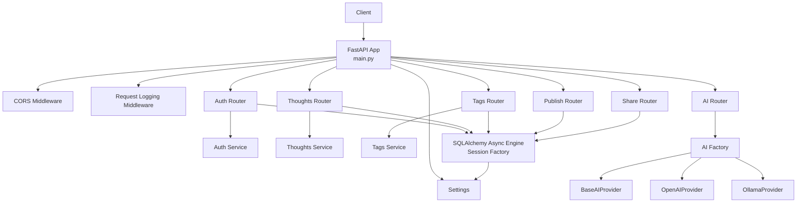

**Diagram sources**
- [backend/app/main.py:40-87](file://backend/app/main.py#L40-L87)
- [backend/app/common/middleware.py:22-58](file://backend/app/common/middleware.py#L22-L58)
- [backend/app/auth/router.py:22-32](file://backend/app/auth/router.py#L22-L32)
- [backend/app/thoughts/router.py:25-31](file://backend/app/thoughts/router.py#L25-L31)
- [backend/app/tags/router.py:19-26](file://backend/app/tags/router.py#L19-L26)
- [backend/app/publish/router.py:21-21](file://backend/app/publish/router.py#L21-L21)
- [backend/app/sharing/router.py:19-20](file://backend/app/sharing/router.py#L19-L20)
- [backend/app/ai/factory.py:18-43](file://backend/app/ai/factory.py#L18-L43)
- [backend/app/ai/base_provider.py:16-79](file://backend/app/ai/base_provider.py#L16-L79)
- [backend/app/ai/openai_provider.py:24-104](file://backend/app/ai/openai_provider.py#L24-L104)
- [backend/app/ai/ollama_provider.py:23-98](file://backend/app/ai/ollama_provider.py#L23-L98)
- [backend/app/database.py:23-61](file://backend/app/database.py#L23-L61)
- [backend/app/config.py:16-61](file://backend/app/config.py#L16-L61)

## Detailed Component Analysis

### FastAPI Application Initialization and Lifecycle
- App factory: Creates the FastAPI instance with title, version, description, and lifespan.
- Lifespan: Logs startup and disposes the async engine on shutdown.
- Health check: A lightweight GET endpoint returns application metadata and status.

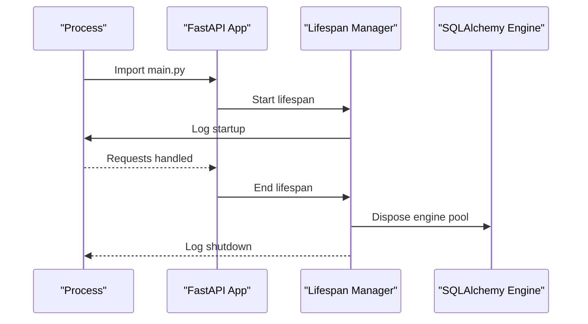

**Diagram sources**
- [backend/app/main.py:28-36](file://backend/app/main.py#L28-L36)
- [backend/app/database.py:23-30](file://backend/app/database.py#L23-L30)

**Section sources**
- [backend/app/main.py:28-87](file://backend/app/main.py#L28-L87)

### Configuration Management
- Centralized settings class with environment-driven values and defaults.
- Includes application metadata, database URL, JWT parameters, AI provider selection and endpoints, site/publishing base URL and directory, and CORS origins.

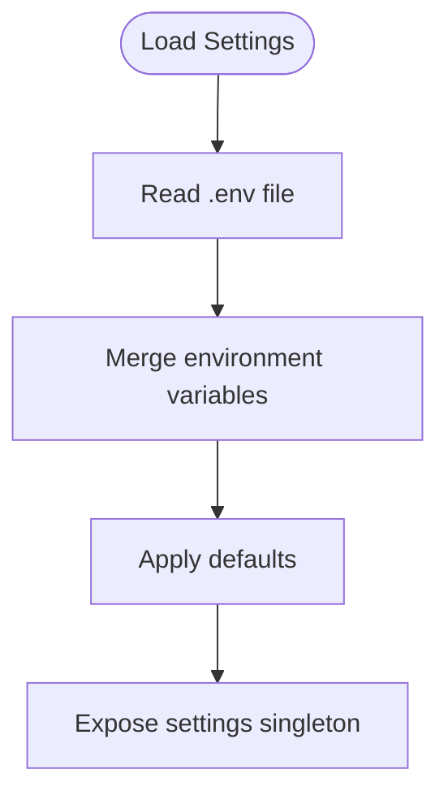

**Diagram sources**
- [backend/app/config.py:24-61](file://backend/app/config.py#L24-L61)

**Section sources**
- [backend/app/config.py:16-61](file://backend/app/config.py#L16-L61)

### Database Integration and Session Management
- Async engine creation from settings with echo, pool_pre_ping, pool_size, and max_overflow.
- Async session factory bound to the engine.
- Declarative Base class for ORM models.
- Dependency that yields sessions per request, commits on success, rolls back on exceptions.

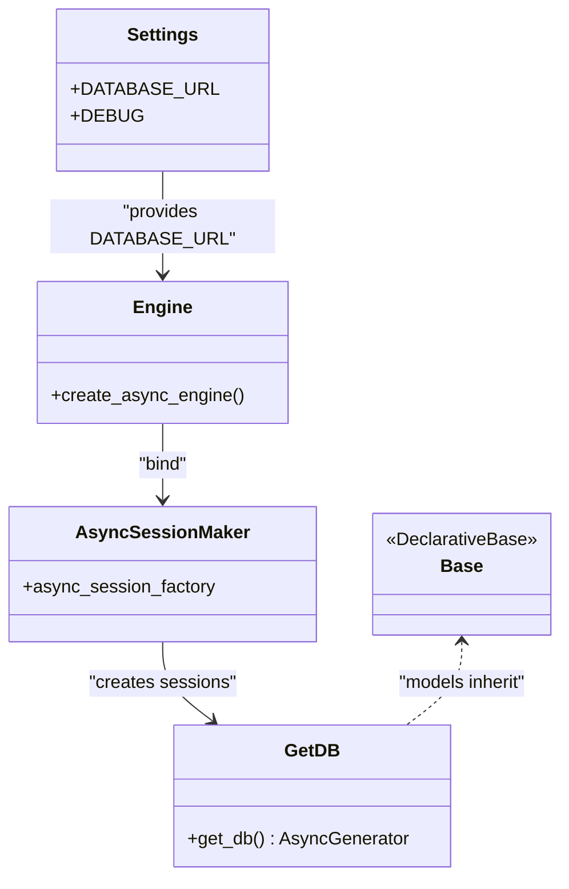

**Diagram sources**
- [backend/app/database.py:23-61](file://backend/app/database.py#L23-L61)
- [backend/app/config.py:35-36](file://backend/app/config.py#L35-L36)

**Section sources**
- [backend/app/database.py:23-61](file://backend/app/database.py#L23-L61)

### Middleware Stack
- CORS: Configured from settings with allow_origins, credentials, methods, and headers.
- Request logging: Measures elapsed time and logs method, path, and status code.

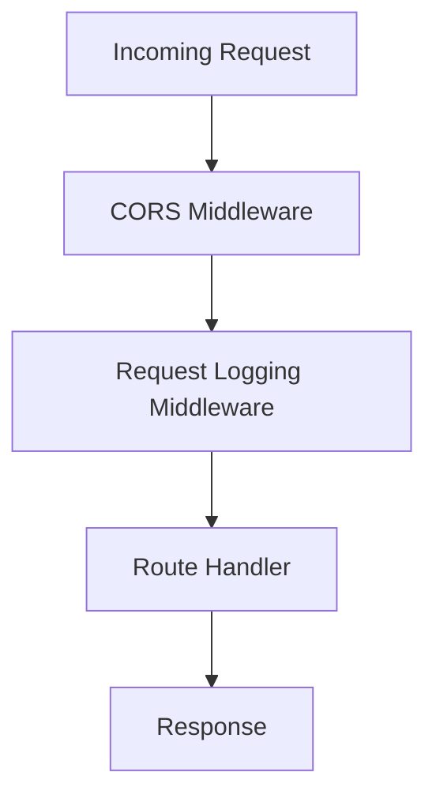

**Diagram sources**
- [backend/app/common/middleware.py:22-58](file://backend/app/common/middleware.py#L22-L58)

**Section sources**
- [backend/app/common/middleware.py:22-58](file://backend/app/common/middleware.py#L22-L58)

### Exception Handling and Error Responses
- Custom exception hierarchy with specific HTTP statuses.
- Global handlers:
  - Converts custom exceptions to JSON with detail.
  - Catches generic exceptions and returns a safe internal server error message.

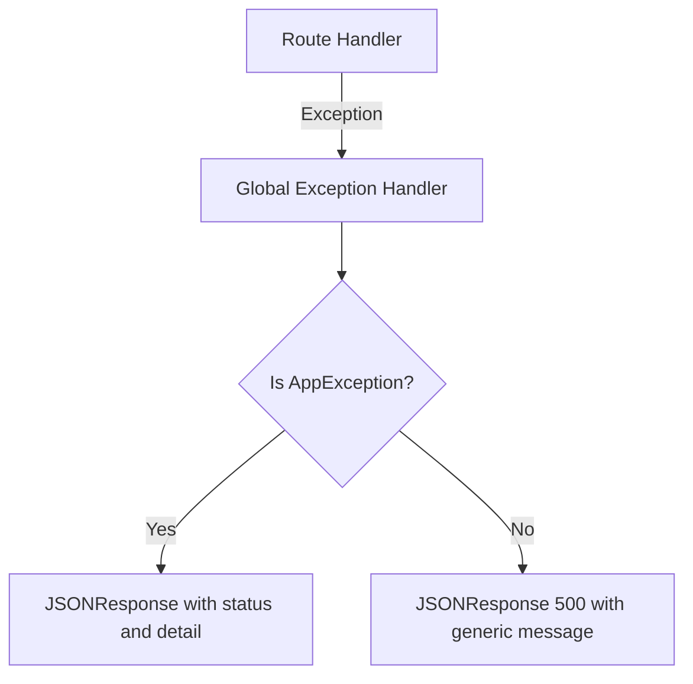

**Diagram sources**
- [backend/app/common/exceptions.py:66-86](file://backend/app/common/exceptions.py#L66-L86)

**Section sources**
- [backend/app/common/exceptions.py:16-86](file://backend/app/common/exceptions.py#L16-L86)

### Authentication Flow
- Dependencies extract and validate bearer tokens, ensuring access token type and active user.
- Services handle password hashing, JWT creation/verification, and user operations.

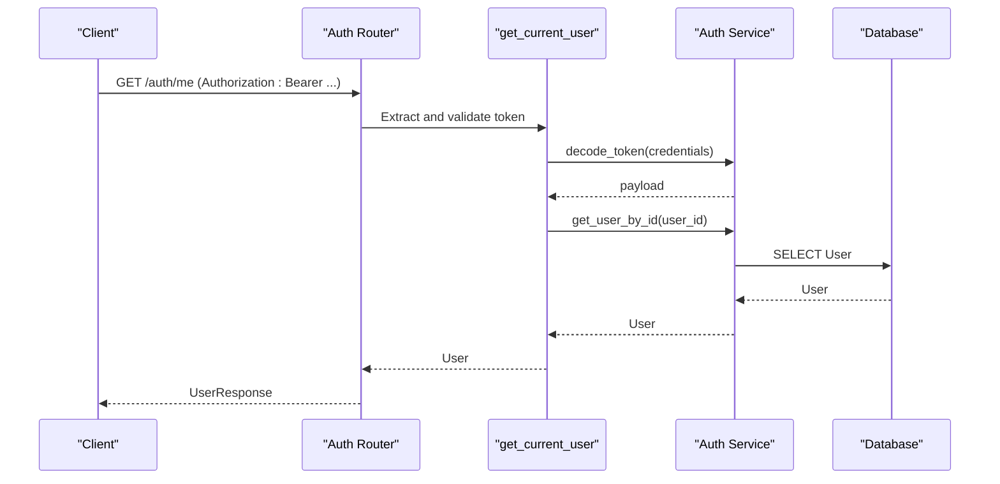

**Diagram sources**
- [backend/app/auth/router.py:87-90](file://backend/app/auth/router.py#L87-L90)
- [backend/app/auth/dependencies.py:27-51](file://backend/app/auth/dependencies.py#L27-L51)
- [backend/app/auth/service.py:71-87](file://backend/app/auth/service.py#L71-L87)
- [backend/app/database.py:45-61](file://backend/app/database.py#L45-L61)

**Section sources**
- [backend/app/auth/router.py:34-90](file://backend/app/auth/router.py#L34-L90)
- [backend/app/auth/dependencies.py:27-65](file://backend/app/auth/dependencies.py#L27-L65)
- [backend/app/auth/service.py:28-87](file://backend/app/auth/service.py#L28-L87)

### AI Provider Strategy
- Factory selects provider based on settings (OpenAI or Ollama) and caches the singleton.
- Base interface defines text polishing, summarization, tagging suggestions, and thought expansion.
- Concrete providers implement OpenAI-compatible and Ollama APIs.

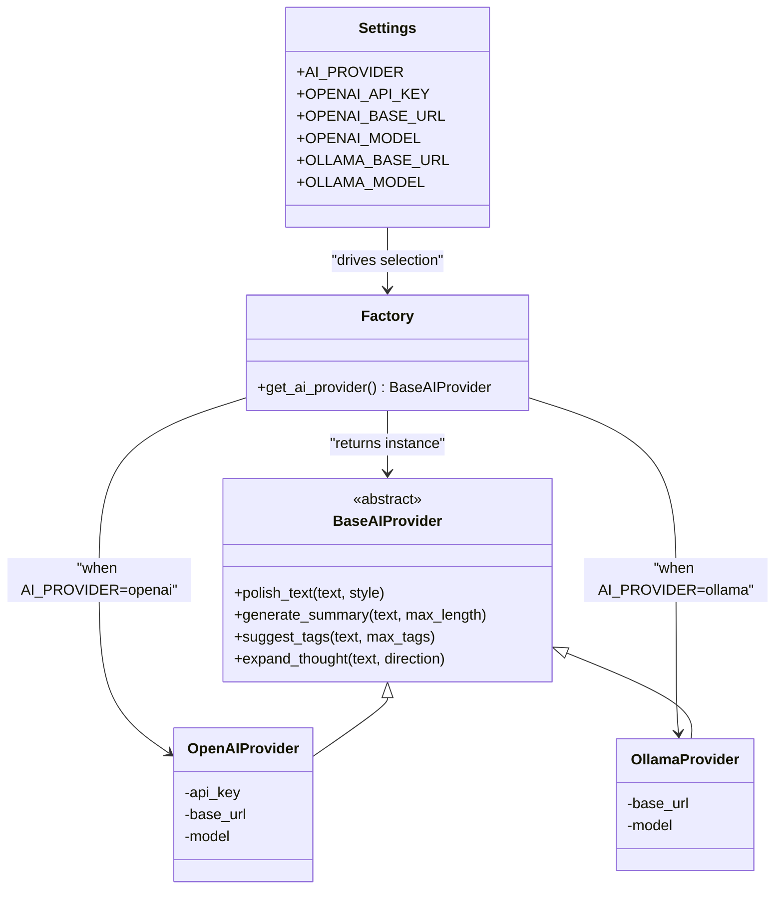

**Diagram sources**
- [backend/app/ai/factory.py:18-43](file://backend/app/ai/factory.py#L18-L43)
- [backend/app/ai/base_provider.py:16-79](file://backend/app/ai/base_provider.py#L16-L79)
- [backend/app/ai/openai_provider.py:24-104](file://backend/app/ai/openai_provider.py#L24-L104)
- [backend/app/ai/ollama_provider.py:23-98](file://backend/app/ai/ollama_provider.py#L23-L98)
- [backend/app/config.py:44-50](file://backend/app/config.py#L44-L50)

**Section sources**
- [backend/app/ai/factory.py:18-43](file://backend/app/ai/factory.py#L18-L43)
- [backend/app/ai/base_provider.py:16-79](file://backend/app/ai/base_provider.py#L16-L79)
- [backend/app/ai/openai_provider.py:24-104](file://backend/app/ai/openai_provider.py#L24-L104)
- [backend/app/ai/ollama_provider.py:23-98](file://backend/app/ai/ollama_provider.py#L23-L98)

### Routing Configuration
- Authentication: register, login, refresh, and profile retrieval.
- Thoughts: CRUD endpoints with filtering and pagination.
- Tags: CRUD endpoints with usage counts.
- Publishing: publish a thought and trigger a site build.
- Sharing: generate share metadata and links.

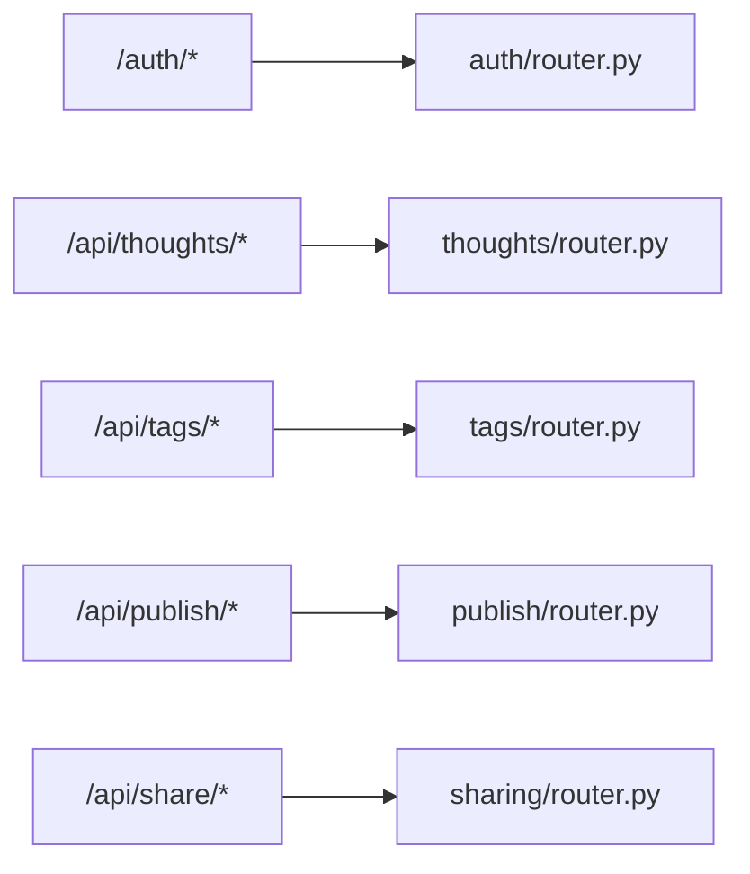

**Diagram sources**
- [backend/app/auth/router.py:34-90](file://backend/app/auth/router.py#L34-L90)
- [backend/app/thoughts/router.py:33-114](file://backend/app/thoughts/router.py#L33-L114)
- [backend/app/tags/router.py:28-71](file://backend/app/tags/router.py#L28-L71)
- [backend/app/publish/router.py:23-63](file://backend/app/publish/router.py#L23-L63)
- [backend/app/sharing/router.py:22-45](file://backend/app/sharing/router.py#L22-L45)

**Section sources**
- [backend/app/auth/router.py:34-90](file://backend/app/auth/router.py#L34-L90)
- [backend/app/thoughts/router.py:33-114](file://backend/app/thoughts/router.py#L33-L114)
- [backend/app/tags/router.py:28-71](file://backend/app/tags/router.py#L28-L71)
- [backend/app/publish/router.py:23-63](file://backend/app/publish/router.py#L23-L63)
- [backend/app/sharing/router.py:22-45](file://backend/app/sharing/router.py#L22-L45)

### Logging Configuration
- Logging is configured at module import time with level derived from settings.DEBUG and a consistent format.
- Request logging middleware logs method, path, status code, and elapsed time.

**Section sources**
- [backend/app/main.py:20-25](file://backend/app/main.py#L20-L25)
- [backend/app/common/middleware.py:40-58](file://backend/app/common/middleware.py#L40-L58)

### Health Checks and Monitoring Integration
- Health endpoint returns application name, version, and status.
- Used by container health checks and monitoring systems.

**Section sources**
- [backend/app/main.py:74-87](file://backend/app/main.py#L74-L87)

## Dependency Analysis
The application exhibits low coupling and high cohesion:
- Routers depend on services and the database dependency.
- Services depend on the database session and configuration.
- Middleware and exception handlers are globally registered and decoupled from route logic.
- AI provider selection is driven by configuration, enabling runtime substitution.

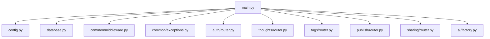

**Diagram sources**
- [backend/app/main.py:1-87](file://backend/app/main.py#L1-L87)
- [backend/app/config.py:1-62](file://backend/app/config.py#L1-L62)
- [backend/app/database.py:1-62](file://backend/app/database.py#L1-L62)
- [backend/app/common/middleware.py:1-59](file://backend/app/common/middleware.py#L1-L59)
- [backend/app/common/exceptions.py:1-87](file://backend/app/common/exceptions.py#L1-L87)
- [backend/app/auth/router.py:1-91](file://backend/app/auth/router.py#L1-L91)
- [backend/app/thoughts/router.py:1-115](file://backend/app/thoughts/router.py#L1-L115)
- [backend/app/tags/router.py:1-72](file://backend/app/tags/router.py#L1-L72)
- [backend/app/publish/router.py:1-64](file://backend/app/publish/router.py#L1-L64)
- [backend/app/sharing/router.py:1-46](file://backend/app/sharing/router.py#L1-L46)
- [backend/app/ai/factory.py:1-44](file://backend/app/ai/factory.py#L1-L44)

**Section sources**
- [backend/app/main.py:1-87](file://backend/app/main.py#L1-L87)

## Performance Considerations
- Asynchronous database operations reduce blocking and improve concurrency.
- Connection pooling parameters (pool_size and max_overflow) should be tuned based on workload and database capacity.
- Request logging adds minimal overhead but can be disabled or reduced in production by adjusting logging levels.
- AI provider timeouts are set per provider; ensure they align with expected latency SLAs.

[No sources needed since this section provides general guidance]

## Troubleshooting Guide
- Database connectivity: Verify DATABASE_URL and network access; enable echo in debug mode for SQL logs.
- CORS issues: Confirm allowed origins match frontend origin; adjust CORS_ORIGINS accordingly.
- Authentication failures: Check JWT secret, algorithm, and expiration settings; ensure tokens are sent with Authorization header.
- AI provider errors: Validate provider configuration (base URLs, API keys, model names); review provider logs for HTTP errors.
- Unexpected errors: Production masks generic messages; inspect server logs for stack traces.

**Section sources**
- [backend/app/config.py:35-57](file://backend/app/config.py#L35-L57)
- [backend/app/common/middleware.py:22-58](file://backend/app/common/middleware.py#L22-L58)
- [backend/app/common/exceptions.py:80-86](file://backend/app/common/exceptions.py#L80-L86)
- [backend/app/ai/openai_provider.py:38-65](file://backend/app/ai/openai_provider.py#L38-L65)
- [backend/app/ai/ollama_provider.py:36-59](file://backend/app/ai/ollama_provider.py#L36-L59)

## Conclusion
The PolaZhenJing backend is structured around a clean FastAPI application factory with environment-driven configuration, robust database integration, and modular routers. The middleware stack provides CORS and request logging, while the exception handling system ensures consistent error responses. The AI provider strategy enables flexible integration with external services. Health checks and logging support operational monitoring and maintenance.

[No sources needed since this section summarizes without analyzing specific files]

## Appendices
- Environment variables and defaults are defined centrally and can be overridden via .env or environment.
- Database session management centralizes transaction handling and simplifies error recovery.
- AI provider selection supports both cloud and local LLM backends.

**Section sources**
- [backend/app/config.py:16-61](file://backend/app/config.py#L16-L61)
- [backend/app/database.py:45-61](file://backend/app/database.py#L45-L61)
- [backend/app/ai/factory.py:18-43](file://backend/app/ai/factory.py#L18-L43)