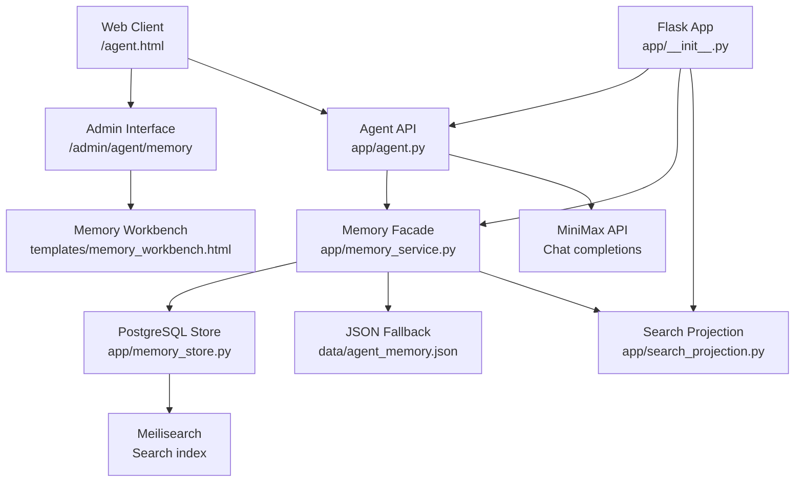
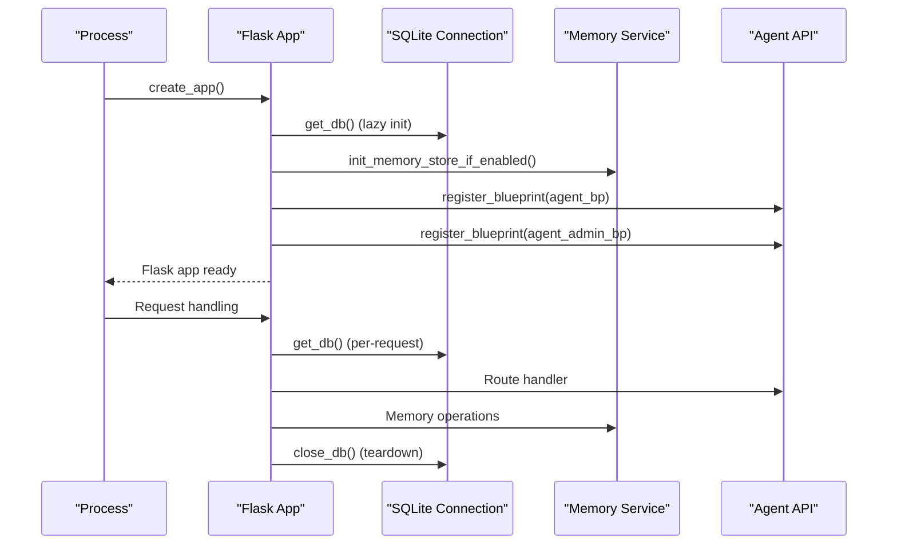
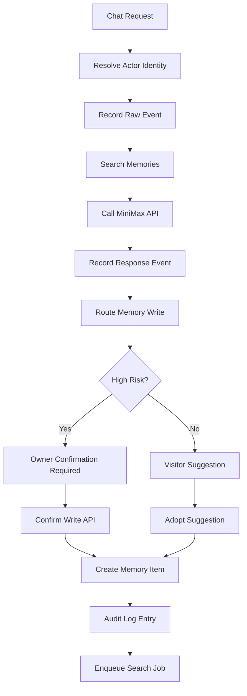
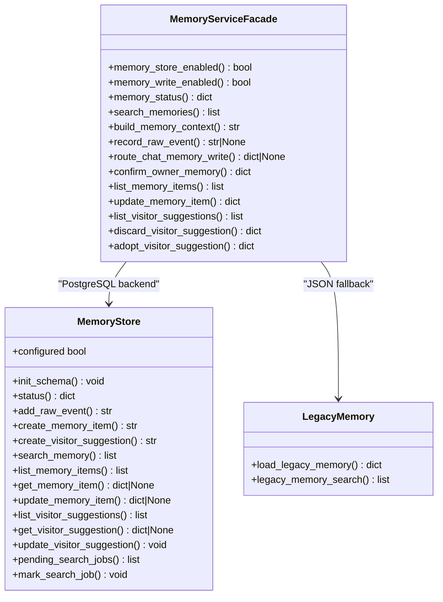
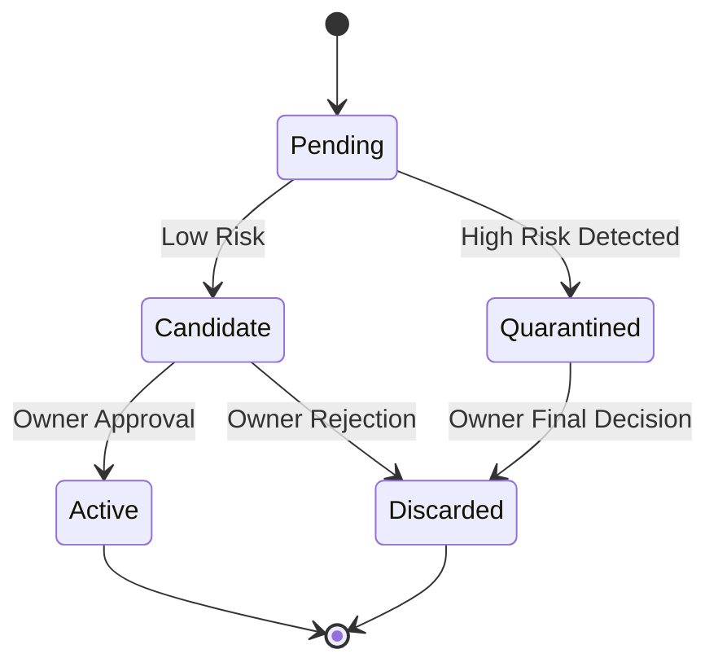
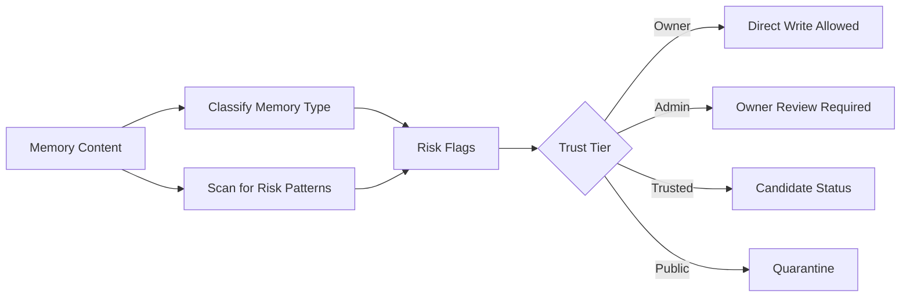
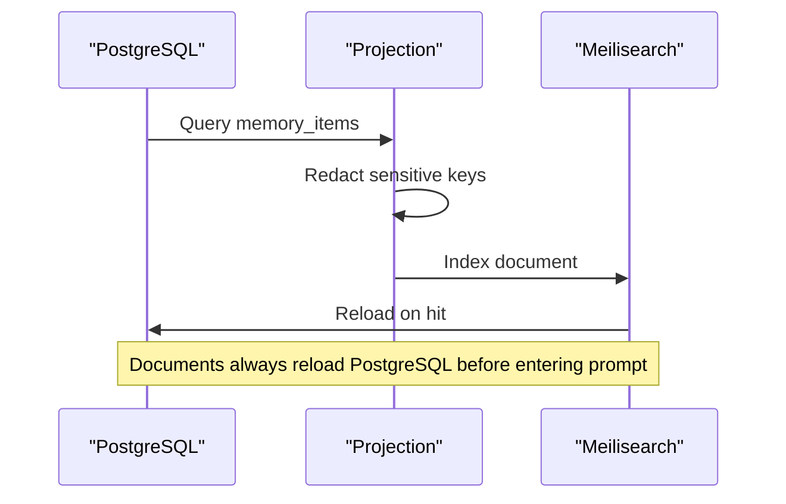
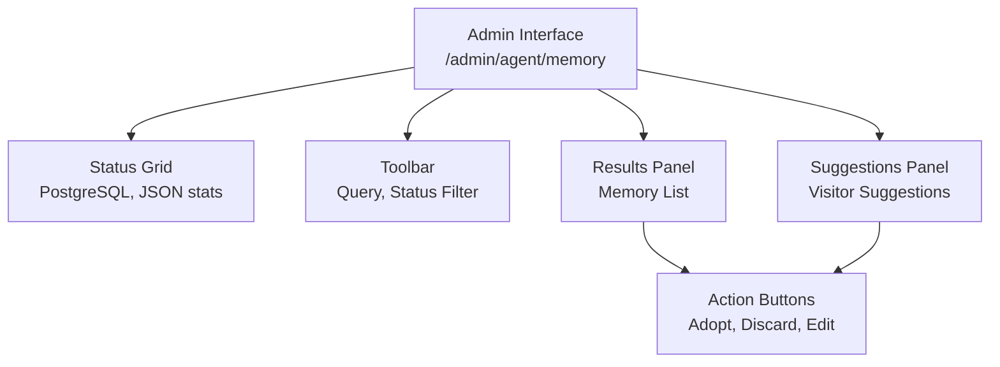
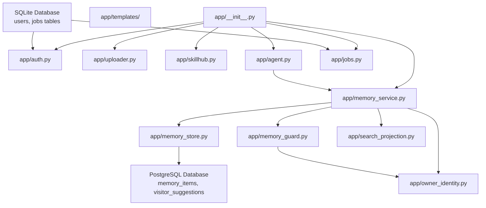

# Application Architecture

<cite>
**Referenced Files in This Document**
- [app/__init__.py](file://app/__init__.py)
- [app/auth.py](file://app/auth.py)
- [app/uploader.py](file://app/uploader.py)
- [app/converter.py](file://app/converter.py)
- [app/mailer.py](file://app/mailer.py)
- [app/agent.py](file://app/agent.py)
- [app/memory_service.py](file://app/memory_service.py)
- [app/memory_store.py](file://app/memory_store.py)
- [app/memory_guard.py](file://app/memory_guard.py)
- [app/owner_identity.py](file://app/owner_identity.py)
- [app/search_projection.py](file://app/search_projection.py)
- [app/jobs.py](file://app/jobs.py)
- [app/templates/base.html](file://app/templates/base.html)
- [app/templates/memory_workbench.html](file://app/templates/memory_workbench.html)
- [migrations/agent_memory/001_postgres_memory_ledger.sql](file://migrations/agent_memory/001_postgres_memory_ledger.sql)
- [_config.yml](file://_config.yml)
- [Gemfile](file://Gemfile)
- [requirements.txt](file://requirements.txt)
- [wiki.py](file://wiki.py)
</cite>

## Update Summary
**Changes Made**
- Added comprehensive memory service facade architecture coordinating PostgreSQL backend with legacy JSON fallback
- Enhanced agent integration layer with MiniMax API support and memory management endpoints
- Introduced visitor suggestion system for community-driven memory curation
- Added memory governance and risk assessment framework
- Implemented Meilisearch integration for advanced search capabilities
- Enhanced admin interface with memory workbench for PostgreSQL management

## Table of Contents
1. [Introduction](#introduction)
2. [Project Structure](#project-structure)
3. [Core Components](#core-components)
4. [Architecture Overview](#architecture-overview)
5. [Detailed Component Analysis](#detailed-component-analysis)
6. [Memory Service Architecture](#memory-service-architecture)
7. [Agent Integration Layer](#agent-integration-layer)
8. [Visitor Suggestion System](#visitor-suggestion-system)
9. [Memory Governance Framework](#memory-governance-framework)
10. [Search and Indexing Integration](#search-and-indexing-integration)
11. [Admin Interface and Workbench](#admin-interface-and-workbench)
12. [Dependency Analysis](#dependency-analysis)
13. [Performance Considerations](#performance-considerations)
14. [Troubleshooting Guide](#troubleshooting-guide)
15. [Conclusion](#conclusion)
16. [Appendices](#appendices)

## Introduction
This document describes the application architecture of the PolaZhenJing backend with its new memory service facade architecture and enhanced agent integration layer. The system now features a sophisticated memory management system that coordinates between PostgreSQL backend and legacy JSON fallback, providing enterprise-grade memory storage for the Super Xiaowang AI agent. The architecture leverages FastAPI (via Flask blueprint pattern) for API services, PostgreSQL for persistent storage with optional pgvector extensions, and comprehensive security frameworks including visitor suggestion moderation and memory governance.

**Updated** Enhanced with new memory service facade architecture that seamlessly coordinates legacy JSON memories with PostgreSQL backend, comprehensive agent integration layer with MiniMax API support, and visitor suggestion system for community-driven memory curation.

## Project Structure
The backend follows a modular Flask architecture with specialized components for memory management, agent services, and administrative interfaces. The structure includes dedicated modules for memory service coordination, PostgreSQL storage management, visitor suggestion handling, and comprehensive search integration.

```mermaid
graph TB
subgraph "Core Application"
APP["app/__init__.py<br/>Flask application factory"]
AUTH["app/auth.py<br/>Authentication system"]
UP["app/uploader.py<br/>Content management"]
SKILL["app/skillhub.py<br/>Skill management"]
ENDPT["API Endpoints"]
ENDPT --> AG["app/agent.py<br/>Agent API & Chat"]
ENDPT --> MS["app/memory_service.py<br/>Memory facade"]
ENDPT --> MG["app/memory_guard.py<br/>Governance checks"]
ENDPT --> OID["app/owner_identity.py<br/>Identity resolution"]
ENDPT --> SP["app/search_projection.py<br/>Search projection"]
ENDPT --> JOB["app/jobs.py<br/>Async job queue"]
APP --> AUTH
APP --> UP
APP --> SKILL
APP --> AG
APP --> MS
APP --> MG
APP --> OID
APP --> SP
APP --> JOB
```

**Diagram sources**
- [app/__init__.py:112-157](file://app/__init__.py#L112-L157)
- [app/agent.py:30-31](file://app/agent.py#L30-L31)
- [app/memory_service.py:1-16](file://app/memory_service.py#L1-L16)
- [app/memory_guard.py:1-25](file://app/memory_guard.py#L1-L25)
- [app/owner_identity.py:20-68](file://app/owner_identity.py#L20-L68)
- [app/search_projection.py:13-22](file://app/search_projection.py#L13-L22)
- [app/jobs.py:1-12](file://app/jobs.py#L1-L12)

**Section sources**
- [app/__init__.py:112-157](file://app/__init__.py#L112-L157)
- [app/agent.py:30-31](file://app/agent.py#L30-L31)
- [app/memory_service.py:1-16](file://app/memory_service.py#L1-L16)

## Core Components
- **Application Factory**: Flask application creation with reverse proxy support, database initialization, and blueprint registration.
- **Memory Service Facade**: Central coordinator between PostgreSQL backend and legacy JSON fallback with intelligent routing and fallback mechanisms.
- **PostgreSQL Memory Store**: Typed memory ledger with full-text search capabilities, embedding support, and audit trails.
- **Agent Integration Layer**: MiniMax API integration with memory-aware chat completion and comprehensive memory management endpoints.
- **Visitor Suggestion System**: Community-driven memory curation with risk assessment and owner approval workflows.
- **Memory Governance Framework**: Risk detection, content classification, and trust-tier based access control.
- **Search and Indexing**: Meilisearch integration with PostgreSQL-backed document projection and sensitive data redaction.
- **Admin Interface**: Memory workbench for PostgreSQL management with real-time search and suggestion handling.
- **Async Job Queue**: SQLite-backed job management for long-running tasks with cross-worker coordination.

**Updated** Added comprehensive memory service facade architecture, visitor suggestion system, and enhanced agent integration with MiniMax API support.

**Section sources**
- [app/memory_service.py:1-361](file://app/memory_service.py#L1-L361)
- [app/memory_store.py:62-110](file://app/memory_store.py#L62-L110)
- [app/agent.py:111-150](file://app/agent.py#L111-L150)
- [app/memory_guard.py:51-87](file://app/memory_guard.py#L51-L87)
- [app/search_projection.py:29-71](file://app/search_projection.py#L29-L71)

## Architecture Overview
The backend implements a hybrid memory architecture with PostgreSQL as the primary source of truth and JSON fallback for backward compatibility. The agent integration layer provides comprehensive memory-aware chat capabilities with visitor suggestion moderation and owner approval workflows.



**Diagram sources**
- [app/agent.py:99-150](file://app/agent.py#L99-L150)
- [app/memory_service.py:131-143](file://app/memory_service.py#L131-L143)
- [app/memory_store.py:77-110](file://app/memory_store.py#L77-L110)
- [app/search_projection.py:29-44](file://app/search_projection.py#L29-L44)
- [app/templates/memory_workbench.html:1-61](file://app/templates/memory_workbench.html#L1-L61)

## Detailed Component Analysis

### Flask Application Factory and Lifecycle
The application factory creates a Flask instance with reverse proxy support, database initialization, and comprehensive blueprint registration for all services including the new memory management and agent components.



**Diagram sources**
- [app/__init__.26-41:26-41](file://app/__init__.py#L26-L41)
- [app/__init__.py:142-157](file://app/__init__.py#L142-L157)
- [app/memory_service.py:95-104](file://app/memory_service.py#L95-L104)

**Section sources**
- [app/__init__.py:112-157](file://app/__init__.py#L112-L157)
- [app/__init__.py:26-41](file://app/__init__.py#L26-L41)

### Enhanced Agent Integration Layer
The agent integration layer provides comprehensive memory-aware chat capabilities with MiniMax API support, visitor suggestion handling, and owner approval workflows.



**Diagram sources**
- [app/agent.py:111-150](file://app/agent.py#L111-L150)
- [app/memory_service.py:190-227](file://app/memory_service.py#L190-L227)
- [app/memory_service.py:321-361](file://app/memory_service.py#L321-L361)

**Section sources**
- [app/agent.py:69-96](file://app/agent.py#L69-L96)
- [app/agent.py:111-150](file://app/agent.py#L111-L150)
- [app/agent.py:163-245](file://app/agent.py#L163-L245)

## Memory Service Architecture
The memory service facade provides a unified interface for accessing both PostgreSQL backend and legacy JSON fallback, with intelligent routing and fallback mechanisms.



**Diagram sources**
- [app/memory_service.py:82-128](file://app/memory_service.py#L82-L128)
- [app/memory_store.py:62-110](file://app/memory_store.py#L62-L110)
- [app/memory_service.py:22-30](file://app/memory_service.py#L22-L30)

**Section sources**
- [app/memory_service.py:82-143](file://app/memory_service.py#L82-L143)
- [app/memory_store.py:62-205](file://app/memory_store.py#L62-L205)
- [app/memory_service.py:22-80](file://app/memory_service.py#L22-L80)

## Visitor Suggestion System
The visitor suggestion system enables community-driven memory curation with comprehensive risk assessment and owner approval workflows.



**Diagram sources**
- [app/memory_guard.py:51-77](file://app/memory_guard.py#L51-L77)
- [app/memory_service.py:208-227](file://app/memory_service.py#L208-L227)
- [app/memory_service.py:312-361](file://app/memory_service.py#L312-L361)

**Section sources**
- [app/memory_guard.py:51-87](file://app/memory_guard.py#L51-L87)
- [app/memory_service.py:208-227](file://app/memory_service.py#L208-L227)
- [app/memory_service.py:312-361](file://app/memory_service.py#L312-L361)

## Memory Governance Framework
The memory governance framework provides comprehensive risk assessment, content classification, and trust-tier based access control for memory management operations.



**Diagram sources**
- [app/memory_guard.py:36-48](file://app/memory_guard.py#L36-L48)
- [app/memory_guard.py:51-77](file://app/memory_guard.py#L51-L77)
- [app/owner_identity.py:44-52](file://app/owner_identity.py#L44-L52)

**Section sources**
- [app/memory_guard.py:9-25](file://app/memory_guard.py#L9-L25)
- [app/memory_guard.py:36-87](file://app/memory_guard.py#L36-L87)
- [app/owner_identity.py:20-68](file://app/owner_identity.py#L20-L68)

## Search and Indexing Integration
The search and indexing system provides advanced search capabilities with PostgreSQL-backed document projection and sensitive data redaction for Meilisearch integration.



**Diagram sources**
- [app/search_projection.py:29-71](file://app/search_projection.py#L29-L71)
- [migrations/agent_memory/001_postgres_memory_ledger.sql:45-47](file://migrations/agent_memory/001_postgres_memory_ledger.sql#L45-L47)

**Section sources**
- [app/search_projection.py:13-71](file://app/search_projection.py#L13-L71)
- [migrations/agent_memory/001_postgres_memory_ledger.sql:1-119](file://migrations/agent_memory/001_postgres_memory_ledger.sql#L1-L119)

## Admin Interface and Workbench
The admin interface provides comprehensive memory management capabilities with real-time search, visitor suggestion handling, and PostgreSQL status monitoring.



**Diagram sources**
- [app/templates/memory_workbench.html:16-61](file://app/templates/memory_workbench.html#L16-L61)
- [app/templates/memory_workbench.html:148-183](file://app/templates/memory_workbench.html#L148-L183)

**Section sources**
- [app/templates/memory_workbench.html:1-186](file://app/templates/memory_workbench.html#L1-L186)
- [app/agent.py:248-255](file://app/agent.py#L248-L255)

## Dependency Analysis
The application exhibits a clean separation of concerns with specialized modules for memory management, agent services, and administrative interfaces, all coordinated through the memory service facade.



**Diagram sources**
- [app/__init__.py:131-141](file://app/__init__.py#L131-L141)
- [app/memory_service.py:13-16](file://app/memory_service.py#L13-L16)
- [app/memory_store.py:63-68](file://app/memory_store.py#L63-L68)
- [app/memory_guard.py:13-15](file://app/memory_guard.py#L13-L15)
- [app/owner_identity.py:9-12](file://app/owner_identity.py#L9-L12)

**Section sources**
- [app/__init__.py:131-141](file://app/__init__.py#L131-L141)
- [app/memory_service.py:13-16](file://app/memory_service.py#L13-L16)

## Performance Considerations
- **Memory Store Optimization**: PostgreSQL with pg_trgm and optional pgvector extensions for advanced search capabilities.
- **Connection Pooling**: Context-aware database connections with automatic cleanup and WAL mode for improved concurrency.
- **Search Performance**: Trigram indexes and JSONB storage for efficient memory querying and visitor suggestion management.
- **Async Processing**: Background job queue for long-running tasks with cross-worker coordination and SQLite-based state management.
- **Cache Strategy**: LRU caching for legacy memory loading and environment variable caching for feature flags.
- **API Response Optimization**: Efficient JSON serialization and minimal payload construction for memory operations.
- **Security**: Comprehensive input sanitization and risk assessment before memory persistence operations.

**Updated** Added performance considerations for PostgreSQL memory store, async job processing, and search optimization.

**Section sources**
- [app/memory_store.py:77-110](file://app/memory_store.py#L77-L110)
- [app/jobs.py:50-77](file://app/jobs.py#L50-L77)
- [app/memory_service.py:22-30](file://app/memory_service.py#L22-L30)

## Troubleshooting Guide
- **Memory Store Issues**: Verify PostgreSQL connectivity, extension availability (pg_trgm, vector), and DATABASE_URL configuration.
- **Feature Flag Problems**: Check POLA_MEMORY_DB_ENABLED, POLA_MEMORY_WRITE_ENABLED, and POLA_MEMORY_FALLBACK_JSON environment variables.
- **MiniMax API Errors**: Confirm POLA_AGENT_API_KEY or MINIMAX_TOKEN_PLAN_API_KEY configuration and network connectivity.
- **Search Index Problems**: Verify Meilisearch URL and API key configuration, and check search index job status.
- **Visitor Suggestion Failures**: Monitor risk assessment patterns and owner approval workflows for high-risk content.
- **Async Job Issues**: Check SQLite job table integrity and worker thread status for background processing failures.
- **Memory Governance Errors**: Validate risk pattern detection and trust tier resolution for different user roles.
- **Admin Interface Problems**: Verify session-based authentication and role-based access control for memory management operations.

**Updated** Added troubleshooting guidance for memory store, visitor suggestions, and admin interface issues.

**Section sources**
- [app/memory_store.py:70-76](file://app/memory_store.py#L70-L76)
- [app/agent.py:51-52](file://app/agent.py#L51-L52)
- [app/memory_guard.py:51-77](file://app/memory_guard.py#L51-L77)

## Conclusion
The PolaZhenJing backend successfully implements a sophisticated memory management architecture that seamlessly coordinates PostgreSQL backend with legacy JSON fallback, providing enterprise-grade memory storage for AI agents. The enhanced architecture includes comprehensive visitor suggestion systems, memory governance frameworks, and advanced search capabilities with Meilisearch integration. The agent integration layer provides robust MiniMax API support with memory-aware chat completion and comprehensive administrative interfaces for memory management.

**Updated** The architecture now provides a complete memory management solution with PostgreSQL as the primary source of truth, comprehensive visitor participation workflows, and enterprise-grade security and governance frameworks. The system balances scalability with functionality, making it suitable for advanced AI knowledge management and memory curation with modern search and administrative capabilities.

## Appendices
- **Environment Variables**: DATABASE_URL, POLA_MEMORY_DB_ENABLED, POLA_MEMORY_WRITE_ENABLED, POLA_MEMORY_FALLBACK_JSON, POLA_AGENT_API_KEY, MINIMAX_TOKEN_PLAN_API_KEY, SECRET_KEY.
- **Memory Types**: values, boundary, preference, procedural, episodic, semantic with automatic classification.
- **Risk Patterns**: Prompt injection, secret exfiltration, persona takeover, boundary override, recommendation poisoning.
- **Trust Tiers**: owner, admin, trusted_user, public_user with role-based access control.
- **Search Capabilities**: Full-text search with pg_trgm, JSONB storage, and sensitive data redaction.
- **Admin Features**: Memory workbench, visitor suggestion management, audit logging, and real-time status monitoring.
- **Async Processing**: SQLite-backed job queue with cross-worker coordination and progress tracking.
- **Security Features**: Comprehensive input sanitization, risk assessment, and owner approval workflows.

**Updated** Added comprehensive environment variable documentation, memory type classifications, risk pattern detection, and administrative feature descriptions.

**Section sources**
- [app/memory_service.py:82-88](file://app/memory_service.py#L82-L88)
- [app/memory_guard.py:27-33](file://app/memory_guard.py#L27-L33)
- [app/owner_identity.py:44-52](file://app/owner_identity.py#L44-L52)
- [app/search_projection.py:13-21](file://app/search_projection.py#L13-L21)
- [app/jobs.py:26-47](file://app/jobs.py#L26-L47)