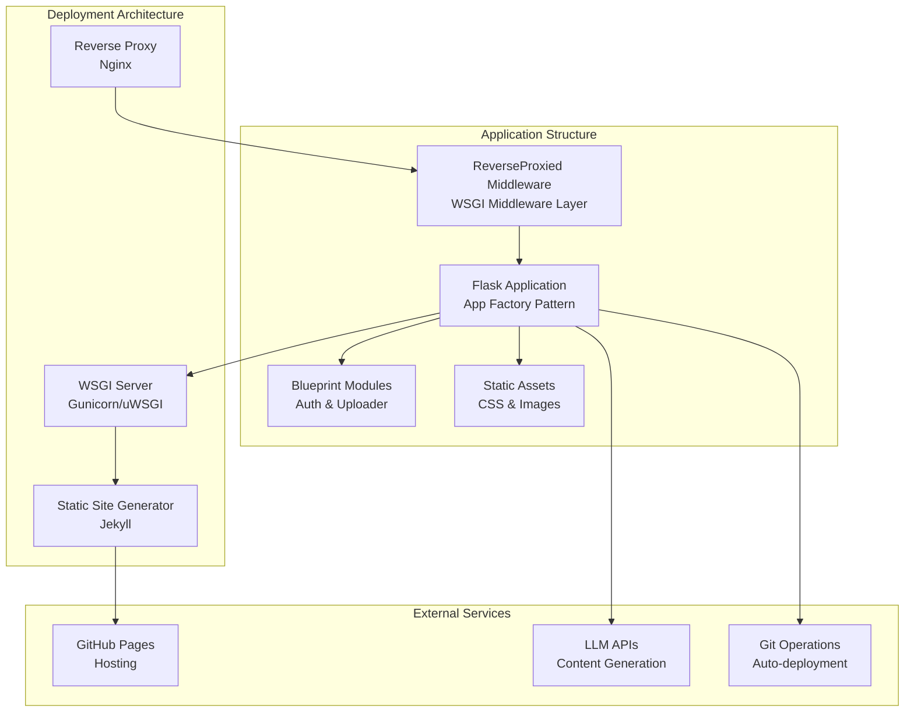
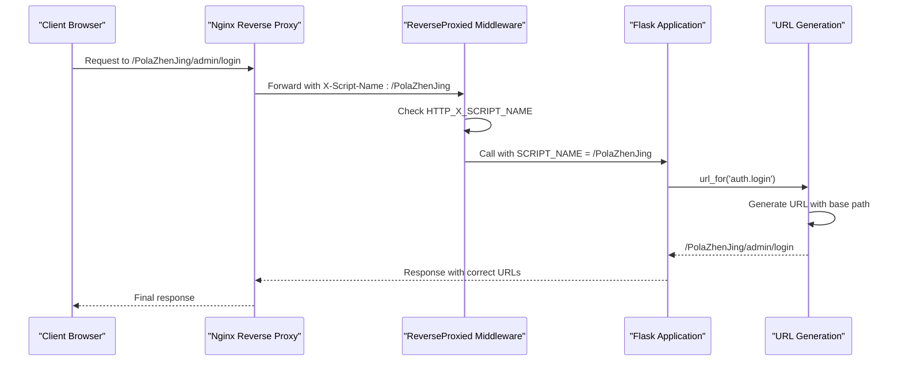
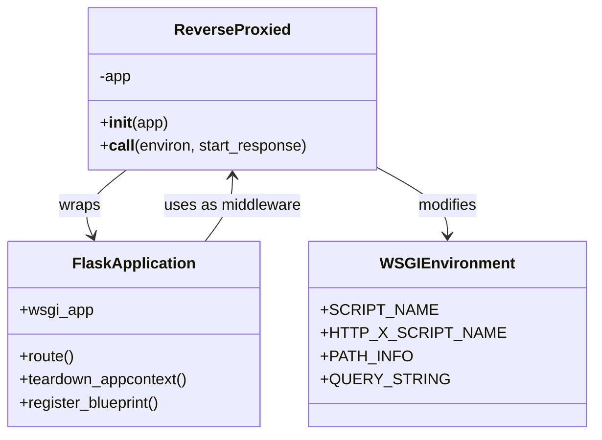
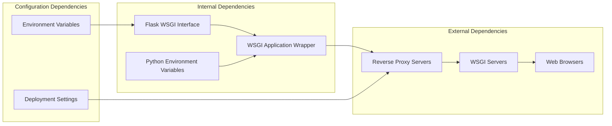

# ReverseProxied Middleware

<cite>
**Referenced Files in This Document**
- [app/__init__.py](file://app/__init__.py)
- [_config.yml](file://_config.yml)
- [wiki.py](file://wiki.py)
- [.github/workflows/deploy.yml](file://.github/workflows/deploy.yml)
</cite>

## Table of Contents
1. [Introduction](#introduction)
2. [Project Structure](#project-structure)
3. [Core Components](#core-components)
4. [Architecture Overview](#architecture-overview)
5. [Detailed Component Analysis](#detailed-component-analysis)
6. [Dependency Analysis](#dependency-analysis)
7. [Performance Considerations](#performance-considerations)
8. [Troubleshooting Guide](#troubleshooting-guide)
9. [Conclusion](#conclusion)

## Introduction

The ReverseProxied middleware is a crucial WSGI middleware component designed to handle SCRIPT_NAME manipulation when the Flask application is deployed behind a reverse proxy server. This middleware ensures that Flask's URL generation functions produce correct URLs with proper sub-path prefixes, which is essential for applications deployed under sub-paths such as `/PolaZhenJing/`.

The middleware operates by intercepting WSGI environment variables and checking for the presence of the `X-Script-Name` HTTP header, which is commonly set by reverse proxy servers like Nginx. When detected, the middleware updates the `SCRIPT_NAME` environment variable, allowing Flask to generate URLs with the correct base path.

## Project Structure

The ReverseProxied middleware is part of a larger Flask-based content management system that combines Jekyll static site generation with Python backend functionality. The project follows a modular structure with clear separation between frontend presentation (Jekyll) and backend management (Flask).

**Diagram sources**
- [app/__init__.py:60-96](file://app/__init__.py#L60-L96)
- [_config.yml:1-50](file://_config.yml#L1-L50)

**Section sources**
- [app/__init__.py:1-96](file://app/__init__.py#L1-L96)
- [_config.yml:1-50](file://_config.yml#L1-L50)

## Core Components

The ReverseProxied middleware consists of a single class that implements the WSGI middleware interface. The core implementation is minimal yet highly effective, focusing on a specific problem domain with clean separation of concerns.

### ReverseProxied Class Implementation

The middleware class follows the standard WSGI middleware pattern with a constructor and `__call__` method. The implementation is intentionally simple, containing only the essential logic needed to handle SCRIPT_NAME manipulation.

Key characteristics of the implementation:
- **Minimal footprint**: Only 8 lines of core logic
- **Header-based detection**: Uses HTTP_X_SCRIPT_NAME environment variable
- **Conditional application**: Only modifies behavior when header is present
- **Non-invasive**: Preserves original application behavior when header is absent

**Section sources**
- [app/__init__.py:9-24](file://app/__init__.py#L9-L24)

## Architecture Overview

The ReverseProxied middleware sits at a critical juncture in the application architecture, bridging the gap between reverse proxy servers and the Flask application. This positioning makes it essential for proper URL generation and routing in sub-path deployments.

**Diagram sources**
- [app/__init__.py:19-23](file://app/__init__.py#L19-L23)
- [app/__init__.py:66-67](file://app/__init__.py#L66-L67)

The middleware participates in several critical architectural patterns:

### WSGI Middleware Pattern
The middleware implements the standard WSGI interface, allowing seamless integration with various WSGI servers and deployment configurations.

### Environment Variable Manipulation
The middleware operates on WSGI environment variables, specifically targeting the `SCRIPT_NAME` variable that Flask uses for URL generation.

### Conditional Logic Pattern
The implementation uses conditional logic to determine whether to modify the environment, ensuring backward compatibility when deployed without reverse proxies.

**Section sources**
- [app/__init__.py:16-23](file://app/__init__.py#L16-L23)

## Detailed Component Analysis

### Implementation Details

The ReverseProxied middleware implementation demonstrates several important design principles:

#### Header Detection Mechanism
The middleware uses the `HTTP_X_SCRIPT_NAME` environment variable, which is commonly set by reverse proxy servers. This approach provides a standardized way to communicate the sub-path information from the proxy to the application.

#### Environment Variable Modification
The core functionality involves modifying the `SCRIPT_NAME` environment variable in the WSGI environment dictionary. This variable is used by Flask's URL generation functions to prepend the correct base path to generated URLs.

#### Preservation of Original Behavior
The middleware only applies modifications when the header is present, ensuring that the application behaves correctly in both proxied and direct deployment scenarios.

### Integration Points

The middleware integrates with the Flask application through the application factory pattern, which is evident in the `create_app()` function. This integration point allows for clean middleware application without modifying the core application logic.

**Diagram sources**
- [app/__init__.py:9-24](file://app/__init__.py#L9-L24)
- [app/__init__.py:60-96](file://app/__init__.py#L60-L96)

**Section sources**
- [app/__init__.py:9-24](file://app/__init__.py#L9-L24)
- [app/__init__.py:60-96](file://app/__init__.py#L60-L96)

### Deployment Scenarios

The middleware supports multiple deployment scenarios through its conditional logic:

#### Direct Deployment (No Proxy)
When accessed directly without a reverse proxy, the middleware leaves the `SCRIPT_NAME` unchanged, allowing normal Flask URL generation.

#### Reverse Proxy Deployment (With Sub-path)
When accessed through a reverse proxy configured for sub-path deployment, the middleware detects the `X-Script-Name` header and updates the `SCRIPT_NAME` accordingly.

**Section sources**
- [app/__init__.py:19-23](file://app/__init__.py#L19-L23)

## Dependency Analysis

The ReverseProxied middleware has minimal external dependencies, relying primarily on the Flask framework's WSGI interface and standard Python environment handling.

**Diagram sources**
- [app/__init__.py:16-23](file://app/__init__.py#L16-L23)

The middleware's dependency profile indicates its role as a lightweight infrastructure component that enhances URL generation without adding significant complexity to the application.

**Section sources**
- [app/__init__.py:16-23](file://app/__init__.py#L16-L23)

## Performance Considerations

The ReverseProxied middleware is designed for optimal performance characteristics:

### Minimal Overhead
- Single environment variable check per request
- No external network calls or file system operations
- Zero memory allocation during normal operation
- Constant-time execution regardless of request complexity

### Efficient Memory Usage
- No persistent state maintained between requests
- Temporary variables are garbage collected immediately
- Minimal object creation during request processing

### Scalability Benefits
- Stateless design enables horizontal scaling
- No shared mutable state reduces synchronization overhead
- Compatible with various WSGI server configurations

## Troubleshooting Guide

Common issues and solutions related to the ReverseProxied middleware:

### Issue: Incorrect URLs Generated
**Symptoms**: URLs generated by Flask include incorrect base paths or missing sub-paths
**Causes**: 
- Reverse proxy not setting X-Script-Name header
- Middleware not properly installed in application
- Environment variable not reaching the application

**Solutions**:
1. Verify reverse proxy configuration sets X-Script-Name header
2. Confirm middleware is applied during application initialization
3. Check environment variable propagation through deployment stack

### Issue: Middleware Not Activating
**Symptoms**: SCRIPT_NAME remains empty despite reverse proxy configuration
**Causes**:
- Header name mismatch (HTTP_X_SCRIPT_NAME vs expected format)
- Middleware not properly wrapped around WSGI application
- Environment variable filtering by deployment platform

**Solutions**:
1. Verify header name matches expected format
2. Ensure middleware wrapper is applied to app.wsgi_app
3. Check deployment platform's environment variable handling

### Issue: Mixed Deployment Environments
**Symptoms**: Application works in development but fails in production
**Causes**:
- Different reverse proxy configurations between environments
- Missing middleware installation in production deployment
- Environment variable differences between development and production

**Solutions**:
1. Standardize reverse proxy configuration across environments
2. Ensure middleware installation in all deployment environments
3. Test URL generation in staging environment before production

**Section sources**
- [app/__init__.py:19-23](file://app/__init__.py#L19-L23)
- [app/__init__.py:66-67](file://app/__init__.py#L66-L67)

## Conclusion

The ReverseProxied middleware represents a well-designed, minimal solution to a common deployment challenge in web applications. Its implementation demonstrates several important software engineering principles:

### Design Excellence
- **Single Responsibility**: Focuses solely on SCRIPT_NAME manipulation
- **Minimal Complexity**: 8 lines of core logic with clear separation of concerns
- **Backward Compatibility**: Preserves normal behavior when deployed without proxies

### Architectural Benefits
- **Clean Integration**: Seamlessly fits into Flask's WSGI middleware pattern
- **Flexible Deployment**: Supports both direct and reverse-proxy deployments
- **Production Ready**: Handles edge cases and maintains performance

### Operational Value
- **Zero Configuration**: Works out-of-the-box with standard reverse proxy setups
- **Easy Maintenance**: Minimal codebase reduces maintenance overhead
- **Reliable Behavior**: Predictable URL generation across deployment scenarios

The middleware serves as a foundational component that enables the broader application architecture to support flexible deployment strategies while maintaining clean separation between infrastructure concerns and business logic. Its design exemplifies the principle of solving specific problems with targeted, efficient solutions rather than attempting to create overly complex, general-purpose components.