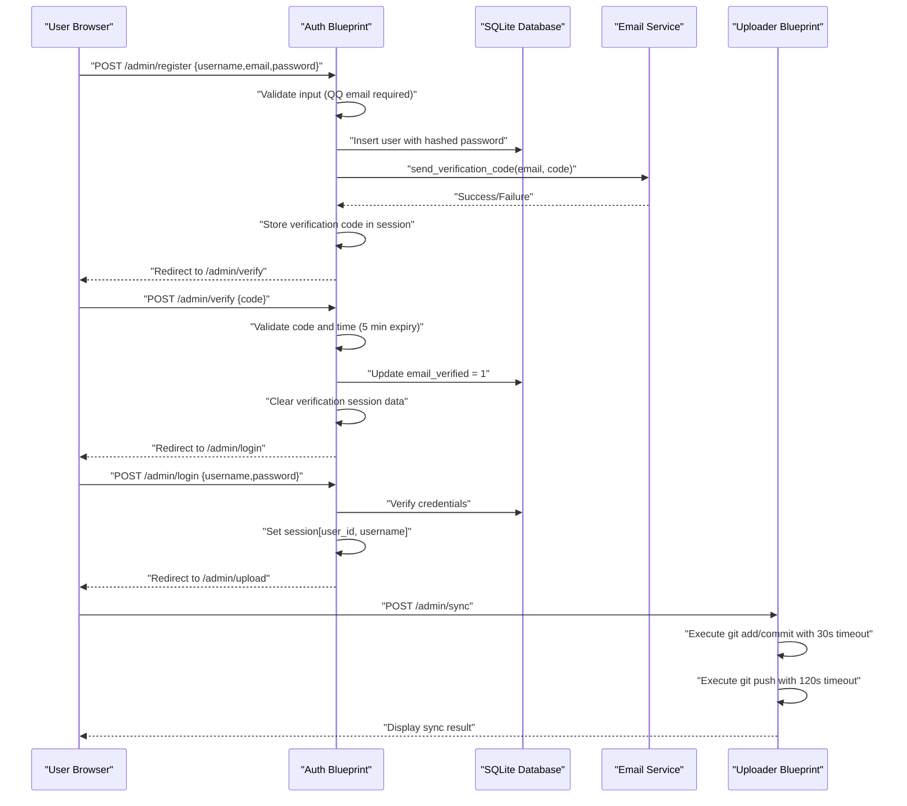
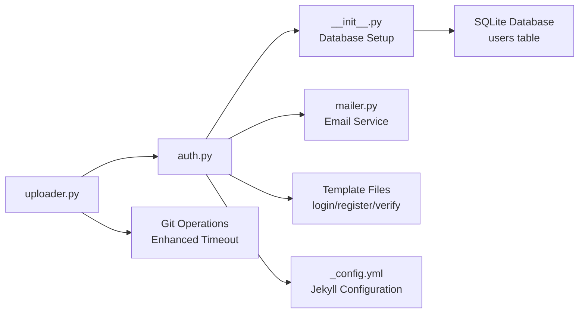

# Authentication System

<cite>
**Referenced Files in This Document**
- [app/auth.py](file://app/auth.py)
- [app/__init__.py](file://app/__init__.py)
- [app/mailer.py](file://app/mailer.py)
- [app/uploader.py](file://app/uploader.py)
- [app/templates/login.html](file://app/templates/login.html)
- [app/templates/register.html](file://app/templates/register.html)
- [app/templates/verify.html](file://app/templates/verify.html)
- [_config.yml](file://_config.yml)
- [requirements.txt](file://requirements.txt)
</cite>

## Update Summary
**Changes Made**
- Enhanced uploader functionality with increased Git push timeout from 60s to 120s for improved reliability in larger repositories or slower networks
- Updated Git synchronization process to handle longer push operations without timing out
- Improved deployment reliability for authenticated users performing content synchronization

## Table of Contents
1. [Introduction](#introduction)
2. [Project Structure](#project-structure)
3. [Core Components](#core-components)
4. [Architecture Overview](#architecture-overview)
5. [Detailed Component Analysis](#detailed-component-analysis)
6. [Dependency Analysis](#dependency-analysis)
7. [Performance Considerations](#performance-considerations)
8. [Troubleshooting Guide](#troubleshooting-guide)
9. [Conclusion](#conclusion)

## Introduction
This document describes the authentication system for PolaZhenJing. The system has been completely rewritten from a JWT-based multi-user authentication to a simplified session-based approach with QQ email verification. It explains the single-user login process, email verification workflow, session management, and protected route patterns. The system focuses on simplicity and ease of deployment while maintaining security through password hashing and email verification.

**Updated** Enhanced Git synchronization capabilities with improved timeout handling for better reliability in various network conditions.

## Project Structure
The authentication system is built around Flask Blueprints and SQLite database:
- Authentication blueprint: handles login, registration, verification, password changes, and logout
- Database initialization: manages user table with email verification support
- Email service: QQ Email SMTP integration for verification codes
- Upload blueprint: protected routes that require authentication, including enhanced Git synchronization
- Template system: Jinja2 templates for authentication UI

```mermaid
graph TB
subgraph "Backend Application"
APP["app/__init__.py<br/>Flask App Factory"]
AUTH["app/auth.py<br/>Authentication Blueprint"]
MAILER["app/mailer.py<br/>Email Service"]
UPLOADER["app/uploader.py<br/>Protected Routes & Git Sync"]
DB["SQLite Database<br/>users table"]
END
subgraph "Templates"
LOGIN["login.html"]
REGISTER["register.html"]
VERIFY["verify.html"]
END
APP --> AUTH
AUTH --> MAILER
AUTH --> DB
AUTH --> LOGIN
AUTH --> REGISTER
AUTH --> VERIFY
APP --> UPLOADER
UPLOADER --> AUTH
```

**Diagram sources**
- [app/__init__.py:43-61](file://app/__init__.py#L43-L61)
- [app/auth.py:13](file://app/auth.py#L13)
- [app/mailer.py:8](file://app/mailer.py#L8)
- [app/uploader.py:14](file://app/uploader.py#L14)

**Section sources**
- [app/__init__.py:43-61](file://app/__init__.py#L43-L61)
- [app/auth.py:13](file://app/auth.py#L13)

## Core Components
- **Authentication Blueprint**: Handles all authentication-related routes and session management
- **Database Layer**: SQLite-based user storage with unique constraints and verification flags
- **Email Service**: QQ Email SMTP integration for 6-digit verification code delivery
- **Session Management**: Flask session-based authentication with user_id tracking
- **Template System**: Jinja2 templates for login, registration, and verification flows
- **Protected Routes**: Upload and article management routes secured by login decorator, including enhanced Git synchronization
- **Git Synchronization**: Improved deployment workflow with extended timeout for reliable operations

**Section sources**
- [app/auth.py:13](file://app/auth.py#L13)
- [app/__init__.py:26-40](file://app/__init__.py#L26-L40)
- [app/mailer.py:8](file://app/mailer.py#L8)
- [app/uploader.py:14](file://app/uploader.py#L14)
- [app/uploader.py:190-209](file://app/uploader.py#L190-L209)

## Architecture Overview
The authentication architecture follows a simple session-based design:
- Users authenticate via username/password with session storage
- Registration requires QQ email with 6-digit verification code
- Protected routes use login_required decorator for access control
- Database stores hashed passwords and verification status
- Email service handles verification code delivery via QQ SMTP
- Git synchronization includes enhanced timeout handling for improved reliability



**Diagram sources**
- [app/auth.py:51-96](file://app/auth.py#L51-L96)
- [app/auth.py:99-133](file://app/auth.py#L99-L133)
- [app/auth.py:26-48](file://app/auth.py#L26-L48)
- [app/mailer.py:8](file://app/mailer.py#L8)
- [app/uploader.py:190-209](file://app/uploader.py#L190-L209)

## Detailed Component Analysis

### Authentication Blueprint
The authentication blueprint (`auth_bp`) provides all user-facing authentication functionality:

**Key Endpoints:**
- `/admin/login`: User login with username/password validation
- `/admin/register`: User registration with QQ email requirement and verification
- `/admin/verify`: Email verification with 6-digit code validation
- `/admin/password`: Password change for authenticated users
- `/admin/logout`: Session cleanup and logout

**Session Management:**
- `login_required` decorator checks for `user_id` in session
- Session stores `user_id` and `username` upon successful authentication
- Session cleared on logout for security

**Section sources**
- [app/auth.py:13](file://app/auth.py#L13)
- [app/auth.py:26-48](file://app/auth.py#L26-L48)
- [app/auth.py:51-96](file://app/auth.py#L51-L96)
- [app/auth.py:99-133](file://app/auth.py#L99-L133)
- [app/auth.py:136-167](file://app/auth.py#L136-L167)

### Database Schema and Initialization
The system uses a simple SQLite database with a single users table:

**User Table Structure:**
- `id`: Auto-incrementing primary key
- `username`: Unique, non-null text field
- `email`: Unique, non-null text field with QQ email requirement
- `password_hash`: Non-null hashed password storage
- `email_verified`: Integer flag (0/1) for verification status
- `created_at`: Timestamp for account creation

**Database Operations:**
- Automatic table creation during app initialization
- Integrity constraints prevent duplicate usernames and emails
- Password hashing using Werkzeug security utilities

**Section sources**
- [app/__init__.py:26-40](file://app/__init__.py#L26-L40)
- [app/__init__.py:9-17](file://app/__init__.py#L9-L17)

### Email Verification System
The system implements a 6-digit email verification workflow:

**Verification Process:**
1. Registration generates random 6-digit code
2. Code stored in session with timestamp (5-minute expiry)
3. QQ Email SMTP service sends HTML-formatted verification email
4. User enters code on verification page
5. System validates code, timestamp, and marks email as verified

**Security Features:**
- 5-minute code expiry prevents replay attacks
- Session-based code storage avoids database exposure
- QQ email requirement ensures valid email addresses
- Immediate verification on successful code validation

**Section sources**
- [app/auth.py:77-90](file://app/auth.py#L77-L90)
- [app/auth.py:99-133](file://app/auth.py#L99-L133)
- [app/mailer.py:8](file://app/mailer.py#L8)

### Template System
The authentication system uses Jinja2 templates for user interface:

**Template Components:**
- `login.html`: Simple username/password form with login button
- `register.html`: Registration form with QQ email requirement and password validation
- `verify.html`: 6-digit code input form with resend option

**Template Features:**
- Bootstrap-inspired styling with gold accents
- Responsive design for mobile devices
- Form validation and error message display
- Internationalization support (Chinese/English labels)

**Section sources**
- [app/templates/login.html:1](file://app/templates/login.html#L1)
- [app/templates/register.html:1](file://app/templates/register.html#L1)
- [app/templates/verify.html:1](file://app/templates/verify.html#L1)

### Protected Route Implementation
The upload blueprint demonstrates session-based protection:

**Protection Mechanism:**
- `@login_required` decorator on all upload routes
- Redirects unauthenticated users to login page
- Maintains user session across protected operations
- Enhanced Git synchronization with improved timeout handling

**Protected Routes:**
- `/admin/upload`: File upload and content processing
- `/admin/upload/style`: Style selection for generated content
- `/admin/articles`: Article listing and management
- `/admin/generate`: Content generation and post creation
- `/admin/sync`: Git synchronization with extended timeout (120s)

**Updated** Enhanced Git synchronization endpoint with increased timeout for improved reliability in larger repositories or slower networks.

**Section sources**
- [app/uploader.py:76-118](file://app/uploader.py#L76-L118)
- [app/uploader.py:121-168](file://app/uploader.py#L121-L168)
- [app/uploader.py:171-187](file://app/uploader.py#L171-L187)
- [app/uploader.py:190-209](file://app/uploader.py#L190-L209)

### Security Implementation
The system implements several security measures:

**Password Security:**
- Passwords hashed using Werkzeug's `generate_password_hash`
- Secure comparison using `check_password_hash`
- Minimum 6-character password requirement

**Session Security:**
- Flask secret key for session encryption
- Session clearing on logout
- Session-based authentication state

**Email Security:**
- QQ Email SMTP with SSL encryption
- 5-minute verification code expiry
- Session-based code storage

**Section sources**
- [app/auth.py:38](file://app/auth.py#L38)
- [app/auth.py:155](file://app/auth.py#L155)
- [app/mailer.py:45](file://app/mailer.py#L45)

### Git Synchronization Enhancement
**Updated** The Git synchronization functionality has been enhanced with improved timeout handling:

**Enhanced Timeout Configuration:**
- Git add operation: 30-second timeout
- Git commit operation: 30-second timeout  
- Git push operation: 120-second timeout (increased from 60 seconds)

**Reliability Improvements:**
- Extended push timeout accommodates larger repositories
- Better handling of slower network connections
- Reduced risk of synchronization failures during deployment
- Improved user experience for content synchronization

**Section sources**
- [app/uploader.py:190-209](file://app/uploader.py#L190-L209)

## Dependency Analysis
The authentication system maintains clear separation of concerns:



**Diagram sources**
- [app/auth.py:10](file://app/auth.py#L10)
- [app/__init__.py:26-40](file://app/__init__.py#L26-L40)
- [app/mailer.py:1](file://app/mailer.py#L1)
- [app/uploader.py:11](file://app/uploader.py#L11)
- [app/uploader.py:190-209](file://app/uploader.py#L190-L209)

**Dependencies:**
- Authentication blueprint depends on database connection and email service
- Database initialization provides connection factory and table schema
- Email service requires QQ email credentials from environment
- Upload blueprint depends on authentication for access control
- Git synchronization depends on enhanced timeout configuration
- Templates provide user interface for authentication flows

## Performance Considerations
- **Database Performance**: SQLite provides adequate performance for single-user scenarios
- **Session Storage**: Flask sessions stored server-side in memory
- **Email Delivery**: SMTP operations are asynchronous and don't block user flow
- **Memory Usage**: Simple session data minimizes memory footprint
- **Connection Pooling**: SQLite connections managed automatically by Flask
- **Git Operation Performance**: Enhanced timeout configuration improves reliability for larger repositories
- **Network Efficiency**: Extended Git push timeout reduces synchronization failures

**Updated** Enhanced Git synchronization performance with improved timeout handling for better reliability across different network conditions.

## Troubleshooting Guide

### Common Issues and Resolutions

**Registration Problems:**
- **Issue**: "Only QQ email (@qq.com) is supported"
  - **Solution**: Ensure email ends with @qq.com domain
- **Issue**: "User already registered"
  - **Solution**: Use different username or email address
- **Issue**: Email not received
  - **Solution**: Check QQ email credentials and SMTP settings

**Login Problems:**
- **Issue**: "Username not found" or "Incorrect password"
  - **Solution**: Verify credentials and account existence
- **Issue**: Redirect loop to login
  - **Solution**: Check session cookie and browser settings

**Verification Issues:**
- **Issue**: "Verification code expired"
  - **Solution**: Resend code and enter within 5 minutes
- **Issue**: "Invalid verification code"
  - **Solution**: Check code carefully and resend if needed

**Email Service Issues:**
- **Issue**: Email sending fails
  - **Solution**: Verify QQ_EMAIL and QQ_EMAIL_AUTH_CODE environment variables
  - **Issue**: SMTP connection timeout
  - **Solution**: Check network connectivity and QQ SMTP settings

**Git Synchronization Issues:**
- **Issue**: "Git push timeout during synchronization"
  - **Solution**: The system now uses 120-second timeout, allowing more time for larger repositories
- **Issue**: "Sync operation failed"
  - **Solution**: Check Git configuration and remote repository accessibility
- **Issue**: "Large repository sync takes too long"
  - **Solution**: The extended timeout (120s) improves reliability for larger repositories

**Updated** Enhanced Git synchronization troubleshooting with improved timeout handling.

### Debugging Techniques
- **Enable Debug Mode**: Set Flask debug mode for detailed error messages
- **Check Environment Variables**: Verify SECRET_KEY, QQ_EMAIL, and QQ_EMAIL_AUTH_CODE
- **Database Inspection**: Query users table to verify account status
- **Session Monitoring**: Check browser cookies for session data
- **Log Analysis**: Review application logs for authentication events
- **Git Operation Monitoring**: Monitor Git add/commit/push operations for timing issues

### Security Considerations
- **Change Default Secrets**: Update SECRET_KEY in production environment
- **Environment Configuration**: Store credentials in .env file, not in code
- **HTTPS Deployment**: Use SSL certificates for production deployment
- **Session Security**: Configure appropriate session cookie settings
- **Rate Limiting**: Consider implementing rate limiting for login attempts
- **Git Security**: Ensure proper Git credentials and repository permissions

**Section sources**
- [app/auth.py:66](file://app/auth.py#L66)
- [app/auth.py:111](file://app/auth.py#L111)
- [app/mailer.py:16](file://app/mailer.py#L16)
- [app/uploader.py:190-209](file://app/uploader.py#L190-L209)

## Conclusion
PolaZhenJing's authentication system provides a streamlined, single-user approach focused on simplicity and reliability. The session-based design eliminates complex token management while maintaining security through password hashing, email verification, and protected routes. The QQ email requirement ensures valid contact information while the 6-digit verification system provides an additional security layer. 

**Updated** Recent enhancements include improved Git synchronization capabilities with extended timeout handling, making the system more reliable for larger repositories and slower network conditions. This enhancement maintains the system's focus on simplicity while improving operational reliability for content deployment and synchronization tasks.

This approach is ideal for personal blogs and single-user applications where ease of use and minimal complexity are priorities, while the enhanced Git synchronization capabilities ensure robust deployment workflows for content management tasks.