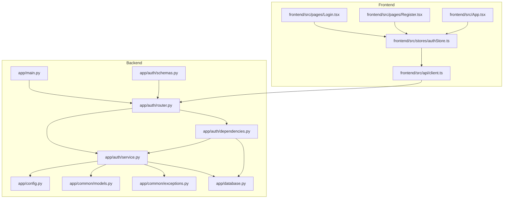
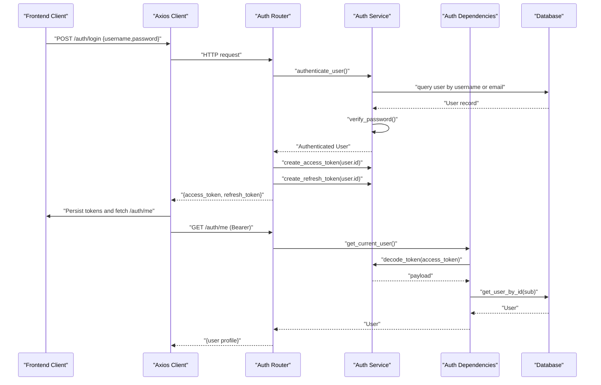
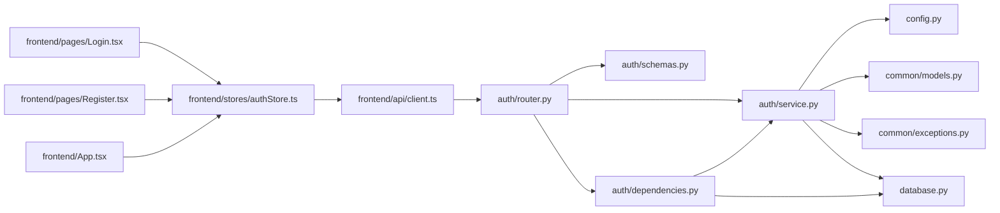

# Authentication System

<cite>
**Referenced Files in This Document**
- [backend/app/auth/router.py](file://backend/app/auth/router.py)
- [backend/app/auth/schemas.py](file://backend/app/auth/schemas.py)
- [backend/app/auth/service.py](file://backend/app/auth/service.py)
- [backend/app/auth/dependencies.py](file://backend/app/auth/dependencies.py)
- [backend/app/config.py](file://backend/app/config.py)
- [backend/app/common/models.py](file://backend/app/common/models.py)
- [backend/app/common/exceptions.py](file://backend/app/common/exceptions.py)
- [backend/app/database.py](file://backend/app/database.py)
- [backend/app/main.py](file://backend/app/main.py)
- [frontend/src/api/client.ts](file://frontend/src/api/client.ts)
- [frontend/src/stores/authStore.ts](file://frontend/src/stores/authStore.ts)
- [frontend/src/pages/Login.tsx](file://frontend/src/pages/Login.tsx)
- [frontend/src/pages/Register.tsx](file://frontend/src/pages/Register.tsx)
- [frontend/src/App.tsx](file://frontend/src/App.tsx)
</cite>

## Table of Contents
1. [Introduction](#introduction)
2. [Project Structure](#project-structure)
3. [Core Components](#core-components)
4. [Architecture Overview](#architecture-overview)
5. [Detailed Component Analysis](#detailed-component-analysis)
6. [Dependency Analysis](#dependency-analysis)
7. [Performance Considerations](#performance-considerations)
8. [Troubleshooting Guide](#troubleshooting-guide)
9. [Conclusion](#conclusion)

## Introduction
This document describes the authentication system for PolaZhenJing. It explains the JWT-based authentication flow, user registration and login processes, token management, and protected route patterns. It documents the authentication service implementation including password hashing, token generation and validation, and outlines the authentication schemas and request/response models. It also covers security best practices, token refresh mechanisms, logout procedures, and the user permission system with role-based access control.

## Project Structure
The authentication system spans the backend FastAPI application and the frontend React client:
- Backend: authentication endpoints, schemas, service, dependencies, configuration, models, and exception handling
- Frontend: API client with interceptors, authentication store, and protected routes

**Diagram sources**
- [backend/app/main.py:40-72](file://backend/app/main.py#L40-L72)
- [backend/app/auth/router.py:35-91](file://backend/app/auth/router.py#L35-L91)
- [backend/app/auth/service.py:1-166](file://backend/app/auth/service.py#L1-L166)
- [backend/app/auth/dependencies.py:27-66](file://backend/app/auth/dependencies.py#L27-L66)
- [backend/app/auth/schemas.py:19-58](file://backend/app/auth/schemas.py#L19-L58)
- [backend/app/config.py:38-42](file://backend/app/config.py#L38-L42)
- [backend/app/common/models.py:41-76](file://backend/app/common/models.py#L41-L76)
- [backend/app/common/exceptions.py:66-87](file://backend/app/common/exceptions.py#L66-L87)
- [backend/app/database.py:47-63](file://backend/app/database.py#L47-L63)
- [frontend/src/api/client.ts:14-63](file://frontend/src/api/client.ts#L14-L63)
- [frontend/src/stores/authStore.ts:37-101](file://frontend/src/stores/authStore.ts#L37-L101)
- [frontend/src/pages/Login.tsx:17-103](file://frontend/src/pages/Login.tsx#L17-L103)
- [frontend/src/pages/Register.tsx:17-120](file://frontend/src/pages/Register.tsx#L17-L120)
- [frontend/src/App.tsx:41-94](file://frontend/src/App.tsx#L41-L94)

**Section sources**
- [backend/app/main.py:40-72](file://backend/app/main.py#L40-L72)
- [frontend/src/App.tsx:41-94](file://frontend/src/App.tsx#L41-L94)

## Core Components
- Authentication router: exposes endpoints for registration, login, refresh, and retrieving the current user
- Authentication service: implements password hashing, JWT creation/decoding, and user operations
- Authentication dependencies: extract and validate JWTs from Authorization headers and enforce RBAC
- Schemas: Pydantic models for request/response payloads
- Configuration: JWT settings and environment-driven configuration
- Models: User entity with roles and activity flags
- Exceptions: unified exception classes and handlers
- Database: async SQLAlchemy engine and session management
- Frontend client: Axios client with interceptors for token injection and refresh
- Frontend store: manages auth state, tokens, and protected routes

**Section sources**
- [backend/app/auth/router.py:35-91](file://backend/app/auth/router.py#L35-L91)
- [backend/app/auth/service.py:29-166](file://backend/app/auth/service.py#L29-L166)
- [backend/app/auth/dependencies.py:27-66](file://backend/app/auth/dependencies.py#L27-L66)
- [backend/app/auth/schemas.py:19-58](file://backend/app/auth/schemas.py#L19-L58)
- [backend/app/config.py:38-42](file://backend/app/config.py#L38-L42)
- [backend/app/common/models.py:41-76](file://backend/app/common/models.py#L41-L76)
- [backend/app/common/exceptions.py:16-87](file://backend/app/common/exceptions.py#L16-L87)
- [backend/app/database.py:24-63](file://backend/app/database.py#L24-L63)
- [frontend/src/api/client.ts:14-63](file://frontend/src/api/client.ts#L14-L63)
- [frontend/src/stores/authStore.ts:37-101](file://frontend/src/stores/authStore.ts#L37-L101)

## Architecture Overview
The authentication architecture follows a layered design:
- Frontend Axios client injects Authorization headers and automatically refreshes tokens on 401
- Backend FastAPI routes accept JSON payloads, validate credentials, and issue JWT pairs
- Authentication dependencies validate access tokens and resolve the current user
- Role-based access control is enforced via a superuser dependency
- Database-backed user persistence with unique constraints and hashed passwords

**Diagram sources**
- [backend/app/auth/router.py:57-91](file://backend/app/auth/router.py#L57-L91)
- [backend/app/auth/service.py:126-150](file://backend/app/auth/service.py#L126-L150)
- [backend/app/auth/dependencies.py:27-51](file://backend/app/auth/dependencies.py#L27-L51)
- [frontend/src/api/client.ts:19-60](file://frontend/src/api/client.ts#L19-L60)

## Detailed Component Analysis

### Authentication Router
Endpoints:
- POST /auth/register: creates a new user with unique username and email; password is hashed before storage
- POST /auth/login: authenticates credentials and returns a JWT pair (access and refresh)
- POST /auth/refresh: exchanges a valid refresh token for a new JWT pair
- GET /auth/me: returns the current authenticated user profile

Validation and behavior:
- Registration enforces unique constraints and raises conflicts on duplicates
- Login accepts either username or email and verifies password
- Refresh validates token type and reissues tokens
- Me endpoint depends on get_current_user for access validation

**Section sources**
- [backend/app/auth/router.py:38-91](file://backend/app/auth/router.py#L38-L91)

### Authentication Service
Core logic:
- Password hashing and verification using bcrypt
- JWT encoding/decoding with HS256
- Access token expiration configured via settings
- Refresh token expiration configured via settings
- User registration and authentication queries
- User lookup by ID with error handling

Security controls:
- Passwords are hashed before storage
- Tokens carry a type claim to prevent misuse
- Expiration timestamps protect against long-lived tokens
- Account deactivation blocks authentication

**Section sources**
- [backend/app/auth/service.py:29-166](file://backend/app/auth/service.py#L29-L166)
- [backend/app/config.py:38-42](file://backend/app/config.py#L38-L42)

### Authentication Dependencies
- get_current_user: extracts Bearer token, decodes JWT, validates type, loads user, and rejects inactive accounts
- get_current_superuser: enforces superuser privilege requirement

Integration:
- Used by protected endpoints to secure resources
- Raises UnauthorizedException or ForbiddenException as appropriate

**Section sources**
- [backend/app/auth/dependencies.py:27-66](file://backend/app/auth/dependencies.py#L27-L66)

### Authentication Schemas
Request/response models:
- RegisterRequest: username, email, password, optional display_name
- LoginRequest: username (accepts username or email), password
- TokenResponse: access_token, refresh_token, token_type
- RefreshRequest: refresh_token
- UserResponse: id, username, email, display_name, is_active, is_superuser, created_at

Validation:
- Length and format constraints for inputs
- Pydantic serialization/deserialization for API payloads

**Section sources**
- [backend/app/auth/schemas.py:19-58](file://backend/app/auth/schemas.py#L19-L58)

### Configuration
JWT settings:
- Secret key, algorithm, access token expiry (minutes), refresh token expiry (days)
- Environment-driven configuration via pydantic-settings

Other settings:
- Database URL, CORS origins, AI provider configuration, site publishing settings

**Section sources**
- [backend/app/config.py:38-42](file://backend/app/config.py#L38-L42)

### Models and Database
User model:
- Unique username and email
- Hashed password storage
- Activity flag and superuser flag
- Timestamps for created/updated

Database integration:
- Async SQLAlchemy engine and session factory
- Dependency pattern for route handlers

**Section sources**
- [backend/app/common/models.py:41-76](file://backend/app/common/models.py#L41-L76)
- [backend/app/database.py:24-63](file://backend/app/database.py#L24-L63)

### Frontend Authentication Flow
Client behavior:
- Axios request interceptor attaches Authorization: Bearer header when present
- Response interceptor handles 401 by attempting refresh with refresh_token
- On successful refresh, retries original request with new access token
- On failure, clears tokens and navigates to login

Store responsibilities:
- Persist tokens in localStorage
- Fetch user profile after login
- Clear state on logout

Protected routes:
- App wraps route components with ProtectedRoute to block unauthenticated users

**Section sources**
- [frontend/src/api/client.ts:19-60](file://frontend/src/api/client.ts#L19-L60)
- [frontend/src/stores/authStore.ts:37-101](file://frontend/src/stores/authStore.ts#L37-L101)
- [frontend/src/App.tsx:23-39](file://frontend/src/App.tsx#L23-L39)
- [frontend/src/pages/Login.tsx:17-103](file://frontend/src/pages/Login.tsx#L17-L103)
- [frontend/src/pages/Register.tsx:17-120](file://frontend/src/pages/Register.tsx#L17-L120)

### Token Management and Refresh Mechanism
Token lifecycle:
- Access token: short-lived, used for protected requests
- Refresh token: long-lived, used to obtain new token pair
- On 401, frontend attempts refresh and retries request transparently
- Logout clears tokens from localStorage

Best practices:
- Store refresh tokens securely and avoid exposing them unnecessarily
- Prefer HttpOnly cookies for refresh tokens in production deployments
- Implement token rotation and revocation strategies as needed

**Section sources**
- [backend/app/auth/router.py:71-85](file://backend/app/auth/router.py#L71-L85)
- [frontend/src/api/client.ts:28-60](file://frontend/src/api/client.ts#L28-L60)
- [frontend/src/stores/authStore.ts:79-83](file://frontend/src/stores/authStore.ts#L79-L83)

### User Permission System and Role-Based Access Control
Roles:
- is_superuser flag indicates administrative privileges
- get_current_superuser dependency enforces superuser-only access

Protected endpoints:
- Many routes depend on get_current_user to require authentication
- Superuser-only routes depend on get_current_superuser

**Section sources**
- [backend/app/common/models.py:66-67](file://backend/app/common/models.py#L66-L67)
- [backend/app/auth/dependencies.py:54-66](file://backend/app/auth/dependencies.py#L54-L66)

### Protected Route Patterns
Protected endpoints across modules depend on get_current_user. Examples include:
- Thoughts, Tags, Sharing, Publish, AI, and Auth routes

These routes ensure that only authenticated, active users can access protected resources.

**Section sources**
- [backend/app/thoughts/router.py:44](file://backend/app/thoughts/router.py#L44)
- [backend/app/tags/router.py:40](file://backend/app/tags/router.py#L40)
- [backend/app/sharing/router.py:28](file://backend/app/sharing/router.py#L28)
- [backend/app/publish/router.py:39](file://backend/app/publish/router.py#L39)
- [backend/app/ai/router.py:53](file://backend/app/ai/router.py#L53)

## Dependency Analysis
The authentication system exhibits clear separation of concerns:
- Router depends on service and schemas
- Service depends on configuration, models, exceptions, and database
- Dependencies depend on service and database
- Frontend client depends on backend endpoints and local storage
- Frontend store depends on client and routes

**Diagram sources**
- [backend/app/auth/router.py:35-91](file://backend/app/auth/router.py#L35-L91)
- [backend/app/auth/service.py:1-166](file://backend/app/auth/service.py#L1-L166)
- [backend/app/auth/dependencies.py:27-66](file://backend/app/auth/dependencies.py#L27-L66)
- [backend/app/auth/schemas.py:19-58](file://backend/app/auth/schemas.py#L19-L58)
- [backend/app/config.py:38-42](file://backend/app/config.py#L38-L42)
- [backend/app/common/models.py:41-76](file://backend/app/common/models.py#L41-L76)
- [backend/app/common/exceptions.py:66-87](file://backend/app/common/exceptions.py#L66-L87)
- [backend/app/database.py:47-63](file://backend/app/database.py#L47-L63)
- [frontend/src/api/client.ts:14-63](file://frontend/src/api/client.ts#L14-L63)
- [frontend/src/stores/authStore.ts:37-101](file://frontend/src/stores/authStore.ts#L37-L101)
- [frontend/src/pages/Login.tsx:17-103](file://frontend/src/pages/Login.tsx#L17-L103)
- [frontend/src/pages/Register.tsx:17-120](file://frontend/src/pages/Register.tsx#L17-L120)
- [frontend/src/App.tsx:41-94](file://frontend/src/App.tsx#L41-L94)

## Performance Considerations
- Asynchronous database operations reduce blocking latency
- Token decoding is lightweight; cache decoded payloads only if needed
- Minimize unnecessary round-trips by refreshing tokens proactively when nearing expiry
- Use connection pooling and pre-ping to maintain DB health

## Troubleshooting Guide
Common issues and resolutions:
- Invalid or expired token: ensure tokens are attached to Authorization header and not stale
- Invalid token type: verify that refresh endpoints receive refresh tokens and access endpoints receive access tokens
- User not found or deactivated: confirm user exists and is_active is true
- Duplicate username or email: resolve conflicts before registration
- 401 responses: frontend attempts automatic refresh; if it fails, clear tokens and re-authenticate

Debugging techniques:
- Enable DEBUG mode to log SQL statements and request/response details
- Inspect JWT payloads to verify exp and type claims
- Verify environment variables for JWT_SECRET_KEY and JWT_ALGORITHM
- Check CORS settings if cross-origin requests fail

Security considerations:
- Change JWT_SECRET_KEY immediately in production
- Use HTTPS in production to protect token transmission
- Consider rotating secrets and implementing token revocation strategies
- Avoid storing sensitive tokens in browser localStorage; prefer HttpOnly cookies for refresh tokens

**Section sources**
- [backend/app/auth/service.py:72-89](file://backend/app/auth/service.py#L72-L89)
- [backend/app/auth/dependencies.py:38-51](file://backend/app/auth/dependencies.py#L38-L51)
- [backend/app/auth/service.py:109-114](file://backend/app/auth/service.py#L109-L114)
- [frontend/src/api/client.ts:28-60](file://frontend/src/api/client.ts#L28-L60)
- [backend/app/config.py:38-42](file://backend/app/config.py#L38-L42)

## Conclusion
PolaZhenJing’s authentication system provides a robust, layered approach to user management and access control. It leverages JWT for stateless authentication, bcrypt for secure password storage, and a clean separation of concerns across backend and frontend. By following the outlined best practices and troubleshooting steps, teams can maintain a secure and reliable authentication pipeline while scaling to production requirements.