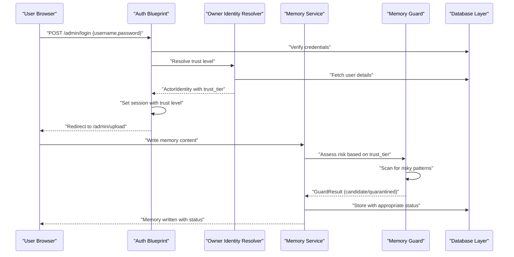
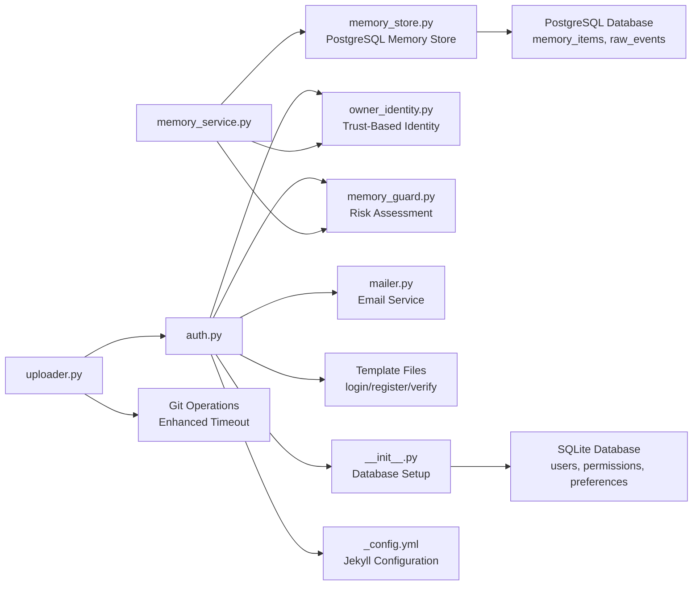

# Authentication System

<cite>
**Referenced Files in This Document**
- [app/auth.py](file://app/auth.py)
- [app/owner_identity.py](file://app/owner_identity.py)
- [app/memory_guard.py](file://app/memory_guard.py)
- [app/memory_service.py](file://app/memory_service.py)
- [app/memory_store.py](file://app/memory_store.py)
- [app/__init__.py](file://app/__init__.py)
- [app/mailer.py](file://app/mailer.py)
- [app/uploader.py](file://app/uploader.py)
- [app/templates/login.html](file://app/templates/login.html)
- [app/templates/register.html](file://app/templates/register.html)
- [app/templates/verify.html](file://app/templates/verify.html)
- [migrations/agent_memory/001_postgres_memory_ledger.sql](file://migrations/agent_memory/001_postgres_memory_ledger.sql)
- [_config.yml](file://_config.yml)
- [requirements.txt](file://requirements.txt)
</cite>

## Update Summary
**Changes Made**
- Enhanced authentication system with owner identity resolver supporting visitor, authenticated user, admin, and owner trust tiers
- Integrated memory system with secure content management and access control
- Added comprehensive permission catalog and role-based access control
- Implemented trust-based memory governance with risk assessment
- Added PostgreSQL-backed memory storage with advanced search capabilities

## Table of Contents
1. [Introduction](#introduction)
2. [Project Structure](#project-structure)
3. [Core Components](#core-components)
4. [Architecture Overview](#architecture-overview)
5. [Detailed Component Analysis](#detailed-component-analysis)
6. [Trust-Based Identity System](#trust-based-identity-system)
7. [Memory Governance and Access Control](#memory-governance-and-access-control)
8. [Permission Management System](#permission-management-system)
9. [Dependency Analysis](#dependency-analysis)
10. [Performance Considerations](#performance-considerations)
11. [Troubleshooting Guide](#troubleshooting-guide)
12. [Conclusion](#conclusion)

## Introduction
This document describes the enhanced authentication system for PolaZhenJing, which has evolved from a simple session-based authentication to a sophisticated trust-based identity system with integrated memory management. The system now supports four distinct trust tiers: visitor, trusted user, admin, and owner, each with different access levels and capabilities. The authentication system is tightly integrated with a secure memory management system that provides controlled access to sensitive content based on user trust levels.

The system implements comprehensive permission management, role-based access control, and advanced memory governance with risk assessment capabilities. It supports both SQLite-based user management and PostgreSQL-backed memory storage for scalable content management.

## Project Structure
The authentication system is built around Flask Blueprints with enhanced trust-based identity resolution and integrated memory management:

- **Authentication Blueprint**: Handles login, registration, verification, password changes, and logout with comprehensive permission management
- **Owner Identity Resolver**: Provides trust-based identity resolution with four distinct trust tiers
- **Memory Governance**: Implements risk assessment and content filtering based on trust levels
- **Permission Catalog**: Defines granular permissions across multiple applications and services
- **Database Layer**: Supports both SQLite user management and PostgreSQL memory storage
- **Template System**: Jinja2 templates for authentication UI with permission-aware rendering

```mermaid
graph TB
subgraph "Enhanced Authentication System"
APP["app/__init__.py<br/>Flask App Factory"]
AUTH["app/auth.py<br/>Enhanced Auth Blueprint"]
OWNER_ID["app/owner_identity.py<br/>Trust-Based Identity Resolver"]
MEM_GUARD["app/memory_guard.py<br/>Risk Assessment & Content Filtering"]
MEM_SERVICE["app/memory_service.py<br/>Memory Management Facade"]
MEM_STORE["app/memory_store.py<br/>PostgreSQL Memory Store"]
DB["SQLite Database<br/>users, permissions, preferences"]
PG_DB["PostgreSQL Database<br/>memory_items, raw_events"]
END
subgraph "Templates"
LOGIN["login.html"]
REGISTER["register.html"]
VERIFY["verify.html"]
END
APP --> AUTH
AUTH --> OWNER_ID
AUTH --> MEM_GUARD
AUTH --> DB
AUTH --> LOGIN
AUTH --> REGISTER
AUTH --> VERIFY
AUTH --> MEM_SERVICE
MEM_SERVICE --> OWNER_ID
MEM_SERVICE --> MEM_GUARD
MEM_SERVICE --> MEM_STORE
MEM_STORE --> PG_DB
```

**Diagram sources**
- [app/__init__.py:112-157](file://app/__init__.py#L112-L157)
- [app/auth.py:21](file://app/auth.py#L21)
- [app/owner_identity.py:20-67](file://app/owner_identity.py#L20-L67)
- [app/memory_service.py:13-15](file://app/memory_service.py#L13-L15)
- [app/memory_store.py:62-110](file://app/memory_store.py#L62-L110)

**Section sources**
- [app/__init__.py:112-157](file://app/__init__.py#L112-L157)
- [app/auth.py:21](file://app/auth.py#L21)
- [app/owner_identity.py:20-67](file://app/owner_identity.py#L20-L67)

## Core Components
- **Enhanced Authentication Blueprint**: Comprehensive authentication with permission management, user preferences, and administrative controls
- **Trust-Based Identity Resolver**: Four-tier trust system (visitor, trusted user, admin, owner) with automatic privilege escalation
- **Memory Governance Engine**: Risk assessment and content filtering based on trust levels and content patterns
- **Permission Catalog System**: Granular permissions across multiple applications (PolaZhenjing, Skill Hub, PolaRead, PolaNews, AI Avatar, AIPD)
- **Multi-Tier Database Architecture**: SQLite for user management, PostgreSQL for memory storage with optional fallback
- **Template System**: Permission-aware rendering with dynamic UI based on user trust levels
- **Protected Routes**: Enhanced with trust-based access control and memory management integration
- **Secure Content Management**: Controlled access to sensitive content based on trust levels and risk assessment

**Section sources**
- [app/auth.py:49-69](file://app/auth.py#L49-L69)
- [app/owner_identity.py:20-67](file://app/owner_identity.py#L20-L67)
- [app/memory_guard.py:9-24](file://app/memory_guard.py#L9-L24)
- [app/memory_service.py:13-15](file://app/memory_service.py#L13-L15)

## Architecture Overview
The enhanced authentication architecture implements a trust-based identity system with integrated memory management:

- **Trust Levels**: Visitor (0), Trusted User (1), Admin (2), Owner (3) with automatic privilege escalation
- **Identity Resolution**: Automatic detection of owner/admin status based on email, username, or role
- **Permission Management**: Granular permissions across multiple applications with manual and automated assignment
- **Memory Governance**: Risk assessment with quarantine and candidate review workflows
- **Access Control**: Trust-based filtering of sensitive content and memory operations
- **Database Integration**: Seamless switching between SQLite and PostgreSQL backends

```mermaid
sequenceDiagram
participant User as "User Browser"
participant Auth as "Auth Blueprint"
participant OwnerId as "Owner Identity Resolver"
participant MemService as "Memory Service"
participant Guard as "Memory Guard"
participant DB as "Database Layer"
User->>Auth : "POST /admin/login {username,password}"
Auth->>DB : "Verify credentials"
Auth->>OwnerId : "Resolve trust level"
OwnerId->>DB : "Fetch user details"
OwnerId-->>Auth : "ActorIdentity with trust_tier"
Auth->>Auth : "Set session with trust level"
Auth-->>User : "Redirect to /admin/upload"
User->>MemService : "Write memory content"
MemService->>Guard : "Assess risk based on trust_tier"
Guard->>Guard : "Scan for risky patterns"
Guard-->>MemService : "GuardResult (candidate/quarantined)"
MemService->>DB : "Store with appropriate status"
MemService-->>User : "Memory written with status"
```

**Diagram sources**
- [app/auth.py:286-317](file://app/auth.py#L286-L317)
- [app/owner_identity.py:106-156](file://app/owner_identity.py#L106-L156)
- [app/memory_service.py:162-188](file://app/memory_service.py#L162-L188)
- [app/memory_guard.py:51-77](file://app/memory_guard.py#L51-L77)

## Detailed Component Analysis

### Enhanced Authentication Blueprint
The authentication blueprint (`auth_bp`) provides comprehensive user management with integrated permission and preference systems:

**Key Endpoints:**
- `/admin/login`: Enhanced login with trust level resolution and session management
- `/admin/register`: User registration with QQ email requirement and verification
- `/admin/verify`: Email verification with 6-digit code validation
- `/admin/password`: Password change for authenticated users
- `/admin/account`: Comprehensive account management with preferences and permissions
- `/admin/api/me`: API endpoint returning user profile with permissions
- `/admin/api/sso/check`: Single sign-on validation with permission checking
- `/admin/api/admin/*`: Administrative endpoints for user and permission management

**Enhanced Features:**
- Trust level resolution during login
- Comprehensive user preferences management
- Permission catalog integration
- Administrative user management
- API endpoints for external integrations

**Section sources**
- [app/auth.py:286-317](file://app/auth.py#L286-L317)
- [app/auth.py:320-363](file://app/auth.py#L320-L363)
- [app/auth.py:366-403](file://app/auth.py#L366-L403)
- [app/auth.py:406-541](file://app/auth.py#L406-L541)
- [app/auth.py:544-671](file://app/auth.py#L544-L671)

### Database Schema and Multi-Tier Architecture
The system uses a dual-database architecture with enhanced schema support:

**SQLite User Database:**
- `users`: Enhanced with role and email verification fields
- `user_preferences`: Theme, font, and layout preferences
- `user_permissions`: Granular permission assignments
- `permission_requests`: Permission request and approval workflow
- `app_user_links`: External application user linking

**PostgreSQL Memory Database:**
- `raw_events`: Event logging with risk assessment
- `memory_items`: Structured memory storage with status tracking
- `visitor_suggestions`: Guest contribution management
- `memory_embeddings`: Vector embeddings for advanced search
- `persona_versions`: AI persona configuration management
- `memory_audit_logs`: Complete audit trail of memory operations

**Section sources**
- [app/__init__.py:47-108](file://app/__init__.py#L47-L108)
- [migrations/agent_memory/001_postgres_memory_ledger.sql:6-118](file://migrations/agent_memory/001_postgres_memory_ledger.sql#L6-L118)

### Email Verification System
The system implements a 6-digit email verification workflow with enhanced security:

**Verification Process:**
1. Registration generates random 6-digit code
2. Code stored in session with timestamp (5-minute expiry)
3. QQ Email SMTP service sends HTML-formatted verification email
4. User enters code on verification page
5. System validates code, timestamp, and marks email as verified

**Security Features:**
- 5-minute code expiry prevents replay attacks
- Session-based code storage avoids database exposure
- QQ email requirement ensures valid email addresses
- Immediate verification on successful code validation

**Section sources**
- [app/auth.py:344-357](file://app/auth.py#L344-L357)
- [app/auth.py:366-403](file://app/auth.py#L366-L403)

### Template System
The authentication system uses Jinja2 templates with permission-aware rendering:

**Template Components:**
- `login.html`: Simple username/password form with login button
- `register.html`: Registration form with QQ email requirement and password validation
- `verify.html`: 6-digit code input form with resend option
- `account.html`: Comprehensive account management with preferences and permissions

**Enhanced Features:**
- Bootstrap-inspired styling with gold accents
- Responsive design for mobile devices
- Form validation and error message display
- Internationalization support (Chinese/English labels)
- Permission-aware UI elements

**Section sources**
- [app/templates/login.html:1](file://app/templates/login.html#L1)
- [app/templates/register.html:1](file://app/templates/register.html#L1)
- [app/templates/verify.html:1](file://app/templates/verify.html#L1)

### Protected Route Implementation
The system implements trust-based protection for all routes:

**Protection Mechanisms:**
- `@login_required` decorator for basic authentication
- Trust-level aware access control for sensitive operations
- Permission-based authorization for administrative functions
- Memory operation protection based on content risk assessment

**Protected Routes:**
- `/admin/upload`: File upload and content processing
- `/admin/articles`: Article listing and management
- `/admin/generate`: Content generation and post creation
- `/admin/sync`: Git synchronization with enhanced timeout
- `/admin/api/*`: API endpoints with comprehensive access control

**Section sources**
- [app/auth.py:276-283](file://app/auth.py#L276-L283)
- [app/uploader.py:76-118](file://app/uploader.py#L76-L118)

### Security Implementation
The system implements comprehensive security measures across multiple layers:

**Password Security:**
- Passwords hashed using Werkzeug's `generate_password_hash`
- Secure comparison using `check_password_hash`
- Minimum 6-character password requirement

**Session Security:**
- Flask secret key for session encryption
- Session clearing on logout
- Session-based authentication state with trust levels

**Email Security:**
- QQ Email SMTP with SSL encryption
- 5-minute verification code expiry
- Session-based code storage

**Trust-Based Access Control:**
- Automatic privilege escalation for owners/admins
- Trust-level aware content filtering
- Risk assessment for sensitive operations
- Audit logging for all privileged actions

**Section sources**
- [app/auth.py:286-317](file://app/auth.py#L286-L317)
- [app/owner_identity.py:140-156](file://app/owner_identity.py#L140-L156)
- [app/memory_guard.py:51-77](file://app/memory_guard.py#L51-L77)

## Trust-Based Identity System

### Trust Tier Architecture
The system implements a four-tier trust hierarchy with automatic privilege escalation:

**Trust Tiers:**
1. **Visitor (0)**: Anonymous users with minimal privileges
2. **Trusted User (1)**: Authenticated users with standard permissions
3. **Admin (2)**: System administrators with elevated privileges
4. **Owner (3)**: Primary system owner with maximum privileges

**Trust Level Resolution:**
- **Owner Detection**: Automatic recognition via email aliases, username aliases, or phone numbers
- **Admin Detection**: Role-based or username-based elevation
- **Authenticated User**: Standard user with basic permissions
- **Visitor**: Anonymous user with limited access

**Section sources**
- [app/owner_identity.py:20-67](file://app/owner_identity.py#L20-L67)
- [app/owner_identity.py:106-156](file://app/owner_identity.py#L106-L156)

### Owner Identity Resolution
The `ActorIdentity` class provides comprehensive identity resolution:

**Identity Properties:**
- `subject_id`: Unique identifier for the actor
- `identity_scope`: Current trust level (visitor, user, admin, owner)
- `user_id`: Database user identifier (None for visitors)
- `username`, `email`, `phone`: User contact information
- `role`: User role designation
- `trust_tier`: String representation of trust level

**Trust Level Determination:**
- **Owner**: Explicit owner alias match or highest trust level
- **Admin**: Role=admin or specific usernames
- **Authenticated User**: Logged-in user with valid session
- **Visitor**: Anonymous user without session

**Section sources**
- [app/owner_identity.py:20-67](file://app/owner_identity.py#L20-L67)
- [app/owner_identity.py:140-156](file://app/owner_identity.py#L140-L156)

### Trust-Level Aware Operations
Many system operations are filtered based on trust levels:

**Content Filtering:**
- High-risk content (prompt injection, secret exfiltration) quarantined for non-owners
- Boundary override patterns require owner confirmation
- Recommendation poisoning triggers risk assessment

**Access Control:**
- Memory write operations restricted by trust level
- Administrative functions require admin or owner status
- Sensitive operations require explicit owner authorization

**Section sources**
- [app/memory_guard.py:51-77](file://app/memory_guard.py#L51-L77)
- [app/memory_service.py:190-227](file://app/memory_service.py#L190-L227)

## Memory Governance and Access Control

### Risk Assessment Framework
The memory governance system implements comprehensive risk assessment:

**Risk Categories:**
- **Prompt Injection**: Attempts to bypass system rules or instructions
- **Secret Exfiltration**: Requests to share API keys, secrets, or tokens
- **Persona Takeover**: Commands attempting to alter AI personality
- **Boundary Override**: Requests to bypass safety boundaries
- **Recommendation Poisoning**: Commands to bias recommendations

**Risk Scoring:**
- Pattern matching with regular expressions
- Context-aware risk assessment based on trust level
- Quarantine vs. candidate classification
- Owner-required confirmation for high-risk content

**Section sources**
- [app/memory_guard.py:27-33](file://app/memory_guard.py#L27-L33)
- [app/memory_guard.py:51-77](file://app/memory_guard.py#L51-L77)

### Memory Type Classification
Content is automatically classified into memory categories:

**Memory Types:**
- **Values**: Personality traits, values, and ethical guidelines
- **Boundary**: Safety boundaries and restrictions
- **Preference**: User preferences and inclinations
- **Procedural**: Procedures, steps, and best practices
- **Episodic**: Personal experiences and events
- **Semantic**: General knowledge and facts

**Classification Logic:**
- Keyword-based pattern matching
- Context-aware categorization
- Automatic type assignment for memory items

**Section sources**
- [app/memory_guard.py:36-48](file://app/memory_guard.py#L36-L48)

### Memory Status Management
Memory items progress through different states based on trust level and risk assessment:

**Status Types:**
- **Candidate**: Content awaiting review or activation
- **Active**: Content approved for use
- **Pinned**: Content with elevated priority
- **Deprecated**: Content marked for retirement
- **Discarded**: Content rejected or removed
- **Quarantined**: Content requiring owner intervention

**Status Transitions:**
- Non-owner risky content automatically quarantined
- Owner-approved content moves to active status
- Visitor suggestions require owner review
- Automatic status updates based on risk assessment

**Section sources**
- [app/memory_service.py:230-263](file://app/memory_service.py#L230-L263)
- [app/memory_service.py:272-303](file://app/memory_service.py#L272-L303)

## Permission Management System

### Permission Catalog
The system defines granular permissions across multiple applications:

**Permission Categories:**
- **Articles**: Reading and managing articles
- **Skills**: Access to Skill Hub functionality
- **PolaRead**: Access to PolaRead service
- **PolaNews**: Access to PolaNews service
- **Agent**: Access to AI Avatar functionality
- **Projects**: Project management capabilities
- **Users**: User and permission management

**Application Integration:**
- Permissions organized by application context
- Cross-application permission inheritance
- Automated permission assignment for admins
- Manual permission granting for users

**Section sources**
- [app/auth.py:49-69](file://app/auth.py#L49-L69)

### Permission Assignment and Management
The system supports flexible permission assignment:

**Automatic Permissions:**
- Admin users receive all permissions
- Default user permissions for standard users
- Stored permissions for individual users

**Manual Management:**
- Administrative permission granting
- Permission request and approval workflow
- Cross-application permission management
- Permission revocation and updates

**API Integration:**
- RESTful endpoints for permission management
- Single sign-on validation with permission checking
- External application user linking
- Permission synchronization across services

**Section sources**
- [app/auth.py:112-125](file://app/auth.py#L112-L125)
- [app/auth.py:445-490](file://app/auth.py#L445-L490)
- [app/auth.py:588-612](file://app/auth.py#L588-L612)

## Dependency Analysis
The enhanced authentication system maintains clear separation of concerns with integrated memory management:

```mermaid
graph LR
AUTH["auth.py"] --> INIT["__init__.py<br/>Database Setup"]
AUTH --> OWNER_ID["owner_identity.py<br/>Trust-Based Identity"]
AUTH --> MEM_GUARD["memory_guard.py<br/>Risk Assessment"]
AUTH --> MAILER["mailer.py<br/>Email Service"]
AUTH --> TEMPLATES["Template Files<br/>login/register/verify"]
INIT --> SQLITE["SQLite Database<br/>users, permissions, preferences"]
MEM_SERVICE["memory_service.py"] --> OWNER_ID
MEM_SERVICE --> MEM_GUARD
MEM_SERVICE --> MEM_STORE["memory_store.py<br/>PostgreSQL Memory Store"]
MEM_STORE --> PG_DB["PostgreSQL Database<br/>memory_items, raw_events"]
UPLOADER["uploader.py"] --> AUTH
UPLOADER --> GIT["Git Operations<br/>Enhanced Timeout"]
CONFIG["_config.yml<br/>Jekyll Configuration"]
AUTH --> CONFIG
```

**Diagram sources**
- [app/auth.py:18-19](file://app/auth.py#L18-L19)
- [app/owner_identity.py:106-156](file://app/owner_identity.py#L106-L156)
- [app/memory_service.py:13-15](file://app/memory_service.py#L13-L15)
- [app/memory_store.py:62-110](file://app/memory_store.py#L62-L110)

**Enhanced Dependencies:**
- Authentication blueprint depends on database connection, email service, and identity resolver
- Identity resolver provides trust-level awareness for all system operations
- Memory service integrates with both identity resolver and risk assessment
- PostgreSQL memory store provides scalable content management
- Permission system supports cross-application access control

## Performance Considerations
- **Database Performance**: SQLite provides adequate performance for user management, PostgreSQL handles memory scale-out
- **Session Storage**: Flask sessions stored server-side with trust-level caching
- **Email Delivery**: SMTP operations are asynchronous and don't block user flow
- **Memory Operations**: PostgreSQL indexing and vector embeddings for fast memory search
- **Trust Resolution**: Cached identity resolution reduces database queries
- **Risk Assessment**: Efficient pattern matching with early termination
- **Connection Pooling**: PostgreSQL connections managed through memory store abstraction

**Enhanced Performance Features:**
- Trust-level caching for identity resolution
- PostgreSQL connection pooling for memory operations
- Index optimization for memory search and filtering
- Asynchronous risk assessment for non-blocking operations

## Troubleshooting Guide

### Common Issues and Resolutions

**Authentication Problems:**
- **Issue**: "Trust level not recognized"
  - **Solution**: Verify owner/admin aliases in environment variables
- **Issue**: "Permission denied despite login"
  - **Solution**: Check user permissions in database or admin interface
- **Issue**: "Trust level downgrade unexpected"
  - **Solution**: Verify session data and user role in database

**Memory Management Issues:**
- **Issue**: "Memory write blocked for non-owner"
  - **Solution**: Check risk assessment results and trust level
- **Issue**: "Memory search returns empty results"
  - **Solution**: Verify PostgreSQL configuration and memory store status
- **Issue**: "Visitor suggestions not processed"
  - **Solution**: Check visitor suggestion status and owner permissions

**Permission Management Issues:**
- **Issue**: "Permission not granted"
  - **Solution**: Verify permission exists in catalog and user eligibility
- **Issue**: "Permission request stuck pending"
  - **Solution**: Check admin approval workflow and notification status
- **Issue**: "Cross-application permission mismatch"
  - **Solution**: Verify app_user_links table and external user IDs

**Identity Resolution Issues:**
- **Issue**: "Owner not recognized"
  - **Solution**: Verify environment variables POLA_AGENT_OWNER_EMAILS/USERNAMES/PHONES
- **Issue**: "Trust level incorrect"
  - **Solution**: Check user role, email, and username in database
- **Issue**: "Anonymous user treated as visitor"
  - **Solution**: Verify session data and user authentication status

**Database Connection Issues:**
- **Issue**: "PostgreSQL connection failed"
  - **Solution**: Verify DATABASE_URL environment variable and connection string
- **Issue**: "SQLite database locked"
  - **Solution**: Check concurrent access and WAL mode configuration
- **Issue**: "Memory store unavailable"
  - **Solution**: Verify PostgreSQL extensions and schema initialization

### Debugging Techniques
- **Enable Debug Mode**: Set Flask debug mode for detailed error messages
- **Check Environment Variables**: Verify SECRET_KEY, DATABASE_URL, and owner aliases
- **Database Inspection**: Query users, permissions, and memory tables to verify state
- **Session Monitoring**: Check browser cookies for trust-level and permission data
- **Log Analysis**: Review application logs for authentication, permission, and memory events
- **Trust Level Verification**: Use API endpoints to check current user trust level
- **Memory Status Monitoring**: Check memory store status and PostgreSQL connection health

### Security Considerations
- **Change Default Secrets**: Update SECRET_KEY and PostgreSQL credentials in production
- **Environment Configuration**: Store all credentials in .env file, not in code
- **HTTPS Deployment**: Use SSL certificates for production deployment
- **Session Security**: Configure appropriate session cookie settings and timeout
- **Trust Level Auditing**: Monitor trust-level changes and permission modifications
- **Memory Access Logging**: Track all memory operations and access attempts
- **Risk Assessment Review**: Regularly review risk assessment patterns and quarantined content

**Section sources**
- [app/auth.py:286-317](file://app/auth.py#L286-L317)
- [app/owner_identity.py:75-80](file://app/owner_identity.py#L75-L80)
- [app/memory_service.py:106-128](file://app/memory_service.py#L106-L128)

## Conclusion
PolaZhenJing's enhanced authentication system represents a significant evolution from simple session-based authentication to a sophisticated trust-based identity system with integrated memory management. The system now supports four distinct trust tiers (visitor, trusted user, admin, owner) with automatic privilege escalation and comprehensive access control.

The integration of memory governance provides secure content management with risk assessment and trust-based filtering. The comprehensive permission system enables granular access control across multiple applications, while the dual-database architecture supports both user management and scalable memory storage.

This enhanced system maintains the simplicity of the original design while adding enterprise-grade security, scalability, and functionality. The trust-based approach ensures appropriate access levels for different types of content and operations, while the permission catalog provides fine-grained control over system capabilities.

The system is ideal for applications requiring both user-friendly authentication and sophisticated content management with security-conscious access control. The enhanced Git synchronization capabilities and memory management features make it suitable for content-heavy applications with complex access requirements.