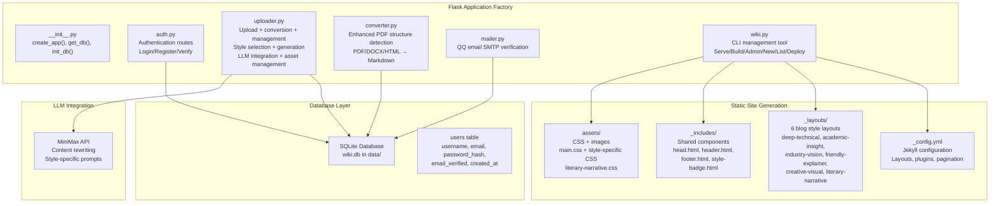
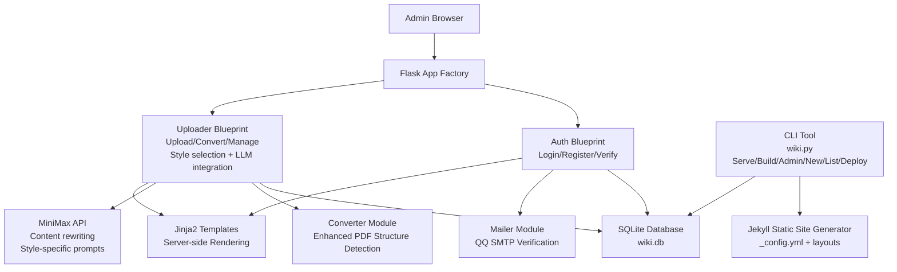
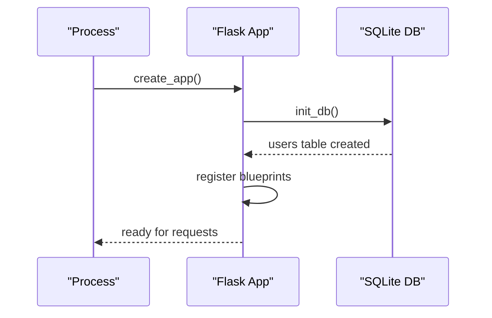
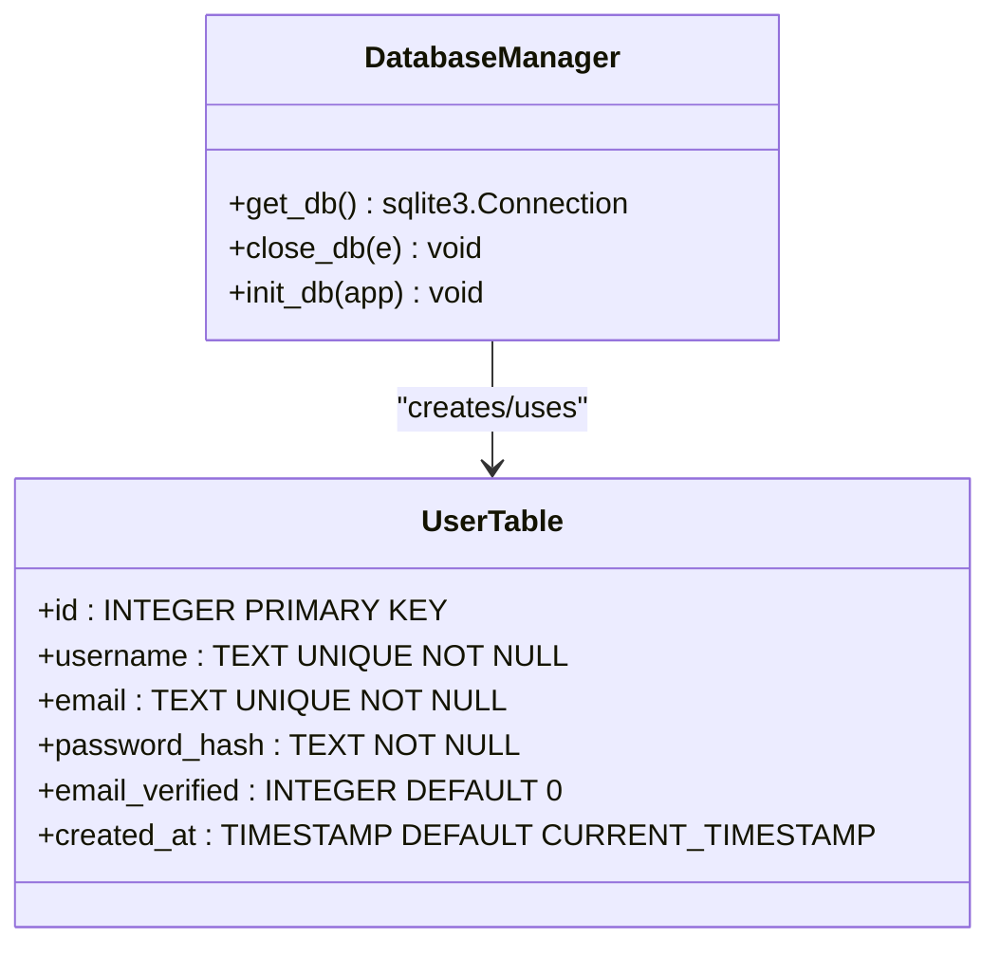
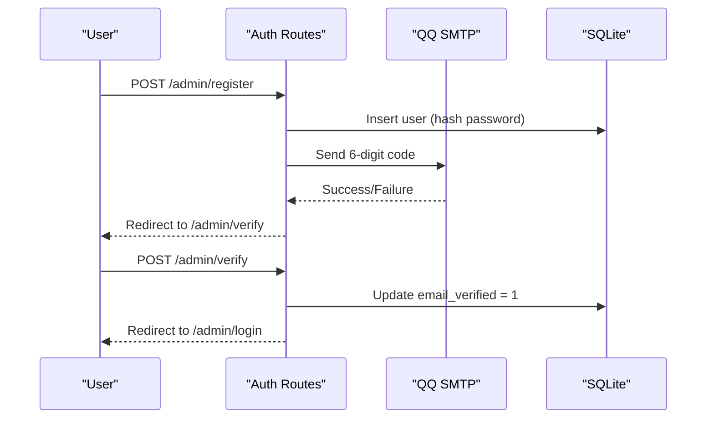
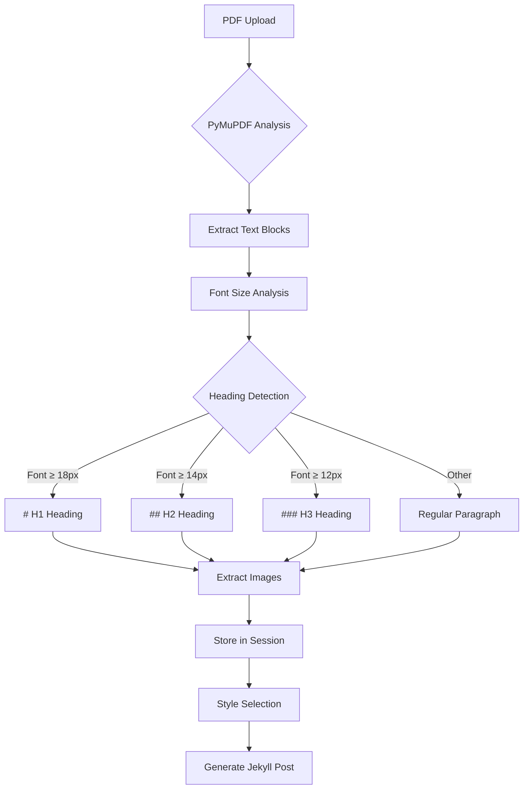
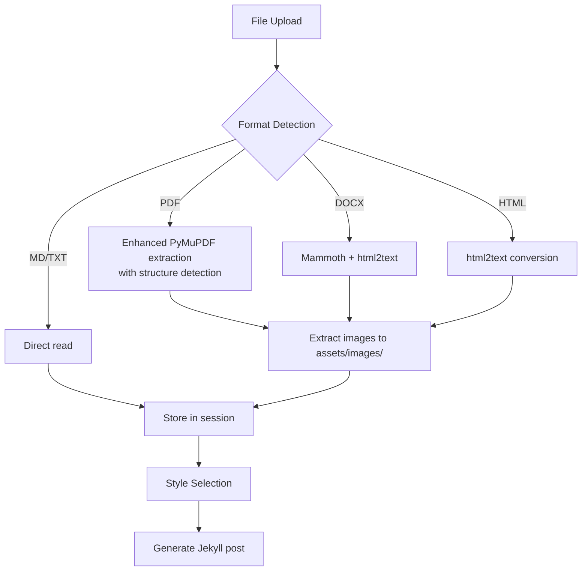
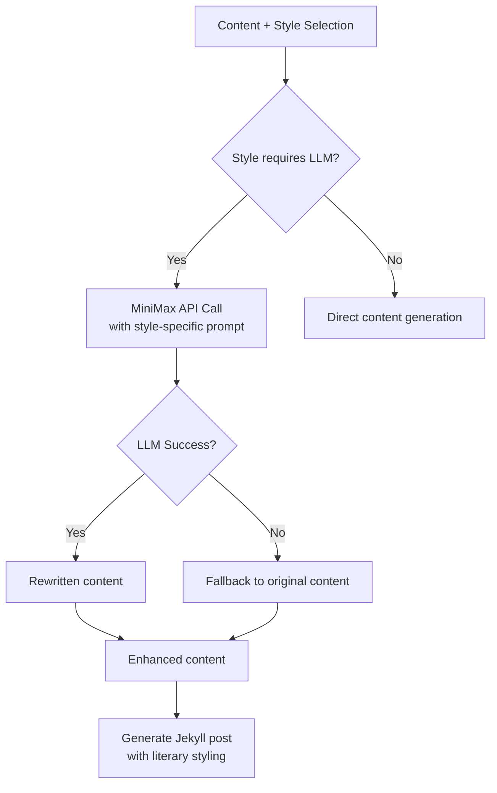
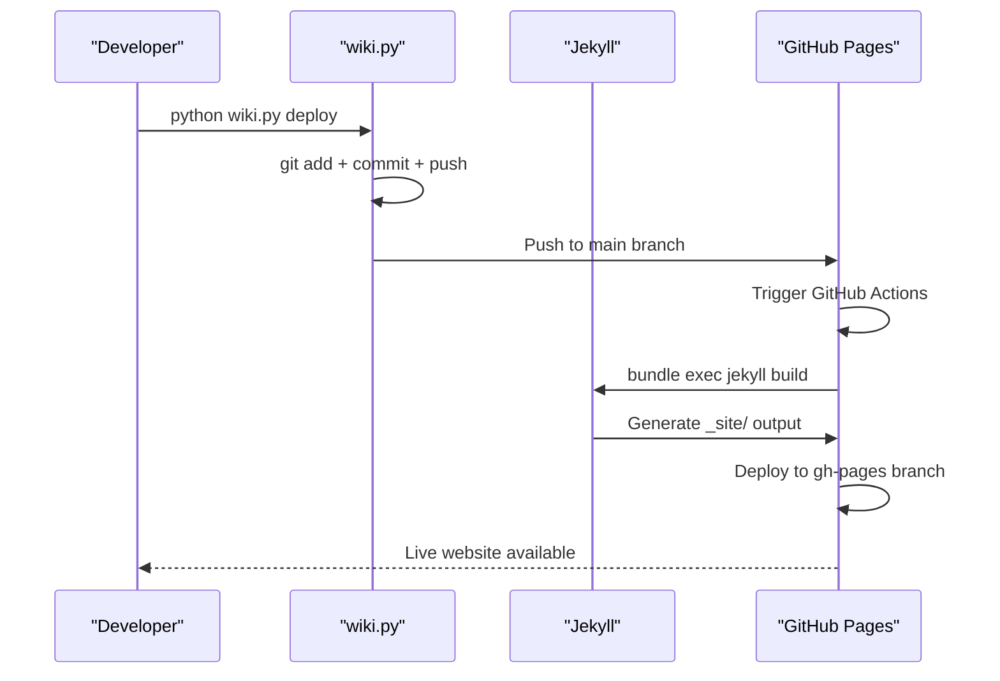

# Backend Application

<cite>
**Referenced Files in This Document**
- [app/__init__.py](file://app/__init__.py)
- [app/auth.py](file://app/auth.py)
- [app/converter.py](file://app/converter.py)
- [app/mailer.py](file://app/mailer.py)
- [app/uploader.py](file://app/uploader.py)
- [app/templates/style_select.html](file://app/templates/style_select.html)
- [app/templates/upload.html](file://app/templates/upload.html)
- [assets/css/literary-narrative.css](file://assets/css/literary-narrative.css)
- [wiki.py](file://wiki.py)
- [PRD.md](file://PRD.md)
- [_config.yml](file://_config.yml)
- [requirements.txt](file://requirements.txt)
- [Gemfile](file://Gemfile)
</cite>

## Update Summary
**Changes Made**
- Updated literary narrative style section to reflect the new "耕烟煮云" style with enhanced CSS styling and LLM integration
- Added documentation for MiniMax API integration and LLM-based content rewriting capabilities
- Enhanced metadata processing section with improved summary generation and reading time estimation
- Updated error handling documentation to include LLM API integration and enhanced fallback mechanisms
- Added new asset management integration documentation for improved file handling
- Updated troubleshooting guide to include MiniMax API configuration and LLM-related issues

## Table of Contents
1. [Introduction](#introduction)
2. [Project Structure](#project_structure)
3. [Core Components](#core_components)
4. [Architecture Overview](#architecture_overview)
5. [Detailed Component Analysis](#detailed_component_analysis)
6. [Deployment and Operations](#deployment_and_operations)
7. [Security Considerations](#security_considerations)
8. [Migration from Previous Architecture](#migration_from_previous_architecture)
9. [Troubleshooting Guide](#troubleshooting_guide)
10. [Conclusion](#conclusion)

## Introduction
This document describes the backend application for PolaZhenJing v2, a lightweight Flask-based management interface for a personal knowledge wiki and blogging platform. The system has been completely redesigned from the previous complex FastAPI architecture to a simplified Flask-based solution with single-user authentication, file upload capabilities, and automatic conversion pipeline. The new architecture focuses on simplicity with integrated SQLite database storage, QQ email verification, and seamless Jekyll static site generation for GitHub Pages deployment.

**Updated** The backend infrastructure has been completely removed, eliminating all FastAPI modules, AI providers, authentication systems, research pipelines, publishing frameworks, sharing mechanisms, tagging systems, and thought management components that existed in the previous architecture. The system now features enhanced literary narrative style support with MiniMax API integration for content rewriting.

## Project Structure
The backend is organized around a Flask application factory pattern that creates a lightweight management interface with integrated authentication, file upload, and conversion capabilities. The system uses SQLite for zero-configuration user storage and implements a file-based workflow for content management. The architecture focuses on simplicity with six main components: authentication, file upload/conversion, content management, LLM integration, literary styling, and CLI operations.

**Diagram sources**
- [app/__init__.py:43-62](file://app/__init__.py#L43-L62)
- [app/auth.py:13-168](file://app/auth.py#L13-L168)
- [app/uploader.py:25-53](file://app/uploader.py#L25-L53)
- [app/converter.py:1-88](file://app/converter.py#L1-L88)
- [app/mailer.py:1-53](file://app/mailer.py#L1-L53)
- [assets/css/literary-narrative.css:1-148](file://assets/css/literary-narrative.css#L1-L148)
- [_config.yml:1-49](file://_config.yml#L1-L49)

**Section sources**
- [app/__init__.py:1-62](file://app/__init__.py#L1-L62)
- [PRD.md:181-234](file://PRD.md#L181-L234)

## Core Components
- **Application factory pattern**: Flask app created with template configuration and registers teardown handlers for database connections
- **Database integration**: SQLite-based user storage with automatic table creation and connection management using Flask's g object pattern
- **Authentication system**: Single-user authentication with QQ email verification using Flask sessions and secure cookies
- **Enhanced file upload pipeline**: Support for multiple formats (PDF, DOCX, HTML, Markdown) with advanced PDF structure detection and automatic conversion to blog-ready Markdown
- **Template rendering**: Jinja2-based server-side rendering for all management interfaces
- **Email verification**: QQ Email SMTP integration for 6-digit verification codes with 5-minute expiration
- **Static site generation**: Jekyll integration for blog post generation with six predefined styles including literary narrative
- **LLM integration**: MiniMax API integration for content rewriting with style-specific prompts and literary narrative enhancement
- **CLI operations**: Comprehensive command-line interface for development, deployment, and content management

**Section sources**
- [app/__init__.py:43-62](file://app/__init__.py#L43-L62)
- [app/auth.py:16-24](file://app/auth.py#L16-L24)
- [app/converter.py:58-88](file://app/converter.py#L58-L88)
- [app/mailer.py:8-53](file://app/mailer.py#L8-L53)
- [app/uploader.py:25-53](file://app/uploader.py#L25-L53)
- [wiki.py:1-165](file://wiki.py#L1-L165)

## Architecture Overview
The backend follows a simplified layered architecture focused on content management and static site generation:
- **Presentation layer**: Flask blueprints with Jinja2 template rendering for admin interface and Jekyll templates for public site
- **Business logic layer**: Authentication flows, file processing with enhanced PDF structure detection, content management operations, LLM-based content rewriting, and CLI command handling
- **Persistence layer**: SQLite database with user management and session-based authentication
- **Integration layer**: QQ Email SMTP for verification, MiniMax API for content rewriting, and Jekyll static site generation for publishing

**Diagram sources**
- [app/__init__.py:43-62](file://app/__init__.py#L43-L62)
- [app/auth.py:13-168](file://app/auth.py#L13-L168)
- [app/uploader.py:126-129](file://app/uploader.py#L126-L129)
- [app/converter.py:1-88](file://app/converter.py#L1-L88)
- [app/mailer.py:1-53](file://app/mailer.py#L1-L53)
- [wiki.py:1-165](file://wiki.py#L1-L165)

## Detailed Component Analysis

### Application Initialization and Lifecycle
- **App factory**: Creates Flask instance with template configuration and registers teardown handlers
- **Database initialization**: Automatic SQLite table creation for user management during app startup
- **Session management**: Flask secret key configuration for secure cookie-based sessions
- **File upload limits**: 16MB maximum content length for document uploads
- **Asset serving**: Dynamic asset serving from project root assets directory

**Diagram sources**
- [app/__init__.py:43-62](file://app/__init__.py#L43-L62)
- [app/__init__.py:26-41](file://app/__init__.py#L26-L41)

**Section sources**
- [app/__init__.py:43-62](file://app/__init__.py#L43-L62)
- [app/__init__.py:26-41](file://app/__init__.py#L26-L41)

### Database Integration
- **SQLite engine**: File-based database stored in `data/wiki.db` with WAL mode enabled for better concurrency
- **Connection management**: Flask's `g` object pattern ensures thread-safe database connections per request
- **User table schema**: Minimal design with unique constraints on username and email, password hash storage, and verification flag
- **Automatic initialization**: Users table created on first app startup if it doesn't exist

**Diagram sources**
- [app/__init__.py:9-41](file://app/__init__.py#L9-L41)
- [PRD.md:264-274](file://PRD.md#L264-L274)

**Section sources**
- [app/__init__.py:9-41](file://app/__init__.py#L9-L41)
- [PRD.md:264-274](file://PRD.md#L264-L274)

### Authentication Module
- **Single-user focus**: Designed for personal use with simplified authentication flow
- **QQ email requirement**: Only @qq.com email addresses accepted for registration
- **Email verification**: 6-digit code sent via QQ Email SMTP with 5-minute expiration
- **Session-based auth**: Flask sessions with secure cookies for user state management
- **Password security**: Werkzeug password hashing for secure credential storage

**Diagram sources**
- [app/auth.py:51-96](file://app/auth.py#L51-L96)
- [app/auth.py:99-133](file://app/auth.py#L99-L133)
- [app/mailer.py:8-53](file://app/mailer.py#L8-L53)

**Section sources**
- [app/auth.py:16-24](file://app/auth.py#L16-L24)
- [app/auth.py:26-48](file://app/auth.py#L26-L48)
- [app/auth.py:51-96](file://app/auth.py#L51-L96)
- [app/auth.py:99-133](file://app/auth.py#L99-L133)
- [app/mailer.py:8-53](file://app/mailer.py#L8-L53)

### Enhanced PDF Conversion Pipeline
**Updated** The PDF conversion pipeline now features advanced structure detection capabilities with sophisticated font analysis and intelligent heading identification.

- **Advanced PDF structure detection**: PyMuPDF-based text extraction with font size analysis for automatic heading detection
- **Intelligent heading classification**: Multi-level heading detection using font size thresholds (≥18px: H1, ≥14px: H2, ≥12px: H3)
- **Bold text detection**: Sub-heading identification through font weight analysis for enhanced document structure
- **Robust error handling**: Graceful fallback mechanisms when conversion libraries are unavailable
- **Image extraction**: Embedded images from PDFs extracted to `assets/images/` directory
- **Title detection**: Automatic title extraction from first heading or content
- **Session-based workflow**: Converted content stored temporarily in Flask session for style selection

**Diagram sources**
- [app/converter.py:7-39](file://app/converter.py#L7-L39)
- [app/uploader.py:123-128](file://app/uploader.py#L123-L128)

**Section sources**
- [app/converter.py:1-108](file://app/converter.py#L1-L108)
- [app/uploader.py:104-147](file://app/uploader.py#L104-L147)

### File Upload and Conversion Pipeline
- **Multi-format support**: PDF, DOCX, HTML, Markdown, and TXT with automatic format detection
- **Conversion library integration**: PyMuPDF for PDF (with enhanced structure detection), mammoth for DOCX, html2text for HTML
- **Image extraction**: Embedded images from PDFs extracted to `assets/images/` directory
- **Title detection**: Automatic title extraction from first heading or content
- **Session-based workflow**: Converted content stored temporarily in Flask session for style selection

**Diagram sources**
- [app/converter.py:78-91](file://app/converter.py#L78-L91)
- [app/uploader.py:123-128](file://app/uploader.py#L123-L128)

**Section sources**
- [app/converter.py:1-108](file://app/converter.py#L1-L108)
- [app/uploader.py:104-147](file://app/uploader.py#L104-L147)

### Literary Narrative Style and LLM Integration
**Updated** The system now features a sophisticated literary narrative style with MiniMax API integration for content rewriting.

- **Literary narrative style**: New "耕烟煮云" (Literary Narrative) style with poetic prose and imagery-driven content
- **MiniMax API integration**: Content rewriting powered by MiniMax LLM with custom prompts for literary enhancement
- **Style-specific prompts**: Custom writing prompts for each style, including literary narrative with Chen Chunsheng inspiration
- **Content rewriting workflow**: Optional LLM-based content enhancement with fallback to original content
- **Enhanced metadata processing**: Improved summary generation and reading time estimation
- **CSS styling**: Dedicated literary narrative CSS with traditional Chinese typography and poetic aesthetics

**Diagram sources**
- [app/uploader.py:126-129](file://app/uploader.py#L126-L129)
- [app/uploader.py:378-387](file://app/uploader.py#L378-L387)
- [assets/css/literary-narrative.css:1-148](file://assets/css/literary-narrative.css#L1-L148)

**Section sources**
- [app/uploader.py:25-53](file://app/uploader.py#L25-L53)
- [app/uploader.py:126-129](file://app/uploader.py#L126-L129)
- [app/uploader.py:378-387](file://app/uploader.py#L378-L387)
- [assets/css/literary-narrative.css:1-148](file://assets/css/literary-narrative.css#L1-L148)

### Content Management Interface
- **Article listing**: Scans `_posts/` directory for Markdown files with YAML front matter parsing
- **Style management**: Six predefined blog styles with color-coded badges and preview functionality
- **Git integration**: One-click synchronization to GitHub with commit/push automation
- **Template system**: Jinja2-based templates for consistent admin interface design
- **Enhanced metadata**: Automatic summary generation and reading time calculation

**Section sources**
- [app/uploader.py:211-215](file://app/uploader.py#L211-L215)
- [app/uploader.py:171-187](file://app/uploader.py#L171-L187)
- [app/uploader.py:190-210](file://app/uploader.py#L190-L210)

### CLI Management Tool
- **Development commands**: Serve Jekyll locally, build static site, run Flask admin server
- **Content operations**: Create new posts, list existing posts, manage content workflow
- **Deployment automation**: Git operations for GitHub Pages publishing
- **Power-user features**: Direct control over all backend operations

**Section sources**
- [wiki.py:1-165](file://wiki.py#L1-L165)

## Deployment and Operations
The system operates through a streamlined deployment pipeline that leverages Jekyll for static site generation and GitHub Pages for hosting:

**Diagram sources**
- [wiki.py:117-130](file://wiki.py#L117-L130)
- [_config.yml:18-23](file://_config.yml#L18-L23)

**Section sources**
- [wiki.py:117-130](file://wiki.py#L117-L130)
- [_config.yml:18-23](file://_config.yml#L18-L23)

## Security Considerations
- **Session security**: Flask secret key configuration for signed cookies
- **Input validation**: Form validation for registration, login, and content submission
- **File restrictions**: Supported formats limited to prevent malicious uploads
- **Email verification**: QQ email requirement adds an extra authentication layer
- **Database security**: SQLite file permissions and connection isolation
- **Environment configuration**: Separate configuration for production vs development
- **LLM API security**: API keys stored in environment variables with fallback to shell sourcing

**Section sources**
- [app/__init__.py:46-47](file://app/__init__.py#L46-L47)
- [app/auth.py:64-67](file://app/auth.py#L64-L67)
- [app/uploader.py:36-36](file://app/uploader.py#L36-L36)
- [app/uploader.py:135-147](file://app/uploader.py#L135-L147)

## Migration from Previous Architecture
The system has undergone complete architectural transformation from the previous FastAPI-based multi-module system to a simplified Flask-based solution:

**Previous Architecture (Removed):**
- FastAPI backend with 7 modules (auth, thoughts, tags, research, ai, publish, sharing)
- PostgreSQL database with Alembic migrations
- React frontend with TypeScript
- Docker Compose with 3 containers
- Complex JWT authentication
- AI provider integrations (OpenAI/Ollama)
- Deep Research SSE pipeline
- Social sharing module
- Vite build toolchain
- MkDocs static site generator

**Current Architecture:**
- Flask application with 4 modules (auth, uploader, converter, mailer)
- SQLite database with zero configuration
- Simplified Jinja2 templates
- Jekyll static site generator
- Single-user authentication
- Enhanced file-based conversion pipeline with PDF structure detection
- Literary narrative style with MiniMax API integration
- GitHub Actions deployment
- CLI management tool

**Section sources**
- [PRD.md:160-180](file://PRD.md#L160-L180)

## Troubleshooting Guide
**Updated** Enhanced troubleshooting guidance for the new PDF conversion capabilities, literary narrative style, and MiniMax API integration.

- **Database issues**: Check `data/wiki.db` file permissions and SQLite availability
- **Email verification**: Verify QQ email credentials and SMTP_SSL configuration
- **PDF conversion errors**: Install PyMuPDF library (`pip install PyMuPDF`) for enhanced PDF structure detection
- **DOCX conversion issues**: Install mammoth library (`pip install mammoth`) for DOCX processing
- **HTML conversion problems**: Install html2text library (`pip install html2text`) for HTML to Markdown conversion
- **Missing conversion libraries**: The system provides clear error messages indicating which libraries need to be installed
- **PDF structure detection failures**: Font size analysis may fail on documents with unusual typography or embedded fonts
- **Session problems**: Ensure Flask secret key is properly configured in environment
- **Upload failures**: Check file size limits and supported format extensions
- **Jekyll build errors**: Verify Ruby environment and gem dependencies
- **GitHub deployment**: Check Git configuration and remote repository setup
- **CLI operations**: Ensure proper Python virtual environment activation
- **MiniMax API issues**: Configure `MINIMAX_TOKEN_PLAN_API_KEY` environment variable or source from shell profile
- **LLM rewriting failures**: Check API connectivity and token validity, fallback to original content
- **Literary narrative style issues**: Verify CSS file loading and style selection in templates

**Section sources**
- [app/__init__.py:12-17](file://app/__init__.py#L12-L17)
- [app/mailer.py:13-18](file://app/mailer.py#L13-L18)
- [app/converter.py:105-108](file://app/converter.py#L105-L108)
- [app/converter.py:7-39](file://app/converter.py#L7-L39)
- [app/uploader.py:135-147](file://app/uploader.py#L135-L147)
- [app/uploader.py:150-191](file://app/uploader.py#L150-L191)
- [wiki.py:117-130](file://wiki.py#L117-L130)

## Conclusion
PolaZhenJing's backend has been successfully transformed from a complex FastAPI architecture to a streamlined Flask-based management interface. The new design emphasizes simplicity with single-user authentication, file upload capabilities, and automatic conversion pipeline with enhanced PDF structure detection. The system maintains security through SQLite storage, QQ email verification, and Flask session management while significantly reducing complexity compared to the previous multi-module FastAPI implementation.

**Updated** The enhanced PDF conversion capabilities now provide sophisticated document structure analysis through font size detection and bold text identification, enabling more accurate heading classification and improved content organization. The robust error handling ensures graceful degradation when conversion libraries are unavailable, maintaining system reliability across different deployment environments. The addition of literary narrative style with MiniMax API integration provides powerful content rewriting capabilities with style-specific prompts, enabling poetic and imagery-driven content generation. This architecture supports the lightweight personal blog wiki requirements with minimal dependencies and zero-configuration database storage, leveraging Jekyll for static site generation and GitHub Pages for hosting.