# Backend Application

<cite>
**Referenced Files in This Document**
- [backend/app/main.py](file://backend/app/main.py)
- [backend/app/config.py](file://backend/app/config.py)
- [backend/app/database.py](file://backend/app/database.py)
- [backend/app/common/middleware.py](file://backend/app/common/middleware.py)
- [backend/app/common/exceptions.py](file://backend/app/common/exceptions.py)
- [backend/app/common/models.py](file://backend/app/common/models.py)
- [backend/app/auth/router.py](file://backend/app/auth/router.py)
- [backend/app/auth/service.py](file://backend/app/auth/service.py)
- [backend/app/thoughts/router.py](file://backend/app/thoughts/router.py)
- [backend/app/thoughts/service.py](file://backend/app/thoughts/service.py)
- [backend/app/tags/router.py](file://backend/app/tags/router.py)
- [backend/app/tags/service.py](file://backend/app/tags/service.py)
- [backend/app/ai/router.py](file://backend/app/ai/router.py)
- [backend/app/ai/factory.py](file://backend/app/ai/factory.py)
- [backend/app/publish/router.py](file://backend/app/publish/router.py)
- [backend/app/sharing/router.py](file://backend/app/sharing/router.py)
</cite>

## Table of Contents
1. [Introduction](#introduction)
2. [Project Structure](#project-structure)
3. [Core Components](#core-components)
4. [Architecture Overview](#architecture-overview)
5. [Detailed Component Analysis](#detailed-component-analysis)
6. [Dependency Analysis](#dependency-analysis)
7. [Performance Considerations](#performance-considerations)
8. [Troubleshooting Guide](#troubleshooting-guide)
9. [Conclusion](#conclusion)

## Introduction
This document describes the backend application for PolaZhenJing, a FastAPI-based AI-powered personal knowledge wiki and sharing platform. It explains the application structure, initialization and configuration management, modular routers for authentication, thoughts, tags, AI integration, publishing, and sharing, the middleware and exception handling systems, database integration, application lifecycle, logging configuration, service-layer architecture, and security considerations including CORS and request processing pipeline.

## Project Structure
The backend is organized around a FastAPI application factory that wires together configuration, middleware, exception handlers, and modular routers. Each functional domain (auth, thoughts, tags, AI, publish, sharing) is implemented as a separate package with its own router, service, models, and schemas. A shared common layer provides middleware, exceptions, and ORM models. Database integration uses SQLAlchemy asynchronous sessions.

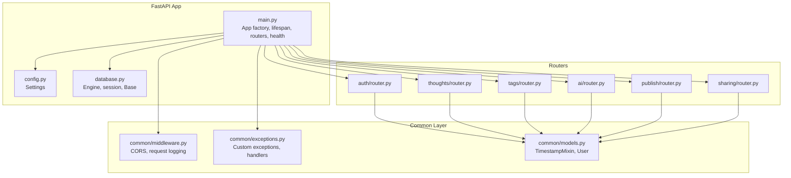

**Diagram sources**
- [backend/app/main.py:1-88](file://backend/app/main.py#L1-L88)
- [backend/app/config.py:1-61](file://backend/app/config.py#L1-L61)
- [backend/app/database.py:1-62](file://backend/app/database.py#L1-L62)
- [backend/app/common/middleware.py:1-59](file://backend/app/common/middleware.py#L1-L59)
- [backend/app/common/exceptions.py:1-87](file://backend/app/common/exceptions.py#L1-L87)
- [backend/app/common/models.py:1-76](file://backend/app/common/models.py#L1-L76)
- [backend/app/auth/router.py:1-91](file://backend/app/auth/router.py#L1-L91)
- [backend/app/thoughts/router.py:1-115](file://backend/app/thoughts/router.py#L1-L115)
- [backend/app/tags/router.py:1-72](file://backend/app/tags/router.py#L1-L72)
- [backend/app/ai/router.py:1-109](file://backend/app/ai/router.py#L1-L109)
- [backend/app/publish/router.py:1-64](file://backend/app/publish/router.py#L1-L64)
- [backend/app/sharing/router.py:1-46](file://backend/app/sharing/router.py#L1-L46)

**Section sources**
- [backend/app/main.py:1-88](file://backend/app/main.py#L1-L88)
- [backend/app/config.py:1-61](file://backend/app/config.py#L1-L61)

## Core Components
- Application factory and lifecycle: The FastAPI app is created with title, version, and lifespan. The lifespan initializes logging and disposes the database engine on shutdown.
- Configuration: Centralized settings via pydantic-settings with environment variable overrides and a .env file.
- Database: Asynchronous SQLAlchemy engine and session factory with a shared declarative Base and a dependency to supply sessions.
- Middleware: CORS configuration and request logging middleware registered at startup.
- Exception handling: Global handlers for custom application exceptions and generic unhandled exceptions.
- Modular routers: Six routers under distinct prefixes for authentication, thoughts, tags, AI, publishing, and sharing.

**Section sources**
- [backend/app/main.py:28-87](file://backend/app/main.py#L28-L87)
- [backend/app/config.py:15-61](file://backend/app/config.py#L15-L61)
- [backend/app/database.py:23-62](file://backend/app/database.py#L23-L62)
- [backend/app/common/middleware.py:22-59](file://backend/app/common/middleware.py#L22-L59)
- [backend/app/common/exceptions.py:66-87](file://backend/app/common/exceptions.py#L66-L87)

## Architecture Overview
The backend follows a layered architecture:
- Presentation layer: FastAPI routers define endpoints and depend on services.
- Service layer: Implements business logic and orchestrates database operations.
- Persistence layer: SQLAlchemy async ORM with a shared Base and session dependency.
- Cross-cutting concerns: Configuration, middleware, exception handling, and logging.

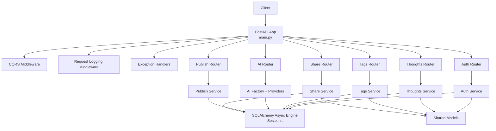

**Diagram sources**
- [backend/app/main.py:39-87](file://backend/app/main.py#L39-L87)
- [backend/app/common/middleware.py:22-59](file://backend/app/common/middleware.py#L22-L59)
- [backend/app/common/exceptions.py:66-87](file://backend/app/common/exceptions.py#L66-L87)
- [backend/app/auth/router.py:1-91](file://backend/app/auth/router.py#L1-L91)
- [backend/app/thoughts/router.py:1-115](file://backend/app/thoughts/router.py#L1-L115)
- [backend/app/tags/router.py:1-72](file://backend/app/tags/router.py#L1-L72)
- [backend/app/ai/router.py:1-109](file://backend/app/ai/router.py#L1-L109)
- [backend/app/publish/router.py:1-64](file://backend/app/publish/router.py#L1-L64)
- [backend/app/sharing/router.py:1-46](file://backend/app/sharing/router.py#L1-L46)
- [backend/app/database.py:23-62](file://backend/app/database.py#L23-L62)
- [backend/app/common/models.py:40-76](file://backend/app/common/models.py#L40-L76)

## Detailed Component Analysis

### Application Initialization and Lifecycle
- App creation: FastAPI is instantiated with metadata and a lifespan manager.
- Lifespan: Logs startup and shutdown messages; disposes the async engine.
- Health endpoint: Lightweight GET /health returning app name, version, and status.

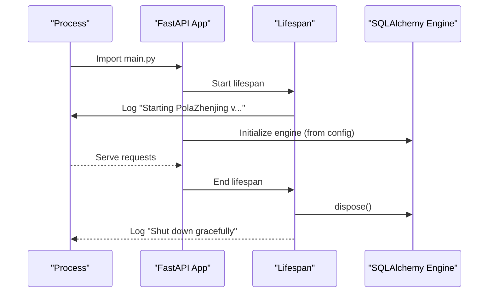

**Diagram sources**
- [backend/app/main.py:28-45](file://backend/app/main.py#L28-L45)
- [backend/app/database.py:23-30](file://backend/app/database.py#L23-L30)

**Section sources**
- [backend/app/main.py:28-87](file://backend/app/main.py#L28-L87)

### Configuration Management
- Centralized settings class loads from a .env file and supports environment overrides.
- Includes application metadata, database URL, JWT settings, AI provider configuration, site/publishing settings, and CORS origins.

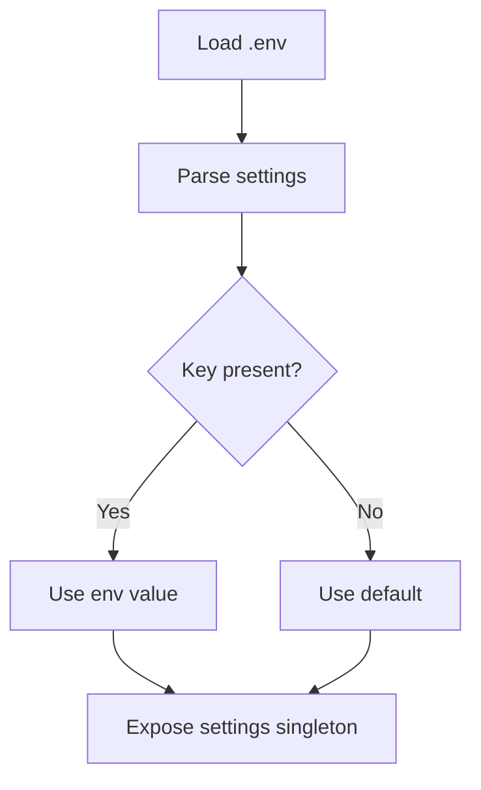

**Diagram sources**
- [backend/app/config.py:23-27](file://backend/app/config.py#L23-L27)

**Section sources**
- [backend/app/config.py:15-61](file://backend/app/config.py#L15-L61)

### Database Integration
- Asynchronous engine configured with debug echo, connection pooling, and pre-ping.
- Session factory bound to the engine; dependency yields sessions and handles commit/rollback.
- Shared declarative Base used by all ORM models.

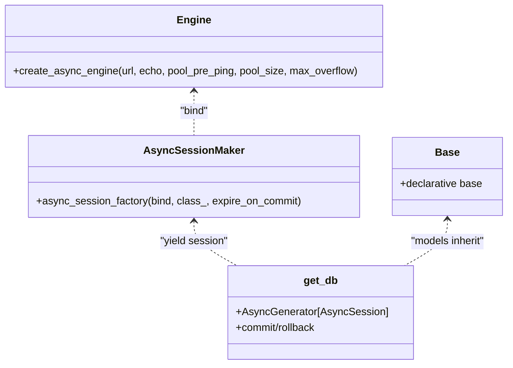

**Diagram sources**
- [backend/app/database.py:23-62](file://backend/app/database.py#L23-L62)

**Section sources**
- [backend/app/database.py:23-62](file://backend/app/database.py#L23-L62)

### Middleware System
- CORS: Configured via settings with allow-all methods and headers and credential support.
- Request logging: HTTP middleware that logs method, path, status code, and elapsed time.

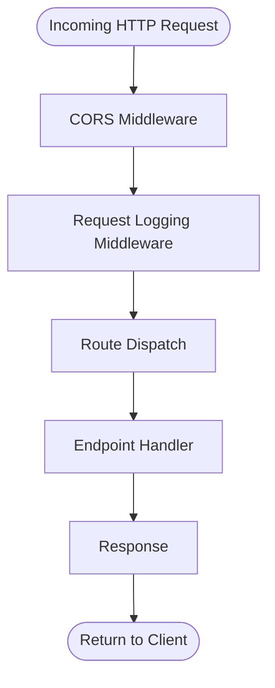

**Diagram sources**
- [backend/app/common/middleware.py:22-59](file://backend/app/common/middleware.py#L22-L59)

**Section sources**
- [backend/app/common/middleware.py:22-59](file://backend/app/common/middleware.py#L22-L59)

### Exception Handling Patterns
- Custom exceptions encapsulate status code and detail for consistent error responses.
- Global handlers convert custom exceptions to JSON with detail and map generic exceptions to a safe internal server error.

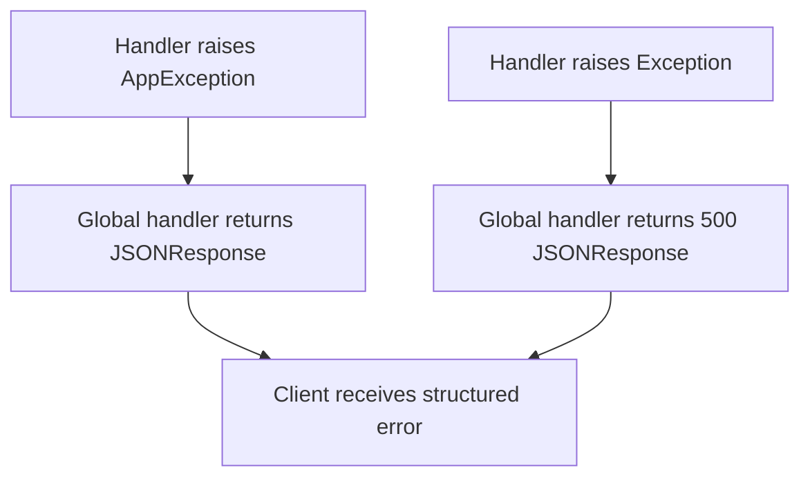

**Diagram sources**
- [backend/app/common/exceptions.py:66-87](file://backend/app/common/exceptions.py#L66-L87)

**Section sources**
- [backend/app/common/exceptions.py:16-87](file://backend/app/common/exceptions.py#L16-L87)

### Authentication Module
- Routers: register, login, refresh, and current user profile retrieval.
- Services: password hashing/verification, JWT token creation/refresh/decoding, user registration and authentication.
- Dependencies: current user extraction for protected endpoints.

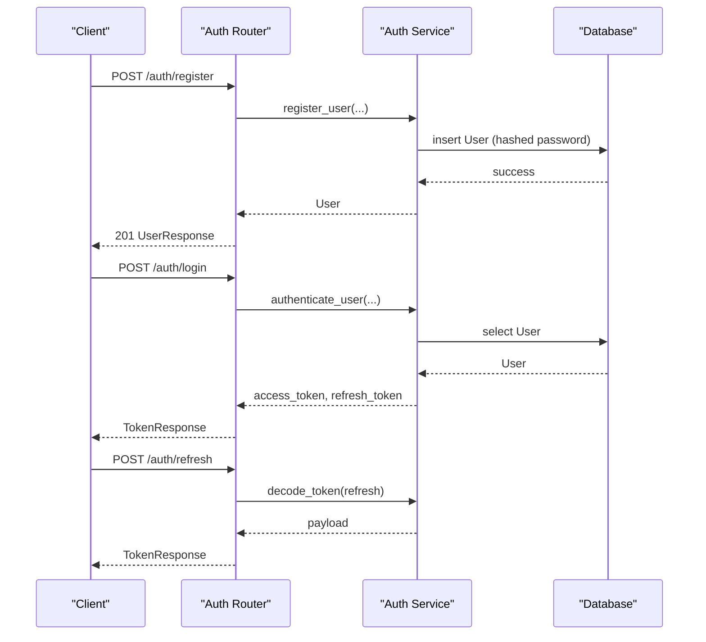

**Diagram sources**
- [backend/app/auth/router.py:37-91](file://backend/app/auth/router.py#L37-L91)
- [backend/app/auth/service.py:91-165](file://backend/app/auth/service.py#L91-L165)

**Section sources**
- [backend/app/auth/router.py:1-91](file://backend/app/auth/router.py#L1-L91)
- [backend/app/auth/service.py:1-165](file://backend/app/auth/service.py#L1-L165)

### Thoughts Module
- Routers: list/create/get/update/delete thoughts with filters and pagination.
- Services: create, read, list with category/tag/status/search filters, update thought fields and tags, delete thought.

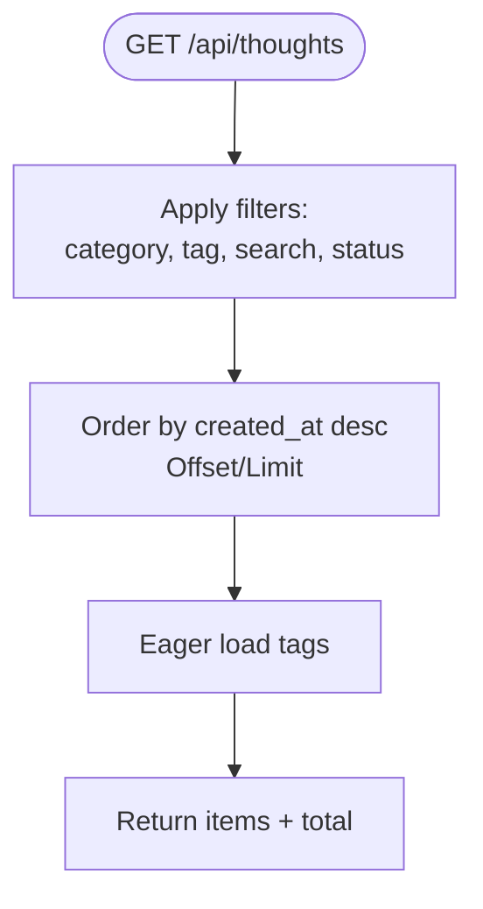

**Diagram sources**
- [backend/app/thoughts/router.py:36-62](file://backend/app/thoughts/router.py#L36-L62)
- [backend/app/thoughts/service.py:81-134](file://backend/app/thoughts/service.py#L81-L134)

**Section sources**
- [backend/app/thoughts/router.py:1-115](file://backend/app/thoughts/router.py#L1-L115)
- [backend/app/thoughts/service.py:1-172](file://backend/app/thoughts/service.py#L1-L172)

### Tags Module
- Routers: list/create/get/update/delete tags; list with usage counts.
- Services: create tag with unique slug, list with count via left join/group by, update tag name/color, delete tag.

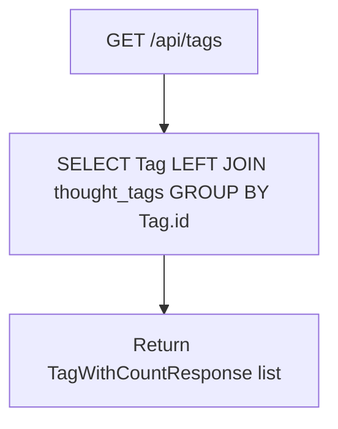

**Diagram sources**
- [backend/app/tags/router.py:31-34](file://backend/app/tags/router.py#L31-L34)
- [backend/app/tags/service.py:57-80](file://backend/app/tags/service.py#L57-L80)

**Section sources**
- [backend/app/tags/router.py:1-72](file://backend/app/tags/router.py#L1-L72)
- [backend/app/tags/service.py:1-102](file://backend/app/tags/service.py#L1-L102)

### AI Integration Module
- Router: endpoints for polish, summarize, suggest-tags, expand thought; depends on AI provider from factory.
- Factory: selects provider based on configuration ("openai" or "ollama"), cached as singleton.

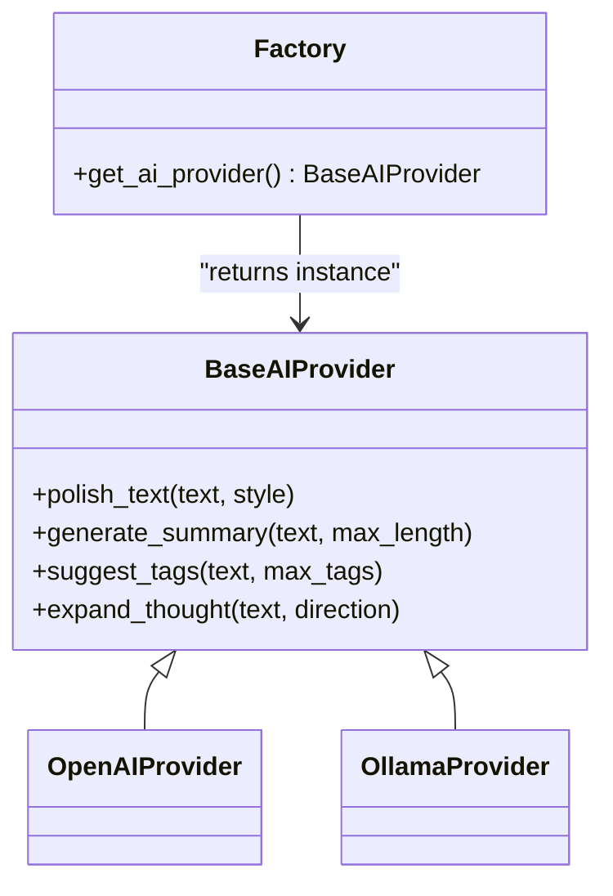

**Diagram sources**
- [backend/app/ai/router.py:1-109](file://backend/app/ai/router.py#L1-L109)
- [backend/app/ai/factory.py:18-44](file://backend/app/ai/factory.py#L18-L44)

**Section sources**
- [backend/app/ai/router.py:1-109](file://backend/app/ai/router.py#L1-L109)
- [backend/app/ai/factory.py:1-44](file://backend/app/ai/factory.py#L1-L44)

### Publishing Module
- Router: publish a single thought to Markdown and trigger a full MkDocs build; returns messages and file paths.

**Section sources**
- [backend/app/publish/router.py:1-64](file://backend/app/publish/router.py#L1-L64)

### Sharing Module
- Router: generate share data (links and Open Graph metadata) for a thought by assembling title, slug, summary, and tag names.

**Section sources**
- [backend/app/sharing/router.py:1-46](file://backend/app/sharing/router.py#L1-L46)

### Security Considerations and CORS
- CORS: Enabled with origins from settings, credentials allowed, wildcard methods and headers.
- JWT: Secret key, algorithm, and expiry configured; tokens used for protected endpoints.
- Request logging: Captures method, path, status, and latency for observability.

**Section sources**
- [backend/app/common/middleware.py:22-36](file://backend/app/common/middleware.py#L22-L36)
- [backend/app/config.py:37-41](file://backend/app/config.py#L37-L41)
- [backend/app/common/middleware.py:40-59](file://backend/app/common/middleware.py#L40-L59)

### Request Processing Pipeline
- Order: CORS → Request Logging → Route Resolution → Endpoint Handler → Response.
- Exceptions: Global handlers convert exceptions to JSON responses.

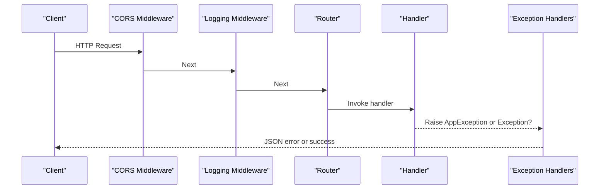

**Diagram sources**
- [backend/app/common/middleware.py:40-59](file://backend/app/common/middleware.py#L40-L59)
- [backend/app/common/exceptions.py:66-87](file://backend/app/common/exceptions.py#L66-L87)

## Dependency Analysis
- Cohesion: Each router/package encapsulates a bounded context (auth, thoughts, tags, AI, publish, share).
- Coupling: Routers depend on services; services depend on database sessions and shared models; AI router depends on factory/provider abstractions.
- External dependencies: FastAPI, Starlette (CORS), SQLAlchemy asyncio, Pydantic, passlib, python-jose, slugify, alembic.

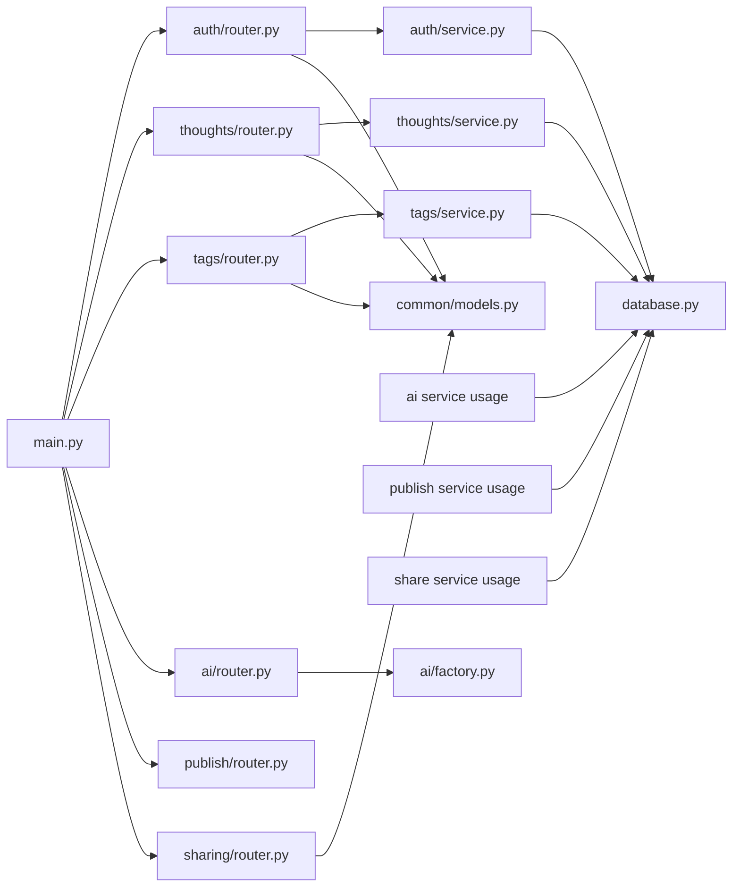

**Diagram sources**
- [backend/app/main.py:58-71](file://backend/app/main.py#L58-L71)
- [backend/app/auth/router.py:1-91](file://backend/app/auth/router.py#L1-L91)
- [backend/app/thoughts/router.py:1-115](file://backend/app/thoughts/router.py#L1-L115)
- [backend/app/tags/router.py:1-72](file://backend/app/tags/router.py#L1-L72)
- [backend/app/ai/router.py:1-109](file://backend/app/ai/router.py#L1-L109)
- [backend/app/publish/router.py:1-64](file://backend/app/publish/router.py#L1-L64)
- [backend/app/sharing/router.py:1-46](file://backend/app/sharing/router.py#L1-L46)
- [backend/app/database.py:23-62](file://backend/app/database.py#L23-L62)
- [backend/app/common/models.py:40-76](file://backend/app/common/models.py#L40-L76)

**Section sources**
- [backend/app/main.py:58-71](file://backend/app/main.py#L58-L71)

## Performance Considerations
- Asynchronous database: Uses SQLAlchemy asyncio to avoid blocking I/O.
- Connection pooling: Configured pool size and overflow to handle concurrent requests.
- Pagination and eager loading: Thought listing uses pagination and selectinload to reduce N+1 queries.
- Caching: AI provider is cached as a singleton to avoid repeated instantiation.
- Logging overhead: Request logging measures latency; keep enabled in production for observability.

[No sources needed since this section provides general guidance]

## Troubleshooting Guide
- Health check: Use GET /health to verify application availability and version.
- CORS errors: Verify allowed origins match the frontend origin.
- Authentication failures: Check JWT secret, algorithm, and expiry settings; ensure user is active.
- Database connectivity: Confirm DATABASE_URL and pool settings; enable DEBUG to see SQL logs.
- AI provider errors: Ensure AI_PROVIDER is set to supported values and provider endpoints are reachable.

**Section sources**
- [backend/app/main.py:74-87](file://backend/app/main.py#L74-L87)
- [backend/app/common/middleware.py:22-36](file://backend/app/common/middleware.py#L22-L36)
- [backend/app/config.py:37-57](file://backend/app/config.py#L37-L57)
- [backend/app/database.py:23-30](file://backend/app/database.py#L23-L30)

## Conclusion
PolaZhenJing’s backend is a modular, layered FastAPI application with centralized configuration, robust middleware and exception handling, and a clean separation between routers and services. It integrates asynchronously with PostgreSQL, enforces security via CORS and JWT, and exposes focused APIs for authentication, thought management, tagging, AI assistance, publishing, and sharing. The architecture supports scalability and maintainability while keeping cross-cutting concerns explicit and configurable.