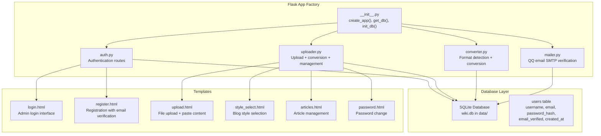
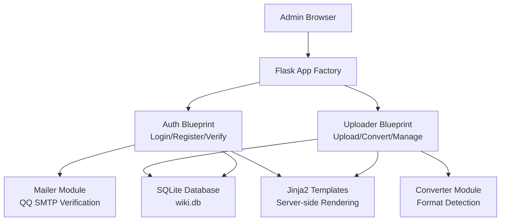
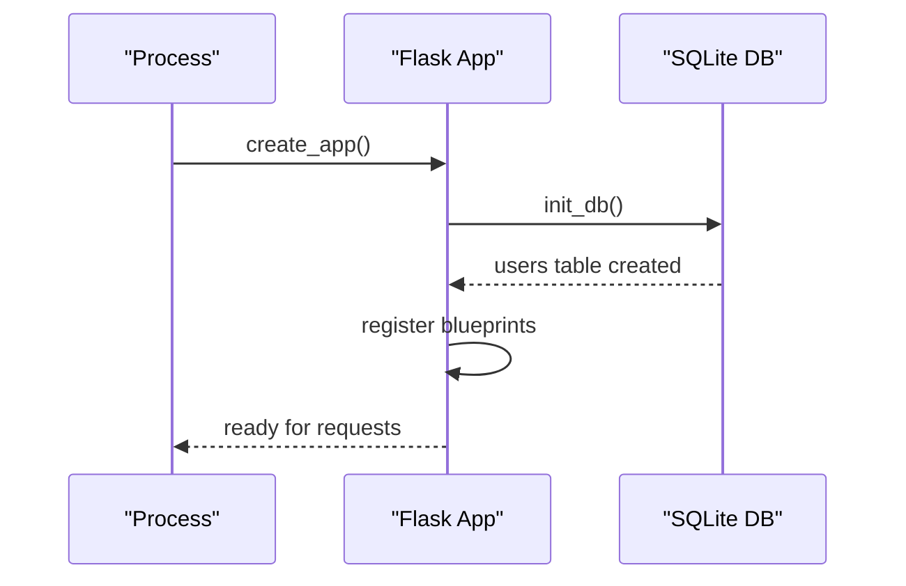
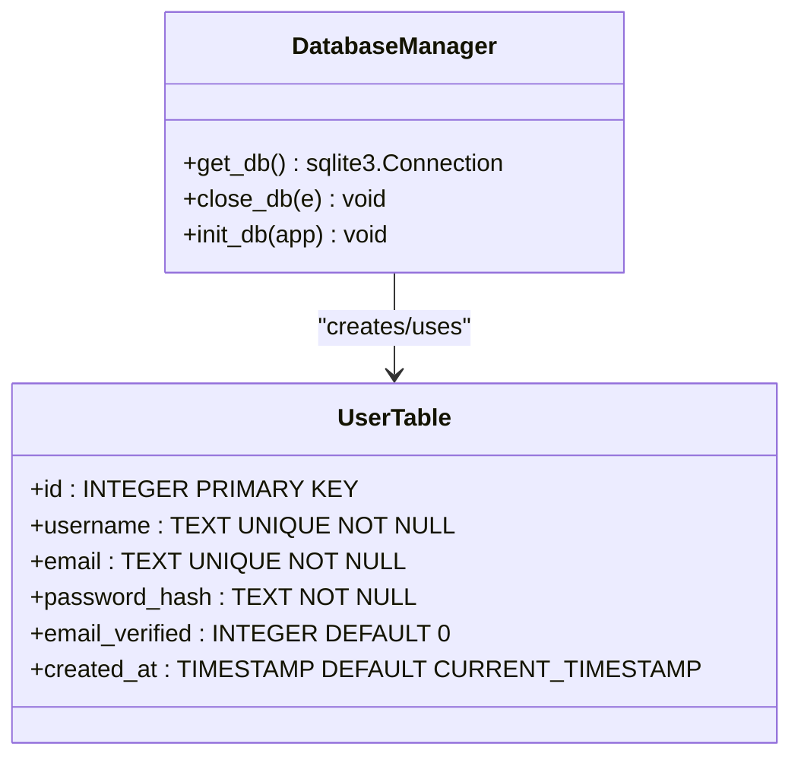
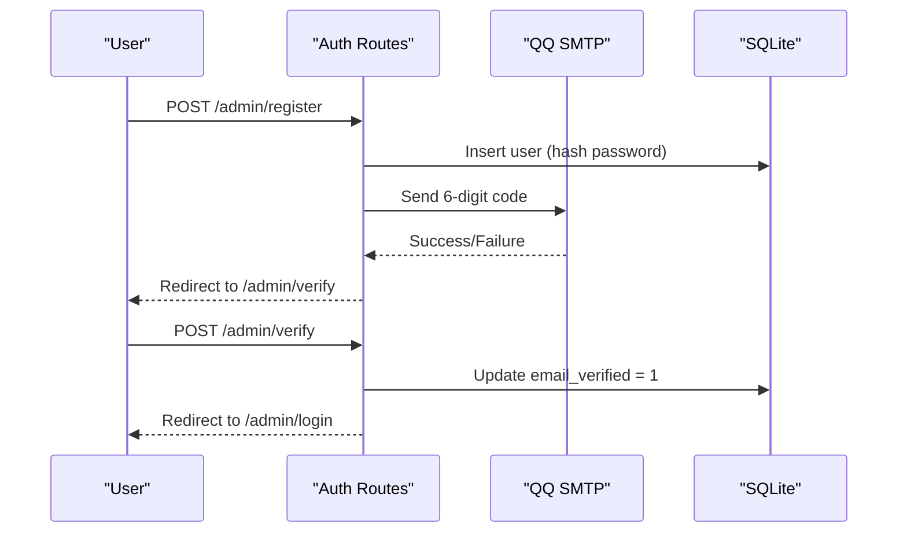
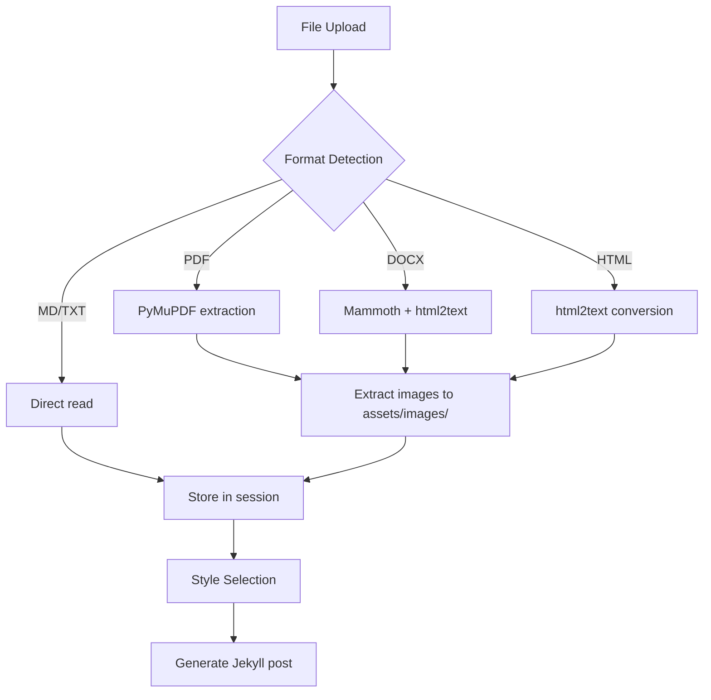
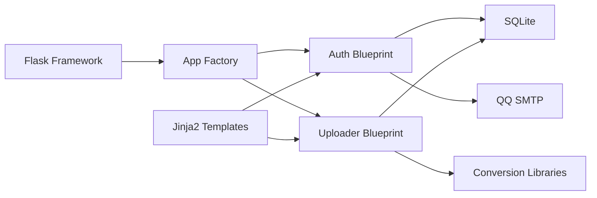

# Backend Application

<cite>
**Referenced Files in This Document**
- [app/__init__.py](file://app/__init__.py)
- [app/auth.py](file://app/auth.py)
- [app/converter.py](file://app/converter.py)
- [app/mailer.py](file://app/mailer.py)
- [app/uploader.py](file://app/uploader.py)
- [PRD.md](file://PRD.md)
</cite>

## Update Summary
**Changes Made**
- Completely rewritten architecture documentation to reflect Flask-based management interface
- Removed FastAPI, JWT authentication, and complex routing structure
- Added new Flask application factory with SQLite database integration
- Documented single-user authentication system with QQ email verification
- Added file upload and conversion pipeline documentation
- Updated middleware and exception handling to Flask session-based approach
- Revised security considerations for Flask session cookies and SQLite storage

## Table of Contents
1. [Introduction](#introduction)
2. [Project Structure](#project-structure)
3. [Core Components](#core-components)
4. [Architecture Overview](#architecture-overview)
5. [Detailed Component Analysis](#detailed-component-analysis)
6. [Dependency Analysis](#dependency-analysis)
7. [Performance Considerations](#performance-considerations)
8. [Troubleshooting Guide](#troubleshooting-guide)
9. [Conclusion](#conclusion)

## Introduction
This document describes the backend application for PolaZhenJing, a Flask-based management interface for a lightweight personal knowledge wiki and blogging platform. The system has been redesigned from a complex FastAPI architecture to a simplified Flask-based solution with single-user authentication, file upload capabilities, and automatic conversion pipeline. It explains the Flask application factory pattern, SQLite database integration, authentication flows using QQ email verification, file conversion pipeline for multiple document formats, and the streamlined request processing pipeline.

## Project Structure
The backend is now organized around a Flask application factory pattern that creates a lightweight management interface with integrated authentication, file upload, and conversion capabilities. The system uses SQLite for zero-configuration user storage and implements a file-based workflow for content management. The architecture focuses on simplicity with three main components: authentication, file upload/conversion, and content management.

**Diagram sources**
- [app/__init__.py:43-62](file://app/__init__.py#L43-L62)
- [app/auth.py:13-168](file://app/auth.py#L13-L168)
- [app/uploader.py:14-210](file://app/uploader.py#L14-L210)
- [app/converter.py:1-88](file://app/converter.py#L1-88)
- [app/mailer.py:1-53](file://app/mailer.py#L1-L53)

**Section sources**
- [app/__init__.py:1-62](file://app/__init__.py#L1-L62)
- [PRD.md:181-234](file://PRD.md#L181-L234)

## Core Components
- **Application factory pattern**: Flask app created with template and static folder configuration, secret key, and maximum content length settings
- **Database integration**: SQLite-based user storage with automatic table creation and connection management using Flask's g object pattern
- **Authentication system**: Single-user authentication with QQ email verification using Flask sessions and secure cookies
- **File upload pipeline**: Support for multiple formats (PDF, DOCX, HTML, Markdown) with automatic conversion to blog-ready Markdown
- **Template rendering**: Jinja2-based server-side rendering for all management interfaces
- **Email verification**: QQ Email SMTP integration for 6-digit verification codes with 5-minute expiration

**Section sources**
- [app/__init__.py:43-62](file://app/__init__.py#L43-L62)
- [app/auth.py:16-24](file://app/auth.py#L16-L24)
- [app/converter.py:58-88](file://app/converter.py#L58-L88)
- [app/mailer.py:8-53](file://app/mailer.py#L8-L53)

## Architecture Overview
The backend follows a simplified layered architecture focused on content management:
- **Presentation layer**: Flask blueprints with Jinja2 template rendering for admin interface
- **Business logic layer**: Authentication flows, file processing, and content management operations
- **Persistence layer**: SQLite database with user management and session-based authentication
- **Integration layer**: QQ Email SMTP for verification and file conversion library integration

**Diagram sources**
- [app/__init__.py:43-62](file://app/__init__.py#L43-L62)
- [app/auth.py:13-168](file://app/auth.py#L13-L168)
- [app/uploader.py:14-210](file://app/uploader.py#L14-L210)
- [app/converter.py:1-88](file://app/converter.py#L1-L88)
- [app/mailer.py:1-53](file://app/mailer.py#L1-L53)

## Detailed Component Analysis

### Application Initialization and Lifecycle
- **App factory**: Creates Flask instance with template configuration and registers teardown handlers
- **Database initialization**: Automatic SQLite table creation for user management during app startup
- **Session management**: Flask secret key configuration for secure cookie-based sessions
- **File upload limits**: 16MB maximum content length for document uploads

**Diagram sources**
- [app/__init__.py:43-62](file://app/__init__.py#L43-L62)
- [app/__init__.py:26-41](file://app/__init__.py#L26-L41)

**Section sources**
- [app/__init__.py:43-62](file://app/__init__.py#L43-L62)
- [app/__init__.py:26-41](file://app/__init__.py#L26-L41)

### Database Integration
- **SQLite engine**: File-based database stored in `data/wiki.db` with WAL mode enabled for better concurrency
- **Connection management**: Flask's `g` object pattern ensures thread-safe database connections per request
- **User table schema**: Minimal design with unique constraints on username and email, password hash storage, and verification flag
- **Automatic initialization**: Users table created on first app startup if it doesn't exist

**Diagram sources**
- [app/__init__.py:9-41](file://app/__init__.py#L9-L41)
- [PRD.md:264-274](file://PRD.md#L264-L274)

**Section sources**
- [app/__init__.py:9-41](file://app/__init__.py#L9-L41)
- [PRD.md:264-274](file://PRD.md#L264-L274)

### Authentication Module
- **Single-user focus**: Designed for personal use with simplified authentication flow
- **QQ email requirement**: Only @qq.com email addresses accepted for registration
- **Email verification**: 6-digit code sent via QQ Email SMTP with 5-minute expiration
- **Session-based auth**: Flask sessions with secure cookies for user state management
- **Password security**: Werkzeug password hashing for secure credential storage

**Diagram sources**
- [app/auth.py:51-96](file://app/auth.py#L51-L96)
- [app/auth.py:99-133](file://app/auth.py#L99-L133)
- [app/mailer.py:8-53](file://app/mailer.py#L8-L53)

**Section sources**
- [app/auth.py:16-24](file://app/auth.py#L16-L24)
- [app/auth.py:26-48](file://app/auth.py#L26-L48)
- [app/auth.py:51-96](file://app/auth.py#L51-L96)
- [app/auth.py:99-133](file://app/auth.py#L99-L133)
- [app/mailer.py:8-53](file://app/mailer.py#L8-L53)

### File Upload and Conversion Pipeline
- **Multi-format support**: PDF, DOCX, HTML, Markdown, and TXT with automatic format detection
- **Conversion library integration**: PyMuPDF for PDF, mammoth for DOCX, html2text for HTML
- **Image extraction**: Embedded images from PDFs extracted to `assets/images/` directory
- **Title detection**: Automatic title extraction from first heading or content
- **Session-based workflow**: Converted content stored temporarily in Flask session for style selection

**Diagram sources**
- [app/converter.py:58-88](file://app/converter.py#L58-L88)
- [app/uploader.py:76-118](file://app/uploader.py#L76-L118)

**Section sources**
- [app/converter.py:1-88](file://app/converter.py#L1-L88)
- [app/uploader.py:76-118](file://app/uploader.py#L76-L118)

### Content Management Interface
- **Article listing**: Scans `_posts/` directory for Markdown files with YAML front matter parsing
- **Style management**: Five predefined blog styles with color-coded badges and preview functionality
- **Git integration**: One-click synchronization to GitHub with commit/push automation
- **Template system**: Jinja2-based templates for consistent admin interface design

**Section sources**
- [app/uploader.py:49-73](file://app/uploader.py#L49-L73)
- [app/uploader.py:171-187](file://app/uploader.py#L171-L187)
- [app/uploader.py:190-210](file://app/uploader.py#L190-L210)

### Security Considerations
- **Session security**: Flask secret key configuration for signed cookies
- **Input validation**: Form validation for registration, login, and content submission
- **File restrictions**: Supported formats limited to prevent malicious uploads
- **Email verification**: QQ email requirement adds an extra authentication layer
- **Database security**: SQLite file permissions and connection isolation

**Section sources**
- [app/__init__.py:46-47](file://app/__init__.py#L46-L47)
- [app/auth.py:64-67](file://app/auth.py#L64-L67)
- [app/uploader.py:31-31](file://app/uploader.py#L31-L31)

## Dependency Analysis
- **Flask ecosystem**: Core Flask framework with Jinja2 templating and Werkzeug utilities
- **Database layer**: SQLite with standard library, no external ORM dependencies
- **Conversion libraries**: Optional third-party libraries for enhanced file processing
- **Email service**: QQ Email SMTP for verification code delivery
- **Minimal external dependencies**: Focused on core functionality without complex integrations

**Diagram sources**
- [app/__init__.py:43-62](file://app/__init__.py#L43-L62)
- [app/auth.py:13-168](file://app/auth.py#L13-L168)
- [app/uploader.py:14-210](file://app/uploader.py#L14-L210)

**Section sources**
- [app/__init__.py:43-62](file://app/__init__.py#L43-L62)

## Performance Considerations
- **SQLite optimization**: WAL mode enabled for improved concurrent access
- **Memory efficiency**: File-based processing avoids keeping large documents in memory
- **Lazy loading**: Database connections created per request and closed automatically
- **Conversion performance**: Optional libraries only loaded when needed for enhanced formats
- **Static file serving**: Minimal static assets with efficient image handling

## Troubleshooting Guide
- **Database issues**: Check `data/wiki.db` file permissions and SQLite availability
- **Email verification**: Verify QQ email credentials and SMTP_SSL configuration
- **File conversion**: Install optional libraries (PyMuPDF, mammoth, html2text) for enhanced format support
- **Session problems**: Ensure Flask secret key is properly configured in environment
- **Upload failures**: Check file size limits and supported format extensions

**Section sources**
- [app/__init__.py:12-17](file://app/__init__.py#L12-L17)
- [app/mailer.py:13-18](file://app/mailer.py#L13-L18)
- [app/converter.py:85-88](file://app/converter.py#L85-L88)

## Conclusion
PolaZhenJing's backend has been successfully transformed from a complex FastAPI architecture to a streamlined Flask-based management interface. The new design emphasizes simplicity with single-user authentication, file upload capabilities, and automatic conversion pipeline. The system maintains security through SQLite storage, QQ email verification, and Flask session management while significantly reducing complexity compared to the previous multi-module FastAPI implementation. This architecture supports the lightweight personal blog wiki requirements with minimal dependencies and zero-configuration database storage.