# Backend Application

<cite>
**Referenced Files in This Document**
- [app/__init__.py](file://app/__init__.py)
- [app/auth.py](file://app/auth.py)
- [app/converter.py](file://app/converter.py)
- [app/mailer.py](file://app/mailer.py)
- [app/uploader.py](file://app/uploader.py)
- [app/jobs.py](file://app/jobs.py)
- [app/agent.py](file://app/agent.py)
- [app/skillhub.py](file://app/skillhub.py)
- [app/templates/status.html](file://app/templates/status.html)
- [app/templates/articles.html](file://app/templates/articles.html)
- [app/templates/base.html](file://app/templates/base.html)
- [app/templates/style_select.html](file://app/templates/style_select.html)
- [app/templates/upload.html](file://app/templates/upload.html)
- [assets/css/literary-narrative.css](file://assets/css/literary-narrative.css)
- [wiki.py](file://wiki.py)
- [PRD.md](file://PRD.md)
- [_config.yml](file://_config.yml)
- [requirements.txt](file://requirements.txt)
- [Gemfile](file://Gemfile)
</cite>

## Update Summary
**Changes Made**
- Added comprehensive asynchronous job processing infrastructure documentation
- Enhanced application initialization section to include automatic job schema setup
- Updated content conversion pipeline documentation to reflect improved job integration
- Added new sections covering job queue management, background processing, and real-time status monitoring
- Enhanced troubleshooting guide with job processing and database schema migration information

## Table of Contents
1. [Introduction](#introduction)
2. [Project Structure](#project_structure)
3. [Core Components](#core_components)
4. [Architecture Overview](#architecture_overview)
5. [Detailed Component Analysis](#detailed_component_analysis)
6. [Deployment and Operations](#deployment_and_operations)
7. [Security Considerations](#security_considerations)
8. [Migration from Previous Architecture](#migration_from_previous_architecture)
9. [Troubleshooting Guide](#troubleshooting_guide)
10. [Conclusion](#conclusion)

## Introduction
This document describes the backend application for PolaZhenJing v2, a Flask-based management interface for a personal knowledge wiki and blogging platform. The system features a comprehensive asynchronous job processing infrastructure with SQLite-backed job queues, enhanced application initialization with automatic schema management, and improved content conversion pipeline. The architecture focuses on simplicity with integrated SQLite database storage, QQ email verification, and seamless Jekyll static site generation for GitHub Pages deployment.

**Updated** The backend now includes a complete asynchronous job processing system that manages long-running tasks such as LLM article generation, content rewriting, and media processing. The job queue uses SQLite for cross-worker state management and provides real-time progress monitoring through dedicated status endpoints and HTML templates.

## Project Structure
The backend is organized around a Flask application factory pattern that creates a lightweight management interface with integrated authentication, file upload, conversion capabilities, and asynchronous job processing. The system uses SQLite for zero-configuration user storage and implements a file-based workflow for content management. The architecture focuses on simplicity with seven main components: authentication, file upload/conversion, content management, job processing, LLM integration, literary styling, and CLI operations.

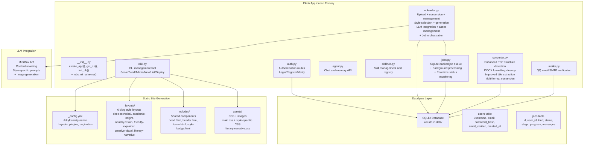
```mermaid
graph TB
subgraph "Flask Application Factory"
APP["__init__.py<br/>create_app(), get_db(), init_db()<br/>+ jobs.init_schema()"]
AUTH["auth.py<br/>Authentication routes<br/>Login/Register/Verify"]
UP["uploader.py<br/>Upload + conversion + management<br/>Style selection + generation<br/>LLM integration + asset management<br/>+ Job orchestration"]
JOBS["jobs.py<br/>SQLite-backed job queue<br/>+ Background processing<br/>+ Real-time status monitoring"]
AGENT["agent.py<br/>Chat and memory API"]
SKILLHUB["skillhub.py<br/>Skill management and registry"]
CONV["converter.py<br/>Enhanced PDF structure detection<br/>DOCX formatting cleanup<br/>Improved title extraction<br/>Multi-format conversion"]
MAIL["mailer.py<br/>QQ email SMTP verification"]
CLI["wiki.py<br/>CLI management tool<br/>Serve/Build/Admin/New/List/Deploy"]
end
subgraph "Database Layer"
SQLITE["SQLite Database<br/>wiki.db in data/"]
USERS["users table<br/>username, email, password_hash,<br/>email_verified, created_at"]
JOBS_TABLE["jobs table<br/>id, user_id, kind, status,<br/>stage, progress, messages"]
end
subgraph "Static Site Generation"
JEKYLL["_config.yml<br/>Jekyll configuration<br/>Layouts, plugins, pagination"]
LAYOUTS["_layouts/<br/>6 blog style layouts<br/>deep-technical, academic-insight,<br/>industry-vision, friendly-explainer,<br/>creative-visual, literary-narrative"]
INCLUDES["_includes/<br/>Shared components<br/>head.html, header.html,<br/>footer.html, style-badge.html"]
ASSETS["assets/<br/>CSS + images<br/>main.css + style-specific CSS<br/>literary-narrative.css"]
end
subgraph "LLM Integration"
MINIMAX["MiniMax API<br/>Content rewriting<br/>Style-specific prompts<br/>+ Image generation"]
end
AUTH --> SQLITE
UP --> SQLITE
UP --> JOBS
JOBS --> SQLITE
CONV --> SQLITE
MAIL --> SQLITE
CLI --> JEKYLL
CLI --> LAYOUTS
CLI --> INCLUDES
CLI --> ASSETS
UP --> MINIMAX
```

**Diagram sources**
- [app/__init__.py:69-113](file://app/__init__.py#L69-L113)
- [app/jobs.py:1-188](file://app/jobs.py#L1-L188)
- [app/uploader.py:1126-1165](file://app/uploader.py#L1126-L1165)
- [app/auth.py:13-168](file://app/auth.py#L13-L168)
- [app/converter.py:1-145](file://app/converter.py#L1-L145)
- [app/mailer.py:1-53](file://app/mailer.py#L1-L53)
- [assets/css/literary-narrative.css:1-148](file://assets/css/literary-narrative.css#L1-L148)
- [_config.yml:1-49](file://_config.yml#L1-L49)

**Section sources**
- [app/__init__.py:1-113](file://app/__init__.py#L1-L113)
- [PRD.md:181-234](file://PRD.md#L181-L234)

## Core Components
- **Application factory pattern**: Flask app created with template configuration and registers teardown handlers for database connections
- **Database integration**: SQLite-based user storage with automatic table creation and connection management using Flask's g object pattern
- **Job processing infrastructure**: Complete asynchronous job queue system with SQLite-backed state management, background thread execution, and real-time progress monitoring
- **Authentication system**: Single-user authentication with QQ email verification using Flask sessions and secure cookies
- **Enhanced file upload pipeline**: Support for multiple formats (PDF, DOCX, HTML, Markdown) with advanced PDF structure detection, DOCX formatting cleanup, and automatic conversion to blog-ready Markdown
- **Template rendering**: Jinja2-based server-side rendering for all management interfaces including job status monitoring
- **Email verification**: QQ Email SMTP integration for 6-digit verification codes with 5-minute expiration
- **Static site generation**: Jekyll integration for blog post generation with six predefined styles including literary narrative
- **LLM integration**: MiniMax API integration for content rewriting with style-specific prompts and literary narrative enhancement
- **CLI operations**: Comprehensive command-line interface for development, deployment, and content management

**Section sources**
- [app/__init__.py:69-113](file://app/__init__.py#L69-L113)
- [app/jobs.py:1-188](file://app/jobs.py#L1-L188)
- [app/auth.py:16-24](file://app/auth.py#L16-L24)
- [app/converter.py:58-145](file://app/converter.py#L58-L145)
- [app/mailer.py:8-53](file://app/mailer.py#L8-L53)
- [app/uploader.py:25-53](file://app/uploader.py#L25-L53)
- [wiki.py:1-165](file://wiki.py#L1-L165)

## Architecture Overview
The backend follows a layered architecture focused on content management, asynchronous job processing, and static site generation:
- **Presentation layer**: Flask blueprints with Jinja2 template rendering for admin interface, job status monitoring, and Jekyll templates for public site
- **Business logic layer**: Authentication flows, file processing with enhanced PDF structure detection and DOCX formatting cleanup, content management operations, LLM-based content rewriting, job orchestration, and CLI command handling
- **Job processing layer**: SQLite-backed job queue with background thread execution, real-time progress monitoring, and cross-worker state management
- **Persistence layer**: SQLite database with user management, job state tracking, and session-based authentication
- **Integration layer**: QQ Email SMTP for verification, MiniMax API for content rewriting and image generation, and Jekyll static site generation for publishing

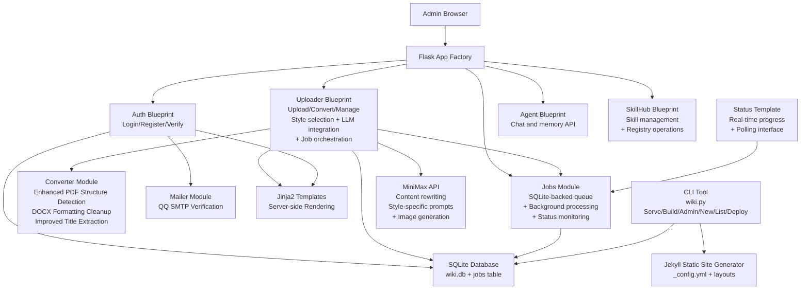
```mermaid
graph TB
CLIENT["Admin Browser"]
FLASK["Flask App Factory"]
AUTH["Auth Blueprint<br/>Login/Register/Verify"]
UPLOAD["Uploader Blueprint<br/>Upload/Convert/Manage<br/>Style selection + LLM integration<br/>+ Job orchestration"]
JOBS["Jobs Module<br/>SQLite-backed queue<br/>+ Background processing<br/>+ Status monitoring"]
STATUS["Status Template<br/>Real-time progress<br/>+ Polling interface"]
AGENT["Agent Blueprint<br/>Chat and memory API"]
SKILLHUB["SkillHub Blueprint<br/>Skill management<br/>+ Registry operations"]
CONV["Converter Module<br/>Enhanced PDF Structure Detection<br/>DOCX Formatting Cleanup<br/>Improved Title Extraction"]
MAIL["Mailer Module<br/>QQ SMTP Verification"]
DB["SQLite Database<br/>wiki.db + jobs table"]
TEMPLATES["Jinja2 Templates<br/>Server-side Rendering"]
CLI["CLI Tool<br/>wiki.py<br/>Serve/Build/Admin/New/List/Deploy"]
JEKYLL["Jekyll Static Site Generator<br/>_config.yml + layouts"]
MINIMAX["MiniMax API<br/>Content rewriting<br/>Style-specific prompts<br/>+ Image generation"]
CLIENT --> FLASK
FLASK --> AUTH
FLASK --> UPLOAD
FLASK --> JOBS
FLASK --> AGENT
FLASK --> SKILLHUB
AUTH --> DB
UPLOAD --> DB
UPLOAD --> JOBS
UPLOAD --> CONV
UPLOAD --> MINIMAX
JOBS --> DB
STATUS --> JOBS
AUTH --> MAIL
UPLOAD --> TEMPLATES
AUTH --> TEMPLATES
CLI --> JEKYLL
CLI --> DB
```

**Diagram sources**
- [app/__init__.py:69-113](file://app/__init__.py#L69-L113)
- [app/jobs.py:163-188](file://app/jobs.py#L163-L188)
- [app/uploader.py:1299-1326](file://app/uploader.py#L1299-L1326)
- [app/auth.py:13-168](file://app/auth.py#L13-L168)
- [app/converter.py:1-145](file://app/converter.py#L1-L145)
- [app/mailer.py:1-53](file://app/mailer.py#L1-L53)
- [app/templates/status.html:1-127](file://app/templates/status.html#L1-L127)
- [wiki.py:1-165](file://wiki.py#L1-L165)

## Detailed Component Analysis

### Application Initialization and Lifecycle
- **App factory**: Creates Flask instance with template configuration and registers teardown handlers
- **Database initialization**: Automatic SQLite table creation for user management during app startup
- **Job schema initialization**: Automatic creation of jobs table with migration support for schema evolution
- **Session management**: Flask secret key configuration for secure cookie-based sessions
- **File upload limits**: 16MB maximum content length for document uploads
- **Asset serving**: Dynamic asset serving from project root assets directory

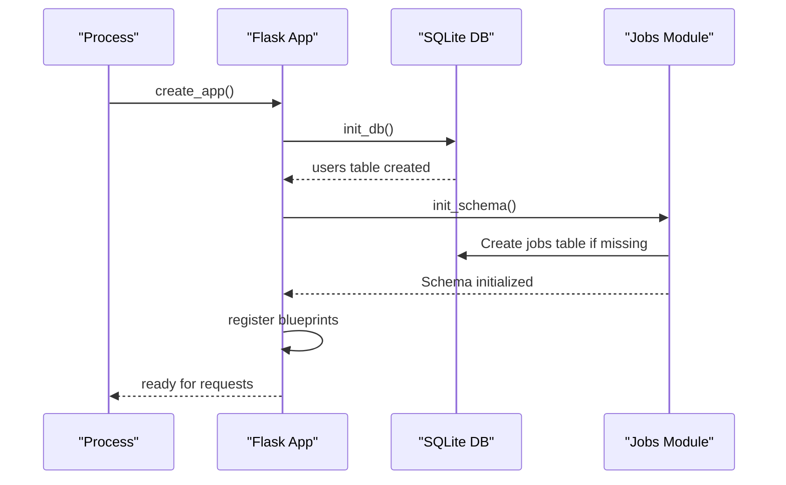
```mermaid
sequenceDiagram
participant Proc as "Process"
participant App as "Flask App"
participant DB as "SQLite DB"
participant Jobs as "Jobs Module"
Proc->>App : create_app()
App->>DB : init_db()
DB-->>App : users table created
App->>Jobs : init_schema()
Jobs->>DB : Create jobs table if missing
Jobs-->>App : Schema initialized
App->>App : register blueprints
App-->>Proc : ready for requests
```

**Diagram sources**
- [app/__init__.py:69-113](file://app/__init__.py#L69-L113)
- [app/__init__.py:43-62](file://app/__init__.py#L43-L62)
- [app/jobs.py:50-69](file://app/jobs.py#L50-L69)

**Section sources**
- [app/__init__.py:69-113](file://app/__init__.py#L69-L113)
- [app/__init__.py:43-62](file://app/__init__.py#L43-L62)
- [app/jobs.py:50-69](file://app/jobs.py#L50-L69)

### Database Integration
- **SQLite engine**: File-based database stored in `data/wiki.db` with WAL mode enabled for better concurrency
- **Connection management**: Flask's `g` object pattern ensures thread-safe database connections per request
- **User table schema**: Minimal design with unique constraints on username and email, password hash storage, and verification flag
- **Job table schema**: Complete job queue infrastructure with status tracking, progress monitoring, and cross-worker state management
- **Automatic initialization**: Users table created on first app startup if it doesn't exist, jobs table automatically migrated

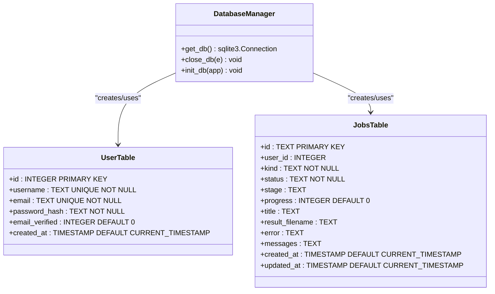
```mermaid
classDiagram
class DatabaseManager {
+get_db() sqlite3.Connection
+close_db(e) void
+init_db(app) void
}
class UserTable {
+id : INTEGER PRIMARY KEY
+username : TEXT UNIQUE NOT NULL
+email : TEXT UNIQUE NOT NULL
+password_hash : TEXT NOT NULL
+email_verified : INTEGER DEFAULT 0
+created_at : TIMESTAMP DEFAULT CURRENT_TIMESTAMP
}
class JobsTable {
+id : TEXT PRIMARY KEY
+user_id : INTEGER
+kind : TEXT NOT NULL
+status : TEXT NOT NULL
+stage : TEXT
+progress : INTEGER DEFAULT 0
+title : TEXT
+result_filename : TEXT
+error : TEXT
+messages : TEXT
+created_at : TIMESTAMP DEFAULT CURRENT_TIMESTAMP
+updated_at : TIMESTAMP DEFAULT CURRENT_TIMESTAMP
}
DatabaseManager --> UserTable : "creates/uses"
DatabaseManager --> JobsTable : "creates/uses"
```

**Diagram sources**
- [app/__init__.py:26-67](file://app/__init__.py#L26-L67)
- [app/jobs.py:32-47](file://app/jobs.py#L32-L47)
- [PRD.md:264-274](file://PRD.md#L264-L274)

**Section sources**
- [app/__init__.py:26-67](file://app/__init__.py#L26-L67)
- [app/jobs.py:32-47](file://app/jobs.py#L32-L47)
- [PRD.md:264-274](file://PRD.md#L264-L274)

### Asynchronous Job Processing Infrastructure
**New** The system now includes a complete asynchronous job processing infrastructure with SQLite-backed job queue management.

- **SQLite-backed job queue**: Centralized job state management allowing multiple workers to track progress and status
- **Background thread execution**: Daemon threads handle long-running tasks without blocking the main request-response cycle
- **Job lifecycle management**: Complete job states from pending through running to completion or failure
- **Progress tracking**: Real-time progress updates with stage descriptions and percentage completion
- **Message logging**: Structured message system for job events, warnings, and informational updates
- **Error handling**: Automatic error capture and reporting with stack trace preservation
- **Schema evolution**: Idempotent schema migrations supporting column additions and version upgrades
- **Cross-worker coordination**: Shared state accessible across multiple Gunicorn workers for status monitoring

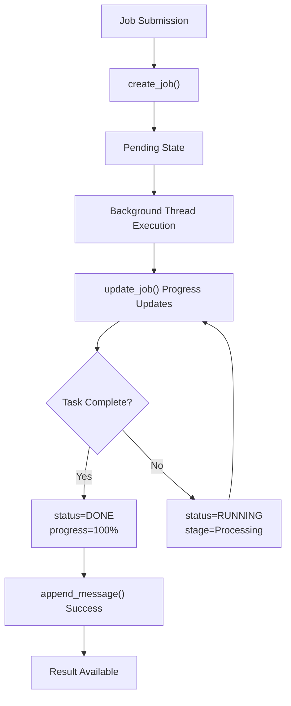
```mermaid
flowchart TD
A["Job Submission"] --> B["create_job()"]
B --> C["Pending State"]
C --> D["Background Thread Execution"]
D --> E["update_job() Progress Updates"]
E --> F{"Task Complete?"}
F --> |Yes| G["status=DONE<br/>progress=100%"]
F --> |No| H["status=RUNNING<br/>stage=Processing"]
H --> E
G --> I["append_message() Success"]
I --> J["Result Available"]
```

**Diagram sources**
- [app/jobs.py:79-111](file://app/jobs.py#L79-L111)
- [app/jobs.py:163-188](file://app/jobs.py#L163-L188)

**Section sources**
- [app/jobs.py:1-188](file://app/jobs.py#L1-L188)

### Job Queue Management and Background Processing
**New** Comprehensive job queue management system with real-time monitoring and status reporting.

- **Job creation**: UUID-based job identifiers with automatic pending state initialization
- **State transitions**: Controlled progression from pending → running → done | failed
- **Progress updates**: Structured progress tracking with stage descriptions and percentage completion
- **Message system**: JSON-encoded message logs with level-based categorization (info, success, warning, error)
- **Background execution**: Daemon threads handle long-running tasks independently of request contexts
- **Error recovery**: Automatic exception handling with detailed error reporting and status updates
- **Status polling**: RESTful endpoints for real-time progress monitoring and status queries
- **Active job tracking**: Efficient querying of in-progress jobs for administrative displays

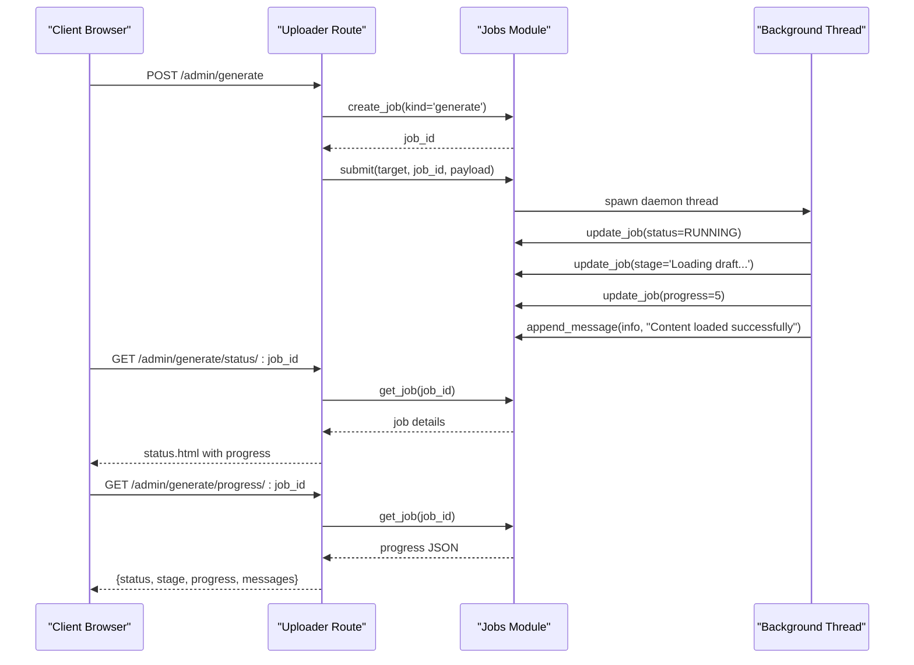
```mermaid
sequenceDiagram
participant Client as "Client Browser"
participant Uploader as "Uploader Route"
participant Jobs as "Jobs Module"
participant Worker as "Background Thread"
Client->>Uploader : POST /admin/generate
Uploader->>Jobs : create_job(kind='generate')
Jobs-->>Uploader : job_id
Uploader->>Jobs : submit(target, job_id, payload)
Jobs->>Worker : spawn daemon thread
Worker->>Jobs : update_job(status=RUNNING)
Worker->>Jobs : update_job(stage='Loading draft...')
Worker->>Jobs : update_job(progress=5)
Worker->>Jobs : append_message(info, "Content loaded successfully")
Client->>Uploader : GET /admin/generate/status/ : job_id
Uploader->>Jobs : get_job(job_id)
Jobs-->>Uploader : job details
Uploader-->>Client : status.html with progress
Client->>Uploader : GET /admin/generate/progress/ : job_id
Uploader->>Jobs : get_job(job_id)
Jobs-->>Uploader : progress JSON
Uploader-->>Client : {status, stage, progress, messages}
```

**Diagram sources**
- [app/uploader.py:1126-1165](file://app/uploader.py#L1126-L1165)
- [app/uploader.py:1299-1326](file://app/uploader.py#L1299-L1326)
- [app/jobs.py:163-188](file://app/jobs.py#L163-L188)

**Section sources**
- [app/uploader.py:1126-1165](file://app/uploader.py#L1126-L1165)
- [app/uploader.py:1299-1326](file://app/uploader.py#L1299-L1326)
- [app/jobs.py:163-188](file://app/jobs.py#L163-L188)

### Real-Time Job Status Monitoring
**New** Sophisticated real-time status monitoring system with progressive web interface.

- **Status page template**: Dedicated HTML interface with animated progress bars and real-time updates
- **Polling mechanism**: JavaScript-based polling every 2 seconds with exponential backoff for transient errors
- **Progress visualization**: Animated progress bar with percentage display and elapsed time tracking
- **Message display**: Inline flash messages for job events, warnings, and informational updates
- **Action buttons**: Contextual buttons for viewing articles or retrying failed jobs
- **Auto-refresh**: Automatic page refresh for active jobs to keep status current
- **Error handling**: Graceful handling of job not found scenarios and network errors

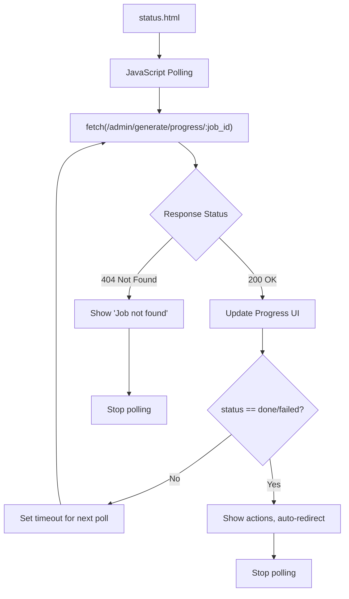
```mermaid
flowchart TD
A["status.html"] --> B["JavaScript Polling"]
B --> C["fetch(/admin/generate/progress/:job_id)"]
C --> D{"Response Status"}
D --> |200 OK| E["Update Progress UI"]
D --> |404 Not Found| F["Show 'Job not found'"]
E --> G{"status == done/failed?"}
G --> |No| H["Set timeout for next poll"]
G --> |Yes| I["Show actions, auto-redirect"]
F --> J["Stop polling"]
H --> C
I --> K["Stop polling"]
```

**Diagram sources**
- [app/templates/status.html:40-127](file://app/templates/status.html#L40-L127)

**Section sources**
- [app/templates/status.html:1-127](file://app/templates/status.html#L1-L127)
- [app/templates/articles.html:31-63](file://app/templates/articles.html#L31-L63)

### Authentication Module
- **Single-user focus**: Designed for personal use with simplified authentication flow
- **QQ email requirement**: Only @qq.com email addresses accepted for registration
- **Email verification**: 6-digit code sent via QQ Email SMTP with 5-minute expiration
- **Session-based auth**: Flask sessions with secure cookies for user state management
- **Password security**: Werkzeug password hashing for secure credential storage

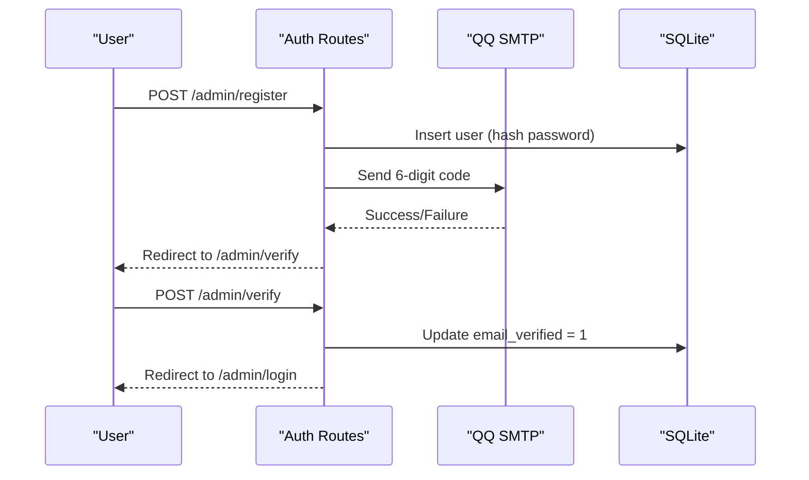
```mermaid
sequenceDiagram
participant User as "User"
participant Auth as "Auth Routes"
participant Mail as "QQ SMTP"
participant DB as "SQLite"
User->>Auth : POST /admin/register
Auth->>DB : Insert user (hash password)
Auth->>Mail : Send 6-digit code
Mail-->>Auth : Success/Failure
Auth-->>User : Redirect to /admin/verify
User->>Auth : POST /admin/verify
Auth->>DB : Update email_verified = 1
Auth-->>User : Redirect to /admin/login
```

**Diagram sources**
- [app/auth.py:51-96](file://app/auth.py#L51-L96)
- [app/auth.py:99-133](file://app/auth.py#L99-L133)
- [app/mailer.py:8-53](file://app/mailer.py#L8-L53)

**Section sources**
- [app/auth.py:16-24](file://app/auth.py#L16-L24)
- [app/auth.py:26-48](file://app/auth.py#L26-L48)
- [app/auth.py:51-96](file://app/auth.py#L51-L96)
- [app/auth.py:99-133](file://app/auth.py#L99-L133)
- [app/mailer.py:8-53](file://app/mailer.py#L8-L53)

### Enhanced Document Conversion Pipeline
**Updated** The document conversion pipeline now integrates seamlessly with the job processing system for long-running conversions.

- **Advanced PDF structure detection**: PyMuPDF-based text extraction with font size analysis for automatic heading detection
- **Intelligent heading classification**: Multi-level heading detection using font size thresholds (≥18px: H1, ≥14px: H2, ≥12px: H3)
- **Bold text detection**: Sub-heading identification through font weight analysis for enhanced document structure
- **DOCX formatting cleanup**: Sophisticated markdown formatting cleanup to remove excessive bold/italic wrappers from Word documents
- **Enhanced title extraction**: Improved title detection with markdown formatting removal and CJK/latin character truncation
- **Robust error handling**: Graceful fallback mechanisms when conversion libraries are unavailable
- **Image extraction**: Embedded images from PDFs extracted to `assets/images/` directory
- **Session-based workflow**: Converted content stored temporarily in Flask session for style selection
- **Job integration**: Long-running conversions can be tracked through the job queue system

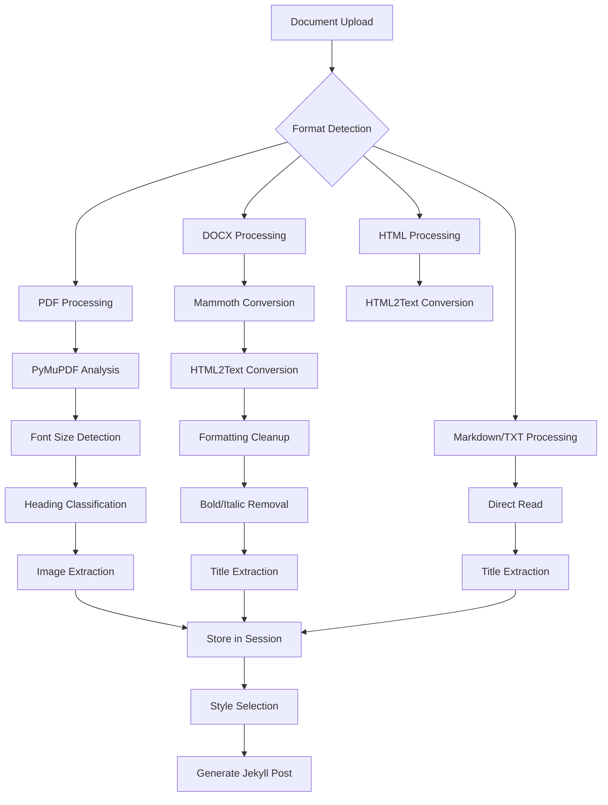
```mermaid
flowchart TD
A["Document Upload"] --> B{"Format Detection"}
B --> C["PDF Processing"]
B --> D["DOCX Processing"]
B --> E["HTML Processing"]
B --> F["Markdown/TXT Processing"]
C --> G["PyMuPDF Analysis"]
G --> H["Font Size Detection"]
H --> I["Heading Classification"]
I --> J["Image Extraction"]
D --> K["Mammoth Conversion"]
K --> L["HTML2Text Conversion"]
L --> M["Formatting Cleanup"]
M --> N["Bold/Italic Removal"]
N --> O["Title Extraction"]
E --> P["HTML2Text Conversion"]
F --> Q["Direct Read"]
Q --> R["Title Extraction"]
J --> S["Store in Session"]
O --> S
R --> S
S --> T["Style Selection"]
T --> U["Generate Jekyll Post"]
```

**Diagram sources**
- [app/converter.py:7-39](file://app/converter.py#L7-L39)
- [app/converter.py:58-76](file://app/converter.py#L58-L76)
- [app/converter.py:112-140](file://app/converter.py#L112-L140)
- [app/uploader.py:123-128](file://app/uploader.py#L123-L128)

**Section sources**
- [app/converter.py:1-145](file://app/converter.py#L1-L145)
- [app/uploader.py:104-147](file://app/uploader.py#L104-L147)

### DOCX Formatting Cleanup and Title Extraction
**New** The system now includes sophisticated DOCX formatting cleanup and enhanced title extraction functionality.

- **DOCX formatting cleanup**: Advanced markdown formatting cleanup removes excessive bold/italic wrappers that commonly appear when Word documents use bold+italic styling throughout
- **Pattern recognition**: Removes patterns like `**_text_**` or `** _text_ **` that result from Word's combined formatting
- **Standalone wrapper removal**: Strips standalone bold wrappers like `**text**` that can appear in converted content
- **Whitespace normalization**: Cleans up leftover double spaces and normalizes whitespace
- **Enhanced title extraction**: Improved title detection algorithm that strips markdown formatting and truncates appropriately for CJK and latin characters
- **Sentence boundary detection**: Smart truncation at first sentence boundary within 20 characters for optimal readability
- **Fallback handling**: Graceful fallback to 'Untitled' when no title can be detected

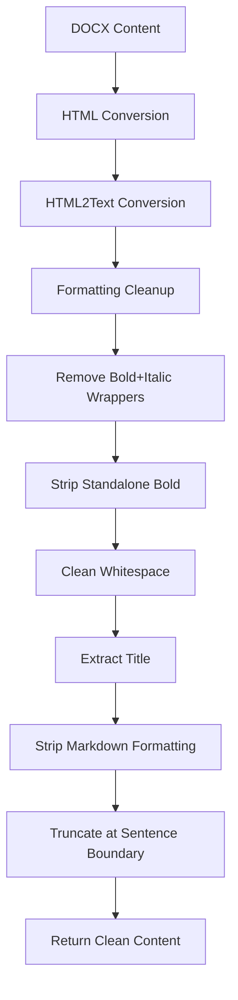
```mermaid
flowchart TD
A["DOCX Content"] --> B["HTML Conversion"]
B --> C["HTML2Text Conversion"]
C --> D["Formatting Cleanup"]
D --> E["Remove Bold+Italic Wrappers"]
E --> F["Strip Standalone Bold"]
F --> G["Clean Whitespace"]
G --> H["Extract Title"]
H --> I["Strip Markdown Formatting"]
I --> J["Truncate at Sentence Boundary"]
J --> K["Return Clean Content"]
```

**Diagram sources**
- [app/converter.py:42-55](file://app/converter.py#L42-L55)
- [app/converter.py:112-140](file://app/converter.py#L112-L140)

**Section sources**
- [app/converter.py:42-55](file://app/converter.py#L42-L55)
- [app/converter.py:112-140](file://app/converter.py#L112-L140)

### File Upload and Conversion Pipeline
- **Multi-format support**: PDF, DOCX, HTML, Markdown, and TXT with automatic format detection
- **Conversion library integration**: PyMuPDF for PDF (with enhanced structure detection), mammoth for DOCX, html2text for HTML
- **Image extraction**: Embedded images from PDFs extracted to `assets/images/` directory
- **Title detection**: Automatic title extraction from first heading or content with enhanced formatting cleanup
- **Session-based workflow**: Converted content stored temporarily in Flask session for style selection
- **Job orchestration**: Long-running conversion tasks can be submitted to the job queue for background processing

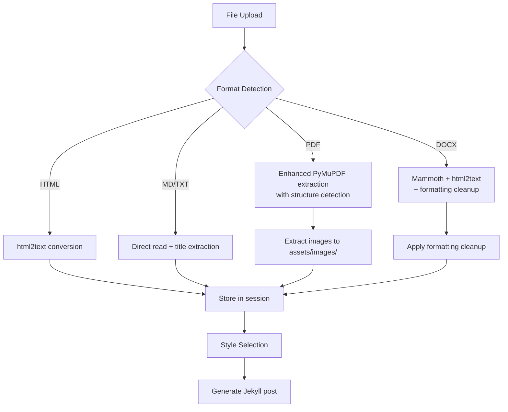
```mermaid
flowchart TD
A["File Upload"] --> B{"Format Detection"}
B --> |PDF| C["Enhanced PyMuPDF extraction<br/>with structure detection"]
B --> |DOCX| D["Mammoth + html2text<br/>+ formatting cleanup"]
B --> |HTML| E["html2text conversion"]
B --> |MD/TXT| F["Direct read + title extraction"]
C --> G["Extract images to assets/images/"]
D --> H["Apply formatting cleanup"]
E --> I["Store in session"]
F --> I
G --> I
H --> I
I --> J["Style Selection"]
J --> K["Generate Jekyll post"]
```

**Diagram sources**
- [app/converter.py:78-109](file://app/converter.py#L78-L109)
- [app/uploader.py:123-128](file://app/uploader.py#L123-L128)

**Section sources**
- [app/converter.py:1-145](file://app/converter.py#L1-L145)
- [app/uploader.py:104-147](file://app/uploader.py#L104-L147)

### Literary Narrative Style and LLM Integration
**Updated** The system now features a sophisticated literary narrative style with MiniMax API integration for content rewriting, seamlessly integrated with the job processing system.

- **Literary narrative style**: New "耕烟煮云" (Literary Narrative) style with poetic prose and imagery-driven content
- **MiniMax API integration**: Content rewriting powered by MiniMax LLM with custom prompts for literary enhancement
- **Style-specific prompts**: Custom writing prompts for each style, including literary narrative with Chen Chunsheng inspiration
- **Content rewriting workflow**: Optional LLM-based content enhancement with fallback to original content
- **Enhanced metadata processing**: Improved summary generation and reading time estimation
- **CSS styling**: Dedicated literary narrative CSS with traditional Chinese typography and poetic aesthetics
- **Job integration**: LLM rewriting tasks are executed asynchronously through the job queue system

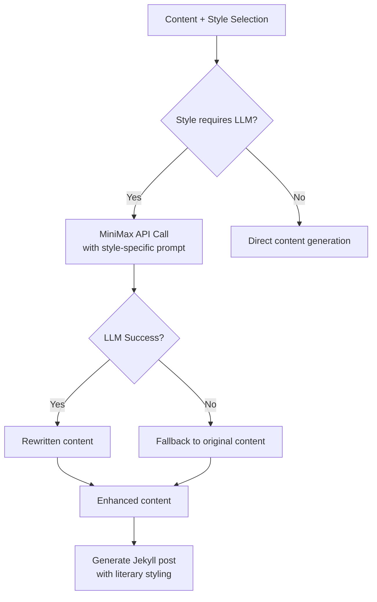
```mermaid
flowchart TD
A["Content + Style Selection"] --> B{"Style requires LLM?"}
B --> |Yes| C["MiniMax API Call<br/>with style-specific prompt"]
B --> |No| D["Direct content generation"]
C --> E{"LLM Success?"}
E --> |Yes| F["Rewritten content"]
E --> |No| G["Fallback to original content"]
F --> H["Enhanced content"]
G --> H
H --> I["Generate Jekyll post<br/>with literary styling"]
```

**Diagram sources**
- [app/uploader.py:126-129](file://app/uploader.py#L126-L129)
- [app/uploader.py:378-387](file://app/uploader.py#L378-L387)
- [assets/css/literary-narrative.css:1-148](file://assets/css/literary-narrative.css#L1-L148)

**Section sources**
- [app/uploader.py:25-53](file://app/uploader.py#L25-L53)
- [app/uploader.py:126-129](file://app/uploader.py#L126-L129)
- [app/uploader.py:378-387](file://app/uploader.py#L378-L387)
- [assets/css/literary-narrative.css:1-148](file://assets/css/literary-narrative.css#L1-L148)

### Content Management Interface
- **Article listing**: Scans `_posts/` directory for Markdown files with YAML front matter parsing
- **Style management**: Six predefined blog styles with color-coded badges and preview functionality
- **Git integration**: One-click synchronization to GitHub with commit/push automation
- **Template system**: Jinja2-based templates for consistent admin interface design
- **Enhanced metadata**: Automatic summary generation and reading time calculation
- **Job integration**: Active generation jobs displayed with progress indicators and status information

**Section sources**
- [app/uploader.py:211-215](file://app/uploader.py#L211-L215)
- [app/uploader.py:171-187](file://app/uploader.py#L171-L187)
- [app/uploader.py:190-210](file://app/uploader.py#L190-L210)
- [app/templates/articles.html:31-63](file://app/templates/articles.html#L31-L63)

### CLI Management Tool
- **Development commands**: Serve Jekyll locally, build static site, run Flask admin server
- **Content operations**: Create new posts, list existing posts, manage content workflow
- **Deployment automation**: Git operations for GitHub Pages publishing
- **Power-user features**: Direct control over all backend operations

**Section sources**
- [wiki.py:1-165](file://wiki.py#L1-L165)

## Deployment and Operations
The system operates through a streamlined deployment pipeline that leverages Jekyll for static site generation and GitHub Pages for hosting:

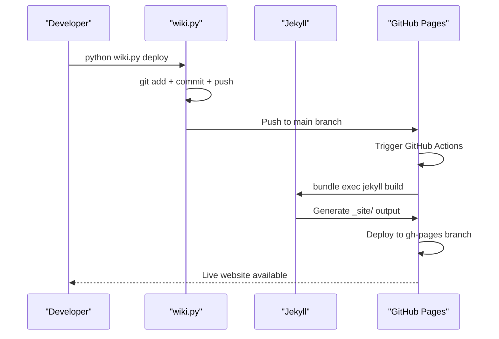
```mermaid
sequenceDiagram
participant Dev as "Developer"
participant CLI as "wiki.py"
participant Jekyll as "Jekyll"
participant GitHub as "GitHub Pages"
Dev->>CLI : python wiki.py deploy
CLI->>CLI : git add + commit + push
CLI->>GitHub : Push to main branch
GitHub->>GitHub : Trigger GitHub Actions
GitHub->>Jekyll : bundle exec jekyll build
Jekyll->>GitHub : Generate _site/ output
GitHub->>GitHub : Deploy to gh-pages branch
GitHub-->>Dev : Live website available
```

**Diagram sources**
- [wiki.py:117-130](file://wiki.py#L117-L130)
- [_config.yml:18-23](file://_config.yml#L18-L23)

**Section sources**
- [wiki.py:117-130](file://wiki.py#L117-L130)
- [_config.yml:18-23](file://_config.yml#L18-L23)

## Security Considerations
- **Session security**: Flask secret key configuration for signed cookies
- **Input validation**: Form validation for registration, login, and content submission
- **File restrictions**: Supported formats limited to prevent malicious uploads
- **Email verification**: QQ email requirement adds an extra authentication layer
- **Database security**: SQLite file permissions and connection isolation
- **Environment configuration**: Separate configuration for production vs development
- **LLM API security**: API keys stored in environment variables with fallback to shell sourcing
- **Job security**: Background threads operate independently with proper error isolation
- **Cross-worker coordination**: SQLite provides atomic operations for job state updates

**Section sources**
- [app/__init__.py:72-73](file://app/__init__.py#L72-L73)
- [app/auth.py:64-67](file://app/auth.py#L64-L67)
- [app/uploader.py:36-36](file://app/uploader.py#L36-L36)
- [app/uploader.py:135-147](file://app/uploader.py#L135-L147)
- [app/jobs.py:171-188](file://app/jobs.py#L171-L188)

## Migration from Previous Architecture
The system has undergone complete architectural transformation from the previous FastAPI-based multi-module system to a simplified Flask-based solution:

**Previous Architecture (Removed):**
- FastAPI backend with 7 modules (auth, thoughts, tags, research, ai, publish, sharing)
- PostgreSQL database with Alembic migrations
- React frontend with TypeScript
- Docker Compose with 3 containers
- Complex JWT authentication
- AI provider integrations (OpenAI/Ollama)
- Deep Research SSE pipeline
- Social sharing module
- Vite build toolchain
- MkDocs static site generator

**Current Architecture:**
- Flask application with 5 modules (auth, uploader, jobs, agent, skillhub)
- SQLite database with zero configuration
- Simplified Jinja2 templates with job status monitoring
- Jekyll static site generator
- Single-user authentication
- Enhanced file-based conversion pipeline with PDF structure detection and DOCX formatting cleanup
- Literary narrative style with MiniMax API integration
- Complete asynchronous job processing infrastructure
- GitHub Actions deployment
- CLI management tool

**Section sources**
- [PRD.md:160-180](file://PRD.md#L160-L180)

## Troubleshooting Guide
**Updated** Enhanced troubleshooting guidance for the new asynchronous job processing infrastructure, improved title extraction, and MiniMax API integration.

- **Database issues**: Check `data/wiki.db` file permissions and SQLite availability
- **Email verification**: Verify QQ email credentials and SMTP_SSL configuration
- **PDF conversion errors**: Install PyMuPDF library (`pip install PyMuPDF`) for enhanced PDF structure detection
- **DOCX conversion issues**: Install mammoth library (`pip install mammoth`) for DOCX processing and formatting cleanup
- **HTML conversion problems**: Install html2text library (`pip install html2text`) for HTML to Markdown conversion
- **Missing conversion libraries**: The system provides clear error messages indicating which libraries need to be installed
- **PDF structure detection failures**: Font size analysis may fail on documents with unusual typography or embedded fonts
- **DOCX formatting cleanup failures**: Formatting cleanup may not work properly if conversion libraries are not installed
- **Title extraction issues**: Title extraction may fail if content lacks proper formatting or contains special characters
- **Session problems**: Ensure Flask secret key is properly configured in environment
- **Upload failures**: Check file size limits and supported format extensions
- **Jekyll build errors**: Verify Ruby environment and gem dependencies
- **GitHub deployment**: Check Git configuration and remote repository setup
- **CLI operations**: Ensure proper Python virtual environment activation
- **MiniMax API issues**: Configure `MINIMAX_TOKEN_PLAN_API_KEY` environment variable or source from shell profile
- **LLM rewriting failures**: Check API connectivity and token validity, fallback to original content
- **Literary narrative style issues**: Verify CSS file loading and style selection in templates
- **Job processing failures**: Check SQLite permissions and ensure jobs table exists and is properly migrated
- **Background thread issues**: Verify daemon thread execution and proper error handling in job functions
- **Progress monitoring problems**: Ensure AJAX polling is working correctly and status endpoints are accessible
- **Cross-worker coordination**: Verify SQLite WAL mode is enabled for concurrent access

**Section sources**
- [app/__init__.py:12-17](file://app/__init__.py#L12-L17)
- [app/mailer.py:13-18](file://app/mailer.py#L13-L18)
- [app/converter.py:143-145](file://app/converter.py#L143-L145)
- [app/converter.py:7-39](file://app/converter.py#L7-L39)
- [app/converter.py:42-55](file://app/converter.py#L42-L55)
- [app/converter.py:112-140](file://app/converter.py#L112-L140)
- [app/uploader.py:135-147](file://app/uploader.py#L135-L147)
- [app/uploader.py:150-191](file://app/uploader.py#L150-L191)
- [app/jobs.py:50-69](file://app/jobs.py#L50-L69)
- [app/jobs.py:163-188](file://app/jobs.py#L163-L188)
- [wiki.py:117-130](file://wiki.py#L117-L130)

## Conclusion
PolaZhenJing's backend has been successfully transformed from a complex FastAPI architecture to a streamlined Flask-based management interface with comprehensive asynchronous job processing capabilities. The new design emphasizes simplicity with single-user authentication, file upload capabilities, automatic conversion pipeline with enhanced PDF structure detection and sophisticated DOCX formatting cleanup, and a complete job queue system for managing long-running tasks. The system maintains security through SQLite storage, QQ email verification, and Flask session management while significantly reducing complexity compared to the previous multi-module FastAPI implementation.

**Updated** The enhanced document conversion capabilities now provide sophisticated document structure analysis through font size detection and bold text identification, enabling more accurate heading classification and improved content organization. The new DOCX formatting cleanup functionality removes excessive markdown formatting artifacts that commonly appear when converting Word documents, resulting in cleaner and more readable content. The improved title extraction functionality with enhanced markdown formatting removal ensures optimal title detection for blog posts. The robust error handling ensures graceful degradation when conversion libraries are unavailable, maintaining system reliability across different deployment environments. The addition of literary narrative style with MiniMax API integration provides powerful content rewriting capabilities with style-specific prompts, enabling poetic and imagery-driven content generation. The complete asynchronous job processing infrastructure enables efficient management of long-running tasks such as LLM article generation, content rewriting, and media processing, providing real-time progress monitoring and cross-worker state management. This architecture supports the lightweight personal blog wiki requirements with minimal dependencies and zero-configuration database storage, leveraging Jekyll for static site generation and GitHub Pages for hosting.