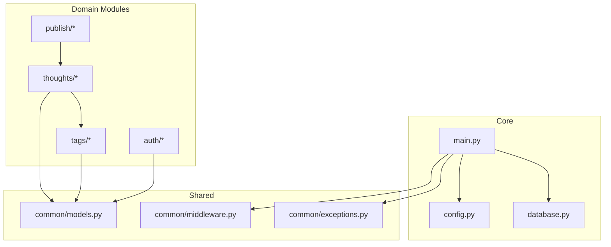
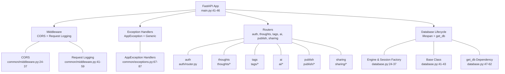
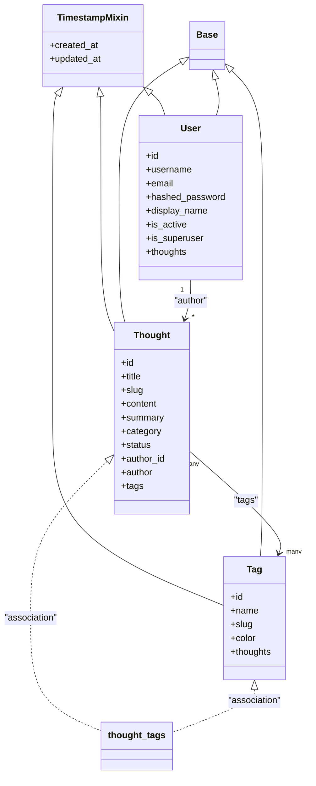
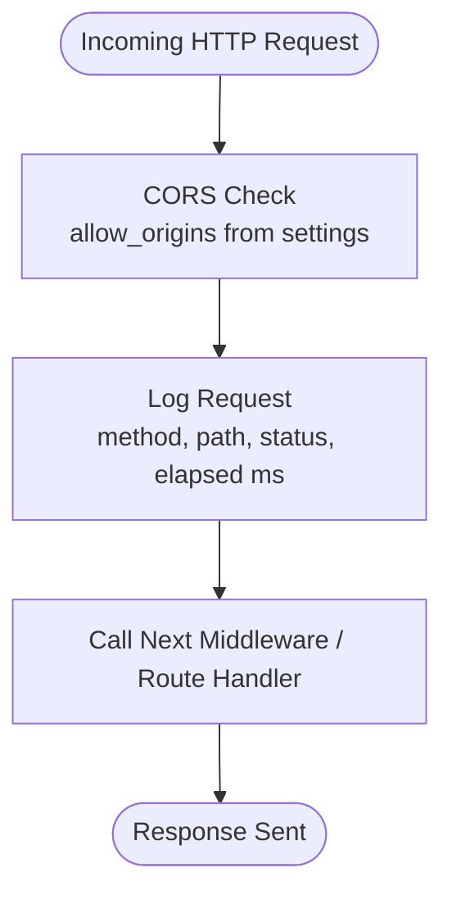
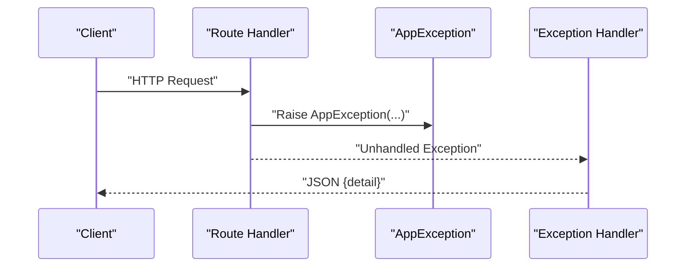
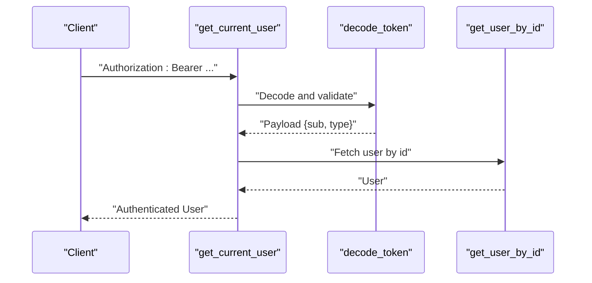
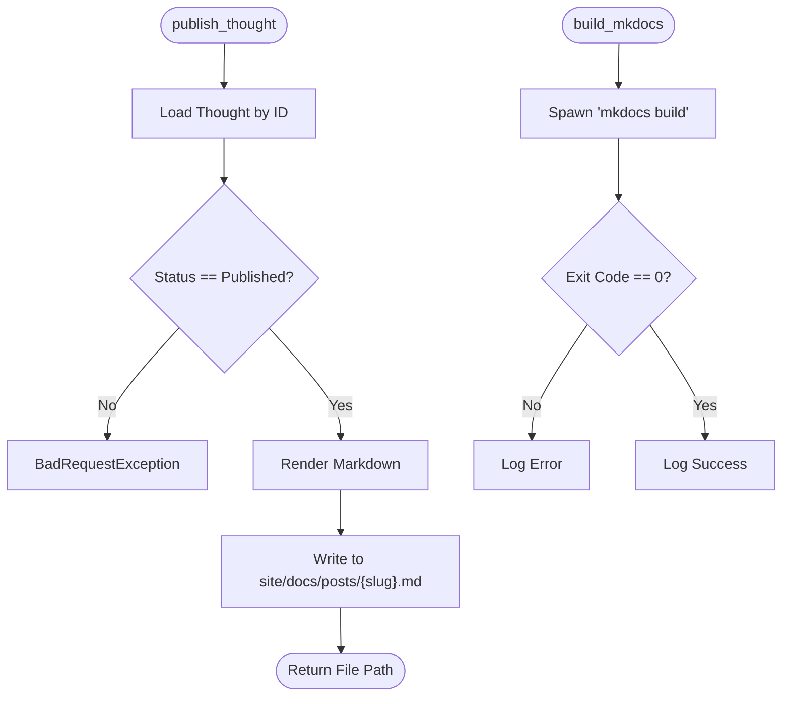
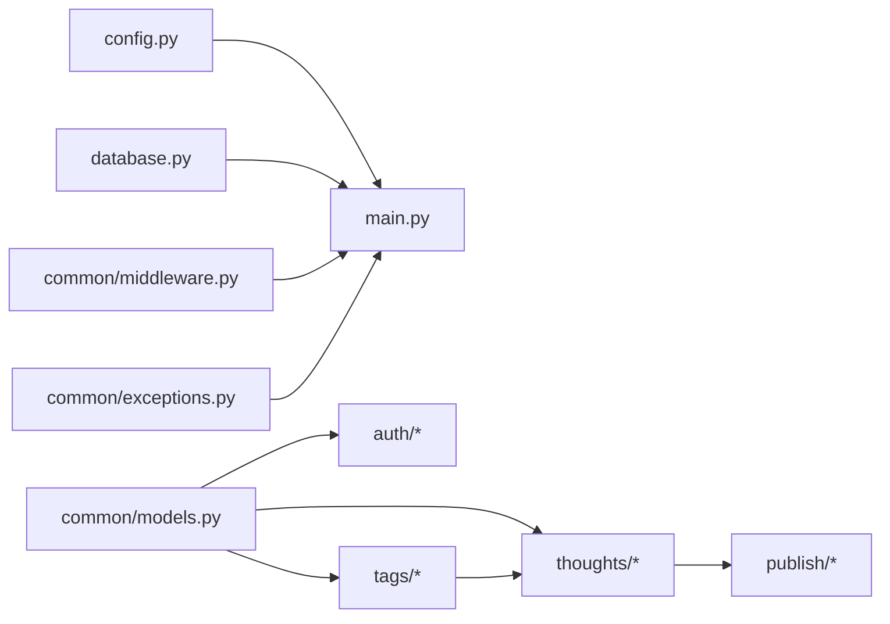

# Common Components

<cite>
**Referenced Files in This Document**
- [main.py](file://backend/app/main.py)
- [config.py](file://backend/app/config.py)
- [database.py](file://backend/app/database.py)
- [common/models.py](file://backend/app/common/models.py)
- [common/middleware.py](file://backend/app/common/middleware.py)
- [common/exceptions.py](file://backend/app/common/exceptions.py)
- [auth/dependencies.py](file://backend/app/auth/dependencies.py)
- [auth/service.py](file://backend/app/auth/service.py)
- [auth/schemas.py](file://backend/app/auth/schemas.py)
- [auth/router.py](file://backend/app/auth/router.py)
- [tags/models.py](file://backend/app/tags/models.py)
- [tags/schemas.py](file://backend/app/tags/schemas.py)
- [thoughts/models.py](file://backend/app/thoughts/models.py)
- [thoughts/schemas.py](file://backend/app/thoughts/schemas.py)
- [publish/service.py](file://backend/app/publish/service.py)
</cite>

## Table of Contents
1. [Introduction](#introduction)
2. [Project Structure](#project-structure)
3. [Core Components](#core-components)
4. [Architecture Overview](#architecture-overview)
5. [Detailed Component Analysis](#detailed-component-analysis)
6. [Dependency Analysis](#dependency-analysis)
7. [Performance Considerations](#performance-considerations)
8. [Troubleshooting Guide](#troubleshooting-guide)
9. [Conclusion](#conclusion)

## Introduction
This document describes the shared backend components in PolaZhenJing, focusing on:
- Shared database models and inheritance patterns
- Middleware system (CORS and request logging)
- Exception handling framework and error response formatting
- Common utilities and reusable patterns
- Validation patterns and cross-cutting concerns

It is designed to be accessible to readers with varying technical backgrounds while remaining precise and actionable.

## Project Structure
The backend is organized around a modular FastAPI application with a central configuration and a set of shared components under app/common. Domain modules (auth, thoughts, tags, publish, sharing, ai) import and reuse these shared pieces.

**Diagram sources**
- [main.py:40-72](file://backend/app/main.py#L40-L72)
- [config.py:16-61](file://backend/app/config.py#L16-L61)
- [database.py:24-62](file://backend/app/database.py#L24-L62)
- [common/models.py:24-76](file://backend/app/common/models.py#L24-L76)
- [common/middleware.py:23-59](file://backend/app/common/middleware.py#L23-L59)
- [common/exceptions.py:67-87](file://backend/app/common/exceptions.py#L67-L87)

**Section sources**
- [main.py:40-72](file://backend/app/main.py#L40-L72)
- [config.py:16-61](file://backend/app/config.py#L16-L61)
- [database.py:24-62](file://backend/app/database.py#L24-L62)

## Core Components
This section documents the foundational building blocks reused across the application.

- Shared database models
  - TimestampMixin: Adds created_at and updated_at columns with timezone-aware timestamps and automatic update behavior.
  - User: Extends TimestampMixin and Base; includes identity fields, hashed credentials, display metadata, and activity flags. Defines a relationship to Thought.
  - Thought: Inherits TimestampMixin and Base; includes title, slug, content, summary, category, status, author foreign key, and many-to-many tags via an association table.
  - Tag: Inherits TimestampMixin and Base; includes name, slug, color, and many-to-many back-reference to Thought.
  - Association table thought_tags: Declares a composite primary key linking thoughts and tags with cascade deletion semantics.

- Database engine and session
  - Asynchronous SQLAlchemy engine configured with connection pooling and pre-ping.
  - Async session factory bound to the engine.
  - Declarative Base class for ORM models.
  - get_db dependency yields sessions and handles commit/rollback.

- Configuration
  - Centralized Settings class with environment-driven values for application, database, JWT, AI provider, site publishing, and CORS.

- Middleware
  - CORS: Configured via settings.CORS_ORIGINS with allow-all methods and headers.
  - Request logging: HTTP middleware that logs method, path, status code, and elapsed time.

- Exception handling
  - Unified AppException hierarchy with subclasses for standard HTTP errors.
  - Global handlers convert AppException to JSON responses and catch-all generic exceptions returning safe messages.

**Section sources**
- [common/models.py:24-76](file://backend/app/common/models.py#L24-L76)
- [thoughts/models.py:31-70](file://backend/app/thoughts/models.py#L31-L70)
- [tags/models.py:22-66](file://backend/app/tags/models.py#L22-L66)
- [database.py:24-62](file://backend/app/database.py#L24-L62)
- [config.py:16-61](file://backend/app/config.py#L16-L61)
- [common/middleware.py:23-59](file://backend/app/common/middleware.py#L23-L59)
- [common/exceptions.py:17-87](file://backend/app/common/exceptions.py#L17-L87)

## Architecture Overview
The application initializes FastAPI, wires shared middleware and exception handlers, registers domain routers, and manages database lifecycle. Authentication and authorization depend on JWT tokens validated centrally.

**Diagram sources**
- [main.py:41-72](file://backend/app/main.py#L41-L72)
- [common/middleware.py:23-59](file://backend/app/common/middleware.py#L23-L59)
- [common/exceptions.py:67-87](file://backend/app/common/exceptions.py#L67-L87)
- [database.py:24-62](file://backend/app/database.py#L24-L62)

## Detailed Component Analysis

### Shared Database Models and Inheritance
- TimestampMixin
  - Purpose: Provide uniform created_at and updated_at columns across models.
  - Behavior: created_at defaults on insert; updated_at updates on row modification.
- User
  - Identity: UUID primary key, unique username and email, hashed password, optional display name.
  - Flags: is_active and is_superuser; supports soft-deactivation.
  - Relationship: back-populates Thought.author.
- Thought
  - Content: title, slug, content, optional summary, category.
  - Status: enum Draft/Published/Archived with default Draft.
  - Relationships: author (User) with cascade delete; tags via thought_tags association table.
- Tag
  - Metadata: name, slug, color; uniqueness enforced at application level.
  - Relationship: many-to-many back-populates Thought.tags.
- Association table thought_tags
  - Composite primary key; cascading deletes ensure referential integrity.

**Diagram sources**
- [common/models.py:24-76](file://backend/app/common/models.py#L24-L76)
- [thoughts/models.py:31-70](file://backend/app/thoughts/models.py#L31-L70)
- [tags/models.py:22-66](file://backend/app/tags/models.py#L22-L66)

**Section sources**
- [common/models.py:24-76](file://backend/app/common/models.py#L24-L76)
- [thoughts/models.py:31-70](file://backend/app/thoughts/models.py#L31-L70)
- [tags/models.py:22-66](file://backend/app/tags/models.py#L22-L66)

### Middleware System
- CORS configuration
  - Controlled via settings.CORS_ORIGINS; allows credentials, all methods, and headers.
- Request logging
  - Measures elapsed time per request and logs method, path, status, and duration.

**Diagram sources**
- [common/middleware.py:23-59](file://backend/app/common/middleware.py#L23-L59)
- [config.py:56-58](file://backend/app/config.py#L56-L58)

**Section sources**
- [common/middleware.py:23-59](file://backend/app/common/middleware.py#L23-L59)
- [config.py:56-58](file://backend/app/config.py#L56-L58)

### Exception Handling Framework
- Custom exceptions
  - AppException base with status_code and detail.
  - Specializations: NotFound, BadRequest, Unauthorized, Forbidden, Conflict.
- Global handlers
  - AppException -> JSON with status_code and {"detail": ...}.
  - Generic Exception -> 500 with safe message; production logs unexpected errors.

**Diagram sources**
- [common/exceptions.py:67-87](file://backend/app/common/exceptions.py#L67-L87)

**Section sources**
- [common/exceptions.py:17-87](file://backend/app/common/exceptions.py#L17-L87)

### Authentication and Authorization Dependencies
- Token extraction and validation
  - get_current_user extracts Bearer token, decodes JWT, verifies type, loads user, and enforces active status.
- Superuser guard
  - get_current_superuser depends on get_current_user and raises if not is_superuser.

**Diagram sources**
- [auth/dependencies.py:28-52](file://backend/app/auth/dependencies.py#L28-L52)
- [auth/service.py:72-89](file://backend/app/auth/service.py#L72-L89)
- [auth/service.py:153-166](file://backend/app/auth/service.py#L153-L166)

**Section sources**
- [auth/dependencies.py:28-66](file://backend/app/auth/dependencies.py#L28-L66)
- [auth/service.py:72-89](file://backend/app/auth/service.py#L72-L89)
- [auth/service.py:153-166](file://backend/app/auth/service.py#L153-L166)

### Validation Patterns and Reusable Schemas
- Pydantic schemas define request/response contracts with field constraints and patterns.
- Examples:
  - auth.schemas: RegisterRequest, LoginRequest, TokenResponse, RefreshRequest, UserResponse.
  - tags.schemas: TagCreate, TagUpdate, TagResponse, TagWithCountResponse.
  - thoughts.schemas: ThoughtCreate, ThoughtUpdate, ThoughtResponse, ThoughtListResponse.

These schemas are imported and used by routers and services to enforce validation and serialization.

**Section sources**
- [auth/schemas.py:19-57](file://backend/app/auth/schemas.py#L19-L57)
- [tags/schemas.py:18-45](file://backend/app/tags/schemas.py#L18-L45)
- [thoughts/schemas.py:20-65](file://backend/app/thoughts/schemas.py#L20-L65)

### Publishing Orchestration (Cross-Cutting Concern)
- publish.service orchestrates writing Markdown files for published thoughts and invoking MkDocs builds.
- It validates thought status, renders Markdown, writes to site/docs/posts, and logs outcomes.

**Diagram sources**
- [publish/service.py:38-80](file://backend/app/publish/service.py#L38-L80)
- [publish/service.py:83-111](file://backend/app/publish/service.py#L83-L111)

**Section sources**
- [publish/service.py:38-111](file://backend/app/publish/service.py#L38-L111)

## Dependency Analysis
The following diagram shows how shared components are consumed by domain modules and how configuration and database glue everything together.

**Diagram sources**
- [main.py:40-72](file://backend/app/main.py#L40-L72)
- [config.py:16-61](file://backend/app/config.py#L16-L61)
- [database.py:24-62](file://backend/app/database.py#L24-L62)
- [common/models.py:24-76](file://backend/app/common/models.py#L24-L76)
- [common/middleware.py:23-59](file://backend/app/common/middleware.py#L23-L59)
- [common/exceptions.py:67-87](file://backend/app/common/exceptions.py#L67-L87)

**Section sources**
- [main.py:40-72](file://backend/app/main.py#L40-L72)
- [common/models.py:24-76](file://backend/app/common/models.py#L24-L76)

## Performance Considerations
- Database
  - Async engine with connection pooling and pre-ping improves reliability and throughput.
  - get_db commits on success and rolls back on exceptions to maintain consistency.
- Middleware
  - Request logging uses minimal overhead with perf_counter timing.
- Publishing
  - Subprocess invocation of MkDocs is asynchronous; logging indicates typical completion time for small sites.

[No sources needed since this section provides general guidance]

## Troubleshooting Guide
- CORS issues
  - Verify settings.CORS_ORIGINS includes the frontend origin; ensure credentials and headers are allowed.
- Authentication failures
  - Confirm Authorization header presence and Bearer token validity; check token type and user activation status.
- Database connectivity
  - Check DATABASE_URL and network access; confirm pool settings and pre-ping behavior.
- Publishing errors
  - Ensure MkDocs is installed and available on PATH; inspect logs for build failure reasons.

**Section sources**
- [config.py:56-58](file://backend/app/config.py#L56-L58)
- [auth/dependencies.py:28-52](file://backend/app/auth/dependencies.py#L28-L52)
- [database.py:24-62](file://backend/app/database.py#L24-L62)
- [publish/service.py:83-111](file://backend/app/publish/service.py#L83-L111)

## Conclusion
PolaZhenJing’s backend relies on a small set of shared components to achieve consistency:
- TimestampMixin and Base unify model definitions.
- get_db and database.py provide robust async database access.
- common/middleware.py centralizes CORS and request logging.
- common/exceptions.py standardizes error handling and responses.
- auth/* demonstrates reusable JWT-based authentication and authorization patterns.
- tags/* and thoughts/* illustrate clean model inheritance and many-to-many relationships.
- publish/* shows a practical cross-cutting concern integrating file generation and external tooling.

These patterns enable maintainable, testable, and scalable development across modules.