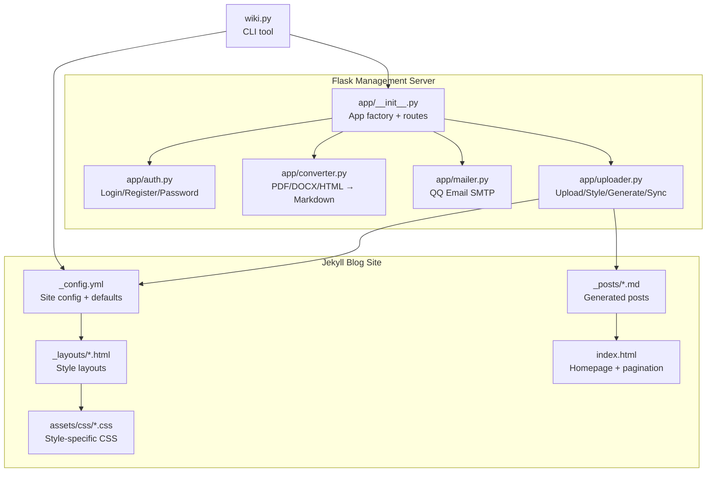
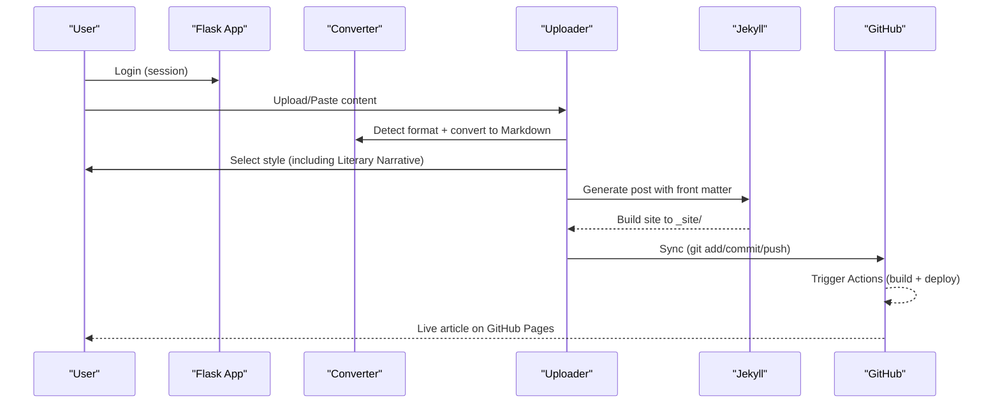
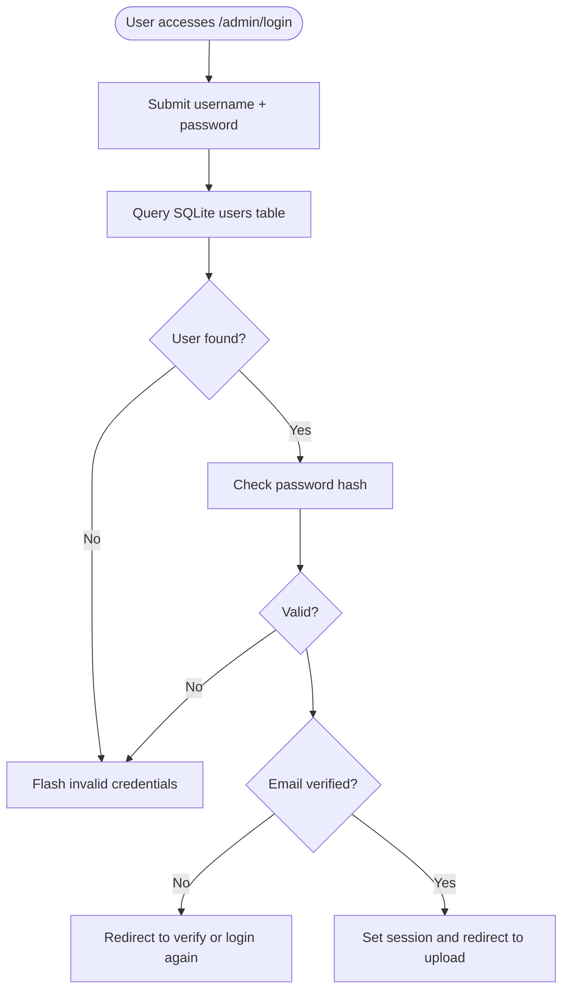
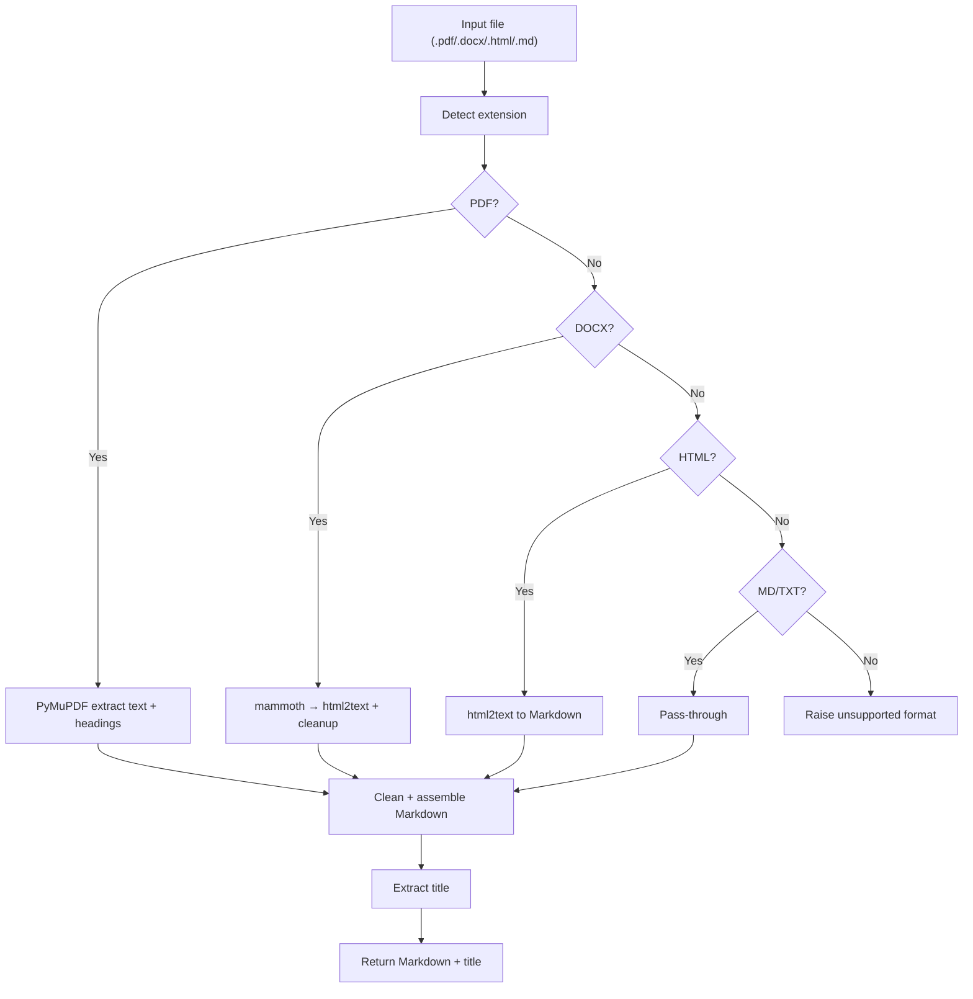
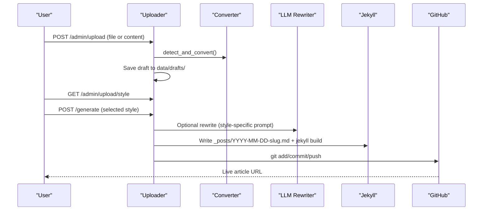
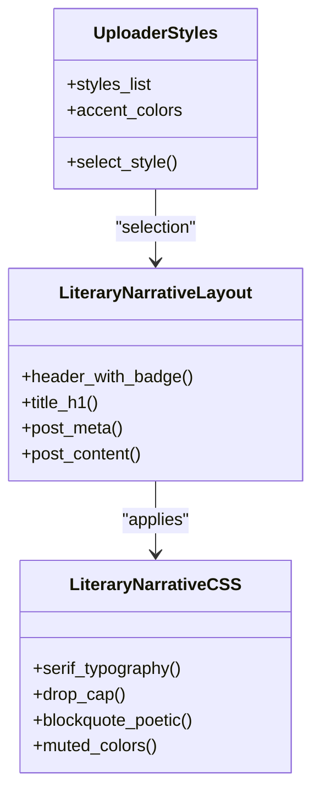
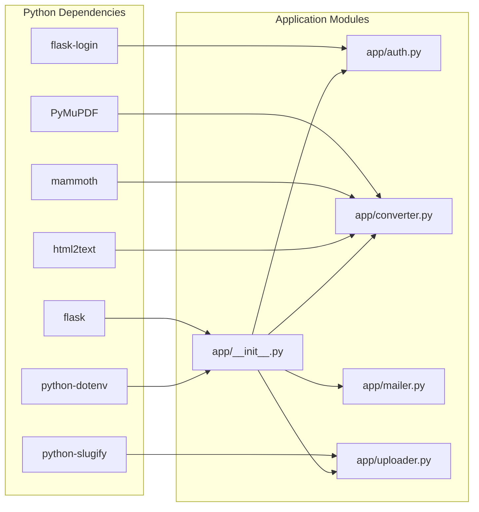

# Literary Narrative Article Creation

<cite>
**Referenced Files in This Document**
- [_config.yml](file://_config.yml)
- [PRD.md](file://PRD.md)
- [index.html](file://index.html)
- [requirements.txt](file://requirements.txt)
- [wiki.py](file://wiki.py)
- [app/__init__.py](file://app/__init__.py)
- [app/auth.py](file://app/auth.py)
- [app/converter.py](file://app/converter.py)
- [app/mailer.py](file://app/mailer.py)
- [app/uploader.py](file://app/uploader.py)
- [_layouts/literary-narrative.html](file://_layouts/literary-narrative.html)
- [assets/css/literary-narrative.css](file://assets/css/literary-narrative.css)
- [app/templates/upload.html](file://app/templates/upload.html)
- [app/templates/style_select.html](file://app/templates/style_select.html)
- [app/templates/articles.html](file://app/templates/articles.html)
- [app/templates/article_view.html](file://app/templates/article_view.html)
- [app/templates/theme_select.html](file://app/templates/theme_select.html)
</cite>

## Table of Contents
1. [Introduction](#introduction)
2. [Project Structure](#project-structure)
3. [Core Components](#core-components)
4. [Architecture Overview](#architecture-overview)
5. [Detailed Component Analysis](#detailed-component-analysis)
6. [Dependency Analysis](#dependency-analysis)
7. [Performance Considerations](#performance-considerations)
8. [Troubleshooting Guide](#troubleshooting-guide)
9. [Conclusion](#conclusion)

## Introduction
This document explains the Literary Narrative Article Creation system built on Jekyll and Flask. It enables authors to upload or paste content in multiple formats (Markdown, PDF, Word, HTML), convert it to clean Markdown, select a literary narrative style, and publish it as a styled blog post. The system emphasizes a poetic, imagery-driven prose style inspired by contemporary Chinese literary voices, while maintaining a streamlined workflow for personal knowledge blogging.

## Project Structure
The project combines a Flask-based management server with a Jekyll-powered static blog site. Key directories and files:
- app/: Flask application modules (authentication, upload/conversion, mailer, routing)
- _layouts/: Jekyll layout templates for each blog style
- assets/css/: style-specific CSS for typography and visual design
- _posts/: generated Markdown posts ready for Jekyll
- _config.yml: Jekyll configuration and defaults
- index.html: homepage template using Jekyll pagination
- wiki.py: CLI tool for local preview, building, and deployment

**Diagram sources**
- [app/__init__.py:43-76](file://app/__init__.py#L43-L76)
- [app/auth.py:26-48](file://app/auth.py#L26-L48)
- [app/converter.py:96-110](file://app/converter.py#L96-L110)
- [app/mailer.py:8-53](file://app/mailer.py#L8-L53)
- [app/uploader.py:353-396](file://app/uploader.py#L353-L396)
- [_config.yml:25-31](file://_config.yml#L25-L31)
- [_layouts/literary-narrative.html:1-22](file://_layouts/literary-narrative.html#L1-L22)
- [assets/css/literary-narrative.css:1-148](file://assets/css/literary-narrative.css#L1-L148)
- [index.html:1-70](file://index.html#L1-L70)
- [wiki.py:35-60](file://wiki.py#L35-L60)

**Section sources**
- [_config.yml:1-50](file://_config.yml#L1-L50)
- [PRD.md:181-239](file://PRD.md#L181-L239)
- [index.html:1-70](file://index.html#L1-L70)
- [wiki.py:1-165](file://wiki.py#L1-L165)

## Core Components
- Flask Application Factory: Initializes database, registers blueprints, and serves assets.
- Authentication Module: Lightweight user registration, login, and password change with QQ email verification.
- File Converter: Converts PDF, DOCX, HTML to clean Markdown; extracts images; detects titles.
- Uploader Module: Manages upload UI, style selection, LLM rewriting, post generation, and GitHub sync.
- Mailer: Sends verification codes via QQ Email SMTP.
- Jekyll Layouts and CSS: Five blog styles, including Literary Narrative, with dedicated layouts and stylesheets.
- CLI Tool: Provides commands for serving, building, admin server, creating posts, listing posts, and deploying.

**Section sources**
- [app/__init__.py:43-76](file://app/__init__.py#L43-L76)
- [app/auth.py:26-168](file://app/auth.py#L26-L168)
- [app/converter.py:96-146](file://app/converter.py#L96-L146)
- [app/uploader.py:353-594](file://app/uploader.py#L353-L594)
- [app/mailer.py:8-53](file://app/mailer.py#L8-L53)
- [_layouts/literary-narrative.html:1-22](file://_layouts/literary-narrative.html#L1-L22)
- [assets/css/literary-narrative.css:1-148](file://assets/css/literary-narrative.css#L1-L148)
- [wiki.py:1-165](file://wiki.py#L1-L165)

## Architecture Overview
The system follows a clear separation of concerns:
- Flask handles user sessions, uploads, conversions, and publishing actions.
- Jekyll builds the static blog from Markdown posts with chosen layouts and styles.
- GitHub Actions automates deployment to GitHub Pages upon pushes to the main branch.

**Diagram sources**
- [app/auth.py:26-48](file://app/auth.py#L26-L48)
- [app/converter.py:96-110](file://app/converter.py#L96-L110)
- [app/uploader.py:413-493](file://app/uploader.py#L413-L493)
- [_config.yml:25-31](file://_config.yml#L25-L31)

## Detailed Component Analysis

### Flask Application Factory and Routing
- Creates the Flask app, loads environment variables, sets secret key and upload limits.
- Registers authentication and uploader blueprints.
- Serves assets from the project root assets directory.
- Provides index redirects based on session presence.

**Section sources**
- [app/__init__.py:43-76](file://app/__init__.py#L43-L76)

### Authentication System
- Login: Validates credentials and sets session.
- Registration: Accepts username, QQ email, and password; stores hashed password.
- Email Verification: Sends 6-digit code via QQ SMTP; verifies within 5 minutes.
- Password Change: Requires authenticated session.
- Logout: Clears session.

**Diagram sources**
- [app/auth.py:26-48](file://app/auth.py#L26-L48)

**Section sources**
- [app/auth.py:26-168](file://app/auth.py#L26-L168)
- [app/mailer.py:8-53](file://app/mailer.py#L8-L53)

### File Conversion Pipeline
- Detects format by extension and routes to appropriate converter.
- PDF: Extracts text with basic structure detection; preserves headings by font size.
- DOCX: Uses mammoth to HTML, then html2text to Markdown; cleans formatting artifacts.
- HTML: Converts to Markdown with preserved links and images.
- Markdown: Pass-through with validation.
- Title extraction: Finds first heading or first meaningful line; truncates appropriately.

**Diagram sources**
- [app/converter.py:96-146](file://app/converter.py#L96-L146)

**Section sources**
- [app/converter.py:1-146](file://app/converter.py#L1-L146)

### Uploader and Style Selection
- Upload endpoint accepts files or pasted content, stores content as a temporary draft, and redirects to style selection.
- Style selection page renders five styles, including Literary Narrative, with previews and selection logic.
- Generate endpoint:
  - Optionally rewrites content using LLM skills for specific styles.
  - Builds front matter with layout, theme, title, date, tags, optional description and summary.
  - Writes to _posts/ and triggers incremental Jekyll build.
  - Attempts automatic GitHub sync after generation.

**Diagram sources**
- [app/uploader.py:353-493](file://app/uploader.py#L353-L493)
- [app/converter.py:96-110](file://app/converter.py#L96-L110)

**Section sources**
- [app/uploader.py:353-594](file://app/uploader.py#L353-L594)
- [app/templates/upload.html:1-82](file://app/templates/upload.html#L1-L82)
- [app/templates/style_select.html:1-132](file://app/templates/style_select.html#L1-L132)

### Literary Narrative Style Implementation
- Layout: _layouts/literary-narrative.html integrates style badges and content rendering.
- CSS: assets/css/literary-narrative.css defines poetic typography, drop caps, blockquotes, and muted color palette.
- Style card: Included in uploader styles with accent color and description.

**Diagram sources**
- [_layouts/literary-narrative.html:1-22](file://_layouts/literary-narrative.html#L1-L22)
- [assets/css/literary-narrative.css:1-148](file://assets/css/literary-narrative.css#L1-L148)
- [app/uploader.py:25-38](file://app/uploader.py#L25-L38)

**Section sources**
- [_layouts/literary-narrative.html:1-22](file://_layouts/literary-narrative.html#L1-L22)
- [assets/css/literary-narrative.css:1-148](file://assets/css/literary-narrative.css#L1-L148)
- [app/uploader.py:25-38](file://app/uploader.py#L25-L38)

### Management UI Templates
- Upload: Tabbed interface for file upload and paste content; collects title, tags, description.
- Style Select: Grid of styles with selection feedback and progress overlay during generation.
- Articles: Lists posts with preview, GitHub link, and delete actions.
- Article View: Renders styled content with summary box, share controls, and author footer.
- Theme Select: Switches UI theme persisted in data/theme.json.

**Section sources**
- [app/templates/upload.html:1-82](file://app/templates/upload.html#L1-L82)
- [app/templates/style_select.html:1-132](file://app/templates/style_select.html#L1-L132)
- [app/templates/articles.html:1-64](file://app/templates/articles.html#L1-L64)
- [app/templates/article_view.html:1-335](file://app/templates/article_view.html#L1-L335)
- [app/templates/theme_select.html:1-42](file://app/templates/theme_select.html#L1-L42)

### CLI Tool (wiki.py)
- Commands: serve (Jekyll), build (Jekyll), admin (Flask), new (create post), list (posts), deploy (git sync).
- Generates front matter with layout, title, date, and tags; writes to _posts/.

**Section sources**
- [wiki.py:1-165](file://wiki.py#L1-L165)

## Dependency Analysis
External dependencies include Flask and related packages, plus conversion libraries for PDF, DOCX, and HTML.

**Diagram sources**
- [requirements.txt:1-8](file://requirements.txt#L1-L8)
- [app/__init__.py:1-76](file://app/__init__.py#L1-L76)
- [app/auth.py:1-168](file://app/auth.py#L1-L168)
- [app/converter.py:1-146](file://app/converter.py#L1-L146)
- [app/mailer.py:1-53](file://app/mailer.py#L1-L53)
- [app/uploader.py:1-594](file://app/uploader.py#L1-L594)

**Section sources**
- [requirements.txt:1-8](file://requirements.txt#L1-L8)
- [PRD.md:242-257](file://PRD.md#L242-L257)

## Performance Considerations
- Conversion performance: PDF parsing and DOCX transformations can be CPU-intensive; ensure adequate memory and avoid extremely large files.
- Incremental Jekyll builds: Prefer incremental builds for faster regeneration after single post updates.
- LLM rewriting: Optional but may add latency; configure API keys and timeouts appropriately.
- Image handling: Extracted images are saved to assets/images/; keep image sizes reasonable for web delivery.

[No sources needed since this section provides general guidance]

## Troubleshooting Guide
Common issues and resolutions:
- Authentication failures: Verify username/password; ensure email is verified; check QQ SMTP configuration.
- Conversion errors: Confirm required libraries are installed; verify file integrity and supported formats.
- Jekyll build failures: Check front matter completeness and YAML syntax; validate layout names.
- GitHub sync errors: Ensure Git user info is configured; verify remote origin; check network connectivity and credentials.
- Session expiration: Re-authenticate; ensure cookies are enabled.

**Section sources**
- [app/auth.py:26-168](file://app/auth.py#L26-L168)
- [app/converter.py:143-146](file://app/converter.py#L143-L146)
- [app/uploader.py:413-493](file://app/uploader.py#L413-L493)

## Conclusion
The Literary Narrative Article Creation system offers a focused, streamlined workflow for producing beautifully styled blog posts. By combining Flask for content ingestion and LLM-assisted rewriting with Jekyll for static generation and GitHub Pages for hosting, it delivers a powerful yet simple solution for personal knowledge blogging with a distinctive literary voice.