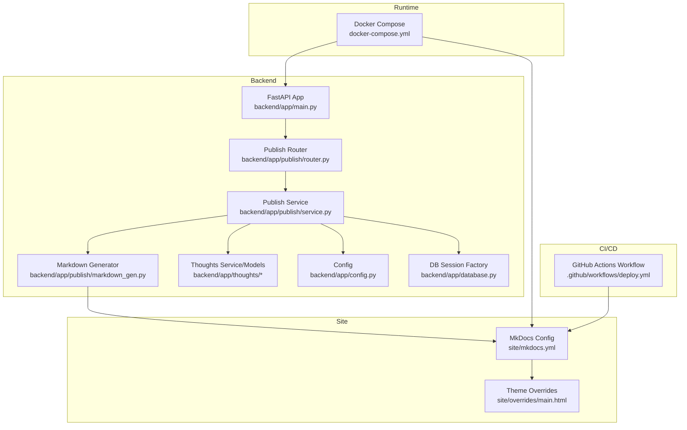
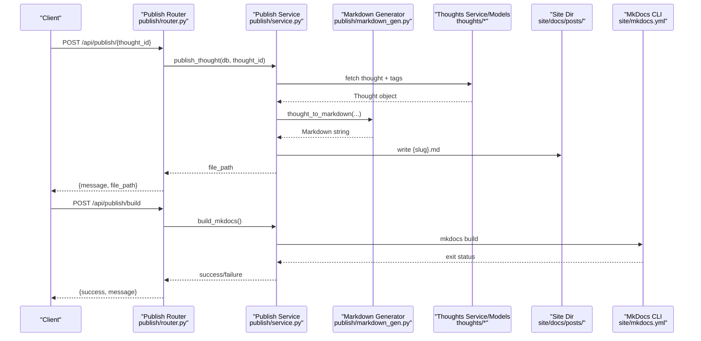
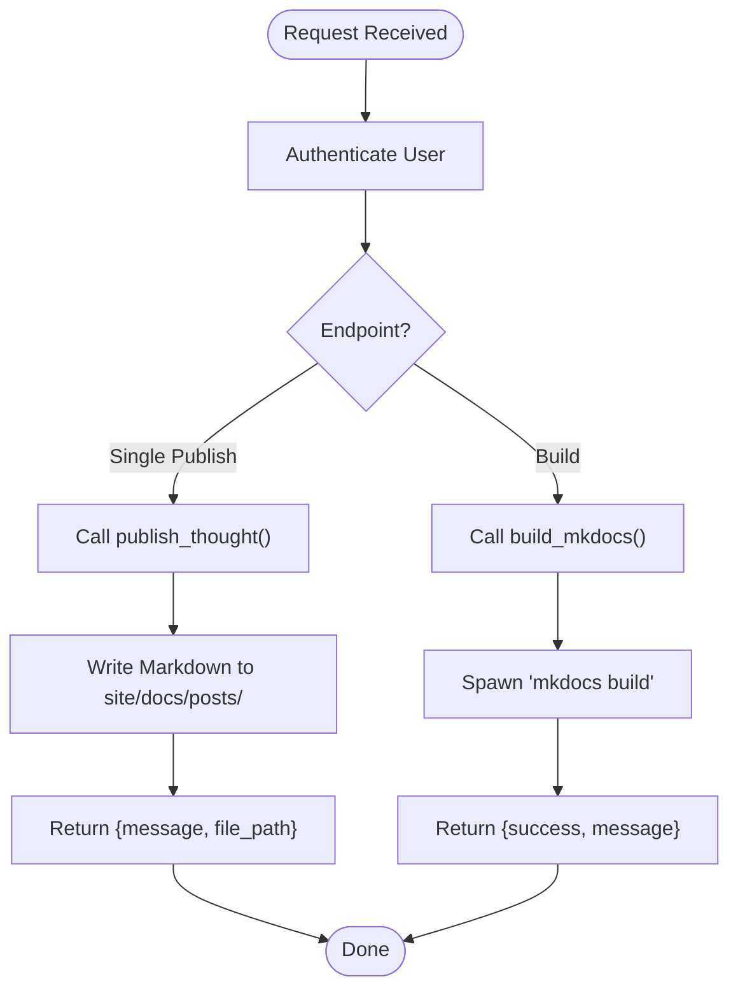
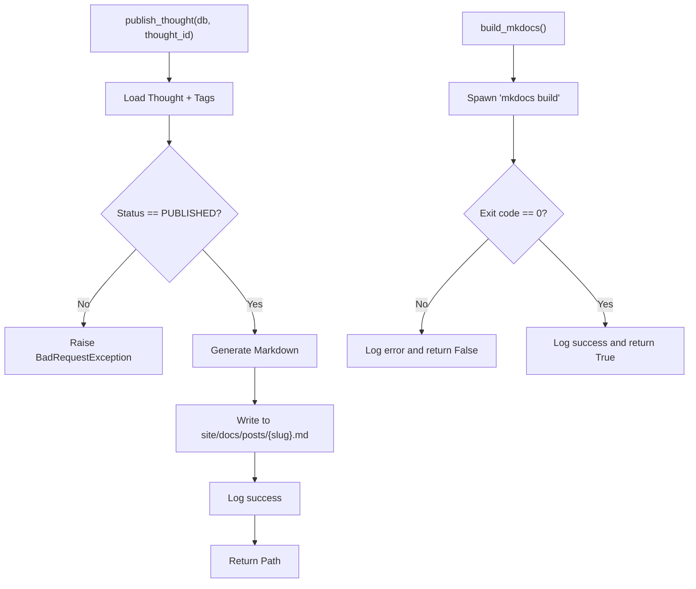
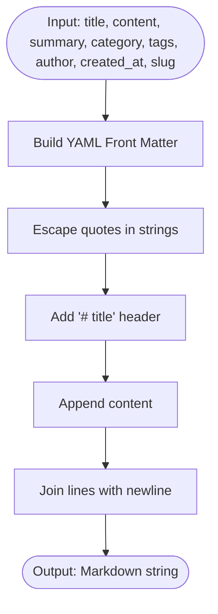
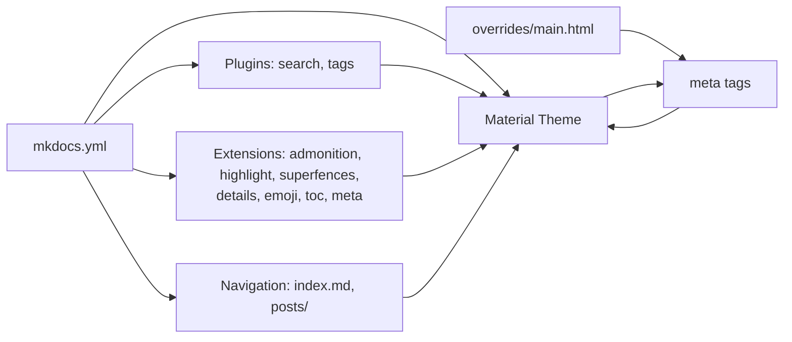
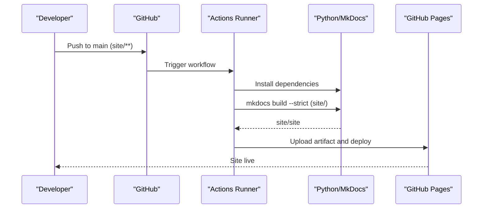
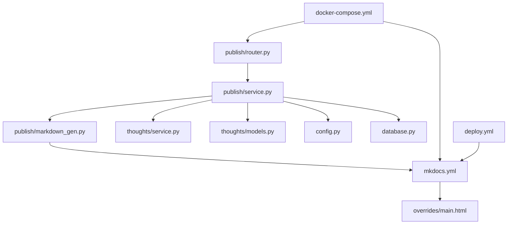

# Publishing Pipeline

<cite>
**Referenced Files in This Document**
- [backend/app/publish/router.py](file://backend/app/publish/router.py)
- [backend/app/publish/service.py](file://backend/app/publish/service.py)
- [backend/app/publish/markdown_gen.py](file://backend/app/publish/markdown_gen.py)
- [backend/app/thoughts/service.py](file://backend/app/thoughts/service.py)
- [backend/app/thoughts/models.py](file://backend/app/thoughts/models.py)
- [backend/app/config.py](file://backend/app/config.py)
- [backend/app/main.py](file://backend/app/main.py)
- [backend/app/database.py](file://backend/app/database.py)
- [backend/app/common/models.py](file://backend/app/common/models.py)
- [backend/app/tags/models.py](file://backend/app/tags/models.py)
- [site/mkdocs.yml](file://site/mkdocs.yml)
- [site/overrides/main.html](file://site/overrides/main.html)
- [.github/workflows/deploy.yml](file://.github/workflows/deploy.yml)
- [docker-compose.yml](file://docker-compose.yml)
- [backend/requirements.txt](file://backend/requirements.txt)
- [backend/tests/test_markdown_gen.py](file://backend/tests/test_markdown_gen.py)
</cite>

## Table of Contents
1. [Introduction](#introduction)
2. [Project Structure](#project-structure)
3. [Core Components](#core-components)
4. [Architecture Overview](#architecture-overview)
5. [Detailed Component Analysis](#detailed-component-analysis)
6. [Dependency Analysis](#dependency-analysis)
7. [Performance Considerations](#performance-considerations)
8. [Troubleshooting Guide](#troubleshooting-guide)
9. [Conclusion](#conclusion)
10. [Appendices](#appendices)

## Introduction
This document explains the publishing pipeline for PolaZhenJing. It covers how content is exported from the database, transformed into Markdown with frontmatter, compiled into a static site using MkDocs, and deployed automatically via GitHub Actions. It also documents the publishing service implementation, Markdown generation workflow, routing endpoints, MkDocs configuration and theme customization, and operational concerns such as validation, error handling, and deployment automation.

## Project Structure
The publishing pipeline spans backend services, MkDocs site configuration, and CI/CD automation:
- Backend FastAPI application exposes publishing endpoints and orchestrates Markdown generation and site builds.
- MkDocs site configuration defines the theme, plugins, navigation, and metadata integration.
- GitHub Actions workflow automates building and deploying the static site to GitHub Pages.
- Docker Compose sets up the backend, database, and shared volume for the MkDocs project.

**Diagram sources**
- [backend/app/main.py:40-73](file://backend/app/main.py#L40-L73)
- [backend/app/publish/router.py:24-64](file://backend/app/publish/router.py#L24-L64)
- [backend/app/publish/service.py:31-111](file://backend/app/publish/service.py#L31-L111)
- [backend/app/publish/markdown_gen.py:16-89](file://backend/app/publish/markdown_gen.py#L16-L89)
- [backend/app/thoughts/service.py:68-79](file://backend/app/thoughts/service.py#L68-L79)
- [backend/app/thoughts/models.py:31-67](file://backend/app/thoughts/models.py#L31-L67)
- [backend/app/config.py:52-54](file://backend/app/config.py#L52-L54)
- [backend/app/database.py:47-62](file://backend/app/database.py#L47-L62)
- [site/mkdocs.yml:9-79](file://site/mkdocs.yml#L9-L79)
- [site/overrides/main.html:11-37](file://site/overrides/main.html#L11-L37)
- [.github/workflows/deploy.yml:27-63](file://.github/workflows/deploy.yml#L27-L63)
- [docker-compose.yml:9-67](file://docker-compose.yml#L9-L67)

**Section sources**
- [backend/app/main.py:40-73](file://backend/app/main.py#L40-L73)
- [docker-compose.yml:9-67](file://docker-compose.yml#L9-L67)

## Core Components
- Publishing Router: Exposes endpoints to publish a single thought and to trigger a full site build.
- Publishing Service: Validates thought status, aggregates metadata, generates Markdown, writes to the MkDocs posts directory, and invokes MkDocs build.
- Markdown Generator: Produces a complete Markdown document with YAML frontmatter and escaped content.
- MkDocs Configuration: Defines theme, plugins, navigation, and SEO-related metadata integration.
- GitHub Actions Workflow: Builds the MkDocs site and deploys to GitHub Pages on pushes to the main branch.
- Runtime Environment: Docker Compose mounts the site directory into the backend container for persistent writes.

**Section sources**
- [backend/app/publish/router.py:37-64](file://backend/app/publish/router.py#L37-L64)
- [backend/app/publish/service.py:38-111](file://backend/app/publish/service.py#L38-L111)
- [backend/app/publish/markdown_gen.py:16-89](file://backend/app/publish/markdown_gen.py#L16-L89)
- [site/mkdocs.yml:9-79](file://site/mkdocs.yml#L9-L79)
- [.github/workflows/deploy.yml:27-63](file://.github/workflows/deploy.yml#L27-L63)
- [docker-compose.yml:44-46](file://docker-compose.yml#L44-L46)

## Architecture Overview
The publishing pipeline follows a clear separation of concerns:
- API layer validates permissions and routes requests.
- Service layer encapsulates business logic and external process invocation.
- Markdown generator produces structured content with frontmatter.
- MkDocs consumes the generated Markdown and renders the static site.
- CI/CD automates deployment to GitHub Pages.

**Diagram sources**
- [backend/app/publish/router.py:37-64](file://backend/app/publish/router.py#L37-L64)
- [backend/app/publish/service.py:38-111](file://backend/app/publish/service.py#L38-L111)
- [backend/app/publish/markdown_gen.py:16-89](file://backend/app/publish/markdown_gen.py#L16-L89)
- [backend/app/thoughts/service.py:68-79](file://backend/app/thoughts/service.py#L68-L79)
- [site/mkdocs.yml:9-79](file://site/mkdocs.yml#L9-L79)

## Detailed Component Analysis

### Publishing Router Endpoints
- Endpoint: POST /api/publish/{thought_id}
  - Purpose: Export a single published thought as a Markdown file under site/docs/posts/.
  - Validation: Requires authenticated user via dependency.
  - Behavior: Calls publish_thought and returns the generated file path.
- Endpoint: POST /api/publish/build
  - Purpose: Trigger a full MkDocs site build.
  - Behavior: Invokes build_mkdocs and returns success/failure status.

**Diagram sources**
- [backend/app/publish/router.py:37-64](file://backend/app/publish/router.py#L37-L64)
- [backend/app/publish/service.py:38-111](file://backend/app/publish/service.py#L38-L111)

**Section sources**
- [backend/app/publish/router.py:37-64](file://backend/app/publish/router.py#L37-L64)

### Publishing Service Implementation
Responsibilities:
- Validate thought existence and PUBLISHED status.
- Aggregate metadata (title, summary, category, tags, author, created date, slug).
- Delegate Markdown generation to thought_to_markdown.
- Write the Markdown file to site/docs/posts/{slug}.md.
- Invoke MkDocs build via subprocess and return status.

Key behaviors:
- Directory creation: Ensures site/docs/posts/ exists.
- Error handling: Propagates exceptions for invalid/non-published thoughts; logs and returns failure for MkDocs build errors.
- Logging: Emits info-level logs for successful publishes and build outcomes.

**Diagram sources**
- [backend/app/publish/service.py:38-111](file://backend/app/publish/service.py#L38-L111)
- [backend/app/thoughts/models.py:24-28](file://backend/app/thoughts/models.py#L24-L28)

**Section sources**
- [backend/app/publish/service.py:38-111](file://backend/app/publish/service.py#L38-L111)

### Markdown Generation System
The generator creates a complete Markdown document with YAML frontmatter:
- Frontmatter fields: title, date, description, author, category, tags (as a list), slug.
- Escaping: Double quotes inside YAML values are escaped to ensure validity.
- Body: Includes a top-level heading matching the title followed by the content.

Validation and tests:
- Unit tests confirm presence of essential frontmatter keys and headings.
- Tests cover both full and minimal field scenarios.

**Diagram sources**
- [backend/app/publish/markdown_gen.py:16-89](file://backend/app/publish/markdown_gen.py#L16-L89)
- [backend/tests/test_markdown_gen.py:16-52](file://backend/tests/test_markdown_gen.py#L16-L52)

**Section sources**
- [backend/app/publish/markdown_gen.py:16-89](file://backend/app/publish/markdown_gen.py#L16-L89)
- [backend/tests/test_markdown_gen.py:16-52](file://backend/tests/test_markdown_gen.py#L16-L52)

### MkDocs Integration and Theme Customization
Configuration highlights:
- Theme: Material with custom_dir overrides.
- Language: Chinese (zh).
- Palette: Light/dark modes with toggles.
- Features: Instant navigation, tabs, sections, top navigation, search suggestions/highlight, copy code.
- Plugins: Search (multi-language), tags.
- Markdown Extensions: Admonitions, syntax highlighting with line anchors, superfences, details, emoji, TOC with permalink, meta.
- Navigation: Home and Articles (posts/) entries.
- Extra: Social links and generator flag disabled.

Overrides:
- Overrides inject Open Graph and Twitter Card meta tags into page head for improved SEO and social sharing.

**Diagram sources**
- [site/mkdocs.yml:9-79](file://site/mkdocs.yml#L9-L79)
- [site/overrides/main.html:11-37](file://site/overrides/main.html#L11-L37)

**Section sources**
- [site/mkdocs.yml:9-79](file://site/mkdocs.yml#L9-L79)
- [site/overrides/main.html:11-37](file://site/overrides/main.html#L11-L37)

### Deployment Automation
Workflow triggers:
- On push to main branch targeting site/**.
- Manual dispatch support.

Steps:
- Checkout repository.
- Set up Python and install MkDocs and Material.
- Build site with strict mode.
- Upload built artifact (site/site).
- Deploy to GitHub Pages.

**Diagram sources**
- [.github/workflows/deploy.yml:27-63](file://.github/workflows/deploy.yml#L27-L63)

**Section sources**
- [.github/workflows/deploy.yml:27-63](file://.github/workflows/deploy.yml#L27-L63)

### Content Aggregation and Asset Management
- Aggregation: The publishing service pulls thought metadata (title, content, summary, category, tags, author, created_at, slug) from the database via the thoughts service.
- Asset management: Markdown files are written to site/docs/posts/ and MkDocs compiles them into site/site/ during build.
- Mounting: Docker Compose shares the host site directory into the backend container so writes persist and are available to MkDocs.

**Section sources**
- [backend/app/publish/service.py:38-80](file://backend/app/publish/service.py#L38-L80)
- [backend/app/thoughts/service.py:68-79](file://backend/app/thoughts/service.py#L68-L79)
- [docker-compose.yml:44-46](file://docker-compose.yml#L44-L46)

## Dependency Analysis
The publishing pipeline exhibits clean layering:
- Router depends on service.
- Service depends on markdown generator, thoughts service/models, configuration, and database session factory.
- Markdown generator is self-contained and pure.
- MkDocs configuration is decoupled from backend logic but consumed by the build process.
- CI/CD workflow is independent but relies on the MkDocs project structure.

**Diagram sources**
- [backend/app/publish/router.py:24-64](file://backend/app/publish/router.py#L24-L64)
- [backend/app/publish/service.py:22-26](file://backend/app/publish/service.py#L22-L26)
- [backend/app/publish/markdown_gen.py:16-89](file://backend/app/publish/markdown_gen.py#L16-L89)
- [backend/app/thoughts/service.py:68-79](file://backend/app/thoughts/service.py#L68-L79)
- [backend/app/thoughts/models.py:31-67](file://backend/app/thoughts/models.py#L31-L67)
- [backend/app/config.py:52-54](file://backend/app/config.py#L52-L54)
- [backend/app/database.py:47-62](file://backend/app/database.py#L47-L62)
- [site/mkdocs.yml:9-79](file://site/mkdocs.yml#L9-L79)
- [site/overrides/main.html:11-37](file://site/overrides/main.html#L11-L37)
- [docker-compose.yml:44-46](file://docker-compose.yml#L44-L46)
- [.github/workflows/deploy.yml:27-63](file://.github/workflows/deploy.yml#L27-L63)

**Section sources**
- [backend/app/publish/router.py:24-64](file://backend/app/publish/router.py#L24-L64)
- [backend/app/publish/service.py:22-26](file://backend/app/publish/service.py#L22-L26)
- [backend/app/publish/markdown_gen.py:16-89](file://backend/app/publish/markdown_gen.py#L16-L89)
- [backend/app/thoughts/service.py:68-79](file://backend/app/thoughts/service.py#L68-L79)
- [backend/app/thoughts/models.py:31-67](file://backend/app/thoughts/models.py#L31-L67)
- [backend/app/config.py:52-54](file://backend/app/config.py#L52-L54)
- [backend/app/database.py:47-62](file://backend/app/database.py#L47-L62)
- [site/mkdocs.yml:9-79](file://site/mkdocs.yml#L9-L79)
- [site/overrides/main.html:11-37](file://site/overrides/main.html#L11-L37)
- [docker-compose.yml:44-46](file://docker-compose.yml#L44-L46)
- [.github/workflows/deploy.yml:27-63](file://.github/workflows/deploy.yml#L27-L63)

## Performance Considerations
- Build latency: The service spawns mkdocs build as a subprocess; typical completion is under five seconds for small sites.
- Database access: Thought loading includes eager loading of tags to minimize round-trips.
- File I/O: Writing a single Markdown file is fast; ensure the site/docs/posts/ directory is on a performant filesystem.
- CI/CD: Strict build mode helps catch configuration issues early; consider caching Python dependencies in CI for faster installs.

[No sources needed since this section provides general guidance]

## Troubleshooting Guide
Common issues and resolutions:
- Thought not published: Ensure the thought’s status is PUBLISHED; otherwise, the service raises a bad-request error.
- Build fails: Check server logs for MkDocs build errors; verify mkdocs and mkdocs-material are installed and the MkDocs project is valid.
- Missing site artifacts: Confirm the backend container has write access to the mounted site directory and that the build step runs successfully.
- SEO/meta tags missing: Verify overrides/main.html is present and that frontmatter includes description and title.

Operational checks:
- Health endpoint: Use the /health endpoint to verify backend availability.
- Logs: Inspect backend logs for publish and build outcomes.

**Section sources**
- [backend/app/publish/service.py:58-61](file://backend/app/publish/service.py#L58-L61)
- [backend/app/publish/service.py:103-110](file://backend/app/publish/service.py#L103-L110)
- [backend/app/main.py:76-89](file://backend/app/main.py#L76-L89)

## Conclusion
The PolaZhenJing publishing pipeline integrates database-backed content with a robust Markdown generation and MkDocs-based static site compilation. It offers explicit endpoints for publishing individual thoughts and triggering full builds, with automated CI/CD deployment to GitHub Pages. The design emphasizes separation of concerns, clear error handling, and extensibility through MkDocs plugins and theme customization.

## Appendices

### API Endpoints Summary
- POST /api/publish/{thought_id}
  - Description: Publish a single thought as Markdown.
  - Response: { message, file_path }.
- POST /api/publish/build
  - Description: Trigger a full MkDocs site build.
  - Response: { success, message }.

**Section sources**
- [backend/app/publish/router.py:37-64](file://backend/app/publish/router.py#L37-L64)

### MkDocs Configuration Highlights
- Theme: Material with custom_dir overrides.
- Plugins: search (multi-language), tags.
- Extensions: admonition, highlight, superfences, details, emoji, toc, meta.
- Navigation: index.md, posts/.
- Overrides: Open Graph and Twitter Card meta tags injection.

**Section sources**
- [site/mkdocs.yml:9-79](file://site/mkdocs.yml#L9-L79)
- [site/overrides/main.html:11-37](file://site/overrides/main.html#L11-L37)

### Runtime and Environment
- Backend container mounts the site directory for persistent writes.
- MkDocs and Material are installed in the backend image.
- GitHub Actions workflow installs dependencies and builds the site.

**Section sources**
- [docker-compose.yml:44-46](file://docker-compose.yml#L44-L46)
- [backend/requirements.txt:23-25](file://backend/requirements.txt#L23-L25)
- [.github/workflows/deploy.yml:39-46](file://.github/workflows/deploy.yml#L39-L46)