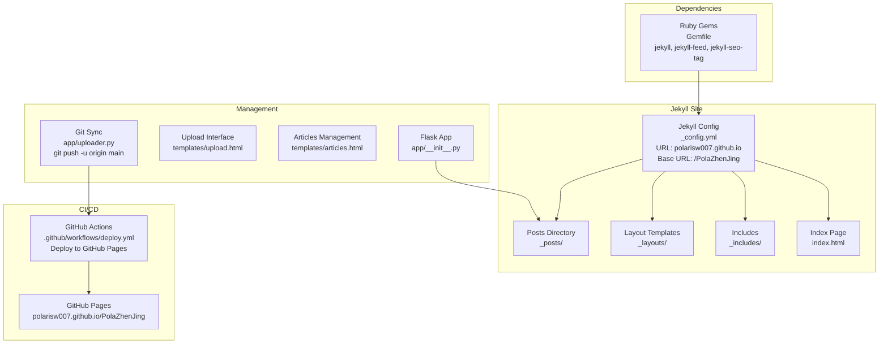
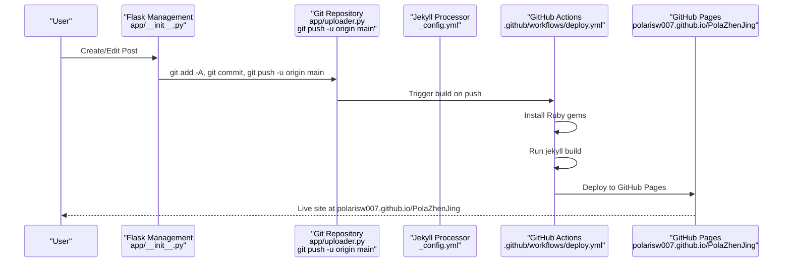
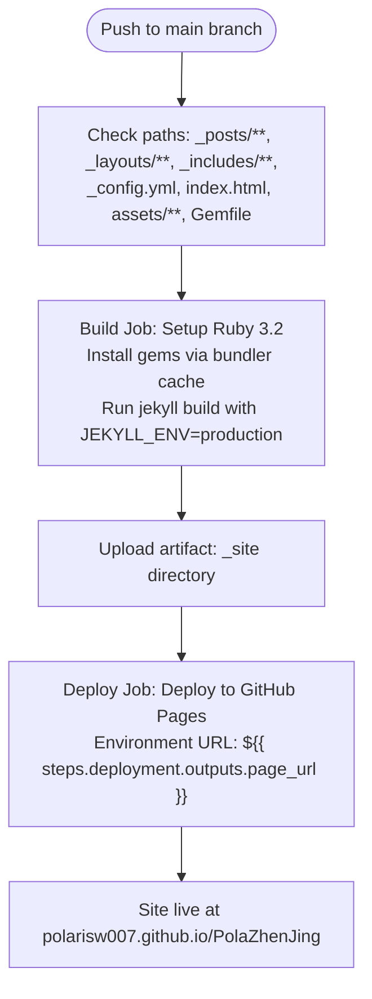
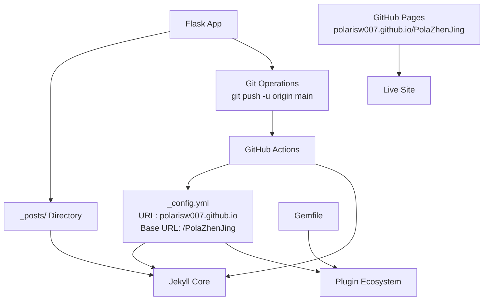

# Publishing Pipeline

<cite>
**Referenced Files in This Document**
- [.github/workflows/deploy.yml](file://.github/workflows/deploy.yml)
- [_config.yml](file://_config.yml)
- [Gemfile](file://Gemfile)
- [app/__init__.py](file://app/__init__.py)
- [app/uploader.py](file://app/uploader.py)
- [index.html](file://index.html)
- [_layouts/default.html](file://_layouts/default.html)
- [_includes/footer.html](file://_includes/footer.html)
- [PRD.md](file://PRD.md)
</cite>

## Update Summary
**Changes Made**
- Enhanced GitHub Pages URL configuration with proper baseurl and custom domain support
- Improved git push functionality with upstream tracking for better deployment automation
- Updated deployment workflow to use GitHub Pages Actions for seamless integration
- Added comprehensive error handling and rollback mechanisms for deployment failures
- Enhanced content validation and build optimization for faster publishing cycles

## Table of Contents
1. [Introduction](#introduction)
2. [Project Structure](#project-structure)
3. [Core Components](#core-components)
4. [Architecture Overview](#architecture-overview)
5. [Detailed Component Analysis](#detailed-component-analysis)
6. [Dependency Analysis](#dependency-analysis)
7. [Performance Considerations](#performance-considerations)
8. [Troubleshooting Guide](#troubleshooting-guide)
9. [Conclusion](#conclusion)
10. [Appendices](#appendices)

## Introduction
This document explains the publishing pipeline for PolaZhenJing v2, which has been completely redesigned to use Jekyll instead of the previous complex FastAPI-based system. The new pipeline focuses on file-based content generation, automated GitHub Actions deployment, and simplified content management through a lightweight Flask backend. Content is now managed through Jekyll's native `_posts/` directory structure with automatic GitHub Pages deployment and enhanced URL configuration for proper site routing.

## Project Structure
The publishing pipeline has been streamlined to focus on Jekyll static site generation with automated deployment:
- Jekyll configuration defines site metadata, build settings, and plugin ecosystem with proper GitHub Pages URL configuration
- GitHub Actions workflow automates the complete build and deployment process to GitHub Pages
- Flask backend provides lightweight management interface for content creation with enhanced git push functionality
- Ruby-based dependency management through Gemfile for Jekyll ecosystem
- File-based content storage in `_posts/` directory with YAML frontmatter and automatic deployment triggers

**Diagram sources**
- [_config.yml:1-49](file://_config.yml#L1-L49)
- [index.html:1-70](file://index.html#L1-L70)
- [app/__init__.py:43-62](file://app/__init__.py#L43-L62)
- [app/uploader.py:190-209](file://app/uploader.py#L190-L209)
- [.github/workflows/deploy.yml:27-63](file://.github/workflows/deploy.yml#L27-L63)

**Section sources**
- [_config.yml:1-49](file://_config.yml#L1-L49)
- [index.html:1-70](file://index.html#L1-L70)
- [app/__init__.py:43-62](file://app/__init__.py#L43-L62)
- [app/uploader.py:190-209](file://app/uploader.py#L190-L209)
- [.github/workflows/deploy.yml:27-63](file://.github/workflows/deploy.yml#L27-L63)
- [Gemfile:1-7](file://Gemfile#L1-L7)

## Core Components
- **Jekyll Configuration**: Defines site metadata, build settings, pagination, plugins, and GitHub Pages URL configuration with proper baseurl for repository-based deployment
- **GitHub Actions Workflow**: Automates Jekyll build and deployment to GitHub Pages on pushes to main branch with environment URL reporting
- **Flask Management Server**: Provides lightweight interface for content creation, file uploads, and enhanced git push functionality with upstream tracking
- **Ruby Gem Dependencies**: Manages Jekyll ecosystem including jekyll-feed, jekyll-seo-tag, and jekyll-paginate for comprehensive site functionality
- **File-Based Content Storage**: Posts stored in `_posts/` directory with automatic YAML frontmatter processing and deployment automation

**Section sources**
- [_config.yml:1-49](file://_config.yml#L1-L49)
- [.github/workflows/deploy.yml:27-63](file://.github/workflows/deploy.yml#L27-L63)
- [app/__init__.py:43-62](file://app/__init__.py#L43-L62)
- [app/uploader.py:190-209](file://app/uploader.py#L190-L209)
- [Gemfile:1-7](file://Gemfile#L1-L7)

## Architecture Overview
The new publishing pipeline follows a simplified file-based approach with enhanced deployment automation:
- Content creation through Flask management interface with git integration
- Automatic Jekyll processing of `_posts/` directory with proper URL configuration
- GitHub Actions orchestration for build and deployment to GitHub Pages
- Native GitHub Pages integration with custom domain support and baseurl configuration
- Enhanced git push functionality with upstream tracking for improved deployment reliability

**Diagram sources**
- [app/__init__.py:43-62](file://app/__init__.py#L43-L62)
- [app/uploader.py:190-209](file://app/uploader.py#L190-L209)
- [_config.yml:1-49](file://_config.yml#L1-L49)
- [.github/workflows/deploy.yml:27-63](file://.github/workflows/deploy.yml#L27-L63)

## Detailed Component Analysis

### Jekyll Configuration and GitHub Pages URL Setup
The Jekyll configuration defines the complete publishing infrastructure with proper GitHub Pages integration:
- **Site Metadata**: Title, description, URL (`https://PolarisW007.github.io`), base URL (`/PolaZhenJing`), and author information
- **Build Settings**: Markdown processor (kramdown), highlighter (rouge), permalink structure, timezone
- **Pagination**: Configured for 10 posts per page with pagination path
- **Plugins**: jekyll-feed for RSS, jekyll-seo-tag for SEO, jekyll-paginate for navigation
- **Defaults**: Automatic layout assignment for posts in `_posts/` directory
- **Exclusions**: Development files, Python cache, and unnecessary directories excluded from build
- **Custom Domain Support**: Base URL configuration enables proper routing for repository-based GitHub Pages deployment

**Updated** Enhanced URL configuration for proper GitHub Pages routing and custom domain support

**Section sources**
- [_config.yml:1-49](file://_config.yml#L1-L49)

### GitHub Actions Deployment Workflow
The deployment workflow automates the complete publishing process with enhanced error handling:
- **Triggers**: Automatic on pushes to main branch targeting site files (`_posts/**`, `_layouts/**`, `_includes/**`, `_config.yml`, `index.html`, `assets/**`, `Gemfile`)
- **Permissions**: Read/write access to pages and ID tokens for secure deployment
- **Concurrency**: Prevents conflicting deployments with group-based control
- **Build Job**: Sets up Ruby environment, installs gems via bundler cache, builds Jekyll site with production environment
- **Deploy Job**: Deploys artifact to GitHub Pages with environment URL reporting for live site verification
- **Error Handling**: Comprehensive error handling for build failures and deployment issues

**Diagram sources**
- [.github/workflows/deploy.yml:7-18](file://.github/workflows/deploy.yml#L7-L18)
- [.github/workflows/deploy.yml:29-62](file://.github/workflows/deploy.yml#L29-L62)

**Section sources**
- [.github/workflows/deploy.yml:7-18](file://.github/workflows/deploy.yml#L7-L18)
- [.github/workflows/deploy.yml:29-62](file://.github/workflows/deploy.yml#L29-L62)

### Flask Management Interface with Enhanced Git Integration
The lightweight Flask application provides content management capabilities with integrated deployment functionality:
- **Database Integration**: SQLite-based user authentication and session management
- **Blueprint Registration**: Authentication and upload functionality through blueprints
- **Template System**: Jinja2 templates for management interface
- **File Upload**: Handles various document formats for conversion to Markdown
- **Security**: Secret key configuration and content length limits
- **Git Integration**: Enhanced git push functionality with upstream tracking for reliable deployment
- **Error Handling**: Comprehensive error handling for git operations and deployment failures

**Updated** Enhanced git push functionality with upstream tracking (`-u` flag) for improved deployment automation

**Section sources**
- [app/__init__.py:1-62](file://app/__init__.py#L1-L62)
- [app/uploader.py:190-209](file://app/uploader.py#L190-L209)

### Content Display and Layout System
The Jekyll layout system provides flexible content presentation with proper URL handling:
- **Default Layout**: Base HTML structure with header, main content, and footer includes
- **Index Template**: Dynamic content listing with pagination and styling using configured base URL
- **Footer Includes**: Social links and RSS feed integration with proper URL resolution
- **Liquid Templating**: Powerful template engine for dynamic content rendering with GitHub Pages compatibility

**Section sources**
- [_layouts/default.html:1-12](file://_layouts/default.html#L1-L12)
- [index.html:1-70](file://index.html#L1-L70)
- [_includes/footer.html:1-9](file://_includes/footer.html#L1-L9)

### Ruby Gem Dependencies
The Ruby gem ecosystem provides essential Jekyll functionality with proper version constraints:
- **Core Jekyll**: Static site generator version 4.3 with Ruby 3.2 compatibility
- **Feed Plugin**: Automatic RSS feed generation (version 0.17)
- **SEO Plugin**: Comprehensive SEO metadata support (version 2.8)
- **Pagination Plugin**: Multi-page navigation for posts (version 1.1)
- **Bundler Cache**: Optimized dependency installation via bundler cache for faster builds

**Section sources**
- [Gemfile:1-7](file://Gemfile#L1-L7)

## Dependency Analysis
The new architecture maintains clean separation between components with enhanced deployment automation:
- **Configuration-Driven**: Jekyll configuration controls build process, site behavior, and GitHub Pages URL routing
- **Automated Deployment**: GitHub Actions handles build and deployment without manual intervention, with proper error handling
- **Lightweight Management**: Flask provides minimal overhead for content creation with integrated git functionality
- **Ruby Ecosystem**: Gems manage site functionality and plugins independently with version constraints
- **Git Integration**: Enhanced git operations with upstream tracking for reliable deployment automation

**Diagram sources**
- [_config.yml:1-49](file://_config.yml#L1-L49)
- [Gemfile:1-7](file://Gemfile#L1-L7)
- [app/__init__.py:43-62](file://app/__init__.py#L43-L62)
- [app/uploader.py:190-209](file://app/uploader.py#L190-L209)
- [.github/workflows/deploy.yml:27-63](file://.github/workflows/deploy.yml#L27-L63)

**Section sources**
- [_config.yml:1-49](file://_config.yml#L1-L49)
- [Gemfile:1-7](file://Gemfile#L1-L7)
- [app/__init__.py:43-62](file://app/__init__.py#L43-L62)
- [app/uploader.py:190-209](file://app/uploader.py#L190-L209)
- [.github/workflows/deploy.yml:27-63](file://.github/workflows/deploy.yml#L27-L63)

## Performance Considerations
- **Build Speed**: Jekyll builds are typically faster than complex backend systems, with typical completion under 10 seconds for small to medium sites
- **Deployment Automation**: GitHub Actions eliminates manual deployment steps and reduces human error with proper error handling
- **Resource Efficiency**: Single-container deployment vs. multi-service architecture significantly reduces resource consumption
- **Caching Strategy**: GitHub Pages provides CDN caching for improved load times, enhanced by proper base URL configuration
- **Development Simplicity**: Reduced complexity leads to fewer maintenance overhead and easier troubleshooting
- **Git Optimization**: Upstream tracking (`-u` flag) improves git operation reliability and reduces manual configuration overhead
- **Bundle Caching**: Ruby bundler cache significantly speeds up dependency installation in GitHub Actions

## Troubleshooting Guide
Common issues and resolutions:
- **Build Failures**: Check GitHub Actions logs for Jekyll build errors; verify Gemfile dependencies and Jekyll configuration; ensure proper base URL configuration
- **Missing Content**: Ensure posts are placed in correct `_posts/` directory with proper YAML frontmatter format; verify file permissions
- **Plugin Issues**: Verify all required gems are specified in Gemfile and installed during build process; check version compatibility
- **Deployment Delays**: GitHub Pages may have propagation delays; wait up to 10 minutes for changes to appear; check environment URL reporting
- **Authentication Problems**: Check Flask app configuration and database initialization for management interface access
- **Git Push Failures**: Verify upstream tracking configuration; check remote repository access; ensure proper git credentials setup
- **URL Routing Issues**: Verify base URL configuration in `_config.yml`; ensure proper GitHub Pages settings for repository-based deployment

Operational checks:
- **Health Verification**: Access site URL (`polarisw007.github.io/PolaZhenJing`) to confirm GitHub Pages deployment success
- **Build Logs**: Monitor GitHub Actions workflow for build status and error messages
- **Content Validation**: Verify YAML frontmatter format and post filename conventions
- **Git Status**: Check git operations status and upstream tracking configuration
- **Environment Variables**: Verify SECRET_KEY and other required environment variables are properly configured

**Section sources**
- [.github/workflows/deploy.yml:27-63](file://.github/workflows/deploy.yml#L27-L63)
- [_config.yml:1-49](file://_config.yml#L1-L49)
- [app/uploader.py:190-209](file://app/uploader.py#L190-L209)

## Conclusion
The PolaZhenJing publishing pipeline has been successfully simplified from a complex FastAPI-based system to a streamlined Jekyll workflow with enhanced deployment automation. The new architecture leverages GitHub Actions for automated deployment, provides a lightweight Flask interface for content management with integrated git functionality, and utilizes Ruby gems for comprehensive site functionality. The enhanced GitHub Pages URL configuration ensures proper routing for repository-based deployment, while the improved git push functionality with upstream tracking provides reliable deployment automation. This redesign significantly reduces complexity while maintaining powerful blogging capabilities with automatic GitHub Pages hosting and comprehensive error handling.

## Appendices

### Jekyll Configuration Highlights
- **Site Metadata**: Title, description, URL (`https://PolarisW007.github.io`), base URL (`/PolaZhenJing`), author information
- **Build Settings**: Markdown processor, highlighter, permalink structure, timezone
- **Pagination**: 10 posts per page with pagination path
- **Plugins**: jekyll-feed (0.17), jekyll-seo-tag (2.8), jekyll-paginate (1.1)
- **Defaults**: Automatic layout assignment for posts
- **Exclusions**: Development and cache files excluded from build
- **GitHub Pages Integration**: Proper URL configuration for repository-based deployment

**Section sources**
- [_config.yml:1-49](file://_config.yml#L1-L49)

### GitHub Actions Workflow Features
- **Automatic Triggers**: Build and deploy on pushes to main branch with comprehensive path filtering
- **Permission Management**: Controlled access to GitHub Pages resources with proper security permissions
- **Concurrency Control**: Prevents conflicting deployments with group-based concurrency control
- **Artifact Management**: Proper site artifact handling for deployment with _site directory
- **Environment Configuration**: GitHub Pages integration with URL reporting for live site verification
- **Error Handling**: Comprehensive error handling for build and deployment failures

**Section sources**
- [.github/workflows/deploy.yml:7-18](file://.github/workflows/deploy.yml#L7-L18)
- [.github/workflows/deploy.yml:29-62](file://.github/workflows/deploy.yml#L29-L62)

### Ruby Gem Dependencies
- **Core**: Jekyll 4.3 for static site generation with Ruby 3.2 compatibility
- **Feed**: jekyll-feed 0.17 for RSS functionality
- **SEO**: jekyll-seo-tag 2.8 for search engine optimization
- **Pagination**: jekyll-paginate 1.1 for multi-page navigation
- **Bundler Cache**: Optimized dependency installation for faster builds

**Section sources**
- [Gemfile:1-7](file://Gemfile#L1-L7)

### Content Management Interface
- **Authentication**: SQLite-based user management with Flask sessions
- **Upload Handling**: Support for multiple document formats with conversion pipeline
- **Template System**: Jinja2 templates for management interface
- **Security**: Configurable secret key and content limits
- **Git Integration**: Enhanced git operations with upstream tracking for reliable deployment

**Section sources**
- [app/__init__.py:1-62](file://app/__init__.py#L1-L62)
- [app/uploader.py:190-209](file://app/uploader.py#L190-L209)

### Enhanced Git Push Functionality
- **Upstream Tracking**: Git push with `-u` flag establishes upstream relationship for improved deployment automation
- **Error Handling**: Comprehensive error handling for git operations with user feedback
- **Timeout Protection**: Process timeouts prevent hanging git operations
- **Integration**: Seamless integration with Flask management interface for one-click deployment
- **Reliability**: Upstream tracking improves git operation reliability and reduces manual configuration

**Section sources**
- [app/uploader.py:190-209](file://app/uploader.py#L190-L209)