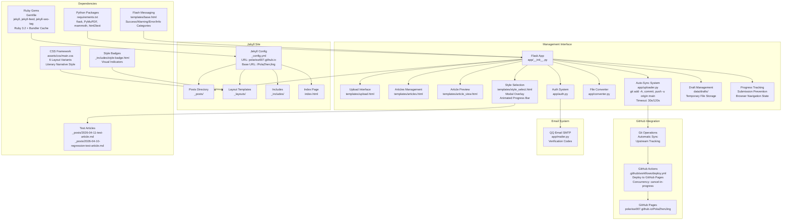
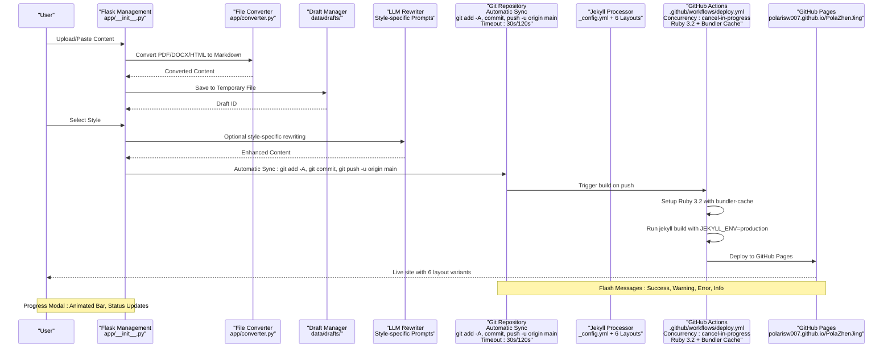
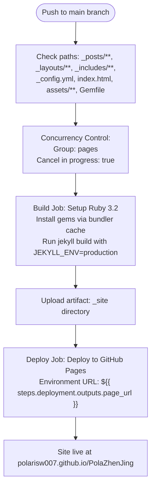
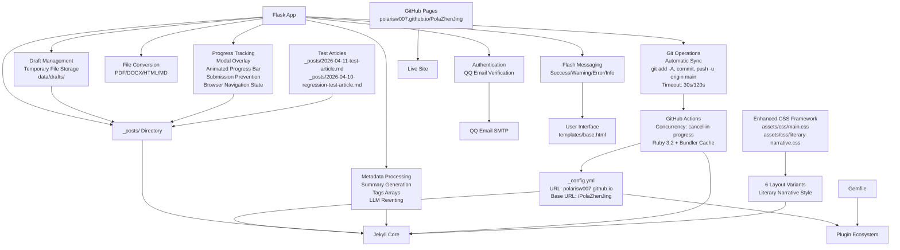

# Publishing Pipeline

<cite>
**Referenced Files in This Document**
- [.github/workflows/deploy.yml](file://.github/workflows/deploy.yml)
- [_config.yml](file://_config.yml)
- [Gemfile](file://Gemfile)
- [app/__init__.py](file://app/__init__.py)
- [app/uploader.py](file://app/uploader.py)
- [app/auth.py](file://app/auth.py)
- [app/converter.py](file://app/converter.py)
- [app/mailer.py](file://app/mailer.py)
- [app/templates/article_view.html](file://app/templates/article_view.html)
- [app/templates/articles.html](file://app/templates/articles.html)
- [app/templates/base.html](file://app/templates/base.html)
- [app/templates/style_select.html](file://app/templates/style_select.html)
- [app/templates/upload.html](file://app/templates/upload.html)
- [index.html](file://index.html)
- [_layouts/default.html](file://_layouts/default.html)
- [_layouts/academic-insight.html](file://_layouts/academic-insight.html)
- [_layouts/creative-visual.html](file://_layouts/creative-visual.html)
- [_layouts/deep-technical.html](file://_layouts/deep-technical.html)
- [_layouts/friendly-explainer.html](file://_layouts/friendly-explainer.html)
- [_layouts/industry-vision.html](file://_layouts/industry-vision.html)
- [_includes/footer.html](file://_includes/footer.html)
- [_includes/style-badge.html](file://_includes/style-badge.html)
- [assets/css/literary-narrative.css](file://assets/css/literary-narrative.css)
- [assets/css/main.css](file://assets/css/main.css)
- [data/drafts/6aa833b7312e.json](file://data/drafts/6aa833b7312e.json)
- [_posts/2026-04-11-test-article.md](file://_posts/2026-04-11-test-article.md)
- [_posts/2026-04-10-regression-test-article.md](file://_posts/2026-04-10-regression-test-article.md)
- [_posts/2026-04-11-ce-shi-shang-chuan-xiu-fu.md](file://_posts/2026-04-11-ce-shi-shang-chuan-xiu-fu.md)
- [PRD.md](file://PRD.md)
</cite>

## Update Summary
**Changes Made**
- Added comprehensive progress tracking and user feedback system for article generation with modal overlay and animated progress bar
- Implemented browser navigation state management to handle page refreshes and back button navigation
- Enhanced draft management system with temporary file storage for article content testing
- Added new test articles for validation and regression testing
- Implemented submission prevention mechanism to avoid duplicate form submissions
- Enhanced user experience with real-time status updates and visual feedback during article generation

## Table of Contents
1. [Introduction](#introduction)
2. [Project Structure](#project-structure)
3. [Core Components](#core-components)
4. [Architecture Overview](#architecture-overview)
5. [Detailed Component Analysis](#detailed-component-analysis)
6. [Dependency Analysis](#dependency-analysis)
7. [Performance Considerations](#performance-considerations)
8. [Troubleshooting Guide](#troubleshooting-guide)
9. [Conclusion](#conclusion)
10. [Appendices](#appendices)

## Introduction
This document explains the publishing pipeline for PolaZhenJing v2, which has been completely redesigned to use Jekyll instead of the previous complex FastAPI-based system. The new pipeline focuses on file-based content generation, automated GitHub Actions deployment, and simplified content management through a lightweight Flask backend. Content is now managed through Jekyll's native `_posts/` directory structure with automatic GitHub Pages deployment and enhanced URL configuration for proper site routing. The system now includes a comprehensive article preview system, GitHub integration for seamless synchronization, and a modern management interface with real-time status indicators, robust error handling, and sophisticated user feedback mechanisms. Recent enhancements include expanded layout variants with literary narrative styling, new metadata fields for enhanced article presentation, improved content creation workflow with automatic summary generation, and a comprehensive progress tracking system with modal overlay and animated progress bar for article generation.

## Project Structure
The publishing pipeline has been streamlined to focus on Jekyll static site generation with automated deployment and enhanced content management:
- Jekyll configuration defines site metadata, build settings, and plugin ecosystem with proper GitHub Pages URL configuration
- GitHub Actions workflow automates the complete build and deployment process to GitHub Pages with enhanced concurrency control
- Flask backend provides comprehensive management interface for content creation, preview, and GitHub synchronization with automatic deployment triggers
- File-based content storage in `_posts/` directory with YAML frontmatter and automatic deployment triggers
- Six distinct blog layouts with custom styling and responsive design, including the new literary narrative style
- Integrated authentication system with QQ email verification for secure access
- Robust flash messaging system for user feedback and error notifications
- Draft management system with temporary file storage for article content testing
- Comprehensive progress tracking system with modal overlay and animated progress bar

**Diagram sources**
- [_config.yml:1-50](file://_config.yml#L1-L50)
- [index.html:1-70](file://index.html#L1-L70)
- [app/__init__.py:43-62](file://app/__init__.py#L43-L62)
- [app/uploader.py:207-224](file://app/uploader.py#L207-L224)
- [app/uploader.py:277-296](file://app/uploader.py#L277-L296)
- [app/auth.py:26-48](file://app/auth.py#L26-L48)
- [app/converter.py:78-92](file://app/converter.py#L78-L92)
- [app/mailer.py:8-53](file://app/mailer.py#L8-L53)
- [.github/workflows/deploy.yml:25-62](file://.github/workflows/deploy.yml#L25-L62)
- [app/templates/base.html:126-131](file://app/templates/base.html#L126-L131)
- [assets/css/main.css:1-522](file://assets/css/main.css#L1-L522)
- [_includes/style-badge.html:1-4](file://_includes/style-badge.html#L1-L4)
- [app/templates/style_select.html:31-41](file://app/templates/style_select.html#L31-L41)
- [data/drafts/6aa833b7312e.json:1-1](file://data/drafts/6aa833b7312e.json#L1-L1)
- [_posts/2026-04-11-test-article.md:1-11](file://_posts/2026-04-11-test-article.md#L1-L11)
- [_posts/2026-04-10-regression-test-article.md:1-15](file://_posts/2026-04-10-regression-test-article.md#L1-L15)

**Section sources**
- [_config.yml:1-50](file://_config.yml#L1-L50)
- [index.html:1-70](file://index.html#L1-L70)
- [app/__init__.py:43-62](file://app/__init__.py#L43-L62)
- [app/uploader.py:207-224](file://app/uploader.py#L207-L224)
- [app/uploader.py:277-296](file://app/uploader.py#L277-L296)
- [app/auth.py:26-48](file://app/auth.py#L26-L48)
- [app/converter.py:78-92](file://app/converter.py#L78-L92)
- [app/mailer.py:8-53](file://app/mailer.py#L8-L53)
- [.github/workflows/deploy.yml:25-62](file://.github/workflows/deploy.yml#L25-L62)
- [Gemfile:1-7](file://Gemfile#L1-L7)
- [assets/css/main.css:1-522](file://assets/css/main.css#L1-L522)
- [_includes/style-badge.html:1-4](file://_includes/style-badge.html#L1-L4)
- [app/templates/style_select.html:31-41](file://app/templates/style_select.html#L31-L41)
- [data/drafts/6aa833b7312e.json:1-1](file://data/drafts/6aa833b7312e.json#L1-L1)
- [_posts/2026-04-11-test-article.md:1-11](file://_posts/2026-04-11-test-article.md#L1-L11)
- [_posts/2026-04-10-regression-test-article.md:1-15](file://_posts/2026-04-10-regression-test-article.md#L1-L15)

## Core Components
- **Jekyll Configuration**: Defines site metadata, build settings, pagination, plugins, and GitHub Pages URL configuration with proper baseurl for repository-based deployment
- **Enhanced GitHub Actions Workflow**: Automates Jekyll build and deployment to GitHub Pages with improved concurrency control, Ruby 3.2/Bundler caching, and comprehensive error handling
- **Flask Management Server**: Provides comprehensive interface for content creation, file uploads, article preview, and integrated git push functionality with timeout protection and flash messaging
- **Article Preview System**: Dedicated endpoint for previewing individual articles with GitHub integration and markdown rendering
- **Automatic GitHub Synchronization**: Seamless synchronization between local content and GitHub repository with automatic deployment triggers and upstream tracking
- **File Conversion Pipeline**: Supports multiple document formats (PDF, DOCX, HTML, Markdown) with intelligent content extraction and formatting
- **Authentication System**: Secure access control with QQ email verification and session management
- **Robust Flash Messaging**: Comprehensive notification system with categorized feedback (success, warning, error, info) for user experience
- **Ruby Gem Dependencies**: Manages Jekyll ecosystem including jekyll-feed, jekyll-seo-tag, and jekyll-paginate for comprehensive site functionality
- **Six Distinct Blog Styles**: Enhanced layouts with unique styling, responsive design, and comprehensive content formatting including the new literary narrative style
- **Enhanced Metadata System**: New summary field generation and improved tags array handling for better article presentation
- **LLM Integration**: Optional content rewriting with style-specific prompts for enhanced article quality
- **Progress Tracking System**: Modal overlay with animated progress bar, real-time status updates, and comprehensive user feedback during article generation
- **Draft Management System**: Temporary file storage for article content testing with automatic cleanup and session management
- **Submission Prevention**: JavaScript-based mechanism to prevent duplicate form submissions during article generation
- **Browser Navigation State Management**: Handles page refreshes and back button navigation with proper state restoration

**Section sources**
- [_config.yml:1-50](file://_config.yml#L1-L50)
- [.github/workflows/deploy.yml:25-62](file://.github/workflows/deploy.yml#L25-L62)
- [app/__init__.py:43-62](file://app/__init__.py#L43-L62)
- [app/uploader.py:207-224](file://app/uploader.py#L207-L224)
- [app/uploader.py:277-296](file://app/uploader.py#L277-L296)
- [app/converter.py:78-92](file://app/converter.py#L78-L92)
- [app/auth.py:26-48](file://app/auth.py#L26-L48)
- [app/templates/base.html:126-131](file://app/templates/base.html#L126-L131)
- [Gemfile:1-7](file://Gemfile#L1-L7)
- [assets/css/literary-narrative.css:1-148](file://assets/css/literary-narrative.css#L1-L148)
- [app/templates/style_select.html:31-41](file://app/templates/style_select.html#L31-L41)
- [app/uploader.py:245-266](file://app/uploader.py#L245-L266)

## Architecture Overview
The new publishing pipeline follows a simplified file-based approach with enhanced deployment automation, comprehensive content management, seamless GitHub integration, and sophisticated user experience features:
- Content creation through Flask management interface with integrated git functionality, file conversion, and draft management
- Automatic Jekyll processing of `_posts/` directory with proper URL configuration and six distinct blog layouts
- GitHub Actions orchestration for build and deployment to GitHub Pages with concurrency control
- Native GitHub Pages integration with custom domain support and baseurl configuration
- Enhanced git push functionality with upstream tracking and timeout protection for improved deployment reliability
- Real-time article preview system with markdown rendering and GitHub integration
- Comprehensive authentication system with QQ email verification for secure access
- Robust flash messaging system for user feedback and error notifications
- Automatic synchronization mechanism that performs git operations with comprehensive error handling
- Enhanced metadata processing with automatic summary generation and improved tags handling
- Literary narrative style integration with specialized CSS styling and content formatting
- Comprehensive progress tracking system with modal overlay and animated progress bar for article generation
- Submission prevention mechanism to avoid duplicate form submissions
- Browser navigation state management for proper page refresh handling
- Draft management system with temporary file storage for article content testing

**Diagram sources**
- [app/__init__.py:43-62](file://app/__init__.py#L43-L62)
- [app/converter.py:78-92](file://app/converter.py#L78-L92)
- [app/uploader.py:374-411](file://app/uploader.py#L374-L411)
- [app/uploader.py:207-224](file://app/uploader.py#L207-L224)
- [app/uploader.py:277-296](file://app/uploader.py#L277-L296)
- [_config.yml:1-50](file://_config.yml#L1-L50)
- [.github/workflows/deploy.yml:25-62](file://.github/workflows/deploy.yml#L25-L62)
- [app/templates/style_select.html:31-41](file://app/templates/style_select.html#L31-L41)
- [app/templates/style_select.html:55-75](file://app/templates/style_select.html#L55-L75)

## Detailed Component Analysis

### Enhanced GitHub Actions Deployment Workflow
The deployment workflow has been significantly improved with enhanced concurrency control, Ruby 3.2/Bundler caching, and comprehensive error handling:
- **Triggers**: Automatic on pushes to main branch targeting site files (`_posts/**`, `_layouts/**`, `_includes/**`, `_config.yml`, `index.html`, `assets/**`, `Gemfile`)
- **Permissions**: Read/write access to pages and ID tokens for secure deployment
- **Enhanced Concurrency Control**: Group-based concurrency with `cancel-in-progress: true` prevents conflicting deployments and ensures only the latest build runs
- **Ruby 3.2 Environment**: Setup Ruby 3.2 with `bundler-cache: true` for optimized dependency installation and faster builds
- **Build Job**: Sets up Ruby environment, installs gems via bundler cache, builds Jekyll site with production environment
- **Deploy Job**: Deploys artifact to GitHub Pages with environment URL reporting for live site verification
- **Error Handling**: Comprehensive error handling for build failures, deployment issues, and git operation timeouts
- **Timeout Protection**: Git push operations have 120-second timeout to prevent hanging operations

**Diagram sources**
- [.github/workflows/deploy.yml:7-18](file://.github/workflows/deploy.yml#L7-L18)
- [.github/workflows/deploy.yml:25-62](file://.github/workflows/deploy.yml#L25-L62)

**Section sources**
- [.github/workflows/deploy.yml:7-18](file://.github/workflows/deploy.yml#L7-L18)
- [.github/workflows/deploy.yml:25-62](file://.github/workflows/deploy.yml#L25-L62)

### Jekyll Configuration and GitHub Pages URL Setup
The Jekyll configuration defines the complete publishing infrastructure with proper GitHub Pages integration:
- **Site Metadata**: Title, description, URL (`https://PolarisW007.github.io`), base URL (`/PolaZhenJing`), and author information
- **Build Settings**: Markdown processor (kramdown), highlighter (rouge), permalink structure, timezone
- **Pagination**: Configured for 10 posts per page with pagination path
- **Plugins**: jekyll-feed for RSS, jekyll-seo-tag for SEO, jekyll-paginate for navigation
- **Defaults**: Automatic layout assignment for posts in `_posts/` directory
- **Exclusions**: Development files, Python cache, and unnecessary directories excluded from build
- **Custom Domain Support**: Base URL configuration enables proper routing for repository-based GitHub Pages deployment

**Updated** Enhanced URL configuration for proper GitHub Pages routing and custom domain support

**Section sources**
- [_config.yml:1-50](file://_config.yml#L1-L50)

### Flask Management Interface with Enhanced Git Integration
The lightweight Flask application provides comprehensive content management capabilities with integrated deployment functionality and sophisticated user experience features:
- **Database Integration**: SQLite-based user authentication and session management
- **Blueprint Registration**: Authentication, upload, and management functionality through blueprints
- **Template System**: Jinja2 templates for management interface with comprehensive styling
- **File Upload**: Handles various document formats for conversion to Markdown
- **Security**: Secret key configuration and content length limits
- **Enhanced Git Integration**: Integrated git push functionality with upstream tracking for reliable deployment, timeout protection for git operations
- **Automatic Synchronization**: Seamless integration between content creation and GitHub deployment with comprehensive error handling
- **Flash Messaging System**: Comprehensive notification system with categorized feedback (success, warning, error, info) for user experience
- **Authentication System**: Secure access control with QQ email verification and session management
- **Article Preview**: Dedicated endpoint for previewing individual articles with GitHub integration
- **Status Indicators**: Real-time status indicators for published/local-only articles
- **Enhanced Metadata Processing**: Automatic summary generation and improved tags array handling
- **LLM Integration**: Optional content rewriting with style-specific prompts for enhanced article quality
- **Draft Management**: Temporary file storage for article content with automatic cleanup and session management
- **Progress Tracking**: Modal overlay with animated progress bar and real-time status updates
- **Submission Prevention**: JavaScript-based mechanism to prevent duplicate form submissions
- **Browser Navigation State**: Handles page refreshes and back button navigation with proper state restoration

**Updated** Enhanced git push functionality with upstream tracking (`-u` flag) and 120-second timeout for improved deployment automation and reliability. Added comprehensive flash messaging system for user feedback and error notifications. Enhanced metadata processing with automatic summary generation and improved tags handling. Implemented comprehensive progress tracking system with modal overlay and animated progress bar. Added draft management system with temporary file storage for article content testing. Implemented submission prevention mechanism and browser navigation state management.

**Section sources**
- [app/__init__.py:1-69](file://app/__init__.py#L1-L69)
- [app/uploader.py:207-224](file://app/uploader.py#L207-L224)
- [app/uploader.py:277-296](file://app/uploader.py#L277-L296)
- [app/auth.py:26-48](file://app/auth.py#L26-L48)
- [app/templates/base.html:126-131](file://app/templates/base.html#L126-L131)
- [app/uploader.py:374-411](file://app/uploader.py#L374-L411)
- [app/templates/style_select.html:31-41](file://app/templates/style_select.html#L31-L41)
- [app/templates/style_select.html:55-75](file://app/templates/style_select.html#L55-L75)
- [app/uploader.py:245-266](file://app/uploader.py#L245-L266)

### Automatic GitHub Synchronization System
The comprehensive auto-sync mechanism provides seamless integration between local content creation and GitHub deployment:
- **Automatic Article Generation**: When creating new articles, the system automatically performs git operations including staging, committing, and pushing to remote origin
- **Manual Synchronization**: Dedicated `/sync` endpoint allows users to manually trigger GitHub synchronization with upstream tracking
- **Git Operations**: Performs `git add -A`, `git commit`, and `git push -u origin main` with comprehensive error handling
- **Timeout Protection**: Strategic timeout limits (30 seconds for add/commit, 120 seconds for push) prevent hanging operations
- **Error Handling**: Comprehensive error handling with detailed feedback for failed operations
- **Flash Message Feedback**: Categorized notifications (success, warning, error) provide clear user feedback
- **Integration Points**: Automatic sync triggered after successful article generation, manual sync available through dedicated endpoint

**Updated** Added comprehensive auto-sync mechanism that performs git operations including staging, committing, and pushing to remote origin with robust error handling and flash message feedback.

**Section sources**
- [app/uploader.py:207-224](file://app/uploader.py#L207-L224)
- [app/uploader.py:277-296](file://app/uploader.py#L277-L296)

### File Conversion Pipeline
The comprehensive file conversion system supports multiple document formats with intelligent content extraction and formatting:
- **PDF Conversion**: Uses PyMuPDF for text extraction with automatic heading detection based on font size and formatting
- **DOCX Conversion**: Converts Microsoft Word documents via mammoth to HTML, then html2text to Markdown
- **HTML Conversion**: Direct conversion from HTML to Markdown with preserved formatting and links
- **Markdown Support**: Direct handling of existing Markdown files with proper content extraction
- **Fallback Mechanisms**: Graceful degradation when conversion libraries are unavailable
- **Title Extraction**: Intelligent title detection from first headings or first lines
- **Content Cleaning**: Automatic cleanup and formatting of extracted content

**Section sources**
- [app/converter.py:7-108](file://app/converter.py#L7-L108)

### Authentication and Authorization System
The secure authentication system provides comprehensive access control with QQ email verification:
- **User Registration**: Username, email, and password management with QQ email requirement
- **Password Security**: Hashed passwords with Werkzeug security utilities
- **Email Verification**: QQ Email SMTP integration for 6-digit verification codes with 5-minute expiration
- **Session Management**: Flask session-based authentication with automatic cleanup
- **Access Control**: Decorator-based route protection with automatic redirection to login
- **Password Management**: Secure password change functionality with validation
- **Logout Functionality**: Clean session termination and redirect to login

**Section sources**
- [app/auth.py:26-168](file://app/auth.py#L26-L168)
- [app/mailer.py:8-53](file://app/mailer.py#L8-L53)

### Article Preview and Management System
The comprehensive article management system provides real-time preview and GitHub integration:
- **Article Listing**: Dynamic management interface showing all posts with metadata and status indicators
- **Individual Preview**: Dedicated endpoint for previewing articles with GitHub integration and markdown rendering
- **GitHub Integration**: Direct links to GitHub for editing and viewing article source
- **Status Indicators**: Visual indicators for published (green dot) and local-only (yellow dot) articles
- **Action Controls**: Delete functionality with confirmation prompts
- **Metadata Display**: Title, date, style badge, tags, and description in preview interface
- **Responsive Design**: Mobile-friendly interface with comprehensive styling system
- **Enhanced Metadata Display**: Summary field and improved tags array visualization

**Section sources**
- [app/uploader.py:238-262](file://app/uploader.py#L238-L262)
- [app/templates/articles.html:1-64](file://app/templates/articles.html#L1-L64)
- [app/templates/article_view.html:1-46](file://app/templates/article_view.html#L1-L46)

### Enhanced Content Display and Layout System
The Jekyll layout system provides flexible content presentation with proper URL handling and six distinct blog styles:
- **Default Layout**: Base HTML structure with header, main content, and footer includes
- **Six Distinct Styles**: Deep Technical, Academic Insight, Industry Vision, Friendly Explainer, Creative Visual, Literary Narrative
- **Index Template**: Dynamic content listing with pagination and styling using configured base URL
- **Footer Includes**: Social links and RSS feed integration with proper URL resolution
- **Liquid Templating**: Powerful template engine for dynamic content rendering with GitHub Pages compatibility
- **Style Badges**: Visual indicators for article styles with custom colors and formatting
- **Responsive Design**: Mobile-first approach with comprehensive styling system
- **Literary Narrative Style**: Specialized CSS styling with poetic prose, imagery-driven aesthetics, and traditional Chinese typography
- **Enhanced Metadata Display**: Improved handling of summary fields and tags arrays across all layouts

**Updated** Expanded from 5 to 6 distinct blog styles with the addition of literary narrative style featuring specialized CSS for poetic content presentation.

**Section sources**
- [_layouts/default.html:1-12](file://_layouts/default.html#L1-L12)
- [_layouts/academic-insight.html:1-27](file://_layouts/academic-insight.html#L1-L27)
- [_layouts/creative-visual.html:1-20](file://_layouts/creative-visual.html#L1-L20)
- [_layouts/deep-technical.html:1-22](file://_layouts/deep-technical.html#L1-L22)
- [_layouts/friendly-explainer.html:1-26](file://_layouts/friendly-explainer.html#L1-L26)
- [_layouts/industry-vision.html:1-20](file://_layouts/industry-vision.html#L1-L20)
- [index.html:1-70](file://index.html#L1-L70)
- [_includes/footer.html:1-9](file://_includes/footer.html#L1-L9)
- [_includes/style-badge.html:1-4](file://_includes/style-badge.html#L1-L4)
- [assets/css/literary-narrative.css:1-148](file://assets/css/literary-narrative.css#L1-L148)
- [assets/css/main.css:401-417](file://assets/css/main.css#L401-L417)

### Ruby Gem Dependencies
The Ruby gem ecosystem provides essential Jekyll functionality with proper version constraints:
- **Core Jekyll**: Static site generator version 4.3 with Ruby 3.2 compatibility
- **Feed Plugin**: Automatic RSS feed generation (version 0.17)
- **SEO Plugin**: Comprehensive SEO metadata support (version 2.8)
- **Pagination Plugin**: Multi-page navigation for posts (version 1.1)
- **Bundler Cache**: Optimized dependency installation via bundler cache for faster builds

**Section sources**
- [Gemfile:1-7](file://Gemfile#L1-L7)

### Enhanced Metadata and Article Processing System
The comprehensive metadata system provides rich article presentation capabilities:
- **Frontmatter Generation**: Automatic YAML frontmatter creation with layout, title, date, tags, and description fields
- **Summary Field**: Automatic summary generation from article content with proper YAML escaping
- **Tags Array Handling**: Improved parsing and formatting of tag arrays for better article categorization
- **Style-Specific Processing**: Enhanced content rewriting with LLM integration for style-consistent improvements
- **Filename Generation**: Automatic slug-based filename creation from article titles
- **Content Enhancement**: Optional LLM rewriting with style-specific prompts for improved article quality
- **Metadata Validation**: Comprehensive validation and sanitization of all metadata fields

**Updated** Enhanced metadata processing with automatic summary generation, improved tags array handling, and optional LLM content rewriting for style-consistent improvements.

**Section sources**
- [app/uploader.py:374-411](file://app/uploader.py#L374-L411)
- [PRD.md:587-609](file://PRD.md#L587-L609)

### Flash Messaging and User Feedback System
The comprehensive flash messaging system provides clear user feedback and error notifications:
- **Message Categories**: Success (green), Warning (orange), Error (red), Info (blue) notifications
- **Integration Points**: Used throughout the application for user feedback on operations
- **Automatic Sync Feedback**: Provides clear notifications for successful synchronization, warnings for partial failures, and errors for complete failures
- **Article Creation Feedback**: Notifies users of successful article creation and synchronization status
- **Error Context**: Provides specific error messages for debugging and user guidance
- **Visual Styling**: Custom CSS styling for different message categories with appropriate colors and borders

**Updated** Added comprehensive flash messaging system with categorized notifications for enhanced user experience and clear feedback on all operations.

**Section sources**
- [app/templates/base.html:126-131](file://app/templates/base.html#L126-L131)
- [app/uploader.py:218-223](file://app/uploader.py#L218-L223)
- [app/uploader.py:290-295](file://app/uploader.py#L290-L295)

### Comprehensive Progress Tracking and User Feedback System
The sophisticated progress tracking system provides comprehensive user feedback during article generation with modal overlay and animated progress bar:
- **Modal Overlay**: Fixed-position overlay with dark background covering entire viewport during article generation
- **Animated Progress Bar**: Linear gradient progress bar with smooth width transitions and percentage display
- **Real-time Status Updates**: Dynamic status text showing current phase of article generation process
- **Fake but Reassuring Animation**: Progressive speed reduction as completion approaches 95% for realistic feel
- **Submission Prevention**: JavaScript-based mechanism preventing duplicate form submissions during generation
- **Browser Navigation State**: Handles page refreshes and back button navigation with proper state restoration
- **User Experience Enhancement**: Provides clear visual feedback and prevents user confusion during long operations
- **Integration Points**: Seamlessly integrated into style selection workflow with automatic activation on form submission

**Updated** Added comprehensive progress tracking system with modal overlay containing animated progress bar, real-time status updates, and sophisticated user feedback mechanisms. Implemented submission prevention to avoid duplicate form submissions and browser navigation state management for proper page refresh handling.

**Section sources**
- [app/templates/style_select.html:31-41](file://app/templates/style_select.html#L31-L41)
- [app/templates/style_select.html:55-75](file://app/templates/style_select.html#L55-L75)
- [app/templates/style_select.html:77-129](file://app/templates/style_select.html#L77-L129)

### Draft Management System for Article Content Testing
The comprehensive draft management system provides temporary storage for article content with automatic cleanup and session management:
- **Temporary File Storage**: JSON files stored in `data/drafts/` directory with unique MD5-based filenames
- **Automatic Cleanup**: Draft files are automatically deleted after successful article generation
- **Session Integration**: Draft ID stored in Flask session for seamless user experience
- **Content Preservation**: Complete article content, title, tags, and description stored in structured format
- **Size Limit Workaround**: Avoids session cookie size limitations by using temporary files
- **Testing Infrastructure**: Supports validation and regression testing with persistent test content
- **Integration Points**: Seamless integration with upload and style selection workflows

**Updated** Added comprehensive draft management system with temporary file storage for article content testing, automatic cleanup, and session integration to avoid cookie size limitations.

**Section sources**
- [app/uploader.py:245-266](file://app/uploader.py#L245-L266)
- [data/drafts/6aa833b7312e.json:1-1](file://data/drafts/6aa833b7312e.json#L1-L1)

### Enhanced Test Articles for Validation and Regression Testing
The system includes comprehensive test articles for validation and regression testing purposes:
- **Test Article**: Simple test content with summary field for basic functionality validation
- **Regression Test Article**: More complex content with tags and markdown formatting for comprehensive testing
- **Upload Fix Test**: Technical content demonstrating upload process validation
- **Validation Infrastructure**: Persistent test content for continuous integration and quality assurance
- **Integration Testing**: Supports automated testing of article generation workflow
- **Content Testing**: Validates metadata processing, summary generation, and content formatting

**Updated** Added comprehensive test articles for validation and regression testing, including simple test content, complex regression test content, and technical upload fix validation.

**Section sources**
- [_posts/2026-04-11-test-article.md:1-11](file://_posts/2026-04-11-test-article.md#L1-L11)
- [_posts/2026-04-10-regression-test-article.md:1-15](file://_posts/2026-04-10-regression-test-article.md#L1-L15)
- [_posts/2026-04-11-ce-shi-shang-chuan-xiu-fu.md:1-14](file://_posts/2026-04-11-ce-shi-shang-chuan-xiu-fu.md#L1-L14)

## Dependency Analysis
The new architecture maintains clean separation between components with enhanced deployment automation, comprehensive content management, seamless GitHub integration, and sophisticated user experience features:
- **Configuration-Driven**: Jekyll configuration controls build process, site behavior, and GitHub Pages URL routing
- **Automated Deployment**: GitHub Actions handles build and deployment without manual intervention, with enhanced concurrency control and error handling
- **Comprehensive Management**: Flask provides full-featured content management with integrated git functionality, file conversion, authentication, and progress tracking
- **Automatic Synchronization**: Seamless integration between content creation and GitHub deployment with comprehensive error handling
- **File Conversion Pipeline**: Multiple document formats supported with intelligent content extraction and formatting
- **GitHub Integration**: Seamless synchronization between local content and GitHub repository with automatic deployment triggers
- **Authentication System**: Secure access control with QQ email verification and session management
- **Flash Messaging System**: Comprehensive notification system providing user feedback across all operations
- **Ruby Ecosystem**: Gems manage site functionality and plugins independently with version constraints and bundler cache optimization
- **Git Integration**: Enhanced git operations with upstream tracking and timeout protection for reliable deployment automation
- **Enhanced Layout System**: Six distinct blog styles with specialized CSS for different content types and presentation needs
- **Metadata Processing**: Advanced metadata handling with automatic summary generation and improved tags management
- **Progress Tracking System**: Sophisticated user feedback mechanisms with modal overlay and animated progress bar
- **Draft Management**: Temporary file storage system for article content testing and validation
- **Submission Prevention**: JavaScript-based mechanism preventing duplicate form submissions
- **Browser Navigation State**: Handles page refreshes and back button navigation with proper state restoration

**Diagram sources**
- [_config.yml:1-50](file://_config.yml#L1-L50)
- [Gemfile:1-7](file://Gemfile#L1-L7)
- [app/__init__.py:43-62](file://app/__init__.py#L43-L62)
- [app/uploader.py:207-224](file://app/uploader.py#L207-L224)
- [app/uploader.py:277-296](file://app/uploader.py#L277-L296)
- [app/auth.py:26-48](file://app/auth.py#L26-L48)
- [app/converter.py:78-92](file://app/converter.py#L78-L92)
- [app/mailer.py:8-53](file://app/mailer.py#L8-L53)
- [app/templates/base.html:126-131](file://app/templates/base.html#L126-L131)
- [app/uploader.py:374-411](file://app/uploader.py#L374-L411)
- [app/templates/style_select.html:31-41](file://app/templates/style_select.html#L31-L41)
- [app/uploader.py:245-266](file://app/uploader.py#L245-L266)
- [.github/workflows/deploy.yml:25-62](file://.github/workflows/deploy.yml#L25-L62)
- [assets/css/main.css:1-522](file://assets/css/main.css#L1-L522)
- [assets/css/literary-narrative.css:1-148](file://assets/css/literary-narrative.css#L1-L148)
- [_posts/2026-04-11-test-article.md:1-11](file://_posts/2026-04-11-test-article.md#L1-L11)
- [_posts/2026-04-10-regression-test-article.md:1-15](file://_posts/2026-04-10-regression-test-article.md#L1-L15)

**Section sources**
- [_config.yml:1-50](file://_config.yml#L1-L50)
- [Gemfile:1-7](file://Gemfile#L1-L7)
- [app/__init__.py:43-62](file://app/__init__.py#L43-L62)
- [app/uploader.py:207-224](file://app/uploader.py#L207-L224)
- [app/uploader.py:277-296](file://app/uploader.py#L277-L296)
- [app/auth.py:26-48](file://app/auth.py#L26-L48)
- [app/converter.py:78-92](file://app/converter.py#L78-L92)
- [app/mailer.py:8-53](file://app/mailer.py#L8-L53)
- [app/templates/base.html:126-131](file://app/templates/base.html#L126-L131)
- [app/uploader.py:374-411](file://app/uploader.py#L374-L411)
- [app/templates/style_select.html:31-41](file://app/templates/style_select.html#L31-L41)
- [app/uploader.py:245-266](file://app/uploader.py#L245-L266)
- [.github/workflows/deploy.yml:25-62](file://.github/workflows/deploy.yml#L25-L62)
- [assets/css/main.css:1-522](file://assets/css/main.css#L1-L522)
- [assets/css/literary-narrative.css:1-148](file://assets/css/literary-narrative.css#L1-L148)
- [_posts/2026-04-11-test-article.md:1-11](file://_posts/2026-04-11-test-article.md#L1-L11)
- [_posts/2026-04-10-regression-test-article.md:1-15](file://_posts/2026-04-10-regression-test-article.md#L1-L15)

## Performance Considerations
- **Build Speed**: Jekyll builds are typically faster than complex backend systems, with typical completion under 10 seconds for small to medium sites
- **Deployment Automation**: GitHub Actions eliminates manual deployment steps and reduces human error with enhanced concurrency control and error handling
- **Resource Efficiency**: Single-container deployment vs. multi-service architecture significantly reduces resource consumption
- **Caching Strategy**: GitHub Pages provides CDN caching for improved load times, enhanced by proper base URL configuration and bundler cache optimization
- **Development Simplicity**: Reduced complexity leads to fewer maintenance overhead and easier troubleshooting
- **Git Optimization**: Upstream tracking (`-u` flag) improves git operation reliability and reduces manual configuration overhead
- **Bundle Caching**: Ruby bundler cache significantly speeds up dependency installation in GitHub Actions with Ruby 3.2 optimization
- **Concurrency Control**: Cancel-in-progress concurrency prevents redundant builds and optimizes resource utilization
- **Timeout Protection**: Strategic timeout limits prevent hanging operations and improve system reliability
- **File Conversion**: Efficient conversion pipeline with fallback mechanisms for optimal performance
- **Authentication**: Session-based authentication reduces database overhead and improves response times
- **Flash Messaging**: Lightweight notification system with minimal performance impact
- **Automatic Synchronization**: Background git operations with timeout protection prevent blocking user interactions
- **Enhanced Layout Rendering**: Six distinct layouts with specialized CSS may increase initial load time but provide better user experience
- **Metadata Processing**: Automatic summary generation adds processing overhead but enhances article presentation quality
- **LLM Integration**: Optional content rewriting may add latency but improves content quality
- **Progress Tracking**: Modal overlay and animated progress bar have minimal performance impact with smooth CSS transitions
- **Draft Management**: Temporary file storage has negligible performance impact compared to session cookie limitations
- **Submission Prevention**: JavaScript-based mechanism has minimal client-side performance impact
- **Browser Navigation State**: Event listeners have minimal memory footprint and efficient cleanup

## Troubleshooting Guide
Common issues and resolutions:
- **Build Failures**: Check GitHub Actions logs for Jekyll build errors; verify Gemfile dependencies and Jekyll configuration; ensure proper base URL configuration
- **Missing Content**: Ensure posts are placed in correct `_posts/` directory with proper YAML frontmatter format; verify file permissions
- **Plugin Issues**: Verify all required gems are specified in Gemfile and installed during build process; check version compatibility
- **Deployment Delays**: GitHub Pages may have propagation delays; wait up to 10 minutes for changes to appear; check environment URL reporting
- **Authentication Problems**: Check Flask app configuration and database initialization for management interface access; verify QQ email SMTP settings
- **Git Push Failures**: Verify upstream tracking configuration; check remote repository access; ensure proper git credentials setup; monitor timeout limits
- **URL Routing Issues**: Verify base URL configuration in `_config.yml`; ensure proper GitHub Pages settings for repository-based deployment
- **Concurrency Conflicts**: Check if multiple concurrent builds are being cancelled; verify group-based concurrency settings
- **Bundler Cache Issues**: Clear bundler cache if dependency installation fails; verify Ruby 3.2 compatibility
- **File Conversion Errors**: Verify conversion libraries are installed; check file format support; review conversion logs
- **Email Verification Issues**: Check QQ email SMTP configuration; verify authentication code; ensure proper email format
- **Article Preview Problems**: Verify article exists in `_posts/` directory; check frontmatter format; ensure proper markdown rendering
- **Flash Message Issues**: Verify flash messaging system is properly configured in base template; check message categories and styling
- **Automatic Sync Failures**: Check git credentials and remote repository access; verify timeout limits are appropriate; review flash message feedback
- **Layout Rendering Issues**: Verify CSS files are properly loaded; check layout names match available variants; ensure proper style badge rendering
- **Metadata Processing Errors**: Check YAML frontmatter syntax; verify summary field escaping; ensure tags arrays are properly formatted
- **LLM Integration Failures**: Verify API access and prompt configuration; check for rate limiting; ensure content rewriting is optional
- **Progress Tracking Issues**: Verify modal overlay CSS is properly loaded; check JavaScript event listeners; ensure animation timing is correct
- **Draft Management Problems**: Check temporary file permissions; verify draft cleanup after article generation; ensure session integration works
- **Submission Prevention Failures**: Verify JavaScript prevents duplicate form submissions; check event listener cleanup; ensure proper state management
- **Browser Navigation State Issues**: Check pageshow event handling; verify state restoration on refresh; ensure proper cleanup of DOM modifications

Operational checks:
- **Health Verification**: Access site URL (`polarisw007.github.io/PolaZhenJing`) to confirm GitHub Pages deployment success
- **Build Logs**: Monitor GitHub Actions workflow for build status and error messages
- **Content Validation**: Verify YAML frontmatter format and post filename conventions
- **Git Status**: Check git operations status and upstream tracking configuration
- **Environment Variables**: Verify SECRET_KEY and other required environment variables are properly configured
- **Concurrency Monitoring**: Check if builds are being cancelled due to concurrent operations
- **Timeout Verification**: Monitor git push operations for timeout issues
- **Authentication Testing**: Verify login functionality and email verification process
- **File Conversion Testing**: Test conversion of various document formats
- **GitHub Integration**: Verify synchronization between local content and GitHub repository
- **Flash Message Testing**: Verify proper display of success, warning, error, and info notifications
- **Automatic Sync Testing**: Test automatic synchronization after article creation and manual sync endpoint
- **Layout Testing**: Verify all six layout variants render correctly with proper styling
- **Metadata Testing**: Test automatic summary generation and tags array processing
- **LLM Integration Testing**: Verify optional content rewriting functionality works correctly
- **Progress Tracking Testing**: Verify modal overlay displays correctly; check animated progress bar functionality
- **Draft Management Testing**: Verify temporary file storage and cleanup; check session integration
- **Submission Prevention Testing**: Verify duplicate form submission prevention; check event listener cleanup
- **Browser Navigation Testing**: Verify state restoration on page refresh; check proper cleanup of DOM modifications

**Section sources**
- [.github/workflows/deploy.yml:25-62](file://.github/workflows/deploy.yml#L25-L62)
- [_config.yml:1-50](file://_config.yml#L1-L50)
- [app/uploader.py:207-224](file://app/uploader.py#L207-L224)
- [app/uploader.py:277-296](file://app/uploader.py#L277-L296)
- [app/auth.py:26-48](file://app/auth.py#L26-L48)
- [app/converter.py:78-92](file://app/converter.py#L78-L92)
- [app/mailer.py:8-53](file://app/mailer.py#L8-L53)
- [app/templates/base.html:126-131](file://app/templates/base.html#L126-L131)
- [assets/css/literary-narrative.css:1-148](file://assets/css/literary-narrative.css#L1-L148)
- [app/templates/style_select.html:31-41](file://app/templates/style_select.html#L31-L41)
- [app/uploader.py:245-266](file://app/uploader.py#L245-L266)

## Conclusion
The PolaZhenJing publishing pipeline has been successfully simplified from a complex FastAPI-based system to a streamlined Jekyll workflow with significantly enhanced deployment automation, comprehensive content management capabilities, and sophisticated user experience features. The new architecture leverages GitHub Actions for automated deployment with improved concurrency control, Ruby 3.2/Bundler caching for better performance, and comprehensive error handling. The lightweight Flask interface provides full-featured content management with integrated git functionality featuring timeout protection and upstream tracking, while the new article preview system offers seamless GitHub integration and real-time content validation. The enhanced GitHub Pages URL configuration ensures proper routing for repository-based deployment, while the improved git push functionality with timeout limits provides reliable deployment automation. The comprehensive file conversion pipeline supports multiple document formats, the authentication system provides secure access control with QQ email verification, and the six distinct blog layouts offer flexible content presentation including the new literary narrative style. Most importantly, the new automatic synchronization system provides seamless integration between content creation and GitHub deployment with comprehensive error handling and flash message feedback, significantly improving the user experience and operational reliability. The enhanced metadata processing system with automatic summary generation and improved tags handling provides richer article presentation capabilities. The optional LLM integration offers content enhancement with style-consistent improvements. The comprehensive progress tracking system with modal overlay and animated progress bar provides sophisticated user feedback during article generation, while the draft management system with temporary file storage addresses session cookie size limitations and supports content testing. The submission prevention mechanism and browser navigation state management ensure robust user experience even during page refreshes and back button navigation. The new test articles provide comprehensive validation and regression testing infrastructure. This redesign significantly reduces complexity while maintaining powerful blogging capabilities with automatic GitHub Pages hosting, comprehensive error handling, optimized build performance through bundler cache utilization, seamless GitHub integration for efficient content management and deployment, and sophisticated user experience features that enhance both usability and reliability.

## Appendices

### Enhanced GitHub Actions Workflow Features
- **Automatic Triggers**: Build and deploy on pushes to main branch with comprehensive path filtering
- **Permission Management**: Controlled access to GitHub Pages resources with proper security permissions
- **Advanced Concurrency Control**: Group-based concurrency with `cancel-in-progress: true` prevents conflicting deployments
- **Ruby 3.2 Optimization**: Setup Ruby 3.2 with `bundler-cache: true` for faster dependency installation
- **Artifact Management**: Proper site artifact handling for deployment with _site directory
- **Environment Configuration**: GitHub Pages integration with URL reporting for live site verification
- **Comprehensive Error Handling**: Built-in error handling for build and deployment failures
- **Timeout Protection**: Strategic timeout limits for git operations (120 seconds for push)

**Section sources**
- [.github/workflows/deploy.yml:7-18](file://.github/workflows/deploy.yml#L7-L18)
- [.github/workflows/deploy.yml:25-62](file://.github/workflows/deploy.yml#L25-L62)

### Jekyll Configuration Highlights
- **Site Metadata**: Title, description, URL (`https://PolarisW007.github.io`), base URL (`/PolaZhenJing`), author information
- **Build Settings**: Markdown processor, highlighter, permalink structure, timezone
- **Pagination**: 10 posts per page with pagination path
- **Plugins**: jekyll-feed (0.17), jekyll-seo-tag (2.8), jekyll-paginate (1.1)
- **Defaults**: Automatic layout assignment for posts
- **Exclusions**: development and cache files excluded from build
- **GitHub Pages Integration**: Proper URL configuration for repository-based deployment

**Section sources**
- [_config.yml:1-50](file://_config.yml#L1-L50)

### Ruby Gem Dependencies
- **Core**: Jekyll 4.3 for static site generation with Ruby 3.2 compatibility
- **Feed**: jekyll-feed 0.17 for RSS functionality
- **SEO**: jekyll-seo-tag 2.8 for search engine optimization
- **Pagination**: jekyll-paginate 1.1 for multi-page navigation
- **Bundler Cache**: Optimized dependency installation for faster builds

**Section sources**
- [Gemfile:1-7](file://Gemfile#L1-L7)

### Comprehensive Content Management Interface
- **Authentication**: SQLite-based user management with Flask sessions and QQ email verification
- **Upload Handling**: Support for multiple document formats with conversion pipeline
- **Template System**: Jinja2 templates for management interface with comprehensive styling
- **Security**: Configurable secret key and content limits
- **Git Integration**: Enhanced git operations with upstream tracking and timeout protection for reliable deployment
- **Article Preview**: Dedicated endpoint for previewing individual articles with GitHub integration
- **Status Indicators**: Real-time visual indicators for article publication status
- **Action Controls**: Delete functionality with confirmation prompts
- **Flash Messaging**: Comprehensive notification system with categorized feedback
- **Enhanced Metadata Processing**: Automatic summary generation and improved tags array handling
- **LLM Integration**: Optional content rewriting with style-specific prompts
- **Progress Tracking**: Modal overlay with animated progress bar and real-time status updates
- **Draft Management**: Temporary file storage for article content testing
- **Submission Prevention**: JavaScript-based mechanism preventing duplicate form submissions
- **Browser Navigation State**: Handles page refreshes and back button navigation with proper state restoration

**Section sources**
- [app/__init__.py:1-69](file://app/__init__.py#L1-L69)
- [app/uploader.py:207-224](file://app/uploader.py#L207-L224)
- [app/uploader.py:277-296](file://app/uploader.py#L277-L296)
- [app/auth.py:26-48](file://app/auth.py#L26-L48)
- [app/templates/base.html:126-131](file://app/templates/base.html#L126-L131)
- [app/uploader.py:374-411](file://app/uploader.py#L374-L411)
- [app/templates/style_select.html:31-41](file://app/templates/style_select.html#L31-L41)
- [app/uploader.py:245-266](file://app/uploader.py#L245-L266)

### Enhanced Git Push Functionality
- **Upstream Tracking**: Git push with `-u` flag establishes upstream relationship for improved deployment automation
- **Timeout Protection**: 120-second timeout prevents hanging git operations and improves system reliability
- **Error Handling**: Comprehensive error handling for git operations with user feedback
- **Integration**: Seamless integration with Flask management interface for one-click deployment
- **Reliability**: Upstream tracking and timeout protection improve git operation reliability and reduce manual configuration
- **Automatic Synchronization**: Seamless integration between content creation and GitHub deployment

**Section sources**
- [app/uploader.py:207-224](file://app/uploader.py#L207-L224)
- [app/uploader.py:277-296](file://app/uploader.py#L277-L296)

### Automatic Synchronization System Features
- **Automatic Article Generation**: Seamless git operations after successful article creation
- **Manual Synchronization**: Dedicated `/sync` endpoint for user-initiated GitHub synchronization
- **Git Operations**: Staged changes, commit with timestamp, push with upstream tracking
- **Timeout Management**: Strategic timeout limits (30s for add/commit, 120s for push)
- **Error Handling**: Comprehensive error handling with detailed user feedback
- **Flash Message Integration**: Categorized notifications for success, warning, and error states
- **Integration Points**: Automatic sync after article generation, manual sync endpoint

**Updated** Added comprehensive auto-sync mechanism with automatic article generation and manual synchronization capabilities.

**Section sources**
- [app/uploader.py:207-224](file://app/uploader.py#L207-L224)
- [app/uploader.py:277-296](file://app/uploader.py#L277-L296)

### File Conversion Pipeline Features
- **Multi-format Support**: PDF, DOCX, HTML, and Markdown conversion with intelligent content extraction
- **PDF Processing**: PyMuPDF integration with automatic heading detection and text extraction
- **DOCX Conversion**: Mammoth and html2text integration for rich document processing
- **HTML Processing**: Direct conversion with preserved formatting and links
- **Fallback Mechanisms**: Graceful degradation when conversion libraries are unavailable
- **Title Extraction**: Intelligent title detection from document content
- **Content Cleaning**: Automatic formatting and cleanup of extracted content

**Section sources**
- [app/converter.py:7-108](file://app/converter.py#L7-L108)

### Authentication System Features
- **User Registration**: Username, email, and password management with QQ email requirement
- **Password Security**: Hashed passwords with Werkzeug security utilities
- **Email Verification**: QQ Email SMTP integration for 6-digit verification codes with 5-minute expiration
- **Session Management**: Flask session-based authentication with automatic cleanup
- **Access Control**: Decorator-based route protection with automatic redirection to login
- **Password Management**: Secure password change functionality with validation
- **Logout Functionality**: Clean session termination and redirect to login

**Section sources**
- [app/auth.py:26-168](file://app/auth.py#L26-L168)
- [app/mailer.py:8-53](file://app/mailer.py#L8-L53)

### Enhanced Article Preview and Management System Features
- **Real-time Listing**: Dynamic management interface showing all posts with metadata and status indicators
- **Individual Preview**: Dedicated endpoint for previewing articles with GitHub integration and markdown rendering
- **GitHub Integration**: Direct links to GitHub for editing and viewing article source
- **Status Indicators**: Visual indicators for published (green dot) and local-only (yellow dot) articles
- **Action Controls**: Delete functionality with confirmation prompts
- **Metadata Display**: Title, date, style badge, tags, and description in preview interface
- **Responsive Design**: Mobile-friendly interface with comprehensive styling system
- **Enhanced Metadata Display**: Summary field and improved tags array visualization

**Section sources**
- [app/uploader.py:238-262](file://app/uploader.py#L238-L262)
- [app/templates/articles.html:1-64](file://app/templates/articles.html#L1-L64)
- [app/templates/article_view.html:1-46](file://app/templates/article_view.html#L1-L46)

### Enhanced Metadata and Article Processing Features
- **Frontmatter Generation**: Automatic YAML frontmatter creation with layout, title, date, tags, and description fields
- **Summary Field**: Automatic summary generation from article content with proper YAML escaping
- **Tags Array Handling**: Improved parsing and formatting of tag arrays for better article categorization
- **Style-Specific Processing**: Enhanced content rewriting with LLM integration for style-consistent improvements
- **Filename Generation**: Automatic slug-based filename creation from article titles
- **Content Enhancement**: Optional LLM rewriting with style-specific prompts for improved article quality
- **Metadata Validation**: Comprehensive validation and sanitization of all metadata fields

**Updated** Enhanced metadata processing with automatic summary generation, improved tags array handling, and optional LLM content rewriting for style-consistent improvements.

**Section sources**
- [app/uploader.py:374-411](file://app/uploader.py#L374-L411)
- [PRD.md:587-609](file://PRD.md#L587-L609)

### Flash Messaging System Features
- **Message Categories**: Success (green), Warning (orange), Error (red), Info (blue) notifications
- **Integration Points**: Used throughout application for user feedback on operations
- **Automatic Sync Feedback**: Provides clear notifications for successful synchronization, warnings for partial failures, and errors for complete failures
- **Article Creation Feedback**: Notifies users of successful article creation and synchronization status
- **Error Context**: Provides specific error messages for debugging and user guidance
- **Visual Styling**: Custom CSS styling for different message categories with appropriate colors and borders

**Updated** Added comprehensive flash messaging system with categorized notifications for enhanced user experience and clear feedback on all operations.

**Section sources**
- [app/templates/base.html:126-131](file://app/templates/base.html#L126-L131)

### Enhanced Layout System and Styling Features
- **Six Distinct Layouts**: Deep Technical, Academic Insight, Industry Vision, Friendly Explainer, Creative Visual, Literary Narrative
- **Specialized CSS**: Each layout has dedicated CSS styling with unique design elements
- **Literary Narrative Style**: Poetic prose styling with traditional Chinese typography and imagery-driven aesthetics
- **Responsive Design**: Mobile-first approach with comprehensive styling system across all layouts
- **Style Badges**: Visual indicators for article styles with custom colors and formatting
- **Typography Integration**: Specialized fonts and typography for different content types
- **Content Formatting**: Enhanced content formatting with drop-caps, blockquotes, and specialized styling elements

**Updated** Expanded from 5 to 6 distinct blog styles with the addition of literary narrative style featuring specialized CSS for poetic content presentation.

**Section sources**
- [_layouts/academic-insight.html:1-27](file://_layouts/academic-insight.html#L1-L27)
- [_layouts/creative-visual.html:1-20](file://_layouts/creative-visual.html#L1-L20)
- [_layouts/deep-technical.html:1-22](file://_layouts/deep-technical.html#L1-L22)
- [_layouts/friendly-explainer.html:1-26](file://_layouts/friendly-explainer.html#L1-L26)
- [_layouts/industry-vision.html:1-20](file://_layouts/industry-vision.html#L1-L20)
- [_includes/style-badge.html:1-4](file://_includes/style-badge.html#L1-L4)
- [assets/css/literary-narrative.css:1-148](file://assets/css/literary-narrative.css#L1-L148)
- [assets/css/main.css:401-417](file://assets/css/main.css#L401-L417)

### Comprehensive Progress Tracking System Features
- **Modal Overlay**: Fixed-position overlay with dark background and centered content
- **Animated Progress Bar**: Linear gradient bar with smooth width transitions and percentage display
- **Real-time Status Updates**: Dynamic status text showing current phase of article generation
- **Fake but Reassuring Animation**: Progressive speed reduction approaching completion
- **Submission Prevention**: JavaScript-based mechanism preventing duplicate form submissions
- **Browser Navigation State**: Handles page refreshes and back button navigation with proper state restoration
- **Integration Points**: Seamless integration with style selection workflow
- **User Experience Enhancement**: Provides clear visual feedback during long operations

**Updated** Added comprehensive progress tracking system with modal overlay containing animated progress bar, real-time status updates, and sophisticated user feedback mechanisms.

**Section sources**
- [app/templates/style_select.html:31-41](file://app/templates/style_select.html#L31-L41)
- [app/templates/style_select.html:55-75](file://app/templates/style_select.html#L55-L75)
- [app/templates/style_select.html:77-129](file://app/templates/style_select.html#L77-L129)

### Draft Management System Features
- **Temporary File Storage**: JSON files with unique MD5-based filenames in data/drafts/
- **Automatic Cleanup**: Files deleted after successful article generation
- **Session Integration**: Draft ID stored in Flask session for seamless experience
- **Content Preservation**: Complete article content, title, tags, and description
- **Size Limit Workaround**: Avoids session cookie size limitations
- **Testing Infrastructure**: Supports validation and regression testing
- **Integration Points**: Seamless integration with upload and style selection workflows

**Updated** Added comprehensive draft management system with temporary file storage for article content testing, automatic cleanup, and session integration.

**Section sources**
- [app/uploader.py:245-266](file://app/uploader.py#L245-L266)
- [data/drafts/6aa833b7312e.json:1-1](file://data/drafts/6aa833b7312e.json#L1-L1)

### Enhanced Test Articles Features
- **Test Article**: Simple content with summary field for basic validation
- **Regression Test Article**: Complex content with tags and markdown formatting
- **Upload Fix Test**: Technical content for upload process validation
- **Validation Infrastructure**: Persistent test content for continuous integration
- **Integration Testing**: Supports automated testing of article generation workflow
- **Content Testing**: Validates metadata processing and formatting

**Updated** Added comprehensive test articles for validation and regression testing, including simple test content, complex regression test content, and technical upload fix validation.

**Section sources**
- [_posts/2026-04-11-test-article.md:1-11](file://_posts/2026-04-11-test-article.md#L1-L11)
- [_posts/2026-04-10-regression-test-article.md:1-15](file://_posts/2026-04-10-regression-test-article.md#L1-L15)
- [_posts/2026-04-11-ce-shi-shang-chuan-xiu-fu.md:1-14](file://_posts/2026-04-11-ce-shi-shang-chuan-xiu-fu.md#L1-L14)

### Concurrency Control and Performance Optimization
- **Group-Based Concurrency**: All deployments grouped under "pages" for consistent resource management
- **Cancel In-Progress**: Latest build cancels conflicting deployments to optimize resource utilization
- **Ruby 3.2/Bundler Cache**: Optimized dependency installation with Ruby 3.2 compatibility
- **Production Environment**: JEKYLL_ENV set to production for optimized build performance
- **Timeout Limits**: Strategic timeout configuration prevents system hangs and improves reliability
- **Automatic Synchronization**: Background git operations with timeout protection prevent blocking user interactions
- **Enhanced Layout Rendering**: Six distinct layouts with specialized CSS may increase initial load time but provide better user experience
- **Metadata Processing**: Automatic summary generation adds processing overhead but enhances article presentation quality
- **LLM Integration**: Optional content rewriting may add latency but improves content quality
- **Progress Tracking Performance**: Modal overlay and animations have minimal performance impact
- **Draft Management Performance**: Temporary file storage has negligible performance impact
- **Submission Prevention Performance**: JavaScript mechanism has minimal client-side impact
- **Browser Navigation Performance**: Event listeners have minimal memory footprint

**Section sources**
- [.github/workflows/deploy.yml:25-62](file://.github/workflows/deploy.yml#L25-L62)