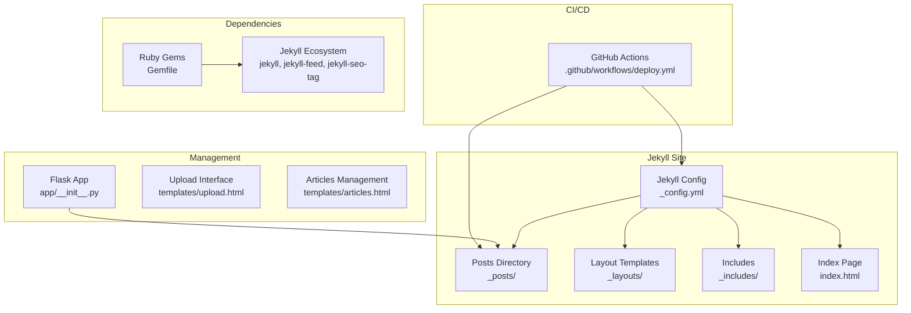
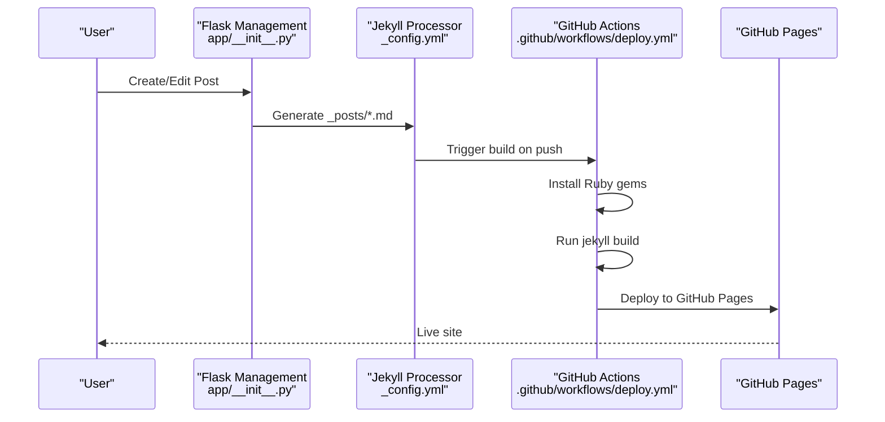
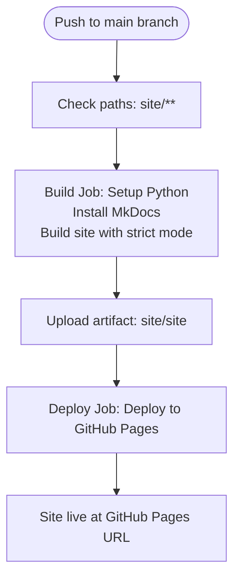
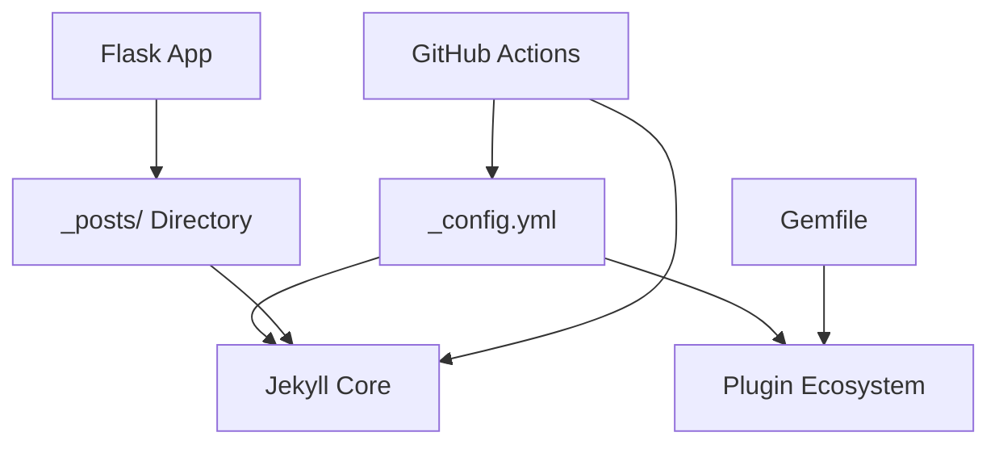

# Publishing Pipeline

<cite>
**Referenced Files in This Document**
- [.github/workflows/deploy.yml](file://.github/workflows/deploy.yml)
- [_config.yml](file://_config.yml)
- [Gemfile](file://Gemfile)
- [app/__init__.py](file://app/__init__.py)
- [index.html](file://index.html)
- [_layouts/default.html](file://_layouts/default.html)
- [_includes/footer.html](file://_includes/footer.html)
- [PRD.md](file://PRD.md)
</cite>

## Update Summary
**Changes Made**
- Complete replacement of FastAPI publishing system with Jekyll-based static site generation
- Removal of MkDocs dependency and complex backend publishing pipeline
- Simplification to GitHub Actions workflow for automated Jekyll build and deployment
- Migration from database-driven content to file-based Jekyll workflow
- Elimination of FastAPI routers, services, and Markdown generation components

## Table of Contents
1. [Introduction](#introduction)
2. [Project Structure](#project-structure)
3. [Core Components](#core-components)
4. [Architecture Overview](#architecture-overview)
5. [Detailed Component Analysis](#detailed-component-analysis)
6. [Dependency Analysis](#dependency-analysis)
7. [Performance Considerations](#performance-considerations)
8. [Troubleshooting Guide](#troubleshooting-guide)
9. [Conclusion](#conclusion)
10. [Appendices](#appendices)

## Introduction
This document explains the publishing pipeline for PolaZhenJing v2, which has been completely redesigned to use Jekyll instead of the previous complex FastAPI-based system. The new pipeline focuses on file-based content generation, automated GitHub Actions deployment, and simplified content management through a lightweight Flask backend. Content is now managed through Jekyll's native `_posts/` directory structure with automatic GitHub Pages deployment.

## Project Structure
The publishing pipeline has been streamlined to focus on Jekyll static site generation with automated deployment:
- Jekyll configuration defines site metadata, build settings, and plugin ecosystem
- GitHub Actions workflow automates the complete build and deployment process
- Flask backend provides lightweight management interface for content creation
- Ruby-based dependency management through Gemfile for Jekyll ecosystem
- File-based content storage in `_posts/` directory with YAML frontmatter

**Diagram sources**
- [_config.yml:1-49](file://_config.yml#L1-L49)
- [index.html:1-70](file://index.html#L1-L70)
- [app/__init__.py:43-62](file://app/__init__.py#L43-L62)
- [.github/workflows/deploy.yml:27-63](file://.github/workflows/deploy.yml#L27-L63)
- [Gemfile:1-7](file://Gemfile#L1-L7)

**Section sources**
- [_config.yml:1-49](file://_config.yml#L1-L49)
- [index.html:1-70](file://index.html#L1-L70)
- [app/__init__.py:43-62](file://app/__init__.py#L43-L62)
- [.github/workflows/deploy.yml:27-63](file://.github/workflows/deploy.yml#L27-L63)
- [Gemfile:1-7](file://Gemfile#L1-L7)

## Core Components
- **Jekyll Configuration**: Defines site metadata, build settings, pagination, plugins, and defaults for post processing
- **GitHub Actions Workflow**: Automates Jekyll build and deployment to GitHub Pages on pushes to main branch
- **Flask Management Server**: Provides lightweight interface for content creation, file uploads, and basic authentication
- **Ruby Gem Dependencies**: Manages Jekyll ecosystem including jekyll-feed, jekyll-seo-tag, and jekyll-paginate
- **File-Based Content Storage**: Posts stored in `_posts/` directory with automatic YAML frontmatter processing

**Section sources**
- [_config.yml:1-49](file://_config.yml#L1-L49)
- [.github/workflows/deploy.yml:27-63](file://.github/workflows/deploy.yml#L27-L63)
- [app/__init__.py:43-62](file://app/__init__.py#L43-L62)
- [Gemfile:1-7](file://Gemfile#L1-L7)

## Architecture Overview
The new publishing pipeline follows a simplified file-based approach:
- Content creation through Flask management interface
- Automatic Jekyll processing of `_posts/` directory
- GitHub Actions orchestration for build and deployment
- Native GitHub Pages integration for hosting

**Diagram sources**
- [app/__init__.py:43-62](file://app/__init__.py#L43-L62)
- [_config.yml:1-49](file://_config.yml#L1-L49)
- [.github/workflows/deploy.yml:27-63](file://.github/workflows/deploy.yml#L27-L63)

## Detailed Component Analysis

### Jekyll Configuration and Site Setup
The Jekyll configuration defines the complete publishing infrastructure:
- **Site Metadata**: Title, description, URL, base URL, and author information
- **Build Settings**: Markdown processor (kramdown), highlighter (rouge), permalink structure, timezone
- **Pagination**: Configured for 10 posts per page with pagination path
- **Plugins**: jekyll-feed for RSS, jekyll-seo-tag for SEO, jekyll-paginate for navigation
- **Defaults**: Automatic layout assignment for posts in `_posts/` directory
- **Exclusions**: Development files, Python cache, and unnecessary directories excluded from build

**Section sources**
- [_config.yml:1-49](file://_config.yml#L1-L49)

### GitHub Actions Deployment Workflow
The deployment workflow automates the complete publishing process:
- **Triggers**: Automatic on pushes to main branch targeting site files
- **Permissions**: Read/write access to pages and ID tokens
- **Concurrency**: Prevents conflicting deployments with group-based control
- **Build Job**: Sets up Python, installs MkDocs dependencies, builds site with strict mode
- **Deploy Job**: Deploys artifact to GitHub Pages with environment configuration

**Diagram sources**
- [.github/workflows/deploy.yml:11-25](file://.github/workflows/deploy.yml#L11-L25)
- [.github/workflows/deploy.yml:27-63](file://.github/workflows/deploy.yml#L27-L63)

**Section sources**
- [.github/workflows/deploy.yml:11-25](file://.github/workflows/deploy.yml#L11-L25)
- [.github/workflows/deploy.yml:27-63](file://.github/workflows/deploy.yml#L27-L63)

### Flask Management Interface
The lightweight Flask application provides content management capabilities:
- **Database Integration**: SQLite-based user authentication and session management
- **Blueprint Registration**: Authentication and upload functionality through blueprints
- **Template System**: Jinja2 templates for management interface
- **File Upload**: Handles various document formats for conversion to Markdown
- **Security**: Secret key configuration and content length limits

**Section sources**
- [app/__init__.py:1-62](file://app/__init__.py#L1-L62)

### Content Display and Layout System
The Jekyll layout system provides flexible content presentation:
- **Default Layout**: Base HTML structure with header, main content, and footer includes
- **Index Template**: Dynamic content listing with pagination and styling
- **Footer Includes**: Social links and RSS feed integration
- **Liquid Templating**: Powerful template engine for dynamic content rendering

**Section sources**
- [_layouts/default.html:1-12](file://_layouts/default.html#L1-L12)
- [index.html:1-70](file://index.html#L1-L70)
- [_includes/footer.html:1-9](file://_includes/footer.html#L1-L9)

### Ruby Gem Dependencies
The Ruby gem ecosystem provides essential Jekyll functionality:
- **Core Jekyll**: Static site generator version 4.3
- **Feed Plugin**: Automatic RSS feed generation
- **SEO Plugin**: Comprehensive SEO metadata support
- **Pagination Plugin**: Multi-page navigation for posts

**Section sources**
- [Gemfile:1-7](file://Gemfile#L1-L7)

## Dependency Analysis
The new architecture maintains clean separation between components:
- **Configuration-Driven**: Jekyll configuration controls build process and site behavior
- **Automated Deployment**: GitHub Actions handles build and deployment without manual intervention
- **Lightweight Management**: Flask provides minimal overhead for content creation
- **Ruby Ecosystem**: Gems manage site functionality and plugins independently

**Diagram sources**
- [_config.yml:1-49](file://_config.yml#L1-L49)
- [Gemfile:1-7](file://Gemfile#L1-L7)
- [app/__init__.py:43-62](file://app/__init__.py#L43-L62)
- [.github/workflows/deploy.yml:27-63](file://.github/workflows/deploy.yml#L27-L63)

**Section sources**
- [_config.yml:1-49](file://_config.yml#L1-L49)
- [Gemfile:1-7](file://Gemfile#L1-L7)
- [app/__init__.py:43-62](file://app/__init__.py#L43-L62)
- [.github/workflows/deploy.yml:27-63](file://.github/workflows/deploy.yml#L27-L63)

## Performance Considerations
- **Build Speed**: Jekyll builds are typically faster than complex backend systems, with typical completion under 10 seconds for small to medium sites
- **Deployment Automation**: GitHub Actions eliminates manual deployment steps and reduces human error
- **Resource Efficiency**: Single-container deployment vs. multi-service architecture significantly reduces resource consumption
- **Caching Strategy**: GitHub Pages provides CDN caching for improved load times
- **Development Simplicity**: Reduced complexity leads to fewer maintenance overhead and easier troubleshooting

## Troubleshooting Guide
Common issues and resolutions:
- **Build Failures**: Check GitHub Actions logs for Jekyll build errors; verify Gemfile dependencies and Jekyll configuration
- **Missing Content**: Ensure posts are placed in correct `_posts/` directory with proper YAML frontmatter format
- **Plugin Issues**: Verify all required gems are specified in Gemfile and installed during build process
- **Deployment Delays**: GitHub Pages may have propagation delays; wait up to 10 minutes for changes to appear
- **Authentication Problems**: Check Flask app configuration and database initialization for management interface access

Operational checks:
- **Health Verification**: Access site URL to confirm GitHub Pages deployment success
- **Build Logs**: Monitor GitHub Actions workflow for build status and error messages
- **Content Validation**: Verify YAML frontmatter format and post filename conventions

**Section sources**
- [.github/workflows/deploy.yml:27-63](file://.github/workflows/deploy.yml#L27-L63)
- [_config.yml:1-49](file://_config.yml#L1-L49)

## Conclusion
The PolaZhenJing publishing pipeline has been successfully simplified from a complex FastAPI-based system to a streamlined Jekyll workflow. The new architecture leverages GitHub Actions for automated deployment, provides a lightweight Flask interface for content management, and utilizes Ruby gems for comprehensive site functionality. This redesign significantly reduces complexity while maintaining powerful blogging capabilities with automatic GitHub Pages hosting.

## Appendices

### Jekyll Configuration Highlights
- **Site Metadata**: Title, description, URL, base URL, author information
- **Build Settings**: Markdown processor, highlighter, permalink structure, timezone
- **Pagination**: 10 posts per page with pagination path
- **Plugins**: jekyll-feed, jekyll-seo-tag, jekyll-paginate
- **Defaults**: Automatic layout assignment for posts
- **Exclusions**: Development and cache files excluded from build

**Section sources**
- [_config.yml:1-49](file://_config.yml#L1-L49)

### GitHub Actions Workflow Features
- **Automatic Triggers**: Build and deploy on pushes to main branch
- **Permission Management**: Controlled access to GitHub Pages resources
- **Concurrency Control**: Prevents conflicting deployments
- **Artifact Management**: Proper site artifact handling for deployment
- **Environment Configuration**: GitHub Pages integration with URL reporting

**Section sources**
- [.github/workflows/deploy.yml:11-25](file://.github/workflows/deploy.yml#L11-L25)
- [.github/workflows/deploy.yml:27-63](file://.github/workflows/deploy.yml#L27-L63)

### Ruby Gem Dependencies
- **Core**: Jekyll 4.3 for static site generation
- **Feed**: jekyll-feed 0.17 for RSS functionality
- **SEO**: jekyll-seo-tag 2.8 for search engine optimization
- **Pagination**: jekyll-paginate 1.1 for multi-page navigation

**Section sources**
- [Gemfile:1-7](file://Gemfile#L1-L7)

### Content Management Interface
- **Authentication**: SQLite-based user management with Flask sessions
- **Upload Handling**: Support for multiple document formats
- **Template System**: Jinja2 templates for management interface
- **Security**: Configurable secret key and content limits

**Section sources**
- [app/__init__.py:1-62](file://app/__init__.py#L1-L62)