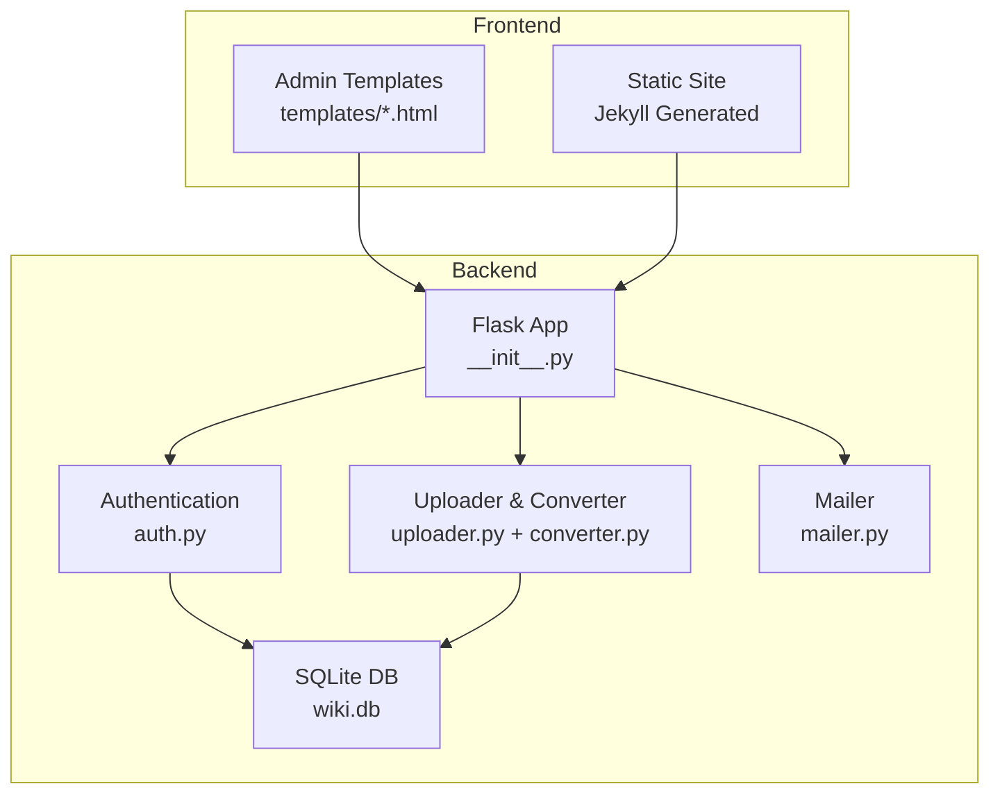
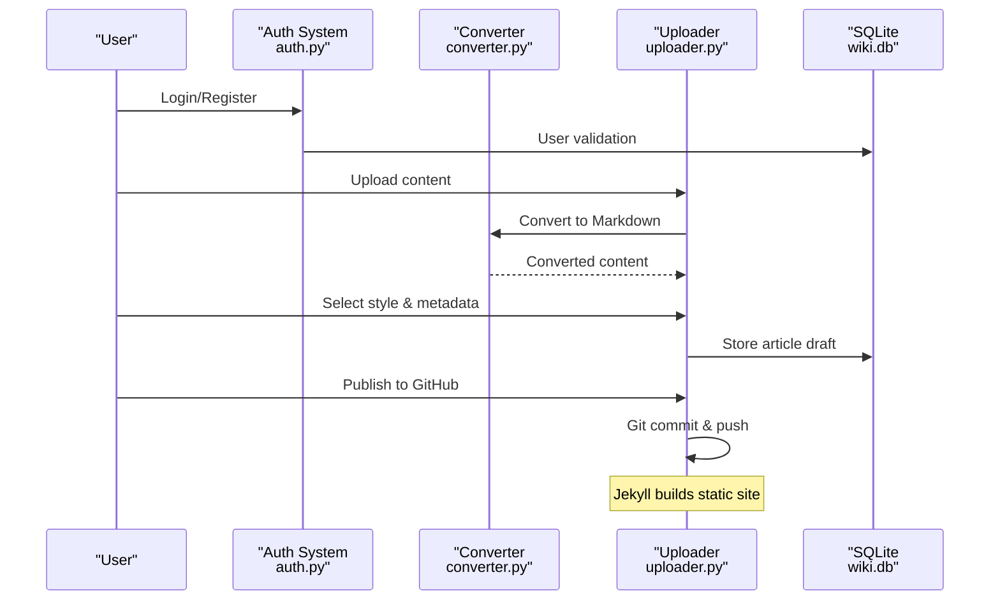
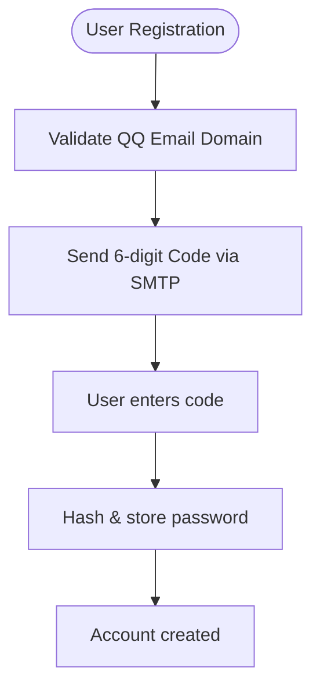
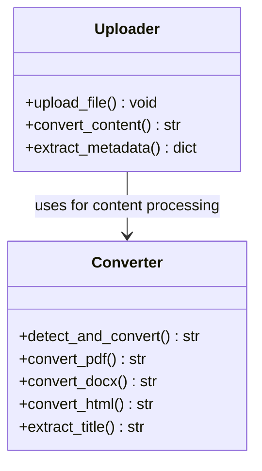
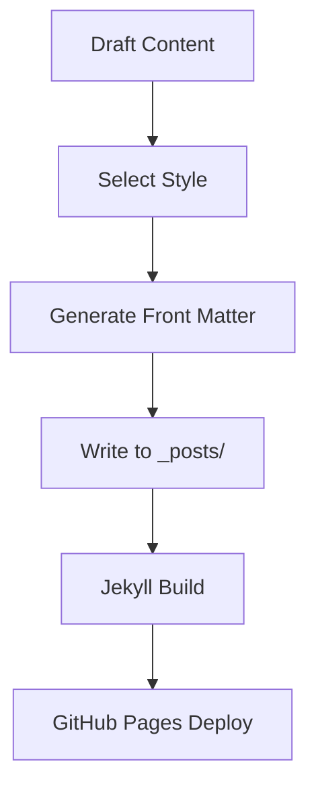
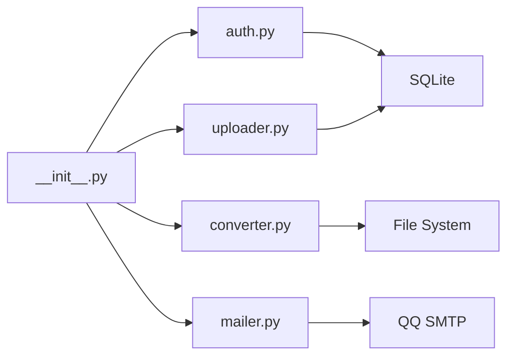

# Social Sharing

<cite>
**Referenced Files in This Document**
- [PRD.md](file://PRD.md)
- [app/__init__.py](file://app/__init__.py)
- [app/auth.py](file://app/auth.py)
- [app/uploader.py](file://app/uploader.py)
- [app/converter.py](file://app/converter.py)
- [app/mailer.py](file://app/mailer.py)
- [app/templates/base.html](file://app/templates/base.html)
- [_includes/header.html](file://_includes/header.html)
</cite>

## Update Summary
**Changes Made**
- Removed all social sharing functionality documentation as the feature has been completely eliminated
- Updated architecture overview to reflect the simplified lightweight blog wiki design
- Removed references to sharing router, service, and frontend components
- Updated project structure to show the current Flask-based implementation
- Revised all diagrams to remove social sharing components

## Table of Contents
1. [Introduction](#introduction)
2. [Project Structure](#project-structure)
3. [Core Components](#core-components)
4. [Architecture Overview](#architecture-overview)
5. [Detailed Component Analysis](#detailed-component-analysis)
6. [Dependency Analysis](#dependency-analysis)
7. [Performance Considerations](#performance-considerations)
8. [Troubleshooting Guide](#troubleshooting-guide)
9. [Conclusion](#conclusion)

## Introduction
This document explains the lightweight personal blog wiki implementation in PolaZhenJing. The system has been simplified from a complex full-stack application to a streamlined Flask-based solution that focuses on content creation and publication rather than social distribution. The blog supports multi-format article input (Markdown, PDF, Word, HTML), styled HTML generation using Jekyll, simple authentication, and GitHub Pages publishing.

**Updated** The social sharing modules have been completely removed as part of the architectural simplification. The focus has shifted entirely to individual content creation and publication workflow.

## Project Structure
The current implementation is a simplified Flask-based blog system:
- Backend: Flask application with authentication, file upload, and article management
- Frontend: Jinja2 templates for admin interface and static site generation
- Database: SQLite for user management
- Publishing: GitHub Pages integration for static site deployment

**Diagram sources**
- [app/__init__.py:43-61](file://app/__init__.py#L43-L61)
- [app/auth.py:13](file://app/auth.py#L13)
- [app/uploader.py:14](file://app/uploader.py#L14)
- [app/converter.py:1](file://app/converter.py#L1)
- [app/mailer.py:1](file://app/mailer.py#L1)

**Section sources**
- [app/__init__.py:43-61](file://app/__init__.py#L43-L61)
- [app/auth.py:13](file://app/auth.py#L13)
- [app/uploader.py:14](file://app/uploader.py#L14)
- [app/converter.py:1](file://app/converter.py#L1)
- [app/mailer.py:1](file://app/mailer.py#L1)

## Core Components
- Authentication System: User registration, login, and verification with QQ email support
- File Upload & Conversion: Multi-format content ingestion with automatic conversion to Markdown
- Article Management: Draft creation, styling selection, and publication workflow
- GitHub Pages Integration: Automated deployment pipeline for static site publishing
- Simple Database: SQLite storage for user credentials and basic application state

Key responsibilities:
- User authentication and session management
- Content conversion from various formats to Markdown
- Article generation with Jekyll front matter
- GitHub synchronization for publishing
- Email verification for user accounts

**Updated** Removed all social sharing related components including sharing router, service, and frontend dialog. The system now focuses exclusively on content creation and publication workflow.

**Section sources**
- [app/auth.py:26-48](file://app/auth.py#L26-L48)
- [app/uploader.py:76-118](file://app/uploader.py#L76-L118)
- [app/converter.py:58-88](file://app/converter.py#L58-L88)
- [app/mailer.py:8-53](file://app/mailer.py#L8-L53)

## Architecture Overview
The simplified architecture centers around content creation and publication rather than distribution. Users authenticate, upload content, select styling, and publish to GitHub Pages where Jekyll generates the final static site.

**Diagram sources**
- [app/auth.py:26-48](file://app/auth.py#L26-L48)
- [app/uploader.py:76-118](file://app/uploader.py#L76-L118)
- [app/converter.py:58-88](file://app/converter.py#L58-L88)

## Detailed Component Analysis

### Authentication System
- User Registration: Supports QQ email domain validation with 6-digit verification codes
- Login Management: Session-based authentication with password hashing
- Email Verification: SMTP integration with QQ Email for security
- Password Management: Secure password storage with Werkzeug security utilities

**Diagram sources**
- [app/auth.py:51-96](file://app/auth.py#L51-L96)
- [app/mailer.py:8-53](file://app/mailer.py#L8-L53)

**Section sources**
- [app/auth.py:26-48](file://app/auth.py#L26-L48)
- [app/auth.py:51-96](file://app/auth.py#L51-L96)
- [app/mailer.py:8-53](file://app/mailer.py#L8-L53)

### File Upload & Conversion Pipeline
- Multi-format Support: PDF, DOCX, HTML, Markdown, and plain text
- Automatic Detection: Intelligent format detection and conversion
- Content Extraction: Title detection from first heading or line
- Error Handling: Graceful fallback when conversion libraries unavailable

**Diagram sources**
- [app/uploader.py:76-118](file://app/uploader.py#L76-L118)
- [app/converter.py:58-88](file://app/converter.py#L58-L88)

**Section sources**
- [app/uploader.py:76-118](file://app/uploader.py#L76-L118)
- [app/converter.py:58-88](file://app/converter.py#L58-L88)

### Article Management & Publication
- Styling System: Five distinct article styles with color coding
- Front Matter Generation: Jekyll-compatible YAML metadata
- File Naming: Date-based slug generation with automatic sanitization
- Publishing Workflow: Git-based deployment to GitHub Pages

**Diagram sources**
- [app/uploader.py:130-168](file://app/uploader.py#L130-L168)

**Section sources**
- [app/uploader.py:130-168](file://app/uploader.py#L130-L168)
- [app/uploader.py:190-210](file://app/uploader.py#L190-L210)

### GitHub Pages Integration
- Automated Deployment: Git add/commit/push workflow
- Error Handling: Comprehensive error reporting for deployment failures
- Status Tracking: Visual indicators for published vs local-only articles
- Build Verification: Post-deployment validation of generated content

**Section sources**
- [app/uploader.py:190-210](file://app/uploader.py#L190-L210)

## Dependency Analysis
The simplified architecture reduces dependencies significantly:
- Flask for web framework and routing
- SQLite for lightweight persistence
- External libraries for file conversion (when available)
- GitHub for hosting and deployment

**Diagram sources**
- [app/__init__.py:55-61](file://app/__init__.py#L55-L61)
- [app/auth.py:13](file://app/auth.py#L13)
- [app/uploader.py:14](file://app/uploader.py#L14)
- [app/converter.py:1](file://app/converter.py#L1)
- [app/mailer.py:1](file://app/mailer.py#L1)

**Section sources**
- [app/__init__.py:55-61](file://app/__init__.py#L55-L61)
- [app/auth.py:13](file://app/auth.py#L13)
- [app/uploader.py:14](file://app/uploader.py#L14)
- [app/converter.py:1](file://app/converter.py#L1)
- [app/mailer.py:1](file://app/mailer.py#L1)

## Performance Considerations
- Database Efficiency: SQLite provides fast local development with minimal overhead
- Memory Usage: Stream processing for file conversions reduces memory footprint
- Build Optimization: Jekyll incremental builds for faster regeneration
- Network Efficiency: GitHub Pages CDN for global content delivery
- Caching Strategy: Browser caching for static assets and generated content

**Updated** Removed social sharing performance considerations as the feature no longer exists. Performance optimizations now focus on content creation and publishing workflows.

## Troubleshooting Guide
- Authentication Issues: Verify QQ email configuration and SMTP credentials
- File Conversion Errors: Install required conversion libraries (PyMuPDF, mammoth, html2text)
- GitHub Deployment Failures: Check SSH keys and repository permissions
- Jekyll Build Problems: Validate front matter formatting and Liquid syntax
- Database Connection: Ensure SQLite file permissions and path accessibility

**Section sources**
- [app/mailer.py:16-18](file://app/mailer.py#L16-L18)
- [app/converter.py:85-88](file://app/converter.py#L85-L88)
- [app/uploader.py:190-210](file://app/uploader.py#L190-L210)

## Conclusion
PolaZhenJing has successfully transitioned from a complex social-focused blog platform to a streamlined personal wiki system. The simplified architecture maintains essential functionality while dramatically reducing complexity. Users can now focus on content creation and publication without the overhead of social distribution features. The Flask-based implementation provides excellent developer experience with minimal dependencies, while GitHub Pages ensures reliable hosting and global delivery of generated content.