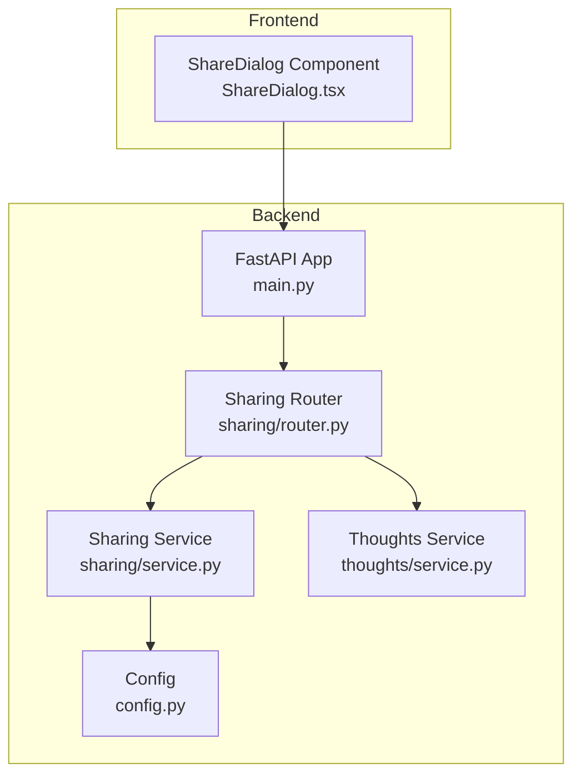
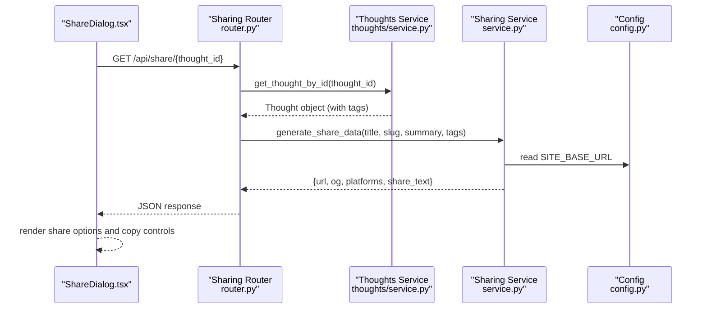
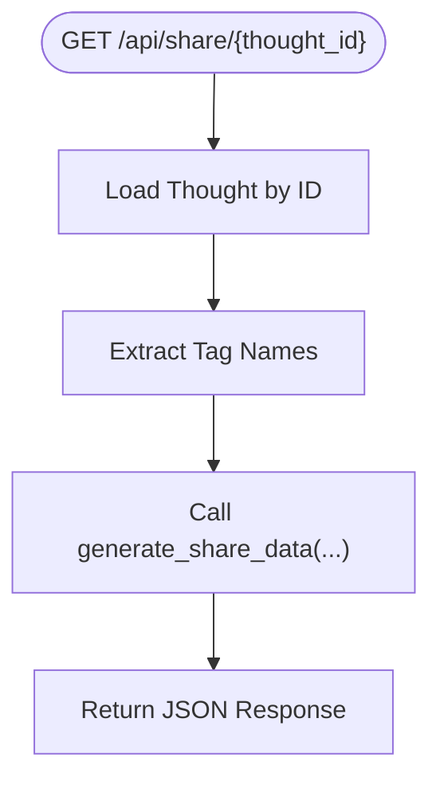
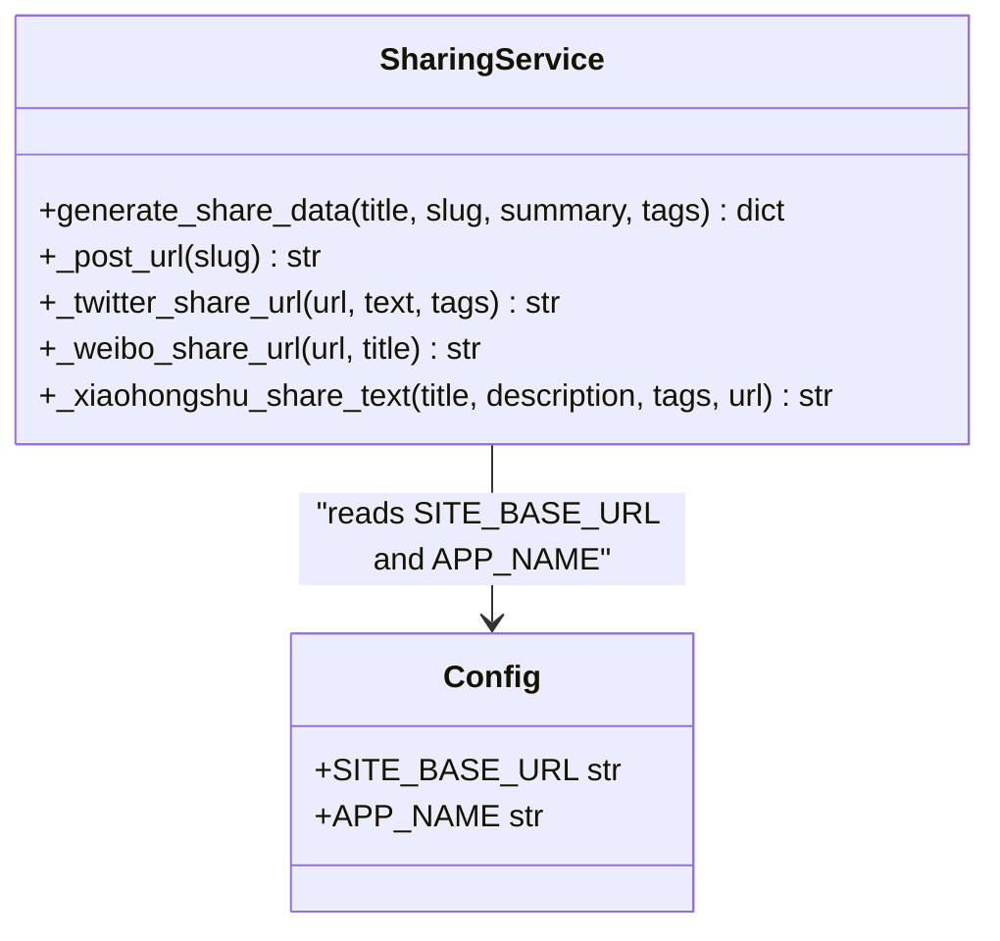
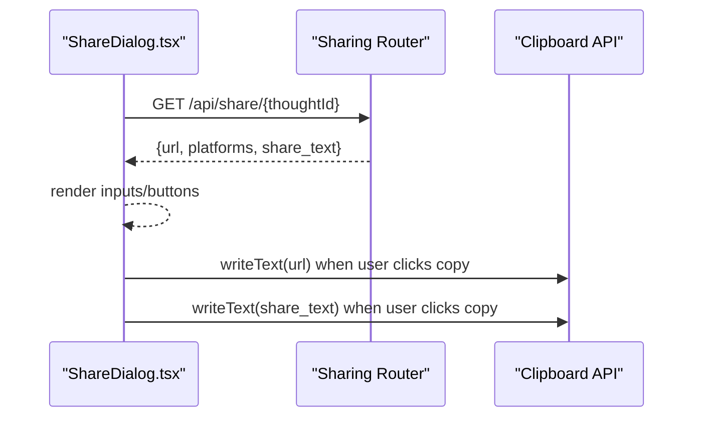
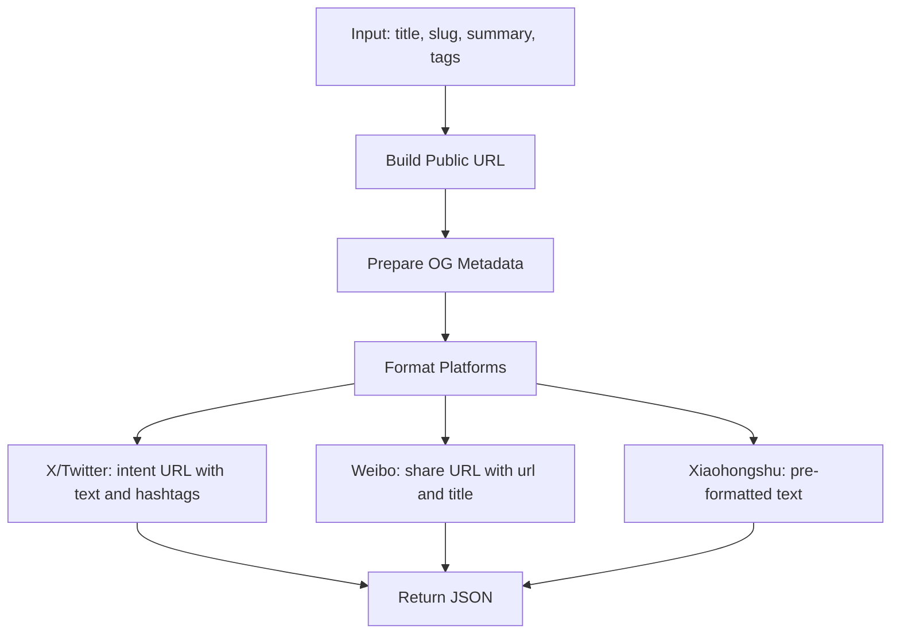
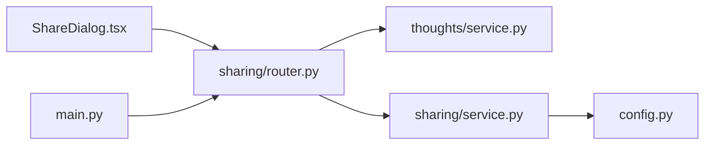

# Social Sharing

<cite>
**Referenced Files in This Document**
- [router.py](file://backend/app/sharing/router.py)
- [service.py](file://backend/app/sharing/service.py)
- [ShareDialog.tsx](file://frontend/src/components/ShareDialog.tsx)
- [test_sharing.py](file://backend/tests/test_sharing.py)
- [config.py](file://backend/app/config.py)
- [models.py](file://backend/app/thoughts/models.py)
- [service.py](file://backend/app/thoughts/service.py)
- [main.py](file://backend/app/main.py)
- [middleware.py](file://backend/app/common/middleware.py)
- [requirements.txt](file://backend/requirements.txt)
</cite>

## Table of Contents
1. [Introduction](#introduction)
2. [Project Structure](#project-structure)
3. [Core Components](#core-components)
4. [Architecture Overview](#architecture-overview)
5. [Detailed Component Analysis](#detailed-component-analysis)
6. [Dependency Analysis](#dependency-analysis)
7. [Performance Considerations](#performance-considerations)
8. [Troubleshooting Guide](#troubleshooting-guide)
9. [Conclusion](#conclusion)

## Introduction
This document explains the cross-platform social sharing functionality in PolaZhenJing. It covers how the backend generates shareable URLs and metadata for X/Twitter, Weibo, and Xiaohongshu, how the frontend renders share dialogs, and how the system handles platform-specific formatting and limitations. It also documents the sharing workflow, content preparation, and outlines performance considerations for high-volume scenarios.

## Project Structure
The sharing feature spans backend and frontend components:
- Backend: FastAPI router and service module that produce share URLs, Open Graph metadata, and platform-specific content.
- Frontend: React component that fetches share data and presents platform-specific actions and copy-to-clipboard options.
- Configuration: Application settings define the base site URL used to build public post links.
- Tests: Unit tests validate the shape and correctness of generated sharing data.

**Diagram sources**
- [main.py:40-72](file://backend/app/main.py#L40-L72)
- [router.py:23-46](file://backend/app/sharing/router.py#L23-L46)
- [service.py:25-73](file://backend/app/sharing/service.py#L25-L73)
- [service.py:68-102](file://backend/app/sharing/service.py#L68-L102)
- [config.py:52-54](file://backend/app/config.py#L52-L54)
- [ShareDialog.tsx:32-43](file://frontend/src/components/ShareDialog.tsx#L32-L43)

**Section sources**
- [main.py:40-72](file://backend/app/main.py#L40-L72)
- [router.py:23-46](file://backend/app/sharing/router.py#L23-L46)
- [service.py:25-73](file://backend/app/sharing/service.py#L25-L73)
- [config.py:52-54](file://backend/app/config.py#L52-L54)
- [ShareDialog.tsx:32-43](file://frontend/src/components/ShareDialog.tsx#L32-L43)

## Core Components
- Sharing Router: Exposes a GET endpoint that accepts a thought ID and returns share URLs, Open Graph metadata, and platform-specific content.
- Sharing Service: Generates the public post URL, Open Graph metadata, platform-specific share URLs/text, and a ready-to-copy share text.
- Frontend Share Dialog: Fetches share data from the backend and renders platform-specific actions and copy controls.
- Configuration: Provides the base site URL used to construct public post links.

Key responsibilities:
- URL generation: Build public post URL from site base URL and thought slug.
- Metadata processing: Produce Open Graph tags and Twitter card metadata.
- Platform-specific formatting: Construct X/Twitter intent URLs, Weibo share URLs, and Xiaohongshu copy text.
- Content optimization: Combine title, summary, tags, and URL into a share text suitable for clipboard.

**Section sources**
- [router.py:26-46](file://backend/app/sharing/router.py#L26-L46)
- [service.py:25-73](file://backend/app/sharing/service.py#L25-L73)
- [service.py:78-102](file://backend/app/sharing/service.py#L78-L102)
- [ShareDialog.tsx:32-43](file://frontend/src/components/ShareDialog.tsx#L32-L43)
- [config.py:52-54](file://backend/app/config.py#L52-L54)

## Architecture Overview
The sharing workflow connects the frontend ShareDialog to the backend sharing router and service. The router retrieves a thought by ID and delegates to the service to generate share data. The service builds URLs, metadata, and platform-specific content using configuration values.

**Diagram sources**
- [ShareDialog.tsx:37-43](file://frontend/src/components/ShareDialog.tsx#L37-L43)
- [router.py:26-46](file://backend/app/sharing/router.py#L26-L46)
- [service.py:25-73](file://backend/app/sharing/service.py#L25-L73)
- [config.py:52-54](file://backend/app/config.py#L52-L54)

## Detailed Component Analysis

### Backend Sharing Router
- Endpoint: GET /api/share/{thought_id}
- Responsibilities:
  - Authenticate and authorize the user via dependencies.
  - Load the thought by ID and extract tag names.
  - Delegate to the sharing service to generate share data.
- Output: JSON containing the public URL, Open Graph metadata, platform-specific share URLs, and a share text for clipboard.

**Diagram sources**
- [router.py:26-46](file://backend/app/sharing/router.py#L26-L46)

**Section sources**
- [router.py:26-46](file://backend/app/sharing/router.py#L26-L46)

### Backend Sharing Service
- Public URL construction: Uses SITE_BASE_URL and the thought slug to form the canonical post URL.
- Open Graph metadata: Includes og:title, og:description, og:url, og:type, og:site_name, twitter:card, twitter:title, twitter:description.
- Platform-specific URLs:
  - X/Twitter: Builds an intent URL with text and optional hashtags.
  - Weibo: Builds a share URL with url and title.
  - Xiaohongshu: Returns pre-formatted text for copying into the app (no web intent).
- Share text: Combines title, description, hashtags, and URL into a single clipboard-ready string.

**Diagram sources**
- [service.py:25-73](file://backend/app/sharing/service.py#L25-L73)
- [service.py:78-102](file://backend/app/sharing/service.py#L78-L102)
- [config.py:52-54](file://backend/app/config.py#L52-L54)

**Section sources**
- [service.py:19-22](file://backend/app/sharing/service.py#L19-L22)
- [service.py:25-73](file://backend/app/sharing/service.py#L25-L73)
- [service.py:78-102](file://backend/app/sharing/service.py#L78-L102)
- [config.py:52-54](file://backend/app/config.py#L52-L54)

### Frontend Share Dialog
- Fetches share data from the backend when mounted.
- Renders:
  - Public URL input with copy-to-clipboard button.
  - Platform buttons for X/Twitter and Weibo that open external intents.
  - Xiaohongshu copy text area with a dedicated copy button.
  - A single button to copy the entire share text.

**Diagram sources**
- [ShareDialog.tsx:37-43](file://frontend/src/components/ShareDialog.tsx#L37-L43)
- [ShareDialog.tsx:132-138](file://frontend/src/components/ShareDialog.tsx#L132-L138)

**Section sources**
- [ShareDialog.tsx:32-43](file://frontend/src/components/ShareDialog.tsx#L32-L43)
- [ShareDialog.tsx:93-109](file://frontend/src/components/ShareDialog.tsx#L93-L109)
- [ShareDialog.tsx:112-129](file://frontend/src/components/ShareDialog.tsx#L112-L129)
- [ShareDialog.tsx:132-138](file://frontend/src/components/ShareDialog.tsx#L132-L138)

### Cross-Platform Formatting Details
- X/Twitter:
  - Intent URL with text and optional hashtags parameter.
  - Hashtags are derived from tag names.
- Weibo:
  - Share URL with url and title parameters.
- Xiaohongshu:
  - No web intent; returns pre-formatted text for manual pasting.

**Diagram sources**
- [service.py:25-73](file://backend/app/sharing/service.py#L25-L73)
- [service.py:78-102](file://backend/app/sharing/service.py#L78-L102)

**Section sources**
- [service.py:78-102](file://backend/app/sharing/service.py#L78-L102)

### Open Graph and Preview Text Generation
- Open Graph metadata includes title, description, URL, type, site name, and Twitter card fields.
- Preview text is a single string combining title, description, hashtags, and URL, optimized for clipboard usage.

**Section sources**
- [service.py:57-66](file://backend/app/sharing/service.py#L57-L66)
- [service.py:49](file://backend/app/sharing/service.py#L49)

### Platform Limitations Handling
- Xiaohongshu lacks a web share intent; the service returns pre-formatted text for users to copy into the app.
- X/Twitter and Weibo are handled via web intents, which require user action to complete posting.

**Section sources**
- [service.py:94-102](file://backend/app/sharing/service.py#L94-L102)

## Dependency Analysis
- Router depends on:
  - Thoughts service for loading the thought and tags.
  - Sharing service for generating share data.
- Sharing service depends on:
  - Configuration for SITE_BASE_URL and APP_NAME.
- Frontend depends on:
  - API client to call the sharing endpoint.
- Application wiring:
  - The sharing router is included in the main application.

**Diagram sources**
- [main.py:65-72](file://backend/app/main.py#L65-L72)
- [router.py:20-21](file://backend/app/sharing/router.py#L20-L21)
- [service.py:16](file://backend/app/sharing/service.py#L16)
- [config.py:52-54](file://backend/app/config.py#L52-L54)

**Section sources**
- [main.py:65-72](file://backend/app/main.py#L65-L72)
- [router.py:20-21](file://backend/app/sharing/router.py#L20-L21)
- [service.py:16](file://backend/app/sharing/service.py#L16)
- [config.py:52-54](file://backend/app/config.py#L52-L54)

## Performance Considerations
- Database query cost: The router loads a thought with tags; ensure tag relationships are efficiently loaded to minimize N+1 queries.
- URL building: Using configuration values avoids repeated computation and ensures consistency.
- Response size: The payload is small (URLs, metadata, platform links, and text), suitable for high-volume scenarios.
- Caching: Consider caching share data for frequently shared posts to reduce database load.
- Rate limiting: Implement rate limits on the sharing endpoint to prevent abuse during viral moments.
- CDN: Serve the frontend from a CDN to reduce latency for users across regions.
- Monitoring: Use request logging middleware to track sharing endpoint performance and errors.

[No sources needed since this section provides general guidance]

## Troubleshooting Guide
- Endpoint returns 404 or 403:
  - Verify the thought exists and the user is authenticated.
  - Confirm the router is included in the main application.
- Incorrect public URL:
  - Check SITE_BASE_URL configuration and ensure it matches the deployed site.
- Missing or incorrect Open Graph metadata:
  - Validate that the service returns the expected OG fields.
- Xiaohongshu share not working:
  - Confirm that the returned text is copied and pasted manually into the app.
- Frontend not rendering share options:
  - Ensure the ShareDialog component successfully fetches data from the endpoint.

**Section sources**
- [router.py:26-46](file://backend/app/sharing/router.py#L26-L46)
- [config.py:52-54](file://backend/app/config.py#L52-L54)
- [service.py:57-66](file://backend/app/sharing/service.py#L57-L66)
- [ShareDialog.tsx:37-43](file://frontend/src/components/ShareDialog.tsx#L37-L43)

## Conclusion
PolaZhenJing’s social sharing feature provides a clean separation between backend generation and frontend presentation. The backend produces platform-specific URLs and metadata while the frontend offers intuitive copy-and-share experiences. The design accommodates platform limitations (notably Xiaohongshu) and is structured for scalability with potential caching and rate-limiting enhancements.