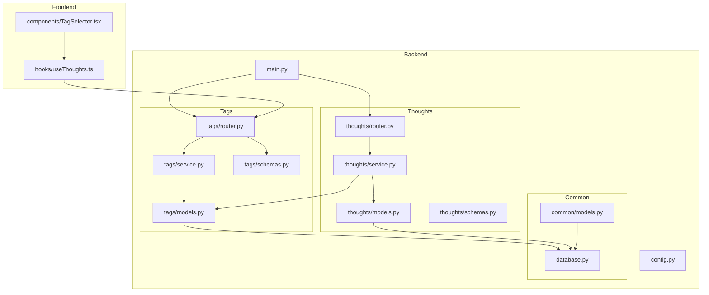
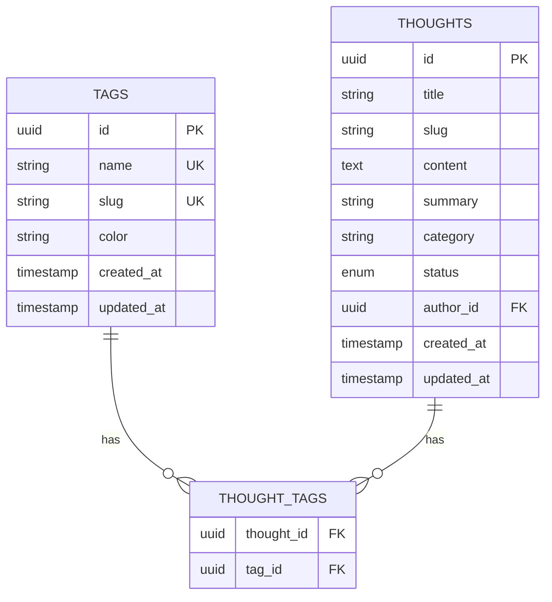
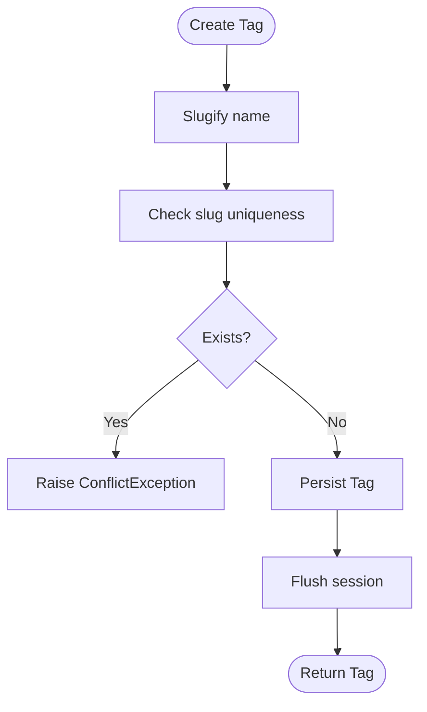
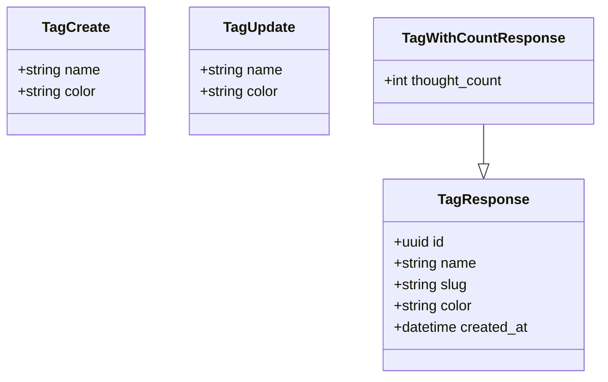
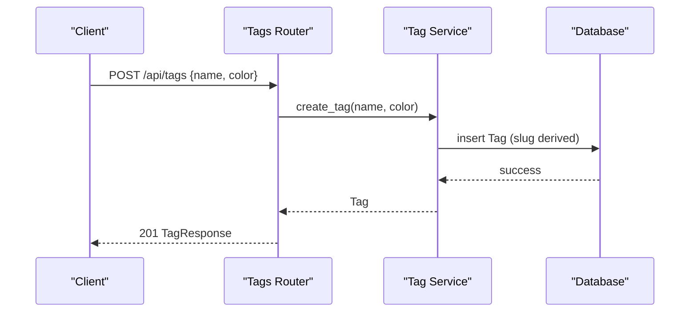
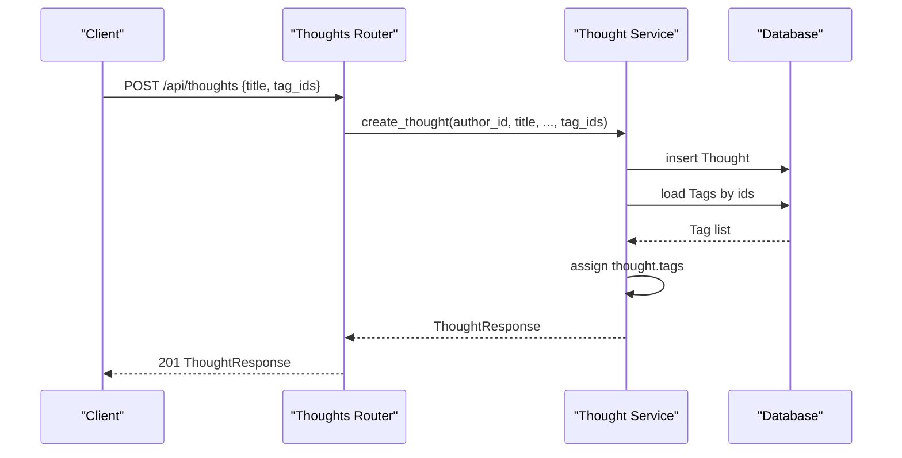
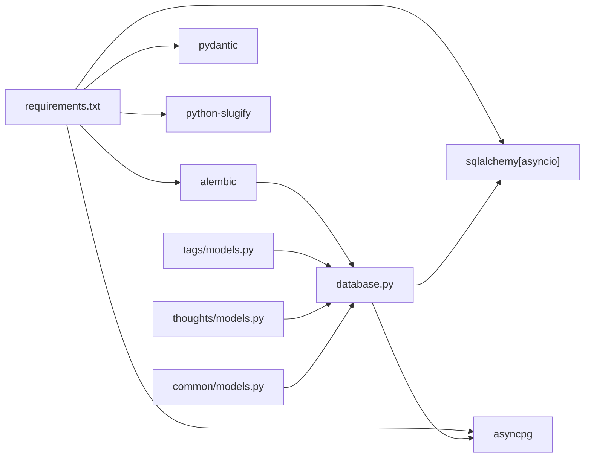

# Tag System

<cite>
**Referenced Files in This Document**
- [models.py](file://backend/app/tags/models.py)
- [service.py](file://backend/app/tags/service.py)
- [schemas.py](file://backend/app/tags/schemas.py)
- [router.py](file://backend/app/tags/router.py)
- [models.py](file://backend/app/thoughts/models.py)
- [service.py](file://backend/app/thoughts/service.py)
- [schemas.py](file://backend/app/thoughts/schemas.py)
- [router.py](file://backend/app/thoughts/router.py)
- [models.py](file://backend/app/common/models.py)
- [database.py](file://backend/app/database.py)
- [main.py](file://backend/app/main.py)
- [config.py](file://backend/app/config.py)
- [requirements.txt](file://backend/requirements.txt)
- [TagSelector.tsx](file://frontend/src/components/TagSelector.tsx)
- [useThoughts.ts](file://frontend/src/hooks/useThoughts.ts)
</cite>

## Table of Contents
1. [Introduction](#introduction)
2. [Project Structure](#project-structure)
3. [Core Components](#core-components)
4. [Architecture Overview](#architecture-overview)
5. [Detailed Component Analysis](#detailed-component-analysis)
6. [Dependency Analysis](#dependency-analysis)
7. [Performance Considerations](#performance-considerations)
8. [Troubleshooting Guide](#troubleshooting-guide)
9. [Conclusion](#conclusion)

## Introduction
This document describes the tag system in PolaZhenJing. It explains the tag entity model, its many-to-many relationship with thoughts, and how tags are created, managed, and queried. It covers validation and serialization schemas, the tag router endpoints, tag assignment workflows during thought creation/update, tag statistics, and how tags integrate with the frontend. It also addresses tag normalization, duplicate handling, and performance considerations for tag-heavy workloads.

## Project Structure
The tag system spans backend modules for models, service, schemas, and router, plus integration points in the thoughts module and frontend components.



**Diagram sources**
- [models.py:42-67](file://backend/app/tags/models.py#L42-L67)
- [service.py:22-103](file://backend/app/tags/service.py#L22-L103)
- [schemas.py:19-46](file://backend/app/tags/schemas.py#L19-L46)
- [router.py:29-73](file://backend/app/tags/router.py#L29-L73)
- [models.py:31-67](file://backend/app/thoughts/models.py#L31-L67)
- [service.py:25-173](file://backend/app/thoughts/service.py#L25-L173)
- [schemas.py:21-65](file://backend/app/thoughts/schemas.py#L21-L65)
- [router.py:34-116](file://backend/app/thoughts/router.py#L34-L116)
- [models.py:24-76](file://backend/app/common/models.py#L24-L76)
- [database.py:24-63](file://backend/app/database.py#L24-L63)
- [main.py:59-72](file://backend/app/main.py#L59-L72)
- [useThoughts.ts:80-94](file://frontend/src/hooks/useThoughts.ts#L80-L94)
- [TagSelector.tsx:20-57](file://frontend/src/components/TagSelector.tsx#L20-L57)

**Section sources**
- [main.py:59-72](file://backend/app/main.py#L59-L72)
- [database.py:24-63](file://backend/app/database.py#L24-L63)
- [config.py:35-36](file://backend/app/config.py#L35-L36)

## Core Components
- Tag entity model with unique name and slug, optional color, and many-to-many relationship with thoughts.
- Association table for the many-to-many relationship between thoughts and tags.
- Tag service providing create, read, update, delete, and usage-count retrieval.
- Tag schemas for request/response validation and serialization.
- Tag router exposing REST endpoints for tag management.
- Thought model integrates tags via the association table and supports tag-based filtering and updates.
- Frontend hooks and components that fetch tags and render a tag selector.

**Section sources**
- [models.py:42-67](file://backend/app/tags/models.py#L42-L67)
- [service.py:22-103](file://backend/app/tags/service.py#L22-L103)
- [schemas.py:19-46](file://backend/app/tags/schemas.py#L19-L46)
- [router.py:29-73](file://backend/app/tags/router.py#L29-L73)
- [models.py:31-67](file://backend/app/thoughts/models.py#L31-L67)
- [service.py:25-173](file://backend/app/thoughts/service.py#L25-L173)
- [schemas.py:21-65](file://backend/app/thoughts/schemas.py#L21-L65)
- [useThoughts.ts:80-94](file://frontend/src/hooks/useThoughts.ts#L80-L94)
- [TagSelector.tsx:20-57](file://frontend/src/components/TagSelector.tsx#L20-L57)

## Architecture Overview
The tag system is implemented as a cohesive module with clear separation of concerns:
- Models define the Tag entity and the association table.
- Service encapsulates business logic for tag operations and usage statistics.
- Schemas validate and serialize requests/responses.
- Router exposes endpoints under /api/tags.
- Thoughts module consumes tags for filtering and assignment.
- Frontend integrates tags via hooks and components.

```mermaid
classDiagram
class TimestampMixin {
+datetime created_at
+datetime updated_at
}
class Tag {
+uuid id
+string name
+string slug
+string color
+created_at
+updated_at
+thoughts
}
class Thought {
+uuid id
+string title
+string slug
+string content
+string summary
+string category
+enum status
+uuid author_id
+created_at
+updated_at
+tags
}
class User {
+uuid id
+string username
+string email
+string hashed_password
+string display_name
+bool is_active
+bool is_superuser
+thoughts
}
class TagService {
+create_tag(db, name, color)
+get_tag_by_id(db, tag_id)
+list_tags(db)
+list_tags_with_count(db)
+update_tag(db, tag_id, name, color)
+delete_tag(db, tag_id)
}
TimestampMixin <|-- Tag
TimestampMixin <|-- Thought
TimestampMixin <|-- User
Tag "many" <---> "many" Thought : "association via thought_tags"
TagService ..> Tag : "operates on"
TagService ..> Thought : "reads usage"
```

**Diagram sources**
- [models.py:42-67](file://backend/app/tags/models.py#L42-L67)
- [models.py:31-67](file://backend/app/thoughts/models.py#L31-L67)
- [models.py:24-76](file://backend/app/common/models.py#L24-L76)
- [service.py:22-103](file://backend/app/tags/service.py#L22-L103)

## Detailed Component Analysis

### Tag Entity Model
- Unique constraints: name and slug are unique; slug is derived from name.
- Optional color stored as a hex string.
- Many-to-many relationship with thoughts via the association table thought_tags.
- Inherits created_at and updated_at timestamps.



**Diagram sources**
- [models.py:23-38](file://backend/app/tags/models.py#L23-L38)
- [models.py:42-67](file://backend/app/tags/models.py#L42-L67)
- [models.py:44-67](file://backend/app/thoughts/models.py#L44-L67)

**Section sources**
- [models.py:42-67](file://backend/app/tags/models.py#L42-L67)
- [models.py:31-67](file://backend/app/thoughts/models.py#L31-L67)

### Tag Service Implementation
- Create tag: slugified from name; uniqueness enforced at application level; raises conflict if slug exists.
- Get tag by id: returns tag or raises not found.
- List tags: returns all tags ordered by name.
- List tags with count: returns tags with thought_count using left join and group by.
- Update tag: updates name/color; name change triggers slug recalculation.
- Delete tag: removes tag by id.



**Diagram sources**
- [service.py:22-41](file://backend/app/tags/service.py#L22-L41)

**Section sources**
- [service.py:22-103](file://backend/app/tags/service.py#L22-L103)

### Tag Schemas for Validation and Serialization
- TagCreate: name required (1–64 chars), optional color hex pattern.
- TagUpdate: optional fields name (1–64) and color hex.
- TagResponse: id, name, slug, color, created_at.
- TagWithCountResponse: extends TagResponse with thought_count.



**Diagram sources**
- [schemas.py:19-46](file://backend/app/tags/schemas.py#L19-L46)

**Section sources**
- [schemas.py:19-46](file://backend/app/tags/schemas.py#L19-L46)

### Tag Router Endpoints
- GET /api/tags: lists tags with thought_count.
- POST /api/tags: creates a tag (authenticated).
- GET /api/tags/{tag_id}: retrieves a tag by id.
- PATCH /api/tags/{tag_id}: updates name/color (authenticated).
- DELETE /api/tags/{tag_id}: deletes a tag (authenticated).



**Diagram sources**
- [router.py:38-46](file://backend/app/tags/router.py#L38-L46)
- [service.py:22-41](file://backend/app/tags/service.py#L22-L41)

**Section sources**
- [router.py:29-73](file://backend/app/tags/router.py#L29-L73)

### Relationship with Thoughts
- Thought model includes a many-to-many relationship with Tag via thought_tags.
- Thought creation supports attaching tags by ids.
- Thought update supports replacing tags by ids.
- Thought listing supports filtering by tag slug.



**Diagram sources**
- [service.py:25-66](file://backend/app/thoughts/service.py#L25-L66)
- [models.py:65-67](file://backend/app/thoughts/models.py#L65-L67)

**Section sources**
- [models.py:31-67](file://backend/app/thoughts/models.py#L31-L67)
- [service.py:25-173](file://backend/app/thoughts/service.py#L25-L173)

### Tag Assignment Workflows
- During thought creation: pass tag_ids; service loads tags and assigns to thought.tags.
- During thought update: pass tag_ids to replace current tags; service replaces thought.tags.
- Tag deletion does not cascade from thought side; thoughts remain linked to tags unless cascading is configured at DB level.

**Section sources**
- [service.py:25-66](file://backend/app/thoughts/service.py#L25-L66)
- [service.py:137-165](file://backend/app/thoughts/service.py#L137-L165)

### Tag Statistics
- list_tags_with_count returns each tag with thought_count using a left join and group by.
- Thought listing supports tag-based filtering via tag_slug query parameter.

**Section sources**
- [service.py:58-81](file://backend/app/tags/service.py#L58-L81)
- [service.py:82-135](file://backend/app/thoughts/service.py#L82-L135)

### Tag Search and Autocomplete
- Backend does not expose dedicated tag search or autocomplete endpoints.
- Frontend fetches all tags with counts and renders a selectable chip list; selection is client-side.
- Thought listing supports tag filtering via tag slug query parameter.

**Section sources**
- [router.py:32-35](file://backend/app/tags/router.py#L32-L35)
- [useThoughts.ts:80-94](file://frontend/src/hooks/useThoughts.ts#L80-L94)
- [TagSelector.tsx:20-57](file://frontend/src/components/TagSelector.tsx#L20-L57)
- [router.py:37-63](file://backend/app/thoughts/router.py#L37-L63)

### Tag Normalization and Duplicate Handling
- Name normalization: slugify is applied to derive slug from name.
- Duplicate handling: uniqueness enforced at application level; conflicts raised if slug exists.
- Color validation: hex color pattern enforced by schema.

**Section sources**
- [service.py:32-35](file://backend/app/tags/service.py#L32-L35)
- [schemas.py:21-22](file://backend/app/tags/schemas.py#L21-L22)
- [schemas.py:27-28](file://backend/app/tags/schemas.py#L27-L28)

## Dependency Analysis
- Backend dependencies include SQLAlchemy async, asyncpg, Alembic, Pydantic, python-slugify, and FastAPI.
- Database engine and session factory are configured centrally.
- Tag and Thought models share TimestampMixin and depend on the shared Base.
- Tag service depends on Tag model and thought_tags association table.
- Thought service depends on Tag model for tag assignment and filtering.



**Diagram sources**
- [requirements.txt:6-34](file://backend/requirements.txt#L6-L34)
- [database.py:24-37](file://backend/app/database.py#L24-L37)
- [models.py:19-20](file://backend/app/tags/models.py#L19-L20)
- [models.py:19-21](file://backend/app/thoughts/models.py#L19-L21)
- [models.py:20-21](file://backend/app/common/models.py#L20-L21)

**Section sources**
- [requirements.txt:6-34](file://backend/requirements.txt#L6-L34)
- [database.py:24-37](file://backend/app/database.py#L24-L37)

## Performance Considerations
- Tag listing with counts uses a left join and group by; complexity proportional to tags plus thought_tags rows.
- Thought listing with tag filter joins Thought with Tag via thought_tags; consider indexing on tag slug and thought_tags columns.
- Eager loading of tags in Thought queries reduces N+1 queries but increases payload size.
- Slug generation occurs on write; ensure slug uniqueness checks are efficient (index on slug).
- Consider caching tag lists with counts for frequently accessed dashboards.

**Section sources**
- [service.py:58-81](file://backend/app/tags/service.py#L58-L81)
- [service.py:107-135](file://backend/app/thoughts/service.py#L107-L135)
- [models.py:65-67](file://backend/app/thoughts/models.py#L65-L67)
- [models.py:56-57](file://backend/app/tags/models.py#L56-L57)

## Troubleshooting Guide
- Tag creation fails with conflict: indicates slug collision; choose a different name or adjust uniqueness constraints.
- Not found errors: ensure tag_id exists before update/delete/get.
- Tag assignment issues: verify tag_ids exist and are valid UUIDs; Thought update replaces tags entirely when tag_ids is provided.
- Frontend tag selector empty: confirm /api/tags endpoint is reachable and returns data; check network tab for errors.

**Section sources**
- [service.py:34-35](file://backend/app/tags/service.py#L34-L35)
- [service.py:47-48](file://backend/app/tags/service.py#L47-L48)
- [service.py:160-162](file://backend/app/thoughts/service.py#L160-L162)
- [router.py:32-35](file://backend/app/tags/router.py#L32-L35)
- [useThoughts.ts:84-91](file://frontend/src/hooks/useThoughts.ts#L84-L91)

## Conclusion
The tag system in PolaZhenJing provides a robust foundation for organizing thoughts with unique, normalized tags and efficient usage statistics. Its design cleanly separates persistence, business logic, validation, and presentation, enabling straightforward tag management and integration with thought workflows. For tag-heavy environments, consider indexing strategies, caching, and optional frontend autocomplete enhancements to further improve performance and UX.