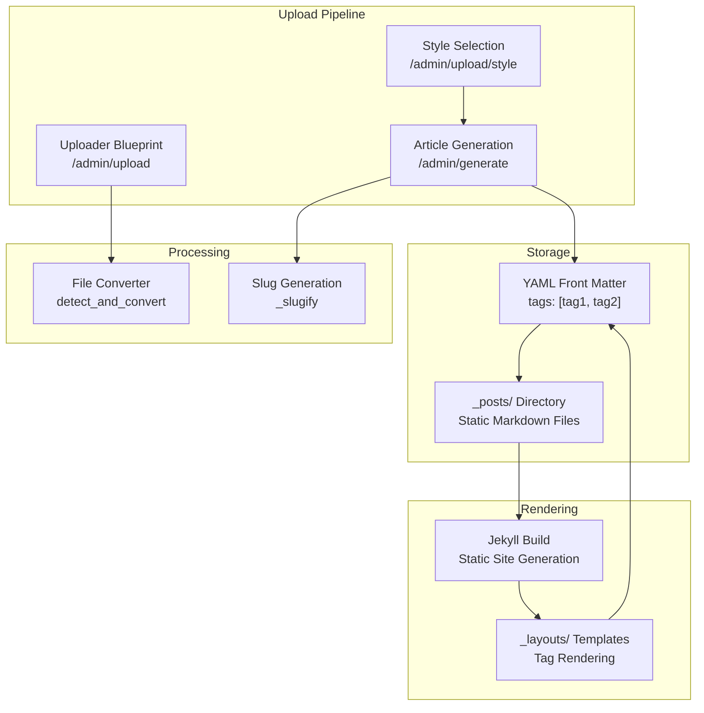
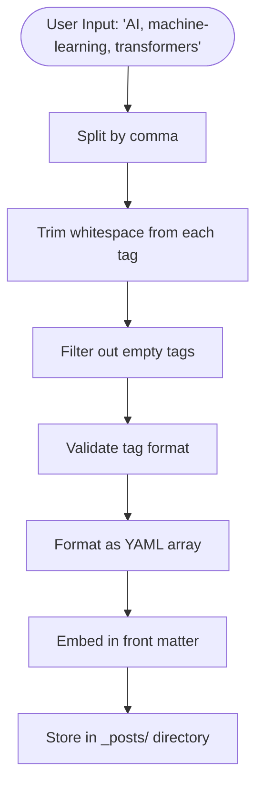

# Tag System

<cite>
**Referenced Files in This Document**
- [uploader.py](file://app/uploader.py)
- [converter.py](file://app/converter.py)
- [upload.html](file://app/templates/upload.html)
- [style_select.html](file://app/templates/style_select.html)
- [deep-technical.html](file://_layouts/deep-technical.html)
- [_config.yml](file://_config.yml)
- [PRD.md](file://PRD.md)
</cite>

## Update Summary
**Changes Made**
- Removed all backend tag management components (models, service, schemas, router)
- Integrated tag handling directly into file upload pipeline through YAML front matter
- Replaced separate tag API with metadata-driven approach using Jekyll front matter
- Updated tag storage mechanism from database to static file system (_posts/)
- Simplified tag workflow to manual comma-separated input during upload process

## Table of Contents
1. [Introduction](#introduction)
2. [System Architecture](#system-architecture)
3. [Tag Integration with Upload Pipeline](#tag-integration-with-upload-pipeline)
4. [YAML Front Matter Implementation](#yaml-front-matter-implementation)
5. [Tag Processing Workflow](#tag-processing-workflow)
6. [Template Integration](#template-integration)
7. [Tag Usage in Jekyll](#tag-usage-in-jekyll)
8. [Configuration and Deployment](#configuration-and-deployment)
9. [Migration from Previous Architecture](#migration-from-previous-architecture)
10. [Limitations and Considerations](#limitations-and-considerations)

## Introduction
The PolaZhenJing tag system has undergone a fundamental transformation from a database-driven architecture to a metadata-centric approach integrated directly into the file upload pipeline. This new system leverages Jekyll's YAML front matter to handle tags, eliminating the need for separate tag management APIs and database operations. Tags are now processed as part of the article generation workflow, stored as static metadata in Markdown files, and rendered through Jekyll's templating system.

## System Architecture
The tag system now operates within a simplified Flask-based upload pipeline that generates Jekyll-compatible content with embedded tag metadata. The architecture eliminates the previous backend dependency on FastAPI, SQLAlchemy, and PostgreSQL in favor of a lightweight file-based approach.



**Diagram sources**
- [uploader.py:76-169](file://app/uploader.py#L76-L169)
- [converter.py:58-82](file://app/converter.py#L58-L82)
- [deep-technical.html:10-13](file://_layouts/deep-technical.html#L10-L13)

## Tag Integration with Upload Pipeline
The tag system is now seamlessly integrated into the upload workflow through three key stages:

### Upload Stage
The upload interface captures tag input as comma-separated values through the HTML form field `tags`. This input is stored in the Flask session for later processing.

### Style Selection Stage  
During style selection, the tag data persists in the session and is passed through to the final generation stage without modification.

### Generation Stage
The tag data is extracted from the session and embedded into the YAML front matter of the generated Markdown file, creating a permanent record of tags associated with each article.

**Section sources**
- [upload.html:27-28](file://app/templates/upload.html#L27-L28)
- [uploader.py:113-116](file://app/uploader.py#L113-L116)
- [uploader.py:134-137](file://app/uploader.py#L134-L137)
- [uploader.py:148-159](file://app/uploader.py#L148-L159)

## YAML Front Matter Implementation
Tags are now stored as YAML front matter within each generated Markdown file. The front matter structure includes a tags array that contains all specified tags, formatted as a YAML list.

### Front Matter Structure
```
---
layout: deep-technical
title: "Article Title"
date: 2024-01-15
tags: [AI, machine-learning, transformers]
description: "Brief summary..."
---
```

### Tag Processing Logic
The system processes user input by splitting the comma-separated string, trimming whitespace from each tag, and filtering out empty entries. This creates a clean YAML array suitable for Jekyll consumption.

**Section sources**
- [uploader.py:148-159](file://app/uploader.py#L148-L159)
- [uploader.py:134-137](file://app/uploader.py#L134-L137)

## Tag Processing Workflow
The tag processing follows a streamlined workflow that transforms user input into structured metadata:



**Diagram sources**
- [uploader.py:148-159](file://app/uploader.py#L148-L159)

**Section sources**
- [uploader.py:148-159](file://app/uploader.py#L148-L159)

## Template Integration
The tag system integrates with both the upload interface and the final rendering templates:

### Upload Interface
The upload template provides a simple text input field for tag entry, supporting comma-separated values. The interface accepts tags as optional input, allowing users to skip tagging if desired.

### Style Selection Interface
The style selection template passes through the tag data without modification, ensuring tags persist through the entire workflow.

**Section sources**
- [upload.html:27-28](file://app/templates/upload.html#L27-L28)
- [style_select.html:10-11](file://app/templates/style_select.html#L10-L11)

## Tag Usage in Jekyll
Jekyll processes the embedded tags through its built-in templating system, providing flexible rendering options across different layouts and templates.

### Layout Integration
Each layout template can access the `page.tags` variable to render tags in various formats. The deep technical layout demonstrates conditional rendering when tags exist.

### Template Rendering
The Jekyll template iterates through the tags array and displays them as a comma-separated string, providing consistent tag visualization across all article layouts.

**Section sources**
- [deep-technical.html:10-13](file://_layouts/deep-technical.html#L10-L13)

## Configuration and Deployment
The tag system operates within the existing Jekyll configuration and deployment pipeline without requiring additional configuration changes.

### Jekyll Configuration
The `_config.yml` file defines the basic Jekyll setup but doesn't require specific tag-related configurations, as tags are handled automatically through the front matter parsing.

### Deployment Pipeline
The existing GitHub Actions workflow continues to function normally, processing the tagged content through the standard Jekyll build process without modification.

**Section sources**
- [_config.yml:18-22](file://_config.yml#L18-L22)
- [PRD.md:732-735](file://PRD.md#L732-L735)

## Migration from Previous Architecture
The migration represents a complete architectural shift from a database-driven tag system to a file-based metadata approach:

### Previous Architecture Limitations
- Complex backend infrastructure with FastAPI, SQLAlchemy, and PostgreSQL
- Separate tag management API requiring authentication and authorization
- Database migrations and schema management overhead
- Additional complexity in frontend integration

### New Architecture Benefits
- **Simplified Infrastructure**: Eliminates database requirements and backend complexity
- **Reduced Dependencies**: Fewer Python packages and simpler deployment
- **File-Based Storage**: Tags stored as static metadata in Markdown files
- **Jekyll Native**: Leverages existing Jekyll capabilities for tag rendering
- **Streamlined Workflow**: Single pipeline handles conversion, styling, and tagging

### Migration Impact
- No breaking changes for end users - tags remain accessible through the same interface
- Simplified maintenance with fewer moving parts
- Improved performance through static file serving
- Reduced operational complexity for hosting and deployment

**Section sources**
- [PRD.md:813-838](file://PRD.md#L813-L838)

## Limitations and Considerations
While the new tag system offers significant simplifications, it introduces certain limitations compared to the previous database-driven approach:

### Functional Limitations
- **No Tag Management API**: Tags cannot be created, updated, or deleted through programmatic interfaces
- **Manual Input Only**: Tags must be entered manually during the upload process
- **No Tag Relationships**: Cannot establish relationships or hierarchies between tags
- **No Tag Analytics**: Built-in statistics and tag cloud generation are not available

### Performance Considerations
- **Static File Access**: Tags are read from static files during Jekyll builds
- **No Caching Layer**: Tags are processed on-demand without persistent caching
- **File System Dependency**: Relies on reliable file system access for tag retrieval

### User Experience Impact
- **Input Validation**: Limited server-side validation of tag formats
- **No Auto-complete**: Users must remember tag names without assistance
- **No Tag Suggestions**: No intelligent tag recommendations or suggestions

Despite these limitations, the simplified approach aligns with the overall goal of reducing complexity while maintaining core functionality for article organization and discovery.