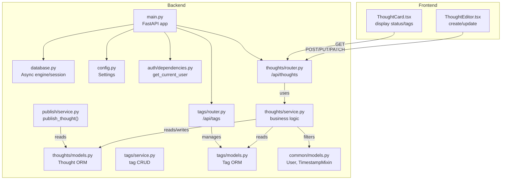
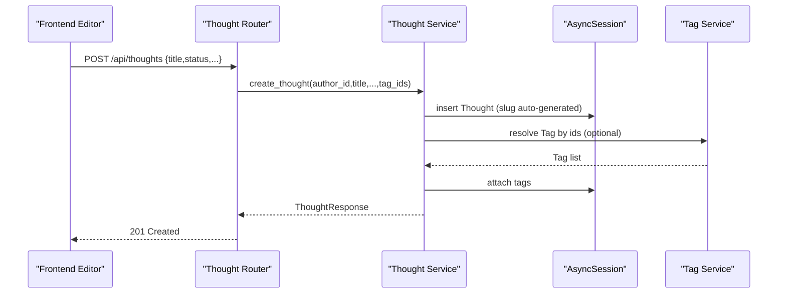
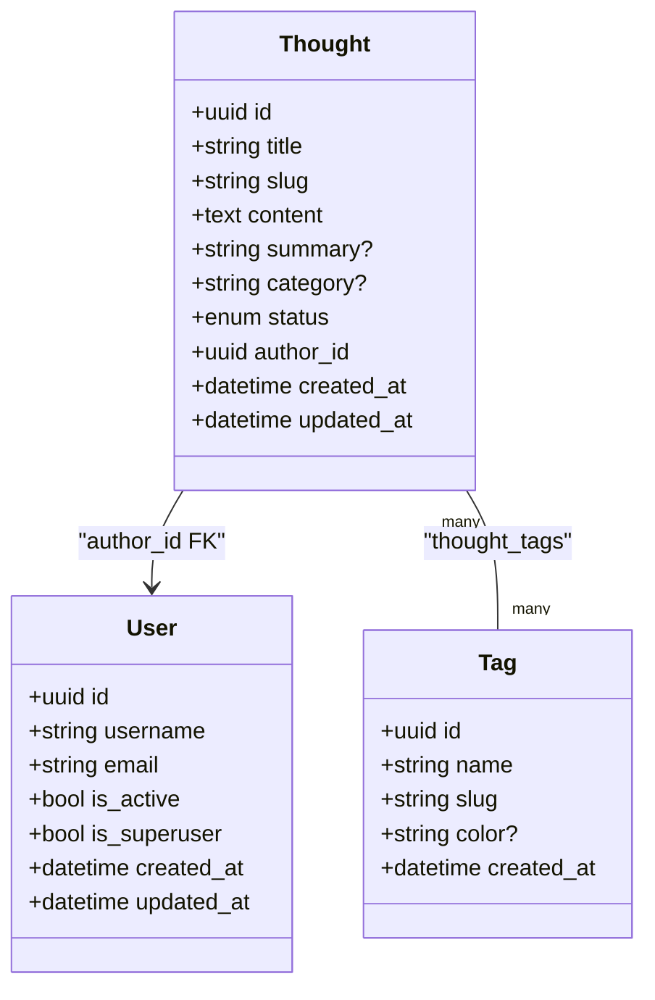
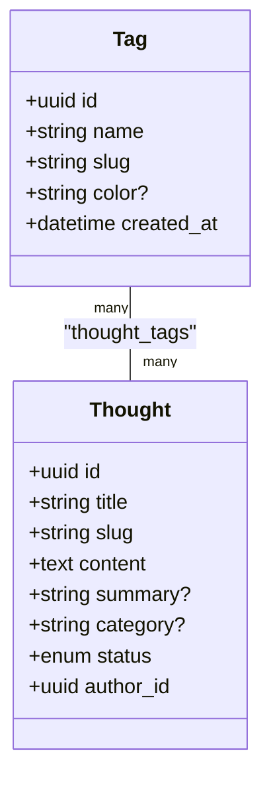
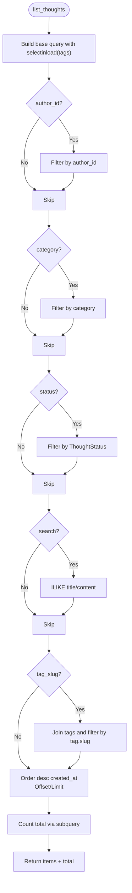
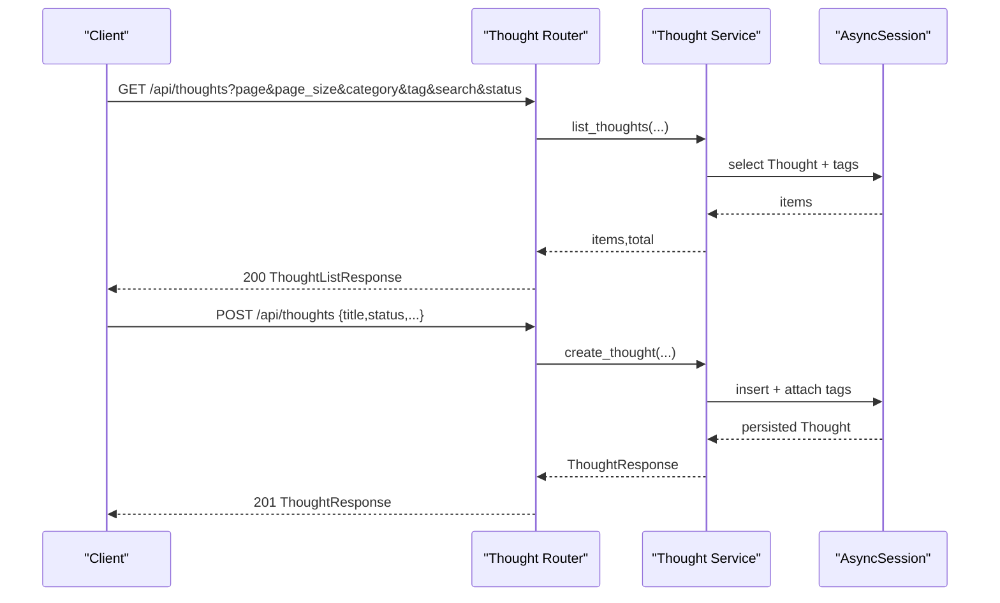
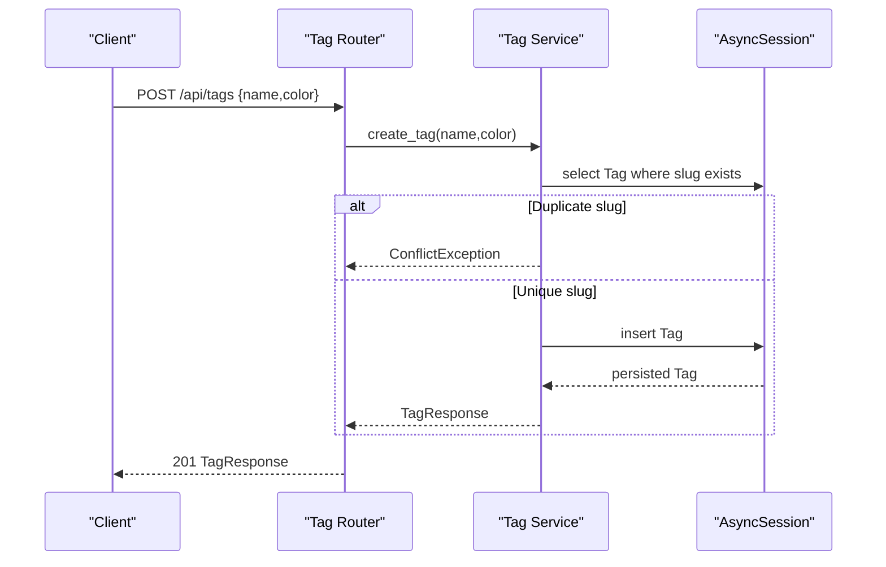
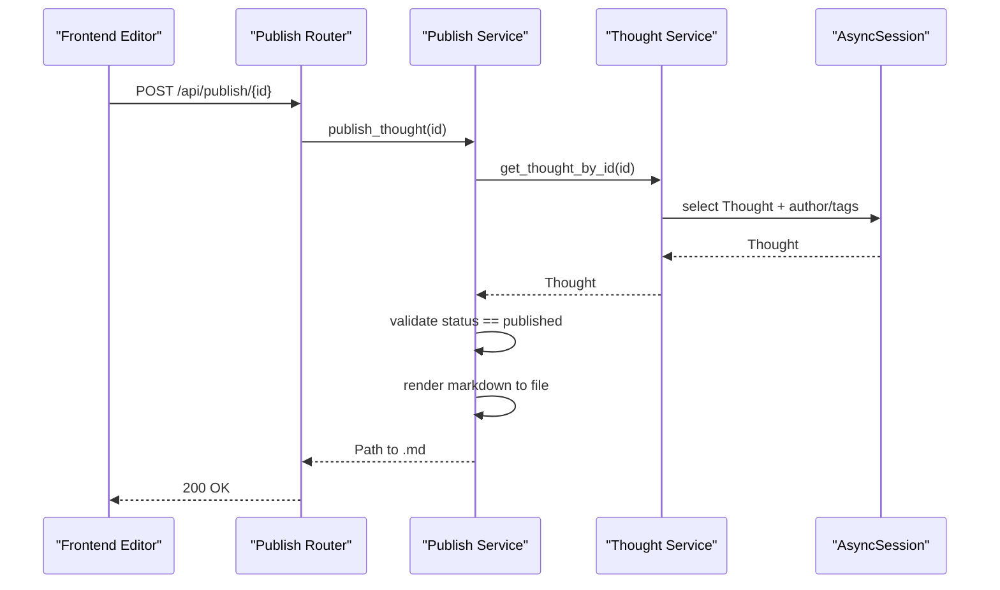
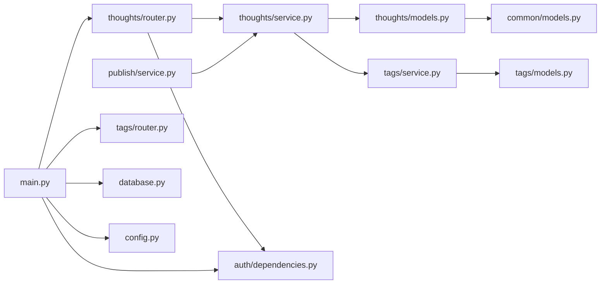

# Thought Management

<cite>
**Referenced Files in This Document**
- [models.py](file://backend/app/thoughts/models.py)
- [schemas.py](file://backend/app/thoughts/schemas.py)
- [service.py](file://backend/app/thoughts/service.py)
- [router.py](file://backend/app/thoughts/router.py)
- [models.py](file://backend/app/tags/models.py)
- [schemas.py](file://backend/app/tags/schemas.py)
- [service.py](file://backend/app/tags/service.py)
- [router.py](file://backend/app/tags/router.py)
- [models.py](file://backend/app/common/models.py)
- [database.py](file://backend/app/database.py)
- [config.py](file://backend/app/config.py)
- [main.py](file://backend/app/main.py)
- [dependencies.py](file://backend/app/auth/dependencies.py)
- [publish/service.py](file://backend/app/publish/service.py)
- [ThoughtCard.tsx](file://frontend/src/components/ThoughtCard.tsx)
- [ThoughtEditor.tsx](file://frontend/src/pages/ThoughtEditor.tsx)
</cite>

## Table of Contents
1. [Introduction](#introduction)
2. [Project Structure](#project-structure)
3. [Core Components](#core-components)
4. [Architecture Overview](#architecture-overview)
5. [Detailed Component Analysis](#detailed-component-analysis)
6. [Dependency Analysis](#dependency-analysis)
7. [Performance Considerations](#performance-considerations)
8. [Troubleshooting Guide](#troubleshooting-guide)
9. [Conclusion](#conclusion)
10. [Appendices](#appendices)

## Introduction
This document explains the thought management subsystem of PolaZhenJing. It covers the thought entity model, the service-layer implementation for CRUD and search, request/response schemas, router endpoints, the draft/published workflow, tag and category organization, and operational guidance for performance and data integrity.

## Project Structure
The thought management feature is implemented under the backend’s thoughts module and integrates with shared models, tags, authentication, and publishing. The frontend provides editor and card components that consume the thought APIs.

**Diagram sources**
- [main.py:40-73](file://backend/app/main.py#L40-L73)
- [database.py:24-63](file://backend/app/database.py#L24-L63)
- [config.py:16-62](file://backend/app/config.py#L16-L62)
- [auth/dependencies.py:28-52](file://backend/app/auth/dependencies.py#L28-L52)
- [thoughts/router.py:34-116](file://backend/app/thoughts/router.py#L34-L116)
- [thoughts/service.py:25-173](file://backend/app/thoughts/service.py#L25-L173)
- [thoughts/models.py:31-71](file://backend/app/thoughts/models.py#L31-L71)
- [tags/router.py:28-72](file://backend/app/tags/router.py#L28-L72)
- [tags/service.py:21-102](file://backend/app/tags/service.py#L21-L102)
- [tags/models.py:42-67](file://backend/app/tags/models.py#L42-L67)
- [common/models.py:41-76](file://backend/app/common/models.py#L41-L76)
- [publish/service.py:37-79](file://backend/app/publish/service.py#L37-L79)
- [ThoughtEditor.tsx:55-79](file://frontend/src/pages/ThoughtEditor.tsx#L55-L79)
- [ThoughtCard.tsx:27-74](file://frontend/src/components/ThoughtCard.tsx#L27-L74)

**Section sources**
- [main.py:40-73](file://backend/app/main.py#L40-L73)
- [database.py:24-63](file://backend/app/database.py#L24-L63)
- [config.py:16-62](file://backend/app/config.py#L16-L62)
- [auth/dependencies.py:28-52](file://backend/app/auth/dependencies.py#L28-L52)
- [thoughts/router.py:34-116](file://backend/app/thoughts/router.py#L34-L116)
- [thoughts/service.py:25-173](file://backend/app/thoughts/service.py#L25-L173)
- [thoughts/models.py:31-71](file://backend/app/thoughts/models.py#L31-L71)
- [tags/router.py:28-72](file://backend/app/tags/router.py#L28-L72)
- [tags/service.py:21-102](file://backend/app/tags/service.py#L21-L102)
- [tags/models.py:42-67](file://backend/app/tags/models.py#L42-L67)
- [common/models.py:41-76](file://backend/app/common/models.py#L41-L76)
- [publish/service.py:37-79](file://backend/app/publish/service.py#L37-L79)
- [ThoughtEditor.tsx:55-79](file://frontend/src/pages/ThoughtEditor.tsx#L55-L79)
- [ThoughtCard.tsx:27-74](file://frontend/src/components/ThoughtCard.tsx#L27-L74)

## Core Components
- Thought entity: A persisted reflection with title, slug, content, summary, category, status, author, and tags.
- Tag entity: A classification label with name, slug, color, and reverse many-to-many linkage to thoughts.
- User entity: An authenticated actor with unique identifiers and timestamps.
- Thought service: Implements create, read, update, delete, list with filters and pagination.
- Thought router: Exposes REST endpoints for CRUD and listing with query parameters for filtering and search.
- Tag service/route: Manages tag creation, updates, deletions, and listing with counts.
- Publishing service: Validates published thoughts and exports them to Markdown for site generation.

**Section sources**
- [thoughts/models.py:31-71](file://backend/app/thoughts/models.py#L31-L71)
- [tags/models.py:42-67](file://backend/app/tags/models.py#L42-L67)
- [common/models.py:41-76](file://backend/app/common/models.py#L41-L76)
- [thoughts/service.py:25-173](file://backend/app/thoughts/service.py#L25-L173)
- [thoughts/router.py:37-116](file://backend/app/thoughts/router.py#L37-L116)
- [tags/service.py:21-102](file://backend/app/tags/service.py#L21-L102)
- [tags/router.py:31-72](file://backend/app/tags/router.py#L31-L72)
- [publish/service.py:37-79](file://backend/app/publish/service.py#L37-L79)

## Architecture Overview
The thought management subsystem follows a layered architecture:
- Presentation: FastAPI routes define endpoints and accept Pydantic schemas.
- Service: Encapsulates business logic, validations, and data transformations.
- Persistence: SQLAlchemy ORM models and async sessions manage storage.
- Integration: Authentication dependency injects the current user; publishing service integrates with external site generation.

**Diagram sources**
- [thoughts/router.py:66-82](file://backend/app/thoughts/router.py#L66-L82)
- [thoughts/service.py:25-65](file://backend/app/thoughts/service.py#L25-L65)
- [tags/service.py:42-48](file://backend/app/tags/service.py#L42-L48)

## Detailed Component Analysis

### Thought Entity Model
- Fields
  - id: UUID primary key
  - title: String up to 256 chars
  - slug: String up to 256 chars, unique and indexed
  - content: Text, default empty
  - summary: Optional Text
  - category: Optional String up to 64 chars, indexed
  - status: Enum Draft/Published/Archived, default Draft
  - author_id: UUID foreign key to users.id with cascade delete
  - timestamps: created_at/updated_at via TimestampMixin
- Relationships
  - author: One-to-many back-populated by User.thoughts
  - tags: Many-to-many via association table thought_tags
- Constraints
  - Unique slug enforced at service level by appending a short suffix if needed
  - Category indexed for efficient filtering
  - Author FK cascade ensures thoughts are removed when user is deleted

**Diagram sources**
- [thoughts/models.py:31-71](file://backend/app/thoughts/models.py#L31-L71)
- [common/models.py:41-76](file://backend/app/common/models.py#L41-L76)
- [tags/models.py:42-67](file://backend/app/tags/models.py#L42-L67)

**Section sources**
- [thoughts/models.py:31-71](file://backend/app/thoughts/models.py#L31-L71)
- [common/models.py:41-76](file://backend/app/common/models.py#L41-L76)
- [tags/models.py:42-67](file://backend/app/tags/models.py#L42-L67)

### Tag Entity Model
- Fields
  - id: UUID primary key
  - name: String up to 64 chars, unique and indexed
  - slug: String up to 64 chars, unique and indexed
  - color: Optional hex color string
  - timestamps: created_at/updated_at via TimestampMixin
- Relationships
  - thoughts: Many-to-many back-populates Thought.tags
- Constraints
  - Unique name enforced at service level by raising conflict on duplicate slug

**Diagram sources**
- [tags/models.py:42-67](file://backend/app/tags/models.py#L42-L67)
- [thoughts/models.py:31-71](file://backend/app/thoughts/models.py#L31-L71)

**Section sources**
- [tags/models.py:42-67](file://backend/app/tags/models.py#L42-L67)

### Thought Service Layer
- Responsibilities
  - Create: Generates unique slug, assigns author, optionally attaches tags
  - Retrieve: Fetch by id with tags eagerly loaded
  - List: Filters by author, category, tag slug, status; supports full-text search on title/content; paginates and orders by created_at desc
  - Update: Updates fields and regenerates slug when title changes; replaces tag associations
  - Delete: Removes thought by id
- Business rules
  - Status transitions: status field validated against enum Draft/Published/Archived
  - Slug uniqueness: service ensures uniqueness by suffixing random hex when needed
  - Tag resolution: tag_ids resolved to actual Tag entities before assignment

**Diagram sources**
- [thoughts/service.py:82-134](file://backend/app/thoughts/service.py#L82-L134)

**Section sources**
- [thoughts/service.py:25-173](file://backend/app/thoughts/service.py#L25-L173)

### Thought Router Endpoints
- GET /api/thoughts
  - Query params: category, tag (by slug), search, status, page, page_size
  - Returns paginated ThoughtListResponse
- POST /api/thoughts
  - Body: ThoughtCreate
  - Returns ThoughtResponse, status 201
- GET /api/thoughts/{thought_id}
  - Returns ThoughtResponse
- PATCH /api/thoughts/{thought_id}
  - Body: ThoughtUpdate (partial fields)
  - Returns ThoughtResponse
- DELETE /api/thoughts/{thought_id}
  - No content, status 204

**Diagram sources**
- [thoughts/router.py:37-116](file://backend/app/thoughts/router.py#L37-L116)
- [thoughts/service.py:82-134](file://backend/app/thoughts/service.py#L82-L134)

**Section sources**
- [thoughts/router.py:37-116](file://backend/app/thoughts/router.py#L37-L116)

### Thought Schemas (Validation and Serialization)
- Request
  - ThoughtCreate: title, content, summary, category, status, tag_ids
  - ThoughtUpdate: all fields optional
- Response
  - ThoughtResponse: includes author_id, tags, timestamps
  - ThoughtListResponse: items, total, page, page_size
- Validation
  - Length limits and optional fields
  - Status constrained to enum values
  - Tag IDs resolved to actual Tag entities during service operations

**Section sources**
- [thoughts/schemas.py:21-65](file://backend/app/thoughts/schemas.py#L21-L65)

### Tag Management
- Tag CRUD
  - Create: Enforces unique name (slugified); raises conflict if duplicate
  - Read: Get by id or list all
  - Update: Updates name/color; name is slugified
  - Delete: Removes tag
- Listing with counts
  - Returns TagWithCountResponse with thought_count derived from left join and group by

**Diagram sources**
- [tags/router.py:37-44](file://backend/app/tags/router.py#L37-L44)
- [tags/service.py:21-39](file://backend/app/tags/service.py#L21-L39)

**Section sources**
- [tags/router.py:31-72](file://backend/app/tags/router.py#L31-L72)
- [tags/service.py:21-102](file://backend/app/tags/service.py#L21-L102)
- [tags/schemas.py:18-46](file://backend/app/tags/schemas.py#L18-L46)

### Draft/Published Workflow and Publishing
- Status management
  - Thought status is an enum Draft/Published/Archived
  - Frontend exposes status selection in editor
- Publishing pipeline
  - Publishing service validates thought exists and is Published
  - Converts thought to Markdown and writes to site/docs/posts/{slug}.md
  - Logs successful export

**Diagram sources**
- [publish/service.py:37-79](file://backend/app/publish/service.py#L37-L79)
- [thoughts/service.py:68-79](file://backend/app/thoughts/service.py#L68-L79)

**Section sources**
- [publish/service.py:37-79](file://backend/app/publish/service.py#L37-L79)
- [ThoughtEditor.tsx:81-89](file://frontend/src/pages/ThoughtEditor.tsx#L81-L89)

### Content Organization and Search
- Categories
  - Optional string field on Thought; indexed for filtering
- Tags
  - Many-to-many relationship; tag slugs used for filtering in list_thoughts
- Search
  - Full-text search across title and content using ILIKE patterns
- Pagination
  - Page and page_size validated and applied with offset/limit
- Ordering
  - Defaults to descending created_at

**Section sources**
- [thoughts/service.py:82-134](file://backend/app/thoughts/service.py#L82-L134)
- [thoughts/router.py:37-63](file://backend/app/thoughts/router.py#L37-L63)
- [tags/models.py:56-57](file://backend/app/tags/models.py#L56-L57)
- [thoughts/models.py:51](file://backend/app/thoughts/models.py#L51)

### Frontend Integration
- ThoughtEditor
  - Submits ThoughtCreate/ThoughtUpdate payloads to backend
  - Supports status selection (draft/published/archived)
- ThoughtCard
  - Renders status badges and tag lists

**Section sources**
- [ThoughtEditor.tsx:55-79](file://frontend/src/pages/ThoughtEditor.tsx#L55-L79)
- [ThoughtCard.tsx:27-74](file://frontend/src/components/ThoughtCard.tsx#L27-L74)

## Dependency Analysis
- Module coupling
  - Router depends on service; service depends on models and tags; models depend on common mixins and tags association table
  - Authentication dependency enforces current user for all thought endpoints
- External integrations
  - Database via async SQLAlchemy
  - Publishing writes to filesystem under configured site directory
- Potential circular dependencies
  - Thought and Tag models reference each other via relationships; association table avoids runtime circularity

**Diagram sources**
- [thoughts/router.py:34-116](file://backend/app/thoughts/router.py#L34-L116)
- [thoughts/service.py:25-173](file://backend/app/thoughts/service.py#L25-L173)
- [thoughts/models.py:31-71](file://backend/app/thoughts/models.py#L31-L71)
- [tags/service.py:21-102](file://backend/app/tags/service.py#L21-L102)
- [tags/models.py:42-67](file://backend/app/tags/models.py#L42-L67)
- [common/models.py:41-76](file://backend/app/common/models.py#L41-L76)
- [auth/dependencies.py:28-52](file://backend/app/auth/dependencies.py#L28-L52)
- [publish/service.py:37-79](file://backend/app/publish/service.py#L37-L79)
- [main.py:60-72](file://backend/app/main.py#L60-L72)
- [database.py:24-63](file://backend/app/database.py#L24-L63)
- [config.py:16-62](file://backend/app/config.py#L16-L62)

**Section sources**
- [main.py:60-72](file://backend/app/main.py#L60-L72)
- [database.py:24-63](file://backend/app/database.py#L24-L63)
- [config.py:16-62](file://backend/app/config.py#L16-L62)
- [auth/dependencies.py:28-52](file://backend/app/auth/dependencies.py#L28-L52)
- [thoughts/router.py:34-116](file://backend/app/thoughts/router.py#L34-L116)
- [thoughts/service.py:25-173](file://backend/app/thoughts/service.py#L25-L173)
- [thoughts/models.py:31-71](file://backend/app/thoughts/models.py#L31-L71)
- [tags/service.py:21-102](file://backend/app/tags/service.py#L21-L102)
- [tags/models.py:42-67](file://backend/app/tags/models.py#L42-L67)
- [common/models.py:41-76](file://backend/app/common/models.py#L41-L76)
- [publish/service.py:37-79](file://backend/app/publish/service.py#L37-L79)

## Performance Considerations
- Indexing
  - slug (Thought), category (Thought), name/slug (Tag): improve lookup and filtering
  - Consider composite indexes for frequent filter combinations (e.g., author_id + status)
- Queries
  - selectinload for tags reduces N+1 queries
  - Subquery-based count minimizes overhead for pagination totals
- Pagination
  - Validate page/page_size bounds; cap page_size to prevent oversized payloads
- Slug generation
  - Append short random suffix only when needed to avoid unnecessary collisions
- Publishing
  - Write to filesystem is synchronous; consider async orchestration if needed
- Database tuning
  - Connection pooling and pre-ping configured in engine settings

[No sources needed since this section provides general guidance]

## Troubleshooting Guide
- 404 Not Found
  - Occurs when fetching non-existent thought or tag; ensure IDs are correct
- 409 Conflict
  - Tag creation fails if name resolves to duplicate slug; change name or slug
- 400 Bad Request
  - Publishing fails if thought status is not Published; set status to Published first
- Authentication failures
  - Missing or invalid Authorization header; ensure valid access token
- Slug uniqueness
  - If slug collision occurs, service appends a short suffix; verify expected slug after creation

**Section sources**
- [thoughts/service.py:77-79](file://backend/app/thoughts/service.py#L77-L79)
- [tags/service.py:32-34](file://backend/app/tags/service.py#L32-L34)
- [publish/service.py:57-60](file://backend/app/publish/service.py#L57-L60)
- [auth/dependencies.py:39-50](file://backend/app/auth/dependencies.py#L39-L50)

## Conclusion
The thought management subsystem provides a robust foundation for creating, organizing, and publishing reflections. Its design emphasizes clear separation of concerns, explicit validation, and efficient querying with pagination and search. The integration with tags, categories, and publishing enables flexible content organization and site generation.

## Appendices

### API Definitions
- GET /api/thoughts
  - Query: category (string), tag (string), search (string), status (string), page (integer), page_size (integer)
  - Response: ThoughtListResponse
- POST /api/thoughts
  - Body: ThoughtCreate
  - Response: ThoughtResponse, 201
- GET /api/thoughts/{thought_id}
  - Response: ThoughtResponse
- PATCH /api/thoughts/{thought_id}
  - Body: ThoughtUpdate
  - Response: ThoughtResponse
- DELETE /api/thoughts/{thought_id}
  - Response: 204 No Content

**Section sources**
- [thoughts/router.py:37-116](file://backend/app/thoughts/router.py#L37-L116)
- [thoughts/schemas.py:21-65](file://backend/app/thoughts/schemas.py#L21-L65)