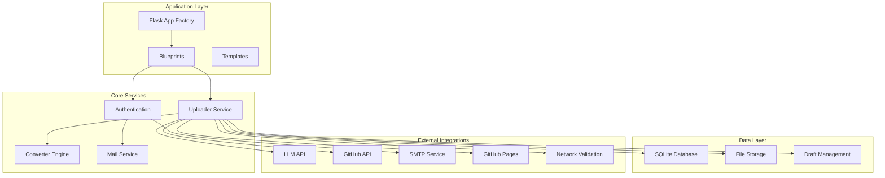
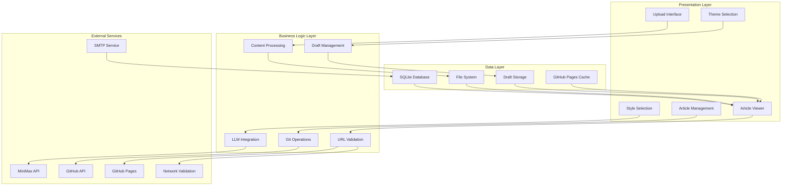
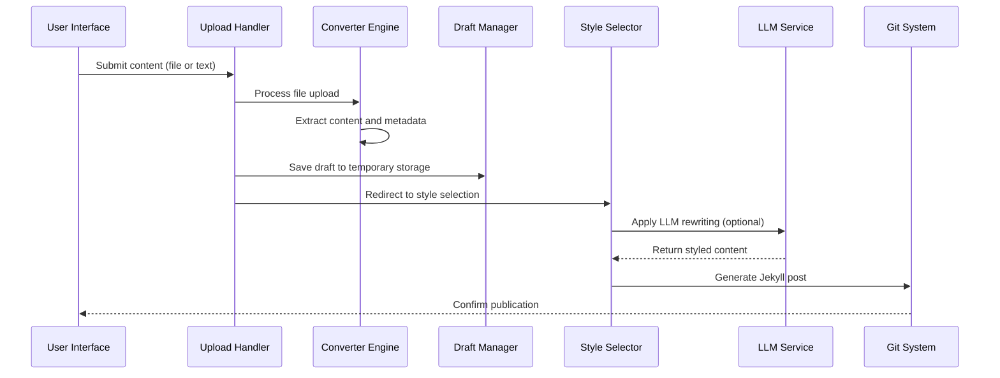
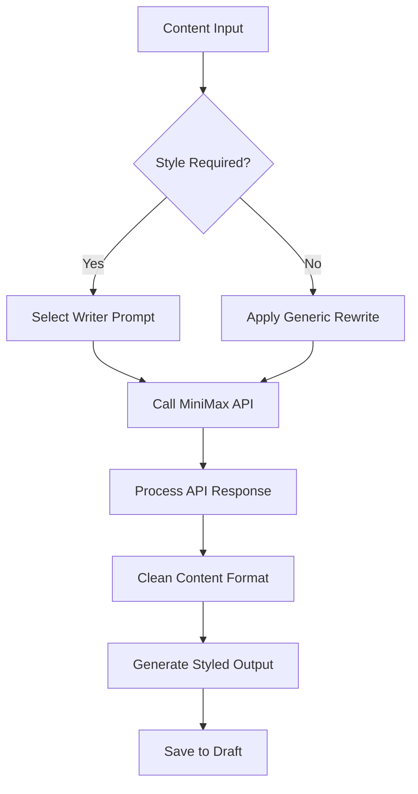
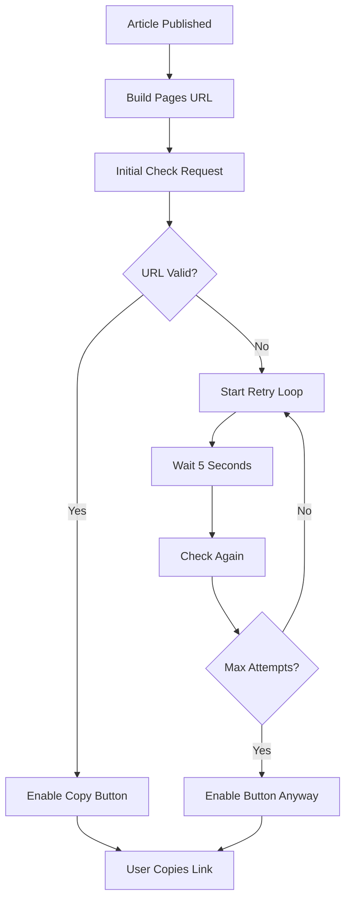
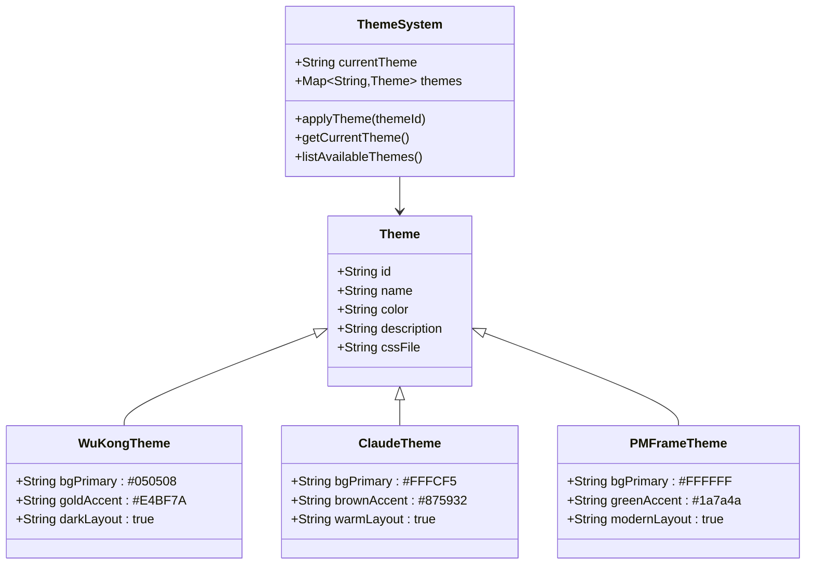
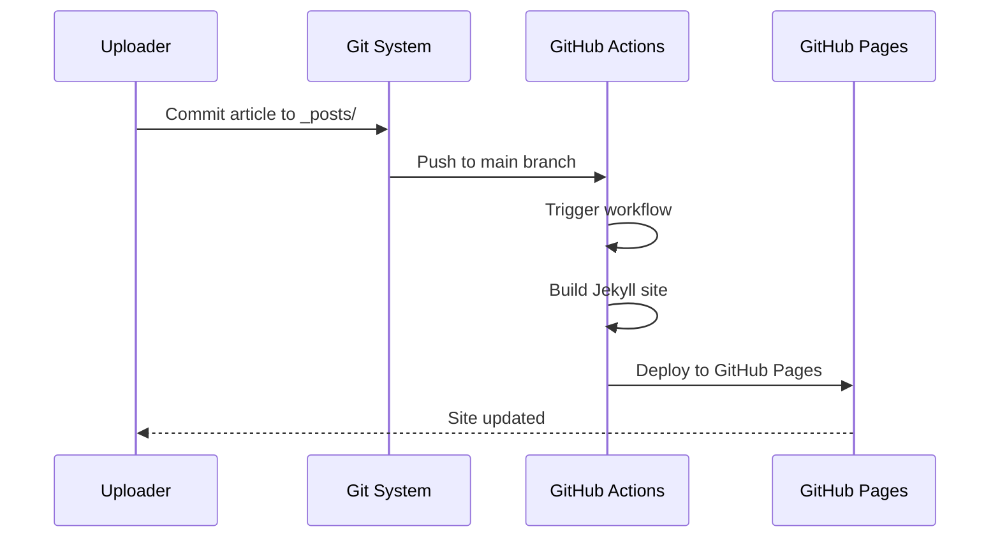
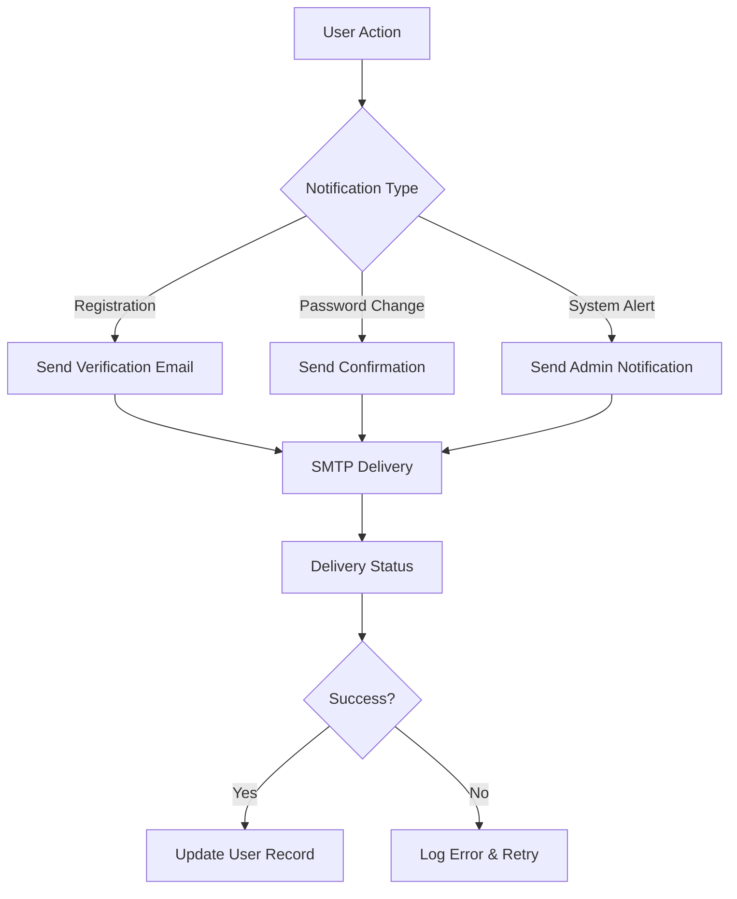
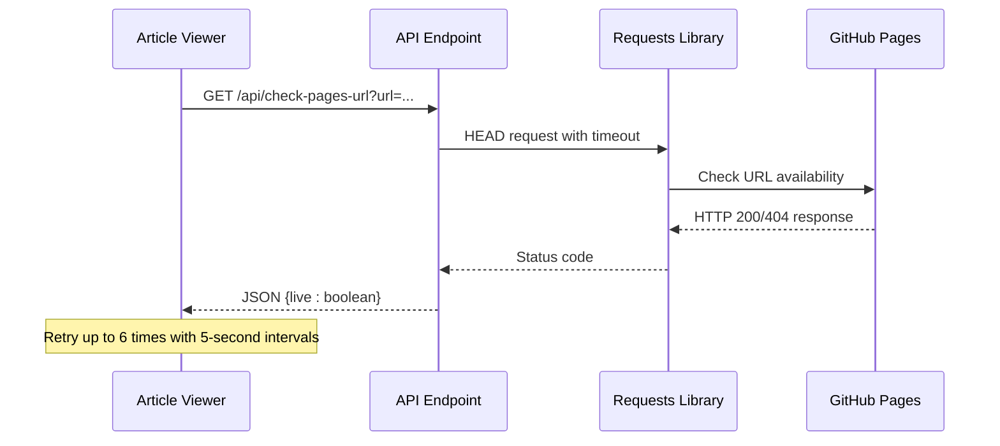

# Uploader Application Enhancements

<cite>
**Referenced Files in This Document**
- [app/__init__.py](file://app/__init__.py)
- [app/uploader.py](file://app/uploader.py)
- [app/auth.py](file://app/auth.py)
- [app/converter.py](file://app/converter.py)
- [app/mailer.py](file://app/mailer.py)
- [_config.yml](file://_config.yml)
- [requirements.txt](file://requirements.txt)
- [app/templates/upload.html](file://app/templates/upload.html)
- [app/templates/style_select.html](file://app/templates/style_select.html)
- [app/templates/articles.html](file://app/templates/articles.html)
- [app/templates/article_view.html](file://app/templates/article_view.html)
- [assets/css/main.css](file://assets/css/main.css)
- [assets/css/theme-claude.css](file://assets/css/theme-claude.css)
- [.github/workflows/deploy.yml](file://.github/workflows/deploy.yml)
- [data/theme.json](file://data/theme.json)
- [data/drafts/6aa833b7312e.json](file://data/drafts/6aa833b7312e.json)
- [_posts/2025-01-15-understanding-transformer-attention.md](file://_posts/2025-01-15-understanding-transformer-attention.md)
- [_posts/2026-04-10-da-mo-xing-xun-lian-fang-fa-jie-xi.md](file://_posts/2026-04-10-da-mo-xing-xun-lian-fang-fa-jie-xi.md)
</cite>

## Update Summary
**Changes Made**
- Added new API endpoint `/api/check-pages-url` for GitHub Pages URL validation
- Enhanced article viewing with URL building functionality using `_build_pages_url()`
- Improved error handling for network failures in article sharing functionality
- Added real-time URL checking with retry mechanism for GitHub Pages deployment status

## Table of Contents
1. [Introduction](#introduction)
2. [Project Structure](#project-structure)
3. [Core Components](#core-components)
4. [Architecture Overview](#architecture-overview)
5. [Detailed Component Analysis](#detailed-component-analysis)
6. [Enhancement Proposals](#enhancement-proposals)
7. [Integration Points](#integration-points)
8. [Performance Considerations](#performance-considerations)
9. [Troubleshooting Guide](#troubleshooting-guide)
10. [Conclusion](#conclusion)

## Introduction

The Uploader Application Enhancements project represents a sophisticated content management system designed for AI-focused technical blogging. Built on Flask, this application provides authors with a streamlined workflow for converting various document formats into polished blog posts with AI-powered writing assistance. The system supports multiple content input methods, automated conversion pipelines, and intelligent content styling through Large Language Model (LLM) integration.

The application serves as a comprehensive solution for technical writers, researchers, and content creators who need to transform research papers, technical documents, and various digital content into publishable blog posts with professional styling and seamless GitHub integration for automated deployment.

**Updated** Added new API endpoint for GitHub Pages URL validation and enhanced article viewing functionality with improved error handling for network failures.

## Project Structure

The project follows a modular Flask architecture with clear separation of concerns across different functional domains:

**Diagram sources**
- [app/__init__.py:43-76](file://app/__init__.py#L43-L76)
- [app/uploader.py:23-24](file://app/uploader.py#L23-L24)
- [app/auth.py:13](file://app/auth.py#L13)
- [app/uploader.py:502-532](file://app/uploader.py#L502-L532)

The application is organized into several key directories:

- **app/**: Core Flask application with blueprints and services
- **assets/**: Static resources including CSS themes and images
- **data/**: Persistent storage for uploads, drafts, and configuration
- **_posts/**: Generated Jekyll blog posts
- **_layouts/**, **_includes/**: Jekyll templating system
- **.github/workflows/**: CI/CD automation for deployment

**Section sources**
- [app/__init__.py:43-76](file://app/__init__.py#L43-L76)
- [requirements.txt:1-8](file://requirements.txt#L1-L8)

## Core Components

### Flask Application Factory

The application initializes through a factory pattern that configures database connections, registers blueprints, and sets up static asset serving. The factory pattern ensures proper isolation of application contexts and enables testing capabilities.

Key initialization features include:
- SQLite database connection with WAL mode for improved concurrency
- Environment variable loading for configuration management
- Automatic database schema initialization
- Static asset serving from the assets directory

### Authentication System

The authentication module provides comprehensive user management with email verification integration. The system supports secure password hashing, session-based authentication, and role-based access control for administrative functions.

Security features include:
- Password hashing with Werkzeug security utilities
- Email verification with time-limited codes
- Session-based user state management
- Login-required decorators for protected routes

### Content Conversion Pipeline

The converter engine handles multiple document formats through specialized processors:
- PDF conversion using PyMuPDF with intelligent structure detection
- DOCX processing via Mammoth and HTML2Text transformations
- HTML to Markdown conversion with formatting preservation
- TXT and MD direct processing with title extraction

### GitHub Pages Integration

**New** The application now includes comprehensive GitHub Pages integration with URL validation and real-time status checking:

- **URL Building**: Automatic generation of GitHub Pages URLs from Jekyll post filenames using `_build_pages_url()` function
- **Validation Endpoint**: `/api/check-pages-url` endpoint for validating GitHub Pages URL availability
- **Real-time Checking**: JavaScript-based URL validation with retry mechanism for deployment status monitoring
- **Error Handling**: Graceful fallback for network failures and deployment delays

**Section sources**
- [app/__init__.py:9-24](file://app/__init__.py#L9-L24)
- [app/auth.py:26-49](file://app/auth.py#L26-L49)
- [app/converter.py:96-110](file://app/converter.py#L96-L110)
- [app/uploader.py:508-532](file://app/uploader.py#L508-L532)

## Architecture Overview

The Uploader Application employs a layered architecture with clear separation between presentation, business logic, and data persistence:

**Diagram sources**
- [app/uploader.py:353-396](file://app/uploader.py#L353-L396)
- [app/uploader.py:413-492](file://app/uploader.py#L413-L492)
- [app/mailer.py:8-52](file://app/mailer.py#L8-L52)
- [app/uploader.py:508-532](file://app/uploader.py#L508-L532)

The architecture supports horizontal scalability through stateless service design and provides robust error handling mechanisms throughout the content processing pipeline.

## Detailed Component Analysis

### Upload and Content Processing Workflow

The upload system implements a sophisticated multi-stage content processing pipeline:

**Diagram sources**
- [app/uploader.py:353-396](file://app/uploader.py#L353-L396)
- [app/uploader.py:413-492](file://app/uploader.py#L413-L492)
- [app/converter.py:96-110](file://app/converter.py#L96-L110)

The workflow supports both file-based and text-based content ingestion, with automatic metadata extraction and intelligent content structuring.

### LLM Integration and Content Styling

The application integrates with MiniMax API for advanced content rewriting and style enhancement:

**Diagram sources**
- [app/uploader.py:160-184](file://app/uploader.py#L160-L184)
- [app/uploader.py:204-245](file://app/uploader.py#L204-L245)

The system maintains distinct writing prompts for different content styles, enabling authors to achieve specific narrative voices and technical precision levels.

### GitHub Pages URL Validation System

**New** The application now includes a comprehensive GitHub Pages URL validation system:

**Diagram sources**
- [app/uploader.py:508-532](file://app/uploader.py#L508-L532)
- [app/uploader.py:535-571](file://app/uploader.py#L535-L571)
- [app/templates/article_view.html:322-369](file://app/templates/article_view.html#L322-L369)

The system automatically validates GitHub Pages URLs with a 6-attempt retry mechanism, providing graceful fallback when deployment is still in progress.

### Theme Management System

The application provides three distinct visual themes with CSS variable overrides:

**Diagram sources**
- [app/uploader.py:40-47](file://app/uploader.py#L40-L47)
- [app/uploader.py:56-77](file://app/uploader.py#L56-L77)
- [assets/css/theme-claude.css:1-68](file://assets/css/theme-claude.css#L1-L68)

Each theme maintains consistent design systems with appropriate color schemes, typography choices, and layout optimizations.

**Section sources**
- [app/uploader.py:25-47](file://app/uploader.py#L25-L47)
- [app/uploader.py:56-77](file://app/uploader.py#L56-L77)
- [assets/css/main.css:1-64](file://assets/css/main.css#L1-L64)

## Enhancement Proposals

### Performance Optimizations

1. **Async Processing Queue**: Implement Celery or similar async task processing for LLM operations to prevent blocking user interactions during content generation.

2. **Content Caching**: Add Redis caching layer for frequently accessed content and processed drafts to reduce database load.

3. **Image Optimization**: Integrate automatic image compression and responsive image generation for improved page load times.

4. **URL Validation Caching**: Cache GitHub Pages URL validation results to reduce network requests for frequently checked articles.

### Security Enhancements

1. **Rate Limiting**: Implement rate limiting for LLM API calls and file uploads to prevent abuse and ensure fair resource distribution.

2. **Content Sanitization**: Add comprehensive content sanitization for user-generated content to prevent XSS attacks and malformed HTML injection.

3. **Audit Logging**: Implement detailed audit trails for all content modifications, user actions, and system events for compliance and debugging purposes.

4. **API Security**: Add authentication and rate limiting for the new `/api/check-pages-url` endpoint to prevent abuse.

### User Experience Improvements

1. **Real-time Preview**: Add live markdown preview functionality with instant rendering as users type.

2. **Template Library**: Expand the style system with customizable templates and reusable content blocks.

3. **Collaboration Features**: Implement multi-user editing capabilities with conflict resolution and version history.

4. **Deployment Status Dashboard**: Create a visual dashboard showing article deployment status across all published content.

### Integration Extensions

1. **Cloud Storage**: Add support for cloud storage providers (AWS S3, Google Cloud Storage) for scalable media hosting.

2. **Analytics Integration**: Implement comprehensive analytics tracking for content performance and reader engagement metrics.

3. **Social Media Integration**: Add automated social media posting capabilities for LinkedIn, Twitter, and other platforms.

4. **Multi-Platform Deployment**: Extend GitHub Pages integration to support other static hosting platforms.

## Integration Points

### GitHub Automation

The application integrates seamlessly with GitHub through automated deployment workflows:

**Diagram sources**
- [app/uploader.py:475-492](file://app/uploader.py#L475-L492)
- [.github/workflows/deploy.yml:1-62](file://.github/workflows/deploy.yml#L1-L62)

The deployment pipeline automatically builds and publishes content updates with comprehensive error handling and rollback capabilities.

### Email Notification System

The mailer service provides comprehensive notification capabilities for user registration, verification, and system alerts:

**Diagram sources**
- [app/mailer.py:8-52](file://app/mailer.py#L8-L52)
- [app/auth.py:77-90](file://app/auth.py#L77-L90)

### GitHub Pages URL Validation Integration

**New** The application integrates with GitHub Pages for real-time URL validation:

**Diagram sources**
- [app/uploader.py:519-532](file://app/uploader.py#L519-L532)
- [app/templates/article_view.html:322-369](file://app/templates/article_view.html#L322-L369)

**Section sources**
- [.github/workflows/deploy.yml:29-62](file://.github/workflows/deploy.yml#L29-L62)
- [app/mailer.py:8-52](file://app/mailer.py#L8-L52)
- [app/uploader.py:519-532](file://app/uploader.py#L519-L532)

## Performance Considerations

### Memory Management

The application implements several strategies to optimize memory usage:
- Temporary file cleanup after processing
- Efficient content streaming for large files
- Database connection pooling with proper lifecycle management
- Session-based draft storage to avoid cookie size limitations

### Scalability Patterns

Horizontal scaling considerations include:
- Stateless service design enabling load balancing
- Database connection reuse through Flask's application context
- File system storage with potential cloud migration paths
- Async processing for CPU-intensive operations

### Monitoring and Metrics

Key performance indicators to track:
- LLM API response times and error rates
- File upload processing duration
- Database query performance metrics
- User session management efficiency
- **New** GitHub Pages URL validation response times and error rates

### Network Failure Handling

**Updated** Enhanced error handling for network failures:
- Timeout configuration (8-second timeout for URL checks)
- Graceful fallback when GitHub Pages is unavailable
- Retry mechanism with exponential backoff
- User-friendly error messaging for network issues

**Section sources**
- [app/uploader.py:527-532](file://app/uploader.py#L527-L532)
- [app/templates/article_view.html:356-366](file://app/templates/article_view.html#L356-L366)

## Troubleshooting Guide

### Common Issues and Solutions

**File Upload Failures**
- Verify file size limits (16MB maximum)
- Check supported file extensions (PDF, DOCX, HTML, Markdown)
- Ensure proper file permissions for upload directory

**LLM Integration Problems**
- Confirm MINIMAX_TOKEN_PLAN_API_KEY environment variable
- Verify network connectivity to MiniMax API endpoint
- Check API quota limits and billing status

**Database Connection Errors**
- Verify SQLite database file permissions
- Check WAL mode compatibility with deployment environment
- Monitor database connection pool exhaustion

**Theme Loading Issues**
- Confirm theme JSON file exists and is properly formatted
- Verify CSS file paths for theme overrides
- Check browser cache clearing for theme changes

**GitHub Pages URL Validation Issues**
- **New** Verify GitHub Pages is enabled for the repository
- Check that the article filename follows the correct Jekyll format (YYYY-MM-DD-slug.md)
- Ensure the URL validation endpoint is accessible
- Monitor network connectivity to GitHub Pages

**Network Failure Handling**
- **New** Check timeout settings for URL validation requests
- Verify proper error handling in client-side JavaScript
- Monitor retry mechanisms for deployment status checking

### Debug Configuration

Enable debug mode for development:
- Set FLASK_ENV=development
- Configure logging level to DEBUG
- Enable Flask debug toolbar for request analysis

**Section sources**
- [app/uploader.py:189-201](file://app/uploader.py#L189-L201)
- [app/__init__.py:9-17](file://app/__init__.py#L9-L17)
- [data/theme.json:1](file://data/theme.json#L1)
- [app/uploader.py:527-532](file://app/uploader.py#L527-L532)

## Conclusion

The Uploader Application Enhancements represents a comprehensive solution for AI-focused technical content creation and publishing. The system successfully combines modern web technologies with advanced AI capabilities to provide authors with powerful tools for content transformation and publication.

Key strengths of the implementation include:
- Robust content conversion pipeline supporting multiple formats
- Intelligent LLM integration for content enhancement
- Flexible theming system with professional design aesthetics
- Automated deployment workflow for seamless publishing
- Comprehensive security measures and user management
- **New** Real-time GitHub Pages URL validation with graceful error handling
- **New** Enhanced article viewing experience with deployment status monitoring

Recent enhancements significantly improve the user experience by providing real-time feedback on article deployment status and robust error handling for network failures. The new URL validation system ensures users can confidently share links even when GitHub Pages deployment is still in progress.

Future enhancements should focus on performance optimization, expanded integration capabilities, and enhanced user experience features while maintaining the system's reliability and security standards.

The modular architecture and clear separation of concerns provide an excellent foundation for continued evolution and adaptation to emerging content creation and publishing requirements.