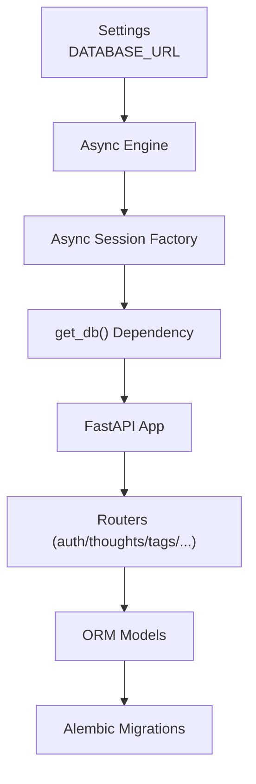
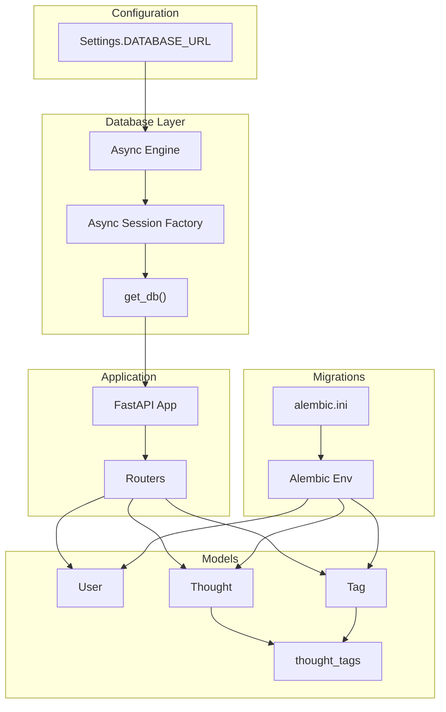
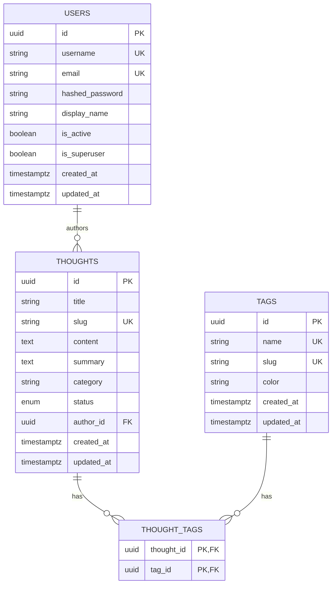
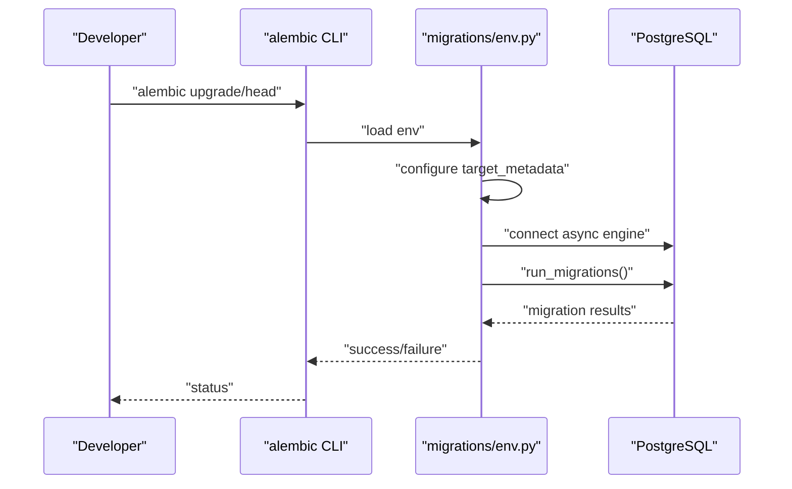
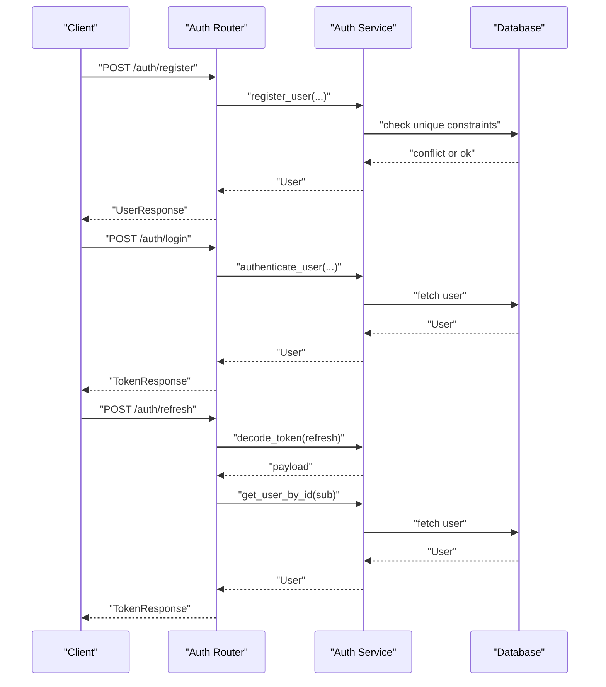
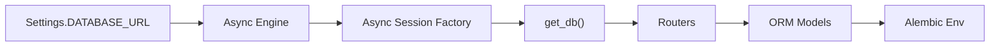

# Database Design

<cite>
**Referenced Files in This Document**
- [backend/app/database.py](file://backend/app/database.py)
- [backend/app/config.py](file://backend/app/config.py)
- [backend/migrations/env.py](file://backend/migrations/env.py)
- [backend/alembic.ini](file://backend/alembic.ini)
- [backend/app/common/models.py](file://backend/app/common/models.py)
- [backend/app/thoughts/models.py](file://backend/app/thoughts/models.py)
- [backend/app/tags/models.py](file://backend/app/tags/models.py)
- [backend/app/auth/service.py](file://backend/app/auth/service.py)
- [backend/app/auth/schemas.py](file://backend/app/auth/schemas.py)
- [backend/app/main.py](file://backend/app/main.py)
</cite>

## Table of Contents
1. [Introduction](#introduction)
2. [Project Structure](#project-structure)
3. [Core Components](#core-components)
4. [Architecture Overview](#architecture-overview)
5. [Detailed Component Analysis](#detailed-component-analysis)
6. [Dependency Analysis](#dependency-analysis)
7. [Performance Considerations](#performance-considerations)
8. [Troubleshooting Guide](#troubleshooting-guide)
9. [Conclusion](#conclusion)
10. [Appendices](#appendices)

## Introduction
This document describes the database design and schema for PolaZhenJing, focusing on the core entities Users, Thoughts, Tags, and the implicit Token mechanism used for authentication. It documents table structures, field definitions, data types, constraints, primary and foreign key relationships, indexing strategy, normalization, migration system, schema evolution, and data integrity mechanisms. It also explains the SQLAlchemy ORM models, relationship configurations, and typical query patterns used by the application.

## Project Structure
The database layer is implemented with SQLAlchemy (async) and Alembic for migrations. The application loads configuration from environment variables, initializes an async PostgreSQL engine, and exposes a dependency to obtain sessions for request-scoped database operations. Models are defined under shared and feature-specific modules, and migrations are orchestrated via Alembic’s async environment.

**Diagram sources**
- [backend/app/config.py:34-35](file://backend/app/config.py#L34-L35)
- [backend/app/database.py:24-36](file://backend/app/database.py#L24-L36)
- [backend/app/database.py:46-61](file://backend/app/database.py#L46-L61)
- [backend/app/main.py:58-71](file://backend/app/main.py#L58-L71)
- [backend/migrations/env.py:16-26](file://backend/migrations/env.py#L16-L26)

**Section sources**
- [backend/app/config.py:34-35](file://backend/app/config.py#L34-L35)
- [backend/app/database.py:24-36](file://backend/app/database.py#L24-L36)
- [backend/app/database.py:46-61](file://backend/app/database.py#L46-L61)
- [backend/app/main.py:58-71](file://backend/app/main.py#L58-L71)
- [backend/migrations/env.py:16-26](file://backend/migrations/env.py#L16-L26)

## Core Components
This section documents the core relational entities and their constraints.

- Users
  - Purpose: Application users with authentication and profile attributes.
  - Primary key: id (UUID).
  - Unique indexes: username, email.
  - Additional fields: hashed_password, display_name, is_active, is_superuser.
  - Timestamps: created_at, updated_at via TimestampMixin.
  - Relationships: One-to-many with Thoughts (author_id).
  - Business constraints:
    - Username and email must be unique.
    - is_active can be toggled to deactivate accounts (soft delete).
    - Passwords are stored as hashes.

- Thoughts
  - Purpose: Individual reflections/articles authored by Users.
  - Primary key: id (UUID).
  - Unique indexes: slug.
  - Regular indexes: category.
  - Fields: title, slug, content, summary, category, status (enum draft/published/archived).
  - Foreign key: author_id → users.id (on delete CASCADE).
  - Relationships: Many-to-one with User (author), many-to-many with Tag via thought_tags.
  - Business constraints:
    - Author must exist.
    - Status defaults to draft.
    - Slug is unique and URL-friendly.

- Tags
  - Purpose: Labels for categorizing Thoughts.
  - Primary key: id (UUID).
  - Unique indexes: name, slug.
  - Optional field: color (hex).
  - Relationships: Many-to-many with Thoughts via thought_tags.
  - Business constraints:
    - Name and slug must be unique.
    - Color is optional.

- Association table: thought_tags
  - Columns: thought_id (UUID, FK to thoughts.id, CASCADE), tag_id (UUID, FK to tags.id, CASCADE).
  - Composite primary key: (thought_id, tag_id).
  - Behavior: On deletion of a Thought or Tag, related rows in thought_tags are removed (CASCADE).

Normalization
- The schema is normalized to third normal form (3NF):
  - Atomic values and no transitive dependencies.
  - Repeated groupings (Thought-Tag) are separated into a dedicated association table.
  - Timestamps are centralized via a mixin to avoid duplication.

Constraints and Indexing
- Unique constraints enforced at the database level for usernames, emails, tag names, tag slugs, and thought slugs.
- Indexes on frequently filtered/searched columns: user.username, user.email, tag.name, tag.slug, thought.slug, thought.category.
- Foreign keys enforce referential integrity between Thoughts.author_id → Users.id and association rows → Thoughts/Tags.

**Section sources**
- [backend/app/common/models.py:40-76](file://backend/app/common/models.py#L40-L76)
- [backend/app/thoughts/models.py:30-70](file://backend/app/thoughts/models.py#L30-L70)
- [backend/app/tags/models.py:21-66](file://backend/app/tags/models.py#L21-L66)

## Architecture Overview
The database architecture centers around asynchronous SQLAlchemy with Alembic migrations. The application constructs an async engine from configuration, creates a session factory, and exposes a dependency for route handlers. Models are organized by domain (common, thoughts, tags), and migrations detect metadata from imported models.

**Diagram sources**
- [backend/app/config.py:34-35](file://backend/app/config.py#L34-L35)
- [backend/app/database.py:24-36](file://backend/app/database.py#L24-L36)
- [backend/app/database.py:46-61](file://backend/app/database.py#L46-L61)
- [backend/app/main.py:58-71](file://backend/app/main.py#L58-L71)
- [backend/app/thoughts/models.py:20-21](file://backend/app/thoughts/models.py#L20-L21)
- [backend/migrations/env.py:16-26](file://backend/migrations/env.py#L16-L26)
- [backend/alembic.ini:4-6](file://backend/alembic.ini#L4-L6)

## Detailed Component Analysis

### Entity Relationship Diagram

**Diagram sources**
- [backend/app/common/models.py:40-76](file://backend/app/common/models.py#L40-L76)
- [backend/app/thoughts/models.py:30-70](file://backend/app/thoughts/models.py#L30-L70)
- [backend/app/tags/models.py:21-66](file://backend/app/tags/models.py#L21-L66)

### ORM Models and Relationship Configuration
- TimestampMixin
  - Adds created_at and updated_at with server-side defaults and updates.
  - Applied to User, Thought, and Tag to standardize audit fields.

- User
  - Primary key: id (UUID).
  - Unique indexes: username, email.
  - Relationship: thoughts back-populates from Thought.author.
  - Lazy loading: selectin for author-thoughts traversal.

- Thought
  - Primary key: id (UUID).
  - Unique index: slug.
  - Index: category.
  - Enum: status (Draft/Published/Archived).
  - Foreign key: author_id → users.id (CASCADE).
  - Relationships:
    - author back_populates to User.thoughts.
    - tags via secondary association table thought_tags.

- Tag
  - Primary key: id (UUID).
  - Unique indexes: name, slug.
  - Optional color.
  - Relationship: thoughts via secondary thought_tags.

- Association table thought_tags
  - Composite primary key: (thought_id, tag_id).
  - Foreign keys: thought_id → thoughts.id (CASCADE), tag_id → tags.id (CASCADE).

**Section sources**
- [backend/app/common/models.py:24-38](file://backend/app/common/models.py#L24-L38)
- [backend/app/common/models.py:40-76](file://backend/app/common/models.py#L40-L76)
- [backend/app/thoughts/models.py:23-28](file://backend/app/thoughts/models.py#L23-L28)
- [backend/app/thoughts/models.py:30-70](file://backend/app/thoughts/models.py#L30-L70)
- [backend/app/tags/models.py:21-66](file://backend/app/tags/models.py#L21-L66)

### Migration System and Schema Evolution
- Alembic Environment
  - Imports all models to ensure metadata detection.
  - Supports offline and online modes.
  - Uses async engine for online migrations.

- Alembic Configuration
  - script_location points to migrations.
  - sqlalchemy.url mirrors DATABASE_URL for migration connectivity.

- Execution Flow
  - Offline: Alembic runs migrations against DATABASE_URL with literal binds.
  - Online: Alembic connects asynchronously and runs migrations against the configured database.

**Diagram sources**
- [backend/migrations/env.py:29-54](file://backend/migrations/env.py#L29-L54)
- [backend/alembic.ini:4-6](file://backend/alembic.ini#L4-L6)

**Section sources**
- [backend/migrations/env.py:16-26](file://backend/migrations/env.py#L16-L26)
- [backend/migrations/env.py:29-54](file://backend/migrations/env.py#L29-L54)
- [backend/alembic.ini:4-6](file://backend/alembic.ini#L4-L6)

### Authentication Token Mechanism
While tokens are not persisted in the database, the authentication flow relies on JWT tokens generated by the backend. The token lifecycle is handled in service and router modules.

- Token Creation
  - Access token: short-lived, includes subject (user id) and expiration.
  - Refresh token: long-lived, includes subject and expiration.

- Token Validation
  - Decoding validates signature and expiration; rejects invalid or expired tokens.
  - Enforces token type checks during refresh.

- User Operations
  - Registration enforces unique username and email, hashes passwords.
  - Login authenticates credentials and ensures the user is active.
  - Retrieval by id supports protected routes.

**Diagram sources**
- [backend/app/auth/router.py:42-90](file://backend/app/auth/router.py#L42-L90)
- [backend/app/auth/service.py:91-165](file://backend/app/auth/service.py#L91-L165)
- [backend/app/auth/schemas.py:19-57](file://backend/app/auth/schemas.py#L19-L57)

**Section sources**
- [backend/app/auth/service.py:42-88](file://backend/app/auth/service.py#L42-L88)
- [backend/app/auth/service.py:91-165](file://backend/app/auth/service.py#L91-L165)
- [backend/app/auth/router.py:42-90](file://backend/app/auth/router.py#L42-L90)
- [backend/app/auth/schemas.py:19-57](file://backend/app/auth/schemas.py#L19-L57)

### Typical Query Patterns
- User queries
  - By unique username or email.
  - By primary key id.
  - Filtering by activity status.

- Thought queries
  - By author id (author-thoughts).
  - By slug (lookup).
  - By category (filtered listing).
  - With eager loading of tags and author.

- Tag queries
  - By name or slug.
  - With related thoughts (many-to-many).

- Association queries
  - Join or filter by thought_id or tag_id.
  - Cascade behavior on deletion.

**Section sources**
- [backend/app/auth/service.py:108-112](file://backend/app/auth/service.py#L108-L112)
- [backend/app/auth/service.py:125-149](file://backend/app/auth/service.py#L125-L149)
- [backend/app/auth/service.py:152-164](file://backend/app/auth/service.py#L152-L164)
- [backend/app/thoughts/models.py:63-66](file://backend/app/thoughts/models.py#L63-L66)
- [backend/app/tags/models.py:60-62](file://backend/app/tags/models.py#L60-L62)

## Dependency Analysis
- Database engine and session
  - Created from settings.DATABASE_URL.
  - Session dependency commits or rolls back per request.

- Model imports for migrations
  - Alembic env imports models to detect metadata.

- Application wiring
  - FastAPI app includes routers and lifecycle hooks dispose the engine.

**Diagram sources**
- [backend/app/config.py:34-35](file://backend/app/config.py#L34-L35)
- [backend/app/database.py:24-36](file://backend/app/database.py#L24-L36)
- [backend/app/database.py:46-61](file://backend/app/database.py#L46-L61)
- [backend/migrations/env.py:16-26](file://backend/migrations/env.py#L16-L26)

**Section sources**
- [backend/app/config.py:34-35](file://backend/app/config.py#L34-L35)
- [backend/app/database.py:24-36](file://backend/app/database.py#L24-L36)
- [backend/app/database.py:46-61](file://backend/app/database.py#L46-L61)
- [backend/migrations/env.py:16-26](file://backend/migrations/env.py#L16-L26)

## Performance Considerations
- Asynchronous I/O
  - Async engine and sessions reduce contention under concurrent load.

- Connection pooling
  - Pool pre-ping enabled; tuned pool size and overflow to balance throughput and resource usage.

- Indexing strategy
  - Unique indexes on high-cardinality identifiers (username, email, tag name/slug, thought slug).
  - Index on category for filtered listings.

- Eager loading
  - Selectin loading for relationships reduces N+1 query risks.

- Timestamps
  - Server defaults minimize application-side overhead.

[No sources needed since this section provides general guidance]

## Troubleshooting Guide
- Database connectivity
  - Verify DATABASE_URL in settings and environment.
  - Confirm PostgreSQL is reachable and credentials are correct.

- Migration failures
  - Ensure models are imported in Alembic env so metadata is detected.
  - Run migrations in online mode to connect asynchronously.

- Constraint violations
  - Unique constraint errors indicate duplicate usernames, emails, tag names, or slugs.
  - Fix duplicates or adjust inputs accordingly.

- Session lifecycle
  - get_db() automatically commits or rolls back; ensure exceptions propagate to trigger rollback.

**Section sources**
- [backend/app/config.py:34-35](file://backend/app/config.py#L34-L35)
- [backend/migrations/env.py:16-26](file://backend/migrations/env.py#L16-L26)
- [backend/app/database.py:46-61](file://backend/app/database.py#L46-L61)

## Conclusion
The PolaZhenJing database design leverages SQLAlchemy’s async ORM with Alembic migrations to maintain a clean, normalized schema. Users, Thoughts, and Tags are modeled with explicit primary and foreign keys, unique constraints, and targeted indexes. The many-to-many relationship between Thoughts and Tags is implemented via an association table with cascade semantics. Authentication is token-based and does not require persistent token storage, while the database enforces strong data integrity through constraints and referential integrity.

[No sources needed since this section summarizes without analyzing specific files]

## Appendices

### Appendix A: Sample Data Structures
- User
  - id: UUID
  - username: string (unique)
  - email: string (unique)
  - hashed_password: string
  - display_name: string or null
  - is_active: boolean
  - is_superuser: boolean
  - created_at, updated_at: timestamps

- Thought
  - id: UUID
  - title: string
  - slug: string (unique)
  - content: text
  - summary: text or null
  - category: string or null
  - status: enum (draft/published/archived)
  - author_id: UUID (foreign key to users)
  - created_at, updated_at: timestamps

- Tag
  - id: UUID
  - name: string (unique)
  - slug: string (unique)
  - color: string or null
  - created_at, updated_at: timestamps

- Association table: thought_tags
  - thought_id: UUID (foreign key to thoughts)
  - tag_id: UUID (foreign key to tags)

**Section sources**
- [backend/app/common/models.py:40-76](file://backend/app/common/models.py#L40-L76)
- [backend/app/thoughts/models.py:30-70](file://backend/app/thoughts/models.py#L30-L70)
- [backend/app/tags/models.py:21-66](file://backend/app/tags/models.py#L21-L66)