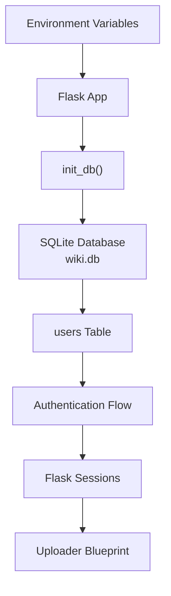
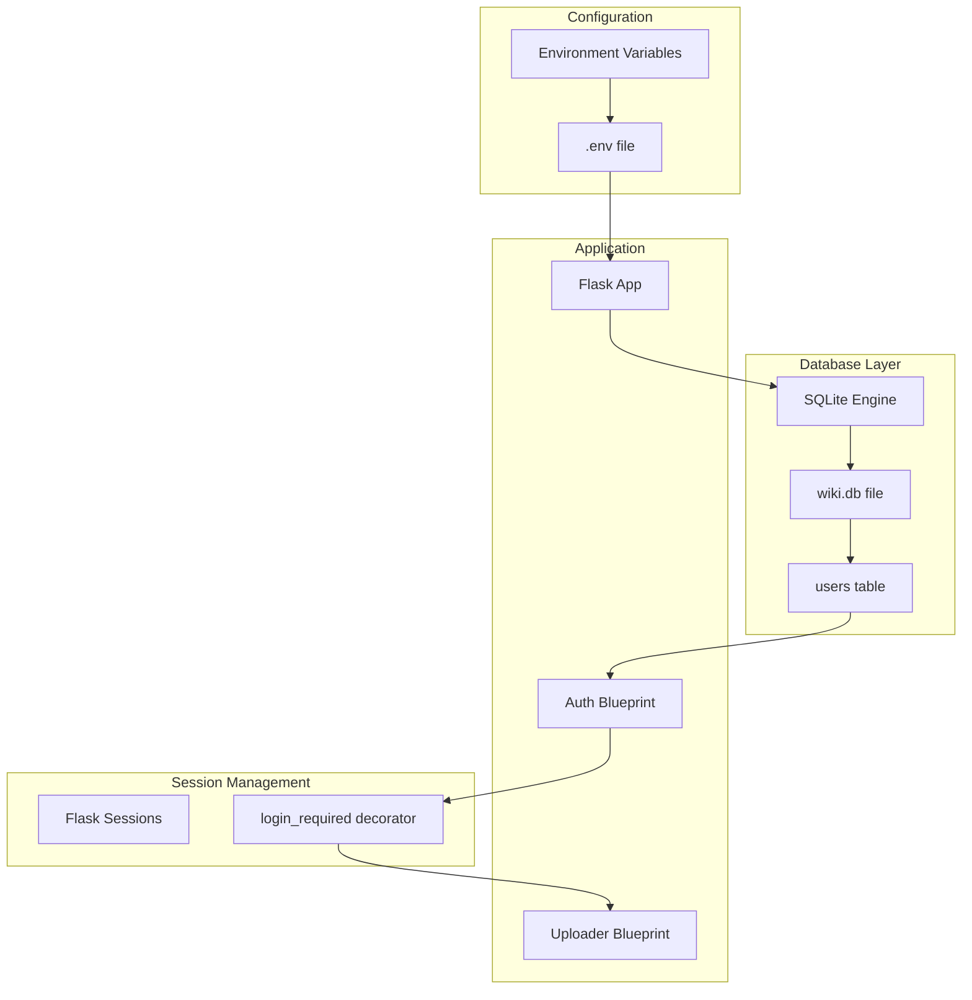
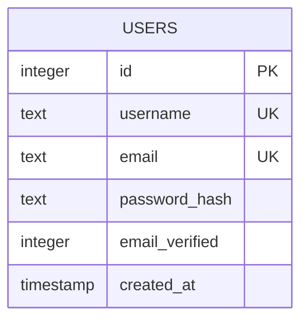
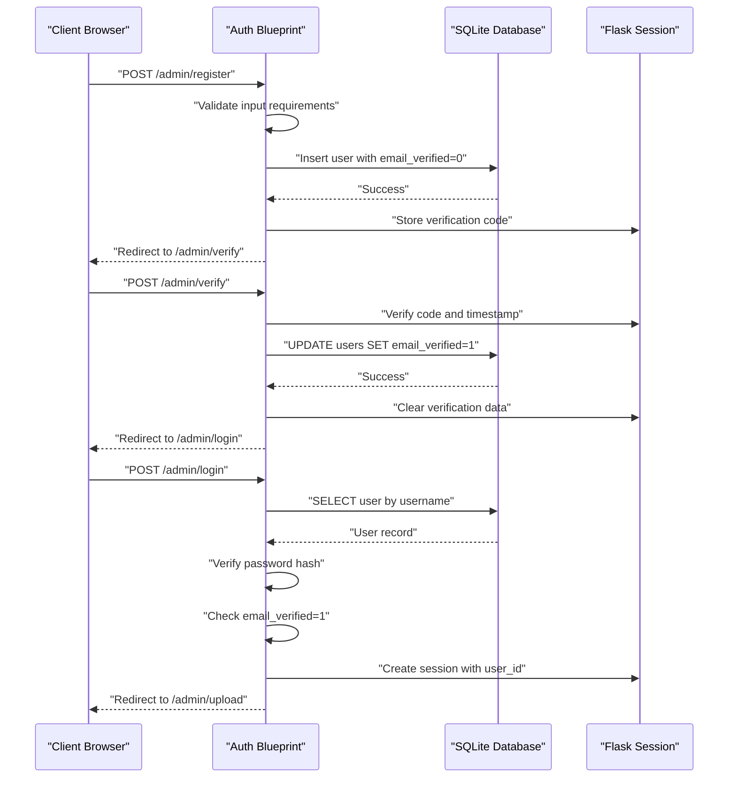

# Database Design

<cite>
**Referenced Files in This Document**
- [app/__init__.py](file://app/__init__.py)
- [app/auth.py](file://app/auth.py)
- [app/uploader.py](file://app/uploader.py)
- [app/converter.py](file://app/converter.py)
- [app/mailer.py](file://app/mailer.py)
- [wiki.py](file://wiki.py)
- [_posts/2025-01-15-understanding-transformer-attention.md](file://_posts/2025-01-15-understanding-transformer-attention.md)
- [_posts/2025-02-10-visual-language-of-ai.md](file://_posts/2025-02-10-visual-language-of-ai.md)
</cite>

## Update Summary
**Changes Made**
- Complete removal of PostgreSQL + Alembic architecture and SQLAlchemy models
- Elimination of complex relational schema (Researches, Thoughts, Tags, Sharing entities)
- Replacement with simplified SQLite-based single-table design
- Removal of migration system and complex authentication token infrastructure
- Streamlined database initialization and connection management
- Shift from database-stored content to file-based article management

## Table of Contents
1. [Introduction](#introduction)
2. [Project Structure](#project-structure)
3. [Core Components](#core-components)
4. [Architecture Overview](#architecture-overview)
5. [Detailed Component Analysis](#detailed-component-analysis)
6. [Dependency Analysis](#dependency-analysis)
7. [Performance Considerations](#performance-considerations)
8. [Troubleshooting Guide](#troubleshooting-guide)
9. [Conclusion](#conclusion)
10. [Appendices](#appendices)

## Introduction
This document describes the database design and schema for PolaZhenJing v2, focusing on the simplified SQLite-based architecture for zero-configuration local development. The system has evolved from a complex PostgreSQL-backed application with Alembic migrations to a streamlined Flask-based solution with a single-user authentication table. This document covers the table structures, field definitions, data types, constraints, and the new simplified database design.

**Updated** Removed all references to previous SQLAlchemy models, researches, thoughts, tags, and sharing entities. The system now operates with a completely different architectural foundation.

## Project Structure
The database layer now uses a simple SQLite connection managed through Flask's application context. The system eliminates the previous complex relational schema and migration system in favor of a straightforward single-table design optimized for personal blog management. Database initialization occurs automatically during application startup, creating the necessary tables with minimal configuration requirements.

**Diagram sources**
- [app/__init__.py:26-41](file://app/__init__.py#L26-L41)
- [app/__init__.py:9-17](file://app/__init__.py#L9-L17)
- [app/auth.py:26-48](file://app/auth.py#L26-L48)

**Section sources**
- [app/__init__.py:26-41](file://app/__init__.py#L26-L41)
- [app/__init__.py:9-17](file://app/__init__.py#L9-L17)
- [app/auth.py:26-48](file://app/auth.py#L26-L48)

## Core Components
The simplified database design consists of a single table structure optimized for personal blog management with basic user authentication.

- Users Table
  - Purpose: Store user authentication credentials and verification status
  - Primary key: id (INTEGER, AUTOINCREMENT)
  - Unique indexes: username, email
  - Additional fields: password_hash, email_verified (INTEGER flag), created_at (TIMESTAMP)
  - Business constraints:
    - Username and email must be unique
    - Passwords are stored as hashes using Werkzeug security
    - Email verification tracked via integer flag (0/1)
    - Automatic timestamp creation on user registration

**Section sources**
- [app/__init__.py:30-40](file://app/__init__.py#L30-L40)
- [app/auth.py:51-96](file://app/auth.py#L51-L96)

## Architecture Overview
The new architecture eliminates the previous PostgreSQL and Alembic complexity in favor of a lightweight SQLite solution. The system initializes the database automatically during application startup, creates the users table with appropriate constraints, and manages connections through Flask's application context. Authentication flows through Flask sessions rather than JWT tokens.

**Diagram sources**
- [app/__init__.py:1-6](file://app/__init__.py#L1-L6)
- [app/__init__.py:26-41](file://app/__init__.py#L26-L41)
- [app/__init__.py:9-17](file://app/__init__.py#L9-L17)
- [app/auth.py:16-23](file://app/auth.py#L16-L23)

## Detailed Component Analysis

### Entity Relationship Diagram

**Diagram sources**
- [app/__init__.py:31-38](file://app/__init__.py#L31-L38)

### Simplified Authentication Flow
The authentication system now operates through Flask sessions rather than JWT tokens, significantly simplifying the authentication mechanism for personal blog management.

- User Registration
  - Validates username, email, and password requirements
  - Generates 6-digit verification code sent via QQ email SMTP
  - Stores user with email_verified flag set to 0 initially
  - Commits transaction on successful registration

- User Login
  - Verifies username exists and password hash matches
  - Checks email_verified flag equals 1
  - Creates Flask session with user_id and username
  - Redirects to article management interface

- Session Management
  - login_required decorator protects all admin endpoints
  - Session cleared on logout operation
  - No token persistence or refresh mechanisms

**Diagram sources**
- [app/auth.py:51-96](file://app/auth.py#L51-L96)
- [app/auth.py:99-133](file://app/auth.py#L99-L133)
- [app/auth.py:26-48](file://app/auth.py#L26-L48)

**Section sources**
- [app/auth.py:51-96](file://app/auth.py#L51-L96)
- [app/auth.py:99-133](file://app/auth.py#L99-L133)
- [app/auth.py:26-48](file://app/auth.py#L26-L48)

### Database Initialization and Connection Management
The database initialization process has been simplified to automatic table creation during application startup, eliminating the need for manual migration commands or complex configuration.

- Connection Management
  - get_db() function manages SQLite connections per request
  - Uses Flask's application context (g) for connection storage
  - Enables WAL mode for improved concurrency
  - Implements row_factory for dict-like access to records

- Automatic Initialization
  - init_db() function creates users table if it doesn't exist
  - Applies all necessary constraints and indexes automatically
  - Executes within application context during startup
  - No manual migration steps required

**Section sources**
- [app/__init__.py:9-17](file://app/__init__.py#L9-L17)
- [app/__init__.py:26-41](file://app/__init__.py#L26-L41)

### File-Based Article Management
**Updated** The system now focuses entirely on file-based article management rather than database-stored content, aligning with the Jekyll static site generation approach. All content is stored as Markdown files in the _posts/ directory with YAML front matter.

- Upload Processing
  - Supports multiple file formats (MD, PDF, DOCX, HTML, etc.)
  - Converts various formats to Markdown for processing
  - Stores converted content in _posts/ directory
  - Generates Jekyll-compatible front matter

- Article Generation
  - Creates Jekyll posts with proper front matter
  - Supports multiple predefined styles/layouts
  - Handles tagging and description metadata
  - Integrates with GitHub Pages deployment

**Section sources**
- [app/uploader.py:76-118](file://app/uploader.py#L76-L118)
- [app/uploader.py:130-168](file://app/uploader.py#L130-L168)

### Content Storage Architecture
**Updated** Content is now permanently stored as static files rather than in a database. The system maintains a clean separation between authentication data (stored in SQLite) and content data (stored as files).

- File Organization
  - Posts stored in _posts/ directory with date-prefixed filenames
  - Each post contains YAML front matter followed by Markdown content
  - Supports multiple content formats through conversion pipeline

- Static Site Generation
  - Direct integration with Jekyll for site building
  - No database queries required for content retrieval
  - Simplified deployment to GitHub Pages

**Section sources**
- [app/uploader.py:49-73](file://app/uploader.py#L49-L73)
- [app/uploader.py:161-168](file://app/uploader.py#L161-L168)

## Dependency Analysis
The dependency structure has been dramatically simplified with SQLite replacing PostgreSQL and Flask's application context managing database connections.

```mermaid
graph LR
EnvVars["Environment Variables"] --> FlaskApp["Flask Application"]
FlaskApp --> DBConn["SQLite Connection"]
DBConn --> UsersTable["users Table"]
UsersTable --> AuthBP["Authentication Blueprint"]
AuthBP --> SessionMgr["Session Management"]
SessionMgr --> UploadBP["Uploader Blueprint"]
UploadBP --> FileSystem["File System Operations"]
```

**Diagram sources**
- [app/__init__.py:1-6](file://app/__init__.py#L1-L6)
- [app/__init__.py:9-17](file://app/__init__.py#L9-L17)
- [app/auth.py:16-23](file://app/auth.py#L16-L23)

**Section sources**
- [app/__init__.py:1-6](file://app/__init__.py#L1-L6)
- [app/__init__.py:9-17](file://app/__init__.py#L9-L17)
- [app/auth.py:16-23](file://app/auth.py#L16-L23)

## Performance Considerations
- SQLite Advantages
  - Zero-configuration local development eliminates setup complexity
  - Single-file database reduces deployment overhead
  - WAL mode improves concurrent read/write performance
  - Automatic memory management reduces resource overhead

- Connection Management
  - Flask's application context ensures proper connection cleanup
  - Row factory enables efficient data access patterns
  - Automatic table creation eliminates runtime schema checks

- Simplified Authentication
  - No JWT token validation overhead
  - Session-based authentication reduces cryptographic operations
  - Elimination of database queries for token verification

- File-Based Content
  - Direct file system access eliminates database overhead
  - Static content serves efficiently without query processing
  - Reduced memory footprint for content management

## Troubleshooting Guide
- Database Connectivity
  - Verify SQLite file permissions in data/wiki.db location
  - Check that data/ directory is writable by the application
  - Ensure Python has read/write access to the database file

- Authentication Issues
  - Verify SECRET_KEY environment variable is set
  - Check QQ email SMTP configuration for verification emails
  - Confirm verification codes are not expired (5-minute window)

- File Operations
  - Ensure _posts/ directory exists and is writable
  - Verify sufficient disk space for uploaded files
  - Check file format support for conversion operations

**Section sources**
- [app/__init__.py:12-16](file://app/__init__.py#L12-L16)
- [app/auth.py:66-67](file://app/auth.py#L66-L67)
- [app/uploader.py:29-31](file://app/uploader.py#L29-L31)

## Conclusion
The PolaZhenJing v2 database design represents a fundamental shift toward simplicity and zero-configuration local development. The elimination of PostgreSQL, Alembic migrations, and complex authentication tokens has resulted in a streamlined architecture focused on essential functionality. The SQLite-based user authentication system, combined with file-based article management and Jekyll static site generation, provides an efficient solution for personal blog management with minimal operational overhead.

**Updated** This represents a complete architectural reset from the previous SQLAlchemy-based design to a much simpler system that prioritizes ease of use and deployment over complex database features.

## Appendices

### Appendix A: SQLite Schema Definition
- Users Table Structure
  - id: INTEGER PRIMARY KEY AUTOINCREMENT
  - username: TEXT UNIQUE NOT NULL
  - email: TEXT UNIQUE NOT NULL
  - password_hash: TEXT NOT NULL
  - email_verified: INTEGER DEFAULT 0
  - created_at: TIMESTAMP DEFAULT CURRENT_TIMESTAMP

**Section sources**
- [app/__init__.py:31-38](file://app/__init__.py#L31-L38)

### Appendix B: Authentication Flow Summary
- Registration Process
  - Input validation for username, email, password
  - QQ email verification with 6-digit code
  - Automatic user creation with email_verified=0
  - Verification code expiration handling

- Login Process
  - Username/password validation
  - Email verification requirement check
  - Flask session establishment
  - Protected route access control

**Section sources**
- [app/auth.py:51-96](file://app/auth.py#L51-L96)
- [app/auth.py:26-48](file://app/auth.py#L26-L48)

### Appendix C: File-Based Content Examples
**Updated** Sample content structure showing the transition from database-stored content to file-based storage.

- Example Post Structure
  - Date-prefixed filename: YYYY-MM-DD-title.md
  - YAML front matter with layout, title, date, tags
  - Markdown content body
  - Automatic Jekyll processing

**Section sources**
- [_posts/2025-01-15-understanding-transformer-attention.md:1-50](file://_posts/2025-01-15-understanding-transformer-attention.md#L1-L50)
- [_posts/2025-02-10-visual-language-of-ai.md:1-50](file://_posts/2025-02-10-visual-language-of-ai.md#L1-L50)