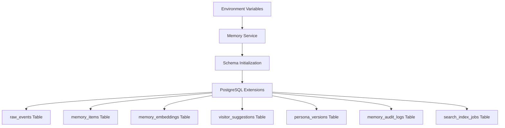
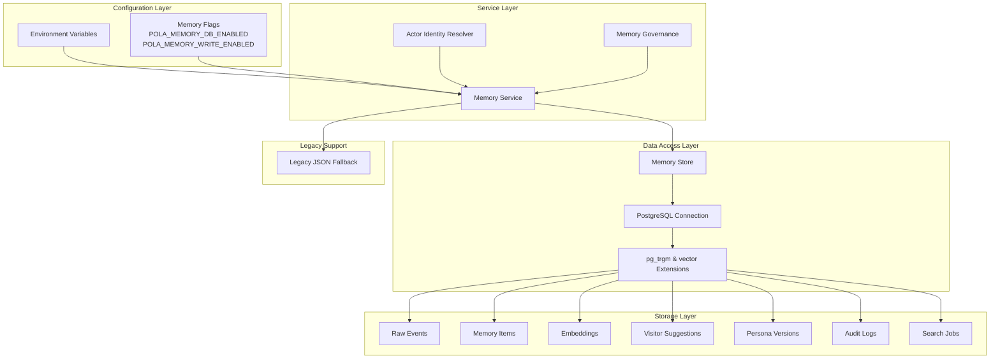
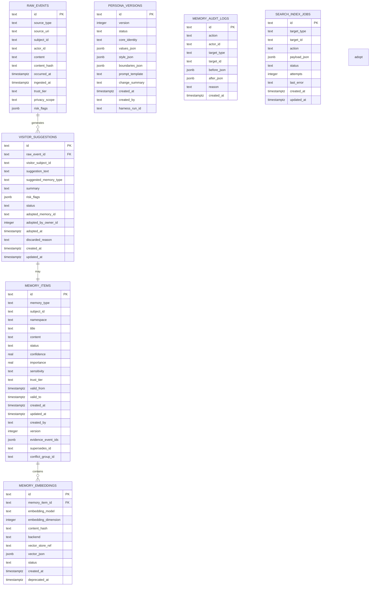
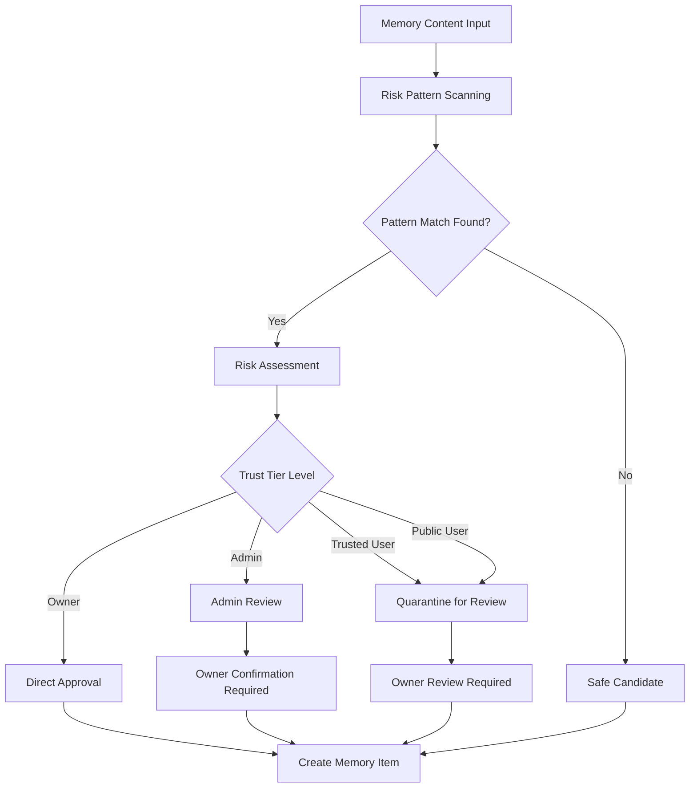
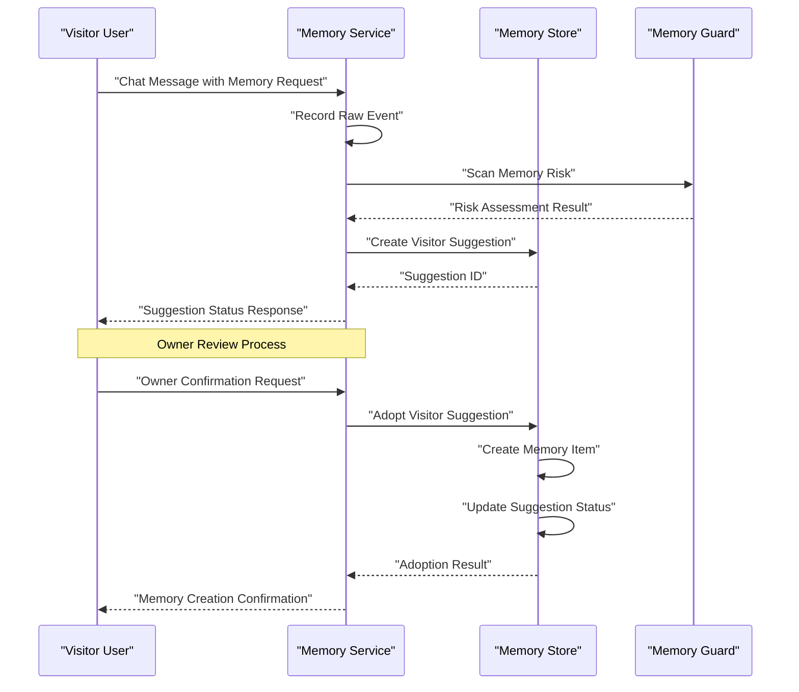
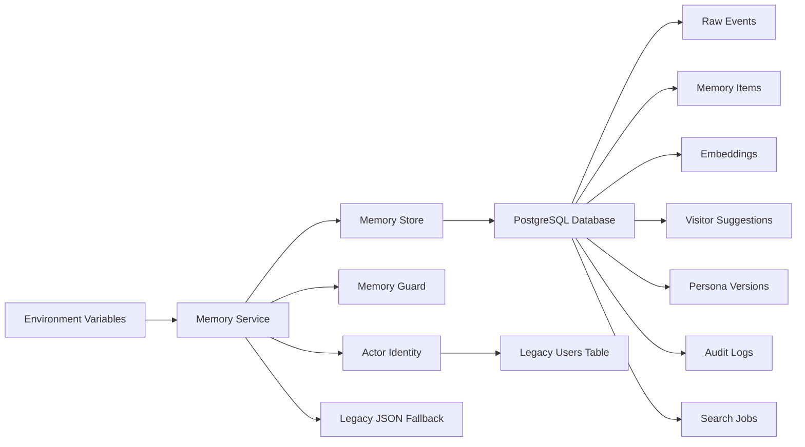

# Database Design

<cite>
**Referenced Files in This Document**
- [001_postgres_memory_ledger.sql](file://migrations/agent_memory/001_postgres_memory_ledger.sql)
- [memory_store.py](file://app/memory_store.py)
- [memory_service.py](file://app/memory_service.py)
- [memory_guard.py](file://app/memory_guard.py)
- [owner_identity.py](file://app/owner_identity.py)
- [import_agent_memory_legacy.py](file://scripts/import_agent_memory_legacy.py)
- [test_memory_store.py](file://tests/test_memory_store.py)
- [test_memory_guard.py](file://tests/test_memory_guard.py)
</cite>

## Update Summary
**Changes Made**
- Complete replacement of SQLite-based architecture with PostgreSQL memory ledger implementation
- Introduction of comprehensive memory management schema with 6 specialized tables
- Implementation of intelligent memory governance with risk assessment and trust tiers
- Addition of visitor suggestion system for community-driven memory curation
- Integration of search index job queue for asynchronous indexing operations
- Enhancement of audit logging for complete memory lifecycle tracking
- Migration from file-based content storage to database-backed memory management

## Table of Contents
1. [Introduction](#introduction)
2. [Project Structure](#project-structure)
3. [Core Components](#core-components)
4. [Architecture Overview](#architecture-overview)
5. [Detailed Component Analysis](#detailed-component-analysis)
6. [Dependency Analysis](#dependency-analysis)
7. [Performance Considerations](#performance-considerations)
8. [Troubleshooting Guide](#troubleshooting-guide)
9. [Conclusion](#conclusion)
10. [Appendices](#appendices)

## Introduction
This document describes the comprehensive PostgreSQL memory ledger design for PolaZhenJing's intelligent memory management system. The system has evolved from a simple SQLite-based architecture to a sophisticated PostgreSQL-backed memory management platform supporting advanced AI agent memory capabilities. The new design implements six specialized tables for raw event capture, memory item storage, embeddings, visitor suggestions, persona versions, and audit logging, enabling intelligent memory management with risk assessment, trust tiers, and community-driven curation.

**Updated** The system now operates as a complete PostgreSQL memory ledger with advanced features for AI agent memory management, replacing the previous SQLite-based single-table design.

## Project Structure
The database layer now implements a comprehensive PostgreSQL schema with specialized tables for different aspects of memory management. The system supports both direct PostgreSQL access and optional JSON fallback for legacy compatibility. Database initialization occurs through migration scripts and programmatic schema creation, with automatic extension loading for PostgreSQL-specific features like pg_trgm and vector support.

```mermaid
graph TB
Config["Environment Variables"] --> App["Memory Service"]
App --> DBInit["Schema Initialization"]
DBInit --> Extensions["PostgreSQL Extensions"]
Extensions --> RawEvents["raw_events Table"]
Extensions --> MemoryItems["memory_items Table"]
Extensions --> Embeddings["memory_embeddings Table"]
Extensions --> Suggestions["visitor_suggestions Table"]
Extensions --> Persona["persona_versions Table"]
Extensions --> Audit["memory_audit_logs Table"]
Extensions --> SearchJobs["search_index_jobs Table"]
```

**Diagram sources**
- [001_postgres_memory_ledger.sql:1-119](file://migrations/agent_memory/001_postgres_memory_ledger.sql#L1-L119)
- [memory_store.py:77-86](file://app/memory_store.py#L77-L86)

**Section sources**
- [001_postgres_memory_ledger.sql:1-119](file://migrations/agent_memory/001_postgres_memory_ledger.sql#L1-L119)
- [memory_store.py:77-86](file://app/memory_store.py#L77-L86)

## Core Components
The PostgreSQL memory ledger consists of six specialized tables designed for intelligent memory management with comprehensive tracking and governance capabilities.

### Raw Events Table
Purpose: Capture and store raw memory events with deduplication and risk assessment
Primary Key: id (TEXT)
Unique Constraints: (content_hash, source_type, subject_id)
Additional Fields: source_type, source_uri, subject_id, actor_id, content, occurred_at, ingested_at, trust_tier, privacy_scope, risk_flags (JSONB)
Business Constraints:
- Prevents duplicate event ingestion through composite unique constraint
- Automatically timestamps ingestion with default now()
- Stores risk assessment flags as JSONB for flexible schema evolution

### Memory Items Table
Purpose: Store processed memory items with rich metadata and lifecycle tracking
Primary Key: id (TEXT)
Indexes: status, subject_id, content (GIN trigram)
Additional Fields: memory_type, subject_id, namespace, title, content, status, confidence, importance, sensitivity, trust_tier, validity period, created_by, version, evidence_event_ids (JSONB), supersedes_id, conflict_group_id
Business Constraints:
- Status field controls memory lifecycle (candidate, active, pinned, deprecated, discarded, quarantined)
- Confidence and importance scores drive memory ranking and retrieval
- Evidence linking connects memories to their source events
- Version tracking supports memory evolution and conflict resolution

### Memory Embeddings Table
Purpose: Store vector embeddings for semantic search and similarity matching
Primary Key: id (TEXT)
Indexes: memory_item_id, status
Additional Fields: memory_item_id (FOREIGN KEY), embedding_model, embedding_dimension, content_hash, backend, vector_store_ref, vector_json (JSONB), status, deprecated_at
Business Constraints:
- Links embeddings to specific memory items
- Supports multiple embedding backends (pgvector, custom)
- Tracks embedding lifecycle and deprecation

### Visitor Suggestions Table
Purpose: Enable community-driven memory curation through visitor proposals
Primary Key: id (TEXT)
Additional Fields: raw_event_id (FOREIGN KEY), visitor_subject_id, suggestion_text, suggested_memory_type, summary, risk_flags (JSONB), status, adopted_memory_id, adopted_by_owner_id, adoption timestamps, discarded_reason
Business Constraints:
- Supports suggestion lifecycle (pending, spam, adopted, edited_adopted, discarded)
- Links suggestions to source events and potential memory items
- Tracks owner adoption decisions and editing history

### Persona Versions Table
Purpose: Manage AI agent persona evolution and configuration
Primary Key: id (TEXT)
Additional Fields: version, status, core_identity, values_json (JSONB), style_json (JSONB), boundaries_json (JSONB), prompt_template, change_summary, harness_run_id
Business Constraints:
- Version tracking for persona evolution
- Structured JSON storage for persona components
- Association with harness run identification

### Memory Audit Logs Table
Purpose: Provide complete audit trail for memory lifecycle modifications
Primary Key: id (TEXT)
Additional Fields: action, actor_id, target_type, target_id, before_json (JSONB), after_json (JSONB), reason, created_at
Business Constraints:
- Captures all memory modifications with before/after states
- Links actions to specific actors and targets
- Supports compliance and debugging requirements

### Search Index Jobs Table
Purpose: Queue and manage asynchronous search index operations
Primary Key: id (TEXT)
Additional Fields: target_type, target_id, action, payload_json (JSONB), status, attempts, last_error, timestamps
Business Constraints:
- Supports job queuing for upsert, delete, and maintenance operations
- Tracks retry attempts and error conditions
- Maintains operation ordering and consistency

**Section sources**
- [001_postgres_memory_ledger.sql:6-20](file://migrations/agent_memory/001_postgres_memory_ledger.sql#L6-L20)
- [001_postgres_memory_ledger.sql:22-43](file://migrations/agent_memory/001_postgres_memory_ledger.sql#L22-L43)
- [001_postgres_memory_ledger.sql:49-61](file://migrations/agent_memory/001_postgres_memory_ledger.sql#L49-L61)
- [001_postgres_memory_ledger.sql:63-78](file://migrations/agent_memory/001_postgres_memory_ledger.sql#L63-L78)
- [001_postgres_memory_ledger.sql:80-93](file://migrations/agent_memory/001_postgres_memory_ledger.sql#L80-L93)
- [001_postgres_memory_ledger.sql:95-105](file://migrations/agent_memory/001_postgres_memory_ledger.sql#L95-L105)
- [001_postgres_memory_ledger.sql:107-118](file://migrations/agent_memory/001_postgres_memory_ledger.sql#L107-L118)

## Architecture Overview
The new architecture implements a comprehensive PostgreSQL memory management system with intelligent governance, risk assessment, and community-driven curation. The system supports both direct PostgreSQL access and optional JSON fallback for legacy compatibility, with automatic schema initialization and extension management.

```mermaid
graph TB
subgraph "Configuration Layer"
Env["Environment Variables"]
ConfigFlags["Memory Flags<br/>POLA_MEMORY_DB_ENABLED<br/>POLA_MEMORY_WRITE_ENABLED"]
end
subgraph "Service Layer"
MemoryService["Memory Service"]
ActorIdentity["Actor Identity Resolver"]
MemoryGuard["Memory Governance"]
end
subgraph "Data Access Layer"
MemoryStore["Memory Store"]
Connection["PostgreSQL Connection"]
Extensions["pg_trgm & vector Extensions"]
end
subgraph "Storage Layer"
RawEvents["Raw Events"]
MemoryItems["Memory Items"]
Embeddings["Embeddings"]
Suggestions["Visitor Suggestions"]
Persona["Persona Versions"]
AuditLogs["Audit Logs"]
SearchJobs["Search Jobs"]
end
subgraph "Legacy Support"
LegacyMemory["Legacy JSON Fallback"]
end
Env --> MemoryService
ConfigFlags --> MemoryService
ActorIdentity --> MemoryService
MemoryGuard --> MemoryService
MemoryService --> MemoryStore
MemoryStore --> Connection
Connection --> Extensions
Extensions --> RawEvents
Extensions --> MemoryItems
Extensions --> Embeddings
Extensions --> Suggestions
Extensions --> Persona
Extensions --> AuditLogs
Extensions --> SearchJobs
MemoryService --> LegacyMemory
```

**Diagram sources**
- [memory_service.py:82-89](file://app/memory_service.py#L82-L89)
- [memory_service.py:91-93](file://app/memory_service.py#L91-L93)
- [memory_store.py:62-76](file://app/memory_store.py#L62-L76)
- [memory_store.py:77-86](file://app/memory_store.py#L77-L86)

## Detailed Component Analysis

### Entity Relationship Diagram

```mermaid
erDiagram
RAW_EVENTS {
text id PK
text source_type
text source_uri
text subject_id
text actor_id
text content
text content_hash
timestamptz occurred_at
timestamptz ingested_at
text trust_tier
text privacy_scope
jsonb risk_flags
}
MEMORY_ITEMS {
text id PK
text memory_type
text subject_id
text namespace
text title
text content
text status
real confidence
real importance
text sensitivity
text trust_tier
timestamptz valid_from
timestamptz valid_to
timestamptz created_at
timestamptz updated_at
text created_by
integer version
jsonb evidence_event_ids
text supersedes_id
text conflict_group_id
}
MEMORY_EMBEDDINGS {
text id PK
text memory_item_id FK
text embedding_model
integer embedding_dimension
text content_hash
text backend
text vector_store_ref
jsonb vector_json
text status
timestamptz created_at
timestamptz deprecated_at
}
VISITOR_SUGGESTIONS {
text id PK
text raw_event_id FK
text visitor_subject_id
text suggestion_text
text suggested_memory_type
text summary
jsonb risk_flags
text status
text adopted_memory_id
integer adopted_by_owner_id
timestamptz adopted_at
text discarded_reason
timestamptz created_at
timestamptz updated_at
}
PERSONA_VERSIONS {
text id PK
integer version
text status
text core_identity
jsonb values_json
jsonb style_json
jsonb boundaries_json
text prompt_template
text change_summary
timestamptz created_at
text created_by
text harness_run_id
}
MEMORY_AUDIT_LOGS {
text id PK
text action
text actor_id
text target_type
text target_id
jsonb before_json
jsonb after_json
text reason
timestamptz created_at
}
SEARCH_INDEX_JOBS {
text id PK
text target_type
text target_id
text action
jsonb payload_json
text status
integer attempts
text last_error
timestamptz created_at
timestamptz updated_at
}
MEMORY_ITEMS ||--o{ MEMORY_EMBEDDINGS : contains
RAW_EVENTS ||--o{ VISITOR_SUGGESTIONS : generates
VISITOR_SUGGESTIONS ||--|| MEMORY_ITEMS : may adopt
```

**Diagram sources**
- [001_postgres_memory_ledger.sql:6-20](file://migrations/agent_memory/001_postgres_memory_ledger.sql#L6-L20)
- [001_postgres_memory_ledger.sql:22-43](file://migrations/agent_memory/001_postgres_memory_ledger.sql#L22-L43)
- [001_postgres_memory_ledger.sql:49-61](file://migrations/agent_memory/001_postgres_memory_ledger.sql#L49-L61)
- [001_postgres_memory_ledger.sql:63-78](file://migrations/agent_memory/001_postgres_memory_ledger.sql#L63-L78)
- [001_postgres_memory_ledger.sql:80-93](file://migrations/agent_memory/001_postgres_memory_ledger.sql#L80-L93)
- [001_postgres_memory_ledger.sql:95-105](file://migrations/agent_memory/001_postgres_memory_ledger.sql#L95-L105)
- [001_postgres_memory_ledger.sql:107-118](file://migrations/agent_memory/001_postgres_memory_ledger.sql#L107-L118)

### Memory Governance and Risk Assessment
The system implements comprehensive memory governance through risk assessment patterns and trust tier classification, enabling intelligent memory management with safety controls.

- Risk Pattern Detection
  - Prompt injection prevention for unauthorized instruction overriding
  - Secret exfiltration detection for sensitive information leakage
  - Persona takeover protection against identity manipulation
  - Boundary override detection for rule bypass attempts
  - Recommendation poisoning prevention for biased content promotion

- Trust Tier Classification
  - Owner: Highest trust level with full administrative privileges
  - Admin: Elevated trust for system operations
  - Trusted User: Authenticated user with limited privileges
  - Public User: Anonymous visitor with basic restrictions

- Memory Type Classification
  - Values: Core agent values and principles
  - Boundary: Rules and constraints governing behavior
  - Preference: User preferences and inclinations
  - Procedural: Process knowledge and best practices
  - Episodic: Personal experiences and events
  - Semantic: General knowledge and facts

```mermaid
flowchart TD
Input["Memory Content Input"] --> RiskScan["Risk Pattern Scanning"]
RiskScan --> PatternMatch{"Pattern Match Found?"}
PatternMatch --> |Yes| RiskAssessment["Risk Assessment"]
PatternMatch --> |No| SafeCandidate["Safe Candidate"]
RiskAssessment --> TrustTier{"Trust Tier Level"}
TrustTier --> |Owner| DirectApproval["Direct Approval"]
TrustTier --> |Admin| AdminReview["Admin Review"]
TrustTier --> |Trusted User| Quarantine["Quarantine for Review"]
TrustTier --> |Public User| Quarantine
DirectApproval --> MemoryItem["Create Memory Item"]
AdminReview --> OwnerConfirmation["Owner Confirmation Required"]
Quarantine --> OwnerReview["Owner Review Required"]
SafeCandidate --> MemoryItem
OwnerConfirmation --> MemoryItem
OwnerReview --> MemoryItem
```

**Diagram sources**
- [memory_guard.py:51-77](file://app/memory_guard.py#L51-L77)
- [memory_guard.py:36-48](file://app/memory_guard.py#L36-L48)
- [owner_identity.py:45-52](file://app/owner_identity.py#L45-L52)

**Section sources**
- [memory_guard.py:27-33](file://app/memory_guard.py#L27-L33)
- [memory_guard.py:51-77](file://app/memory_guard.py#L51-L77)
- [memory_guard.py:36-48](file://app/memory_guard.py#L36-L48)
- [owner_identity.py:45-52](file://app/owner_identity.py#L45-L52)

### Visitor Suggestion System
The visitor suggestion system enables community-driven memory curation, allowing users to propose memory additions while maintaining quality control through risk assessment and owner approval.

- Suggestion Lifecycle
  - Pending: Initial proposal awaiting review
  - Spam: Low-quality or inappropriate suggestions
  - Adopted: Owner-approved suggestions converted to memories
  - Edited Adopted: Modified suggestions accepted with changes
  - Discarded: Rejected suggestions with reasons recorded

- Integration Flow
  - Raw event capture triggers suggestion creation
  - Risk assessment determines suggestion status
  - Owner review process for non-quarantined suggestions
  - Memory item creation upon adoption
  - Audit logging for all suggestion modifications

```mermaid
sequenceDiagram
participant Visitor as "Visitor User"
participant MemoryService as "Memory Service"
participant MemoryStore as "Memory Store"
participant Guard as "Memory Guard"
Visitor->>MemoryService : "Chat Message with Memory Request"
MemoryService->>MemoryService : "Record Raw Event"
MemoryService->>Guard : "Scan Memory Risk"
Guard-->>MemoryService : "Risk Assessment Result"
MemoryService->>MemoryStore : "Create Visitor Suggestion"
MemoryStore-->>MemoryService : "Suggestion ID"
MemoryService-->>Visitor : "Suggestion Status Response"
Note over Visitor,MemoryService : Owner Review Process
Visitor->>MemoryService : "Owner Confirmation Request"
MemoryService->>MemoryStore : "Adopt Visitor Suggestion"
MemoryStore->>MemoryStore : "Create Memory Item"
MemoryStore->>MemoryStore : "Update Suggestion Status"
MemoryStore-->>MemoryService : "Adoption Result"
MemoryService-->>Visitor : "Memory Creation Confirmation"
```

**Diagram sources**
- [memory_service.py:190-227](file://app/memory_service.py#L190-L227)
- [memory_service.py:321-360](file://app/memory_service.py#L321-L360)
- [memory_store.py:207-241](file://app/memory_store.py#L207-L241)

**Section sources**
- [memory_service.py:190-227](file://app/memory_service.py#L190-L227)
- [memory_service.py:321-360](file://app/memory_service.py#L321-L360)
- [memory_store.py:207-241](file://app/memory_store.py#L207-L241)

### Search and Retrieval System
The search system combines PostgreSQL full-text search with vector similarity matching for comprehensive memory retrieval capabilities.

- Text Search Capabilities
  - ILIKE pattern matching for title, content, and type fields
  - GIN trigram indexes for efficient text searching
  - Case-insensitive matching with accent folding

- Ranking and Filtering
  - Importance-based sorting for primary ranking
  - Updated timestamp for recency consideration
  - Status filtering for active/pinned memories
  - Candidate inclusion option for review processes

- Vector Similarity Integration
  - Embedding-based similarity matching
  - Configurable similarity thresholds
  - Hybrid search combining text and vector results

**Section sources**
- [memory_store.py:302-323](file://app/memory_store.py#L302-L323)
- [001_postgres_memory_ledger.sql:47](file://migrations/agent_memory/001_postgres_memory_ledger.sql#L47)

### Data Integrity and Security
The system implements comprehensive data integrity measures including input sanitization, constraint enforcement, and audit logging.

- Input Sanitization
  - Null byte removal from all string inputs
  - Recursive sanitization for nested JSON structures
  - SQL injection prevention through parameterized queries

- Constraint Enforcement
  - Composite unique constraints prevent duplicate ingestion
  - Foreign key relationships maintain referential integrity
  - JSONB validation ensures structured data consistency

- Audit Trail
  - Comprehensive modification logging
  - Before/after state capture for all changes
  - Actor identification and timestamp tracking

**Section sources**
- [memory_store.py:33-51](file://app/memory_store.py#L33-L51)
- [memory_store.py:404-422](file://app/memory_store.py#L404-L422)
- [test_memory_store.py:4-15](file://tests/test_memory_store.py#L4-L15)

## Dependency Analysis
The dependency structure has been transformed from a simple SQLite setup to a complex PostgreSQL-based memory management system with multiple interconnected services and governance layers.

```mermaid
graph LR
EnvVars["Environment Variables"] --> MemoryService["Memory Service"]
MemoryService --> MemoryStore["Memory Store"]
MemoryStore --> PostgreSQL["PostgreSQL Database"]
PostgreSQL --> RawEvents["Raw Events"]
PostgreSQL --> MemoryItems["Memory Items"]
PostgreSQL --> Embeddings["Embeddings"]
PostgreSQL --> Suggestions["Visitor Suggestions"]
PostgreSQL --> Persona["Persona Versions"]
PostgreSQL --> AuditLogs["Audit Logs"]
PostgreSQL --> SearchJobs["Search Jobs"]
MemoryService --> MemoryGuard["Memory Guard"]
MemoryService --> ActorIdentity["Actor Identity"]
ActorIdentity --> Users["Legacy Users Table"]
MemoryService --> LegacyMemory["Legacy JSON Fallback"]
```

**Diagram sources**
- [memory_service.py:82-89](file://app/memory_service.py#L82-L89)
- [memory_store.py:62-76](file://app/memory_store.py#L62-L76)
- [owner_identity.py:106-156](file://app/owner_identity.py#L106-L156)

**Section sources**
- [memory_service.py:82-89](file://app/memory_service.py#L82-L89)
- [memory_store.py:62-76](file://app/memory_store.py#L62-L76)
- [owner_identity.py:106-156](file://app/owner_identity.py#L106-L156)

## Performance Considerations
- PostgreSQL Advantages
  - Advanced indexing strategies with GIN trigrams and composite indexes
  - Connection pooling and prepared statement optimization
  - Extension-based vector and text search acceleration
  - ACID compliance for reliable memory operations

- Memory Management Optimization
  - Status-based indexing for fast active memory queries
  - Subject-based partitioning for user-specific memory isolation
  - Embedding caching for frequently accessed vector operations
  - Asynchronous search indexing through job queue system

- Governance Performance
  - Risk assessment caching for repeated content evaluation
  - Trust tier resolution through efficient identity lookup
  - Audit log batching for reduced write overhead
  - Legacy fallback optimization for graceful degradation

- Scalability Features
  - Horizontal scaling through connection pooling
  - Read replica support for search-heavy workloads
  - Memory item versioning for conflict-free updates
  - Embedding model abstraction for backend switching

## Troubleshooting Guide
- Database Connectivity
  - Verify DATABASE_URL environment variable format
  - Check PostgreSQL extension availability (pg_trgm, vector)
  - Confirm connection pool limits and timeout settings
  - Validate SSL configuration for remote databases

- Memory Operations
  - Monitor raw event ingestion rates and duplicate prevention
  - Track memory item status transitions and governance failures
  - Verify embedding generation and similarity search performance
  - Check visitor suggestion processing and adoption rates

- Governance Issues
  - Review risk assessment false positives/negatives
  - Validate trust tier resolution for different user types
  - Monitor memory type classification accuracy
  - Check owner confirmation workflow bottlenecks

- Legacy Compatibility
  - Ensure legacy JSON fallback functionality
  - Verify migration script execution success
  - Test backward compatibility with existing systems
  - Monitor data synchronization between old and new schemas

**Section sources**
- [memory_store.py:70-76](file://app/memory_store.py#L70-L76)
- [memory_service.py:95-104](file://app/memory_service.py#L95-L104)
- [import_agent_memory_legacy.py:23-71](file://scripts/import_agent_memory_legacy.py#L23-L71)

## Conclusion
The PolaZhenJing PostgreSQL memory ledger represents a comprehensive evolution from simple SQLite storage to sophisticated AI agent memory management. The six-table schema with intelligent governance, risk assessment, and community-driven curation provides a robust foundation for advanced memory capabilities. The system's emphasis on data integrity, audit trails, and performance optimization ensures reliable operation at scale while maintaining backward compatibility through legacy fallback mechanisms.

**Updated** This represents a complete architectural transformation from the previous SQLite-based design to a production-ready PostgreSQL memory management system supporting intelligent AI agent capabilities.

## Appendices

### Appendix A: PostgreSQL Schema Definition
- Raw Events Table Structure
  - Primary Key: id (TEXT)
  - Unique Constraint: (content_hash, source_type, subject_id)
  - JSONB Fields: risk_flags
  - Timestamp Defaults: ingested_at (DEFAULT now())

- Memory Items Table Structure
  - Primary Key: id (TEXT)
  - Indexes: status, subject_id, content (GIN trigram)
  - JSONB Fields: evidence_event_ids
  - Default Values: confidence (0.7), importance (0.5), sensitivity ('low')

- Embeddings Table Structure
  - Primary Key: id (TEXT)
  - Foreign Key: memory_item_id REFERENCES memory_items(id)
  - JSONB Fields: vector_json
  - Default Values: backend ('pgvector'), status ('active')

**Section sources**
- [001_postgres_memory_ledger.sql:6-20](file://migrations/agent_memory/001_postgres_memory_ledger.sql#L6-L20)
- [001_postgres_memory_ledger.sql:22-43](file://migrations/agent_memory/001_postgres_memory_ledger.sql#L22-L43)
- [001_postgres_memory_ledger.sql:49-61](file://migrations/agent_memory/001_postgres_memory_ledger.sql#L49-L61)

### Appendix B: Memory Governance Flow Summary
- Risk Assessment Process
  - Pattern matching against predefined threat categories
  - Trust tier influence on risk tolerance thresholds
  - Dynamic status assignment (candidate, quarantined)
  - Owner escalation requirements for risky content

- Memory Classification System
  - Automated type detection based on content patterns
  - Manual override capability for edge cases
  - Context-aware classification for nuanced content
  - Evolution tracking for memory type refinement

**Section sources**
- [memory_guard.py:51-77](file://app/memory_guard.py#L51-L77)
- [memory_guard.py:36-48](file://app/memory_guard.py#L36-L48)

### Appendix C: Visitor Suggestion Workflow
- Suggestion Creation Process
  - Risk assessment integration during suggestion generation
  - Status assignment based on content safety evaluation
  - Owner notification for potentially valuable suggestions
  - Community feedback incorporation for suggestion refinement

- Adoption and Curation Process
  - Owner review workflow for suggestion acceptance
  - Memory item creation from approved suggestions
  - Audit trail generation for all adoption decisions
  - Performance metrics tracking for suggestion effectiveness

**Section sources**
- [memory_service.py:190-227](file://app/memory_service.py#L190-L227)
- [memory_service.py:321-360](file://app/memory_service.py#L321-L360)
- [memory_store.py:207-241](file://app/memory_store.py#L207-L241)

### Appendix D: Legacy Migration Strategy
- Data Import Process
  - Hash-based deduplication during legacy data ingestion
  - Risk assessment application to historical content
  - Status assignment based on content sensitivity
  - Evidence linking to original source events

- Migration Validation
  - Count verification between legacy and new systems
  - Content integrity checking for migrated memories
  - Performance benchmarking for search operations
  - User experience validation for memory recall

**Section sources**
- [import_agent_memory_legacy.py:23-71](file://scripts/import_agent_memory_legacy.py#L23-L71)
- [memory_service.py:22-30](file://app/memory_service.py#L22-L30)