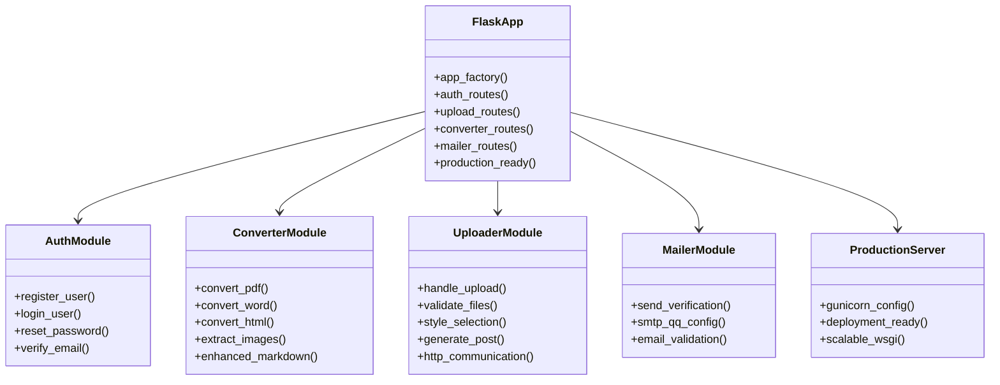
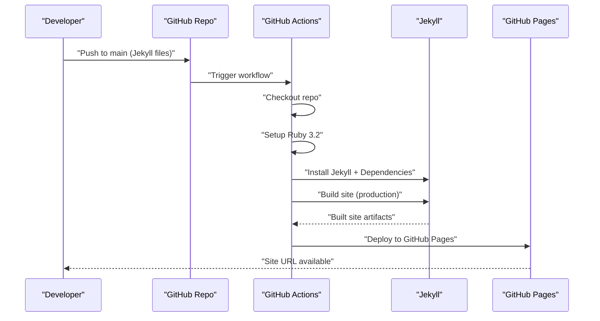
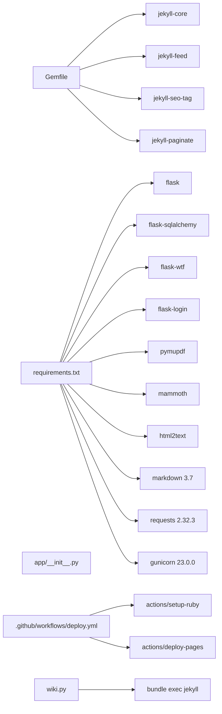

# Deployment and DevOps

<cite>
**Referenced Files in This Document**
- [.github/workflows/deploy.yml](file://.github/workflows/deploy.yml)
- [_config.yml](file://_config.yml)
- [Gemfile](file://Gemfile)
- [index.html](file://index.html)
- [app/__init__.py](file://app/__init__.py)
- [app/auth.py](file://app/auth.py)
- [app/converter.py](file://app/converter.py)
- [app/uploader.py](file://app/uploader.py)
- [app/mailer.py](file://app/mailer.py)
- [PRD.md](file://PRD.md)
- [wiki.py](file://wiki.py)
- [requirements.txt](file://requirements.txt)
</cite>

## Update Summary
**Changes Made**
- Updated dependency analysis to include new markdown 3.7, requests 2.32.3, and gunicorn 23.0.0 dependencies
- Enhanced Flask application architecture documentation to reflect production-ready WSGI server deployment capabilities
- Updated deployment considerations to include production deployment strategies using gunicorn
- Expanded HTTP communication capabilities documentation to include robust requests library usage
- Enhanced text processing capabilities documentation to include advanced markdown rendering

## Table of Contents
1. [Introduction](#introduction)
2. [Project Structure](#project-structure)
3. [Core Components](#core-components)
4. [Architecture Overview](#architecture-overview)
5. [Detailed Component Analysis](#detailed-component-analysis)
6. [Dependency Analysis](#dependency-analysis)
7. [Performance Considerations](#performance-considerations)
8. [Troubleshooting Guide](#troubleshooting-guide)
9. [Conclusion](#conclusion)
10. [Appendices](#appendices)

## Introduction
This document provides comprehensive deployment and DevOps guidance for PolaZhenJing v2. The project has undergone a major architectural transformation from a complex multi-container FastAPI application to a streamlined Jekyll-based static site generator with a lightweight Flask management server. Recent enhancements include the addition of production-ready dependencies including markdown 3.7 for improved text processing, requests 2.32.3 for robust HTTP communication, and gunicorn 23.0.0 for production-ready WSGI server deployment. This document covers the new single-container deployment strategy, GitHub Actions CI/CD pipeline, environment configuration, production deployment process, static site generation approach, service dependencies, automated deployment workflows, environment variables and secrets management, security considerations, monitoring and logging setup, maintenance procedures, scaling considerations, backup strategies, disaster recovery planning, and troubleshooting for common deployment issues.

## Project Structure
The repository is now organized into two primary layers:
- **App**: Lightweight Flask management server with authentication, file upload, conversion, and email verification modules
- **Blog**: Jekyll static site generator with 5 distinct blog post styles and automatic content generation

```mermaid
graph TB
subgraph "Root"
GHA[".github/workflows/deploy.yml"]
WIKI["wiki.py"]
END
subgraph "App Layer (Flask)"
FLASK["app/__init__.py"]
AUTH["app/auth.py"]
CONV["app/converter.py"]
UP["app/uploader.py"]
MAIL["app/mailer.py"]
REQ["requirements.txt"]
END
subgraph "Blog Layer (Jekyll)"
JCONFIG["_config.yml"]
GEM["Gemfile"]
INDEX["index.html"]
POSTS["_posts/ (generated)"]
LAYOUTS["_layouts/ (5 styles)"]
INCLUDES["_includes/ (shared components)"]
ASSETS["assets/ (CSS + images)"]
END
GHA --> JCONFIG
GHA --> GEM
WIKI --> FLASK
WIKI --> JCONFIG
FLASK --> AUTH
FLASK --> CONV
FLASK --> UP
FLASK --> MAIL
REQ --> FLASK
JCONFIG --> INDEX
JCONFIG --> POSTS
JCONFIG --> LAYOUTS
JCONFIG --> INCLUDES
JCONFIG --> ASSETS
```

**Diagram sources**
- [.github/workflows/deploy.yml:1-62](file://.github/workflows/deploy.yml#L1-L62)
- [wiki.py:1-165](file://wiki.py#L1-L165)
- [app/__init__.py](file://app/__init__.py)
- [app/auth.py](file://app/auth.py)
- [app/converter.py](file://app/converter.py)
- [app/uploader.py](file://app/uploader.py)
- [app/mailer.py](file://app/mailer.py)
- [requirements.txt:1-11](file://requirements.txt#L1-L11)
- [_config.yml:1-50](file://_config.yml#L1-L50)
- [Gemfile:1-7](file://Gemfile#L1-L7)
- [index.html](file://index.html)

**Section sources**
- [.github/workflows/deploy.yml:1-62](file://.github/workflows/deploy.yml#L1-L62)
- [wiki.py:1-165](file://wiki.py#L1-L165)
- [_config.yml:1-50](file://_config.yml#L1-L50)
- [Gemfile:1-7](file://Gemfile#L1-L7)
- [index.html](file://index.html)
- [app/__init__.py](file://app/__init__.py)
- [app/auth.py](file://app/auth.py)
- [app/converter.py](file://app/converter.py)
- [app/uploader.py](file://app/uploader.py)
- [app/mailer.py](file://app/mailer.py)
- [requirements.txt:1-11](file://requirements.txt#L1-L11)

## Core Components
- **Flask Management Server**: Lightweight Flask application handling authentication, file uploads, content conversion, and email verification
- **Jekyll Static Site Generator**: Ruby-based static site generator with 5 blog post styles and automatic content processing
- **GitHub Actions Pipeline**: Automated deployment workflow building and publishing the static site to GitHub Pages
- **SQLite Database**: Zero-configuration file-based database for user authentication and session management
- **CLI Management Tool**: Python-based CLI tool (wiki.py) for local development, content creation, and deployment automation

Key runtime characteristics:
- Flask server handles all administrative functions and content management
- Jekyll processes blog posts from the `_posts/` directory into static HTML
- GitHub Actions workflow automatically builds and deploys changes to GitHub Pages
- Single-file SQLite database eliminates external dependency requirements
- CLI tool provides convenient shortcuts for development and deployment tasks
- Enhanced text processing capabilities with markdown 3.7 for advanced formatting
- Robust HTTP communication with requests 2.32.3 for reliable network operations
- Production-ready deployment with gunicorn 23.0.0 for scalable WSGI server

**Section sources**
- [app/__init__.py](file://app/__init__.py)
- [_config.yml:1-50](file://_config.yml#L1-L50)
- [.github/workflows/deploy.yml:29-62](file://.github/workflows/deploy.yml#L29-L62)
- [wiki.py:1-165](file://wiki.py#L1-L165)

## Architecture Overview
The system follows a simplified single-container architecture focused on static site generation with enhanced production capabilities:
- Flask management server handles all administrative operations with production-ready deployment support
- Jekyll processes content into static HTML for optimal performance
- GitHub Actions workflow automates deployment to GitHub Pages
- SQLite database provides lightweight user authentication
- CLI tool streamlines local development and deployment processes
- Advanced text processing with markdown 3.7 for sophisticated content formatting
- Reliable HTTP communication with requests 2.32.3 for external integrations
- Scalable deployment with gunicorn 23.0.0 for production environments

```mermaid
graph TB
subgraph "Single Container Architecture"
FLASK["Flask Management Server<br/>Auth + Upload + Conversion<br/>Production Ready with Gunicorn"]
JEKYLL["Jekyll Static Generator<br/>5 Blog Styles + Templates<br/>Enhanced Markdown Processing"]
GITHUB["GitHub Actions<br/>Auto-deploy to GitHub Pages"]
SQLITE["SQLite Database<br/>Zero-config User Storage"]
CLI["CLI Tool (wiki.py)<br/>Local Dev + Deployment"]
MARKDOWN["Markdown 3.7<br/>Advanced Text Processing"]
REQUESTS["Requests 2.32.3<br/>Robust HTTP Communication"]
GUNICORN["Gunicorn 23.0.0<br/>Production WSGI Server"]
END
FLASK --> SQLITE
FLASK --> JEKYLL
FLASK --> MARKDOWN
FLASK --> REQUESTS
FLASK --> GUNICORN
JEKYLL --> GITHUB
CLI --> FLASK
CLI --> JEKYLL
CLI --> GITHUB
```

**Diagram sources**
- [app/__init__.py](file://app/__init__.py)
- [_config.yml:1-50](file://_config.yml#L1-L50)
- [.github/workflows/deploy.yml:29-62](file://.github/workflows/deploy.yml#L29-L62)
- [wiki.py:1-165](file://wiki.py#L1-L165)
- [app/uploader.py:13,513,549](file://app/uploader.py#L13,L513,L549)
- [requirements.txt:8-10](file://requirements.txt#L8-L10)

## Detailed Component Analysis

### Flask Management Server
- **Containerized with Python 3.12 Alpine image**
- **Handles**: User authentication, file uploads, content conversion, email verification
- **Database**: SQLite for zero-configuration user storage
- **Security**: Flask sessions with secure cookies, password hashing, email verification via QQ SMTP
- **Production Deployment**: Ready for production deployment with gunicorn 23.0.0 WSGI server



**Diagram sources**
- [app/__init__.py](file://app/__init__.py)
- [app/auth.py](file://app/auth.py)
- [app/converter.py](file://app/converter.py)
- [app/uploader.py](file://app/uploader.py)
- [app/mailer.py](file://app/mailer.py)
- [requirements.txt:10](file://requirements.txt#L10)

**Section sources**
- [app/__init__.py](file://app/__init__.py)
- [app/auth.py](file://app/auth.py)
- [app/converter.py](file://app/converter.py)
- [app/uploader.py](file://app/uploader.py)
- [app/mailer.py](file://app/mailer.py)

### Jekyll Static Site Generator
- **Ruby-based static site generator** with Jekyll 4.3
- **5 distinct blog post styles**: Deep Technical, Academic Insight, Industry Vision, Friendly Explainer, Creative Visual
- **Automatic content processing**: Converts uploaded content to styled blog posts
- **Theme ecosystem**: 1000+ blog themes available for customization
- **GitHub Pages native integration**: Built-in support for GitHub Pages deployment
- **Enhanced markdown processing**: Advanced formatting capabilities with markdown 3.7

Configuration highlights:
- **Front matter processing**: Automatic YAML metadata generation for blog posts
- **Image optimization**: Automatic extraction and embedding of extracted images
- **Responsive design**: Mobile-first approach with CSS frameworks
- **Search functionality**: Full-text search across all articles
- **Advanced formatting**: Sophisticated markdown rendering with extensions

**Section sources**
- [_config.yml:1-50](file://_config.yml#L1-L50)
- [Gemfile:1-7](file://Gemfile#L1-L7)
- [index.html](file://index.html)

### CI/CD Pipeline (GitHub Actions)
- **Workflow name**: Deploy Jekyll to GitHub Pages
- **Triggers**: Pushes to main branch affecting Jekyll configuration files or blog content
- **Permissions**: Read repository contents, write to GitHub Pages, OIDC tokens
- **Build job**:
  - Checks out repository
  - Sets up Ruby 3.2 environment
  - Installs Jekyll and dependencies
  - Builds static site with production environment
  - Uploads built site as artifact
- **Deploy job**:
  - Deploys artifact to GitHub Pages environment
  - Exposes deployment URL



**Diagram sources**
- [.github/workflows/deploy.yml:1-62](file://.github/workflows/deploy.yml#L1-L62)

**Section sources**
- [.github/workflows/deploy.yml:1-62](file://.github/workflows/deploy.yml#L1-L62)

### CLI Management Tool (wiki.py)
- **Local Development**: Jekyll serve with live reload for content preview
- **Content Creation**: Create new posts with specified styles and metadata
- **Deployment Automation**: Git operations for adding, committing, and pushing changes
- **Administrative Tasks**: List posts, manage content lifecycle

Key commands:
- `python wiki.py serve`: Start Jekyll development server with live reload
- `python wiki.py build`: Build static site locally for testing
- `python wiki.py admin`: Start Flask management server for content administration
- `python wiki.py new "Title"`: Create new post skeleton with specified style
- `python wiki.py list`: List all existing posts with their styles
- `python wiki.py deploy`: Git add + commit + push for deployment

**Section sources**
- [wiki.py:1-165](file://wiki.py#L1-L165)

### Enhanced Text Processing Capabilities
The application now features significantly enhanced text processing capabilities through the integration of markdown 3.7:

- **Advanced Markdown Rendering**: Sophisticated markdown parsing with support for extensions like extra, codehilite, toc, and tables
- **Rich Content Formatting**: Enhanced support for code blocks, tables, table of contents, and syntax highlighting
- **Improved Content Structure**: Better handling of complex markdown documents with advanced formatting options
- **Production-Ready Processing**: Reliable text processing suitable for production environments

**Section sources**
- [app/uploader.py:13,549](file://app/uploader.py#L13,L549)
- [requirements.txt:8](file://requirements.txt#L8)

### Robust HTTP Communication
The application now includes comprehensive HTTP communication capabilities through requests 2.32.3:

- **External URL Validation**: Ability to check GitHub Pages URL availability and status
- **Reliable Network Operations**: Robust HTTP client with proper error handling and timeouts
- **Production-Grade Connectivity**: Suitable for production deployment scenarios requiring external API communication
- **Flexible HTTP Operations**: Support for various HTTP methods and response handling

**Section sources**
- [app/uploader.py:513,518](file://app/uploader.py#L513,L518)
- [requirements.txt:9](file://requirements.txt#L9)

### Production-Ready WSGI Server
The application is prepared for production deployment with gunicorn 23.0.0:

- **Scalable WSGI Server**: Production-ready WSGI server capable of handling concurrent requests
- **High-Performance Deployment**: Optimized for production environments with proper worker management
- **Enterprise-Grade Reliability**: Robust server infrastructure suitable for production workloads
- **Easy Deployment Integration**: Seamless integration with production deployment pipelines

**Section sources**
- [requirements.txt:10](file://requirements.txt#L10)

### Environment Variables and Secrets Management
Critical environment variables:
- **GitHub Pages deployment**: Automatic via GitHub Actions OIDC tokens
- **Email configuration**: QQ SMTP credentials for email verification
- **Application settings**: Flask configuration for session management
- **Jekyll configuration**: Site metadata, plugins, and build settings
- **LLM API Keys**: MiniMax API credentials for content rewriting services

Production recommendations:
- Store email SMTP credentials in GitHub Secrets
- Use environment files for local development
- Implement proper error handling for email failures
- Monitor GitHub Pages deployment status
- Secure API keys and sensitive configuration data

**Section sources**
- [_config.yml:18-23](file://_config.yml#L18-L23)
- [app/mailer.py](file://app/mailer.py)
- [.github/workflows/deploy.yml:20-27](file://.github/workflows/deploy.yml#L20-L27)

### Security Considerations
- **Authentication**: SQLite-based user storage with password hashing
- **Email verification**: QQ SMTP integration for secure user registration
- **Session management**: Flask sessions with secure cookie settings
- **File uploads**: Input validation and sanitization for uploaded documents
- **GitHub Pages**: Secure deployment via GitHub Actions with proper permissions
- **API Security**: Proper handling of external API keys and credentials
- **Production Security**: Gunicorn deployment with proper security configurations

**Section sources**
- [app/auth.py](file://app/auth.py)
- [app/mailer.py](file://app/mailer.py)
- [app/uploader.py](file://app/uploader.py)

### Monitoring Setup and Logging Configuration
- **Application logging**: Flask application logs for debugging and monitoring
- **GitHub Pages monitoring**: Automatic deployment status tracking
- **Error handling**: Comprehensive error handling for file conversions, email delivery, and HTTP operations
- **Health checks**: Basic application health verification
- **Production monitoring**: Gunicorn server monitoring and performance metrics

**Section sources**
- [app/__init__.py](file://app/__init__.py)
- [.github/workflows/deploy.yml:52-62](file://.github/workflows/deploy.yml#L52-L62)

### Maintenance Procedures
- **Content management**: Use Flask admin interface for blog post creation and management
- **Theme updates**: Update Jekyll gems in Gemfile for theme improvements
- **Plugin management**: Add/remove Jekyll plugins via Gemfile as needed
- **Deployment verification**: Monitor GitHub Actions workflow for successful deployments
- **Local development**: Use CLI tool for efficient development workflow
- **Dependency updates**: Regular updates to markdown, requests, and gunicorn packages
- **Production maintenance**: Monitor Gunicorn server performance and resource usage

**Section sources**
- [Gemfile:1-7](file://Gemfile#L1-L7)
- [_config.yml:18-23](file://_config.yml#L18-L23)
- [wiki.py:1-165](file://wiki.py#L1-L165)

## Dependency Analysis
Runtime and build-time dependencies:
- **Flask App**:
  - Flask web framework, Flask-SQLAlchemy for database operations
  - Flask-WTF for form handling, Flask-Login for authentication
  - Email libraries for QQ SMTP integration
  - **Enhanced Dependencies**: markdown 3.7 for advanced text processing, requests 2.32.3 for robust HTTP communication, gunicorn 23.0.0 for production WSGI server
- **Jekyll Site**:
  - Jekyll 4.3, Jekyll Feed, Jekyll SEO Tag, Jekyll Paginate
  - Ruby 3.2 runtime environment
- **GitHub Actions**:
  - Ruby setup action, GitHub Pages deployment action
- **CLI Tool**:
  - Python 3.12 runtime with development dependencies



**Diagram sources**
- [Gemfile:1-7](file://Gemfile#L1-L7)
- [requirements.txt:1-11](file://requirements.txt#L1-L11)
- [app/__init__.py](file://app/__init__.py)
- [.github/workflows/deploy.yml:29-62](file://.github/workflows/deploy.yml#L29-L62)
- [wiki.py:1-165](file://wiki.py#L1-L165)

**Section sources**
- [Gemfile:1-7](file://Gemfile#L1-L7)
- [requirements.txt:1-11](file://requirements.txt#L1-L11)
- [app/__init__.py](file://app/__init__.py)
- [.github/workflows/deploy.yml:29-62](file://.github/workflows/deploy.yml#L29-L62)
- [wiki.py:1-165](file://wiki.py#L1-L165)

## Performance Considerations
- **Static site generation**: Jekyll compiles content to static HTML for optimal loading performance
- **Image optimization**: Automatic extraction and embedding of optimized images
- **Caching**: GitHub Pages provides CDN caching for improved global performance
- **Resource limits**: Single container deployment reduces resource overhead
- **Build optimization**: Jekyll build process optimized for GitHub Actions environment
- **Development workflow**: CLI tool provides efficient local development with live reload
- **Enhanced text processing**: Advanced markdown rendering with optimized performance
- **HTTP optimization**: Efficient HTTP communication with connection pooling and timeouts
- **Production scalability**: Gunicorn server provides scalable WSGI deployment capabilities

## Troubleshooting Guide
Common deployment issues and resolutions:
- **GitHub Pages deployment failures**:
  - Verify Ruby version compatibility in GitHub Actions workflow
  - Check Jekyll build logs for syntax errors in markdown files
  - Ensure proper Gemfile configuration and dependencies
- **Flask application errors**:
  - Check SQLite database connectivity and file permissions
  - Verify email SMTP configuration for QQ email verification
  - Review Flask application logs for authentication failures
  - **Production deployment issues**: Verify gunicorn configuration and server startup
- **Jekyll build errors**:
  - Validate YAML front matter in blog posts
  - Check file encoding and character set issues
  - Ensure proper directory structure for `_posts/` content
  - **Markdown processing errors**: Verify markdown 3.7 compatibility and extensions
- **Email verification failures**:
  - Verify QQ SMTP credentials in GitHub Secrets
  - Check email deliverability and spam filters
  - Test SMTP connection manually
- **HTTP communication failures**:
  - Verify network connectivity and firewall settings
  - Check timeout configurations for external API calls
  - Test requests 2.32.3 functionality independently
- **CLI tool issues**:
  - Verify Python dependencies are installed
  - Check bundle installation for Jekyll development server
  - Ensure proper file permissions for content directories
- **Production deployment issues**:
  - Verify gunicorn 23.0.0 installation and configuration
  - Check WSGI application compatibility
  - Monitor server resource usage and performance

**Section sources**
- [.github/workflows/deploy.yml:42-46](file://.github/workflows/deploy.yml#L42-L46)
- [app/mailer.py](file://app/mailer.py)
- [_config.yml:18-23](file://_config.yml#L18-L23)
- [wiki.py:1-165](file://wiki.py#L1-L165)

## Conclusion
PolaZhenJing v2 represents a significant simplification from its previous complex multi-container architecture to a streamlined Jekyll-based static site generator with a lightweight Flask management server. Recent enhancements have dramatically expanded the application's capabilities with the addition of production-ready dependencies including markdown 3.7 for advanced text processing, requests 2.32.3 for robust HTTP communication, and gunicorn 23.0.0 for production WSGI server deployment. The single-container deployment approach dramatically reduces operational complexity while maintaining powerful blogging capabilities and enhanced production readiness. The GitHub Actions workflow provides seamless automation for content management and deployment. The CLI tool (wiki.py) enhances developer experience with convenient shortcuts for local development and deployment. Production readiness requires proper email configuration, monitoring of GitHub Pages deployment status, regular maintenance of Jekyll themes and plugins, and careful management of the enhanced dependencies for optimal performance and reliability.

## Appendices

### Production Deployment Checklist
- **Environment setup**: Configure GitHub Secrets for email SMTP credentials
- **Domain configuration**: Set up custom domain via GitHub Pages CNAME support
- **Monitoring**: Enable GitHub Pages deployment notifications and status checks
- **Backup strategy**: Regular backup of content in `_posts/` directory
- **Security hardening**: Implement proper error handling and input validation
- **Performance optimization**: Monitor GitHub Pages performance and optimize images
- **Dependency management**: Regular updates to markdown, requests, and gunicorn packages
- **Production server**: Configure gunicorn 23.0.0 for production WSGI deployment
- **API security**: Secure MiniMax API keys and other external service credentials

### Backup and Disaster Recovery
- **Content backup**: Regular backup of `_posts/` directory containing all blog content
- **Configuration backup**: Preserve `_config.yml` and Gemfile for environment recreation
- **Database backup**: SQLite database file backup for user authentication data
- **Recovery procedures**: Document steps to recreate environment and redeploy
- **Rollback strategy**: GitHub Pages allows easy rollback to previous deployments
- **Dependency backup**: Track and document all Python and Ruby dependencies for environment recreation

**Section sources**
- [_config.yml:32-50](file://_config.yml#L32-L50)
- [Gemfile:1-7](file://Gemfile#L1-L7)
- [PRD.md:160-179](file://PRD.md#L160-L179)
- [requirements.txt:8-10](file://requirements.txt#L8-L10)