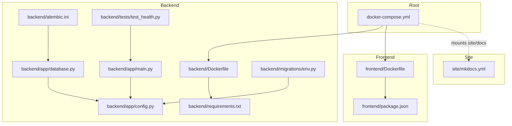
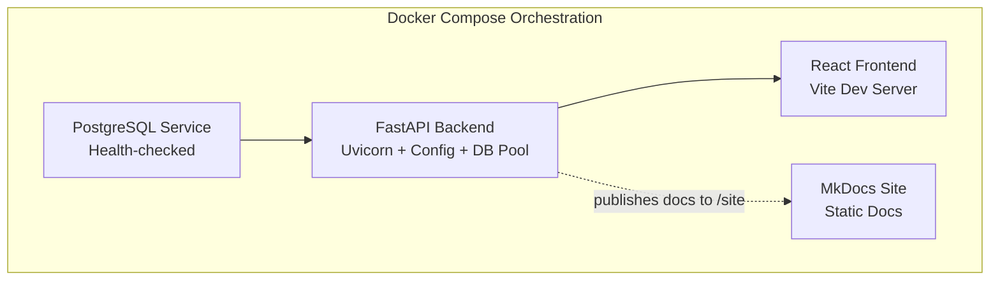
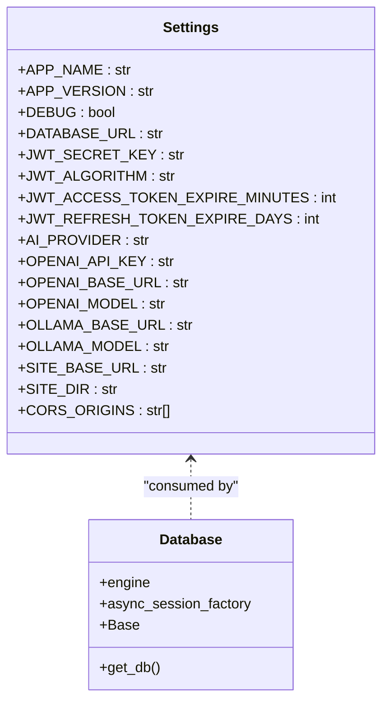
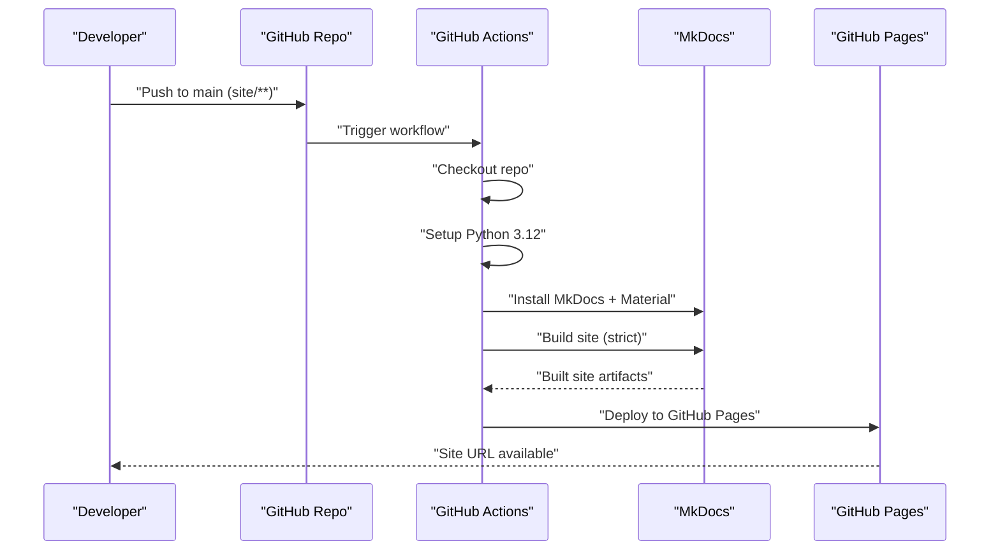
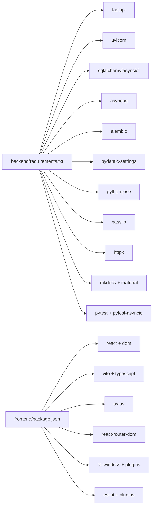

# Deployment and DevOps

<cite>
**Referenced Files in This Document**
- [docker-compose.yml](file://docker-compose.yml)
- [.github/workflows/deploy.yml](file://.github/workflows/deploy.yml)
- [backend/Dockerfile](file://backend/Dockerfile)
- [frontend/Dockerfile](file://frontend/Dockerfile)
- [backend/app/config.py](file://backend/app/config.py)
- [backend/app/main.py](file://backend/app/main.py)
- [backend/app/database.py](file://backend/app/database.py)
- [backend/requirements.txt](file://backend/requirements.txt)
- [backend/alembic.ini](file://backend/alembic.ini)
- [backend/migrations/env.py](file://backend/migrations/env.py)
- [site/mkdocs.yml](file://site/mkdocs.yml)
- [backend/tests/test_health.py](file://backend/tests/test_health.py)
- [frontend/package.json](file://frontend/package.json)
</cite>

## Table of Contents
1. [Introduction](#introduction)
2. [Project Structure](#project-structure)
3. [Core Components](#core-components)
4. [Architecture Overview](#architecture-overview)
5. [Detailed Component Analysis](#detailed-component-analysis)
6. [Dependency Analysis](#dependency-analysis)
7. [Performance Considerations](#performance-considerations)
8. [Troubleshooting Guide](#troubleshooting-guide)
9. [Conclusion](#conclusion)
10. [Appendices](#appendices)

## Introduction
This document provides comprehensive deployment and DevOps guidance for PolaZhenJing. It covers Docker Compose orchestration, multi-service deployment strategy, environment configuration, production deployment process, containerization approach, service dependencies, CI/CD pipeline configuration, automated testing integration, deployment workflows, environment variables and secrets management, security considerations, monitoring and logging setup, maintenance procedures, scaling considerations, backup strategies, disaster recovery planning, and troubleshooting for common deployment issues.

## Project Structure
The repository is organized into three primary layers:
- Backend: FastAPI application with asynchronous database connectivity, AI provider routing, authentication, tagging, publishing, and sharing modules.
- Frontend: React-based Vite development server for local iteration.
- Site: MkDocs static site configuration for documentation publishing.

**Diagram sources**
- [docker-compose.yml:1-67](file://docker-compose.yml#L1-L67)
- [backend/Dockerfile:1-29](file://backend/Dockerfile#L1-L29)
- [frontend/Dockerfile:1-20](file://frontend/Dockerfile#L1-L20)
- [backend/app/config.py:1-61](file://backend/app/config.py#L1-L61)
- [backend/app/main.py:1-88](file://backend/app/main.py#L1-L88)
- [backend/app/database.py:1-62](file://backend/app/database.py#L1-L62)
- [backend/requirements.txt:1-34](file://backend/requirements.txt#L1-L34)
- [backend/alembic.ini:1-40](file://backend/alembic.ini#L1-L40)
- [backend/migrations/env.py:1-55](file://backend/migrations/env.py#L1-L55)
- [site/mkdocs.yml:1-78](file://site/mkdocs.yml#L1-L78)
- [backend/tests/test_health.py:1-49](file://backend/tests/test_health.py#L1-L49)
- [frontend/package.json:1-38](file://frontend/package.json#L1-L38)

**Section sources**
- [docker-compose.yml:1-67](file://docker-compose.yml#L1-L67)
- [backend/Dockerfile:1-29](file://backend/Dockerfile#L1-L29)
- [frontend/Dockerfile:1-20](file://frontend/Dockerfile#L1-L20)
- [backend/app/config.py:1-61](file://backend/app/config.py#L1-L61)
- [backend/app/main.py:1-88](file://backend/app/main.py#L1-L88)
- [backend/app/database.py:1-62](file://backend/app/database.py#L1-L62)
- [backend/requirements.txt:1-34](file://backend/requirements.txt#L1-L34)
- [backend/alembic.ini:1-40](file://backend/alembic.ini#L1-L40)
- [backend/migrations/env.py:1-55](file://backend/migrations/env.py#L1-L55)
- [site/mkdocs.yml:1-78](file://site/mkdocs.yml#L1-L78)
- [backend/tests/test_health.py:1-49](file://backend/tests/test_health.py#L1-L49)
- [frontend/package.json:1-38](file://frontend/package.json#L1-L38)

## Core Components
- PostgreSQL database service with health checks and persistent volume.
- FastAPI backend service with configurable AI provider selection, JWT secret, OpenAI/Ollama integration, and MkDocs site publishing.
- React frontend service running a Vite development server for local development.
- Shared MkDocs site configuration for documentation publishing.

Key runtime characteristics:
- Backend exposes port 8000 and mounts backend and site directories for live updates.
- Frontend exposes port 5173 and mounts node_modules to avoid host-side installs.
- Database persists data under a named volume and exposes port 5432.

**Section sources**
- [docker-compose.yml:9-67](file://docker-compose.yml#L9-L67)
- [backend/app/config.py:34-57](file://backend/app/config.py#L34-L57)
- [backend/app/main.py:74-88](file://backend/app/main.py#L74-L88)

## Architecture Overview
The system follows a multi-container architecture orchestrated by Docker Compose:
- Backend depends on a healthy database before starting.
- Frontend depends on the backend being reachable.
- Environment variables configure database credentials, AI provider endpoints, JWT secrets, and site base URLs.

**Diagram sources**
- [docker-compose.yml:9-67](file://docker-compose.yml#L9-L67)
- [backend/app/main.py:74-88](file://backend/app/main.py#L74-L88)
- [site/mkdocs.yml:1-78](file://site/mkdocs.yml#L1-L78)

## Detailed Component Analysis

### Database Service
- Image: postgres:16-alpine
- Ports: 5432:5432
- Environment: user, password, database name
- Health check: uses pg_isready against configured user/db
- Persistent volume: pgdata

Operational notes:
- Use strong secrets in production.
- Persist data via named volume.
- Ensure network isolation and firewall rules for port 5432.

**Section sources**
- [docker-compose.yml:10-27](file://docker-compose.yml#L10-L27)

### Backend Service
- Containerized with Python 3.12 slim image.
- Installs system dependencies (gcc, libpq-dev) and Python packages from requirements.txt.
- Starts Uvicorn server on port 8000 with hot reload enabled.
- Environment-driven configuration via pydantic-settings:
  - DATABASE_URL
  - JWT_SECRET_KEY
  - AI_PROVIDER
  - OPENAI_API_KEY and OPENAI_BASE_URL
  - OLLAMA_BASE_URL
  - SITE_BASE_URL
- Mounts backend and site directories for live updates.

Configuration highlights:
- Settings class centralizes configuration with defaults and .env support.
- Database engine uses asyncpg with connection pooling and pre-ping.
- Health endpoint returns application metadata.

**Diagram sources**
- [backend/app/config.py:15-61](file://backend/app/config.py#L15-L61)
- [backend/app/database.py:24-62](file://backend/app/database.py#L24-L62)

**Section sources**
- [backend/Dockerfile:1-29](file://backend/Dockerfile#L1-L29)
- [backend/app/config.py:15-61](file://backend/app/config.py#L15-L61)
- [backend/app/database.py:24-62](file://backend/app/database.py#L24-L62)
- [backend/app/main.py:74-88](file://backend/app/main.py#L74-L88)

### Frontend Service
- Containerized with Node 20 Alpine image.
- Installs dependencies from package.json and runs Vite dev server.
- Exposes port 5173 and mounts node_modules to avoid host installs.

Development workflow:
- Edit frontend files locally; changes reflect inside the container.
- Access the UI at http://localhost:5173.

**Section sources**
- [frontend/Dockerfile:1-20](file://frontend/Dockerfile#L1-L20)
- [frontend/package.json:1-38](file://frontend/package.json#L1-L38)

### CI/CD Pipeline (GitHub Actions)
- Workflow name: Deploy MkDocs to GitHub Pages
- Triggers: pushes to main branch affecting site/**, manual dispatch
- Permissions: read repository contents, write to GitHub Pages, OIDC tokens
- Build job:
  - Checks out repository
  - Sets up Python 3.12
  - Installs MkDocs and Material theme
  - Builds site in strict mode
  - Uploads built site as artifact
- Deploy job:
  - Deploys artifact to GitHub Pages environment with URL exposed

**Diagram sources**
- [.github/workflows/deploy.yml:1-63](file://.github/workflows/deploy.yml#L1-L63)

**Section sources**
- [.github/workflows/deploy.yml:1-63](file://.github/workflows/deploy.yml#L1-L63)
- [site/mkdocs.yml:1-78](file://site/mkdocs.yml#L1-L78)

### Automated Testing Integration
- Backend tests use pytest with pytest-asyncio and httpx ASGI transport.
- Test coverage includes:
  - Health check endpoint verification
  - Basic authentication flow validation

Recommended improvements:
- Add database-backed tests with a test-specific database URL.
- Integrate coverage reporting and linting in CI.
- Expand test suite to cover AI provider integrations and publishing flows.

**Section sources**
- [backend/tests/test_health.py:1-49](file://backend/tests/test_health.py#L1-L49)
- [backend/requirements.txt:27-30](file://backend/requirements.txt#L27-L30)

### Environment Variables and Secrets Management
Critical environment variables:
- DATABASE_URL: Postgres connection string
- JWT_SECRET_KEY: Strong secret for signing tokens
- AI_PROVIDER: "openai" or "ollama"
- OPENAI_API_KEY and OPENAI_BASE_URL: OpenAI configuration
- OLLAMA_BASE_URL: Local Ollama endpoint
- SITE_BASE_URL: Base URL for published site

Production recommendations:
- Store secrets externally (e.g., HashiCorp Vault, AWS Secrets Manager, Docker secrets).
- Use environment files or orchestrator-native secret injection.
- Rotate secrets regularly and enforce least privilege.

**Section sources**
- [docker-compose.yml:34-41](file://docker-compose.yml#L34-L41)
- [backend/app/config.py:34-57](file://backend/app/config.py#L34-L57)

### Security Considerations
- Enforce HTTPS in production and secure cookies.
- Restrict CORS origins to trusted domains.
- Use strong JWT secrets and rotate periodically.
- Limit database user privileges and network exposure.
- Scan images and dependencies regularly.

**Section sources**
- [backend/app/config.py:55-57](file://backend/app/config.py#L55-L57)
- [backend/app/config.py:37-42](file://backend/app/config.py#L37-L42)

### Monitoring Setup and Logging Configuration
- Backend logs at INFO level by default; DEBUG increases verbosity.
- Health endpoint supports external health checks.
- Consider integrating structured logging and metrics collection (e.g., Prometheus/OpenTelemetry).

**Section sources**
- [backend/app/main.py:20-25](file://backend/app/main.py#L20-L25)
- [backend/app/main.py:74-88](file://backend/app/main.py#L74-L88)

### Maintenance Procedures
- Apply database migrations using Alembic with the configured database URL.
- Back up the PostgreSQL data volume regularly.
- Review and update dependencies periodically.

**Section sources**
- [backend/alembic.ini:4-6](file://backend/alembic.ini#L4-L6)
- [backend/migrations/env.py:43-54](file://backend/migrations/env.py#L43-L54)

## Dependency Analysis
Runtime and build-time dependencies:
- Backend:
  - FastAPI, Uvicorn, SQLAlchemy asyncio, asyncpg, Alembic
  - Pydantic and pydantic-settings for configuration
  - python-jose for JWT, passlib for password hashing
  - httpx for HTTP client, mkdocs-material for publishing
  - pytest and pytest-asyncio for testing
- Frontend:
  - React, Vite, TypeScript, TailwindCSS, Axios, react-router-dom
  - ESLint and related plugins for linting

**Diagram sources**
- [backend/requirements.txt:1-34](file://backend/requirements.txt#L1-L34)
- [frontend/package.json:1-38](file://frontend/package.json#L1-L38)

**Section sources**
- [backend/requirements.txt:1-34](file://backend/requirements.txt#L1-L34)
- [frontend/package.json:1-38](file://frontend/package.json#L1-L38)

## Performance Considerations
- Database connection pooling: tune pool_size and max_overflow for workload.
- AI provider latency: monitor OpenAI/Ollama response times and implement timeouts.
- Static site generation: cache MkDocs build artifacts when possible.
- Container resource limits: set CPU/memory constraints in production orchestration.

[No sources needed since this section provides general guidance]

## Troubleshooting Guide
Common deployment issues and resolutions:
- Backend fails to start due to database unavailability:
  - Verify database health check passes and credentials are correct.
  - Confirm network connectivity between backend and database containers.
- Database volume issues:
  - Recreate the pgdata volume if corruption occurs; back up before recreation.
- Frontend hot reload not working:
  - Ensure proper volume mounts and port 5173 is free.
- AI provider errors:
  - Validate API keys and base URLs; confirm network access to provider endpoints.
- MkDocs build failures:
  - Run build locally with strict mode to catch issues early.
- Health check failures:
  - Check backend logs and verify the /health endpoint responds with expected JSON.

**Section sources**
- [docker-compose.yml:22-26](file://docker-compose.yml#L22-L26)
- [backend/app/main.py:74-88](file://backend/app/main.py#L74-L88)
- [.github/workflows/deploy.yml:43-46](file://.github/workflows/deploy.yml#L43-L46)

## Conclusion
PolaZhenJing provides a clear, modular architecture suitable for containerized deployment. The Docker Compose setup enables rapid local development, while the GitHub Actions workflow automates documentation publishing. Production readiness requires hardened secrets management, robust monitoring/logging, database backups, and CI/CD expansion to include backend tests and security scanning.

[No sources needed since this section summarizes without analyzing specific files]

## Appendices

### Production Deployment Checklist
- Replace default secrets with strong, managed secrets.
- Configure HTTPS termination and secure cookie settings.
- Set up database backups and point-in-time recovery.
- Instrument application metrics and logs.
- Harden container images and OS-level security.
- Implement blue/green or rolling deployments.
- Plan capacity sizing and auto-scaling policies.

[No sources needed since this section provides general guidance]

### Backup and Disaster Recovery
- Database:
  - Schedule regular logical backups of the pgdata volume.
  - Test restore procedures periodically.
- Application:
  - Preserve container image digests for reproducible rollbacks.
  - Maintain configuration snapshots (environment variables, compose files).
- Recovery:
  - Document RTO/RPO targets and recovery playbooks.
  - Automate restoration steps where possible.

[No sources needed since this section provides general guidance]