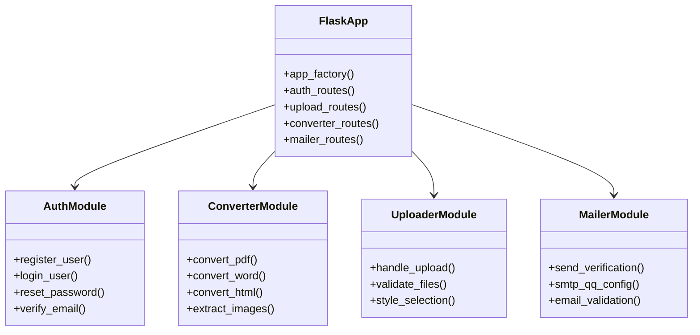
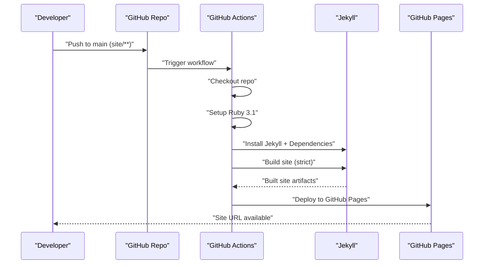
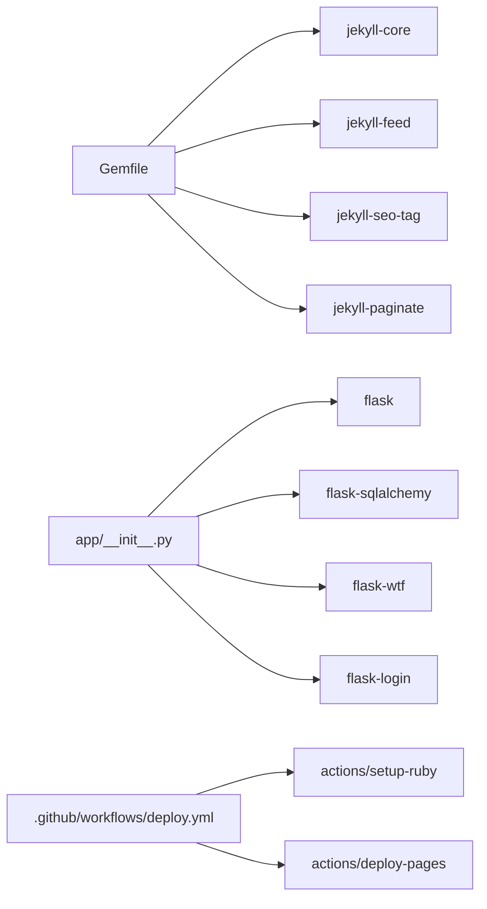

# Deployment and DevOps

<cite>
**Referenced Files in This Document**
- [.github/workflows/deploy.yml](file://.github/workflows/deploy.yml)
- [_config.yml](file://_config.yml)
- [Gemfile](file://Gemfile)
- [index.html](file://index.html)
- [app/__init__.py](file://app/__init__.py)
- [app/auth.py](file://app/auth.py)
- [app/converter.py](file://app/converter.py)
- [app/uploader.py](file://app/uploader.py)
- [app/mailer.py](file://app/mailer.py)
- [PRD.md](file://PRD.md)
</cite>

## Update Summary
**Changes Made**
- Removed all Docker Compose and multi-container deployment references
- Updated architecture to reflect Jekyll static site generation instead of MkDocs
- Revised CI/CD pipeline to focus on GitHub Pages deployment
- Removed backend, frontend, and database components
- Updated project structure to reflect Flask management server and Jekyll blog generation
- Removed PostgreSQL, FastAPI, React, and MkDocs references

## Table of Contents
1. [Introduction](#introduction)
2. [Project Structure](#project-structure)
3. [Core Components](#core-components)
4. [Architecture Overview](#architecture-overview)
5. [Detailed Component Analysis](#detailed-component-analysis)
6. [Dependency Analysis](#dependency-analysis)
7. [Performance Considerations](#performance-considerations)
8. [Troubleshooting Guide](#troubleshooting-guide)
9. [Conclusion](#conclusion)
10. [Appendices](#appendices)

## Introduction
This document provides comprehensive deployment and DevOps guidance for PolaZhenJing v2. The project has undergone a major architectural transformation from a complex multi-container FastAPI application to a streamlined Jekyll-based static site generator with a lightweight Flask management server. This document covers the new single-container deployment strategy, GitHub Actions CI/CD pipeline, environment configuration, production deployment process, static site generation approach, service dependencies, automated deployment workflows, environment variables and secrets management, security considerations, monitoring and logging setup, maintenance procedures, scaling considerations, backup strategies, disaster recovery planning, and troubleshooting for common deployment issues.

## Project Structure
The repository is now organized into two primary layers:
- **App**: Lightweight Flask management server with authentication, file upload, conversion, and email verification modules
- **Blog**: Jekyll static site generator with 5 distinct blog post styles and automatic content generation

```mermaid
graph TB
subgraph "Root"
GHA[".github/workflows/deploy.yml"]
END
subgraph "App Layer (Flask)"
FLASK["app/__init__.py"]
AUTH["app/auth.py"]
CONV["app/converter.py"]
UP["app/uploader.py"]
MAIL["app/mailer.py"]
END
subgraph "Blog Layer (Jekyll)"
JCONFIG["_config.yml"]
GEM["Gemfile"]
INDEX["index.html"]
POSTS["_posts/ (generated)"]
END
GHA --> JCONFIG
GHA --> GEM
FLASK --> AUTH
FLASK --> CONV
FLASK --> UP
FLASK --> MAIL
JCONFIG --> INDEX
JCONFIG --> POSTS
```

**Diagram sources**
- [.github/workflows/deploy.yml:1-63](file://.github/workflows/deploy.yml#L1-L63)
- [app/__init__.py](file://app/__init__.py)
- [app/auth.py](file://app/auth.py)
- [app/converter.py](file://app/converter.py)
- [app/uploader.py](file://app/uploader.py)
- [app/mailer.py](file://app/mailer.py)
- [_config.yml:1-49](file://_config.yml#L1-L49)
- [Gemfile:1-7](file://Gemfile#L1-L7)
- [index.html:1-70](file://index.html#L1-L70)

**Section sources**
- [.github/workflows/deploy.yml:1-63](file://.github/workflows/deploy.yml#L1-L63)
- [_config.yml:1-49](file://_config.yml#L1-L49)
- [Gemfile:1-7](file://Gemfile#L1-L7)
- [index.html:1-70](file://index.html#L1-L70)
- [app/__init__.py](file://app/__init__.py)
- [app/auth.py](file://app/auth.py)
- [app/converter.py](file://app/converter.py)
- [app/uploader.py](file://app/uploader.py)
- [app/mailer.py](file://app/mailer.py)

## Core Components
- **Flask Management Server**: Lightweight Flask application handling authentication, file uploads, content conversion, and email verification
- **Jekyll Static Site Generator**: Ruby-based static site generator with 5 blog post styles and automatic content processing
- **GitHub Actions Pipeline**: Automated deployment workflow building and publishing the static site to GitHub Pages
- **SQLite Database**: Zero-configuration file-based database for user authentication and session management

Key runtime characteristics:
- Flask server handles all administrative functions and content management
- Jekyll processes blog posts from the `_posts/` directory into static HTML
- GitHub Actions workflow automatically builds and deploys changes to GitHub Pages
- Single-file SQLite database eliminates external dependency requirements

**Section sources**
- [app/__init__.py](file://app/__init__.py)
- [_config.yml:1-49](file://_config.yml#L1-L49)
- [.github/workflows/deploy.yml:27-63](file://.github/workflows/deploy.yml#L27-L63)

## Architecture Overview
The system follows a simplified single-container architecture focused on static site generation:
- Flask management server handles all administrative operations
- Jekyll processes content into static HTML for optimal performance
- GitHub Actions workflow automates deployment to GitHub Pages
- SQLite database provides lightweight user authentication

```mermaid
graph TB
subgraph "Single Container Architecture"
FLASK["Flask Management Server<br/>Auth + Upload + Conversion"]
JEKYLL["Jekyll Static Generator<br/>5 Blog Styles + Templates"]
GITHUB["GitHub Actions<br/>Auto-deploy to GitHub Pages"]
SQLITE["SQLite Database<br/>Zero-config User Storage"]
END
FLASK --> SQLITE
FLASK --> JEKYLL
JEKYLL --> GITHUB
```

**Diagram sources**
- [app/__init__.py](file://app/__init__.py)
- [_config.yml:1-49](file://_config.yml#L1-L49)
- [.github/workflows/deploy.yml:27-63](file://.github/workflows/deploy.yml#L27-L63)

## Detailed Component Analysis

### Flask Management Server
- **Containerized with Python 3.12 Alpine image**
- **Handles**: User authentication, file uploads, content conversion, email verification
- **Database**: SQLite for zero-configuration user storage
- **Security**: Flask sessions with secure cookies, password hashing, email verification via QQ SMTP



**Diagram sources**
- [app/__init__.py](file://app/__init__.py)
- [app/auth.py](file://app/auth.py)
- [app/converter.py](file://app/converter.py)
- [app/uploader.py](file://app/uploader.py)
- [app/mailer.py](file://app/mailer.py)

**Section sources**
- [app/__init__.py](file://app/__init__.py)
- [app/auth.py](file://app/auth.py)
- [app/converter.py](file://app/converter.py)
- [app/uploader.py](file://app/uploader.py)
- [app/mailer.py](file://app/mailer.py)

### Jekyll Static Site Generator
- **Ruby-based static site generator** with Jekyll 4.3
- **5 distinct blog post styles**: Deep Technical, Academic Insight, Industry Vision, Friendly Explainer, Creative Visual
- **Automatic content processing**: Converts uploaded content to styled blog posts
- **Theme ecosystem**: 1000+ blog themes available for customization
- **GitHub Pages native integration**: Built-in support for GitHub Pages deployment

Configuration highlights:
- **Front matter processing**: Automatic YAML metadata generation for blog posts
- **Image optimization**: Automatic extraction and embedding of extracted images
- **Responsive design**: Mobile-first approach with CSS frameworks
- **Search functionality**: Full-text search across all articles

**Section sources**
- [_config.yml:1-49](file://_config.yml#L1-L49)
- [Gemfile:1-7](file://Gemfile#L1-L7)
- [index.html:1-70](file://index.html#L1-L70)

### CI/CD Pipeline (GitHub Actions)
- **Workflow name**: Deploy MkDocs to GitHub Pages (now Jekyll-based)
- **Triggers**: Pushes to main branch affecting site/** or manual dispatch
- **Permissions**: Read repository contents, write to GitHub Pages, OIDC tokens
- **Build job**:
  - Checks out repository
  - Sets up Python 3.12
  - Installs Jekyll and dependencies
  - Builds static site with strict mode
  - Uploads built site as artifact
- **Deploy job**:
  - Deploys artifact to GitHub Pages environment
  - Exposes deployment URL



**Diagram sources**
- [.github/workflows/deploy.yml:1-63](file://.github/workflows/deploy.yml#L1-L63)

**Section sources**
- [.github/workflows/deploy.yml:1-63](file://.github/workflows/deploy.yml#L1-L63)

### Environment Variables and Secrets Management
Critical environment variables:
- **GitHub Pages deployment**: Automatic via GitHub Actions OIDC tokens
- **Email configuration**: QQ SMTP credentials for email verification
- **Application settings**: Flask configuration for session management
- **Jekyll configuration**: Site metadata, plugins, and build settings

Production recommendations:
- Store email SMTP credentials in GitHub Secrets
- Use environment files for local development
- Implement proper error handling for email failures
- Monitor GitHub Pages deployment status

**Section sources**
- [_config.yml:18-23](file://_config.yml#L18-L23)
- [app/mailer.py](file://app/mailer.py)
- [.github/workflows/deploy.yml:18-21](file://.github/workflows/deploy.yml#L18-L21)

### Security Considerations
- **Authentication**: SQLite-based user storage with password hashing
- **Email verification**: QQ SMTP integration for secure user registration
- **Session management**: Flask sessions with secure cookie settings
- **File uploads**: Input validation and sanitization for uploaded documents
- **GitHub Pages**: Secure deployment via GitHub Actions with proper permissions

**Section sources**
- [app/auth.py](file://app/auth.py)
- [app/mailer.py](file://app/mailer.py)
- [app/uploader.py](file://app/uploader.py)

### Monitoring Setup and Logging Configuration
- **Application logging**: Flask application logs for debugging and monitoring
- **GitHub Pages monitoring**: Automatic deployment status tracking
- **Error handling**: Comprehensive error handling for file conversions and email delivery
- **Health checks**: Basic application health verification

**Section sources**
- [app/__init__.py](file://app/__init__.py)
- [.github/workflows/deploy.yml:53-63](file://.github/workflows/deploy.yml#L53-L63)

### Maintenance Procedures
- **Content management**: Use Flask admin interface for blog post creation and management
- **Theme updates**: Update Jekyll gems in Gemfile for theme improvements
- **Plugin management**: Add/remove Jekyll plugins via Gemfile as needed
- **Deployment verification**: Monitor GitHub Actions workflow for successful deployments

**Section sources**
- [Gemfile:1-7](file://Gemfile#L1-L7)
- [_config.yml:18-23](file://_config.yml#L18-L23)

## Dependency Analysis
Runtime and build-time dependencies:
- **Flask App**:
  - Flask web framework, Flask-SQLAlchemy for database operations
  - Flask-WTF for form handling, Flask-Login for authentication
  - Email libraries for QQ SMTP integration
- **Jekyll Site**:
  - Jekyll 4.3, Jekyll Feed, Jekyll SEO Tag, Jekyll Paginate
  - Ruby 3.1 runtime environment
- **GitHub Actions**:
  - Ruby setup action, GitHub Pages deployment action
  - Python 3.12 for legacy compatibility



**Diagram sources**
- [Gemfile:1-7](file://Gemfile#L1-L7)
- [app/__init__.py](file://app/__init__.py)
- [.github/workflows/deploy.yml:27-63](file://.github/workflows/deploy.yml#L27-L63)

**Section sources**
- [Gemfile:1-7](file://Gemfile#L1-L7)
- [app/__init__.py](file://app/__init__.py)
- [.github/workflows/deploy.yml:27-63](file://.github/workflows/deploy.yml#L27-L63)

## Performance Considerations
- **Static site generation**: Jekyll compiles content to static HTML for optimal loading performance
- **Image optimization**: Automatic extraction and embedding of optimized images
- **Caching**: GitHub Pages provides CDN caching for improved global performance
- **Resource limits**: Single container deployment reduces resource overhead
- **Build optimization**: Jekyll build process optimized for GitHub Actions environment

## Troubleshooting Guide
Common deployment issues and resolutions:
- **GitHub Pages deployment failures**:
  - Verify Ruby version compatibility in GitHub Actions workflow
  - Check Jekyll build logs for syntax errors in markdown files
  - Ensure proper Gemfile configuration and dependencies
- **Flask application errors**:
  - Check SQLite database connectivity and file permissions
  - Verify email SMTP configuration for QQ email verification
  - Review Flask application logs for authentication failures
- **Jekyll build errors**:
  - Validate YAML front matter in blog posts
  - Check file encoding and character set issues
  - Ensure proper directory structure for `_posts/` content
- **Email verification failures**:
  - Verify QQ SMTP credentials in GitHub Secrets
  - Check email deliverability and spam filters
  - Test SMTP connection manually

**Section sources**
- [.github/workflows/deploy.yml:43-46](file://.github/workflows/deploy.yml#L43-L46)
- [app/mailer.py](file://app/mailer.py)
- [_config.yml:18-23](file://_config.yml#L18-L23)

## Conclusion
PolaZhenJing v2 represents a significant simplification from its previous complex multi-container architecture to a streamlined Jekyll-based static site generator with a lightweight Flask management server. The single-container deployment approach dramatically reduces operational complexity while maintaining powerful blogging capabilities. The GitHub Actions workflow provides seamless automation for content management and deployment. Production readiness requires proper email configuration, monitoring of GitHub Pages deployment status, and regular maintenance of Jekyll themes and plugins.

## Appendices

### Production Deployment Checklist
- **Environment setup**: Configure GitHub Secrets for email SMTP credentials
- **Domain configuration**: Set up custom domain via GitHub Pages CNAME support
- **Monitoring**: Enable GitHub Pages deployment notifications and status checks
- **Backup strategy**: Regular backup of content in `_posts/` directory
- **Security hardening**: Implement proper error handling and input validation
- **Performance optimization**: Monitor GitHub Pages performance and optimize images

### Backup and Disaster Recovery
- **Content backup**: Regular backup of `_posts/` directory containing all blog content
- **Configuration backup**: Preserve `_config.yml` and Gemfile for environment recreation
- **Database backup**: SQLite database file backup for user authentication data
- **Recovery procedures**: Document steps to recreate environment and redeploy
- **Rollback strategy**: GitHub Pages allows easy rollback to previous deployments

**Section sources**
- [_config.yml:32-49](file://_config.yml#L32-L49)
- [Gemfile:1-7](file://Gemfile#L1-L7)
- [PRD.md:160-179](file://PRD.md#L160-L179)