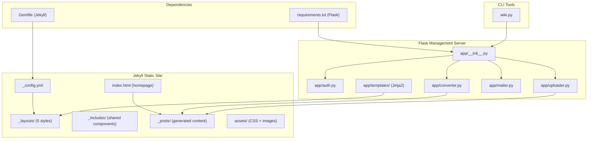
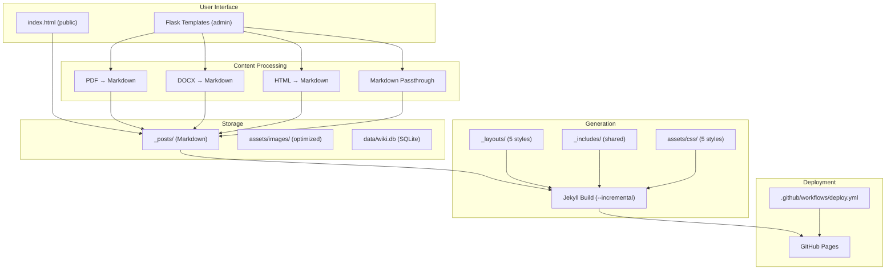
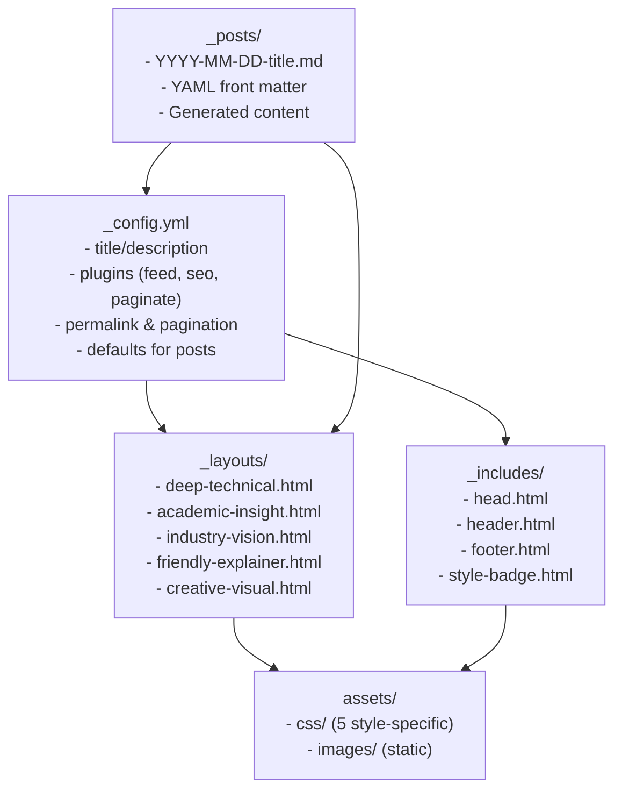
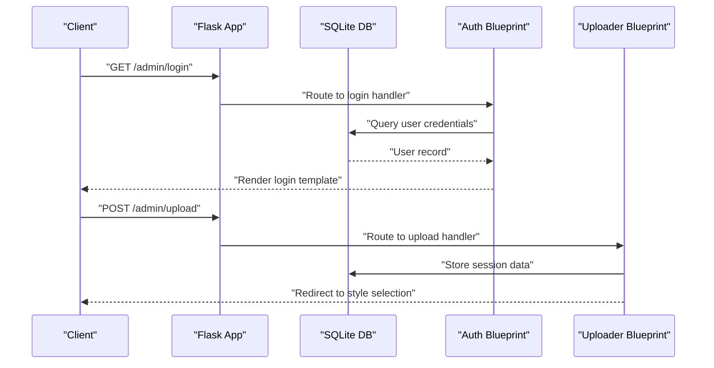
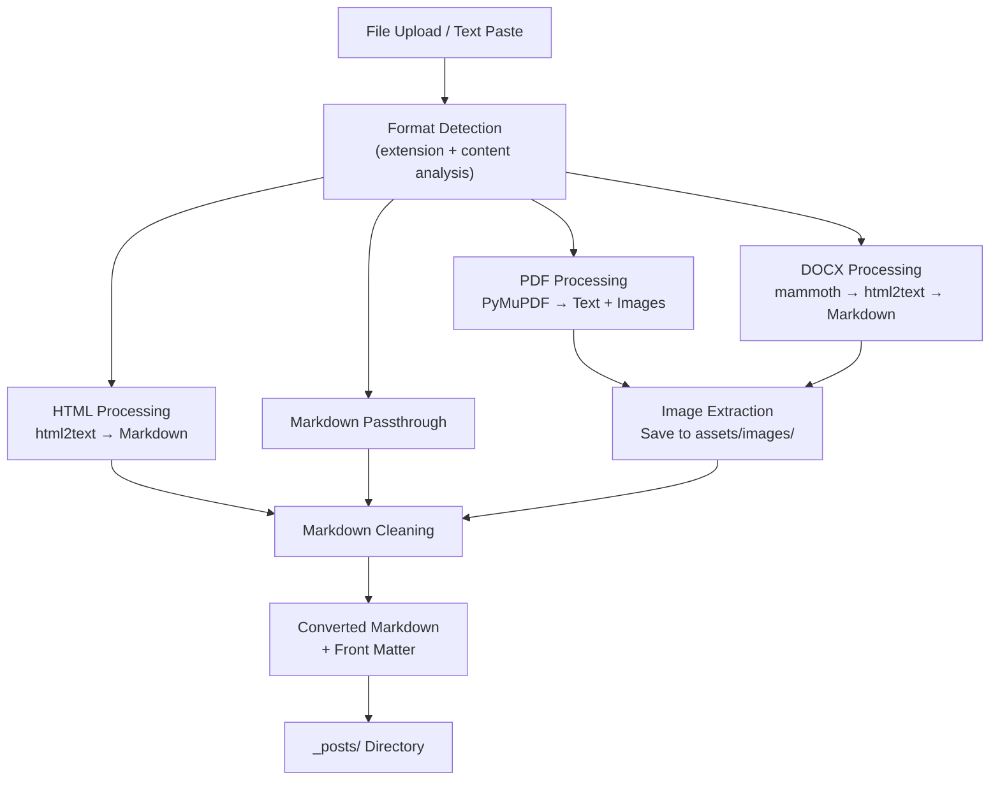
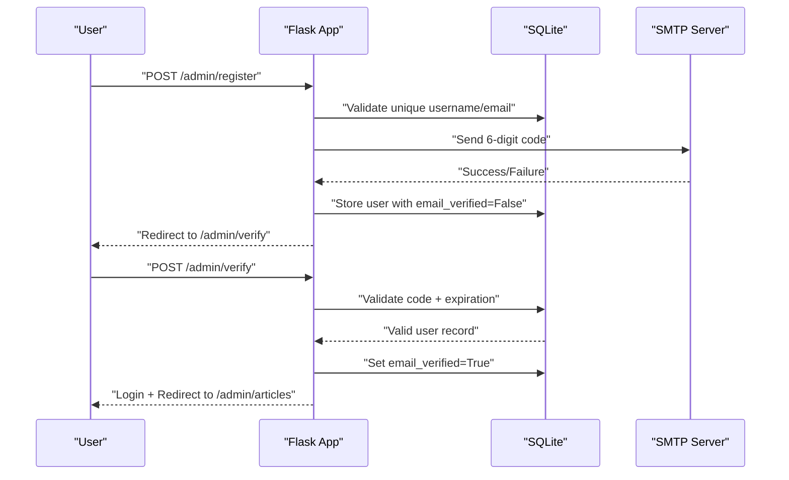
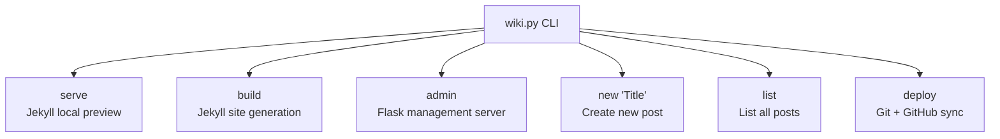
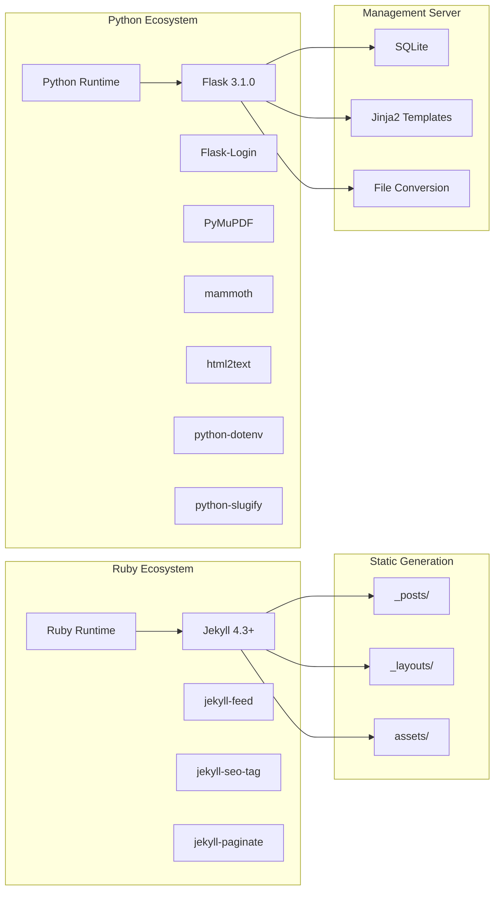

# Development Guidelines

<cite>
**Referenced Files in This Document**
- [_config.yml](file://_config.yml)
- [Gemfile](file://Gemfile)
- [requirements.txt](file://requirements.txt)
- [wiki.py](file://wiki.py)
- [app/__init__.py](file://app/__init__.py)
- [app/auth.py](file://app/auth.py)
- [app/converter.py](file://app/converter.py)
- [app/uploader.py](file://app/uploader.py)
- [app/mailer.py](file://app/mailer.py)
- [app/templates/base.html](file://app/templates/base.html)
- [app/templates/upload.html](file://app/templates/upload.html)
- [_layouts/deep-technical.html](file://_layouts/deep-technical.html)
- [index.html](file://index.html)
- [.github/workflows/deploy.yml](file://.github/workflows/deploy.yml)
- [PRD.md](file://PRD.md)
</cite>

## Update Summary
**Changes Made**
- Complete replacement of FastAPI + React + Docker workflow with Jekyll + Flask + simplified requirements
- Removed all backend/frontend separation concepts and Docker infrastructure
- Replaced with single-file CLI tool (wiki.py) and lightweight Flask management server
- Updated project structure to focus on static site generation with 5 blog styles
- Simplified authentication to SQLite-based Flask sessions
- Removed all React/Vite/TypeScript dependencies and replaced with Jinja2 templates

## Table of Contents
1. [Introduction](#introduction)
2. [Project Structure](#project-structure)
3. [Core Components](#core-components)
4. [Architecture Overview](#architecture-overview)
5. [Detailed Component Analysis](#detailed-component-analysis)
6. [Dependency Analysis](#dependency-analysis)
7. [Performance Considerations](#performance-considerations)
8. [Troubleshooting Guide](#troubleshooting-guide)
9. [Contribution Workflow](#contribution-workflow)
10. [Testing Strategy](#testing-strategy)
11. [Code Quality and Linting](#code-quality-and-linting)
12. [Local Development Setup](#local-development-setup)
13. [Environment Configuration](#environment-configuration)
14. [Extending the Application](#extending-the-application)
15. [Conclusion](#conclusion)

## Introduction
This document provides comprehensive development guidelines for contributing to PolaZhenJing v2. It covers coding standards for Python (Flask) and Jekyll static site generation, project structure conventions, naming patterns, architectural principles, development workflow, branch management, pull request process, testing strategy, code quality tools, debugging techniques, local development setup, environment configuration, code review guidelines, documentation standards, contribution best practices, and guidelines for extending the application with new features and blog styles.

**Updated** This is a complete paradigm shift from the previous FastAPI + React + Docker architecture to a streamlined Jekyll + Flask + simplified requirements approach. The new workflow emphasizes simplicity, zero-dependency local development, and static site generation.

## Project Structure
PolaZhenJing v2 follows a dramatically simplified structure focused on static site generation:

- **Static Site Generator**: Jekyll with 5 predefined blog styles and responsive design
- **Management Server**: Flask application handling authentication, file uploads, conversions, and article management
- **Content Storage**: Markdown posts in `_posts/` directory with YAML front matter
- **Asset Management**: Images and CSS in `assets/` directory
- **Configuration**: Jekyll `_config.yml`, Ruby dependencies in `Gemfile`, Python dependencies in `requirements.txt`
- **CLI Tools**: Single-purpose `wiki.py` script for all administrative tasks

**Diagram sources**
- [_config.yml:1-49](file://_config.yml#L1-L49)
- [Gemfile:1-7](file://Gemfile#L1-L7)
- [requirements.txt:1-8](file://requirements.txt#L1-L8)
- [wiki.py:1-165](file://wiki.py#L1-L165)
- [app/__init__.py:1-62](file://app/__init__.py#L1-L62)
- [app/auth.py:1-168](file://app/auth.py#L1-L168)
- [app/converter.py:1-88](file://app/converter.py#L1-L88)
- [app/uploader.py:1-210](file://app/uploader.py#L1-L210)
- [app/mailer.py:1-53](file://app/mailer.py#L1-L53)

**Section sources**
- [_config.yml:1-49](file://_config.yml#L1-L49)
- [Gemfile:1-7](file://Gemfile#L1-L7)
- [requirements.txt:1-8](file://requirements.txt#L1-L8)
- [wiki.py:1-165](file://wiki.py#L1-L165)

## Core Components
- **Jekyll Configuration**: Centralized site configuration with 5 blog styles, pagination, SEO plugins, and build settings
- **Flask Application Factory**: Creates Flask app with database initialization, blueprint registration, and session management
- **Authentication System**: SQLite-based user management with QQ email SMTP verification and Flask session handling
- **File Conversion Pipeline**: Multi-format document processing (PDF, DOCX, HTML) to Markdown with image extraction
- **Article Management**: Flask-based UI for upload, style selection, preview, and GitHub synchronization
- **CLI Management Tool**: Unified command-line interface for all administrative operations

**Updated** The core components have shifted from complex backend APIs to streamlined static site generation with Flask as a lightweight management interface.

**Section sources**
- [_config.yml:1-49](file://_config.yml#L1-L49)
- [app/__init__.py:1-62](file://app/__init__.py#L1-L62)
- [app/auth.py:1-168](file://app/auth.py#L1-L168)
- [app/converter.py:1-88](file://app/converter.py#L1-L88)
- [app/uploader.py:1-210](file://app/uploader.py#L1-L210)
- [app/mailer.py:1-53](file://app/mailer.py#L1-L53)
- [wiki.py:1-165](file://wiki.py#L1-L165)

## Architecture Overview
The system uses a simplified layered architecture:
- **Presentation Layer**: Jekyll-generated static HTML with 5 distinct blog styles and responsive design
- **Management Layer**: Flask application providing authentication, file uploads, conversions, and article management
- **Content Layer**: Markdown posts with YAML front matter, processed through conversion pipeline
- **Asset Layer**: Optimized images and CSS distributed across assets directory
- **Deployment Layer**: GitHub Actions for automated Jekyll builds and GitHub Pages deployment

**Diagram sources**
- [index.html:1-70](file://index.html#L1-L70)
- [app/converter.py:1-88](file://app/converter.py#L1-L88)
- [app/uploader.py:1-210](file://app/uploader.py#L1-L210)
- [_config.yml:1-49](file://_config.yml#L1-L49)
- [PRD.md:370-767](file://PRD.md#L370-L767)

## Detailed Component Analysis

### Jekyll Configuration and Blog Styles
- **Configuration**: Centralized Jekyll settings including title, description, URL, permalinks, plugins, and pagination
- **Blog Styles**: 5 distinct layouts (deep-technical, academic-insight, industry-vision, friendly-explainer, creative-visual)
- **Shared Components**: Reusable includes for SEO, navigation, footer, and style badges
- **Asset Organization**: Separate CSS files for each style with global styling

**Diagram sources**
- [_config.yml:1-49](file://_config.yml#L1-L49)
- [_layouts/deep-technical.html:1-22](file://_layouts/deep-technical.html#L1-L22)
- [index.html:1-70](file://index.html#L1-L70)

**Section sources**
- [_config.yml:1-49](file://_config.yml#L1-L49)
- [_layouts/deep-technical.html:1-22](file://_layouts/deep-technical.html#L1-L22)
- [index.html:1-70](file://index.html#L1-L70)

### Flask Application Factory and Database Management
- **Application Factory Pattern**: Centralized Flask app creation with configuration loading and blueprint registration
- **Database Initialization**: SQLite database creation with WAL mode for improved concurrency
- **Session Management**: Flask session handling with secret key and request teardown
- **Blueprint Registration**: Modular routing for authentication, file uploads, and management interfaces

**Diagram sources**
- [app/__init__.py:1-62](file://app/__init__.py#L1-L62)
- [app/auth.py:1-168](file://app/auth.py#L1-L168)
- [app/uploader.py:1-210](file://app/uploader.py#L1-L210)

**Section sources**
- [app/__init__.py:1-62](file://app/__init__.py#L1-L62)
- [app/auth.py:1-168](file://app/auth.py#L1-L168)
- [app/uploader.py:1-210](file://app/uploader.py#L1-L210)

### File Conversion Pipeline
- **Multi-format Support**: PDF (PyMuPDF), DOCX (mammoth + html2text), HTML (html2text), Markdown passthrough
- **Image Extraction**: Automatic image detection and saving to assets/images/ directory
- **Title Detection**: Smart title extraction from first heading or content
- **Fallback Handling**: Graceful degradation when conversion libraries are unavailable

**Diagram sources**
- [app/converter.py:1-88](file://app/converter.py#L1-L88)
- [app/uploader.py:1-210](file://app/uploader.py#L1-L210)

**Section sources**
- [app/converter.py:1-88](file://app/converter.py#L1-L88)
- [app/uploader.py:1-210](file://app/uploader.py#L1-L210)

### Authentication and Email Verification
- **User Registration**: Username, password, and QQ email verification with 6-digit code
- **Password Security**: Werkzeug password hashing with salt
- **Email Verification**: QQ SMTP integration with SSL (smtp.qq.com:465)
- **Session Management**: Flask session with secure cookies and user data persistence

**Diagram sources**
- [app/auth.py:1-168](file://app/auth.py#L1-L168)
- [app/mailer.py:1-53](file://app/mailer.py#L1-L53)

**Section sources**
- [app/auth.py:1-168](file://app/auth.py#L1-L168)
- [app/mailer.py:1-53](file://app/mailer.py#L1-L53)

### CLI Management Tool
- **Unified Interface**: Single `wiki.py` script replacing multiple development commands
- **Administrative Functions**: Serve, build, admin server, new post creation, listing, and deployment
- **Workflow Automation**: End-to-end article creation from upload to GitHub Pages deployment
- **Environment Integration**: Seamless integration with Jekyll and Flask applications

**Diagram sources**
- [wiki.py:1-165](file://wiki.py#L1-L165)

**Section sources**
- [wiki.py:1-165](file://wiki.py#L1-L165)

## Dependency Analysis
- **Ruby/Jekyll Dependencies**: Jekyll 4.3+, feed, SEO, and pagination plugins for static site generation
- **Python/Flask Dependencies**: Flask 3.1.0, Flask-Login, PyMuPDF, mammoth, html2text, python-dotenv, python-slugify
- **No Docker/Database Complexity**: SQLite replaces PostgreSQL, eliminating migration overhead
- **Minimal Frontend**: Pure HTML/CSS/JavaScript with Jinja2 templates for server-side rendering

**Diagram sources**
- [Gemfile:1-7](file://Gemfile#L1-L7)
- [requirements.txt:1-8](file://requirements.txt#L1-L8)

**Section sources**
- [Gemfile:1-7](file://Gemfile#L1-L7)
- [requirements.txt:1-8](file://requirements.txt#L1-L8)

## Performance Considerations
- **Incremental Jekyll Builds**: Use `--incremental` flag for faster rebuilds during development
- **SQLite Optimization**: WAL mode improves concurrent access and write performance
- **Image Optimization**: Automatic image extraction and storage in assets/images/ reduces HTTP requests
- **Static Asset Caching**: Jekyll generates cache-friendly static files for production
- **Minimal Dependencies**: Reduced complexity leads to faster startup and deployment times

**Updated** Performance optimizations now focus on static site generation efficiency and lightweight Flask operations rather than complex backend API performance tuning.

## Troubleshooting Guide
- **Jekyll Build Issues**: Check `_config.yml` syntax and plugin compatibility; verify Ruby version meets requirements
- **Flask Application Errors**: Validate database initialization, template paths, and environment variable configuration
- **File Conversion Failures**: Ensure conversion libraries are installed; check file permissions for temporary directories
- **Email Verification Problems**: Verify QQ email SMTP settings, authentication code, and network connectivity
- **GitHub Deployment Issues**: Check Git configuration, remote repository setup, and GitHub Actions workflow permissions

**Section sources**
- [_config.yml:1-49](file://_config.yml#L1-L49)
- [app/__init__.py:1-62](file://app/__init__.py#L1-L62)
- [app/converter.py:1-88](file://app/converter.py#L1-L88)
- [app/mailer.py:1-53](file://app/mailer.py#L1-L53)
- [.github/workflows/deploy.yml](file://.github/workflows/deploy.yml)

## Contribution Workflow
- **Branching Strategy**: Use feature branches from main for new blog styles, converter improvements, or CLI enhancements
- **Commit Messages**: Follow clear, descriptive messages focusing on the specific change made
- **Pull Request Process**: Open PRs with clear descriptions, test results, and impact assessment
- **Review Criteria**: Focus on code clarity, performance impact, and adherence to the simplified architecture
- **Merge Requirements**: Ensure all tests pass, documentation updates are included, and no Docker/React dependencies are reintroduced

**Updated** The contribution workflow emphasizes maintaining the simplified architecture and avoiding complexity regression.

## Testing Strategy
- **Unit Testing**: Test individual functions in converter.py, authentication logic, and CLI operations
- **Integration Testing**: Verify end-to-end workflows from file upload to GitHub deployment
- **Template Testing**: Ensure Jinja2 templates render correctly with various data inputs
- **Static Site Testing**: Validate Jekyll build process and generated HTML structure
- **Database Testing**: Test SQLite operations, session handling, and user authentication flows

**Section sources**
- [app/converter.py:1-88](file://app/converter.py#L1-L88)
- [app/auth.py:1-168](file://app/auth.py#L1-L168)
- [app/uploader.py:1-210](file://app/uploader.py#L1-L210)

## Code Quality and Linting
- **Python**: Use Black for formatting, flake8 for linting, and type hints for function signatures
- **Jekyll**: Validate YAML syntax in configuration and front matter; ensure Liquid templates are properly formatted
- **CSS**: Organize styles by blog style, use consistent naming conventions, and validate with CSS linters
- **Documentation**: Maintain clear docstrings for Python functions and inline comments for complex logic
- **No Frontend Framework**: Focus on pure HTML/CSS/JavaScript with Jinja2 templating

**Section sources**
- [requirements.txt:1-8](file://requirements.txt#L1-L8)
- [_config.yml:1-49](file://_config.yml#L1-L49)

## Local Development Setup
- **Prerequisites**: Ruby 3.x+, Python 3.10+, Git, and basic understanding of static site generation
- **Jekyll Setup**: Install Ruby dependencies via `bundle install` and verify Jekyll installation
- **Flask Setup**: Install Python dependencies from `requirements.txt` and set up environment variables
- **Database Initialization**: SQLite database is created automatically on first run
- **Development Commands**: Use `python wiki.py serve` for Jekyll preview, `python wiki.py admin` for management server

**Updated** Development setup is dramatically simplified with zero Docker requirements and single-command local previews.

**Section sources**
- [Gemfile:1-7](file://Gemfile#L1-L7)
- [requirements.txt:1-8](file://requirements.txt#L1-L8)
- [wiki.py:1-165](file://wiki.py#L1-L165)

## Environment Configuration
- **Jekyll Configuration**: Set site title, description, URL, baseurl, and plugin preferences in `_config.yml`
- **Flask Configuration**: Environment variables for SECRET_KEY, database paths, and email settings
- **Email Settings**: QQ email SMTP configuration with authorization code (not password)
- **File Upload Limits**: MAX_CONTENT_LENGTH setting for security and performance
- **Development vs Production**: Different asset handling and build optimization settings

**Section sources**
- [_config.yml:1-49](file://_config.yml#L1-L49)
- [app/__init__.py:1-62](file://app/__init__.py#L1-L62)
- [app/mailer.py:1-53](file://app/mailer.py#L1-L53)

## Extending the Application
- **New Blog Styles**: Create new layout in `_layouts/` and corresponding CSS in `assets/css/`
- **Converter Enhancements**: Add support for new file formats in `app/converter.py`
- **CLI Extensions**: Add new commands to `wiki.py` for specialized administrative tasks
- **Authentication Improvements**: Enhance security measures or add two-factor authentication
- **Asset Management**: Extend image processing, video embedding, or interactive content support

**Updated** Extensions focus on adding new blog styles and improving the existing simplified workflow rather than complex backend features.

**Section sources**
- [_layouts/deep-technical.html:1-22](file://_layouts/deep-technical.html#L1-L22)
- [app/converter.py:1-88](file://app/converter.py#L1-L88)
- [wiki.py:1-165](file://wiki.py#L1-L165)

## Conclusion
These guidelines establish a streamlined development process for PolaZhenJing v2, emphasizing simplicity, static site generation, and zero-dependency local development. The shift from FastAPI + React + Docker to Jekyll + Flask + simplified requirements creates a more maintainable and accessible platform for personal AI knowledge blogging. Follow these standards to ensure the project remains true to its minimalist philosophy while supporting future enhancements.

**Updated** The conclusion reflects the fundamental architectural shift toward simplicity and static generation, maintaining the project's focus on accessibility and ease of maintenance.