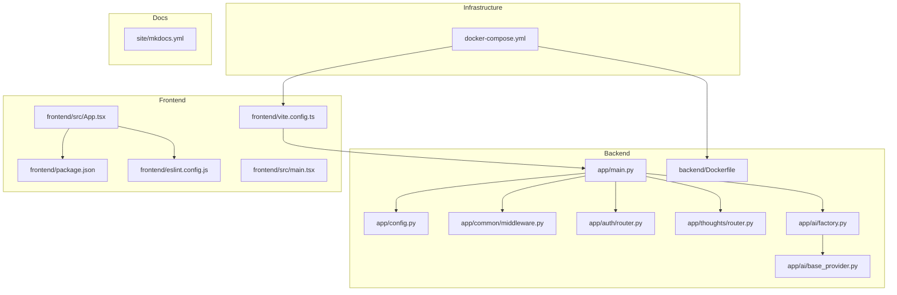
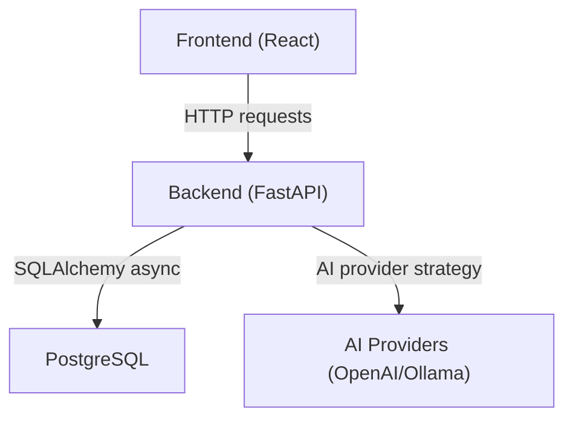
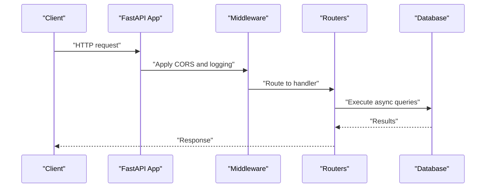
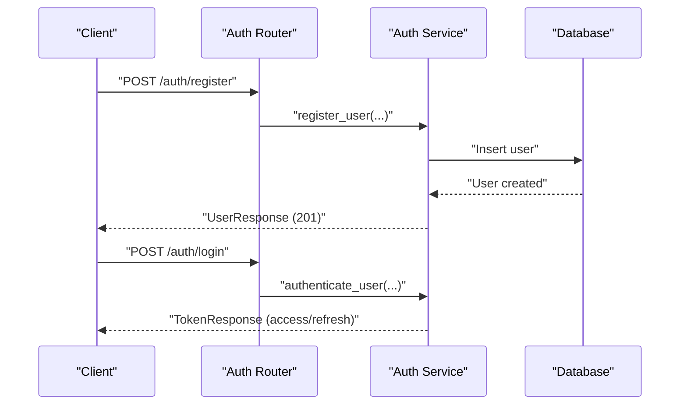
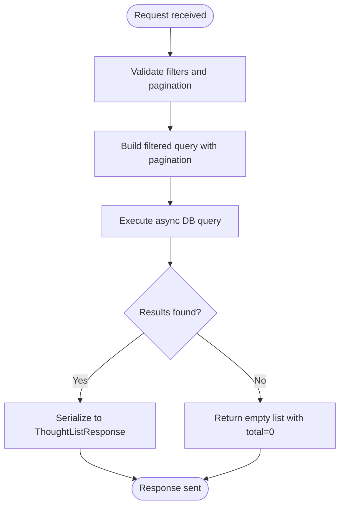
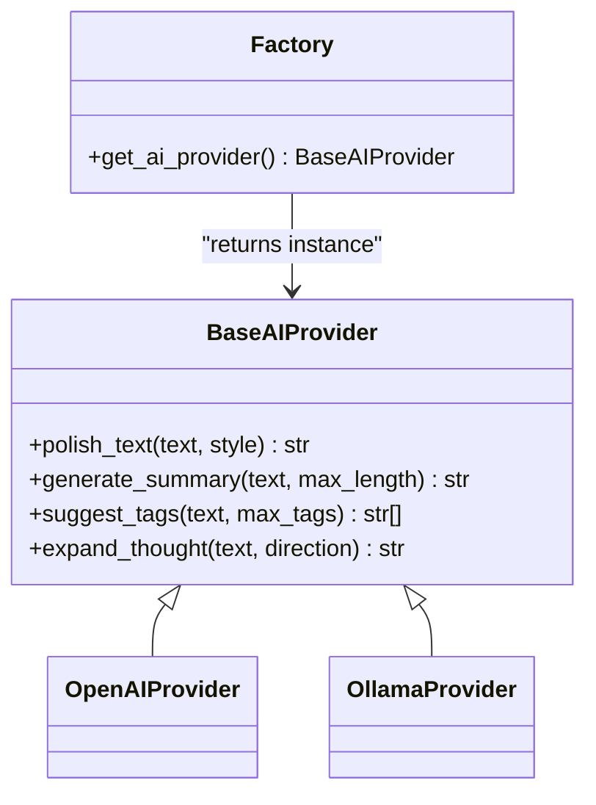
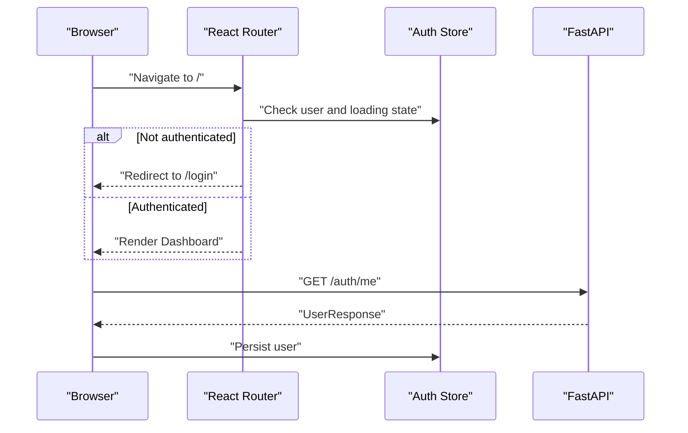
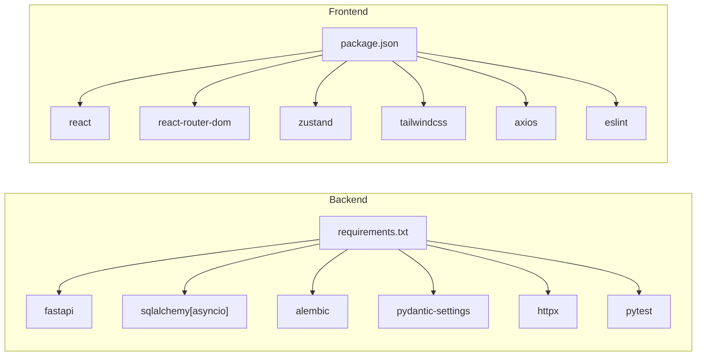

# Development Guidelines

<cite>
**Referenced Files in This Document**
- [backend/app/main.py](file://backend/app/main.py)
- [backend/app/config.py](file://backend/app/config.py)
- [backend/app/common/middleware.py](file://backend/app/common/middleware.py)
- [backend/app/auth/router.py](file://backend/app/auth/router.py)
- [backend/app/thoughts/router.py](file://backend/app/thoughts/router.py)
- [backend/app/ai/base_provider.py](file://backend/app/ai/base_provider.py)
- [backend/app/ai/factory.py](file://backend/app/ai/factory.py)
- [backend/Dockerfile](file://backend/Dockerfile)
- [docker-compose.yml](file://docker-compose.yml)
- [frontend/vite.config.ts](file://frontend/vite.config.ts)
- [frontend/package.json](file://frontend/package.json)
- [frontend/eslint.config.js](file://frontend/eslint.config.js)
- [frontend/src/App.tsx](file://frontend/src/App.tsx)
- [frontend/src/main.tsx](file://frontend/src/main.tsx)
- [backend/requirements.txt](file://backend/requirements.txt)
- [backend/tests/test_health.py](file://backend/tests/test_health.py)
- [.github/workflows/deploy.yml](file://.github/workflows/deploy.yml)
</cite>

## Table of Contents
1. [Introduction](#introduction)
2. [Project Structure](#project-structure)
3. [Core Components](#core-components)
4. [Architecture Overview](#architecture-overview)
5. [Detailed Component Analysis](#detailed-component-analysis)
6. [Dependency Analysis](#dependency-analysis)
7. [Performance Considerations](#performance-considerations)
8. [Troubleshooting Guide](#troubleshooting-guide)
9. [Contribution Workflow](#contribution-workflow)
10. [Testing Strategy](#testing-strategy)
11. [Code Quality and Linting](#code-quality-and-linting)
12. [Local Development Setup](#local-development-setup)
13. [Environment Configuration](#environment-configuration)
14. [Extending the Application](#extending-the-application)
15. [Conclusion](#conclusion)

## Introduction
This document provides comprehensive development guidelines for contributing to PolaZhenJing. It covers coding standards for Python (FastAPI) and TypeScript/React, project structure conventions, naming patterns, architectural principles, development workflow, branch management, pull request process, testing strategy, code quality tools, linting configurations, debugging techniques, local development setup, environment configuration, code review guidelines, documentation standards, contribution best practices, and guidelines for extending the application with new features and integrating additional AI providers.

## Project Structure
PolaZhenJing follows a clear separation of concerns:
- Backend: FastAPI application with modular routers for authentication, thoughts, tags, AI, publishing, and sharing. Configuration is centralized via environment-driven settings.
- Frontend: React application with TypeScript, Vite, and Tailwind CSS, using React Router for navigation and Zustand for state management.
- Infrastructure: Docker Compose orchestrates PostgreSQL, backend, and frontend services.
- Documentation: MkDocs site under the site/ directory, deployed via GitHub Actions.

**Diagram sources**
- [backend/app/main.py:1-88](file://backend/app/main.py#L1-L88)
- [backend/app/config.py:1-61](file://backend/app/config.py#L1-L61)
- [backend/app/common/middleware.py:1-59](file://backend/app/common/middleware.py#L1-L59)
- [backend/app/auth/router.py:1-91](file://backend/app/auth/router.py#L1-L91)
- [backend/app/thoughts/router.py:1-115](file://backend/app/thoughts/router.py#L1-L115)
- [backend/app/ai/base_provider.py:1-80](file://backend/app/ai/base_provider.py#L1-L80)
- [backend/app/ai/factory.py:1-44](file://backend/app/ai/factory.py#L1-L44)
- [backend/Dockerfile:1-29](file://backend/Dockerfile#L1-L29)
- [docker-compose.yml:1-67](file://docker-compose.yml#L1-L67)
- [frontend/vite.config.ts:1-35](file://frontend/vite.config.ts#L1-L35)
- [frontend/package.json:1-38](file://frontend/package.json#L1-L38)
- [frontend/eslint.config.js:1-24](file://frontend/eslint.config.js#L1-L24)
- [frontend/src/App.tsx:1-95](file://frontend/src/App.tsx#L1-L95)
- [frontend/src/main.tsx:1-20](file://frontend/src/main.tsx#L1-L20)

**Section sources**
- [backend/app/main.py:1-88](file://backend/app/main.py#L1-L88)
- [docker-compose.yml:1-67](file://docker-compose.yml#L1-L67)

## Core Components
- Backend entry point wires together routers, middleware, exception handlers, and lifecycle events.
- Configuration centralizes environment-driven settings for application, database, JWT, AI providers, site publishing, and CORS.
- Middleware sets up CORS and request logging.
- Authentication router exposes registration, login, refresh, and profile endpoints.
- Thoughts router implements CRUD operations with filtering and pagination.
- AI provider abstraction defines a strategy interface; factory selects provider based on configuration.

**Section sources**
- [backend/app/main.py:1-88](file://backend/app/main.py#L1-L88)
- [backend/app/config.py:1-61](file://backend/app/config.py#L1-L61)
- [backend/app/common/middleware.py:1-59](file://backend/app/common/middleware.py#L1-L59)
- [backend/app/auth/router.py:1-91](file://backend/app/auth/router.py#L1-L91)
- [backend/app/thoughts/router.py:1-115](file://backend/app/thoughts/router.py#L1-L115)
- [backend/app/ai/base_provider.py:1-80](file://backend/app/ai/base_provider.py#L1-L80)
- [backend/app/ai/factory.py:1-44](file://backend/app/ai/factory.py#L1-L44)

## Architecture Overview
The system uses a layered architecture:
- Presentation layer: React frontend with protected routes and state management.
- API layer: FastAPI backend with modular routers and shared schemas/services.
- Domain layer: AI provider strategy pattern enabling pluggable providers.
- Persistence layer: PostgreSQL with SQLAlchemy async ORM and Alembic migrations.
- DevOps layer: Docker Compose for local orchestration and GitHub Actions for MkDocs site deployment.

**Diagram sources**
- [frontend/src/App.tsx:1-95](file://frontend/src/App.tsx#L1-L95)
- [backend/app/main.py:1-88](file://backend/app/main.py#L1-L88)
- [backend/app/config.py:1-61](file://backend/app/config.py#L1-L61)
- [backend/app/ai/factory.py:1-44](file://backend/app/ai/factory.py#L1-L44)

## Detailed Component Analysis

### Backend Entry Point and Lifecycle
- Creates FastAPI app with metadata and lifespan for startup/shutdown.
- Registers CORS and request logging middleware.
- Includes routers for auth, thoughts, tags, AI, publish, and sharing.
- Provides a lightweight health check endpoint.

**Diagram sources**
- [backend/app/main.py:1-88](file://backend/app/main.py#L1-L88)
- [backend/app/common/middleware.py:1-59](file://backend/app/common/middleware.py#L1-L59)
- [backend/app/auth/router.py:1-91](file://backend/app/auth/router.py#L1-L91)
- [backend/app/thoughts/router.py:1-115](file://backend/app/thoughts/router.py#L1-L115)

**Section sources**
- [backend/app/main.py:1-88](file://backend/app/main.py#L1-L88)
- [backend/app/common/middleware.py:1-59](file://backend/app/common/middleware.py#L1-L59)

### Authentication Flow
- Registration, login, refresh, and profile retrieval endpoints.
- Uses dependency injection for current user and database session.
- Returns typed responses via Pydantic models.

**Diagram sources**
- [backend/app/auth/router.py:1-91](file://backend/app/auth/router.py#L1-L91)

**Section sources**
- [backend/app/auth/router.py:1-91](file://backend/app/auth/router.py#L1-L91)

### Thoughts Management
- Implements list, create, retrieve, update, and delete operations.
- Supports filtering by category, tag, status, and full-text search.
- Pagination via page and page_size parameters.

**Diagram sources**
- [backend/app/thoughts/router.py:1-115](file://backend/app/thoughts/router.py#L1-L115)

**Section sources**
- [backend/app/thoughts/router.py:1-115](file://backend/app/thoughts/router.py#L1-L115)

### AI Provider Strategy
- Abstract base class defines provider capabilities (polish, summarize, suggest tags, expand thought).
- Factory resolves provider based on configuration (OpenAI or Ollama).
- Enables runtime swapping and easy extension to new providers.

**Diagram sources**
- [backend/app/ai/base_provider.py:1-80](file://backend/app/ai/base_provider.py#L1-L80)
- [backend/app/ai/factory.py:1-44](file://backend/app/ai/factory.py#L1-L44)

**Section sources**
- [backend/app/ai/base_provider.py:1-80](file://backend/app/ai/base_provider.py#L1-L80)
- [backend/app/ai/factory.py:1-44](file://backend/app/ai/factory.py#L1-L44)

### Frontend Routing and State
- Protected routes enforce authentication via a wrapper component.
- Uses React Router for navigation and Zustand for state management.
- Vite dev server proxies API requests to the backend.

**Diagram sources**
- [frontend/src/App.tsx:1-95](file://frontend/src/App.tsx#L1-L95)
- [frontend/vite.config.ts:1-35](file://frontend/vite.config.ts#L1-L35)

**Section sources**
- [frontend/src/App.tsx:1-95](file://frontend/src/App.tsx#L1-L95)
- [frontend/vite.config.ts:1-35](file://frontend/vite.config.ts#L1-L35)

## Dependency Analysis
- Backend dependencies include FastAPI, Uvicorn, SQLAlchemy asyncio, Alembic, Pydantic/Settings, python-jose, passlib, httpx, MkDocs, pytest, and python-slugify.
- Frontend dependencies include React, React Router, Axios, Tailwind CSS, Zustand, and ESLint toolchain.
- Docker Compose defines services for db, backend, and frontend with environment overrides and volume mounts.

**Diagram sources**
- [backend/requirements.txt:1-34](file://backend/requirements.txt#L1-L34)
- [frontend/package.json:1-38](file://frontend/package.json#L1-L38)

**Section sources**
- [backend/requirements.txt:1-34](file://backend/requirements.txt#L1-L34)
- [frontend/package.json:1-38](file://frontend/package.json#L1-L38)

## Performance Considerations
- Use async database operations to avoid blocking the event loop.
- Apply pagination and filtering to limit result sets.
- Cache provider instances where appropriate (e.g., factory caching).
- Enable request logging to monitor latency and error rates.
- Keep Docker Compose volumes minimal and only mount necessary directories for development.

## Troubleshooting Guide
- Health checks: Verify the /health endpoint returns a 200 status with app and version fields.
- Authentication smoke tests: Use the existing test suite to validate login behavior.
- CORS issues: Ensure frontend origin matches settings.CORS_ORIGINS.
- Database connectivity: Confirm DATABASE_URL and container health in Docker Compose.
- AI provider configuration: Validate API keys and base URLs for selected provider.

**Section sources**
- [backend/tests/test_health.py:1-49](file://backend/tests/test_health.py#L1-L49)
- [backend/app/main.py:74-87](file://backend/app/main.py#L74-L87)
- [backend/app/config.py:1-61](file://backend/app/config.py#L1-L61)
- [docker-compose.yml:1-67](file://docker-compose.yml#L1-L67)

## Contribution Workflow
- Branching: Use feature branches off main for new work.
- Commit messages: Follow imperative style with concise summaries and optional extended descriptions.
- Pull requests: Open PRs targeting main with clear descriptions, links to related issues, and acceptance criteria.
- Review: Assign reviewers, address comments promptly, and keep PRs focused and small.
- Merge: Squash or rebase commits; ensure CI passes and documentation updates are included.

## Testing Strategy
- Backend: Pytest with async fixtures and ASGI transport for FastAPI endpoints.
- Coverage: Add unit tests for services and integration tests for critical flows.
- Frontend: Jest/React Testing Library for component tests; mock API calls via Axios interceptors or MSW.

**Section sources**
- [backend/tests/test_health.py:1-49](file://backend/tests/test_health.py#L1-L49)

## Code Quality and Linting
- Python: Use black/isort/pylint or ruff for formatting and linting; configure pre-commit hooks.
- TypeScript/React: ESLint flat config with recommended rules; enable TypeScript strict mode.
- Formatting: Configure editor integrations for automatic formatting on save.

**Section sources**
- [frontend/eslint.config.js:1-24](file://frontend/eslint.config.js#L1-L24)
- [frontend/package.json:1-38](file://frontend/package.json#L1-L38)

## Local Development Setup
- Prerequisites: Docker Desktop, Node.js, Python 3.12+, and Git.
- Backend:
  - Install dependencies from requirements.txt.
  - Create a .env file in backend/ with required settings.
  - Run migrations using Alembic.
- Frontend:
  - Install dependencies from package.json.
  - Start Vite dev server; ensure proxy targets backend.
- Orchestrate with Docker Compose:
  - Bring up db, backend, and frontend services.
  - Access frontend at http://localhost:5173 and backend at http://localhost:8000.

**Section sources**
- [backend/Dockerfile:1-29](file://backend/Dockerfile#L1-L29)
- [docker-compose.yml:1-67](file://docker-compose.yml#L1-L67)
- [frontend/vite.config.ts:1-35](file://frontend/vite.config.ts#L1-L35)
- [frontend/package.json:1-38](file://frontend/package.json#L1-L38)

## Environment Configuration
- Backend settings are loaded via pydantic-settings from a .env file in backend/.
- Key categories: Application, Database, JWT, AI Provider, Site/Publishing, and CORS.
- Override defaults via environment variables or compose environment blocks.

**Section sources**
- [backend/app/config.py:1-61](file://backend/app/config.py#L1-L61)
- [docker-compose.yml:34-41](file://docker-compose.yml#L34-L41)

## Extending the Application
- New Feature Modules:
  - Create router, service, schemas, and models under a new domain folder.
  - Add router to main.py include_router calls.
  - Define Pydantic models for request/response validation.
- AI Provider Integration:
  - Implement BaseAIProvider methods in a new provider class.
  - Extend factory to support the new provider name.
  - Update configuration to allow switching via AI_PROVIDER.
- Frontend Pages and Components:
  - Add new pages/components under src/pages and src/components.
  - Wire routes in App.tsx and protect with the ProtectedRoute wrapper.
  - Use Axios client for API communication and Zustand for state.

**Section sources**
- [backend/app/ai/base_provider.py:1-80](file://backend/app/ai/base_provider.py#L1-L80)
- [backend/app/ai/factory.py:1-44](file://backend/app/ai/factory.py#L1-L44)
- [backend/app/main.py:58-71](file://backend/app/main.py#L58-L71)
- [frontend/src/App.tsx:1-95](file://frontend/src/App.tsx#L1-L95)

## Conclusion
These guidelines establish a consistent development process across Python/FastAPI and TypeScript/React, enforce architectural patterns, and provide practical workflows for local development, testing, and deployment. Follow these standards to ensure maintainability, reliability, and scalability of PolaZhenJing.