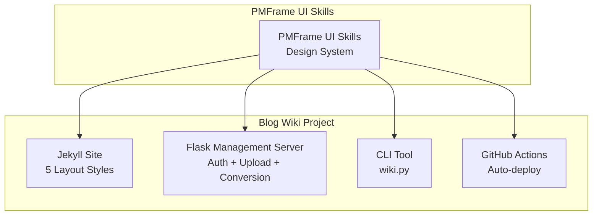
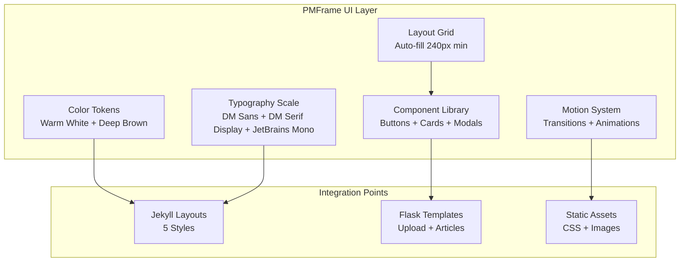
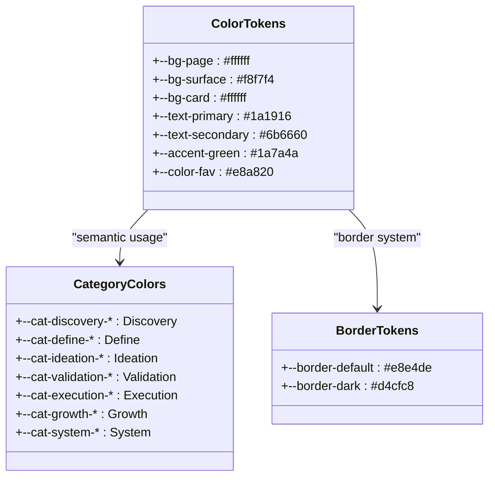
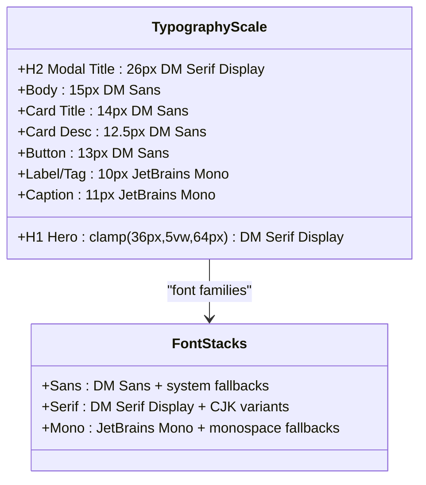
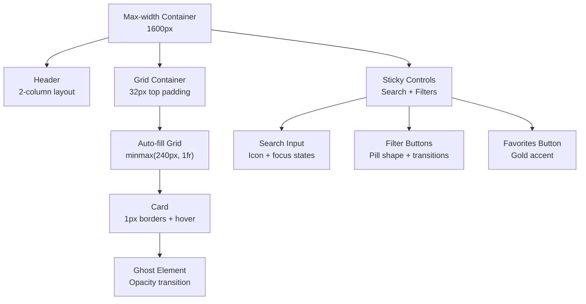
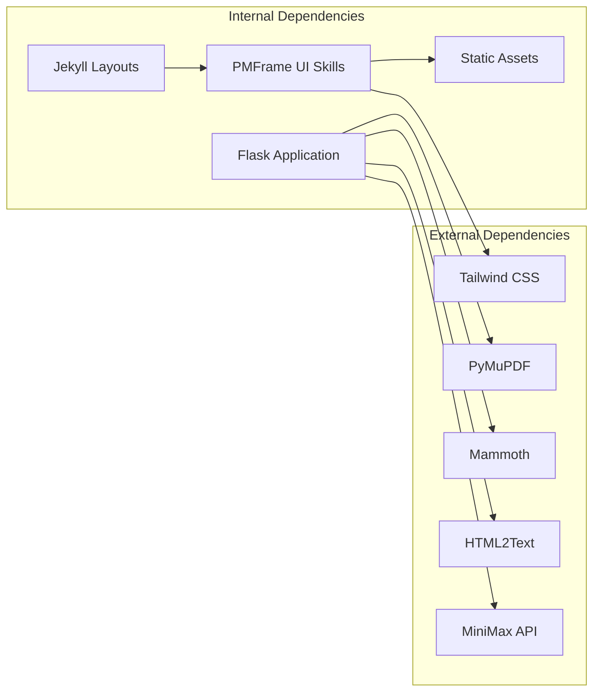

# PMFrame UI Skills Documentation

<cite>
**Referenced Files in This Document**
- [SKILL.md](file://pola-pmframe-ui/SKILL.md)
- [PRD.md](file://PRD.md)
- [_config.yml](file://_config.yml)
- [requirements.txt](file://requirements.txt)
- [wiki.py](file://wiki.py)
- [app/__init__.py](file://app/__init__.py)
- [app/auth.py](file://app/auth.py)
- [app/converter.py](file://app/converter.py)
- [app/uploader.py](file://app/uploader.py)
- [app/mailer.py](file://app/mailer.py)
- [_layouts/deep-technical.html](file://_layouts/deep-technical.html)
- [_layouts/academic-insight.html](file://_layouts/academic-insight.html)
- [_layouts/industry-vision.html](file://_layouts/industry-vision.html)
- [_layouts/friendly-explainer.html](file://_layouts/friendly-explainer.html)
- [_layouts/creative-visual.html](file://_layouts/creative-visual.html)
</cite>

## Table of Contents
1. [Introduction](#introduction)
2. [Project Structure](#project-structure)
3. [Core Components](#core-components)
4. [Architecture Overview](#architecture-overview)
5. [Detailed Component Analysis](#detailed-component-analysis)
6. [Dependency Analysis](#dependency-analysis)
7. [Performance Considerations](#performance-considerations)
8. [Troubleshooting Guide](#troubleshooting-guide)
9. [Conclusion](#conclusion)

## Introduction
This document provides comprehensive documentation for the PMFrame UI Skills system, a design framework focused on minimal warm-white aesthetics with functional elegance. It covers the design language, layout system, component library, motion and effects, Tailwind customization, and quick-start template. The PMFrame UI is designed for tool libraries, framework collections, methodology catalogs, knowledge card indexes, and SaaS feature lists.

## Project Structure
The PMFrame UI Skills system is part of a larger personal blog wiki project built with Jekyll and a Flask management server. The UI skills documentation itself resides in a dedicated skill file, while the broader project includes:
- Jekyll layouts and assets for five distinct blog styles
- A Flask application for authentication, file upload, conversion, and article management
- A CLI tool for local development and deployment
- GitHub Actions for automated deployment



**Diagram sources**
- [SKILL.md:1-758](file://pola-pmframe-ui/SKILL.md#L1-L758)
- [PRD.md:181-234](file://PRD.md#L181-L234)

**Section sources**
- [PRD.md:181-234](file://PRD.md#L181-L234)
- [SKILL.md:1-758](file://pola-pmframe-ui/SKILL.md#L1-L758)

## Core Components
The PMFrame UI Skills system is built around several core components that define its design language and implementation:

### Design Language Core Principles
The system establishes a cohesive design identity through:
- **Color System**: Warm white backgrounds (#ffffff), surface tones (#f8f7f4), and deep brown text (#1a1916)
- **Category Color System**: Seven semantic categories with coordinated background, text, and border colors
- **Typography**: DM Sans for body text, DM Serif Display for headings, JetBrains Mono for code and labels
- **Layout**: Max-width 1600px container with auto-fill grid cards (240px minimum width)

### Layout System
The layout follows a three-section structure:
- **Header**: Two-column layout with domain identifier and hero headline
- **Controls**: Sticky filter bar with search, category filters, favorites, and count
- **Grid**: Auto-fill grid with 1px visual borders creating a subtle grid effect
- **Footer**: Simple copyright and navigation

### Component Library
Key UI components include:
- Filter buttons with pill shape and hover transitions
- Search input with iconography and focus states
- Grid cards with ghost decorative elements and category badges
- Modal dialog with hero section and golden ratio content sidebar
- Header with quote block and responsive behavior

### Motion and Effects
The system employs subtle animations:
- Slide-up entrance for modals
- Gradient hover effects for brand elements
- Smooth transitions for interactive states
- Ghost element opacity changes on hover

**Section sources**
- [SKILL.md:18-200](file://pola-pmframe-ui/SKILL.md#L18-L200)
- [SKILL.md:203-493](file://pola-pmframe-ui/SKILL.md#L203-L493)

## Architecture Overview
The PMFrame UI Skills integrates with the broader blog wiki architecture through shared design tokens and responsive patterns. The system supports:
- Five distinct blog styles with unified design language
- Theme switching capabilities
- Responsive breakpoints for various screen sizes
- Consistent typography and spacing scales



**Diagram sources**
- [SKILL.md:18-200](file://pola-pmframe-ui/SKILL.md#L18-L200)
- [SKILL.md:203-493](file://pola-pmframe-ui/SKILL.md#L203-L493)

**Section sources**
- [SKILL.md:18-200](file://pola-pmframe-ui/SKILL.md#L18-L200)
- [SKILL.md:203-493](file://pola-pmframe-ui/SKILL.md#L203-L493)

## Detailed Component Analysis

### Color System Implementation
The PMFrame UI establishes a comprehensive color palette with semantic meanings:



**Diagram sources**
- [SKILL.md:20-66](file://pola-pmframe-ui/SKILL.md#L20-L66)

The color system supports:
- Background hierarchy with three surface levels
- Text hierarchy with primary, secondary, and muted states
- Brand accent colors for interactive elements
- Category-specific color schemes for semantic organization

**Section sources**
- [SKILL.md:20-66](file://pola-pmframe-ui/SKILL.md#L20-L66)

### Typography System
The PMFrame UI implements a sophisticated typographic scale:



**Diagram sources**
- [SKILL.md:68-107](file://pola-pmframe-ui/SKILL.md#L68-L107)

The typography system provides:
- Responsive heading scales using clamp() for optimal readability
- Distinct font stacks for different content types
- Consistent sizing and spacing relationships
- Monospace typography for technical and metadata elements

**Section sources**
- [SKILL.md:68-107](file://pola-pmframe-ui/SKILL.md#L68-L107)

### Grid Layout System
The PMFrame UI employs a flexible grid system optimized for content discovery:



**Diagram sources**
- [SKILL.md:111-199](file://pola-pmframe-ui/SKILL.md#L111-L199)

The grid system features:
- Responsive auto-fill behavior with 240px minimum column width
- 1px gap creating visual borders without structural complexity
- Sticky controls for persistent filtering
- Hover states with subtle background transitions

**Section sources**
- [SKILL.md:111-199](file://pola-pmframe-ui/SKILL.md#L111-L199)

### Component Library Deep Dive
The PMFrame UI includes several key components with consistent interaction patterns:

#### Filter Button Component
```mermaid
stateDiagram-v2
[*] --> Default
Default --> Hover : mouseenter
Hover --> Default : mouseleave
Default --> Active : click
Active --> Default : click
note right of Default
px-3.5 py-1.5
bg-white text-[#6b6660]
border #[#d4cfc8]
end note
note right of Active
px-3.5 py-1.5
bg-[#1a1916] text-white
border #[#1a1916]
end note
```

**Diagram sources**
- [SKILL.md:205-244](file://pola-pmframe-ui/SKILL.md#L205-L244)

#### Grid Card Component
The grid card implements a sophisticated hover interaction system:
- Ghost decorative element with opacity transition
- Category badge with semantic color coordination
- Hover background change with 120ms transition
- Relative positioning for overlay elements

#### Modal Dialog Component
The modal system provides a comprehensive content viewing experience:
- Hero section with category color background
- Golden ratio content-sidebar layout (1.618:1)
- Navigation controls with backdrop blur overlay
- Slide-up entrance animation

**Section sources**
- [SKILL.md:205-493](file://pola-pmframe-ui/SKILL.md#L205-L493)

### Motion and Effects System
The PMFrame UI incorporates subtle animations that enhance user experience without being distracting:

```mermaid
sequenceDiagram
participant User as User Interaction
participant Component as UI Component
participant Animation as Motion System
participant Visual as Visual Feedback
User->>Component : Hover/Clik/Enter
Component->>Animation : Trigger animation
Animation->>Visual : Apply CSS transforms
Visual-->>User : Smooth transition feedback
Note over Animation,Visual
slideUp : Modal entrance
pmf-gradient : Brand hover effect
hintFade : Tooltip fade
end note
```

**Diagram sources**
- [SKILL.md:497-557](file://pola-pmframe-ui/SKILL.md#L497-L557)

The motion system includes:
- Keyframe animations for modal entrances
- Gradient animations for brand elements
- Transition timing consistent with interaction feedback
- Performance-optimized CSS animations

**Section sources**
- [SKILL.md:497-557](file://pola-pmframe-ui/SKILL.md#L497-L557)

## Dependency Analysis
The PMFrame UI Skills system interacts with several project dependencies and external systems:



**Diagram sources**
- [requirements.txt:1-8](file://requirements.txt#L1-L8)
- [app/converter.py:1-146](file://app/converter.py#L1-L146)
- [app/uploader.py:185-201](file://app/uploader.py#L185-L201)

The dependency relationships show:
- PMFrame UI relies on Tailwind CSS for utility classes
- File conversion depends on specialized Python libraries
- LLM integration requires external API access
- Jekyll layouts consume the design tokens

**Section sources**
- [requirements.txt:1-8](file://requirements.txt#L1-L8)
- [app/converter.py:1-146](file://app/converter.py#L1-L146)
- [app/uploader.py:185-201](file://app/uploader.py#L185-L201)

## Performance Considerations
The PMFrame UI is designed with performance in mind through several optimization strategies:

- **Minimal JavaScript**: Pure CSS transitions and animations reduce runtime overhead
- **Efficient Grid System**: CSS Grid with auto-fill provides excellent browser performance
- **Optimized Typography**: System font stacks avoid web font loading delays
- **Selective Animations**: Only interactive states receive motion effects
- **Responsive Design**: Mobile-first approach reduces unnecessary rendering

## Troubleshooting Guide
Common issues and solutions when working with the PMFrame UI Skills system:

### Color Token Issues
- **Problem**: Colors not displaying correctly in components
- **Solution**: Verify CSS custom properties are properly defined and imported
- **Check**: Ensure `--bg-page`, `--text-primary`, and category color variables are available

### Typography Problems
- **Problem**: Fonts not loading or displaying incorrectly
- **Solution**: Confirm font stack availability and system fallbacks
- **Check**: Verify DM Sans, DM Serif Display, and JetBrains Mono are accessible

### Grid Layout Issues
- **Problem**: Cards not aligning properly in grid
- **Solution**: Ensure consistent padding and border values
- **Check**: Verify 1px gap creates proper visual borders without structural complexity

### Component State Issues
- **Problem**: Interactive states not responding
- **Solution**: Verify transition durations and hover states are properly configured
- **Check**: Ensure CSS transitions are not being overridden by specificity conflicts

**Section sources**
- [SKILL.md:20-66](file://pola-pmframe-ui/SKILL.md#L20-L66)
- [SKILL.md:68-107](file://pola-pmframe-ui/SKILL.md#L68-L107)
- [SKILL.md:111-199](file://pola-pmframe-ui/SKILL.md#L111-L199)

## Conclusion
The PMFrame UI Skills system provides a comprehensive design framework that balances aesthetic appeal with functional usability. Its warm minimal approach, combined with thoughtful typography and responsive grid systems, creates an ideal foundation for knowledge-intensive applications. The system's integration with the broader blog wiki project demonstrates how design systems can scale across multiple contexts while maintaining consistency and performance.

The PMFrame UI's emphasis on subtle interactions, semantic color coding, and accessible typography makes it particularly suitable for educational and knowledge-sharing platforms. Its modular component library and motion system provide developers with clear patterns for building consistent user experiences across different content types and interaction scenarios.