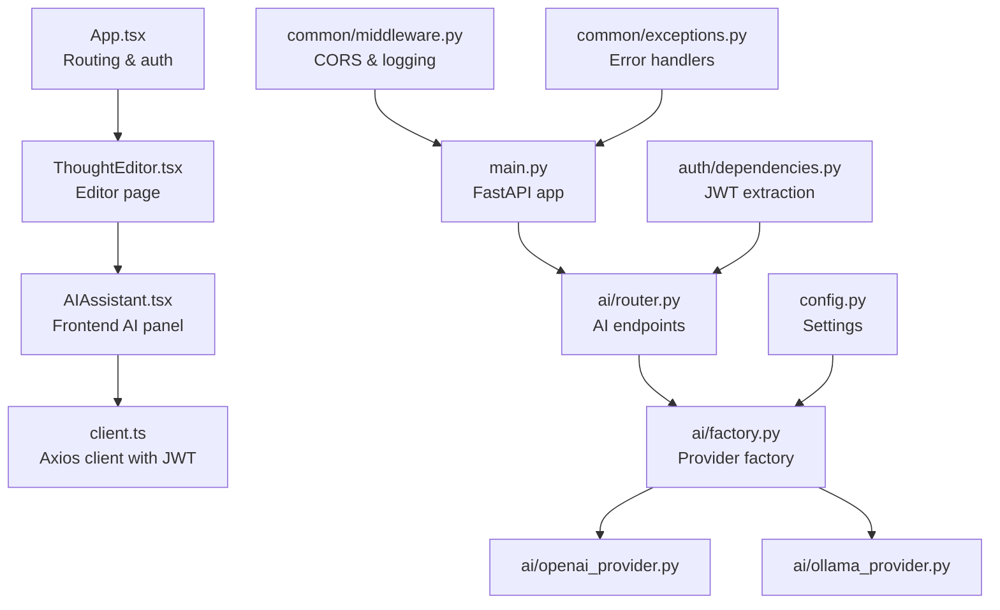
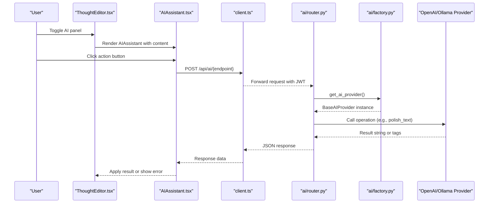
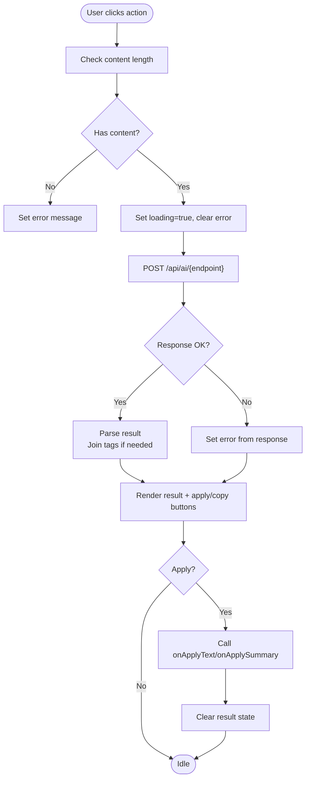
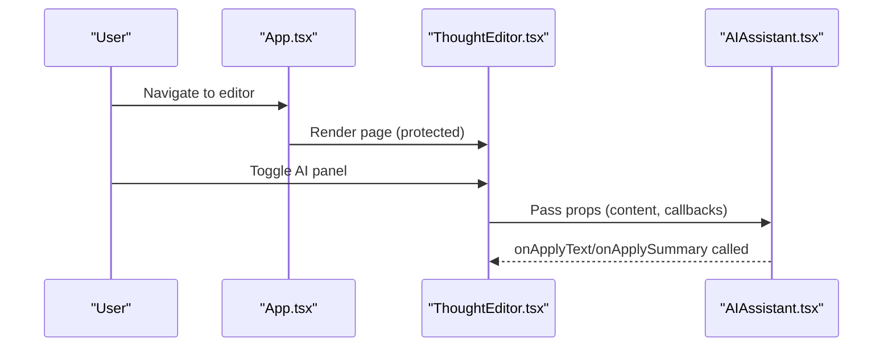
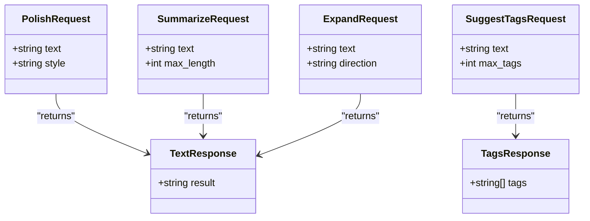
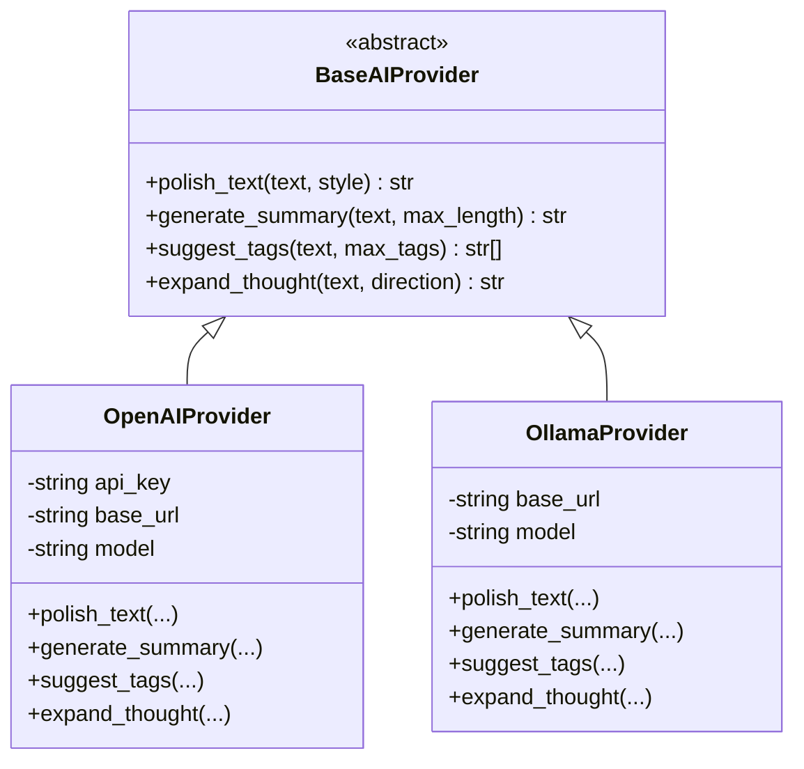
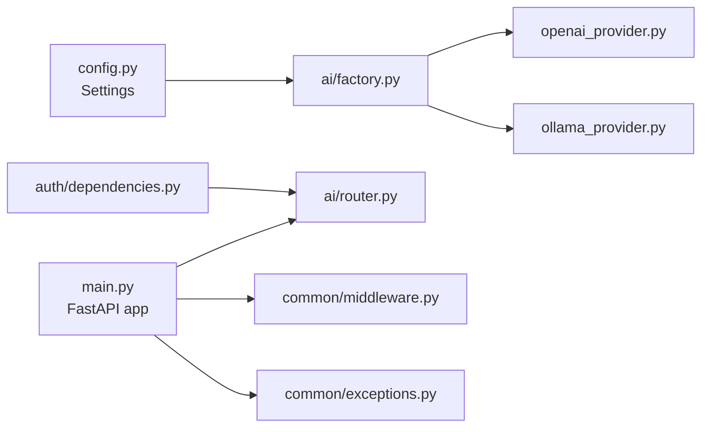
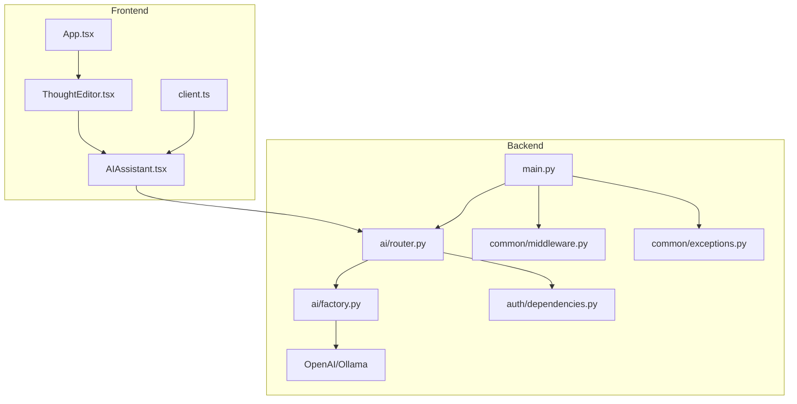

# AI Assistant Integration

<cite>
**Referenced Files in This Document**
- [AIAssistant.tsx](file://frontend/src/components/AIAssistant.tsx)
- [ThoughtEditor.tsx](file://frontend/src/pages/ThoughtEditor.tsx)
- [client.ts](file://frontend/src/api/client.ts)
- [App.tsx](file://frontend/src/App.tsx)
- [router.py](file://backend/app/ai/router.py)
- [factory.py](file://backend/app/ai/factory.py)
- [base_provider.py](file://backend/app/ai/base_provider.py)
- [openai_provider.py](file://backend/app/ai/openai_provider.py)
- [ollama_provider.py](file://backend/app/ai/ollama_provider.py)
- [config.py](file://backend/app/config.py)
- [main.py](file://backend/app/main.py)
- [dependencies.py](file://backend/app/auth/dependencies.py)
- [middleware.py](file://backend/app/common/middleware.py)
- [exceptions.py](file://backend/app/common/exceptions.py)
</cite>

## Table of Contents
1. [Introduction](#introduction)
2. [Project Structure](#project-structure)
3. [Core Components](#core-components)
4. [Architecture Overview](#architecture-overview)
5. [Detailed Component Analysis](#detailed-component-analysis)
6. [Dependency Analysis](#dependency-analysis)
7. [Performance Considerations](#performance-considerations)
8. [Troubleshooting Guide](#troubleshooting-guide)
9. [Conclusion](#conclusion)

## Introduction
This document explains the AI assistant integration for the PolaZhenJing application. It covers the frontend AI assistant component, user interface design, and interaction patterns; the backend AI endpoints and provider abstraction; real-time response handling; conversation flow and message formatting; state management, loading states, and error handling; provider selection and request/response formatting; content generation workflows; user experience considerations; accessibility features; performance optimization; and troubleshooting techniques for AI integrations.

## Project Structure
The AI assistant spans both frontend and backend:
- Frontend: AIAssistant panel component, ThoughtEditor page integration, and HTTP client with JWT handling.
- Backend: AI endpoints, provider factory, abstract provider interface, concrete providers (OpenAI-compatible and Ollama), configuration, and application wiring.

**Diagram sources**
- [AIAssistant.tsx:1-146](file://frontend/src/components/AIAssistant.tsx#L1-L146)
- [client.ts:1-63](file://frontend/src/api/client.ts#L1-L63)
- [ThoughtEditor.tsx:1-221](file://frontend/src/pages/ThoughtEditor.tsx#L1-L221)
- [App.tsx:1-95](file://frontend/src/App.tsx#L1-L95)
- [router.py:1-109](file://backend/app/ai/router.py#L1-L109)
- [factory.py:1-45](file://backend/app/ai/factory.py#L1-L45)
- [openai_provider.py:1-106](file://backend/app/ai/openai_provider.py#L1-L106)
- [ollama_provider.py:1-99](file://backend/app/ai/ollama_provider.py#L1-L99)
- [config.py:1-62](file://backend/app/config.py#L1-L62)
- [main.py:1-89](file://backend/app/main.py#L1-L89)
- [dependencies.py:1-67](file://backend/app/auth/dependencies.py#L1-L67)
- [middleware.py:1-59](file://backend/app/common/middleware.py#L1-L59)
- [exceptions.py:1-87](file://backend/app/common/exceptions.py#L1-L87)

**Section sources**
- [AIAssistant.tsx:1-146](file://frontend/src/components/AIAssistant.tsx#L1-L146)
- [client.ts:1-63](file://frontend/src/api/client.ts#L1-L63)
- [ThoughtEditor.tsx:1-221](file://frontend/src/pages/ThoughtEditor.tsx#L1-L221)
- [App.tsx:1-95](file://frontend/src/App.tsx#L1-L95)
- [router.py:1-109](file://backend/app/ai/router.py#L1-L109)
- [factory.py:1-45](file://backend/app/ai/factory.py#L1-L45)
- [openai_provider.py:1-106](file://backend/app/ai/openai_provider.py#L1-L106)
- [ollama_provider.py:1-99](file://backend/app/ai/ollama_provider.py#L1-L99)
- [config.py:1-62](file://backend/app/config.py#L1-L62)
- [main.py:1-89](file://backend/app/main.py#L1-L89)
- [dependencies.py:1-67](file://backend/app/auth/dependencies.py#L1-L67)
- [middleware.py:1-59](file://backend/app/common/middleware.py#L1-L59)
- [exceptions.py:1-87](file://backend/app/common/exceptions.py#L1-L87)

## Core Components
- Frontend AIAssistant component:
  - Renders action buttons (polish, summarize, suggest tags, expand).
  - Manages loading, error, and result states.
  - Calls backend endpoints via the shared Axios client.
  - Applies results back to the editor (replace content or summary).
- Backend AI endpoints:
  - Define request/response schemas and route handlers for each operation.
  - Inject current user and AI provider via FastAPI dependencies.
  - Return structured JSON responses or raise HTTP exceptions.
- Provider abstraction:
  - BaseAIProvider defines the contract for AI operations.
  - Factory selects provider based on configuration (OpenAI-compatible or Ollama).
  - Concrete providers implement prompts and payload construction.

**Section sources**
- [AIAssistant.tsx:17-49](file://frontend/src/components/AIAssistant.tsx#L17-L49)
- [router.py:26-48](file://backend/app/ai/router.py#L26-L48)
- [router.py:51-109](file://backend/app/ai/router.py#L51-L109)
- [base_provider.py:18-82](file://backend/app/ai/base_provider.py#L18-L82)
- [factory.py:19-45](file://backend/app/ai/factory.py#L19-L45)

## Architecture Overview
The AI assistant integrates the frontend and backend through a clean separation of concerns:
- Frontend triggers actions and displays results.
- Backend validates authentication, selects a provider, executes AI operations, and returns formatted responses.
- Providers encapsulate external API differences behind a unified interface.

**Diagram sources**
- [ThoughtEditor.tsx:203-211](file://frontend/src/pages/ThoughtEditor.tsx#L203-L211)
- [AIAssistant.tsx:29-49](file://frontend/src/components/AIAssistant.tsx#L29-L49)
- [client.ts:14-26](file://frontend/src/api/client.ts#L14-L26)
- [router.py:51-109](file://backend/app/ai/router.py#L51-L109)
- [factory.py:19-45](file://backend/app/ai/factory.py#L19-L45)
- [openai_provider.py:69-75](file://backend/app/ai/openai_provider.py#L69-L75)
- [ollama_provider.py:62-68](file://backend/app/ai/ollama_provider.py#L62-L68)

## Detailed Component Analysis

### Frontend: AIAssistant Component
- Responsibilities:
  - Present action buttons and icons.
  - Validate input and manage loading/error/result states.
  - Invoke backend endpoints and apply results to the editor.
- Interaction patterns:
  - Each action maps to a backend endpoint.
  - Special handling for tag suggestions (join into a comma-separated string).
  - Conditional apply buttons based on action type.
- State management:
  - Local state tracks result, loading, error, and active action.
  - Clears result after applying to editor.
- Accessibility and UX:
  - Disabled states during loading.
  - Clear error messages.
  - Copy-to-clipboard support.

**Diagram sources**
- [AIAssistant.tsx:29-49](file://frontend/src/components/AIAssistant.tsx#L29-L49)

**Section sources**
- [AIAssistant.tsx:17-49](file://frontend/src/components/AIAssistant.tsx#L17-L49)
- [AIAssistant.tsx:58-142](file://frontend/src/components/AIAssistant.tsx#L58-L142)

### Frontend: ThoughtEditor Integration
- Toggles the AI panel visibility.
- Passes current content and callbacks to apply results.
- Integrates with the global routing and authentication protection.

**Diagram sources**
- [App.tsx:55-79](file://frontend/src/App.tsx#L55-L79)
- [ThoughtEditor.tsx:203-211](file://frontend/src/pages/ThoughtEditor.tsx#L203-L211)
- [AIAssistant.tsx:17-21](file://frontend/src/components/AIAssistant.tsx#L17-L21)

**Section sources**
- [ThoughtEditor.tsx:203-211](file://frontend/src/pages/ThoughtEditor.tsx#L203-L211)
- [App.tsx:55-79](file://frontend/src/App.tsx#L55-L79)

### Backend: AI Endpoints and Schemas
- Endpoints:
  - POST /api/ai/polish
  - POST /api/ai/summarize
  - POST /api/ai/suggest-tags
  - POST /api/ai/expand
- Request/response models:
  - Request bodies validated with Pydantic.
  - Responses return structured JSON (TextResponse or TagsResponse).
- Authentication:
  - Requires a valid access token via dependency injection.

**Diagram sources**
- [router.py:27-48](file://backend/app/ai/router.py#L27-L48)

**Section sources**
- [router.py:26-48](file://backend/app/ai/router.py#L26-L48)
- [router.py:51-109](file://backend/app/ai/router.py#L51-L109)
- [dependencies.py:28-52](file://backend/app/auth/dependencies.py#L28-L52)

### Backend: Provider Abstraction and Factory
- BaseAIProvider defines the contract for:
  - polish_text
  - generate_summary
  - suggest_tags
  - expand_thought
- Factory:
  - Selects provider based on settings.AI_PROVIDER.
  - Supports "openai" and "ollama".
  - Caches a singleton provider instance.
- Concrete providers:
  - OpenAIProvider: calls chat completions endpoint with configurable base URL and model.
  - OllamaProvider: calls local /api/chat endpoint with configurable base URL and model.

**Diagram sources**
- [base_provider.py:18-82](file://backend/app/ai/base_provider.py#L18-L82)
- [openai_provider.py:25-106](file://backend/app/ai/openai_provider.py#L25-L106)
- [ollama_provider.py:23-99](file://backend/app/ai/ollama_provider.py#L23-L99)

**Section sources**
- [base_provider.py:18-82](file://backend/app/ai/base_provider.py#L18-L82)
- [factory.py:19-45](file://backend/app/ai/factory.py#L19-L45)
- [openai_provider.py:25-106](file://backend/app/ai/openai_provider.py#L25-L106)
- [ollama_provider.py:23-99](file://backend/app/ai/ollama_provider.py#L23-L99)

### Backend: Configuration and Application Wiring
- Configuration:
  - AI provider selection and credentials/models for OpenAI-compatible and Ollama.
- Application:
  - Registers middleware (CORS, logging).
  - Registers exception handlers.
  - Includes AI router and other routers.
- Authentication:
  - Validates JWT and ensures user is active.

**Diagram sources**
- [config.py:44-50](file://backend/app/config.py#L44-L50)
- [factory.py:19-45](file://backend/app/ai/factory.py#L19-L45)
- [main.py:41-72](file://backend/app/main.py#L41-L72)
- [middleware.py:22-58](file://backend/app/common/middleware.py#L22-L58)
- [exceptions.py:66-87](file://backend/app/common/exceptions.py#L66-L87)
- [dependencies.py:28-52](file://backend/app/auth/dependencies.py#L28-L52)

**Section sources**
- [config.py:44-50](file://backend/app/config.py#L44-L50)
- [main.py:41-72](file://backend/app/main.py#L41-L72)
- [middleware.py:22-58](file://backend/app/common/middleware.py#L22-L58)
- [exceptions.py:66-87](file://backend/app/common/exceptions.py#L66-L87)
- [dependencies.py:28-52](file://backend/app/auth/dependencies.py#L28-L52)

## Dependency Analysis
- Frontend:
  - AIAssistant depends on the shared HTTP client and editor callbacks.
  - ThoughtEditor orchestrates rendering and state for the AI panel.
- Backend:
  - AI endpoints depend on authentication and provider factory.
  - Factory depends on configuration and provider implementations.
  - Application wiring registers routers and middleware.

**Diagram sources**
- [client.ts:14-26](file://frontend/src/api/client.ts#L14-L26)
- [AIAssistant.tsx:13-15](file://frontend/src/components/AIAssistant.tsx#L13-L15)
- [ThoughtEditor.tsx:203-211](file://frontend/src/pages/ThoughtEditor.tsx#L203-L211)
- [App.tsx:55-79](file://frontend/src/App.tsx#L55-L79)
- [router.py:18-20](file://backend/app/ai/router.py#L18-L20)
- [factory.py:16-17](file://backend/app/ai/factory.py#L16-L17)
- [main.py:60-72](file://backend/app/main.py#L60-L72)
- [dependencies.py:19-22](file://backend/app/auth/dependencies.py#L19-L22)
- [middleware.py:22-36](file://backend/app/common/middleware.py#L22-L36)
- [exceptions.py:66-87](file://backend/app/common/exceptions.py#L66-L87)

**Section sources**
- [client.ts:14-26](file://frontend/src/api/client.ts#L14-L26)
- [AIAssistant.tsx:13-15](file://frontend/src/components/AIAssistant.tsx#L13-L15)
- [router.py:18-20](file://backend/app/ai/router.py#L18-L20)
- [factory.py:16-17](file://backend/app/ai/factory.py#L16-L17)
- [main.py:60-72](file://backend/app/main.py#L60-L72)
- [dependencies.py:19-22](file://backend/app/auth/dependencies.py#L19-L22)

## Performance Considerations
- Streaming: Current implementation does not use streaming. If latency is a concern, consider enabling streaming in provider clients and updating the frontend to render incremental chunks.
- Timeout tuning: Provider clients define timeouts suitable for typical LLM calls; adjust based on provider and network conditions.
- Caching: Provider instances are cached via a singleton factory to avoid repeated initialization overhead.
- Network efficiency: Minimize redundant requests by disabling buttons during loading and validating input before calling endpoints.
- UI responsiveness: Keep rendering lightweight; defer heavy operations off the main thread if needed.

[No sources needed since this section provides general guidance]

## Troubleshooting Guide
- Authentication failures:
  - Symptom: 401 responses leading to login redirection.
  - Cause: Missing or invalid access token; refresh token failure.
  - Fix: Ensure tokens are present and valid; verify refresh endpoint availability.
- AI service unavailability:
  - Symptom: HTTP 502 responses from AI endpoints.
  - Cause: Provider API errors or timeouts.
  - Fix: Check provider configuration, base URL, and model; verify network connectivity.
- Tag parsing errors:
  - Symptom: Empty tag lists or warnings about JSON parsing.
  - Cause: Provider returned non-JSON response for tag suggestion.
  - Fix: Adjust provider prompt to enforce JSON output; validate provider compatibility.
- CORS issues:
  - Symptom: Blocked requests from frontend origin.
  - Cause: Origin not included in allowed list.
  - Fix: Update CORS_ORIGINS in settings to include frontend origin.
- Input validation:
  - Symptom: Bad request errors for endpoint payloads.
  - Cause: Missing or invalid fields in request body.
  - Fix: Ensure content exists and respects field constraints (e.g., minimum length, bounds).

**Section sources**
- [client.ts:28-60](file://frontend/src/api/client.ts#L28-L60)
- [router.py:61-63](file://backend/app/ai/router.py#L61-L63)
- [router.py:77-79](file://backend/app/ai/router.py#L77-L79)
- [router.py:92-94](file://backend/app/ai/router.py#L92-L94)
- [openai_provider.py:91-97](file://backend/app/ai/openai_provider.py#L91-L97)
- [ollama_provider.py:84-90](file://backend/app/ai/ollama_provider.py#L84-L90)
- [middleware.py:22-36](file://backend/app/common/middleware.py#L22-L36)
- [router.py:27-41](file://backend/app/ai/router.py#L27-L41)

## Conclusion
The AI assistant integration cleanly separates frontend and backend concerns, with a robust provider abstraction and clear request/response contracts. The UI provides immediate feedback through loading and error states, while the backend enforces authentication and delegates AI operations to pluggable providers. Extending streaming, refining prompts, and optimizing timeouts can further improve user experience and reliability.