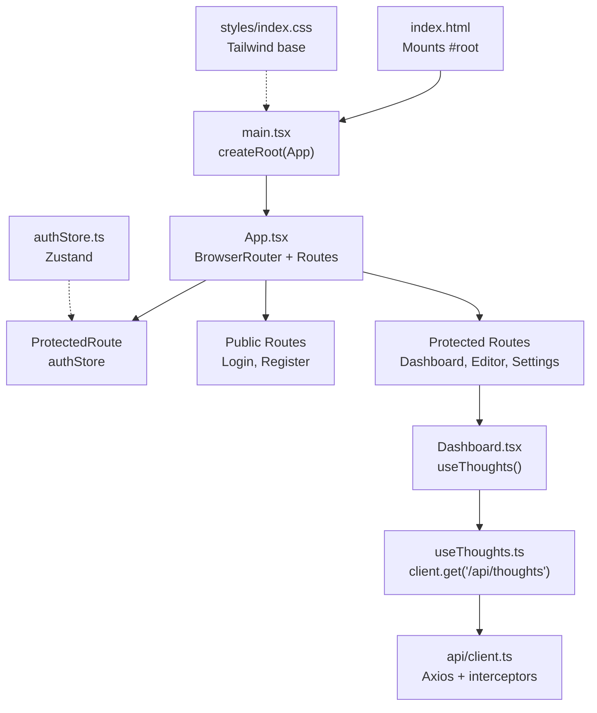
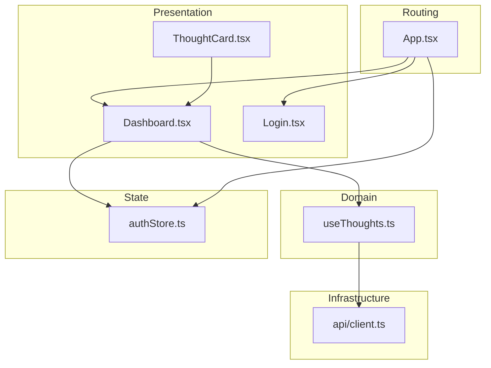
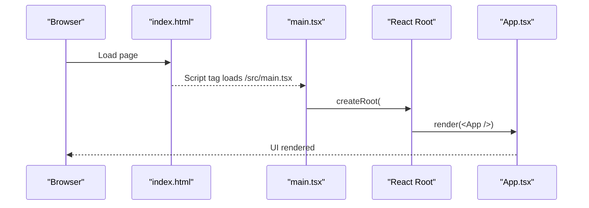
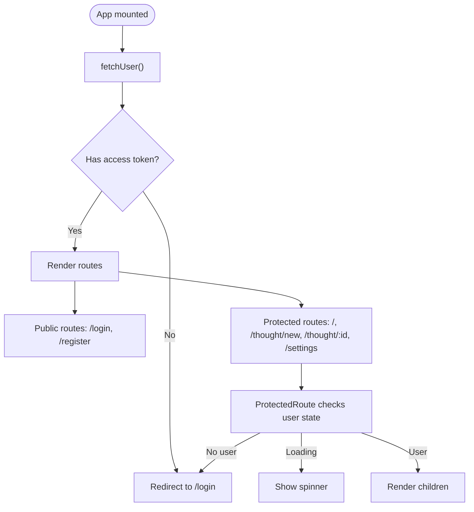
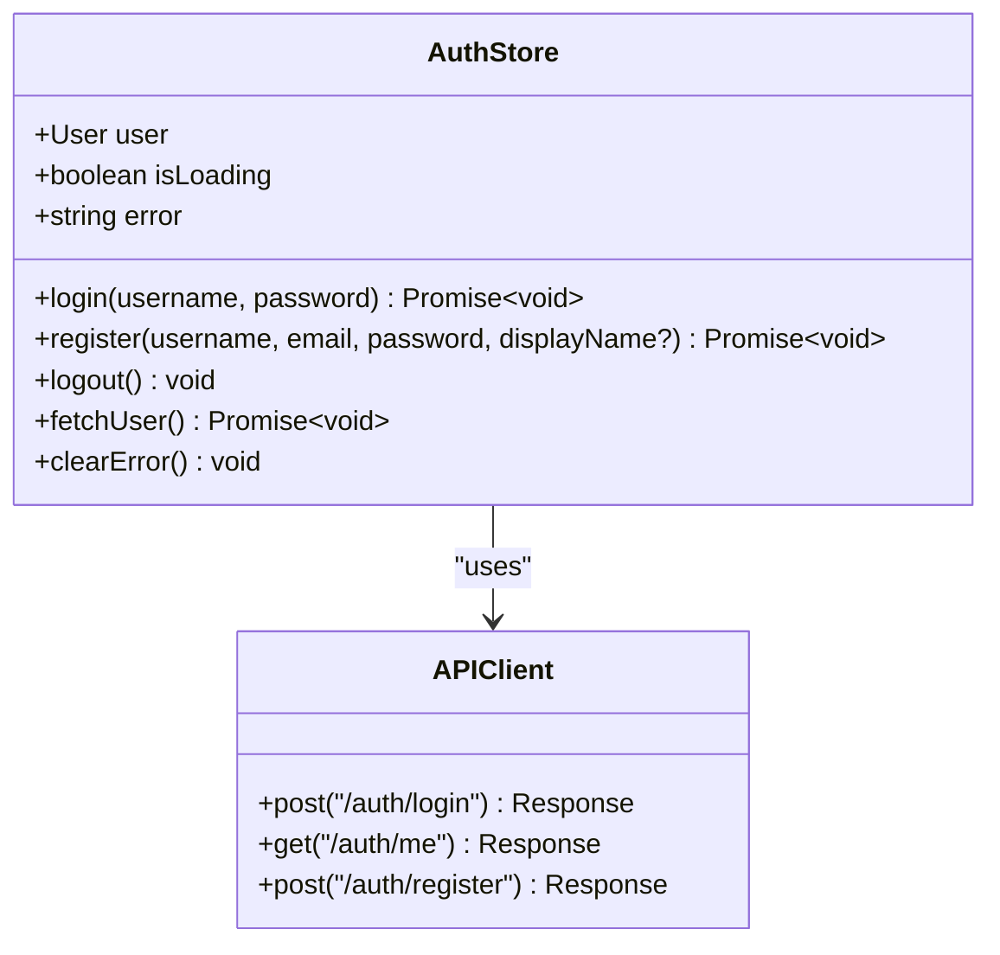
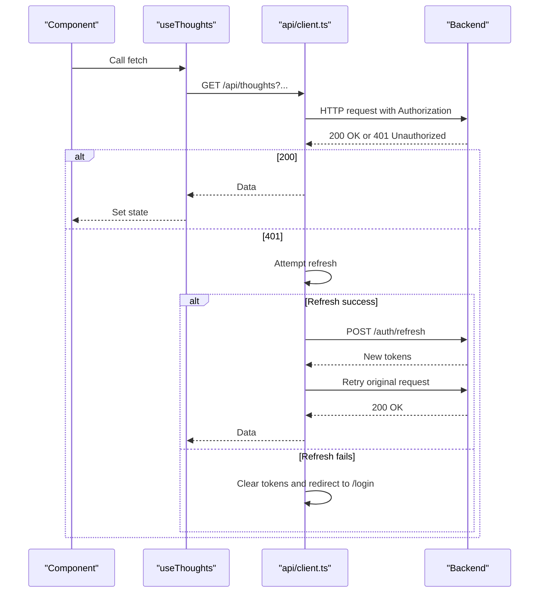
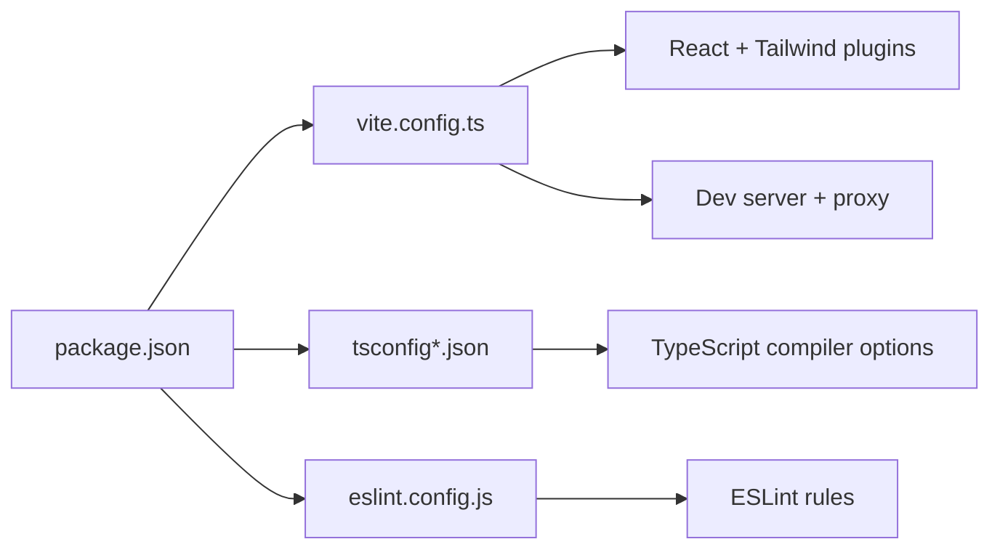

# Application Structure

<cite>
**Referenced Files in This Document**
- [frontend/src/main.tsx](file://frontend/src/main.tsx)
- [frontend/index.html](file://frontend/index.html)
- [frontend/src/App.tsx](file://frontend/src/App.tsx)
- [frontend/vite.config.ts](file://frontend/vite.config.ts)
- [frontend/package.json](file://frontend/package.json)
- [frontend/tsconfig.json](file://frontend/tsconfig.json)
- [frontend/tsconfig.app.json](file://frontend/tsconfig.app.json)
- [frontend/src/index.css](file://frontend/src/index.css)
- [frontend/src/stores/authStore.ts](file://frontend/src/stores/authStore.ts)
- [frontend/src/api/client.ts](file://frontend/src/api/client.ts)
- [frontend/src/hooks/useThoughts.ts](file://frontend/src/hooks/useThoughts.ts)
- [frontend/src/pages/Dashboard.tsx](file://frontend/src/pages/Dashboard.tsx)
- [frontend/src/pages/Login.tsx](file://frontend/src/pages/Login.tsx)
- [frontend/src/components/ThoughtCard.tsx](file://frontend/src/components/ThoughtCard.tsx)
- [frontend/eslint.config.js](file://frontend/eslint.config.js)
</cite>

## Table of Contents
1. [Introduction](#introduction)
2. [Project Structure](#project-structure)
3. [Core Components](#core-components)
4. [Architecture Overview](#architecture-overview)
5. [Detailed Component Analysis](#detailed-component-analysis)
6. [Dependency Analysis](#dependency-analysis)
7. [Performance Considerations](#performance-considerations)
8. [Troubleshooting Guide](#troubleshooting-guide)
9. [Conclusion](#conclusion)
10. [Appendices](#appendices)

## Introduction
This document explains the React 19 application structure, focusing on the main entry point, routing setup, component hierarchy, Vite build configuration, TypeScript setup, development server configuration, CSS architecture, global styles, component composition patterns, initialization process, error handling, performance strategies, development workflow, hot module replacement, build process, environment configuration, asset management, and production deployment preparation.

## Project Structure
The frontend is organized into a conventional React + Vite + TypeScript layout with clear separation of concerns:
- Entry point and HTML template
- Root application component with routing
- Pages and components
- State management via a lightweight store
- API client with interceptors
- Hooks for data fetching
- Global styles and Tailwind integration
- Tooling configurations for dev/build/linting

**Diagram sources**
- [frontend/index.html:1-14](file://frontend/index.html#L1-L14)
- [frontend/src/main.tsx:1-20](file://frontend/src/main.tsx#L1-L20)
- [frontend/src/App.tsx:1-95](file://frontend/src/App.tsx#L1-L95)
- [frontend/src/stores/authStore.ts:1-101](file://frontend/src/stores/authStore.ts#L1-L101)
- [frontend/src/hooks/useThoughts.ts:1-95](file://frontend/src/hooks/useThoughts.ts#L1-L95)
- [frontend/src/api/client.ts:1-63](file://frontend/src/api/client.ts#L1-L63)
- [frontend/src/index.css:1-29](file://frontend/src/index.css#L1-L29)

**Section sources**
- [frontend/index.html:1-14](file://frontend/index.html#L1-L14)
- [frontend/src/main.tsx:1-20](file://frontend/src/main.tsx#L1-L20)
- [frontend/src/App.tsx:1-95](file://frontend/src/App.tsx#L1-L95)

## Core Components
- Entry point: Initializes the React root and mounts the App component.
- Root application: Sets up routing, protected routes, and initial user hydration.
- Authentication store: Manages login, registration, logout, and user profile fetching.
- API client: Centralized HTTP client with automatic JWT injection and 401 handling.
- Data hooks: Encapsulate fetching thoughts and tags with pagination and filtering.
- Pages and components: Presentational and container components composing the UI.

Key implementation references:
- Entry point and mount: [frontend/src/main.tsx:1-20](file://frontend/src/main.tsx#L1-L20)
- Root routing and protected routes: [frontend/src/App.tsx:1-95](file://frontend/src/App.tsx#L1-L95)
- Authentication store: [frontend/src/stores/authStore.ts:1-101](file://frontend/src/stores/authStore.ts#L1-L101)
- API client with interceptors: [frontend/src/api/client.ts:1-63](file://frontend/src/api/client.ts#L1-L63)
- Thoughts data hook: [frontend/src/hooks/useThoughts.ts:1-95](file://frontend/src/hooks/useThoughts.ts#L1-L95)
- Dashboard page composition: [frontend/src/pages/Dashboard.tsx:1-166](file://frontend/src/pages/Dashboard.tsx#L1-L166)
- Thought card component: [frontend/src/components/ThoughtCard.tsx:1-75](file://frontend/src/components/ThoughtCard.tsx#L1-L75)

**Section sources**
- [frontend/src/main.tsx:1-20](file://frontend/src/main.tsx#L1-L20)
- [frontend/src/App.tsx:1-95](file://frontend/src/App.tsx#L1-L95)
- [frontend/src/stores/authStore.ts:1-101](file://frontend/src/stores/authStore.ts#L1-L101)
- [frontend/src/api/client.ts:1-63](file://frontend/src/api/client.ts#L1-L63)
- [frontend/src/hooks/useThoughts.ts:1-95](file://frontend/src/hooks/useThoughts.ts#L1-L95)
- [frontend/src/pages/Dashboard.tsx:1-166](file://frontend/src/pages/Dashboard.tsx#L1-L166)
- [frontend/src/components/ThoughtCard.tsx:1-75](file://frontend/src/components/ThoughtCard.tsx#L1-L75)

## Architecture Overview
The application follows a layered architecture:
- Presentation layer: Pages and components
- Domain layer: Hooks encapsulating data operations
- Infrastructure layer: API client and interceptors
- State layer: Zustand store for authentication
- Routing layer: React Router with protected route wrapper

**Diagram sources**
- [frontend/src/pages/Dashboard.tsx:1-166](file://frontend/src/pages/Dashboard.tsx#L1-L166)
- [frontend/src/pages/Login.tsx:1-103](file://frontend/src/pages/Login.tsx#L1-L103)
- [frontend/src/components/ThoughtCard.tsx:1-75](file://frontend/src/components/ThoughtCard.tsx#L1-L75)
- [frontend/src/hooks/useThoughts.ts:1-95](file://frontend/src/hooks/useThoughts.ts#L1-L95)
- [frontend/src/api/client.ts:1-63](file://frontend/src/api/client.ts#L1-L63)
- [frontend/src/stores/authStore.ts:1-101](file://frontend/src/stores/authStore.ts#L1-L101)
- [frontend/src/App.tsx:1-95](file://frontend/src/App.tsx#L1-L95)

## Detailed Component Analysis

### Entry Point and Initialization
- The HTML template defines the root DOM node.
- The entry script creates the React root and renders the App inside a strict mode wrapper.
- Global styles are imported before rendering.

Implementation references:
- HTML root node: [frontend/index.html:1-14](file://frontend/index.html#L1-L14)
- Root creation and render: [frontend/src/main.tsx:1-20](file://frontend/src/main.tsx#L1-L20)
- Global styles import: [frontend/src/main.tsx:12-12](file://frontend/src/main.tsx#L12-L12), [frontend/src/index.css:1-29](file://frontend/src/index.css#L1-L29)

**Diagram sources**
- [frontend/index.html:1-14](file://frontend/index.html#L1-L14)
- [frontend/src/main.tsx:1-20](file://frontend/src/main.tsx#L1-L20)
- [frontend/src/App.tsx:1-95](file://frontend/src/App.tsx#L1-L95)

**Section sources**
- [frontend/index.html:1-14](file://frontend/index.html#L1-L14)
- [frontend/src/main.tsx:1-20](file://frontend/src/main.tsx#L1-L20)
- [frontend/src/index.css:1-29](file://frontend/src/index.css#L1-L29)

### Routing and Protected Routes
- React Router sets up public and protected routes.
- A ProtectedRoute wrapper checks authentication state and redirects unauthenticated users.
- The root component hydrates user data on mount.

Implementation references:
- Routing and protected routes: [frontend/src/App.tsx:1-95](file://frontend/src/App.tsx#L1-L95)
- Protected route wrapper: [frontend/src/App.tsx:23-39](file://frontend/src/App.tsx#L23-L39)
- Initial user fetch: [frontend/src/App.tsx:44-46](file://frontend/src/App.tsx#L44-L46)

**Diagram sources**
- [frontend/src/App.tsx:1-95](file://frontend/src/App.tsx#L1-L95)
- [frontend/src/stores/authStore.ts:85-95](file://frontend/src/stores/authStore.ts#L85-L95)

**Section sources**
- [frontend/src/App.tsx:1-95](file://frontend/src/App.tsx#L1-L95)
- [frontend/src/stores/authStore.ts:1-101](file://frontend/src/stores/authStore.ts#L1-L101)

### Authentication Store (Zustand)
- Manages user, loading, and error states.
- Provides actions: login, register, logout, fetchUser, clearError.
- Persists tokens in localStorage and clears them on logout.
- Integrates with the API client for authenticated requests.

Implementation references:
- Store definition and actions: [frontend/src/stores/authStore.ts:1-101](file://frontend/src/stores/authStore.ts#L1-L101)

**Diagram sources**
- [frontend/src/stores/authStore.ts:1-101](file://frontend/src/stores/authStore.ts#L1-L101)
- [frontend/src/api/client.ts:1-63](file://frontend/src/api/client.ts#L1-L63)

**Section sources**
- [frontend/src/stores/authStore.ts:1-101](file://frontend/src/stores/authStore.ts#L1-L101)

### API Client and Interceptors
- Axios client configured with a base URL.
- Request interceptor attaches Authorization header with access token.
- Response interceptor handles 401 by attempting token refresh; otherwise redirects to login.

Implementation references:
- Client and interceptors: [frontend/src/api/client.ts:1-63](file://frontend/src/api/client.ts#L1-L63)

**Diagram sources**
- [frontend/src/api/client.ts:1-63](file://frontend/src/api/client.ts#L1-L63)
- [frontend/src/hooks/useThoughts.ts:51-71](file://frontend/src/hooks/useThoughts.ts#L51-L71)

**Section sources**
- [frontend/src/api/client.ts:1-63](file://frontend/src/api/client.ts#L1-L63)
- [frontend/src/hooks/useThoughts.ts:1-95](file://frontend/src/hooks/useThoughts.ts#L1-L95)

### Data Hooks: useThoughts
- Encapsulates fetching thoughts with optional filters (search, status, page, page_size).
- Returns loading, error, total count, and thought items.
- Provides a refresh function to re-fetch data.

Implementation references:
- Hook implementation: [frontend/src/hooks/useThoughts.ts:1-95](file://frontend/src/hooks/useThoughts.ts#L1-L95)

**Section sources**
- [frontend/src/hooks/useThoughts.ts:1-95](file://frontend/src/hooks/useThoughts.ts#L1-L95)

### Dashboard Page Composition
- Renders top navigation, toolbar (search, filters, new thought), error/loading states, thought list, and pagination.
- Uses ThoughtCard for individual items and integrates with the thoughts hook.

Implementation references:
- Dashboard page: [frontend/src/pages/Dashboard.tsx:1-166](file://frontend/src/pages/Dashboard.tsx#L1-L166)
- Thought card component: [frontend/src/components/ThoughtCard.tsx:1-75](file://frontend/src/components/ThoughtCard.tsx#L1-L75)

**Section sources**
- [frontend/src/pages/Dashboard.tsx:1-166](file://frontend/src/pages/Dashboard.tsx#L1-L166)
- [frontend/src/components/ThoughtCard.tsx:1-75](file://frontend/src/components/ThoughtCard.tsx#L1-L75)

### Login Page
- Form for username/email and password.
- Uses the auth store for login action and navigation after success.

Implementation references:
- Login page: [frontend/src/pages/Login.tsx:1-103](file://frontend/src/pages/Login.tsx#L1-L103)
- Auth store: [frontend/src/stores/authStore.ts:1-101](file://frontend/src/stores/authStore.ts#L1-L101)

**Section sources**
- [frontend/src/pages/Login.tsx:1-103](file://frontend/src/pages/Login.tsx#L1-L103)
- [frontend/src/stores/authStore.ts:1-101](file://frontend/src/stores/authStore.ts#L1-L101)

## Dependency Analysis
- Build and toolchain: Vite, React plugin, Tailwind CSS plugin.
- Runtime dependencies: React 19, React Router, Axios, Lucide icons, React Markdown, Zustand.
- Dev dependencies: TypeScript, ESLint, React Refresh plugin, Tailwind CSS.

Implementation references:
- Scripts and dependencies: [frontend/package.json:1-38](file://frontend/package.json#L1-L38)
- Vite configuration: [frontend/vite.config.ts:1-35](file://frontend/vite.config.ts#L1-L35)
- TypeScript configs: [frontend/tsconfig.json:1-8](file://frontend/tsconfig.json#L1-L8), [frontend/tsconfig.app.json:1-26](file://frontend/tsconfig.app.json#L1-L26)
- ESLint flat config: [frontend/eslint.config.js:1-24](file://frontend/eslint.config.js#L1-L24)

**Diagram sources**
- [frontend/package.json:1-38](file://frontend/package.json#L1-L38)
- [frontend/vite.config.ts:1-35](file://frontend/vite.config.ts#L1-L35)
- [frontend/tsconfig.json:1-8](file://frontend/tsconfig.json#L1-L8)
- [frontend/tsconfig.app.json:1-26](file://frontend/tsconfig.app.json#L1-L26)
- [frontend/eslint.config.js:1-24](file://frontend/eslint.config.js#L1-L24)

**Section sources**
- [frontend/package.json:1-38](file://frontend/package.json#L1-L38)
- [frontend/vite.config.ts:1-35](file://frontend/vite.config.ts#L1-L35)
- [frontend/tsconfig.json:1-8](file://frontend/tsconfig.json#L1-L8)
- [frontend/tsconfig.app.json:1-26](file://frontend/tsconfig.app.json#L1-L26)
- [frontend/eslint.config.js:1-24](file://frontend/eslint.config.js#L1-L24)

## Performance Considerations
- Lazy loading and code splitting: Consider lazy-loading heavy pages (e.g., editor) to reduce initial bundle size.
- Memoization: Use memoization for expensive computations in components and hooks.
- Virtualized lists: For large thought lists, implement virtualization to avoid rendering overhead.
- Debounced search: Debounce search input to limit frequent API calls.
- Token caching: Reuse access tokens until expiration; avoid unnecessary refresh attempts.
- Image optimization: Preprocess images and use appropriate sizes/sprites.
- Bundle analysis: Use Vite’s built-in analyzer to inspect bundle composition.
- CSS optimization: Purge unused Tailwind classes in production builds.

[No sources needed since this section provides general guidance]

## Troubleshooting Guide
Common issues and resolutions:
- 401 Unauthorized errors: The API client attempts token refresh; if it fails, the user is redirected to login. Verify token storage and refresh endpoint availability.
- Proxy configuration: Ensure the backend runs on the proxied address so Vite can forward /auth, /api, and /health requests.
- Tailwind not applying: Confirm Tailwind is enabled via the plugin and global CSS imports are present.
- ESLint errors: Run lint fixes and ensure the flat config is respected by your editor.

Implementation references:
- Interceptors and redirects: [frontend/src/api/client.ts:28-60](file://frontend/src/api/client.ts#L28-L60)
- Proxy configuration: [frontend/vite.config.ts:19-32](file://frontend/vite.config.ts#L19-L32)
- Global styles: [frontend/src/index.css:10-15](file://frontend/src/index.css#L10-L15)
- ESLint config: [frontend/eslint.config.js:1-24](file://frontend/eslint.config.js#L1-L24)

**Section sources**
- [frontend/src/api/client.ts:1-63](file://frontend/src/api/client.ts#L1-L63)
- [frontend/vite.config.ts:1-35](file://frontend/vite.config.ts#L1-L35)
- [frontend/src/index.css:1-29](file://frontend/src/index.css#L1-L29)
- [frontend/eslint.config.js:1-24](file://frontend/eslint.config.js#L1-L24)

## Conclusion
The application follows a clean, modular structure leveraging React 19, Vite, TypeScript, and Tailwind CSS. Routing is handled by React Router with a robust protected route mechanism. Authentication is centralized in a Zustand store with an Axios client featuring interceptors for seamless token management. Data fetching is encapsulated in reusable hooks, and the UI is composed of small, focused components. The development workflow benefits from fast HMR, type safety, and linting. For production, ensure proper proxying, asset optimization, and environment-specific configurations.

[No sources needed since this section summarizes without analyzing specific files]

## Appendices

### Vite Configuration Details
- Plugins: React and Tailwind CSS.
- Dev server: Host and port configuration, plus API proxy for auth, API, and health endpoints.
- Build command: TypeScript project references followed by Vite build.

Implementation references:
- Plugins and server: [frontend/vite.config.ts:14-34](file://frontend/vite.config.ts#L14-L34)
- Scripts: [frontend/package.json:6-10](file://frontend/package.json#L6-L10)

**Section sources**
- [frontend/vite.config.ts:1-35](file://frontend/vite.config.ts#L1-L35)
- [frontend/package.json:1-38](file://frontend/package.json#L1-L38)

### TypeScript Setup
- Root tsconfig references app and node configs.
- App config targets modern JS, uses bundler module resolution, JSX transform, and strict linting flags.
- Node config supports Vite’s runtime types.

Implementation references:
- Root config: [frontend/tsconfig.json:1-8](file://frontend/tsconfig.json#L1-L8)
- App config: [frontend/tsconfig.app.json:1-26](file://frontend/tsconfig.app.json#L1-L26)

**Section sources**
- [frontend/tsconfig.json:1-8](file://frontend/tsconfig.json#L1-L8)
- [frontend/tsconfig.app.json:1-26](file://frontend/tsconfig.app.json#L1-L26)

### CSS Architecture and Global Styles
- Tailwind CSS v4 is imported globally.
- Base body styles and custom scrollbar styling are applied.
- Utility-first classes compose UI components.

Implementation references:
- Global styles: [frontend/src/index.css:10-29](file://frontend/src/index.css#L10-L29)

**Section sources**
- [frontend/src/index.css:1-29](file://frontend/src/index.css#L1-L29)

### Development Workflow and Build Process
- Development: Vite dev server with HMR and proxy.
- Linting: ESLint with React Hooks and React Refresh recommended rules.
- Build: TypeScript compilation followed by Vite production build.

Implementation references:
- Scripts: [frontend/package.json:6-10](file://frontend/package.json#L6-L10)
- ESLint config: [frontend/eslint.config.js:1-24](file://frontend/eslint.config.js#L1-L24)

**Section sources**
- [frontend/package.json:1-38](file://frontend/package.json#L1-L38)
- [frontend/eslint.config.js:1-24](file://frontend/eslint.config.js#L1-L24)

### Environment Configuration and Asset Management
- Environment variables: Not explicitly configured in the provided files; use Vite’s environment variable convention.
- Assets: Public assets under the public folder; static assets referenced from index.html.
- Production deployment: Ensure backend CORS/proxy alignment and static asset serving.

[No sources needed since this section provides general guidance]