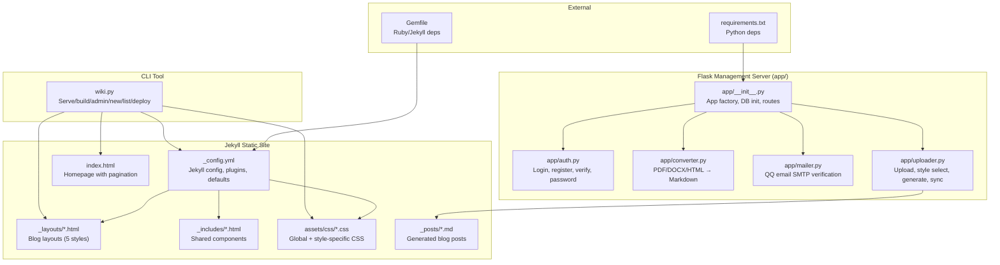
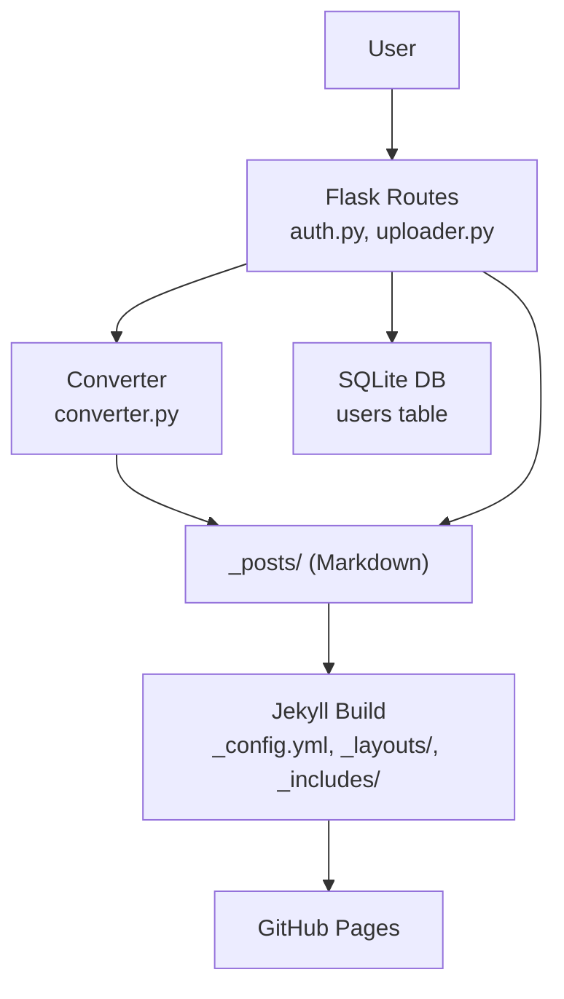
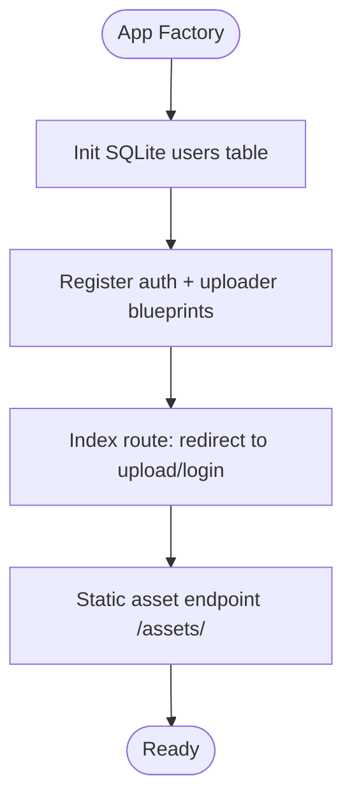
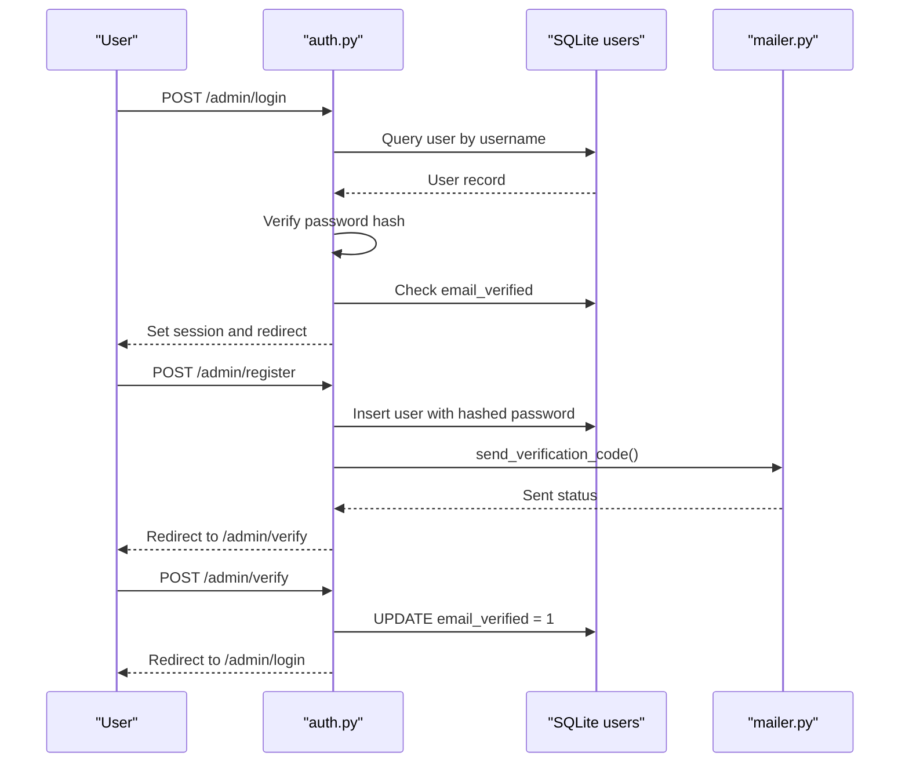
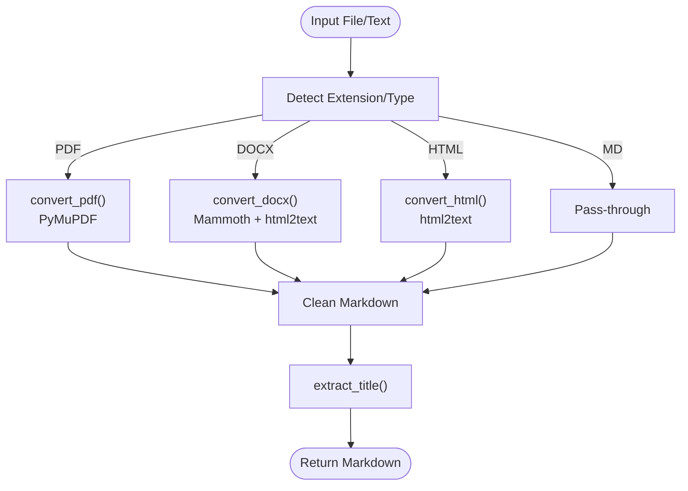
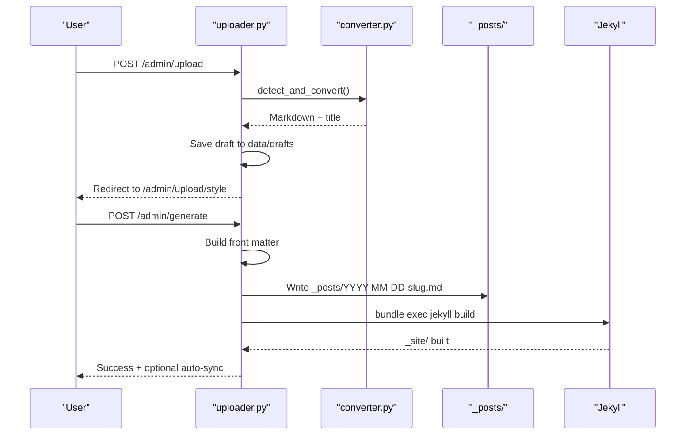
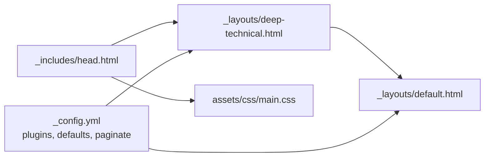
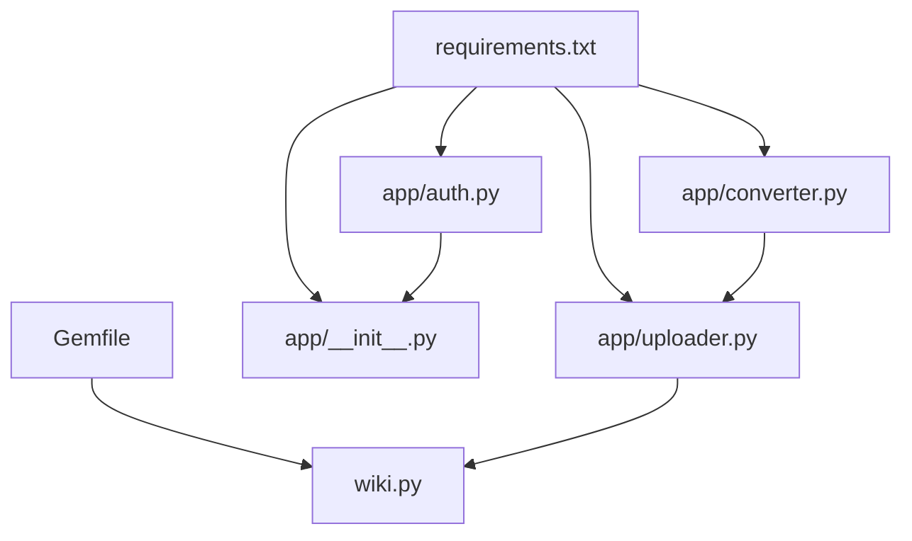

# Article Presentation System

<cite>
**Referenced Files in This Document**
- [_config.yml](file://_config.yml)
- [requirements.txt](file://requirements.txt)
- [app/__init__.py](file://app/__init__.py)
- [app/auth.py](file://app/auth.py)
- [app/converter.py](file://app/converter.py)
- [app/mailer.py](file://app/mailer.py)
- [app/uploader.py](file://app/uploader.py)
- [wiki.py](file://wiki.py)
- [Gemfile](file://Gemfile)
- [index.html](file://index.html)
- [_layouts/default.html](file://_layouts/default.html)
- [_layouts/deep-technical.html](file://_layouts/deep-technical.html)
- [_includes/head.html](file://_includes/head.html)
- [assets/css/main.css](file://assets/css/main.css)
- [PRD.md](file://PRD.md)
</cite>

## Table of Contents
1. [Introduction](#introduction)
2. [Project Structure](#project-structure)
3. [Core Components](#core-components)
4. [Architecture Overview](#architecture-overview)
5. [Detailed Component Analysis](#detailed-component-analysis)
6. [Dependency Analysis](#dependency-analysis)
7. [Performance Considerations](#performance-considerations)
8. [Troubleshooting Guide](#troubleshooting-guide)
9. [Conclusion](#conclusion)
10. [Appendices](#appendices)

## Introduction
The Article Presentation System is a lightweight personal blog wiki designed to streamline content creation and publishing. It supports multi-format article input (Markdown, PDF, Word, HTML), automatic conversion to blog-ready Markdown, flexible blog style selection (five distinct layouts), and seamless GitHub Pages publishing. The system combines a Flask-based management server for authentication, uploads, and conversions with a Jekyll-powered static site generator for blog rendering and publishing.

## Project Structure
The project is organized into two primary layers:
- Flask management server (app/): Handles authentication, file uploads, content conversion, style selection, and article management.
- Jekyll static site (root): Generates styled HTML blogs from Markdown posts, manages pagination, SEO, and theme assets.

**Diagram sources**
- [app/__init__.py:43-76](file://app/__init__.py#L43-L76)
- [app/auth.py:13-168](file://app/auth.py#L13-L168)
- [app/converter.py:1-108](file://app/converter.py#L1-L108)
- [app/mailer.py:1-53](file://app/mailer.py#L1-L53)
- [app/uploader.py:23-518](file://app/uploader.py#L23-L518)
- [_config.yml:1-50](file://_config.yml#L1-L50)
- [_layouts/default.html:1-12](file://_layouts/default.html#L1-L12)
- [_includes/head.html:1-23](file://_includes/head.html#L1-L23)
- [assets/css/main.css:1-522](file://assets/css/main.css#L1-L522)
- [Gemfile:1-7](file://Gemfile#L1-L7)
- [requirements.txt:1-8](file://requirements.txt#L1-L8)
- [wiki.py:1-165](file://wiki.py#L1-L165)

**Section sources**
- [_config.yml:1-50](file://_config.yml#L1-L50)
- [Gemfile:1-7](file://Gemfile#L1-L7)
- [requirements.txt:1-8](file://requirements.txt#L1-L8)
- [PRD.md:181-239](file://PRD.md#L181-L239)

## Core Components
- Flask Application Factory: Creates the Flask app, initializes SQLite database, registers blueprints, and serves assets.
- Authentication Module: Provides login, registration with QQ email verification, password change, and session management.
- File Converter: Converts PDF, DOCX, HTML, and Markdown into clean Markdown, extracting images and detecting titles.
- Mailer: Sends 6-digit verification codes via QQ Email SMTP.
- Uploader: Manages upload and style selection, generates front matter, writes posts to _posts/, builds Jekyll site, and syncs to GitHub.
- CLI Tool: Offers commands for local preview, building, admin server, creating posts, listing posts, and deploying.

**Section sources**
- [app/__init__.py:43-76](file://app/__init__.py#L43-L76)
- [app/auth.py:26-168](file://app/auth.py#L26-L168)
- [app/converter.py:78-108](file://app/converter.py#L78-L108)
- [app/mailer.py:8-53](file://app/mailer.py#L8-L53)
- [app/uploader.py:299-518](file://app/uploader.py#L299-L518)
- [wiki.py:35-130](file://wiki.py#L35-L130)

## Architecture Overview
The system follows a clear separation of concerns:
- Flask handles user interactions, authentication, and content ingestion.
- Converter transforms heterogeneous inputs into standardized Markdown.
- Jekyll renders styled HTML from Markdown posts with shared layouts and assets.
- GitHub Pages publishes the static site.

**Diagram sources**
- [app/auth.py:26-168](file://app/auth.py#L26-L168)
- [app/converter.py:78-108](file://app/converter.py#L78-L108)
- [app/uploader.py:299-518](file://app/uploader.py#L299-L518)
- [_config.yml:25-32](file://_config.yml#L25-L32)
- [_layouts/default.html:1-12](file://_layouts/default.html#L1-L12)
- [_includes/head.html:15-18](file://_includes/head.html#L15-L18)

## Detailed Component Analysis

### Flask Application Factory
- Initializes SQLite database with WAL mode for improved concurrency.
- Registers blueprints for authentication and uploading.
- Serves assets from the assets/ directory.
- Provides a simple index route that redirects authenticated users to the upload page.

**Diagram sources**
- [app/__init__.py:26-76](file://app/__init__.py#L26-L76)

**Section sources**
- [app/__init__.py:9-41](file://app/__init__.py#L9-L41)
- [app/__init__.py:64-76](file://app/__init__.py#L64-L76)

### Authentication System
- Login: Validates credentials against SQLite, ensures email verification, sets session.
- Registration: Validates inputs, stores hashed password, sends 6-digit verification code via QQ SMTP, marks email as verified upon successful code entry.
- Password Change: Requires current password verification and updates hash.
- Logout: Clears session.

**Diagram sources**
- [app/auth.py:26-134](file://app/auth.py#L26-L134)
- [app/mailer.py:8-53](file://app/mailer.py#L8-L53)

**Section sources**
- [app/auth.py:26-168](file://app/auth.py#L26-L168)
- [app/mailer.py:8-53](file://app/mailer.py#L8-L53)

### File Conversion Pipeline
- Detects format by extension or content and routes to appropriate converter.
- PDF: Extracts text blocks, detects headings by font size, preserves page breaks.
- DOCX: Uses Mammoth to HTML, then html2text to Markdown.
- HTML: Uses html2text to convert to Markdown.
- Markdown: Pass-through with validation.
- Extracts title from first heading or first line.

**Diagram sources**
- [app/converter.py:78-108](file://app/converter.py#L78-L108)

**Section sources**
- [app/converter.py:7-108](file://app/converter.py#L7-L108)

### Uploader and Article Generation
- Upload: Accepts file or pasted content, converts to Markdown, saves draft to data/drafts, stores draft_id in session.
- Style Selection: Renders style cards with live preview and accent colors.
- Generate: Builds front matter (layout, title, date, tags, optional description/summary), writes to _posts/, optionally auto-syncs to GitHub.
- Articles: Scans _posts/, parses front matter, renders management list.
- View/Delete: Renders individual article previews and deletes posts.

**Diagram sources**
- [app/uploader.py:299-437](file://app/uploader.py#L299-L437)
- [app/converter.py:78-108](file://app/converter.py#L78-L108)

**Section sources**
- [app/uploader.py:299-518](file://app/uploader.py#L299-L518)

### Jekyll Configuration and Styling
- Jekyll configuration enables feed, SEO, and pagination plugins, sets permalink and defaults for posts.
- Layouts define the structure for each style; shared includes provide common components.
- CSS includes global styles and style-specific styles; head.html injects style-specific CSS based on page.layout.

**Diagram sources**
- [_config.yml:19-32](file://_config.yml#L19-L32)
- [_layouts/default.html:1-12](file://_layouts/default.html#L1-L12)
- [_layouts/deep-technical.html:1-22](file://_layouts/deep-technical.html#L1-L22)
- [_includes/head.html:15-18](file://_includes/head.html#L15-L18)
- [assets/css/main.css:50-56](file://assets/css/main.css#L50-L56)

**Section sources**
- [_config.yml:19-32](file://_config.yml#L19-L32)
- [_layouts/default.html:1-12](file://_layouts/default.html#L1-L12)
- [_layouts/deep-technical.html:1-22](file://_layouts/deep-technical.html#L1-L22)
- [_includes/head.html:15-18](file://_includes/head.html#L15-L18)
- [assets/css/main.css:50-56](file://assets/css/main.css#L50-L56)

### CLI Tool (wiki.py)
- Commands: serve (Jekyll local preview), build (static site), admin (Flask server), new (create post), list (posts), deploy (git add/commit/push).
- Integrates with Jekyll and project root for seamless development and deployment workflows.

**Section sources**
- [wiki.py:35-130](file://wiki.py#L35-L130)

## Dependency Analysis
- Python dependencies: Flask, Flask-Login, PyMuPDF, Mammoth, html2text, python-dotenv, python-slugify.
- Ruby dependencies: Jekyll, jekyll-feed, jekyll-seo-tag, jekyll-paginate.
- Internal coupling:
  - uploader.py depends on converter.py and Jekyll build.
  - auth.py depends on SQLite and mailer.py.
  - app/__init__.py centralizes DB initialization and blueprint registration.

**Diagram sources**
- [requirements.txt:1-8](file://requirements.txt#L1-L8)
- [Gemfile:1-7](file://Gemfile#L1-L7)
- [app/__init__.py:43-59](file://app/__init__.py#L43-L59)
- [app/auth.py:13-13](file://app/auth.py#L13-L13)
- [app/converter.py:1-1](file://app/converter.py#L1-L1)
- [app/uploader.py:18-19](file://app/uploader.py#L18-L19)
- [wiki.py:54-60](file://wiki.py#L54-L60)

**Section sources**
- [requirements.txt:1-8](file://requirements.txt#L1-L8)
- [Gemfile:1-7](file://Gemfile#L1-L7)
- [app/__init__.py:43-59](file://app/__init__.py#L43-L59)
- [app/uploader.py:18-19](file://app/uploader.py#L18-L19)

## Performance Considerations
- SQLite with WAL mode improves concurrent reads/writes.
- Jekyll incremental build reduces rebuild time for single posts.
- Image extraction and saving occur during conversion; ensure sufficient disk space.
- PDF text extraction relies on PyMuPDF; scanned PDFs may fail extraction.
- HTML to Markdown conversion avoids line wrapping for readability.

[No sources needed since this section provides general guidance]

## Troubleshooting Guide
Common issues and resolutions:
- Authentication
  - Wrong credentials: Ensure username exists and password matches hash.
  - Unverified email: Complete QQ email verification flow.
  - Registration conflicts: Unique username/email required.
- Upload and Conversion
  - Unsupported format: Only .md, .pdf, .docx, .html accepted.
  - File too large: Limit 20MB uploads.
  - PDF extraction failures: Scanned PDFs unsupported.
  - Empty content: Provide non-empty input.
- Generation and Sync
  - Jekyll build failures: Check content validity and front matter.
  - Git configuration missing: Configure user.name and user.email.
  - Push rejected: Pull latest changes before pushing.
  - GitHub Actions build failures: Review Actions logs.

**Section sources**
- [app/auth.py:36-48](file://app/auth.py#L36-L48)
- [app/converter.py:90-91](file://app/converter.py#L90-L91)
- [app/uploader.py:310-332](file://app/uploader.py#L310-L332)
- [app/uploader.py:420-436](file://app/uploader.py#L420-L436)

## Conclusion
The Article Presentation System offers a streamlined workflow for creating, styling, and publishing blog articles. By combining Flask for management and Jekyll for rendering, it achieves simplicity, flexibility, and efficient publishing to GitHub Pages. The five blog styles enable diverse presentation while maintaining a cohesive design system.

[No sources needed since this section summarizes without analyzing specific files]

## Appendices

### User Workflow (End-to-End)

**Diagram sources**
- [PRD.md:369-381](file://PRD.md#L369-L381)
- [app/uploader.py:299-437](file://app/uploader.py#L299-L437)

### Homepage Rendering
- Jekyll index.html loops through site.posts, displaying style badges, titles, dates, descriptions, and tags via pagination.

**Section sources**
- [index.html:18-68](file://index.html#L18-L68)