# Article Presentation System

<cite>
**Referenced Files in This Document**
- [_config.yml](file://_config.yml)
- [requirements.txt](file://requirements.txt)
- [app/__init__.py](file://app/__init__.py)
- [app/auth.py](file://app/auth.py)
- [app/converter.py](file://app/converter.py)
- [app/mailer.py](file://app/mailer.py)
- [app/uploader.py](file://app/uploader.py)
- [wiki.py](file://wiki.py)
- [Gemfile](file://Gemfile)
- [index.html](file://index.html)
- [_layouts/default.html](file://_layouts/default.html)
- [_layouts/deep-technical.html](file://_layouts/deep-technical.html)
- [_layouts/academic-insight.html](file://_layouts/academic-insight.html)
- [_layouts/creative-visual.html](file://_layouts/creative-visual.html)
- [_layouts/friendly-explainer.html](file://_layouts/friendly-explainer.html)
- [_layouts/industry-vision.html](file://_layouts/industry-vision.html)
- [_layouts/literary-narrative.html](file://_layouts/literary-narrative.html)
- [_includes/head.html](file://_includes/head.html)
- [_includes/style-badge.html](file://_includes/style-badge.html)
- [assets/css/main.css](file://assets/css/main.css)
- [assets/css/academic-insight.css](file://assets/css/academic-insight.css)
- [assets/css/creative-visual.css](file://assets/css/creative-visual.css)
- [assets/css/literary-narrative.css](file://assets/css/literary-narrative.css)
- [PRD.md](file://PRD.md)
- [.baoyu-skills/baoyu-article-illustrator/EXTEND.md](file://.baoyu-skills/baoyu-article-illustrator/EXTEND.md)
</cite>

## Update Summary
**Changes Made**
- Added comprehensive documentation for the new literary-narrative layout template for narrative-driven content presentation
- Updated literary narrative style to include sophisticated ink-wash aesthetic with drop-cap typography
- Enhanced article presentation features with poetic literary elements and cultural references
- Added detailed CSS styling for literary narrative content including blockquotes and soft inline code
- Updated style system to support six distinct layouts with advanced literary content creation features

## Table of Contents
1. [Introduction](#introduction)
2. [Project Structure](#project-structure)
3. [Core Components](#core-components)
4. [Architecture Overview](#architecture-overview)
5. [Detailed Component Analysis](#detailed-component-analysis)
6. [Expanded Content Types and Styles](#expanded-content-types-and-styles)
7. [Article Illustration Skills Capabilities](#article-illustration-skills-capabilities)
8. [Dependency Analysis](#dependency-analysis)
9. [Performance Considerations](#performance-considerations)
10. [Troubleshooting Guide](#troubleshooting-guide)
11. [Conclusion](#conclusion)
12. [Appendices](#appendices)

## Introduction
The Article Presentation System is a lightweight personal blog wiki designed to streamline content creation and publishing. It supports multi-format article input (Markdown, PDF, Word, HTML), automatic conversion to blog-ready Markdown, flexible blog style selection (six distinct layouts), and seamless GitHub Pages publishing. The system combines a Flask-based management server for authentication, uploads, and conversions with a Jekyll-powered static site generator for blog rendering and publishing.

**Updated** Added comprehensive literary-narrative layout template with sophisticated ink-wash aesthetic and drop-cap typography for narrative-driven content presentation, featuring poetic literary elements and cultural references inspired by Chen Chunsheng's prose style.

## Project Structure
The project is organized into two primary layers:
- Flask management server (app/): Handles authentication, file uploads, content conversion, style selection, and article management with advanced LLM integration.
- Jekyll static site (root): Generates styled HTML blogs from Markdown posts, manages pagination, SEO, and theme assets.

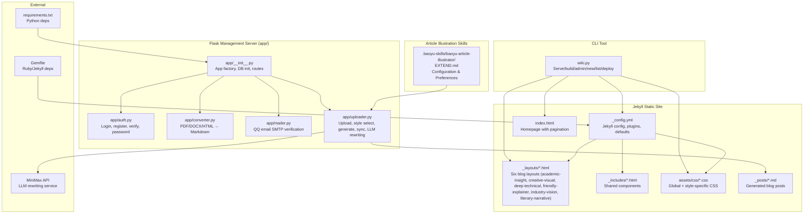

**Diagram sources**
- [app/__init__.py:43-76](file://app/__init__.py#L43-L76)
- [app/auth.py:13-168](file://app/auth.py#L13-L168)
- [app/converter.py:1-108](file://app/converter.py#L1-L108)
- [app/mailer.py:1-53](file://app/mailer.py#L1-L53)
- [app/uploader.py:23-518](file://app/uploader.py#L23-L518)
- [_config.yml:1-50](file://_config.yml#L1-L50)
- [_layouts/default.html:1-12](file://_layouts/default.html#L1-L12)
- [_includes/head.html:1-23](file://_includes/head.html#L1-L23)
- [assets/css/main.css:1-522](file://assets/css/main.css#L1-L522)
- [Gemfile:1-7](file://Gemfile#L1-L7)
- [requirements.txt:1-8](file://requirements.txt#L1-L8)
- [wiki.py:1-165](file://wiki.py#L1-L165)
- [.baoyu-skills/baoyu-article-illustrator/EXTEND.md:1-15](file://.baoyu-skills/baoyu-article-illustrator/EXTEND.md#L1-L15)

**Section sources**
- [_config.yml:1-50](file://_config.yml#L1-L50)
- [Gemfile:1-7](file://Gemfile#L1-L7)
- [requirements.txt:1-8](file://requirements.txt#L1-L8)
- [PRD.md:181-239](file://PRD.md#L181-L239)

## Core Components
- Flask Application Factory: Creates the Flask app, initializes SQLite database, registers blueprints, and serves assets.
- Authentication Module: Provides login, registration with QQ email verification, password change, and session management.
- File Converter: Converts PDF, DOCX, HTML, and Markdown into clean Markdown, extracting images and detecting titles.
- Mailer: Sends 6-digit verification codes via QQ Email SMTP.
- Uploader: Manages upload and style selection, generates front matter, writes posts to _posts/, builds Jekyll site, syncs to GitHub, and integrates LLM-based content rewriting.
- CLI Tool: Offers commands for local preview, building, admin server, creating posts, listing posts, and deploying.
- **Updated** Article Illustration Skills: Provides configuration for enhanced visual content creation with customizable preferences and output directories.

**Section sources**
- [app/__init__.py:43-76](file://app/__init__.py#L43-L76)
- [app/auth.py:26-168](file://app/auth.py#L26-L168)
- [app/converter.py:78-108](file://app/converter.py#L78-L108)
- [app/mailer.py:8-53](file://app/mailer.py#L8-L53)
- [app/uploader.py:299-518](file://app/uploader.py#L299-L518)
- [wiki.py:35-130](file://wiki.py#L35-L130)
- [.baoyu-skills/baoyu-article-illustrator/EXTEND.md:1-15](file://.baoyu-skills/baoyu-article-illustrator/EXTEND.md#L1-L15)

## Architecture Overview
The system follows a clear separation of concerns with enhanced LLM integration:
- Flask handles user interactions, authentication, and content ingestion.
- Converter transforms heterogeneous inputs into standardized Markdown.
- **Updated** LLM Rewriting Engine: Applies style-specific content enhancement using MiniMax API for literary narrative and friendly explainer styles.
- Jekyll renders styled HTML from Markdown posts with shared layouts and assets.
- GitHub Pages publishes the static site.

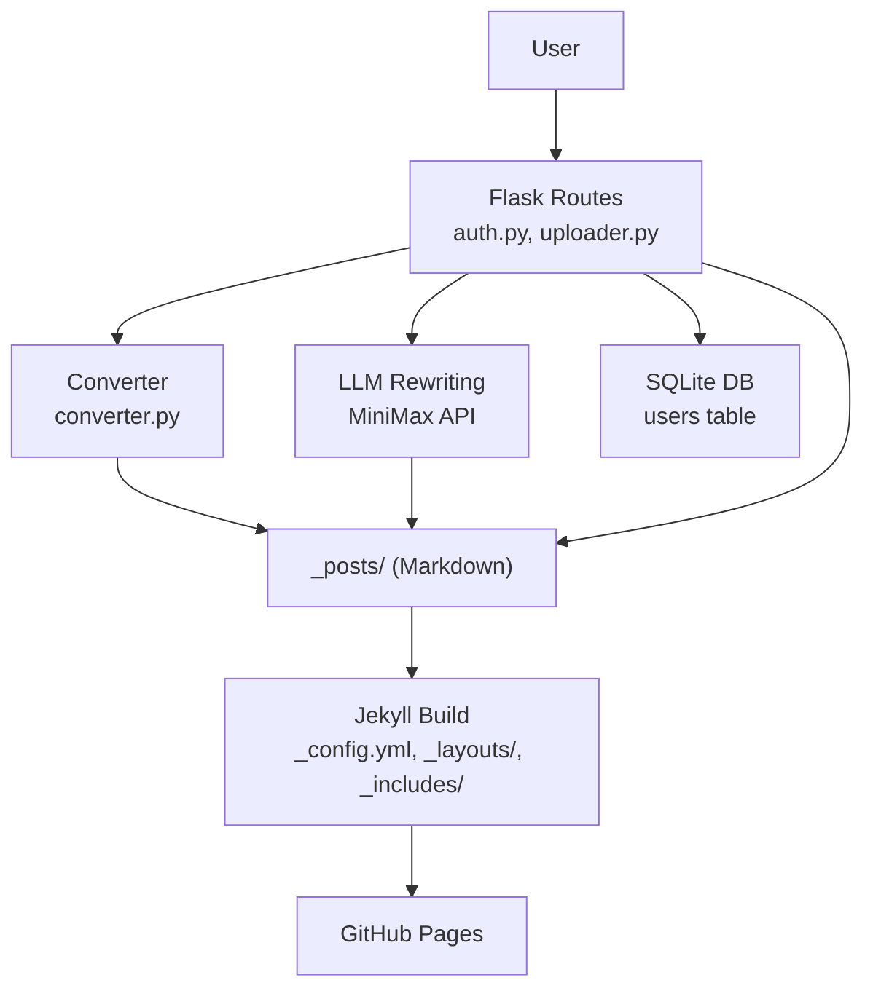

**Diagram sources**
- [app/auth.py:26-168](file://app/auth.py#L26-L168)
- [app/converter.py:78-108](file://app/converter.py#L78-L108)
- [app/uploader.py:299-518](file://app/uploader.py#L299-L518)
- [app/uploader.py:170-211](file://app/uploader.py#L170-L211)
- [_config.yml:25-32](file://_config.yml#L25-L32)
- [_layouts/default.html:1-12](file://_layouts/default.html#L1-L12)
- [_includes/head.html:15-18](file://_includes/head.html#L15-L18)

## Detailed Component Analysis

### Flask Application Factory
- Initializes SQLite database with WAL mode for improved concurrency.
- Registers blueprints for authentication and uploading.
- Serves assets from the assets/ directory.
- Provides a simple index route that redirects authenticated users to the upload page.

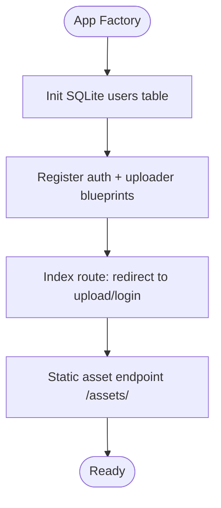

**Diagram sources**
- [app/__init__.py:26-76](file://app/__init__.py#L26-L76)

**Section sources**
- [app/__init__.py:9-41](file://app/__init__.py#L9-L41)
- [app/__init__.py:64-76](file://app/__init__.py#L64-L76)

### Authentication System
- Login: Validates credentials against SQLite, ensures email verification, sets session.
- Registration: Validates inputs, stores hashed password, sends 6-digit verification code via QQ SMTP, marks email as verified upon successful code entry.
- Password Change: Requires current password verification and updates hash.
- Logout: Clears session.

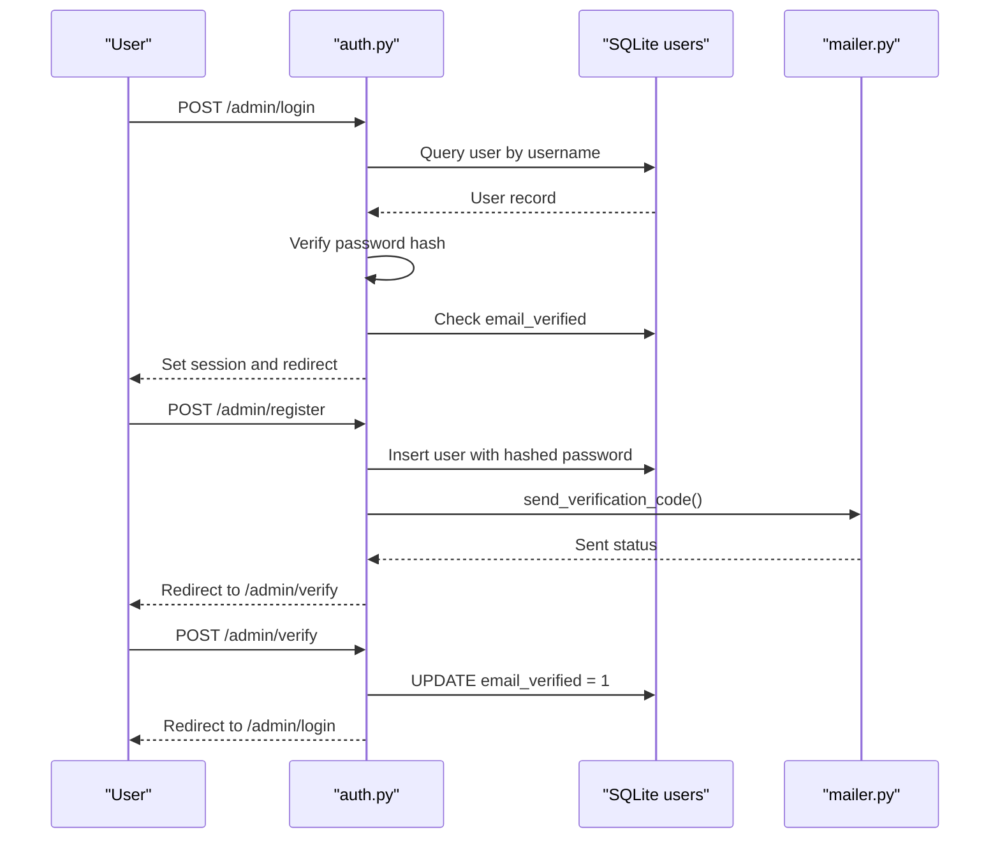

**Diagram sources**
- [app/auth.py:26-134](file://app/auth.py#L26-L134)
- [app/mailer.py:8-53](file://app/mailer.py#L8-L53)

**Section sources**
- [app/auth.py:26-168](file://app/auth.py#L26-L168)
- [app/mailer.py:8-53](file://app/mailer.py#L8-L53)

### File Conversion Pipeline
- Detects format by extension or content and routes to appropriate converter.
- PDF: Extracts text blocks, detects headings by font size, preserves page breaks.
- DOCX: Uses Mammoth to HTML, then html2text to Markdown.
- HTML: Uses html2text to convert to Markdown.
- Markdown: Pass-through with validation.
- Extracts title from first heading or first line.

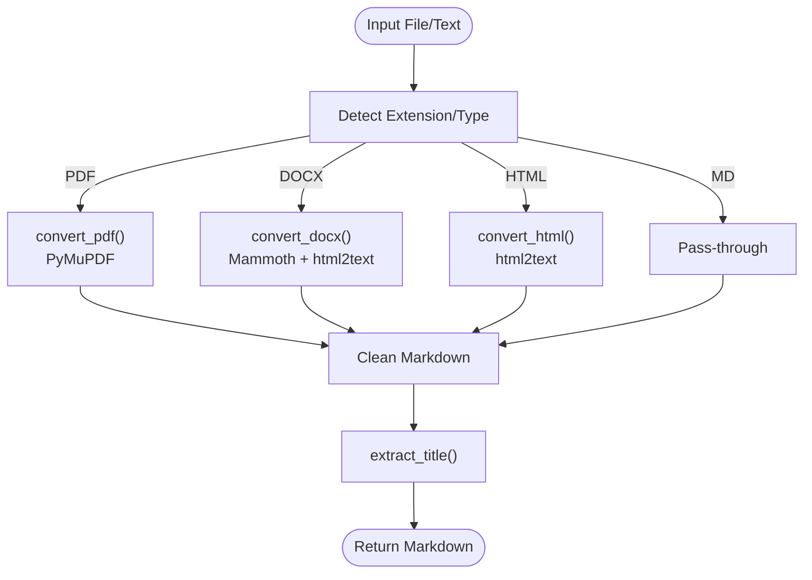

**Diagram sources**
- [app/converter.py:78-108](file://app/converter.py#L78-L108)

**Section sources**
- [app/converter.py:7-108](file://app/converter.py#L7-L108)

### Uploader and Article Generation
- Upload: Accepts file or pasted content, converts to Markdown, saves draft to data/drafts, stores draft_id in session.
- Style Selection: Renders style cards with live preview and accent colors.
- **Updated** LLM Rewriting: Applies style-specific content enhancement using MiniMax API for literary narrative and friendly explainer styles.
- Generate: Builds front matter (layout, title, date, tags, optional description/summary), writes to _posts/, optionally auto-syncs to GitHub.
- Articles: Scans _posts/, parses front matter, renders management list.
- View/Delete: Renders individual article previews and deletes posts.

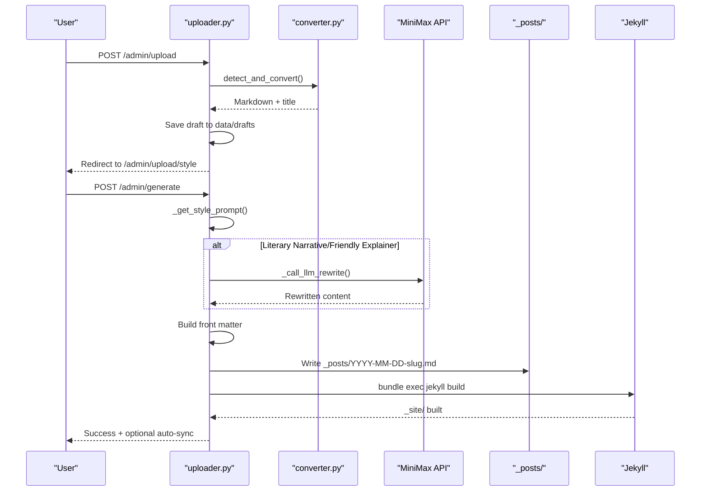

**Diagram sources**
- [app/uploader.py:299-437](file://app/uploader.py#L299-L437)
- [app/converter.py:78-108](file://app/converter.py#L78-L108)
- [app/uploader.py:170-211](file://app/uploader.py#L170-L211)

**Section sources**
- [app/uploader.py:299-518](file://app/uploader.py#L299-L518)

### Jekyll Configuration and Styling
- Jekyll configuration enables feed, SEO, and pagination plugins, sets permalink and defaults for posts.
- Layouts define the structure for each style; shared includes provide common components.
- CSS includes global styles and style-specific styles; head.html injects style-specific CSS based on page.layout.

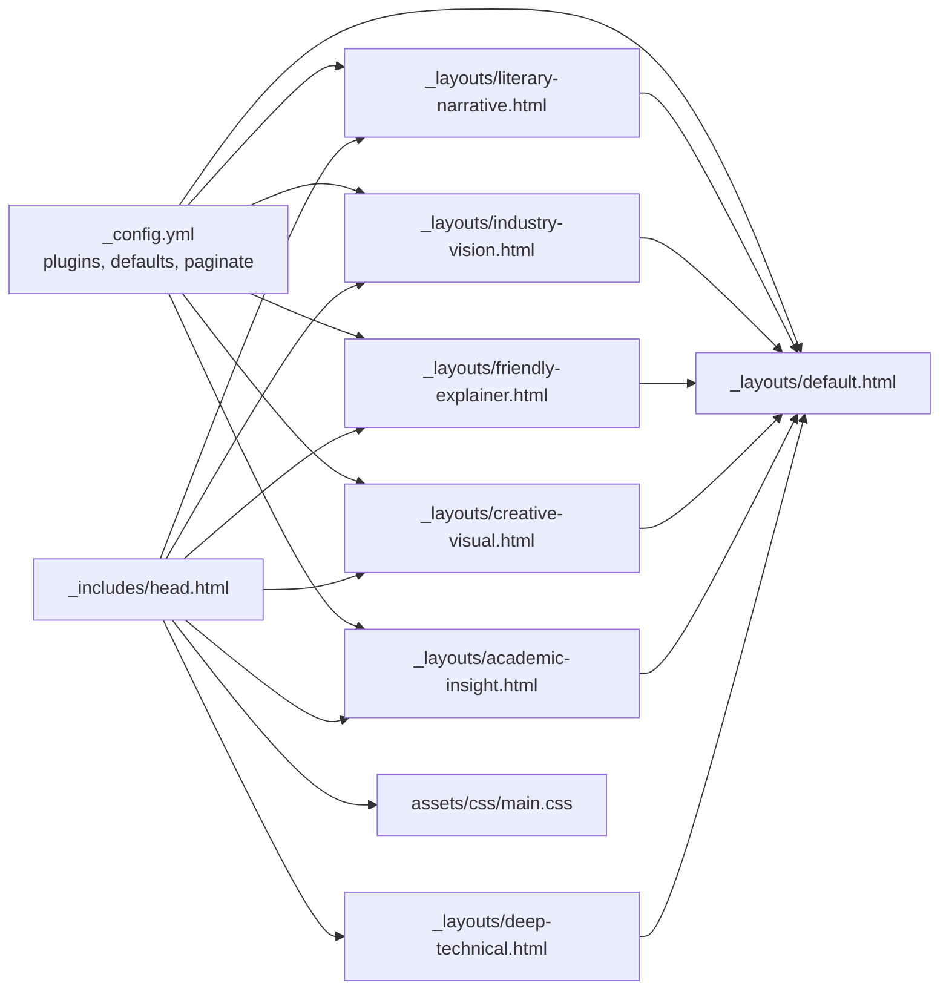

**Diagram sources**
- [_config.yml:19-32](file://_config.yml#L19-L32)
- [_layouts/default.html:1-12](file://_layouts/default.html#L1-L12)
- [_layouts/deep-technical.html:1-22](file://_layouts/deep-technical.html#L1-L22)
- [_layouts/academic-insight.html:1-27](file://_layouts/academic-insight.html#L1-L27)
- [_layouts/creative-visual.html:1-19](file://_layouts/creative-visual.html#L1-L19)
- [_layouts/friendly-explainer.html:1-26](file://_layouts/friendly-explainer.html#L1-L26)
- [_layouts/industry-vision.html:1-20](file://_layouts/industry-vision.html#L1-L20)
- [_layouts/literary-narrative.html:1-22](file://_layouts/literary-narrative.html#L1-L22)
- [_includes/head.html:15-18](file://_includes/head.html#L15-L18)
- [assets/css/main.css:50-56](file://assets/css/main.css#L50-L56)

**Section sources**
- [_config.yml:19-32](file://_config.yml#L19-L32)
- [_layouts/default.html:1-12](file://_layouts/default.html#L1-L12)
- [_layouts/deep-technical.html:1-22](file://_layouts/deep-technical.html#L1-L22)
- [_layouts/academic-insight.html:1-27](file://_layouts/academic-insight.html#L1-L27)
- [_layouts/creative-visual.html:1-19](file://_layouts/creative-visual.html#L1-L19)
- [_layouts/friendly-explainer.html:1-26](file://_layouts/friendly-explainer.html#L1-L26)
- [_layouts/industry-vision.html:1-20](file://_layouts/industry-vision.html#L1-L20)
- [_layouts/literary-narrative.html:1-22](file://_layouts/literary-narrative.html#L1-L22)
- [_includes/head.html:15-18](file://_includes/head.html#L15-L18)
- [assets/css/main.css:50-56](file://assets/css/main.css#L50-L56)

### CLI Tool (wiki.py)
- Commands: serve (Jekyll local preview), build (static site), admin (Flask server), new (create post), list (posts), deploy (git add/commit/push).
- Integrates with Jekyll and project root for seamless development and deployment workflows.

**Section sources**
- [wiki.py:35-130](file://wiki.py#L35-L130)

## Expanded Content Types and Styles

### Six Distinct Blog Styles

The system now supports six distinct blog styles, each designed for different content types and presentation needs:

#### Academic Insight Style
- **Purpose**: Scholarly articles with citation-heavy content
- **Inspiration**: Yann LeCun's academic writing style
- **Features**: Dedicated abstract section, academic typography, citation-friendly layout
- **Best for**: Research papers, technical analyses, academic discussions

#### Literary Narrative Style (耕烟煮云)
- **Purpose**: Literary and narrative content with poetic elements
- **Inspiration**: Chen Chunsheng's poetic prose style
- **Features**: Ink-wash aesthetic, drop-cap typography, flowing paragraph spacing
- **Best for**: Literary fiction, narrative essays, creative writing
- **Updated** Enhanced with sophisticated ink-wash visual design and LLM-based rewriting capabilities for improved literary quality

#### Creative Visual Style
- **Purpose**: Visual storytelling with rich media integration
- **Inspiration**: Jim Fan's visual presentation style
- **Features**: Full-width images, gallery layouts, artistic typography
- **Best for**: AI art showcases, visual demonstrations, creative projects

#### Industry Vision Style
- **Purpose**: Industry analysis and forward-looking perspectives
- **Inspiration**: Li Kaifu's industry insights
- **Features**: Bold typography, trend-focused content
- **Best for**: Market analysis, industry forecasts, strategic insights

#### Friendly Explainer Style
- **Purpose**: Accessible explanations with TL;DR summaries
- **Inspiration**: Digital Life Khazik's conversational style
- **Features**: TL;DR boxes, conversational tone, simplified explanations
- **Best for**: Educational content, beginner-friendly guides
- **Updated** Enhanced with LLM-based rewriting for conversational quality

#### Deep Technical Style
- **Purpose**: Code-intensive technical content
- **Inspiration**: Andrej Karpathy's technical writing
- **Features**: Code highlighting, technical depth, developer-focused layout
- **Best for**: Programming tutorials, technical specifications, code examples

### Literary Narrative Layout Format

The literary narrative layout provides a sophisticated framework for poetic content presentation:

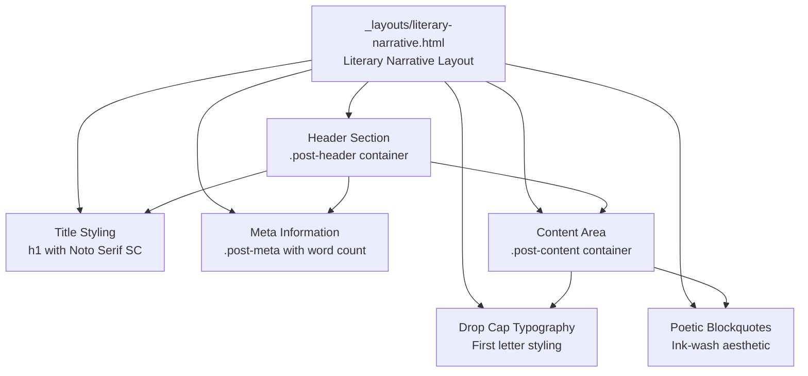

**Diagram sources**
- [_layouts/literary-narrative.html:4-21](file://_layouts/literary-narrative.html#L4-L21)

**Section sources**
- [_layouts/literary-narrative.html:1-22](file://_layouts/literary-narrative.html#L1-L22)
- [assets/css/literary-narrative.css:1-148](file://assets/css/literary-narrative.css#L1-L148)

### Literary Narrative CSS Styling

The literary narrative style features comprehensive CSS styling for an immersive reading experience:

#### Visual Design Elements
- **Ink-Wash Background**: Subtle gradient background (#5c6b73) with deep background blending
- **Serif Typography**: Noto Serif SC font family for authentic literary feel
- **Generous Spacing**: 1.5em paragraph spacing for breathing room and readability
- **Drop-Cap Implementation**: First letter styling with 3.5em font size and text shadow effects

#### Content Styling Features
- **Blockquote Design**: Ink-wash aesthetic with quotation mark decoration and soft backgrounds
- **Inline Code Styling**: Subtle background with muted color scheme
- **Link Styling**: Underline with text-shadow and hover effects
- **Image Enhancement**: Rounded corners with soft shadow effects
- **Horizontal Rule**: Decorative three-dot pattern for section division

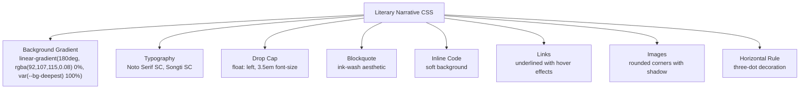

**Diagram sources**
- [assets/css/literary-narrative.css:4-148](file://assets/css/literary-narrative.css#L4-L148)

**Section sources**
- [assets/css/literary-narrative.css:1-148](file://assets/css/literary-narrative.css#L1-L148)

### Style Selection and Management

The uploader module now manages six distinct styles with their respective properties:

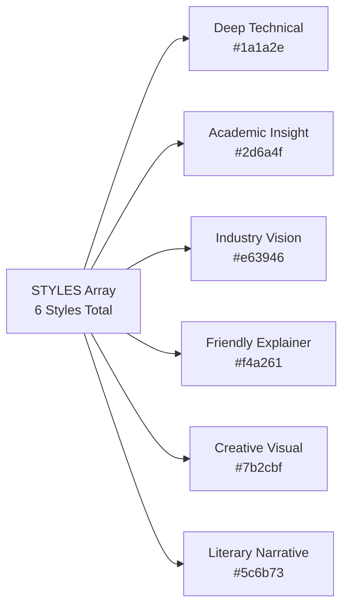

**Diagram sources**
- [app/uploader.py:25-38](file://app/uploader.py#L25-L38)

**Section sources**
- [app/uploader.py:25-38](file://app/uploader.py#L25-L38)
- [app/uploader.py:46-53](file://app/uploader.py#L46-L53)

### Content Management Enhancements

The system now supports enhanced content management with expanded categorization:

- **Front Matter Extensions**: Academic insight articles can include abstract fields
- **Style-Specific Features**: Each layout provides unique content presentation capabilities
- **Enhanced Tagging**: Support for academic, literary, and technical tagging systems
- **Multi-Format Support**: Seamless handling of research papers, literary works, and technical documents
- **Updated** LLM Integration: Automatic content enhancement for literary and friendly styles

**Section sources**
- [_posts/2025-01-20-emergence-reasoning-llm.md:1-41](file://_posts/2025-01-20-emergence-reasoning-llm.md#L1-L41)
- [app/uploader.py:126-129](file://app/uploader.py#L126-L129)

## Article Illustration Skills Capabilities

### Enhanced Visual Content Creation

The system now includes comprehensive article illustration skills capabilities through the Baoyu Article Illustrator skill:

#### Configuration and Preferences
- **Watermark Support**: Optional watermarking with configurable position and opacity
- **Preferred Style**: Default sci-fi style matching dark-themed blog aesthetics
- **Output Directory**: Independent output directory configuration
- **Language Support**: Chinese language preference with zh-CN locale
- **Custom Styles**: Extensible custom style system for additional visual themes

#### Integration with Article Creation
- **Automatic Configuration**: Loads EXTEND.md settings during article generation
- **Style Consistency**: Ensures visual themes align with chosen blog layout
- **Quality Enhancement**: Provides enhanced visual content creation workflows

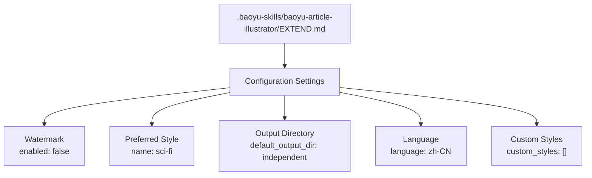

**Diagram sources**
- [.baoyu-skills/baoyu-article-illustrator/EXTEND.md:1-15](file://.baoyu-skills/baoyu-article-illustrator/EXTEND.md#L1-L15)

**Section sources**
- [.baoyu-skills/baoyu-article-illustrator/EXTEND.md:1-15](file://.baoyu-skills/baoyu-article-illustrator/EXTEND.md#L1-L15)

### LLM-Based Content Enhancement

The system integrates advanced LLM capabilities for enhanced content creation:

#### Literary Narrative Enhancement
- **Pola Nice Writer Prompt**: Sophisticated literary writing style with poetic elements
- **Cultural References**: Incorporates classical Chinese literature influences
- **Narrative Techniques**: Advanced storytelling methods and structural enhancements
- **Poetic Imagery**: Focus on metaphorical language and atmospheric descriptions

#### Friendly Explainer Enhancement  
- **Khazik Writer Prompt**: Conversational, accessible writing style
- **Personal Experience**: Authentic storytelling from real-world experiences
- **Cultural Context**: Bridging technical topics with everyday understanding

#### Generic Content Optimization
- **Structure Enhancement**: Adds clear section headings and logical organization
- **Formatting Cleanup**: Removes redundant formatting and improves readability
- **Technical Preservation**: Maintains technical accuracy while improving accessibility

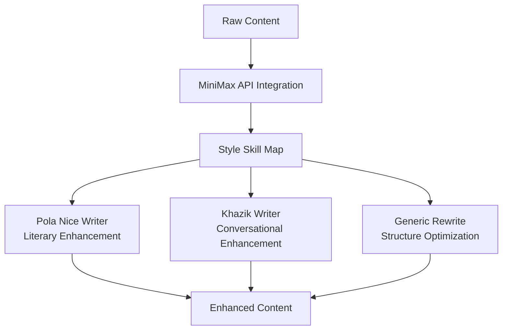

**Diagram sources**
- [app/uploader.py:126-149](file://app/uploader.py#L126-L149)
- [app/uploader.py:170-211](file://app/uploader.py#L170-L211)

**Section sources**
- [app/uploader.py:126-149](file://app/uploader.py#L126-L149)
- [app/uploader.py:170-211](file://app/uploader.py#L170-L211)

## Dependency Analysis
- Python dependencies: Flask, Flask-Login, PyMuPDF, Mammoth, html2text, python-dotenv, python-slugify.
- Ruby dependencies: Jekyll, jekyll-feed, jekyll-seo-tag, jekyll-paginate.
- **Updated** LLM dependencies: MiniMax API integration for content rewriting services.
- Internal coupling:
  - uploader.py depends on converter.py, Jekyll build, and MiniMax API.
  - auth.py depends on SQLite and mailer.py.
  - app/__init__.py centralizes DB initialization and blueprint registration.

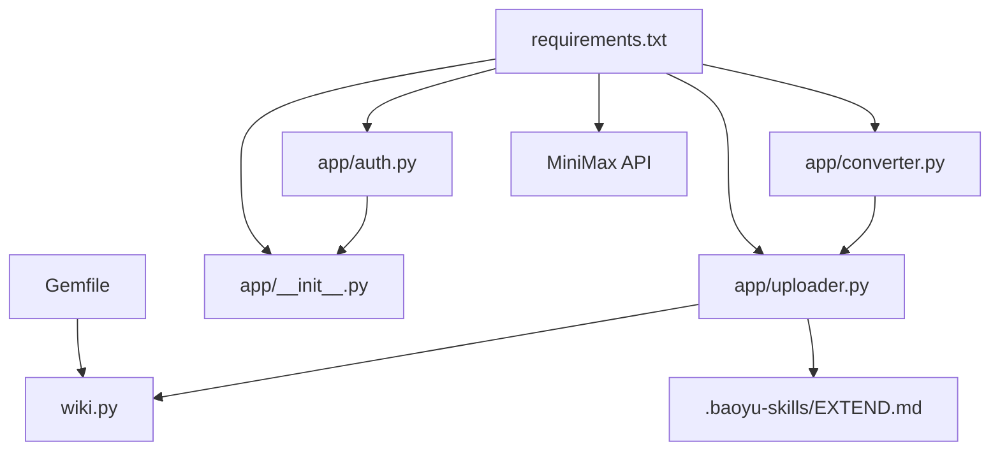

**Diagram sources**
- [requirements.txt:1-8](file://requirements.txt#L1-L8)
- [Gemfile:1-7](file://Gemfile#L1-L7)
- [app/__init__.py:43-59](file://app/__init__.py#L43-L59)
- [app/auth.py:13-13](file://app/auth.py#L13-L13)
- [app/converter.py:1-1](file://app/converter.py#L1-L1)
- [app/uploader.py:18-19](file://app/uploader.py#L18-L19)
- [wiki.py:54-60](file://wiki.py#L54-L60)
- [.baoyu-skills/baoyu-article-illustrator/EXTEND.md:1-15](file://.baoyu-skills/baoyu-article-illustrator/EXTEND.md#L1-L15)

**Section sources**
- [requirements.txt:1-8](file://requirements.txt#L1-L8)
- [Gemfile:1-7](file://Gemfile#L1-L7)
- [app/__init__.py:43-59](file://app/__init__.py#L43-L59)
- [app/uploader.py:18-19](file://app/uploader.py#L18-L19)

## Performance Considerations
- SQLite with WAL mode improves concurrent reads/writes.
- Jekyll incremental build reduces rebuild time for single posts.
- Image extraction and saving occur during conversion; ensure sufficient disk space.
- PDF text extraction relies on PyMuPDF; scanned PDFs may fail extraction.
- HTML to Markdown conversion avoids line wrapping for readability.
- **Updated** LLM rewriting adds latency but significantly improves content quality.
- **Updated** Article illustration skills configuration loads efficiently from EXTEND.md.
- **Updated** MiniMax API integration requires proper environment configuration for optimal performance.

## Troubleshooting Guide
Common issues and resolutions:
- Authentication
  - Wrong credentials: Ensure username exists and password matches hash.
  - Unverified email: Complete QQ email verification flow.
  - Registration conflicts: Unique username/email required.
- Upload and Conversion
  - Unsupported format: Only .md, .pdf, .docx, .html accepted.
  - File too large: Limit 20MB uploads.
  - PDF extraction failures: Scanned PDFs unsupported.
  - Empty content: Provide non-empty input.
- Generation and Sync
  - Jekyll build failures: Check content validity and front matter.
  - Git configuration missing: Configure user.name and user.email.
  - Push rejected: Pull latest changes before pushing.
  - GitHub Actions build failures: Review Actions logs.
- **Updated** LLM Integration Issues
  - Missing API key: Set MINIMAX_TOKEN_PLAN_API_KEY environment variable.
  - LLM rewrite failures: Check API connectivity and quota limits.
  - Content enhancement not applied: Verify style supports LLM rewriting.
- **Updated** Article Illustration Skills Issues
  - Configuration loading failures: Ensure EXTEND.md is properly formatted.
  - Style mismatch: Verify preferred style matches blog layout.
  - Output directory issues: Check write permissions for independent directory.
- **Updated** Literary Narrative Style Issues
  - Drop-cap not appearing: Ensure content starts with a paragraph element.
  - Ink-wash effects not rendering: Verify CSS file is properly linked.
  - Font rendering problems: Check Noto Serif SC font availability.

**Section sources**
- [app/auth.py:36-48](file://app/auth.py#L36-L48)
- [app/converter.py:90-91](file://app/converter.py#L90-L91)
- [app/uploader.py:310-332](file://app/uploader.py#L310-L332)
- [app/uploader.py:420-436](file://app/uploader.py#L420-L436)
- [app/uploader.py:155-167](file://app/uploader.py#L155-L167)
- [.baoyu-skills/baoyu-article-illustrator/EXTEND.md:1-15](file://.baoyu-skills/baoyu-article-illustrator/EXTEND.md#L1-L15)

## Conclusion
The Article Presentation System offers a streamlined workflow for creating, styling, and publishing blog articles with enhanced visual content creation capabilities. By combining Flask for management, Jekyll for rendering, and LLM integration for content enhancement, it achieves simplicity, flexibility, and efficient publishing to GitHub Pages. The six blog styles enable diverse presentation while maintaining a cohesive design system, supporting everything from academic research to literary narratives, technical documentation, and enhanced visual storytelling.

**Updated** The addition of the literary-narrative layout template provides sophisticated ink-wash aesthetic design with drop-cap typography, creating an immersive reading experience for narrative-driven content that bridges traditional literary techniques with modern web publishing technologies.

## Appendices

### User Workflow (End-to-End)

**Diagram sources**
- [PRD.md:369-381](file://PRD.md#L369-L381)
- [app/uploader.py:299-437](file://app/uploader.py#L299-L437)

### Homepage Rendering
- Jekyll index.html loops through site.posts, displaying style badges, titles, dates, descriptions, and tags via pagination.

**Section sources**
- [index.html:18-68](file://index.html#L18-L68)

### Academic Insight Article Example
The system now supports academic insight articles with specialized formatting:

**Section sources**
- [_posts/2025-01-20-emergence-reasoning-llm.md:1-41](file://_posts/2025-01-20-emergence-reasoning-llm.md#L1-L41)
- [_layouts/academic-insight.html:18-26](file://_layouts/academic-insight.html#L18-L26)
- [assets/css/academic-insight.css:14-38](file://assets/css/academic-insight.css#L14-L38)

### Literary Narrative Article Example
The literary narrative style demonstrates sophisticated content presentation:

**Section sources**
- [_posts/2026-04-12-typescriptzuo-wei-javascri.md:1-195](file://_posts/2026-04-12-typescriptzuo-wei-javascri.md#L1-L195)
- [_layouts/literary-narrative.html:1-22](file://_layouts/literary-narrative.html#L1-L22)
- [assets/css/literary-narrative.css:1-148](file://assets/css/literary-narrative.css#L1-L148)

### LLM Integration Configuration
- **Environment Setup**: MINIMAX_TOKEN_PLAN_API_KEY required for content enhancement
- **Style Mapping**: Literary narrative and friendly explainer styles utilize LLM rewriting
- **Fallback Behavior**: Content enhancement gracefully falls back to generic rewriting if LLM fails

**Section sources**
- [app/uploader.py:151-167](file://app/uploader.py#L151-L167)
- [app/uploader.py:126-149](file://app/uploader.py#L126-L149)